# 作物栽培学

## 绪论

World Food Day：10月16日

### 一、粮食安全与作物生产

#### （一）粮食安全

1. Food security

   指保证任何人在任何时候**能买得到又能买得起**为维持生存和健康所必需的足够食物

2. 影响全球粮食安全的主要因素
   - 人口
   - 耕地
   - 气候
     - 全球气候变化
     - 灾害性天气频发
   - 金融
     - 农业补贴
     - 贸易限制
     - 生物加工
   - 冲突
3. 中国粮食需求与安全状况
   - 水稻、小麦、玉米基本自足
   - 大豆大量进口，高粱和大麦
   - 粮食安全没有近忧，但有远虑
4. 影响中国粮食安全的主要因素
   - 人均耕地少
   - 耕地质量差
   - 水资源贫乏
   - 生产规模小

#### （二）作物学

### 二、作物栽培学的概念、地位与特点

#### （一）农业、种植业与作物的概念

1. 农业
   - 广义：农业产业、农业服务业
   - 中义：农业产业
   - 狭义：农业生产业——种植业、养殖业
2. 作物
   - 广义：由野生植物经过人类不断选择、驯化、**利用、**演化而来的具有经济价值的**人工栽培**的植物
     - 大致可分为农作物、园艺作物、林木
     - 对广义的作物进行栽培与管理即种植业
   - 狭义：田间大面积栽培的农艺作物
     - 粮、棉、油、麻、丝、茶、糖、烟和饲料等作物
     - ……即作物栽培

#### （二）作物栽培学的概念、性质与任务

1. 概念

   研究作物生长发育和产量品质形成规律及其与环境条件的关系

   探索通过轮作复种、栽培管理、生长调控、优化决策等途径

   实现作物高产、优质、高效及其可持续性的理论、方法与技术的科学

   **产量、品质（表现型）=基因型+环境（栽培）**

2. 性质与任务

#### （三）特点

必须满足作物的生物学规律，同时具有较强的区域性、系统性和综合性

1. 作物生长的规律性
   - 生长周期……
   - 光周期、春化作用
2. 作物种植的地域性和季节性
3. 作物生产的持续性
4. 作物系统的复杂与综合性

### 三、作物栽培学的历史与现状

#### （一）作物栽培学是我国古代农业的主要内容

#### （二）作物栽培学的建立

#### （三）作物栽培学的成就

1. 三阶段
   - 改革种植制度，提高单产和总产
     - 20世纪50-60年代
   - 采用新的生产资料，挖掘作物高产潜力
     - 20世纪70-80年代
   - 高科技跨学科现代化作物栽培
     - 20世纪90年代至今
2. 主要成就
3. 代表性理论成就
   - 作物产量源库流理论
   - 作物叶龄模式理论
   - 作物群体质量理论
   - 作物化学调控理论

### 四、农作物的分类

#### （一）按用途和植物学特征分类

1. 粮食作物
   - 禾谷类作物：大部分为禾本科，但荞麦是蓼科
   - 豆菽类作物
   - 薯类作物
2. 经济作物
   - 纤维作物
   - 油料作物
   - 糖料作物：甘蔗、甜菜、甜叶菊
   - 嗜好作物：啤酒花、烟草……
3. 绿肥与饲料作物

#### （二）根据作物的生物学特性分类

1. 按感温特性分类
   - 耐寒作物（>1-3℃）
   - 喜温作物（>10℃）
2. 按光周期特性分类
   - 长日照作物
   - 短日照作物
   - 日中性作物（荞麦、豌豆）
   - 中日性作物、定日作物（甘蔗）
3. 按对二氧化碳同化途径分类
   - C3作物
   - C4作物（玉米、高粱）
   - CAM作物（龙舌兰）

#### （三）按植物科属种分类

双名法

#### （四）发展中的特用作物（特种作物）

1. 概念

   在国内外的一定范围内特有的植物或在国民经济以及人类消费中具有特殊用途的植物

2. 类型

   - 特种粮食作物
   - 特种纤维作物
   - 特种油料作物
   - 特种糖料作物
   - 特种蔬菜作物
   - 香料作物
   - 色素作物
   - 药用作物

### 五、作物栽培科学与技术的发展方向

#### （一）优质高产栽培

#### （二）省工、省力、节本、持续高效栽培

1. 抗旱节水栽培

   - 作物需水规律
   - 抗旱生理机制
   - 节水耕作方法
   - 节水供水技术

2. 少免耕与节能和环境保护技术

   - 秸秆铺覆还田
   - 播种移栽的机械技术
   - 少免耕的应用条件
   - 少免耕对土壤结构、肥力、抗侵蚀性能的影响
   - 少免耕对作物的影响及栽培配套技术

3. 化学控制技术

   减少污染

4. 定量施肥技术

   - 作物需肥规律
   - 土壤供肥规律和肥料利用效率
   - 不同田块的肥料配比、施肥方法
   - 缓释（控释）肥、菌肥、药肥的应用技术

5. 作物机械化优质高产栽培技术

   技术体系、农机具、作业流程

#### （三）无公害农产品生产

#### （四）设施栽培

#### （五）规范化、标准化栽培技术体系

#### （六）信息化栽培

更丰富的农产品，更好的生态环境

### 思考题

1. 请你谈谈作物生产的重要性。

2. 如何理解保障我国粮食安全仍然是首要任务？

3. 什么是广义的作物？什么是狭义的作物？

4. 作物栽培学的概念与任务是什么？

5. 作物栽培学的特点有哪些？

6. 为什么说作物栽培学是一门既古老又年轻的学科？

7. 我国作物栽培学的发展过程怎样？近代取得的主要成就有哪些？

8. 按植物学位置与用途农作物划分为哪几部？各有哪些类？并熟悉主要农作物的分类位置。

## 小麦栽培学

### 一、概述

#### （一）小麦生产的意义与地位

1. 全球种植的三大粮食作物之一

2. 国际贸易的主要农产品

3. 多种多样的加工产品

   面筋——麦醇溶蛋白、谷蛋白

4. 适应性强、分布广

5. 种植制度多样，提高复种指数

   - 种植制度 cropping system：一个农业地区在一定时期或者几年内适应当地条件而形成的一整套农作物种植方式
   - 复种指数 multiple-cropping index：耕地上全年内农作物的总播种面积与耕地面积之比
   - 间作：同一田块中在相同生长季节内种植两种或以上的作物
   - 套种：同一田块在上一种作物生长后期在预留空间种植另一种作物

#### （二）小麦生产概况

1. 世界小麦种植面积与产量

   - 冬小麦：头年（上一年）秋冬播种，第二年夏季收获的小麦
   - 春小麦：当年春季播种，当年夏、秋季收获的小麦（气温低，难越冬）

   （1）冬春比例：约为3:1，春小麦集中在美国、俄罗斯、加拿大，近90%

   （2）产量和面积：2021年全球小麦收获面积约2.23亿公顷，总产7.76亿吨，单产**3.5吨/公顷**（230公斤/亩左右）

   - 1公顷=15亩，zjg2km*2km（400公顷，6000亩）

   （3）主产国和高产国

   - 主产国
     - 面积超过1.5亿亩（1000万公顷）的国家：中国、俄罗斯、印度、美国、澳大利亚、加拿大
   - 高产国

2. 世界小麦增产的主要经验

   （1）世界各国发展小麦生产的途径

   - 种植面积增加，但耕作粗放，单产较低
   - 土地资源少国家，依靠高度机械化和科学管理

   （2）主要措施

   - 良种
   - 肥料
   - 地力
   - 灌溉
   - 合理密植，化学除草

3. 中国小麦生产概况

   （1）冬春比例：春小麦种植面积占16%左右，产量占12%

   （2）产量和面积：2021年小麦种植面积2291万公顷，总产1.336亿吨，单产约5630公斤/公顷

   （3）生产省和高产省

   - 主产省：河南、山东、安徽、江苏、河北
   - 高产省区：西藏（6512kg/公顷），山东（6011kg/公顷），河南（5950kg/公顷），河北（5551kg/公顷），安徽（5357kg/公顷）
   - 高产记录**：14610kg/公顷（2017，河北）**

4. 小麦生产的发展及其主要原因

   - 推广种植高产、抗病的矮秆、半矮秆小麦新品种 ; 灌溉面积扩大 ; 肥料投入增加

5. 小麦产况预测

   小麦需求增长

6. 浙江省小麦生产发展简况

   - 30-33万公顷，各地均有种植
   - 水田小麦和旱地小麦
   - 主要问题
     - 病害，赤霉病
     - 雨水多
     - 高温
     - 籽粒蛋白质和面筋含量低
   - 发展对策：选用专用型小麦，提高单产，降低生产成本

#### （三）中国和浙江省小麦生产的分区

1. 中国小麦种植类型与区划

   （1）种植类型：普通小麦占绝对多数，密穗小麦、圆锥小麦、硬粒小麦仅为零星种植

   - 美国、加拿大等硬粒小麦种植面积扩大。因为面筋含量高，但对Cd的吸收高

   （2）种植区划：根据自然条件、小麦品种类型、种植制度、播种季节等特点划分10个麦区

   - 东北春麦区
   - 北方春麦区
   - 西北春麦区
   - **北方冬麦区**
   - **黄淮冬麦区**
   - **长江中下游冬麦区**
   - 西南冬麦区
   - 华南冬麦区
   - 新疆冬春麦区
   - 青海西藏春冬麦区

2. 浙江省小麦生产分区

   （1）气候特点：平原水网地带，地下水位高，土壤湿度大，降水不均匀，烂冬、烂春

   （2）种植区划：平原稻麦区（杭嘉湖），沿江沿海棉麦区，丘陵稻麦区，红黄壤地区（衢州）

### 二、小麦栽培的生物学基础

#### （一）起源与分类

栽培小麦：禾本科小麦族（*Triticeae*）小麦亚族小麦属（*Triticum*）

1. 分类

   （1）舒尔茨：按染色体数目，14条一粒系，28条二粒系，42条普通系；各系分为野生种、带皮栽培种和裸粒栽培种

   （2）麦基

   （3）道罗非耶夫

2. 小麦的进化

   - 野生一粒小麦（AA）
   - 塔斯奇小麦（方穗山羊草）（DD）
   - BB？某种山羊草——染色体饰变，难以确定B供体
   - 野生种研究潜力大

3. 鉴别性状

   - 穗的形状
   - 护颖形状
   - 芒的有无
   - 种子形状
   - 种子颜色
     - 红皮：休眠性好，浙江，减少穗发芽
     - 白皮：出粉率高

#### （二）小麦发育特性及其在生产上的应用

1. 春化阶段

   （1）低温起主导作用。5个基因控制，累加效应

   （2）分三类：

   - 冬性品种：春化要求温度低，时间长，北方冬小麦
   - 半冬性品种：长江中下游地区
   - 春性品种：春化要求低，耐寒性弱。北方春小麦和长江中下游地区早熟品种及华南地区冬小麦
   - 注意区分春、冬小麦与以上概念

   （3）春化生理学

   - 春化部位：萌动的胚或幼苗生长点
   - 不同类型特性
     - 冬性：耐寒能力强，匍匐，叶片狭而色浓
     - 春性：耐寒能力弱，直立，叶色淡
   - 结束标志：二棱期
   - 生理代谢变化：春化结束阶段后，抗寒力显著减弱

2. 光照阶段

   光周期

   （1）类型

   - 反应迟钝型：能在各种日长下通过，南方春性小麦
   - 反应中等型：小于8h不能完成，半冬性品种
   - 反应敏感型：须大于12h完成，北方高纬度地区小麦

   - 高纬度地区是敏感型，低纬度地区是迟钝型。
   - 冬小麦都是敏感型？×（南方）中国的春小麦都是敏感的？√

   （2）光照反应生理学

   - 光照阶段最适温度：15-20℃
   - 感应部位：叶片
   - 影响因子：光照强度不足，慢；氮肥水平高，时间延长
   - 结束标志：雌雄蕊分化期
   - 延长光照阶段，增加每穗的小穗和小花数

3. 阶段发育理论对小麦引种制种上的指导意义

   - 高纬度地区品种的引入——生育期延长
   - 低纬度地区品种的引入——防止冻害
   - 调节花期：播期与低温处理
   
   光照可以部分替代春化，22h

#### （三）小麦器官发育与产量形成

营养生长期（分蘖期）、营养生长与生殖生长并进期（孕穗期）、生殖生长期（麦粒形成灌浆）

1. 小麦萌芽和出苗

   （1）麦粒的结构

   - 颖果
   - 皮层、胚、胚乳

   （2）发芽

   - 发芽过程：胚芽鞘伸长突破种皮，胚芽鞘破皮。水分过多，可能胚芽鞘先出
   - 发芽标准：胚根与麦粒等长，胚芽为一半
   - 发芽条件：
     - 最大田间持水量

   （3）出苗

   - 出苗标准：第一真叶从芽鞘顶端伸出2-3cm（主要可以看到），田间50%苗
   - 出苗所需时间
     - 播种到萌发：50-60℃积温
     - 伸长1cm：10-12℃积温
     - 每长1片叶：80℃积温
   - 影响出苗的好坏和快慢的条件：播后温度、土壤水分、整地质量

2. 根的生长

   （1）根的生长过程

   - 种子根
     - 从胚轴上长出，第一真叶展开停止发生
   - 次生根
     - 三叶期后在茎节上发生
   - 主茎叶龄（n）与发根节位的关系：n-3。一、二分蘖n-2
   - 根系分布
     - 品种
     - 水分

   （2）根的功能

   - 种子根：稳产性
   - 次生根：增产
     - 次生根分组
       - 下层根
       - 中层根
       - 上层根

   （3）影响根系生长的条件

   - 温度：对高温敏感度高于地上部，最高30℃
   - 水分：田间最大持水量60%-70%
   - 养分：N，P
   - 光照

3. 叶的生长

   叶片、叶舌、叶耳、叶枕、叶鞘

   （1）叶的分化与形成

   - 过程：
     - 叶原基分化期、细胞分裂期和伸长期
   - 功能期：叶片定型（2/3长度）到衰老枯黄
   - 功能期持续天数：品种、叶位（旗叶）、气候、栽培条件
   - **主茎叶数**：品种、播期、气候。与营养生长长短有关
   - 影响因子：温度、肥水、光照

   （2）叶的功能及分组

   - 近根叶
     - 着生在分蘖节
     - 拔节前定型和起作用
   - 茎生叶
     - 着生在伸长节上
     - 一般均为 **4—6 叶**

   （3）叶面积指数（LAI）

- 单位面积土地的植株（绿色）叶面积

  - 与产量呈正相关，适宜的最大LAI与品种、生态条件有关

    - 禾谷类作物光补偿点在800-1000Lx？
    - 直立型叶片

       - 变化范围

   （4）主茎叶片数及其变异规律

   - 遗传和环境影响
   - 杭州 : 春性品种 7—10 片，冬性品种 12—15 片；半冬性10 一 12 片
   - 可判断小麦品种的春、冬性
   - 凡是促进春化，叶片数减少。营养生长→生殖生长

4. 分蘖及其成穗

   （1）分蘖节的作用

   - 发生分蘖
   
   - 贮藏养分
   
   （2）分蘖的发生
   
   - **叶蘖的同伸关系**
   
   - 主茎胚芽鞘分蘖忽略不计，n-3
   
   - 分蘖提前，表明生长好
   

   （3）分蘖消长与成穗

   - 有效分蘖和无效分蘖
     - 成熟时具有5粒以上籽粒的穗的分蘖
   - 分蘖动态曲线
     - 北方小麦：双峰曲线（冬天温度低，部分死亡）
     - 南方冬麦区：单峰曲线
   - 拔节时，有3片以上叶片的分蘖可继续生长，**关键有无根系**

   （4）影响分蘖及成穗的条件

   - 品种
   - 温度
   - 光照强度
   - 水分
   - 养分：氮素

5. 茎的生长

   （1）茎的形态与生长

   - 形态：节间长度自下而上**渐次增长**，抗倒伏、透光
   - 生长条件：光照阶段结束，10℃以上
   - 拔节                                                                                                                                                                                                                                                                                                                                                                                                                                                                                                                                                                                                                                                                 

   （2）影响条件

   温度、光照、养分（N控制，P、K）、水分

6. 穗的分化与发育

   （1）穗的结构

   穗。小穗基部**两片护颖**，多朵小花（外稃内稃……）

   （2）分化过程

   

   （3）幼穗分化与叶片生长的关系

   品种叶片差异在营养生长期（二棱期前）

   - 伸长期
   - 单棱期
   - 二棱期
   - 小花原基分化期
   - 雌雄蕊分化期
   - 药隔形成期
   - 剑叶抽出过程至孕穗期

   （3）增加穗粒数的途径

   - 增加途径：
     - 小花分化数
     - 小花结实率
   - 小花退化原因
     - 穗位上着生位置和养分竞争能力的差异

   - 小花退化阶段
     - 第一阶段为急剧退化期，从旗叶与倒二叶的叶环距4—7cm(四分体时期)至穗全部露出剑叶鞘
     - 第二阶段为缓退期，从穗全部露出剑叶鞘到开花

   （4）影响穗分化的条件

   - 日照时数：短光照延长小穗小花分化期
   - 温度：较低温度下光照阶段进行缓慢，穗分化期延长，有利形成大穗
   - 水分
   - 养分（氮素，P）

7. 籽粒的发育与灌浆成熟

   （1）抽穗、开花和受精

   - 抽穗：顶小穗露出剑叶鞘
   - 开花顺序：**中部稍上小穗**先开花，向上下依次开花；每一小穗基部小花先开
   - 影响开花条件：温度（20℃）、湿度

   （2）籽粒发育与灌浆

   - 胚和胚乳：籽粒体积的大小，取决于胚乳细胞数的多少
   - 禾谷类作物：碳水化合物70-80%，蛋白质10%~。前期蛋白质积累较快，籽粒灌浆不畅，粒重越小，蛋白质含量越高
   - 籽粒形成与灌浆成熟
     - 乳熟期：糖分（蔗糖）→淀粉
     - 蜡熟期：可溶性物质大量转化为非溶性的贮藏物质
     - 完熟期：植株枯黄，麦粒变硬
   - 小麦粒重可塑性大，颖片张开

   （3）提高粒重的途径

   - 提高库容：品种遗传特性和籽粒形成期胚乳细胞的发育状况
   - 增加源强度：剑叶（旗叶）、倒二叶、倒三叶，芒。防早衰

### 三、栽培技术

#### （一）高产群体结构和合理密植

1. 小麦高产的群体结构

   （1）概念

   - 群体大小：苗、茎、蘖、穗的多少，叶面积指数的大小和根系发达程度等
   - 群体分布：叶片的长度、叶层分布、植株分布的均匀和整齐程度等
   - 群体动态：不同生育阶段群体叶面积变化和分蘖消长动态等
   - **群体结构：各生育阶段的群体大小、分布、长相及其动态变化**

   （2）生产上常用的群体指标

   - 苗、茎蘖、穗数：单位面积的苗数、年前茎蘖数、年后最高茎蘖数和穗数
   - 叶面积指数
   - 产量结构：穗数、粒数和粒重等产量构成因素

2. 确定合理的基本苗

   （1）计算公式

   - $$
     每公顷基本苗数=\frac{每公顷预期穗数}{单株平均穗数}
     $$

   - $$
     每公顷播种量（kg）=\frac{每公顷基本苗数}{每kg种子粒数×种子净度×发芽率×田间出苗率}
     $$

   - $$
     每kg种子数=1000×\frac{1000}{千粒重（g）}
     $$

   - 田间出苗率一般70%-80%

   （2）合理基本苗的确定原则

   - 原则：满足所需必要穗数的前提下，尽可能减少基本苗
   - 理由：基本苗数越少，单株成穗越多，单穗重越高。（个体发育健壮）

3. 群体发展的促控指标

   （1）有效分蘖可靠叶龄期的茎蘖数

   **有效分蘖可靠叶龄期的确定（N-n+2）。N，主茎叶片数；n，主茎伸长节间数**

   适当提前茎蘖数的高峰期和降低高峰茎蘖数（减少无效分蘖）

   （2）干物质积累与叶面积指数

#### （二）播种技术

1. 适期播种
   - 适播期根据当地气候条件、品种特性、栽培制度等而定
   - 冬小麦：满足冬前形成壮苗所需积温，又不致当年拔节
2. 种子处理
   - 精选种子
   - 消毒
3. 播种方式
   - 条播
   - 撒播（浙江省普遍）
   - 点播
4. 播种量
   - 每公顷75-150kg
   - 斤种万苗：500g-1000苗
   - 土壤肥沃土壤肥力较差——以主茎穗为主；土壤肥沃——以分蘖成穗为主
5. 提高播种质量
   - 要求：播深适宜（2-3cm，寒冷干燥-增加深度）、深浅一致、落子均匀、消灭三子（深子、露子、丛子）

#### （三）需肥特性和施肥原则

1. 需肥和吸肥规律

   （1）需肥量

   - 生产100kg麦粒，N 3kg，P 1.5kg，K 3kg，**2:1:2**
   - 产量水平提高，K提高

   （2）不同生育期养分代谢特点

   - 苗期：氮素代谢旺盛，
   - 拔节期：P、K肥
   - 孕穗期：养分的吸收和积累最大，N肥
   - 抽穗开花后，养分吸收量一般较少
   - 产量水平↑，后期养分吸收量↑

2. 施肥种类及其作用

   - 基肥：播前施用
   - 苗肥：速效氮肥为主；促进发根和分蘖
   - 拔节孕穗肥：小麦生长旺期，需肥量多
   - 根外追肥：抽穗后，防止叶片早衰

3. 施肥量和高产施肥原则

   （1）施肥量：差异大，不用记。不同养分土壤中有效性不同，速效磷（10ppm）、速效钾（80-120ppm）指导施肥。

   （2）施肥原则：三个有利于（有效分蘖、减少无效分蘖、防止小穗小花退化）。**“前促、中控、后攻”的“两促”施肥法**

4. “两促”施肥法的增产作用

   第一促：施好基、苗肥

   第二促：施好穗肥（对提高分蘖成穗，减少小花退化，增加结实率，防止早衰和提高粒重）

   稻板免耕栽培：后期供肥差（表层），施用穗肥

#### （四）田间管理

1. 播后管理：水分；查苗补缺

2. 水分管理：开好四沟(直沟、横沟、畦沟和隔水沟)，防止“三水”(地面水、潜层水、地下水)湿害

3. 防治除草

4. 防止倒伏

   （1）类型和危害

   - 根倒伏: 根系发育不良
   - 茎倒伏：氮肥施用过多或施用时间不当，徒长

   （2）对策

   - 矮杆抗倒伏品种
   - 适期适量播种
   - 合理施肥
   - 培土压泥
   - 镇压敲麦：抑制地上部生长，促进地下部生长
   - 喷施植物生长延缓剂

5. 防治病虫害

   - 南方麦区小麦主要病虫害：赤霉病、白粉病、锈病，粘虫和麦蚜

6. 收获与贮藏

### 四、研究进展

#### （一）轻型栽培

省工节本

小麦免耕栽培（**稻板麦**）

#### （二）优质栽培

#### （三）节水栽培

#### （四）群体质量栽培

### 思考题

1. 如何理解发展小麦生产的重要性？

   - 全球种植的三大粮食作物之一
   - 国际贸易的主要农产品
   - 多种多样的加工产品
   - 适应性强、分布广

2. 请谈谈全球与我国的小麦生产现状与发展趋势。

3. 什么是间作？什么是套种？什么是复种指数？

   （1）间作：同一田块中在相同的生长季节内种植两种或以上的作物

   （2）套种：同一田块在上一种作物生长后期在预留空间种植另一种作物

   （3）复种指数：耕地上全年内农作物的总播种面积与耕地面积之比

4. 什么是冬小麦和春小麦？什么是冬性小麦与春性小麦？

   （1）冬小麦和春小麦

   - 冬小麦：头年（上一年）秋冬播种，第二年夏季收获的小麦
   - 春小麦：当年春季播种，当年夏、秋季收获的小麦

   （2）冬性小麦与春性小麦

   - 冬性品种：**春化要求温度低，时间长**，0—8°C温度下35天以上，北方冬小麦。
   - 半冬性品种：3-15°C 15-35天，长江中下游地区大多数品种属此类
   - 春性品种：5-20°C左右5-15天，北方春小麦和长江中下游地区栽培的早熟品种及华南地区冬小麦属此类

5. 为什么南方冬小麦的春后低温为害要比冬季低温重？

   春化结束阶段后，生理代谢发生明显变化，代谢强度加快，蒸腾强度提高，细胞持水力降低，叶绿素含量增加，物质积累速度加快，呼吸强度提高，**抗寒力显著减弱**。

6. 小麦春化与光照反应的基本过程怎样？

   （1）春化：

   （2）光照反应：

7. 小麦种子发芽的过程怎样？如何预测出苗的时间？

   （1）发芽过程：胚根鞘伸长先突破种皮而“露嘴”，随后胚芽鞘破皮而出。

   （2）预测出苗时间：播种到萌发，约需50-60℃积温；芽鞘每伸长1cm需10--12℃积温。出苗后每长1片叶，约需80℃左右的积温。

8. 何谓叶面积指数？小麦各生育的叶面积指数动态怎样？决定最大叶面积指数的因子有哪些？

   （1）叶面积指数(LAI)：单位面积土地的植株绿色叶面积

   （2）动态变化：

   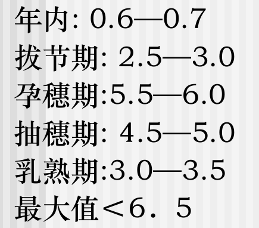

   （3）因素

   - 品种
   - 生长环境：光温水热肥
   - 生长阶段
   - 管理措施

9. 简述分蘖发生规律？如何从主茎叶片数预测分蘖数？

   小麦主茎叶片数与主茎分蘖数之间是n-3的关系。叶蘖同伸关系。

   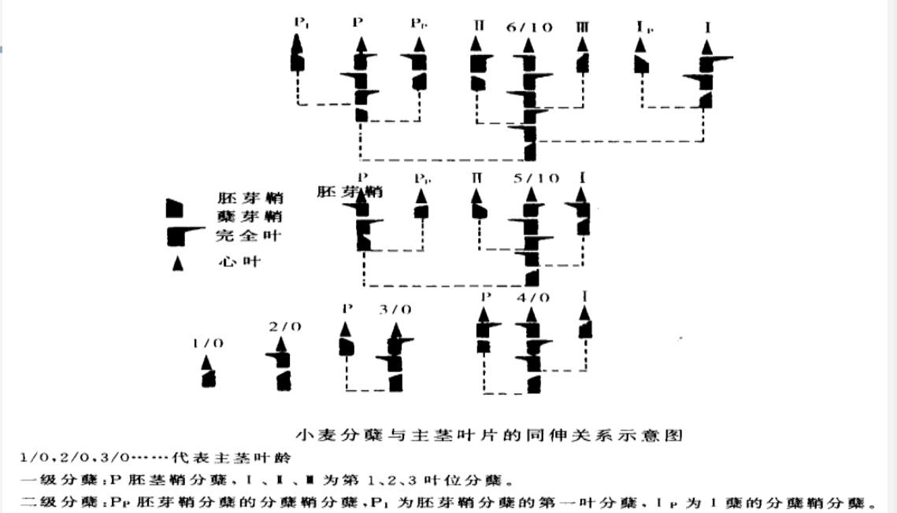

   具体表现：

   - 在**主茎长出第3叶**时，在条件适合时可发生胚芽鞘蘗，但在一般大田生产中，由于胚芽鞘节在土壤中相对较深和条件较差，胚芽鞘分蘖很少出现。因此，**生产上通常不把胚芽鞘蘖计算在内。**
   - 主茎的心叶叶位（以N表示）与1级分蘖心叶相差3个叶位，表现为N-3的同伸关系。一般当主茎第4片叶露尖时，第1叶腋中长出的分蘖开始露尖；主茎第5叶露尖时，第2片叶的叶腋中长出的分蘖露尖；主茎第6叶露尖时，第3叶的叶腋中长出的分蘖露尖（依此类推）。
   - 1级、2级、3级……分蘖
   - 一般生长正常的小麦在不计算芽鞘蘖的情况下，主茎3叶时有1个茎（主茎)，4叶时有1个主茎和1个1级分蘖，共2个茎；5叶时有1个主茎和2个1级分蘖，共3个茎；6叶时有1个主茎、3个1级分蘖及1个2级分蘖，共5个茎；7片叶时有1个主茎、4个1级分蘖和3个2级分蘖，共8个茎；8叶时有1个主茎、5个1级分蘖、6个2级分蘖和1个3级分蘖，共13个茎。

10. 小麦穗分化过程怎样？各分化期与主茎叶片的同伸关系又是如何？

    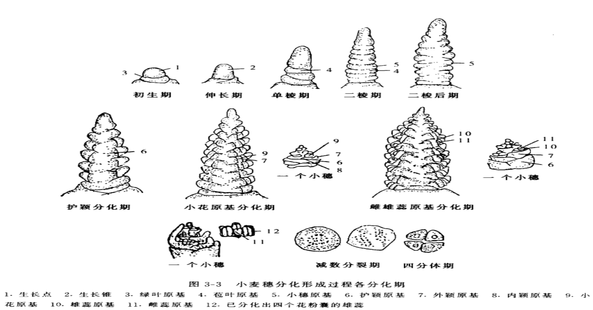

    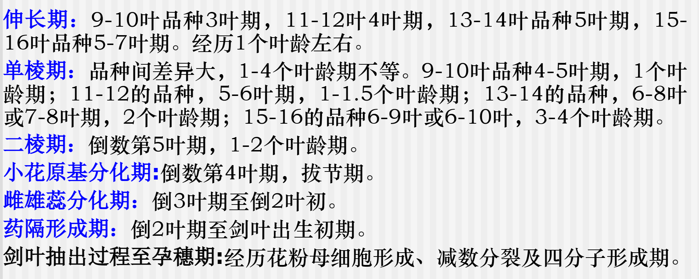

11. 小麦穗的结构怎样？穗的开花程序如何？

    结构：可分为穗轴和小穗两个部分，穗轴由节片组成，每节着生一枚小穗。小穗由两枚颖片、小穗轴及若干小花组成。小花由外稃和内稃、鳞片(两枚)、雄蕊(3 枚)和雌蕊(1枚)组成。

    开花程序：同一穗上以**中部稍上小穗**先开花，然后向上下依次开花；每一小穗基部小花先开，由下而上相继开花；上午9~11时和下午3~5时开花高峰

12. 小麦单株穗数、每穗粒数和千粒重分别在哪些发育期决定的？请谈谈如何增加穗数、粒数与粒重。

    单株穗数主要在分蘖期决定，每穗粒数主要在拔节孕穗期决定，千粒重主要在灌浆期决定。

    如何提高：

    - 提高库容：籽粒容积是影响粒重的重要限制因子，可以通过提高库容来增加千粒重
    - 增加源强度：延缓开花后叶片衰老，维持较大的叶面积持续期，增加干物质生产，从而增加千粒重
    - 合理施肥：促进有效分蘖的发生；减少无效分蘖的发生；防止小穗小花退化，提高结实率和粒重。“两促”施肥法，提高分蘖成穗，减少小花退化，增加结实率，防止早衰和提高粒重与增产
    - 做好田间管理：如光照、温度、水分等条件。短光照延长小穗小花分化期，较低温度下有利形成大穗，水分不足幼穗分化期缩短。病虫害防治
    - ……

13. 衡量小麦群体结构优劣的指标有哪些：

    群体结构：各生育阶段的群体大小、分布、长相及其动态变化

    - 群体大小：苗、茎、蘖、穗的多少，叶面积指数的大小和根系发达程度等；
    - 群体分布：叶片的长度、叶层分布、植株分布的均匀和整齐程度等；
    - 群体动态：不同生育阶段群体叶面积变化和分蘖消长动态等。

    生产上常用的群体指标

    - 苗、茎蘖、穗数：单位面积的苗数、年前茎蘖数、年后最高茎蘖数和穗数
    - 叶面积指数
    - 产量结构：穗数、粒数和粒重等产量构成因素

14. 请简述确定小麦合理基本苗的原则；

    在满足所需必要穗数的前提下，尽可能减少基本苗数，压缩群体起点，增加分蘖穗的比例，改善群体质量，在足穗的基础上攻大穗。

15. 小麦播种有哪几种方式？各自的优缺点是什么？

    播种方式：条播、撒播和点播。

    优缺点：

    - 条播：植株分布均匀，出苗整齐，便于田间管理和套种或间作其他作物。条播有宽幅条播、窄行条播和宽窄行条播三种方式。
    - 撒播：省工且有利于抢时播种，但覆土深浅不易一致，后期群体通风透光条件差，麦田管理不便。
    - 点播：能够使得每个穴内株间竞争作用减少，成穗率提高，增产作用明显。密点播可以缩小行距、增加穴数和减小每穴粒数，使得麦苗生长更加均匀。同时也便于集中施肥和麦田管理。

16. 小麦的施肥原则是什么？

    有利于促进有效分蘖的发生，达到早发壮苗；有利于减少无效分蘖的发生，控制茎秆基部节间的伸长，增强抗倒能力；有利于防止小穗小花退化，提高结实率和粒重；根据以上要求，高产栽培的施肥应采用“前促、中控、后攻”的“两促”施肥法。

17. 何谓小麦两促施肥法？如何保证实施两促？

    **第一促**是指施好基、苗肥。基肥的肥料类型和用量；苗肥的施用时期：2叶1心前。
    **第二促**是指施好穗肥。目的是满足小麦长穗增粒期吸肥高峰对养分的要求，对提高分蘖成穗，减少小花退化，增加结实率，防止早衰和提高粒重与增产有显著效果显。

    保证：

    - 根据当地土壤、气候、品种等情况制定合理的施肥方案；
    - 在播种前或播种时期施用基肥，并根据土壤养分状况和作物需求量确定基肥的类型和用量；
    - 在小麦拔节期进行苗期追肥，并根据作物生长情况和土壤养分状况确定追肥的类型和用量；
    - 在小麦抽穗期进行穗期追肥，并根据作物生长情况和土壤养分状况确定追肥的类型和用量。

18. 防止小麦倒伏的主要技术措施有哪些？

    （1）选用秆矮、耐肥抗倒的品种适期适量播种：适时播种的早出苗、早分蘖，苗体壮；稀播匀播，麦苗健壮，群体适中
    （2）合理施肥：肥料用量适当，采用“两促”法施肥，控制腊肥，增施有机肥和磷钾肥
    （3）培土压泥：在4--5叶期，结合清沟，利用沟泥培土压麦，抑制迟生小分蘖，延缓主茎生长，促进根系发育，使个体生育健壮，抗倒能力增强。
    （4）镇压敲麦：旺长麦在3叶期后至拔节期前多次敲麦或压麦，抑制麦苗生长，使茎秆矮壮，茎壁增厚，提高抗倒能力；注意:田土过硬或过烂时不能敲，以免敲坏麦叶或泥土粘住麦叶。
    （5）喷施植物生长延缓剂；在小麦拔节前，每亩用200~300ppm多效唑溶液50kg，叶面喷施。

## 油菜栽培学

### 一、概况

#### （一）生产意义

1. 四大食用油料作物（大豆、油菜、花生、芝麻）之一，全球第2，中国第1（占40%）
2. 用途广：油，菜籽饼（肥料、饲料）
3. 蜜源作物
4. 冬季油料作物
5. 观光农业

#### （二）油菜品质改良

1. 脂肪酸组成

   （1）提高油酸含量、降低饱和脂肪酸和亚麻酸含量，特别是降低**芥酸**含量

   （2）**低芥酸品种（<5%）**

2. 硫代葡萄糖苷（甙）

   主要在饼粕中，**低硫甙（<45μmol/g）**

   双低油菜（低芥酸、低硫甙），单低油菜

#### （三）生产概况

1. 全球栽培面积与产量

   - 总面积2800万公顷，4-4.5亿亩
   - 主产国：中国、印度、加拿大、法国、德国、英国、波兰和澳大利亚等，加拿大发展最快
   - 单产以欧洲最高

2. 中国生产情况

   （1）面积与产量

   - 总面积

   - 单产2000公斤/公顷左右
   - 总产

   （2）分布与类型

   **油菜的耐冷略弱于小麦，春油菜分布北限低于春小麦**

   - 冬油菜区：
     - 华北关中亚区
     - 长江中游亚区
     - 长江下游亚区
     - 四川盆地亚区
     - 云贵高原亚区
     - 华南沿海亚区
   - 春油菜区

   （3）发展特点

   - 种植集中：长江流域冬油菜区是最集中的产区
   - 生产发展迅速
   - 品种改良成效显著
   - 产业化经营成型

   （4）存在的主要问题

   - 多品种插花种植
   - 品质有待提升
   - 劳动成本高

   （5）市场前景预测

   - 世界油菜籽生产、贸易、消费同步增长
   - 世界油菜籽进出口贸易迅速发展
   - 国内植物油和饼粕需求增长较快，市场空间大
   - 市场需求潜力大

### 二、油菜栽培的生物学基础

#### （一）品种类型与分类

1. 植物学分类

   （1）以收获籽粒供榨油为栽培目的的十字花科（*Brassicaceae*）芸薹属（*Brassica*）植物统称

   （2）根据染色体数及其同源性

   - 基本种：
     - 黑芥（n=8）b
     - 甘蓝（n=9）c
     - 白菜型油菜（n=10）a
   - 复合种
     - 甘蓝型油菜（n=19）ac
     - 芥菜型油菜（n=18）ab
     - 埃塞俄比亚芥（n=17）bc

2. 油菜的起源

   （1）起源学说：单源发生说、多源发生说。普遍认为存在两个起源中心

   - 亚洲：以中国和印度为主，白菜型油菜和黑芥的起源中心
   - 欧洲：甘蓝和甘蓝型油菜的起源中心
   - （非洲东北部：芥菜型油菜和埃塞俄比亚芥）

3. 三大栽培类型

   白菜型、芥菜型、甘蓝型

#### （二）生育阶段

1. 苗期
   - 种子发芽、出苗到现蕾
   - 营养生长
2. 蕾薹期
   - 现蕾（主茎顶端出现绿色花蕾）到抽薹（主茎伸长达到10cm高）
   - 营养生长和生殖生长两旺
   - 薹壮、枝多、蕾多
3. 开花结果期
   - 始花到终花
   - 生殖生长
   - 果多、粒多
4. 角果成熟期
   - 终花到成熟
   - 营养生长逐渐停止
   - 争取籽粒饱满和提高含油量

#### （三）发育特性及其应用

1. 发育特性

   - 低温长日照作物
   - 春性、冬性和半冬性
     - 耐低温弱于小麦，春油菜分布纬度低于春小麦
     - 冬性油菜对春化温度要求更低……

2. 发育特性的应用

   （1）指导品种选用与播种

   （2）指导田间管理

   （3）指导引种

#### （四）器官形态及建成

1. 根系

   （1）类型与组成：直根系。一条主根+多条侧根+大量支根和细根

   （2）分布

   （3）生长过程：苗期主要长根系，春季根系向水平方向发展，盛花期根量达最大

2. 根颈

   - 油菜的脚茎，子叶以下，幼茎继续生长
   - 长短粗细及直立与否：判断油菜长势强弱和营养状况的重要形态标志之一
   - 形成：额外形成层，三生组织
   - 功能：形成不定根，贮藏养分，根茎粗短、根系发达为壮苗

3. 叶片

   （1）子叶+真叶

   （2）主茎总叶数：甘蓝型晚熟品种30-35叶。早、中熟品种20-30叶

   （3）叶片类型：

   - 长柄叶：占1/2，苗期生长，着生于缩茎段
   - 短柄叶：占1/4，现蕾后生长，着生于伸长茎段
   - 无柄叶：占1/4，抽薹后生长，着生于薹茎段

4. 茎

   蜡粉：减少水分散失，减少虫害

   （1）茎段

   - 缩茎段：基部
   - 伸长茎段：由下而上逐渐增长
   - 薹茎段：由下而上逐渐缩短

   （2）三个阶段

   - 缩头：薹的高度低于短柄叶
   - 平头：薹的高度与短柄叶齐平。平头高度（衡量油菜春发状况的重要形态指标）
   - 冒头：薹的高度高于短柄叶

5. 分枝

   （1）一次分枝，二次分枝，三次分枝

   （2）类型

   - 下生分枝型
   - 匀（中）生分支型
   - 上生分枝型

6. 花蕾发育及开花结果

   （1）发育过程

   （2）花序及花的构成

   - 无限总状花序（Raceme）
   - 常为黄色

   （3）花序分化顺序

   - 主-一次-二次
   - 分枝内，上早下迟
   - 花序内，下早上迟

   （4）花芽分化速度

   - 环境影响：主要温度
   - 苗期慢，现蕾抽苔后加快，开花期高峰
   - 有效花蕾和无效花蕾：**大致50%为有效**，现蕾前的一般有效
   - 现蕾特别是抽薹后对低温的抗性明显减弱

   （5）开花条件

   - 最适温度：12-20℃
   - 30℃以上结实不良

   （6）授粉与受精

   - **芥菜型和甘蓝型为常异交作物**，自交结实率80-90%
   - **白菜型为异花授粉作物**，异交率80-90%

7. 角果与种子发育

   （1）果实

   - 长角果（silique）
   - 两心皮，侧膜胎座

   （2）种子和油分形成

   - **千粒重3-4g**，大麦的1/10
   - 糖含量下降，油分增加
   - 含油量影响因子：品种、种皮色泽（浅色高）、气候（北方高）、养分供应

   （3）种子发育过程

8. 结角率与结籽率

   （1）结角，阴角（无效角果，只有果皮而无种子），脱落

   （2）结籽

   （3）影响因素：

   - 营养：先开花养分充足，高
   - 气候
   - 种植密度：光照

#### （五）产量构成与形成过程

1. 产量构成因素

角果总数、每角粒数、粒重

（1）粒重：变异小，后期的营养条件与物质转运

（2）每角粒数：**角果胚珠数、胚珠受精率和合子发育率**

（3）总角果数：变异最大（1-5），种植密度×单株角果数

- 合理密植：trade-off；单株角果数取决主花序（10%）、**一次分枝（70%）**与二次分枝（20%）
- 100万果得到50公斤种子，万角斤籽

2. 产量形成过程

   （1）角果数形成期：花芽分化始

   （2）每角粒数形成期：雌蕊胚珠原始体形成期

   （3）粒重形成期：受精后

### 三、栽培技术

#### （一）油菜育苗技术与直播栽培

1. 育苗技术

   （1）培育壮苗、提高秧苗素质的意义

   - 秧田期长：35-45d
   - 五叶期前后生长方式变化
   - **壮苗的标志**
     - 3个六（绿叶6-7片，苗高6寸20cm左右，根颈粗0.6-0.7cm）
   
     - 根颈粗短
   
   
   （2）苗床准备
   
   - 种过十字花科不宜，连作障碍
   
   （3）种子处理：晒种和选种
   
   （4）苗床播种：品种特性、前作收获时间和气候条件。9月底至10月初
   
   （5）苗床管理
   
   - 间苗定苗，叶不搭叶，1,2,3真叶出3次
   - 施肥浇水，移栽前，施少量起身肥（嫁妆肥）
   - 生长调节剂，防止徒长、高脚苗，多效唑PP333，烯效唑S3307
   - 防治病虫害
   
2. 大田整地和移栽

   （1）整地

   - 切忌湿耕
   - 开沟作畦
   - 免耕栽培法，稻板油菜
     - 优点：可提早7-10天移栽，早返青活棵；表土肥有利油菜早发；减少犁底层形成，使土壤保持良好结构；省工省本，保证密度；利于冬壮冬发，增加产量。
     - 缺点：烂冬年份容易导致湿害；杂草；基肥难深施，早衰

   （2）移栽

   - 移栽期：**根据苗龄和前作收获期，适时早栽**。11月上中旬
     - 苗龄叶片数。延长本田期
   - 移栽方法
     - 随拔随种，**不种隔夜苗、露水秧**
     - 分苗不伤叶，栽种不伤茎，根直叶笃，泥土揿实
   - 移栽后施“活棵肥”

3. 直播油菜的特点与栽培技术要点

   （1）生育特点

   - 省工省时
   - 根系发达
   - 抗旱、耐瘠、抗倒伏能力强
   
   （2）栽培技术要点
   
   - 精细整地，施足基肥
   - 早施苗肥和薹肥
   - 适当早播
   - 适当提高密度
   - 及时间苗

#### （二）油菜需肥特性与施肥技术

1. 需肥特性

   - 氮素：产量与品质之间的矛盾，N不能太多，多了蛋白质高、含油量低，芥酸高
     - 100kg菜籽，需吸收9-11kg
   - 磷素：反应敏感
     - 100kg菜籽，需吸收3-4kg
     - 临界土壤速效磷含量为10-15ppm，mg/kg，ug/g
   - 钾素
     - 100kg菜籽，需吸收（K2O）8.5-12.8kg
   - 白菜型对肥料利用率高，吸收量少
   - 各生育期吸收比例：苗期吸收多，薹花期是吸肥最多的时期，结角成熟期干物质大量积累，吸收不多

2. 施肥技术

   （1）施肥量：甘蓝型油菜，氮、磷、钾比例为1:0.4-0.5:0.9-1

   （2）基肥

   - 以有机肥为主

   - 氮肥占施肥量的50%-60%
   - 生长初期对缺磷反应最敏感，施在根系附近

   （3）追肥

   - 苗肥
   - 腊肥：我国长江流域油菜进入越冬期施用的肥料
     - 越冬期
     - 保暖防冻
   - 薹肥和花肥
     - 抽薹前或刚开始抽薹
     - 开花前和初花期

3. 硼肥的施用

   萎缩不实。十字花科对硼敏感，特别是甘蓝型油菜

   （1）典型症状

   - 根：根颈膨大
   - 叶：……

   （2）原因及条件

   - 持续干旱
   - 偏施氮肥或石灰过量
   - 晚播晚栽
   - 甘蓝型油菜易发生
   - 临界
     - 叶片8-10ppm
     - 土壤0.4ppm

   （3）防治方法

   - 农业防治：深耕改土
   - 施用硼肥
     - 硼肥做底肥
     - 苗床施硼
     - 本田施硼

#### （三）田间管理技术

1. 合理密植

   单位面积的角果数，促进一次分枝

2. 田间管理

   - 高产长势长相
     - 冬前：单株总叶数（叶痕数+绿叶数）13片左右，根系发达
     - 春季：盛花期叶面积指数4-5
   - 清沟排水
   - 中耕松土
   - 防治冻害
   - 防止早花
     - 摘薹，促进分枝生长；追施速效肥
   - 防治病虫害
     - 菌核病

3. 收获与贮藏

   （1）收获

   - 收获时期：在终花后25-30天，有三分之二的角果呈现黄色时进行
   - 收获方法：割收、拔收。机械化收割

   （2）留种：主轴留种

   （3）种子贮藏：油菜籽含水量必须控制在9%以下；保持低温条件

### 四、油菜优质高产栽培进展

#### （一）优质油菜高产栽培

单低油菜、双低油菜

1. 统一供种
2. 品种
3. 早播早栽
4. 施肥

#### （二）免耕直播栽培

节本节能

#### （三）机械化栽培

移栽与收获

成熟期一致，抗裂荚

油菜毯状苗机械化高效移栽技术

#### （四）观光农业

观光农业、创意农业

### 思考题

1. 双低油菜的含义？

   油菜籽油的脂肪酸中芥酸含量≤5%，饼(粕)中硫代葡萄糖甙（硫甙）含量≤45µmol/g

2. 我国的油菜发展现状与特点有哪些？

3. 油菜的基本种与复合种的关系怎样？ 

   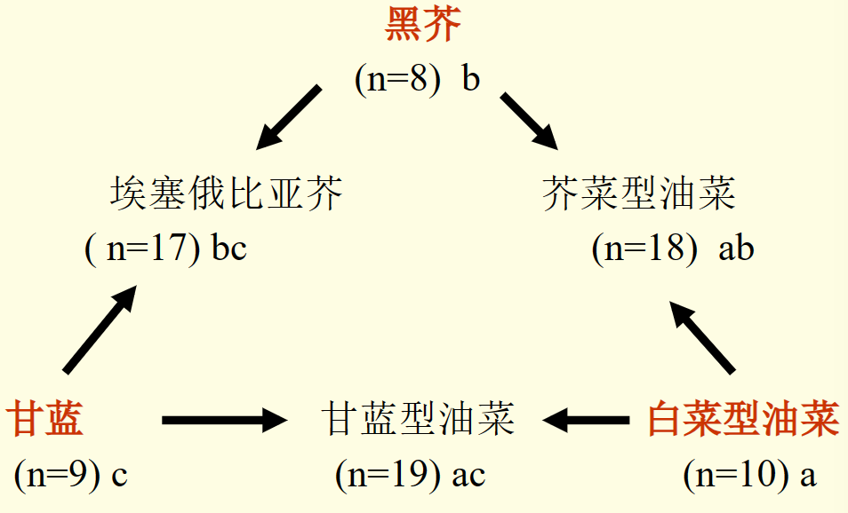

4. 三大油菜类型的植株形态区别有哪些：

   |          | **甘蓝型油菜**                         | **芥菜型油菜**                                               | **白菜型油菜**                                       |
   | -------- | -------------------------------------- | ------------------------------------------------------------ | ---------------------------------------------------- |
   | 植株     | 高大，主茎粗壮                         | 高大，茎秆坚硬                                               | 矮小                                                 |
   | 分枝     | 分枝部位高                             | 分枝多而纤细                                                 | 分枝多，部位低                                       |
   | **叶**   | 叶厚，蜡粉，缺刻。薹茎叶无叶柄，半抱茎 | 基叶披针形，叶面粗糙或密被刺毛，叶缘有缺刻或明显锯齿，有辛辣味 。薹茎叶有叶柄，不抱茎 | 叶薄，叶缘呈全缘或波状，无蜡粉。薹茎叶无叶柄，全抱茎 |
   | **花**   | 花瓣大，黄色，开花时花瓣两侧互相重叠   | **花瓣小**，淡黄色，开花时**花瓣分离**                       | 花淡黄色或深黄色，开花时花瓣两侧重叠                 |
   | 角果     | 角果较大，细长                         | 瘦小且短                                                     | 略肥大                                               |
   | **种子** | 种子大，圆形，黑色，千粒重3克左右      | 种子小，有红、黄、黑褐等色，有辛辣味，千粒重1~1.5克          | 种子中等偏小，有黄、黑、红、黄褐等色，千粒重2~3克    |

5. 油菜的一生一般可分为哪几个生育阶段？它们的划分标准是什么？
   - 苗期：从种子发芽、出苗到现蕾称为苗期，以营养生长为主
   - 蕾薹期：主茎顶端出现绿色花蕾时称为现蕾期，主茎伸长达到10cm高时称为抽薹。是营养生长和生殖生长两旺时期。
   - 开花结果期：从始花到终花的阶段，以生殖生长为主。
   - 角果成熟期：从终花到成熟，营养生长逐渐停止，角果和种子迅速发育。

6. 油菜根颈是如何形成的？它有哪些功能？

   是油菜的脚茎，子叶以下的部分，子叶脱落后其以下的幼茎继续生长形成。形成不定根；贮藏养分。

7. 甘蓝型油菜的三类叶片各着生在什么茎上？

   长柄叶-缩茎段
   短柄叶-伸长茎段
   无柄叶-薹茎段

8. 什么是油菜植株的平头高度？如何从平度高度的出现评价植株生长状况？ 

   平头高度：薹的高度与短柄叶齐平时的薹高。

   评价：平头高度是判断蕾薹期田间长势的重要形态标志。一般旺长苗的短柄叶过长，“平头”出现过迟；而弱苗、小苗或脱力大苗的短柄叶小，“平头”过早出现。春发稳长田块的植株“平头高度”在35cm左右。

9. 油菜的花器结构怎样？花序分化顺序又怎样？ 

   无限总状花序，花有花萼、花瓣各4片、雄蕊6个（4长+2短）、雌蕊1个、子房2室、雄蕊和子房间有绿色蜜腺4个。
   主茎→一次分枝→二次分枝；分枝内上部→基部；花序内下部→上部。

10. 油菜种子发育过程中含油量如何变化？环境因子如何影响含油量？

    糖含量下降，油分增加。
    油菜籽种子含油量受到环境因素的影响也很明显，其中气候环境的影响最为显著（北方高）。例如，干旱、高温和冬季环境等都会影响油菜籽生长和发育，进而影响到油菜籽种子含油量。同时，土壤肥力也是影响油菜籽含油量的重要环境因素，土壤中的氮、磷、钾等营养元素的数量和质量都会影响油菜籽生长和发育。

11. 油菜结角率和结籽率一般是多少？影响油菜结角结籽率的环境与栽培条件有哪些？

    结角率(40~70%)：阴角10~20%，脱落20~40%

    结籽率(50~60%)

    营养条件：花器脱落、阴角数表现二次分枝>一次分枝>主茎花序
    气候条件：开花时寒潮、低温，湿度过高过低（特别是上午9-10时遇雨）对结角率影响很大
    种植密度：株间荫蔽，花角脱落，阴角秕粒增加

12. 请简述油菜培育壮苗、提高秧苗素质的意义。

    秧田期长：油菜秧田期一般为35-45d（秧龄），秧苗可生出6-8片叶。五叶期以前叶片出生快，单叶叶面积逐渐增大，吸收氮素较快，需适当促进。

    五叶期前后生长方式变化：五叶期以后出叶速度减慢，养分积累明显，含糖量增加，含氮量降低，叶片变厚，根茎增粗，是壮苗充实期。这时要防止水分过多、秧苗过嫩而成为旺苗；如果苗期培育不好，因缺肥、少水或渍水，未及时间苗等而形成弱苗和僵苗。

13. 油菜壮苗标准有哪些？
    - 绿叶6~7片，苗高20cm左右
    - 根颈短而粗壮，粗0.6~0.7cm，长2cm以下
    - 叶柄不超过叶片长的二分之一
    - 无红叶、无高脚、曲茎
    - 支根、细根多
    - 苗龄适当

14. 油菜缺硼的原因与条件主要有哪些？如何防止油菜缺硼？

    原因条件：

    - 持续干旱，导致土壤有效硼降低
    - 偏施氮肥或石灰过量，造成氮钙与硼元素之间的比例过大
    - 晚播晚栽，移栽质量差，根系发育差
    - 甘蓝型油菜易发生

    方法：

    - 农业防治：深耕改土，增施有机肥、草木灰，合理施用化学氮肥，培育壮苗，适时移栽。酸性土壤施用石灰要适量。
    - 施用硼肥：硼肥作底肥，苗床喷硼，本田施硼

15. 油菜发生早花的原因是什么？如何防止？

    原因：

    - 栽培措施不当，油菜在冬前出现抽薹开花现象。
    - 春性品种和半冬性品种播种过早，加以肥料不足、土壤干燥或苗床播种量过大、苗龄过长、移栽质量差等，更易造成早花现象

    防止：

    - 应根据品种特性确定适宜播种期；加强苗床管理，培育壮苗并提高移栽质量。
    - 已出现早花现象，应选晴天进行摘薹，摘薹后追施1次速效肥料，促使正常生长。

## 水稻栽培学

### 一、概述

#### （一）水稻生产的国民经济意义

1. 我国的主要粮食作物
2. 高产作物
   - 经济系数高（**作物的经济产量与生物产量的比例**）
   - 高产记录：Ⅱ优084，18775kg/ha
3. 适应性强，种植范围广
4. 稻米营养价值高
   - 易于消化
   - 蛋白质含量低于小麦，但氨基酸平衡
5. 综合利用广

#### （二）水稻生产概况

1. 全球生产概况

   - 主要集中在亚洲
   - 印度、中国、印度尼西亚、孟加拉国、泰国，1.5亿亩以上
   - 澳大利亚单产最高。中日韩
   - 泰国米质优良，在世界贸易中占很大的份额

2. 我国生产概况

   （1）总体情况

   - 单产增加较快
   - 种植面积波动大：2022年，4.42亿亩
   - 主产区格局显著变化

   （2）各省区

   - 黑龙江发展最快
   - 湖南省种植面积长期第一，现居第二
   - 3000万亩以上：黑湘苏鄂皖赣
   - **新疆单产最高**

   （3）浙江省

   - 种植历史悠久：河姆渡文化、良渚文化

3. 我国水稻分区

   分布辽阔

   丁颖，6个稻作区（一级区）和16个稻作亚区（二级区）

### 二、水稻栽培的生物学基础

#### （一）起源与分类

1. 栽培稻种的起源

   - 禾本科Roaceae稻属*Oryza*
   - 20多个种，**栽培种2个**，普通栽培稻（*Oryza sativa*）和非洲栽培稻（*Oryza glaberrina*）
   - 普通野生稻和普通栽培稻的差异
     - 野生性状的利用：多年生、分蘖、抗逆等

2. 栽培稻种的分类

   

   变异型：粳亚种、早中季稻、陆稻、糯稻

   （1）籼亚种*indica*和粳亚种*japonic* subsp.

   - 区别：杂交亲和力弱，杂交结实率低。形态和生理上有明显的区别
     - 粳稻穗短，籽粒密集；籼稻穗长，籽粒稀疏
     - 籼粳交，亚种间杂交，杂种优势
     - 籼稻细长；粳稻粗短，稃壳多毛
   - 两种不同的**地理气候生态型**
     - 高温籼稻
   - 籼稻是基本型

   （2）晚稻和早稻

   - 分别：
     - 栽培季节的气候环境不同，光照敏感性。**适应不同日长条件的两种气候生态型**
       - 野生稻：短日照作物，低纬度起源
       - 晚稻：典型的短日照作物
       - 早稻：对光照不敏感
   - 演变：晚稻是基本型
     - 浙江省晚稻多为粳稻，早稻为籼稻
       - 籼稻和粳稻——温度不同；早稻晚稻——光照不同。不能混为一谈

   （3）水稻和陆稻

   - 耐旱性不同
   - 水稻是基本型

   （4）粘稻和糯稻

   - 化学成分差异
     - **糯稻支链淀粉含量高（直链淀粉<3%）；粘稻直链淀粉含量高**
   - 粘稻是基本型
   - 糯稻基本上是粳稻

   （5）栽培品种的演变与分类

   - 按穗粒性状分类
   - 按熟期区分
   - 按株型
   - 杂交稻种和常规稻种
   - 高产种和优质种

#### （二）发育特性与生产上的应用

1. 品种生育期的变化特点

   （1）生育期

   - 生殖生长期一般为60-70天，其余为营养生长期
   - **主要是营养生长期的差异**

   （2）品种生育期随环境变化的规律

   - 在同一地域，随纬度增高，生育期延长
   - 纬度相近，随海拔增高，生育期延长
   - 播期推迟，生育期缩短
   - 通常短日照、高温都可使水稻生育期缩短

2. 决定品种生育期的三性

   - 感光性：品种因受日照长短的影响而改变生育期的特性
   - 感温性：品种因受温度高低的影响而改变生育期的特性
   - 基本营养生长期（短日高温生育期）：短日、高温条件下，水稻品种仍需经一个最短的营养生长期，才能转入生殖生长

   （1）感温性

   - 以高温出穗促进率衡量

   （2）感光性

   - 短日照出穗促进率
   - 早稻感光性较弱，晚稻较强，中稻介于两者之间

   （3）短日高温生长期

   - 一定的高温和短日照条件下的营养生长期表示
   - 感温性和感光性弱，短日高温生长期稳定

3. 水稻发育特性理论的应用

   （1）栽培：确定种植制度、品种搭配、栽培措施的重要依据

   （2）引种：北种南引，因生育期间的日长变短，温度提高，品种的生育期缩短，通常减产。南种北引，因生育期间的日长变长，温度降低，品种的生育期延长，只要种植制度允许，能安全齐穗，通常增产。海拔

   （3）育种：育种目标。花期。提高育种效率。

#### （三）生育过程与器官建成

1. 生长发育过程

   - 营养生长期
     - 开始标志：稻谷萌发
     - 显著特征：分蘖数的增加
     - 包括：幼苗期和分蘖期（有效分蘖期和无效分蘖期）
   - 生殖生长期
     - 开始标志：幼穗分化
     - 显著特征：稻穗的形成和谷粒的灌浆充实
     - 包括：长穗期和结实期

2. 器官建成

   （1）种子发育与幼苗生长

   - 种子的构造
     - 颖果
     - 每一小穗有一朵小花
   - 影响种子萌发能力的因素
     - 休眠
     - 成熟度
     - 贮藏条件及时间
   - 发芽与幼苗生长
   - 幼苗生长过程中的物质消长
     - 离乳期：幼苗生长前期，贮藏养分基本耗尽
     - 超重期：一般至第3叶开始抽出后不久，苗和尚存种谷的干重之和超过原种谷干重。合成干物质

   - 萌发需要适宜的环境条件
     - 水分
     - 温度：最低10（粳）-12（籼），最适温度28-36℃
     - 氧气：干长根，湿长芽

   （2）根的生长

   - 浅：0-10cm
   - 根量满足地上部最佳，不宜多，影响干物质分配

   （3）叶的生长

   - 芽鞘、不完全叶（芽鞘中长出的第一张绿叶，只有叶鞘）、完全叶
   - 主茎叶片数：早稻10-13，中稻14-16，晚稻>16

   （4）分蘖的生长

   - 生长与分化：
     - 基部的节（分蘖节）上的腋芽长成
     - 一般芽鞘节和不完全叶上不发生分蘖
     - 发育过程
   - 叶蘖同伸
     - **n叶抽出≈n-3号分蘖的第一叶伸出**
     - 分蘖的第1叶抽出后，其出叶速度与主茎叶片大体相同
     - 主茎上发生的分蘖称为一次分蘖，一次分蘖上可再发生分蘖（二次分蘖），其抽出与母茎的关系，也同于主茎与分蘖
   - 分蘖的有效与无效
     - 有效分蘖：主茎开始拔节时，具有独立根系、可自养的分蘖（>4叶）
     - 无效分蘖：主茎开始拔节时，无独立根系、不能自养的分蘖（<3叶）
     - 动摇分蘖：3张叶的分蘖，因土壤营养状况、群体大小，而变化于上两者之间
     - **有效分蘖临界叶龄期：**N（品种总叶数）-n（伸长节间数）

   （5）茎的生长

-    节间伸长与穗分化的关系
  - 重叠型：主茎幼穗分化比拔节开始早，早稻
  - 衔接型：主茎拔节和幼穗分化是同时开始，中稻
  - 分离型：主茎拔节在幼穗分化之前，两者彼此分离，单季晚稻

   （6）穗的发育

   - 圆锥花序，穗轴、一次枝梗，二次枝梗，小穗梗，小穗，颖花（每小穗一朵）
   - 分化发育
   - 每穗颖花（floret）数的消长
     - 不结实，秕谷
   - 稻穗的分化期
     - **二次枝梗原基及颖花原基分化期——决定颖花数，每穗粒数**
     - **减数分裂——结实率，粒数**

   （7）开花

- 抽穗：穗顶露出顶叶鞘1~2cm

   - **始穗20%，抽穗50%，齐穗80%**
   - 浆片膨胀，开花

3. 同伸、同步关系

   （1）营养器官

   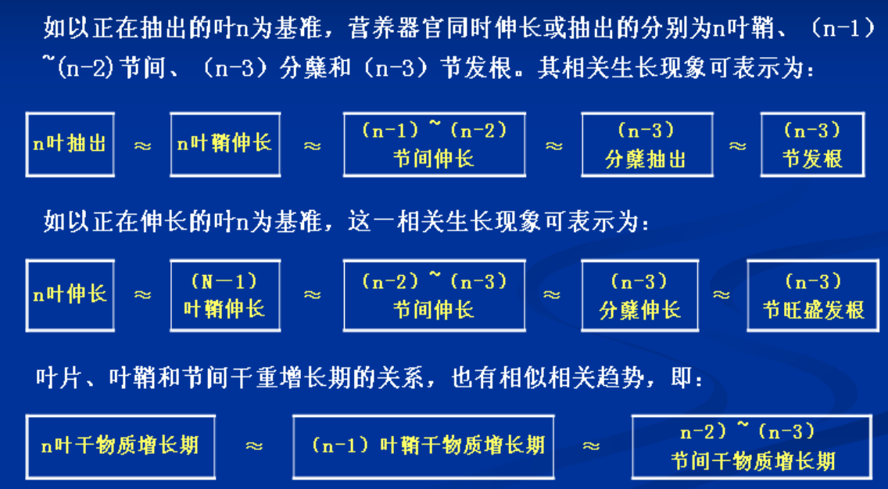

   （2）营养器官和生殖器官

   - 叶龄余数

4. 叶龄模式

   - 主茎叶片数、伸长节间数
   - **主茎第4张叶片长出，长出分蘖**
   - 拔节叶龄：**主茎叶片数-伸长节间数+2**
   - 几个关键的叶龄期

   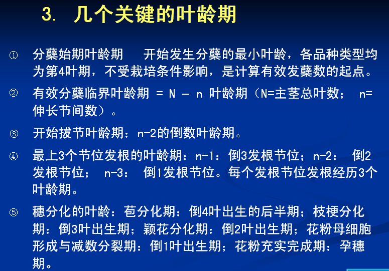

### 三、水稻产量形成及调控

**生物产量：**指生育期间生产、积累的有机物质总量，即地上部植株所有干物质的收获量

**经济产量：**指经济产品器官（稻谷或糙米）的收获量

**经济系数：**经济产量在生物产量中的比重

#### （一）产量构成因素

单位面积穗数、每穗粒数、结实率、千粒重

1. 形成

   （1）单位面积穗数的形成与调控

   - **水稻单位面积穗数**=基本苗+单株有效分蘖率
   - 单位面积上主茎和分蘖总数合称**总茎蘖数**；
   - 从见蘖（起始分蘖）开始，总茎蘖数增加到与最后穗数相等的时期，称**有效总茎蘖数（有效穗数）决定期**；
   - 分蘖增加到拔节后不再发生分蘖的时期称**最高茎蘖数期**（或高峰苗期）
   
   （2）每穗颖花数
   
   - 影响颖花分化的时期
     - 每穗颖花数=分化颖花数（始于穗轴分化期，二次枝梗分化期）+退化颖花数（始于雌雄蕊形成期，减数分裂期）
     - **主要减少退化**
   - 调控
     - 促分化，减退化
     - 氮素营养（穗肥）
       - 促花肥：促进颖花分化的肥料，施用期为第一苞分化期前至二次枝梗分化期
       - 保花肥：雌雄蕊分化期（叶龄余数1.5~1.0）施用速效氮肥，有效防止颖花退化
   
   （3）结实率（有颖壳）
   
   - 抽穗前颖花分化和减数分裂期，抽穗后开花到胚乳增长盛期
   - 空粒（前两个，雄性不育或受精不良），秕粒（后两个，灌浆不良）
   - 温度和养分（N）
   - 提高措施
     - 抽穗前：器官发育（植株体内化学组成、输导组织和着生颖花数）
     - 抽穗后：物质生产（同化物）
   
   
   （4）千粒重
   
   - 谷壳体积：减数分裂期
   - 胚乳的充实度：灌浆盛期
   
#### （二）产量形成模式与品种源库类型

1. 产量形成过程模式

   （1）有机物质积累和分配过程与产量形成

   （2）产量构成因素模式

2. 水稻品种产量形成的源库类型

   （1）源库的概念

   - **源：生产和输出同化产物的器官或组织**
   - **库：接受和贮藏同化物质的器官或组织**
   - 相对、动态，相互转化

   （2）表示方法

   - 源：叶面积
   - 库：单位面积的颖花数

   （3）类型

   - 源限制类型
     - 特征：颖花形成能力强，库大；茎、鞘物质的输出率与转换率高；结实率偏低且稳定
     - 杂交稻籼粳交
     - 栽培策略：以增加抽穗前的茎、鞘贮存物和出穗后的光合生产为主攻目标
   - 库限制类型
     - 颖花形成能力较弱；茎、鞘物质的输出率低；结实率较高且稳定
     - 常规稻早熟品种
     - 栽培策略：提高总颖花数
   - 源库互作型
     - 增源或增库均可增产

#### （三）群体质量指标及其调控

- **群体质量：反映群体发育优劣的多项性状指标的综合状况**
- **高产群体质量指标：能不断优化群体结构，实现优质高产的各项形态、生理指标**

1. 群体质量指标

   - **抽穗至成熟期群体光合生产量**是衡量水稻群体质量的核心指标
   - **适宜的LAI及较高的总颖花量**
   - **较高的粒叶比与良好的叶系配置**
     - 粒叶比：颖花/叶、实粒/叶、粒重/叶。反映单位叶面积所载荷的库容大小
     - 叶系配置：有效叶面积、无效叶面积；高效叶面积（倒三叶叶面积）
   - 较高的单茎茎鞘重
   - 较高的根活量
     - 根活量：根量与活力的乘积
     - 颖花根活量：根活量与颖花量的比值
   - 茎蘖成穗率较高且穗数适宜

2. 群体质量调控技术

   （1）技术模式

   - 高产群体的培育，结实期群体高光效、高积累
   - 尽量压缩群体的起点和前期的总生产量，让空间
   - 充分发展个体，合理利用分蘖的自动调节：小群体、壮个体、高积累

   （2）调控原则

   - 满足适宜穗数目标下，提高茎穗成穗率，主攻大穗
   - 控叶扩库：即控制叶的无效和低效生产，促进库的形成和生产，达到在控制适宜 LAI 基础上，提高库、源强度。

### 四、稻米品质的形成与调控

#### （一）稻米品质及其判定方法

加工、外观、蒸煮与食味、营养及卫生品质

收获、晒干（13%）、去杂后存放3个月以上（理化性状趋于稳定）

1. 加工品质
   - 反映稻米对加工的适应性，又称碾磨品质，与籽粒灌浆特性、胚乳结构及糠层厚度等有关
   - 糙米率、精米率、整精米，质量百分率
2. 外观品质
   - 市场或商品品质
   - 垩白米率、垩白面积、垩白度、透明度、粒型
   - 垩白是胚乳充实不良引起的空隙导致光的散射，外观上形成白色的不透明区。腹白、背白、心白
3. 蒸煮与食味品质
   - 米饭的色、香、味及其适口性
   - 口感品尝；理化指标，直链淀粉含量、糊化温度、胶稠度、米饭粘性、硬度、气味以及冷饭质地
4. 营养品质
   - 蛋白质及氨基酸含量组成
5. 卫生品质
   - 农药及重金属元素

#### （二）稻米品质的调控

1. 品种间差异
2. 环境与栽培条件
   - 气象因子
   - 土壤生态条件
   - 栽培条件
     - 多施化肥，品质下降
   - 环境污染

#### （三）稻米品质保优栽培技术

1. 品种选择与合理布局
2. 适宜的栽播期和种植密度
3. 土壤改良和优化施肥技术
4. 水分灌溉技术
5. 病虫草害防治与控污技术
6. 适时收获与合理干燥技术

### 五、水稻栽培技术

#### （一）育秧

1. 壮秧标准及其意义

   （1）秧苗类型

   - 小苗：3叶期内带土移栽
   - 中苗：3-4.5叶
   - 大苗：4.5-6.5时移栽的苗；6.5叶以上，老壮苗
   - 一般能小则小

   （2）壮秧特征

   - 个体：茎基粗扁、叶挺色绿、根多色白、健壮
   - 群体：成秧率（80%以上）、整齐度高
   - 光合能力强，碳氮比适中，束缚水含量高

   （3）壮秧的意义

   秧好一半稻，秧田期占营养生长期的时间较长

2. 播种期、秧龄与播种量的确定

   （1）播种期

   - 气候条件、品种和前后茬
   - 有利于出苗、分蘖、安全孕穗和安全齐穗
   - 早播界限期
     - 确保发芽：**粳稻10℃，籼稻12℃**
     - 适时早栽：15℃以上
     - 安全孕穗：孕穗期遇低温，结实率显著下降
   - 晚播界限
     - 不影响水稻的安全齐穗为原则

   （2）秧龄

   - 叶龄、天数、积温等，以叶龄法最能反映
   - 一般原则：
     - 品种生育期长短（能短则短）
     - 品种特性：早稻短，晚稻长（感光性）
     - 气候与密度：温度高、密度大宜短

   - 适宜秧龄：移栽后保证有6-9叶出生

   （3）播种量

   - 能多则多，不影响个体生长
   - 影响因素：秧龄，温度，育秧方式，水稻类型（杂交稻少，常规稻多）

3. 种子处理与浸种催芽

   （1）种子处理：晒种，选种，种子消毒

   （2）浸种催芽

   - 浸种及其标准
     - 自重的40%（饱和吸水量）
     - 谷壳呈半透明状，胚部膨大突起（露白）
   - 浸种时间
     - 籼稻60度日，粳稻80度日
   - 催芽
     - 缩短出苗时间，减少外界影响
     - 催芽标准：温度高短，温度低则长
     - 要求：快齐匀壮

4. 主要育秧方式及其技术要点

   （1）露地湿润育秧

   （2）地膜（薄膜）湿润育秧

   （3）旱育秧

   （4）工厂化育秧

5. 烂秧、死苗的原因与防止

   （1）类型

   - 烂种：播种后种谷不发芽而腐烂
   - 烂芽：发生在“现青”之前
   - 死苗：发生在“现青”之后，主要在 2-3 叶期

   （2）原因

   - 种子发芽力低
   - 浸种吸水不充分，影响发芽率和发芽势
   - 催芽时“烧包”或播种后“落泥”过深
   - 播种过早，缺少保温措施，低温危害
   
   （3）防止方法
   
   选种、播前处理、浸种催芽、温度水分

#### （二）稻田耕整、种植密度与移栽

1. 高产稻田土壤基本特征和耕地原则

   （1）基本特征

   - 构造良好
   - 养分充分协调，不缺微量元素
   - 适当的保水保肥力
   - 土壤有益微生物活动旺盛

   （2）耕地原则

   田平整，土壤膨软，土肥相融，无杂草残茬，无大土块，利于插秧和插秧后早生快发

2. 种植密度

   （1）合理密植增产的生理基础

   群体和个体协调市长，群体结构

   - 协调群体和个体的生长，增穗、增粒、增重，实现高产
   - 适当扩大绿叶面积，提高光能利用率

   （2）途径及其适宜条件

   - 增穗途径：早熟品种，生育期短；增大密度，增加基本苗
   - 增粒途径：土水肥条件好，生育期长。适当稀植，促大穗、粒多、粒重
   - 穗粒兼顾途径：常规粳稻品种

3. 移栽的方法和质量

   （1）移栽的方法

   - 手工拔秧插秧
     - 不栽隔夜秧，宜混水栽秧；栽插应浅、匀、直、稳；栽后适当保持深水，减少叶面蒸腾
   
   - 机插秧
   - 抛秧

   （2）适时早栽，提高栽插质量
   
   - 浅、匀、直、稳

#### （三）水稻的营养与施肥

1. 营养与需肥特性

   （1）对主要营养元素的吸收

   - 每生产 500 公斤稻谷，氮 、磷、钾的吸收量为2 ：1：2-4

   - 杂交水稻对钾需求量大
   - 硅需求量大（每生产500公斤，吸收硅88-100公斤）

   （2）各生育期吸肥情况

2. 施肥量和施肥时期的确定

   （1）施肥量的确定
   $$
   理论施肥量=\frac{计划产量吸收养分-土壤养分供给量}{肥料中该元素含量\%×肥料利用率\%}
   $$
   （2）施肥时期的确定

   - 增加穗数的施肥适期
     - 基肥和有效分蘖期内
   - 增加每穗粒数的施肥适期
     - 促花肥：在第一苞分化至第一次枝梗原基分化时追肥，有促进颖花数增多的效果
     - 保花肥：在雌雄蕊形成至花粉母细胞减数分裂期施肥，可防止颖花退化。
   - 提高粒重和结实率的施肥适期
     - 抽穗后，粒肥

3. 肥料运筹与施用

   - 底肥“一道清”
   - 前促施肥法
     - 在施足基肥基础上，早施、重施分蘖肥
   - 前促、中控、后补施肥法
     - 基肥足，早施分蘖肥
     - 中期晒田控氮，抑制无效分
     - 补施穗肥
   - 前稳、中促、后保施肥法
     - 生长期长，肥力、保肥力差的田

#### （四）稻田水分管理

1. 基本需水

   - **生理需水：直接用于水稻正常生理活动以及保持体内水分平衡所需要的水分**。蒸腾作用和光合作用
   - **生态需水：调节生态因子，创造适宜生长条件**。棵间蒸发和稻田渗漏

2. 稻田需水与灌溉定额

   - 稻田需水量
     - 稻田需水量=叶面蒸腾量+棵间蒸发量+稻田渗漏量
     - 腾发量=叶面蒸腾量+棵间蒸发量
   - 灌溉定额
     - 单位面积稻田需要人工补给的水量
     - 灌溉定额=整田用水量+大田生育期间耗水量-有效降水量

3. 稻田灌溉与节水要点

   WUE

   （1）不同生育期对水分的要求及灌溉

   - 返青期
   - 分蘖期：水层要薄
   - 幼穗发育期：生理需水临界期
   - 出穗开花期：敏感
   - 灌浆结实期

   **浅水插秧，深水活棵，薄水分蘖，适时晒田，足水养胎，有水抽穗，湿润灌浆，适时断水**

   （2）晒田的作用及技术

   又名烤田或搁田，是指水稻分蘖盛期后到幼穗分花前的排水晒田
   
   - 水稻分蘖盛期到幼穗分化前的排水晒田
   - 作用：改变土壤理化性质；改变幼苗形态。控制地上部生长
   - 晒田技术：时到不等苗，苗到不等时
     - 气候、土壤、施肥和秧苗长势
     - 分蘖末期至幼穗分化初期

#### （五）不同生育阶段栽培管理

1. 返青分蘖期
   - 移栽到幼穗分化以前的时期
   - 以营养器官生长为中心，是决定穗数的关键时期
   - 返青早，出叶快，分蘖早，叶色绿，透光好
2. 拔节长穗期
   - 营养生长和生殖生长并进
   - 保蘖、增穗的重要时期，又是增花增粒、保花增粒的关键时期
3. 抽穗结实期
   - 保穗、攻粒、增重

#### （六）栽培新方式及技术要点

1. 水稻抛秧栽培
2. 机械栽插技术
3. 水稻直播栽培
4. 再生稻栽培

### 思考题

1. 请简述水稻生产的国民经济意义

2. 目前全球和我国的水稻生产总体情况如何？

3. 普通野生稻和普通栽培稻的主要区别有哪些

4. 籼稻与粳稻、早稻与晚稻、水稻与陆稻、粘稻和糯稻的主要区别是什么？

5. 何谓水稻的“三性”，其理论在水稻育种与栽培有何指导意义？

6. 请简述水稻的一生

   - 幼苗期
   - 分蘖期
   - 幼穗分化期
   - 抽穗扬花期
   - 灌浆成熟期

7. 影响水稻种子萌发能力的因素有哪些？

8. 何谓水稻的离乳期和超重期

   离乳期：水稻秧苗在3叶期左右时，胚乳的营养成分消耗殆尽，逐渐由异养过渡到自养。
   超重期：指种子出苗后经过一定的生长，植株总干重超过原有种子干重的时期。

9. 水稻叶、蘖的同伸关系怎样？

10. 如何确定水稻的有效分蘖临界叶龄期？

    有效分蘖临界叶龄期=N-n（N=主茎总叶数；n=伸长节间数）

11. 根据节间伸长与穗分化的关系，水稻可以分成哪几种类型？

    - 重叠型：主茎幼穗分化比拔节（节间伸长）开始早，早稻
    - 衔接型：主茎拔节和幼穗分化是同时开始，中稻
    - 分离型：主茎拔节在幼穗分化之前，两者彼此分离，单季晚稻

12. 请简述水稻穗分化发育过程；

13. 水稻的抽穗开花过程怎样？

14. 营养器官之间以及叶片与穗分化之间的关系怎样？

15. 如何确定水稻的几个关键叶龄期？

    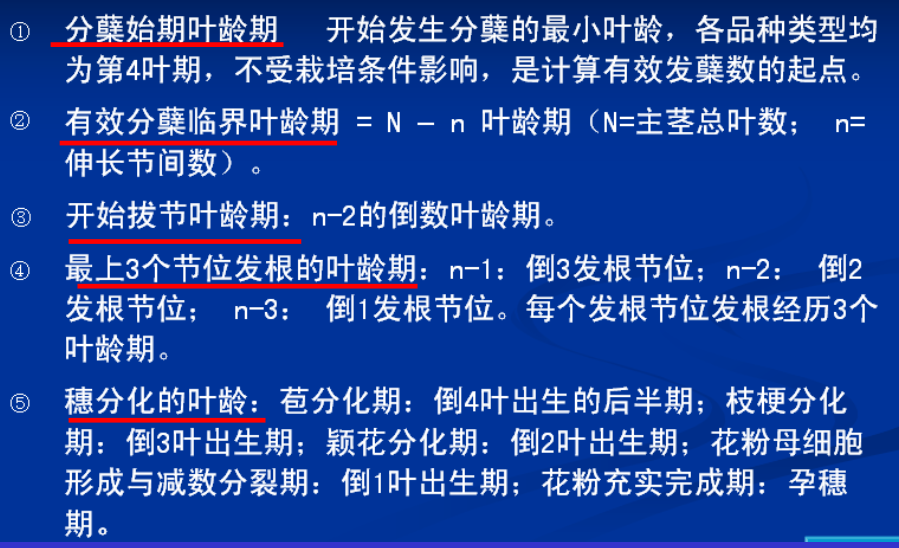

16. 水稻产量构成因子有哪些？它们各在什么生长阶段决定的？

    - 单位面积穗数：分蘖期
    - 每穗颖花数：幼穗分化期
    - 结实率：抽穗扬花期
    - 千粒重：灌浆成熟期

17. 何谓水稻促花肥和保花肥？

    - 促花肥：在第一苞分化至第一（二）次枝梗原基分化时追肥，有促进颖花分化、数量增多的效果
    - 保花肥：在雌雄蕊形成至花粉母细胞减数分裂期施肥，可防止颖花退化，有利于后期同化物向籽粒中运转

18. 影响水稻千粒重的主要因素有哪些？

    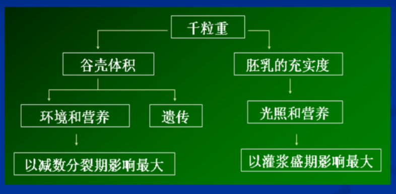

19. 从水稻品种的源库关系谈谈相应的栽培策略；

    - 源限制型品种：增加抽穗前的茎、鞘贮存物和出穗后的光合生产为主攻目标
    - 库限制型品种：以增加群体的总颖花量为主攻目标
    - 源库互作型：源、库的自身调节能力较强，措施的回旋余地也较大，栽培策略上应据具体条件而定

20. 衡量水稻群体质量指标有哪些？

    - 抽穗至成熟期群体光合生产量
    - LAI、总颖花量
    - 粒叶比、叶系配置
    - 单茎茎鞘重
    - 根活量
    - 茎蘖成穗率、穗数

21. 群体质量调控的技术模式和原则是什么？

    模式：

    - 第一，高产群体的培育，重点为结实期群体的高光效、高积累
    - 第二，尽量压缩群体的起点和前期的总生产量，为经济器官分化形成各器官的健壮发展让出空间；
    - 第三，充分发展个体，合理利用分蘖在群体发展中的自动调节：小群体、壮个体、高积累

    原则：

    - 满足适宜穗数目标下,提高茎穗成穗率,主攻大穗
    - 按叶龄调控原则：控叶扩库，即控制叶的无效和低效生产，促进库的形成和生产，达到在控制适宜LAI基础上，提高库、源强度。在生长前期，凡有利于增加库而不直接增加结实期叶面积的叶龄期，尽量促进；凡叶的生长旺于库的生长，应尽量抑制。

22. 影响稻米品质的因素主要有哪些？

    - 品种
    - 环境与栽培条件
      - 气象因子：光温
      - 土壤条件：耕层厚度、酸碱度、养分水平、质地、有机质含量、微量元素
      - 栽培条件：施肥、种植密度、水分管理、农药除草剂等化学残留
      - 环境污染

23. 水稻壮秧标准是什么？

    - 形态特征
      - 个体：茎基粗扁、叶挺色绿、根多色白、植株健壮
      - 群体：成秧率高、整齐度高
    - 生理特征
      - 光合能力强，叶鞘内碳水含量高；
      - 碳氮比适中；
      - 束缚水含量高

24. 如何确定适宜的播种期、秧龄和播种量？

    - 播种期
      - 气候条件、品种、前后茬
    - 秧龄
      - 移栽后保证有6-9叶出生
      - 品种生育期长短：长的可长，短的宜短；
      - 品种特性：早稻短，晚稻长（感光性）
      - 气候与密度：温度高、密度大宜短，反之宜长
    - 播种量
      - 以掌握移栽前不出现秧苗群体因受光照不足而影响个体生长为原则

25. 请简述水稻种子催芽的四个阶段？

    高温破胸、适温催根、保湿催芽、摊凉锻炼

26. 不同育秧方式的主要技术特性是什么？

    - 露地湿润育秧：
    - 地膜保温育秧：可适期早播，防止烂秧，提高成秧率
    - 旱育秧技术：苗素质好，抗逆性强，移栽后早生快发；成穗率高，穗大粒多，结实率高；省秧田。育秧技术较复杂。
    - 工厂化育秧

27. 水稻合理密植的途径及其应用范围是什么？

    - “增穗”途径
      - 早熟品种、迟栽小春田、瘦田、少肥、秧苗素质差、管理水平低等的地区或田块
    - “增粒”途径
      - 稻田土、水、肥条件较好，科学种田水平高，尤其是对部分肥田、半旱式垄作田、大穗型品种较适宜
    - “穗、粒兼顾”途径
      - 生产条件较好，管理水平较高的条件下，适宜于目前生产上占最大比重的中产地区和田块。

28. 水稻不同移栽方式要关注的质量主要有哪些？

29. 水稻的需肥和吸肥特性怎样？

    - 氮磷钾比为2：1：2~4，对硅的吸收量也很大
    - 实际水稻吸肥量更高，且随品种、气候、土壤和施肥等的不同而有一定变化

30. 水稻施肥方式主要有哪些方式？它们各自适用的范围怎样？

    - 底肥“一道清”施肥法：水稻品种生育期短，粘土、重粘土等保肥力强的稻田
    - “前促”施肥法：品种生育期短、施肥水平较低、生育前期温度低肥效发挥慢
    - “前促、中控、后补”施肥法：南方一季中稻区、施肥水平较高、生育期长分蘖穗比例大的品种
    - “前稳、中促、后保”施肥法：品种生长期长；肥料少、土壤保肥力差的田块

31. 什么是水稻的生理需水和生态需水？

    - 生理需水：直接用于水稻正常生理活动以及保持体内水分平衡所需要的水分为生理需水，蒸腾作用和光合作用是水稻生理耗水的两大主要形式
    - 生态需水：用于调节空气、温度、湿度、养料、抑制杂草等生态因子，创造适于水稻生长发育的田间环境所需的水分，主要包括棵间蒸发和稻田渗漏两部分

32. 水稻不同生育期对水分的要求如何？合理灌溉的原则是什么？

    32字：浅水栽秧，深水活棵，薄水分蘖，适时晒田，足水养胎，有水抽穗，湿润灌浆，适时断水。

    内涵掌握

33. 晒田有哪些作用？如何进行合理晒田？

    - 作用
      - 改变土壤理化性质，更新土壤环境，促进生长中心从蘖向穗转移，利于培育大穗
      - 调节植株长相。促进根系发育，促进无效分蘖死亡，叶和节间变短，秆壁变厚，植株抗倒伏能力增强。还能促进根系下扎，白根增多，根系活动范围扩大，根系活力增加。
    - 一般在水稻对水分不甚敏感的时期进行，以分蘖末期至幼穗分化初期较为合适。“时到不等苗，苗到不等时”
      - “苗到不等时”这半句，指的是**田间的亩总茎蘖数达到80%-90%时**，就需要晒田了，不用再等到水稻生长到一定生育期再进行晒田
      - “时到不等苗”这半句，指的是当**水稻生长到一定生育期时**，即使亩总茎蘖数还没有达到预定的目标，也要进行晒田，一般情况下，当水稻生长到分蘖末期至幼穗分化初期时，就可以进行晒田了。

34. 水稻主要生育期的生育特性怎样？关键田间管理有哪些？

    （1）返青分蘖期

    - 生育特性

      - 移栽到幼穗分化以前的时期，以营养器官生长为中心，是决定穗数的关键时期

    - 田间管理

      - 查苗补缺、保证全苗；

      - 调节灌溉水层，适当深水保苗返青，浅灌促分蘖，晒田抑制无效分蘖，

      - 提高成穗率，达到根强株壮，蘖足穗多。

      - 看苗追施分蘖肥；

      - 注意病虫害的防治

        

    （2）拔节长穗期

    - 生育特性

      - 营养生长（茎秆生长为中心）和生殖生长（幼穗分化为中心）并进，是增花增粒、保花增粒的关键时期
      
        - 需水需肥较多，保蘖增穗的基础上促进壮秆、大穗，防止徒长倒伏。
          
      
    - 田间管理
      
      - 巧施穗肥，以促进大穗，提高结实率和粒重
          - 合理灌水，保证不缺水
          
      - 病虫害防治
        
    
    （3）抽穗结实期
    
    - 生育特点
      
      - 生长中心由穗分化转为籽粒发育
        
      - 保穗、攻粒、增重
        
      
    - 田间管理
      
      - 保持水层
        
      - 齐穗后视情况追施粒肥
        
      - 病虫害防治
        
      - 适时收获
      
    
## 棉花栽培学

### 一、概述

籽棉

- 皮棉35-42%
- 棉籽（毛子）
  - 短绒
  - 光子
    - 种壳
    - 种仁

**衣分%=100*皮棉/籽棉**

棉杆

棉根

#### （一）棉花生产在国民经济中的重要性

1. 棉纤维是纺织工业等的重要原料
2. 棉花具有重要的综合开发价值
   - 棉酚：对人和单胃动物有毒

#### （二）棉花生产概况

1. 世界棉花生产概况

   （1）种植面积与产量

   - 种植面积：3300万公顷
   - 皮棉总产：2500万t
   - 皮棉单产：760kg/ha

   （2）五大洲分布

   - 种植面积各有分布，集中分布于亚洲、美洲
   - 产量分布

   （3）主产国

   - 面积：印度、中国、美国、
   - 总产：中国、印度、美国

   （4）棉花单产

   - 皮棉单产
   - 籽棉单产

   （5）进出口

   - 主要出口国：美国、印度、巴西、澳大利亚
   - 主要进口国：中国、越南、孟加拉国、

   （6）棉花消费量

   - 中国、印度、巴基斯坦

2. 中国棉花生产概况

   （1）种植面积与产量

   - 种植面积：2008年后下滑
   - 皮棉总产：2011-2023年均599万t
   - 皮棉单产

   （2）消费量

   - 2011-2023年年均皮棉消费量805万t

   （3）进出口

   - **世界第一大棉花生产国、消费国、进口国**
   - 全球最大纺织品生产与出口国
   - 进口来源：美国、澳大利亚、

3. 浙江省棉花生产概况

   产棉小省，用棉大省

   （1）种植面积：2016-2022年5-8万亩；2023年3.6万亩

   （2）三大棉区

   - 钱塘江口和杭州湾南北两岸（80%以上）
   - 东部沿海棉区
   - 金衢棉区

#### （三）棉花分布

1. 世界分布区域（纬度和收花季）

   - 北带：20-47°N，主导
   - 中带
   - 南带

2. 中国棉花种植区划

   - 五大棉区

     - 南方棉区
       - 华南棉区
       - 长江流域棉区

     - 北方棉区
       - 黄河流域棉区
       - 北部特早熟棉区
       - 西北内陆棉区

   - 三大种植优势区
     - 黄河流域优势区
     - 长江流域优势区（南方棉区）
     - 西北内陆优势区（新疆棉区）：日照充足，干旱少雨
       - **南疆棉区**
       - 北疆棉区
       - 东疆棉区
   - 棉花主产省区：新疆、山东、河北、湖北

### 二、棉花的栽培种和品种

锦葵科（Malvaceae）棉属（*Gossypium*）

起源于高温、干旱、短日照的热带和亚热带的荒漠草原

#### （一）棉花的栽培种

1. 草棉 *G. herbaceum* L.
   - 2n=26，同源二倍体
   - 非洲棉，非洲
   - 各种小，单铃籽棉重2g
   - 纤维细短，品质差，产量低
   - 早熟和抗旱性种质资源

2. 中棉 *G. arboretum* L.
   - 2n=26，同源二倍体
   - 亚洲棉，印度
   - 单铃籽棉重3g左右
   - 纤维粗短（短绒棉），生长期较短，耐旱耐瘠，抗逆性较强

3. 海岛棉 *G. barbadense* L.

   - 4n=52，异源四倍体

   - 原产南美、中美和加勒比地区
   - 植株最高大，铃较小，单铃籽棉重3g左右
   - 长绒棉
   - 适应性较差，皮棉产量大多低于陆地棉

4. 陆地棉 *G. hirsutum* L.

   - upland cotton

   - 2n=4X=52，异源四倍体
   - 墨西哥一带高原地区
   - 适应性强，结铃性强，铃大 (单铃籽棉重5g左右)、衣分高，产量高
   - 细绒棉

#### （二）我国目前栽培的主要品种类型

1. 常规棉
2. 杂交棉
3. 抗虫棉
4. 优质专用棉
   - 低酚棉：棉仁中**棉酚含量低于0.02-0.04%**，对人畜无害的棉花
     - 高产优质抗病，提高植株棉酚含量，降低棉籽棉酚含量
     - 抗虫低酚棉
     - 防治病虫鼠害
     - 综合利用，优质优价
   - 长绒棉
   - 彩色棉

### 三、棉花栽培的生物学基础

#### （一）生育期与生育阶段

1. 全生育期（大田生长期）：从播种到收花结束的总天数
2. 生育期：从出苗到第一个棉铃成熟吐絮（始絮）
3. 生育阶段：从播种至收花结束整个生育进程（一生）
   - 播种出苗期（播种-出苗）
   - 苗期（出苗-现蕾-约8叶）
   - 蕾期（现蕾-开花）
   - 花铃期（开花-吐絮）
   - 吐絮期（吐絮-收花完）

#### （二）生育特性

起源于高温干旱、短日照的热带、亚热带地区的荒漠草原

1. 喜温、好光、较耐旱

   （1）喜温：生长最适温25~30℃，最高临界温40~45ºC

   （2）好光：对光强反应敏感

   - 短日照作物
   - 光补偿点和光饱和点均高，光补偿点为1000~2000lx，光饱和点为7~8万lx

   （3）较耐旱

   - 花铃期（开花-吐絮）需水量最大

2. 无限生长习性

   （1）棉花株型的可塑性

3. 营养生长与生殖生长重叠并进长，花期和成熟吐絮期较长

4. 雌雄同花常异花授粉作物

5. 分枝发育的两向性，蕾铃脱落普遍性

#### （三）棉籽发芽与出苗

1. 棉籽的形态、结构与化学组成

   （1）形态和结构

   - **籽指：百粒棉籽重（g）**
   - 衣指：100粒

   （2）棉籽的化学组成

2. 发芽出苗的概念

   - 发芽—胚根萌动从珠孔处突破种皮长出幼根
   - 出苗—胚轴生长成幼茎→顶出土面，子叶出土平展时称出苗

3. 发芽出苗条件

   胚和生态条件

   （1）温度

   - 发芽最适温度28~30℃

   - 出苗最低临界温度：16-18℃
   - 稳定在14℃播种
   - 浙江：4月中旬（10~20日）播种（南早北迟）

   （2）水分：萌发吸足种子重量的60%水分

   （3）氧气

#### （四）棉花根、茎、叶的生长

1. 根的生长

   （1）形态分布：直根系，由主根和侧根组成

   （2）不同生育阶段的根系生长特点

   - 苗期——根系发展期
   - 蕾期——根系生长盛期
   - 花铃期——吸收高峰期，根毛
   - 吐絮期——活动机能衰退期

   掌握棉花各生育阶段的根系生长特点，采用相应促根，控根，保根措施

2. 主茎的生长

   （1）大田生产中主茎生长一般规律

   主茎生长速度（日增长量）。初花期最大

   （2）高产棉田主茎生长的要求

   - 第一果枝着生的位置距地面距离要近，即第一果枝节位要低
   - 主茎生长高峰应出现在初花期(见花前后10d)但日增量不宜>2.5cm
   - 主茎高度应随种植密度而定

3. 叶的生长

   （1）形态（功能叶）

   - 分为子叶、前叶（先出叶）和真叶
   - 真叶: 完全叶,有托叶和叶柄；陆地棉主茎最初1~3叶多为全缘叶，其余均为掌状裂叶。
   
   - 功能叶：顶部第3或第4主茎叶，打顶后为顶叶。对肥水反应灵敏
   
   （2）叶序（**主茎叶在主茎上排列的顺序**）

   - 3/8排列：即8片叶子在主茎上围绕3周，到第9片叶子时正在第1叶子的正上方
     - 1与3、6、9、4果枝(主茎叶)同侧（密切）
     - 1与7、8角度大
     - 1与2、5对面
   
   - 光合产物的运输严格方向性
   
   （3）主茎叶大小或叶面积动态
   
   - 主茎叶初花期最大
   - 叶面积指数高峰在盛花结铃期，3.5~4
   
   （4）棉叶与营养缺乏症
   
   - 缺N：浅、黄，小
   - 缺P：红
     - 棉田土壤有效磷<5.2mg/kg，磷肥增产效果显著
     - 对磷的敏感期是在2～3叶幼苗期，对磷的吸收高峰期在开花盛期
     - 基肥、追肥早，深施
   - 缺K：黄斑花叶，叶缘枯焦叶皱缩
     - 150mg/kg以下缺钾，50一档
   - 缺B：叶柄出现竹节状绿色环带；蕾而不花
     - 形态指标：棉花叶柄环带率，长江流域>8%，黄河流域>3%
     - 0.5mg/kg以下

#### （五）分枝和现蕾

1. 营养枝和果枝的区别

   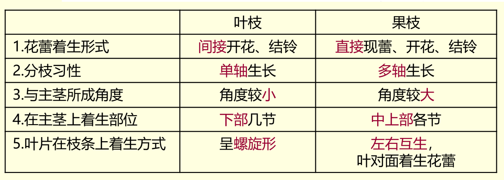

2. 现蕾
   - **第一果枝出现三角形花蕾**
   - 现蕾期：50%以上棉株出现
   - 现蕾顺序：**从下到上，从内到外**
     - **上下果枝，相同节位的蕾（同位蕾）**，间隔3d左右
     - **同一果枝相邻的蕾（邻位蕾）**，间隔6d左右
   - 现蕾动态
     - 有效蕾：能开花、结铃，并能形成经济产量的蕾
     - 有效蕾终止期

#### （六）开花结铃

花器构造：苞叶3片，萼片5合生，花瓣5，雄蕊多数单体

1. 开花的顺序和动态
   - 与现蕾一致
   - **同位花，间隔2-4d；邻位花，7d**
   - 有效花铃期：初花~有效花终止期
2. 三桃
   - 伏前桃：7月15以前
   - 伏桃：7月16-8月15，桃大，衣分高，品质好
   - 秋桃：8月16及以后（早秋桃，晚秋桃）
   - 新疆立秋分
3. 结铃
   - 内围结铃数：果枝第1、2果节上所结棉铃数
   - 外围结铃数: 果枝的第3及以上果节上所结棉铃数
   - 棉花要高产，应以抓伏桃为主，在此基础上争取两头（早秋桃）从而达到“三桃”齐结

#### （七）棉铃和棉纤维的发育

1. 棉铃的发育

   （1）形态结构

   - 蒴果
   - 4-5个心皮
   - 陆地棉单铃籽棉重一般5克

   （2）棉铃的发育

   - 铃期：**从开花到棉铃成熟吐絮所需的天数称铃期**
     - 体积增大阶段
     - 内部充实阶段
     - 脱水开裂阶段

2. 棉纤维的发育

   - 棉纤维由胚珠的外珠被的部分表皮细胞延伸发育而成
   - 伸长期，加厚期，扭曲期
   - 初生胞壁，次生壁、中腔
   - 棉纤维品质
     - 纤维长度
       - 大多在27~31mm
     - 纤维细度与成熟度
       - 马克隆值：是反映棉花纤维细度与成熟度的综合指标，是棉纤维重要的内在质量指标之一，与棉纤维的使用价值关系密切。数值越大，表示棉纤维越粗，成熟度越高，质量越差。
     - 长度整齐度比 (%)
     - 纤维强度
       - 每根纤维拉断时所需的力

#### （八）棉花的需肥特性及施肥原则

1. 需肥量及NPK吸收比例

   - 亩产皮棉100kg，N：P：K=1：0.35-0.5：0.8-1

2. 棉花不同生育阶段的生理特性、需肥特点与合理施肥

   - 苗期：营养生长占优势；生育转换（孕蕾期生殖生长开始）；需肥临界期
     - 早施轻施N PK
   - 蕾期：营养生长(占优势) 、生殖生长并进，生长势强，根系基本建成
     - 稳施蕾肥
   - 花铃期：营养生长生殖生长双旺期；吸收高峰期；盛花后生殖生长占优势;根系吸肥力渐减弱；
     - 重施花铃肥(N肥)；补施长铃肥
   - 吐絮期：生殖生长占优势；吸肥力衰退。

   棉花施肥：**“适、轻、稳、重、补”**

   - 适施基肥，早施轻施苗肥，稳施蕾肥，重施花铃肥，补施盖顶肥。

#### （九）棉花的产量构成因素

皮棉产量（kg/亩）=[种植密度(株/亩)×单株结铃数]×铃重×衣分

1. 单位面积总铃数——群体和个体协调
2. 铃重
   - 籽指：百粒棉籽重（克）
   - 衣指: 100粒籽棉的纤维重量（g）
3. 衣分：百公斤籽棉中皮棉占籽棉的比重

产量构成因素的协调：**总铃数对产量形成起主导作用**，**其次是铃重**。提高产量的主攻目标是在**增加总铃数的前提下，主攻铃重，提高衣分**。

### 四、棉花栽培技术

#### （一）播种

选用适合当地栽培的良种。主推品种

1. 露地直播

   （1）播种期：气温稳定在14℃

   （2）播种方法：条播、点播

   （3）播种量：种植密度、棉籽大小、发芽率、播种方式、土壤、气候、病虫害
   $$
   理论播种量（kg/亩）=株数(株/亩)×籽指(g) / [田间出苗率×种子净度×100×1000]
   $$
   （4）过程

   - 整地开播种沟：宽窄行种植、等行距种植
   - 施肥
   - 播种
   - 盖土

2. 直播地膜棉

   （1）播种期：提早5d左右，4月10日前后

   （2）多4步

3. 育苗移栽

   （1）育苗方式

   - 薄膜覆盖营养钵育苗
   - 薄膜覆盖方格育苗
   - 塑料穴盘设施化育苗

   （2）播种期、移栽期

   - 提早15-30d播种，约3月下旬-4月上旬
   - 受前作影响

   （3）营养钵育苗技术要点

   - 培养壮苗
   - 适时移栽：最迟5月底
   - 安家肥和团结水

#### （二）苗期管理

出苗到现蕾

1. 扶理春花，抡收春花
2. 查苗、间苗、补苗、定苗（合理密植）
3. 中耕、除草，早施轻施苗肥
4. 病虫害防治

#### （三）蕾期管理

1. 稳施蕾肥

   - 盛蕾初花易徒长

2. 及时去叶枝

3. 中耕除草，清沟培土，促根系生长

4. 控制徒长

5. 防治病虫害

   - 棉铃虫、绿盲蝽、蓟马

   - 枯萎病、黄萎病

#### （四）花铃期管理

1. 重施花铃肥（速效氮）、补施长铃肥（盖顶肥）
2. 及时抗旱灌水
3. 防涝抗台风
4. 适时打顶与整枝
   - 去木枝：现蕾期
   - 打顶
5. 防病治虫
   - 主要病虫害记忆：炭疽病、红腐病、茎枯病、**枯萎病、黄萎病**，地老虎、蚜虫、蓟马、红蜘蛛、**棉铃虫、红铃虫**

#### （五）吐絮期管理

1. 病虫害防治
2. 及时采收（催熟脱叶）
3. 留种

### 五、棉作科学研究进展(栽培科技)

育苗移栽、地膜覆盖栽培和棉田化学调控技术曾被誉为棉花生产的“三大技术创新”

#### （一）棉花工厂化育苗和机械化移栽

1. “两无两化” 
   - 两无：采用基质育苗无土，裸苗移栽无载体；
   - 两化：育苗工厂化，移栽机械化。

#### （二）棉花化学调控技术

协调营养生长-生殖生长关系是获得高产的必要前提；株型的可塑性

#### （三）棉花轻简化栽培

简化种植管理工序、减少作业环节和次数，农机与农艺融合，实现棉花生产轻便简捷、节本增效的新型栽培技术体系。

1. 单粒精量播种技术
2. 膜下滴灌水肥一体化技术
3. 机械化栽培
   - 机采棉：早熟，结铃集中，成熟一致。脱叶
4. 简化整枝
5. 除草剂代替人工除草
   - 激光除草
6. 减少中耕
   - 保留蕾期
7. 简化施肥
   - 基肥，重施花铃肥
8. 智能化栽培

### 思考题

#### 名词解释

1. 衣分：皮棉重占籽棉重的百分比（%）
2. 单铃重：单个棉铃的籽棉重（g）
3. 籽指：100粒棉籽重（g）
4. 衣指：100粒籽棉上的纤维重量（g）
5. 低酚棉：棉仁中棉酚含量少于0.02-0.04%，对人畜无毒的棉花
6. 抗虫棉：外源抗虫基因的导入显著提高了棉花自身的抗虫能力
7. 棉花功能叶：主茎顶部以下第3、4主茎叶(打顶后为顶叶)；对肥水反应敏感，常作为营养诊断的主要部位。
8. “三桃”：棉花开花结铃根据季节划分为伏前桃、伏桃与秋桃。
   - 伏前桃：7/15及以前所结棉铃；
   - 伏桃：7/16~8/15结的棉铃；
   - 秋桃：8/15以后结的棉铃。
   - 早秋桃：8月16日~8/底结的桃称早秋桃，成铃较高，铃较大，品质尚好
9. 现蕾：第一果枝出现三角形花蕾
10. 同位蕾（花)：棉花植株，上下相邻果枝相同节位的蕾或花。
11. 邻位蕾（花）：棉花植株，相同果枝相邻果节位的蕾或花。
12. 棉花内围结铃数：棉花植株所有果枝的第1、2果节上所结棉铃的总数。
13. 有限果枝：果枝只有一个节，顶端着生蕾铃。
14. 零式果枝（无果枝）：果枝没有节，蕾铃直接着生在主茎叶腋内。
15. 无限果枝：果枝有很多节。
16. 马克隆值：反映棉花纤维细度与成熟度的综合指标，是棉纤维重要的内在质量指标之一，与棉纤维的使用价值关系密切。
17. 移栽棉：棉花采用先育苗后移栽的种植方式。
18. 地膜棉：棉花播种后应用地膜覆盖增温保湿的种植方式。

#### 简答题

1. 试述棉花果枝与叶枝的区别，生产上应在何时及时去木枝？为什么？

   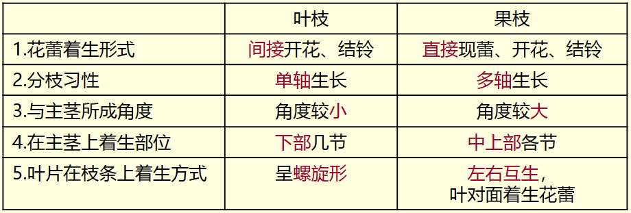

   去木枝在蕾期进行。

   当棉花植株进入蕾期的时候，主要进行营养生长，此时应当将叶枝去掉。叶枝的存在会与果枝争"吃"争"喝"，造成群体
   郁蔽，导致果枝的蕾铃脱落和纤维产量、品质的下降。

2. 我国棉区划分（三大优势区）

   传统：华南棉区、长江流域棉区、黄河流域棉区、北部特早熟棉区、西北内陆棉区

   三大优势区：

   - 黄河流域优势区
   - 长江流域优势区（南方棉区）
   - 西北内陆优势区（新疆棉区）

3. 试述棉花的生育特性与施肥原则

   - 生育特性
     - 喜温、好光、较耐旱；
     - 无限生长习性；
     - 营养生长与生殖生长并进时间长，花期和成熟吐絮期长；
     - 常异花授粉雌雄同花作物；
     - 分枝发育的两向性，蕾铃脱落的普遍性。
   - 施肥原则：适施基肥，早施轻施苗肥，稳施蕾肥，重施花铃肥，补施盖顶肥

4. 试述棉花轻简化栽培

   - 简化种植管理工序、减少作业环节和次数，农机与农艺融合，实现棉花生产轻便简捷、节本增效的新型栽培技术体系。
     - “轻”，机械代替人工，减轻劳动强度；
     - “简”，减少作业环节和次数，简化种植管理；
     - “化”，农机与农艺融合、良种良法配套

5. 棉花花铃期的田间管理技术

   - 重施花铃肥、补施长铃肥(盖顶肥)
   - 及时抗旱灌水
   - 防涝抗台风
   - 适时打顶，精细整枝
   - 防病治虫

6. 试述棉花蕾期的田间管理技术

   - 稳施蕾肥
   - 及时去枝
   - 中耕除草，清沟培土→促根系生长
   - 控制徒长
   - 防治病虫害

7. 根据棉花的生育特点与需肥规律，谈谈棉花的高产施肥技术

   - 苗期：营养生长占优势；生育转换（孕蕾期生殖生长开始）；需肥临界期
     - 早施轻施N PK
   - 蕾期：营养生长(占优势) 、生殖生长并进，生长势强，根系基本建成
     - 稳施蕾肥
   - 花铃期：营养生长生殖生长双旺期；吸收高峰期；盛花后生殖生长占优势;根系吸肥力渐减弱；
     - 重施花铃肥(N肥)；补施长铃肥
   - 吐絮期：生殖生长占优势；吸肥力衰退。

   适施基肥，早施轻施苗肥，稳施蕾肥，重施花铃肥，补施盖顶肥。

8. 浙江省棉花生产主要问题

   产棉小省，用棉大省

   主导品种

9. 怎样防止和控制棉花徒长（试述如何有效防止和控制棉花徒长）

   蕾期徒长、初花徒长

   化控：助壮素/缩节安

   适时打顶，精细整枝

10. 棉花共有几个栽培种？生产上大面积栽培的是哪个棉种？

    - 4个栽培种：非洲棉、亚洲棉、陆地棉和海岛棉。
    - 大面积栽培陆地棉。

11. 棉花育苗移栽有何意义？育苗的方法有哪几种。

    意义：节省棉花种子、可以保证棉花苗齐苗壮、可以有效地控制病虫害的发生、还可以为一年两熟争取时间，提高土地利用率

    方法：薄膜覆盖营养钵育苗、薄膜覆盖方格育苗、塑料穴盘设施化育苗

12. 棉花的产量构成因素有哪些？

    种植密度、单株结铃数、铃重、衣分

13. 棉铃的发育分别可分为哪几个时期？棉纤维的发育分别可分为哪几个时期？

    棉铃：体积增大阶段、内部充实阶段、脱水开裂阶段

    棉纤维：伸长期、加厚期、纤维扭曲期。主要影响因素为温度

14. 试述高产棉田对棉花株高日增量的要求，正常生长的棉花主茎日生长量高峰期出现在哪个生育时期？

    要求：

    - 第一果枝着生的位置距地面距离要近，即第一果枝节位要低。
    - 主茎生长高峰应出现在初花期(见花前后10天)但日增量不宜>2.5cm。
    - 主茎高度应随种植密度而定。

    高峰期：蕾期（盛蕾初花期），**2-2.5cm为宜，超过3cm为徒长**

15. 何谓叶面积指数，棉花叶面积指数的高峰期出现在哪个生育时期？

    - 单位面积土地的植株绿色叶面积
    - 花铃期（盛花结铃期）。盛花期开始生殖生长开始强于营养生长，营养分配以供应花铃为主，叶面积指数达到最大值。**以3.5-4为宜**。

16. 请谈谈我国与新疆棉花生产现状与发展趋势。

    - 新疆气候条件，种植制度，栽培模式，决定了新疆棉花品种与黄河、长江棉区品种有很大不同。株型以紧凑矮化为特点，生长发育以快、集中、早熟为特点。
    - 棉花高产优质技术路线
      - “早、密、矮、膜”栽培技术路线
      - 采取以“高密度种植”为基础，以棉花膜下节水滴灌+矮密早栽培技术+肥
      - 水一体化栽培模式，推广早熟、矮杆、丰产、优质抗病的棉花新品种，
      - 实现了新疆棉花单产水平的飞跃。

## 玉米栽培学

### 一、概述

#### （一）玉米生产的重要性

1. 三大粮食作物之一,高产粮食作物
   - 世界单产、总产最高，收获面积第二
   - 中国总产、种植面积最大，单产低于水稻
2. 玉米是营养丰富的饲料作物——“饲料之王”
3. 玉米是良好的工业原料作物

#### （二）世界玉米生产概况

1. 种植面积与产量

2. 分布与三大玉米生产带

   - 美洲、亚洲
   - 玉米生产带
     - 北美洲的美国，美国中北部玉米带
     - 亚洲中国玉米带
     - 欧洲玉米带

3. 主产国

   - 种植面积：中国、美国、巴西
   - 总产：美国、中国、巴西

4. 进出口

   - 出口：巴西、美国、阿根廷、乌克兰
   - 进口：

5. 消费量

   三大消费国：美国、中国、巴西

#### （三）中国玉米生产概况

1. 种植面积与产量
2. 消费与进出口
3. 玉米生产在粮食生产中的重要性
   - 玉米是我国第一大禾谷类粮食作物，单产低于水稻而高于小麦，居三大粮食作物的第二位；面积和总产超水稻，居三大粮食作物的第一位。
4. 中国玉米种植的分布及区划
   - 中国玉米分布很广，主要集中分布在东北、华北和西南山区
   - 主产省：黑龙江、吉林、内蒙古、山东、河南、河北、辽宁
   - 区划：
     - 北方春玉米区
     - 黄淮平原春、夏播玉米区
     - 西南丘陵山地玉米区
     - 南方丘陵玉米区
     - 西北内陆玉米区
     - 青藏高原玉米区
5. 浙江省玉米生产
   - 在生产季节上有春、夏、秋玉米之分
   - 在用途上有饲料玉米与鲜食玉米
   - 甜、糯、甜加糯玉米

### 二、玉米的起源、栽培与分类

#### （一）玉米的起源和传播

1. 起源中心

   - 美洲大陆

   - 瓦维洛夫等认为：起源地在中美洲的墨西哥、危地马拉和洪都拉斯
   - 达尔文等认为：起源地在南美洲的秘鲁和智利海岸的半荒漠地带
   - 曼格斯多夫，起源地有两个
   - 布卡索夫，多个起源中心
   - 中国云南、广西一带可能是糯玉米的初生起源中心

2. 传播

#### （二）玉米的分类

**玉米栽培种 (*Zea mays* L.)，染色体数2n=2x=20**

1. 按种植时间划分

   - 春玉米
   - 夏玉米
   - 秋玉米
   - 冬玉米
2. 果穗/籽粒形状、胚乳淀粉的结构分布，籽粒外部稃壳有无

   - 胚乳类型
     - 角质胚乳
     - 粉质胚乳
   - 九种类型
     - 马齿型
     - 半马齿型
     - 硬粒型
     - 甜质型：胚乳富含糖分及水分（鲜食玉米）
     - 糯质型：直链淀粉（鲜食玉米）
     - 爆裂型
     - 粉质型
     - 甜粉型
     - 有稃型
3. 按株型分类
   - 平展型：穗位以上叶片与主茎之间的夹角(茎叶夹角)大于60º，不耐密植
   - 紧凑型：小于30°，适应密植
   - 半紧凑型
4. 按生育期长短分类
   - 早熟种
   - 中熟种
   - 晚熟种
5. 按用途分
   - 普通玉米
     - 硬粒型、马齿型、半马齿型
   - 特用玉米：**指玉米子粒中某一特殊物质含量较高、或是利用玉米的不同器官、或是在特殊的采收时期用于特殊的用途，是普通玉米以外的具有特殊的营养品质或适合特种需要的各种玉米类型**
     - 爆裂玉米、糯玉米、甜玉米
     - 高赖氨酸玉米
     - 高油玉米
     - 青贮玉米：收割乳熟期至蜡熟期的整株玉米,或在蜡熟期先采摘果穗,然后收割青绿茎叶的植株,经切碎加工后直接或贮藏发酵后用作牲畜饲料
     - 笋玉米

### 三、玉米栽培的生物学基础

#### （一）玉米的生长发育

1. 生育期：玉米从播种至成熟的天数

2. 生育时期：某种新器官出现,使植株形态发生特征性变化的日期

   - 出苗期：种子发芽出苗，第一片真叶展开苗高约2-3cm的日期
     - 株高：抽雄前，基部到最长叶；抽雄后，雄穗轴顶端
   - 拔节期：茎基部节间开始伸长的日期。雄花序开始分化发育。转折
   - **大喇叭口期：棒三叶(果穗叶及其上下叶称棒三叶)开始抽出而未展开，~12叶。决定雌穗粒数的关键时期；肥水敏感期，肥水需求高峰期**
   - 抽雄期：雄穗主轴尖端从顶叶抽出约3-5cm，50%以上
   - 开花期：雄穗主轴开始开花散粉
   - 吐丝期：雌穗花丝从苞叶露出2-3cm
   - 成熟期（乳熟期,蜡熟期,完熟期）

3. 生育阶段

   （1）苗期：播种-拔节。营养生长阶段，促根壮苗

   （2）穗期：拔节-抽雄。营养生长与生殖生长并进，促叶壮杆，穗

   （3）花粒期：抽雄-成熟。生殖生长，籽粒生长，养根，防早衰，籽粒

#### （二）玉米的器官建成

1. 根的形态、生长与功能

   - 须根系，**由胚根和节根(次生根和支持根)组成**

   （1）胚根(初生根)：包括初生胚根和次生胚根

   （2）节根：长在地下茎节上的叫**地下节根(次生根)**，着生在地上茎节上的叫**气生根或支持根**

2. 茎的形态、生长与功能

   - 矮秆型、中秆型、高秆型
   - 地上节约15-25节
   - 基部节密集，着生次生根
   - 从上向下的第5-8节上的腋芽，可能发育成果穗
   - 基部腋芽可形成分蘖，除饲用玉米外应及早摘除

3. 叶的形态、生长与功能

   - 呈互生排列。全叶可分叶鞘、叶片、叶舌三部分
   - 玉米的叶数14-25片
   - 不同节位叶对产量的效应: 中部叶片>上部叶片>下部叶片。棒三叶最大

4. 雄穗和雌穗的形态特征与分化发育

   - 雌雄同株异花作物；天然杂交率95%左右，是典型的**异花授粉作物**

   （1）雄穗

   -  圆锥花序，由中央主轴和许多分枝组成
   - 每个节有1对小穗:其中1为有柄小穗，位于上方;1为无柄小穗，位于下方
   - 每小穗两朵小花，两个颖片（护颖）
   - 每朵小花由1片**内稃**(内颖)，1片**外稃**(外颖)及3个雄蕊组成
   -  开花的顺序是从主轴中上部开始，然后向上向下同时进行。各分枝的小花开放顺序同主轴。

   （2）雌穗

   - 肉穗状花序

   - 果穗：由穗轴和雌小穗构成
   - 穗轴节很密，**每节着生2个无柄小穗**，成对排列； 每小穗内有2朵小花，**上位花结实，下位花退化**
   - 雌小穗：护颖，内外稃，1个雌蕊及退化的雄蕊。花柱和柱头总称为花丝
   - 吐丝与授粉
     - 一般位于雌穗中下部开始延伸，然后向上下伸展，顶部小花的花丝最晚抽出

   （3）雄穗的分化发育

   - 生长锥未伸长期
   - 生长锥伸长期：生长锥伸长，拔节期
   - 小穗分化期
   - 小花分化期
     - 小花开始分化期
     - 雌雄蕊形成期
     - 雄蕊生长雌蕊退化期
   - 雄性器官发育形成期：大喇叭口期

   （4）雌穗的分化发育

   - 生长锥未伸长期
   - 生长锥伸长期：相当于雄穗小花开始分化期
   - 小穗分化期
   - 小花分化期
   - 雌性器官发育形成期

   （5）雌穗与雄穗分化时期的相关性

   

   （6）幼穗分化进程与叶片的同伸关系

5. 种子的结构与形成

   （1）玉米种子的结构

   - **一般百粒重约25-35g**

   （2）种子的形成过程

   - 籽粒形成期
   - 乳熟期
   - 蜡熟期
   - 完熟期

#### （三）玉米生长生育与光温条件

1. 光照：喜光作物，C4植物，光饱和点约为10万Lx以上，光补偿点为500-1500Lx。短日照作物
   - 在保证正常成熟的条件下，日照时数多，光照强，则产量高。
2. 温度：喜温作物。玉米的生物学零点温度为10℃

#### （四）玉米的产量构成因素

公顷籽粒产量=公顷穗数×穗粒数×粒重

通过合理的栽培措施使玉米群体达到最佳结构，在主攻穗数基础上，使玉米产量三要素达到最佳比例，从而提高玉米产量。

合理密植（增加种植密度是增加穗数最有效的措施）

### 四、玉米栽培技术

#### （一）玉米对土壤的要求与整地

1. 高产玉米对土壤的要求
   - 土层深厚，土壤结构良好，疏松通气
   - 适宜的土壤酸碱度5-8
   - 耕作层有机质和矿质营养丰富
2. 整地：春玉米播前进行适度深耕；夏、秋玉米贴茬播种

#### （二）种子准备与播种

1. 种子准备：

   （1）选用优良品种

   （2）精选种子

   （3）种子处理：晒种、药剂拌种、种子包衣

2. 播种技术

   （1）播种期：春玉米，浙江清明前后播种,7-9月成熟。夏播无早、越早越好

   （2）播种量、播种方法

   - 玉米播种量（公斤/亩）=亩种植密度\*千粒重（g）\*1.5（或2）/（1000\*1000*发芽率)
   - 单粒点播1.5，双粒点播2，条播2
   - 播种方式开沟条播和挖穴点播

   （3）种植密度

   - 品种类型
     - 平展型中晚熟杂交种，3000~3500株/亩；
     - 紧凑型中晚熟杂交种，4000~4500株/亩；
     - 紧凑型中早熟杂交种，4500~5000株/亩
   
   - 肥水条件：肥密瘠疏
   - 播种季节：春稀夏密
   
   （4）种植方式
   
   - 等行距单株条植
   - 宽窄行种植
   
   玉米大豆带状复合种植（套作、间作）
   
   - 选配品种：
     - 玉米选用株型紧凑、适宜密植和机械化收割的高产优质高抗品种；
     - 大豆选用耐阴、耐密、抗倒的高产优质高抗品种。
   - 扩间增光：扩大玉米带与大豆带间距离。
   - 缩株保密度：缩小株距，密度与单作相当。
   - 增产增效，绿色可持续

#### （三）玉米的需肥特性与施肥技术

1. 玉米的需肥规律

   （1）玉米产量与需肥量

   - N：P：K=2:1:2

   （2）不同生长时期玉米对养分的需求特点

   - 不同生育阶段对养分的需求比例
     - 苗期、生育后期少，拔节至抽雄期快、多

   - 不同生育时期对氮磷钾的吸收速率：吸收养分高峰期在**大喇叭口期、乳熟期**

   （3）缺肥症状

2. 玉米的施肥技术

   - 一般原则：适施基肥，早施、轻施和偏施苗肥，稳施拔节肥，重施穗肥，巧施粒肥
   - 施肥方法：
     - 基肥（缺P：-20mg/kg；缺K：-100mg/kg）
     - 种肥：氮肥；微量元素肥料用于拌种或浸种，硼锌
     - 追肥
       - 苗肥
       - 秆肥（拔节肥）：小喇叭口期
       - 穗肥：大喇叭口期
       - 粒肥
     - 简化栽培，简化施肥，追肥大多只施苗肥和穗肥

#### （四）田间管理

1. 苗期管理（出苗-拔节）——苗全匀壮

   （1）查苗、补苗和间苗、定苗

   （2）中耕除草

   （3）酌施苗肥

   （4）防治虫害：小地老虎

2. 穗期管理（拔节-抽雄）——壮杆攻穗

   （1）去分蘖

   （2）中耕-施肥-培土：拔节-小喇叭口期；大喇叭口期

   （3）灌溉与排水：拔节-小喇叭口期；大喇叭口期

   （4）防治病虫害：玉米螟

   （5）使用玉米健壮素

3. 花粒期管理（抽雄-籽粒成熟）——保叶保根防早衰，粒

   （1）巧施粒肥：春玉米

   （2）人工去雄

   （3）人工辅助授粉

   （4）灌溉与排水

#### （五）收获与贮藏

1. 收获
   - 食用玉米：完熟期
   - 饲用青贮玉米：乳熟末期至蜡熟期
   - 鲜食玉米：乳熟期
2. 贮藏
   - 穗藏
   - 粒藏：13%以下，低于30℃

### 五、特用玉米栽培技术

#### （一）鲜食玉米栽培技术

**甜玉米、糯玉米**、甜加糯玉米和水果玉米

1. 选用良种：浙江省主推糯玉米和甜玉米品种
2. 严格隔离：防止串粉，保证品质。糯质型，隐性基因控制
   - 空间隔离
   - 时间隔离
3. 错开播期，延长供应期：可进行春播、夏播或多期播种
4. 保证种植密度
5. 加强田间管理
6. 适时收获

#### （二）青贮饲用玉米栽培技术要点

1. 选择良种：选择生物产量高，抗病抗倒，成熟后茎叶青绿的品种
2. 分期播种
3. 增加密度
4. 肥水充足：特别增施钾肥
5. 适期收割：乳熟期至蜡熟期收获

### 思考题

#### 名词解释

1. 紧凑型玉米：茎叶夹角<30°，适应密植
2. 平展型玉米：穗位以上叶片与主茎之间的夹角(茎叶夹角)大于60º，不耐密植
3. 半紧凑型玉米：30°~60°
4. 棒三叶：穗位叶及其上下叶
5. 大喇叭口期：棒三叶开始抽出而未展开，植株心叶丛生，上平中空，状如喇叭
6. 糯玉米：胚乳全部由角质胚乳组成，不透明，淀粉全部是支链淀粉，具有较高的粘滞性及适口性。
7. 甜玉米：胚乳中含有较多的糖分及水分，脂肪、淀粉和蛋白质含量低。
8. 鲜食玉米：收获青果穗食用或加工的玉米。甜玉米、糯玉米、甜加糯玉米和水果玉米。
9. 特用玉米：相对于普通玉米而言，指玉米籽粒中某些特殊物质的含量较高，或利用玉米的不同器官或不同采收期作为特殊用途的玉米类型。
10. 高油玉米：含油量6.5%~14%（普通玉米4%~5%）。含有较高的不饱和脂肪酸、蛋白质和维生素E、A。
11. 生育期：玉米从播种至成熟的天数
12. 生育时期：某种新器官出现,使植株形态发生特征性变化的日期

#### 简答题

1. 世界玉米生产带。

   - 美国中北部玉米带
   - 亚洲中国玉米带
   - 欧洲玉米带

2. 世界玉米生产(总产)三大主产国。

   美国、中国、巴西

3. 中国玉米种植优势区。

   - 北方春玉米区
   - 黄淮平原春、夏播玉米区
   - 西南丘陵山地玉米区

4. 根据籽粒形状、胚乳淀粉的结构，籽粒外部稃壳的有无，可将玉米分为哪几个类型(亚种)?

   **马齿型，半马齿型，硬粒型，甜质型，糯质型**，粉质型，甜粉型，有稃型，爆裂型

5. 玉米按株型分哪三类?

   平展型、紧凑型、半紧凑型

6. 玉米品种按生育期分类可分为哪几种类型？

   早熟种、中熟种、晚熟种

7. 玉米的一生分哪几个生育时期、哪几个生育阶段？

   - 生育时期：出苗期、拔节期、抽雄期、开花期、吐丝期、成熟期
   - 生育阶段：苗期、穗期、花粒期

8. 种子的形成过程

   - 籽粒形成期
   - 乳熟期
   - 蜡熟期
   - 完熟期

9. 雌穗的形态特征与分化过程

   形态特征：

   - 肉穗状花序

   - 果穗：由穗轴和雌小穗构成
   - 穗轴节很密，**每节着生2个无柄小穗**，成对排列； 每小穗内有2朵小花，**上位花结实，下位花退化**
   - 雌小穗：护颖，内外稃，1个雌蕊及退化的雄蕊。花柱和柱头总称为花丝
   - 吐丝与授粉
     - 一般位于雌穗中下部开始延伸，然后向上下伸展，顶部小花的花丝最晚抽出

   分化过程：

   - 生长锥未伸长期
   - 生长锥伸长期
   - 小穗分化期
   - 小花分化期（开始，雌雄蕊形成，雄蕊退化）
   - 性器官发育形成期

10. 玉米的产量构成因素

    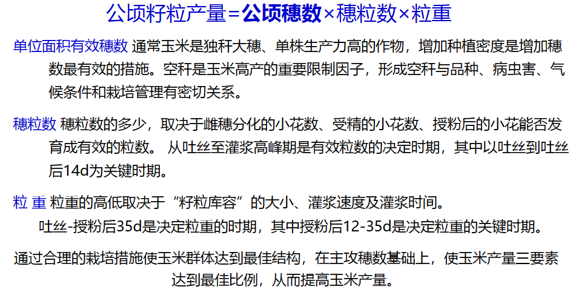

11. 糯玉米、甜玉米为什么需要隔离种植?如何有效做好隔离种植

    玉米是雌雄同株异花作物，天然杂交率95%左右，是典型的异花授粉作物。防止串粉，保证品质。

    空间隔离：400m，温室大棚，天然屏障

    时间隔离：播期推迟，扬花授粉错开

12. 简述玉米苗期、**穗期**、花粒期田间管理措施。

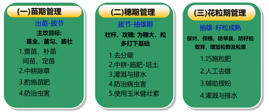

13. 如何利用玉米的养分吸收特点设计玉米的高产施肥技术措施？

    苗期吸收养分少；拔节至抽雄期吸收养分速度快、数量多，是需要养分的关键时期；生育后期，吸收量渐减少
    吸收养分高峰期：大喇叭口期、 乳熟期。玉米施肥应根据这一特点，尽可能在需肥高峰期之前施肥。

14. 试述鲜食型糯玉米和超甜玉米栽培技术要点。

    - 选用良种
    - 严格隔离
    - 错开播期，延长供应期
    - 保证种植密度
    - 加强田间管理
    - 适时收获

15. 以玉米为例，试述如何在实际生产中使其获得优质高产

16. 玉米去雄的好处是什么？如何操作？

    好处：
    ①去雄后节省养分、水分，可供雌穗发育，增加穗粒数(玉米在抽穗开花过程中，雄穗呼吸作用旺盛，消耗一定养分)；
    ②改善植株上部光照条件、降低株高、防止倒伏；
    ③兼防玉米螟的效果（将部分玉米螟带出田外，减少螟害）操作：
    ① 雄穗刚抽出但尚未散粉(雄穗从顶叶抽出1/3或1/2至散粉前)时进行。
    ② 防止损伤叶片，去掉的雄穗要带到田外。
    ③ 去雄要根据天气和植株的长相灵活掌握。
    ④ 去雄要注意去小株、去弱株。去弱留壮。

17. 简述玉米人工辅助授粉的意义和方法。

    意义
    减少缺粒秃尖、增粒增产的有效措施

    方法
    人工辅助授粉，在开花吐丝的晴天上午8-11 时开花最多时，先用采粉盘收集50-100 株花粉混合后，用授粉器逐株均匀地授在雌穗花丝上，隔天授粉1 次，连续进行2-3次。可以增加玉米穗粒数，从而起到增产作用

18. 作为鲜食用的糯玉米、甜玉米何时采收为好？

    鲜食玉米，授粉后20-25天时收获并及时销售或速冻，收获过晚和过早，都会影响品质和品相。加工和鲜食甜玉米成熟的标志是花丝完全干枯，但是籽粒并未完全成熟，果穗坚硬，苞叶紧抱果穗，叶片保持青绿，籽粒饱满，呈现籽粒固有的颜色，籽粒内充满乳浆。

## 马铃薯栽培学

### 一、概述

#### （一）马铃薯生产在国民经济中的意义

1. 重要的粮食作物之一（玉米、水稻、小麦、土豆）
2. 营养成分全，营养价值高，兼具主粮、蔬菜和功能食品的功能
3. 用途广泛重要
   - 纺织、医药制造、食品深加工、铸造等工业的重要原料

4. 适应性强，生育期短，适于与多种作物（粮、棉）**间套作**，能充分利用高杆作物行间的光能，**提高复种指数**，增加单位面积产量

#### （二）生产状况

1. 全球性作物
   - 种植面积排名：中国、印度、乌克兰、俄罗斯……
   - 年总产量排名：中国、印度、乌克兰、俄罗斯、美国……
   - 单产：新西兰最高，中国低于全球平均单产

#### （三）马铃薯栽培区

1. 北方一作区

   - 气候特点：气候凉爽，日照充足，昼夜温差大

   - 栽培品种：中熟及中晚熟为主

   - 栽培特点：主要产区，栽培面积大而集中，**种植面积占50%以上。重要的种薯基地**
2. 中原二作区

   - 气候特点：夏季长，温度高，不利于马铃薯的生长

   - 栽培品种：早熟品种，抗病，休眠期短……

   - 栽培特点：春秋两季栽培
3. 南方二作区
   - 气候特点：海洋性气候，夏长冬暖，四季不分明，日照短
   - 栽培品种：多种多样
   - 栽培特点：秋冬春三季，自然条件悬殊，耕作制度多样。**发展潜力最大的区域**，有很多冬闲田
4. 西南单、双季混作区
   - 低山河谷或盆地，气温高、无霜期长，春早、夏长、冬暖，雨量大、湿度大，适合种两季，与春秋两作区相似，以早熟品种为主
   - 高寒山区，气温低、无霜期短、四季分明、夏季凉爽，是马铃薯的主要分布地区，与北方一作区相似，需要抗晚疫病的晚熟品种
   - 栽培特点：产量高、增产潜力大，**栽培面积占40%以上，是我国马铃薯抗病育种和生产的重要基地**

### 二、马铃薯栽培的生物学基础

茄科（Solanaceae）茄属（*Solanum*）一年生草本植物。

*Solanum tuberosum*

#### （一）起源与分布

1. 起源：起源中心在南美洲西部沿岸的智利和秘鲁的**安第斯山区**

2. 传播：分布到全世界160多个国家和地区。明朝万历年间传入中国。

3. 分类：共有 8 个栽培种，154 个野生种。

   栽培种为四倍体（**48条染色体**），共两个亚种：

   - subsp. *Chilotanum*，马铃薯亚种，智利种，即**普通栽培种**，全世界范围种植，**属长日照类型**

   - subsp. *Andigena*，**安第斯亚种**，主要种植于南美洲安第斯山地区，**属短日照类型**

   - 两者差异很小

#### （二）品种类型

1. 熟性来分：极早熟、早熟、中熟、中晚熟、晚熟五类

2. 用途来分：鲜食、淀粉加工、全粉加工、炸片加工、炸条加工和烧烤等多种类型

#### （三）形态特征

1. 根

（1）两种类型：

- **直根系——种子繁殖所发生的根，有主侧根之分**

- **须根系——块茎繁殖所发生的根，为不定根，无主、侧根之分**

（2）**须根系**可分：

- 初生根——在**初生芽的基部**3-4节上发生的不定根，称为**芽眼根**或节根，这是发芽早期发生的根系，分枝能力强。主体根系。
- 后生根——在**地下茎的上部各节**上陆续发生的不定根，称为**匍匐根**，一般每节上发生3-6条，分枝能力较弱，长度较短。分布在表土层，生育后期培土有利此类根系生长。匍匐根对磷素有较强的吸收能力。

2. 茎

包括**地上茎、地下茎、匍匐茎和块茎**，都是**同源器官**，但形态和功能却各不相同。

（1）地上茎

①来源：块茎芽眼萌发的幼芽发育形成的地上枝条

②特点：

- 草质多汁，有茸毛和腺毛，幼茎上特别多，成长时逐渐脱落

- 节部横切面为圆形，节间部分为三角形或四棱形。

- 在茎的棱上，由于组织的增长形成突起的翅状物——茎翅（翼），分直翅与波状翅（直翼、波状翼、宽翼与窄翼），可作为鉴定品种的特征之一。

- 茎的色泽有绿色、紫色，是区别品种的特征之一

- 具有分枝性。早熟种分枝力弱，晚熟种分枝多而长。

- 茎的高度和繁茂程度因品种不同有很大差异、受栽培条件影响也较大。早熟品种节数少，茎较矮；中晚熟品种节数较多、茎较高。

- 再生能力强。生产上采用分枝、剪枝、扦插和压蔓等措施来增加繁殖系数以提高产量

（2）地下茎

主茎的地下结薯部位。母薯长出的茎

（3）匍匐茎

①来源：是由地下茎节上的腋芽发育而成，顶端膨大形成块茎。

②特点：
- 一般为白色
- 顶端呈弯曲状
- 数目多少因品种而异
- 正常情况下匍匐茎的成薯率为50-70%
- 匍匐茎具有向地性和背光性，入土不深
- 匍匐茎的长短因品种而异，早熟种较短，晚熟种较长，栽培种较短，野生种较长
- 具有地上茎的一切特性，担负着输送大量营养和水分的功能

（4）块茎

①来源：缩短而肥大的**变态茎**。当匍匐茎顶端停止极性生长后，由于**皮层、髓部及韧皮部的薄壁细胞的分生和扩大**，并积累大量淀粉，从而使匍匐茎顶端膨大形成块茎

②特征：

- 鳞片状退化小叶，凋萎脱落，残留的叶痕呈新月状，称为**芽眉**。芽眉内侧表面向内凹陷成为芽眼。

- **芽眼**在块茎上呈螺旋状排列，顶部密，基部稀。块茎最顶端的一个芽眼较大，内含芽较多，称为顶芽，顶端优势明显。
-  芽眼过深是一种不良性状
  
- 每个芽眼内有三个或三个以上未伸长的芽，中央较突出的为主芽，其余的为侧芽（或副芽），**发芽时主芽先萌发**。
  
- 在块茎萌芽时：**顶芽最先萌发**，而且幼芽生长快而壮，从顶芽向下的各芽眼，依次萌发，其发芽势逐渐减弱

③块茎大小：圆形、长筒形、椭圆形。每一品种的成熟块茎，都具有固定的形状，是鉴别品种的重要依据之一。

④皮色和肉色：皮色多样。以黄肉和白肉者为多。

3. 叶
- **单叶**：最初发生的几片初生叶均为单叶
- **复叶**：随着植株的生长，逐渐长出**奇数羽状复叶**。复叶**互生，呈螺旋排列**
  - 每个复叶由**顶生小叶**和3-7对**侧生小叶**，侧生小叶之间的**小裂叶**，侧生小叶叶柄上的**小细叶**和复叶叶柄基部的**托叶**构成。
  - 顶生小叶叶形略大，形状和侧生小叶的对数，是品种的特征之一

4. 花

马铃薯为**自花授粉作物**。花序为**聚伞花序**。花冠**合瓣**，基部合生成管状，顶端五裂，并有星形色轮。**雄蕊5枚，雌蕊1枚**。子房上位，由两个连生心皮构成，中轴胎座，胚珠多枚。

5. 果实与种子

果实为**浆果**。种子很小，**千粒重为0.4-0.6g**，刚收获的种子有6个月左右的休眠期，贮藏时间长。

**开花不结实的原因：**

- 因高温或其他环境因素导致的花粉败育

- 离层环形成离层，导致落蕾、落花或落果

- 胚珠退化

- 遗传与生理上的不孕（自交不亲和）

  生产上所用的马铃薯均为复合的杂交种，不孕不育的概率极大

  需解决：自交不亲和；自交衰退

**育种**：1.0，随机（农家）育种；2.0，杂交育种；3.0，分子育种；4.0，智能育种

☆**马铃薯基因组设计育种：Genome design of hybrid potato**

存在问题：马铃薯的遗传改良进程缓慢；薯块的繁殖系数低、储运成本高、易携带病虫害

目标：用二倍体育种替代四倍体育种，并用杂交种子繁殖替代薯块繁殖

克服两个关键障碍：

- 自交不亲和——敲除了控制马铃薯自交不亲和的S-RNase基因，筛选到了S-RNase的天然突变体，并克隆了来自野生种的自交亲和基因
- 自交衰退——自交衰退的有害突变镶嵌分布在马铃薯的两套基因组中，无法通过重组将它们彻底淘汰。可以通过对遗传背景差异大的自交系进行杂交来掩盖杂交种中有害突变的效应

主要环节：

- 选择用于培育自交系的起始材料，选择标准是起始材料的基因组杂合度较低和有害突变数目较少
- 对起始材料自交群体进行遗传解析，根据全基因组偏分离分析和表型评价，确定大效应有害等位基因和优良等位基因在基因组中的分布
- 选育自交系，根据前景和背景选择淘汰大效应的有害突变，并聚合优良等位基因，尤其是要打破大效应有害突变和优良等位基因之间的连锁
- 选育杂交种，根据基因组测序结果，选择基因组互补性较高的自交系进行杂交，获得杂种优势显著的杂交种

#### （四）生长发育特性

120 days

1. 生育时期

   （1）块茎的萌发和出芽

   ​	根系形成、芽的生长以及叶、侧芽和花原基分化

   （2）幼苗生长、匍匐茎伸长（出苗-出蕾）

   ​	茎叶和根系的生长

   ​	主茎孕育花蕾后，匍匐茎不再伸长，顶端膨大

   （3）块茎形成、茎叶生长（孕蕾-开花初期）

   ​	块茎形成期，**是决定块茎数量多少的关键时期**，地上部茎叶生长与地下部块茎形成并进

   （4）块茎增长、茎叶繁茂（盛花-茎叶衰老）

   ​	块茎增长期，叶面积已达最大值，**决定块茎体积大小的关键时期**

   （5）淀粉积累期（茎叶衰老-茎叶枯萎）

   ​	淀粉的积累一直延续到茎叶全部枯死之前。延迟早衰

   （6）成熟收获期

   ​	收获时期决定于生产目的和轮作中的要求。地上部茎叶黄枯，块茎内淀粉积累充分。

2. 块茎的休眠

   自然休眠和被迫休眠

   （1）休眠原因

   ​	块茎休眠及其解除受内在因素和外界环境所支配。

   ​	β-抑制剂（脱落酸类物质）等植物激素

   （2）影响因素

   ​	温度、湿度。高温、高湿条件下能缩短休眠期；低温、干燥则能延长休眠期。

#### （五）生长发育对环境条件的要求

1. 温度
 - **性喜冷凉，不耐高温。**
 - **日平均气温17-21℃为适宜，更广泛15-20℃。**（需记这个温度）
 - 芽条生长的最适温度为13-18℃。范围内，up-up
 - 茎的伸长以18℃最适宜。高温徒长
 - 对花器官的影响主要是夜间温度，**18℃时大量开花**（记住）
 - ……

2. 光照

 - 马铃薯是**长日照作物**。日照时间长，地上部生长快，块茎延迟形成，产量下降；短，块茎产量高
 - 一般早熟品种对日照反应不敏感，在较长日照条件下亦能结薯，晚熟品种则必须在短日照条件下才能形成块茎
 - 高温一般促进茎伸长，不利于叶片和块茎的发育
 - 根深叶茂→块茎增长

3. 水分

   蒸腾系数：形成单位干物质重所需水分

   土壤湿度保持田间最大持水量的60％-80％为最适宜（成团，可散）

   **需水临界期在块茎增长期**

4. 土壤

   表土层深厚，结构疏松，排水通气良好和富含有机质的土壤为最适宜

   **砂壤土**

   pH5.5-6为最适宜

   块茎产量随土壤中氯离子含量增高而降低

5. 矿质营养

   马铃薯对肥料三要素的需求量，**以钾最多，氮次之，磷最少**

#### （六）马铃薯的退化与防止**

**马铃薯退化：**马铃薯经多年多季留种后反复种植时，植株的生长势会逐年逐季衰退，块茎变小，产量下降，品质变劣，最后失去种用价值

1. 原因
   - 内因：品种的抗逆性，即抗病毒、抗高温的能力
   - 外因：环境因素，即**病毒（直接外因）**、高温、营养

2. 防止措施
   - 选育和推广抗病毒品种
   - 秋播和晚播留种
   - 去除病毒
     - 选择优株扩大繁殖，淘汰有病的植株
     - 利用实生薯作种（***种子繁育的实生苗结出的薯块茎***）
     - 茎尖培养脱毒种薯
     - 小整薯播种，可避免借切刀传毒、传菌
     - 改进栽培技术和贮藏条件

### 三、马铃薯栽培技术

#### （一）轮作换茬

1. 轮作
   - 马铃薯**忌连作**，宜采用轮作方式
   - 避免与茄科作物、块根、块茎类作物轮作

2. 间、套作

   增加产量，扩大种植面积

#### （二）整地与施肥

1. 整地
   - 喜砂壤或壤土
   - 秋深翻晒垄：促土壤熟化，消灭害虫病原物，提高墒情
   - 耕地深度，一般以20-25cm为宜

2. 施肥

   （1）需肥特征

   （2）施肥技术

   - 原则：有机肥为主，化肥为辅，重施底肥，早施追肥，增施钾肥

   - 重施基肥。基肥用量一般占总施肥量的2/3以上

   - 及早追肥。

   - 马铃薯开花后，一般不进行根际追肥，特别是不能追施氮肥，马铃薯开花后，主要以叶面喷施磷、钾肥为主。

   - 马铃薯是喜钾作物，忌氯

#### （三）播种

1. 播前种薯准备

   - 种薯出窖与挑选

   - **种薯处理（催芽、切块、小整薯留种、药剂处理）**
     - 催芽：解除休眠，缩短出苗时间，促进生育进程
     
     - 种薯切块：a. 能节约种薯，降低生产成本；b. 打破休眠，促进发芽、出苗
     
     - 小整薯留种：推荐
     
     - 拌种与药剂处理
   
2. 播种期

   - 适期播种

3. 播种方式

- 垄作
- 单垄单行等行距或单垄双行的宽窄行

4. 种植密度

   （1）产量结构
   
   - 单位面积产量=每亩株数×单株结薯重
   - 单株结薯重=单株结薯数×平均薯块重
   - 单株结薯数=单株主茎数×平均每主茎结薯数
   - **单位面积产量=每亩株数×单株主茎数×平均每主茎结薯数×平均薯块重**

​      （2）种植密度

北方一作区，以每亩3800-5500株为宜

南方地区，一般每亩都在6000株以上

在相同种植密度下，1）以宽、窄行方式为好；2）或以加大宽行、株(穴)距，适当增加每穴种薯数的方式较好

**群体-个体协调发展**

#### （四）田间管理

1. 发芽出苗管理

   促根壮芽，防缺苗

2. 出苗后的田间管理
   - 查苗补苗
   - 中耕除草和培土
   - 追肥
   - 灌溉和排水
   - 防治病虫害

#### （五）收获与储藏

1. 收获

- 当植株**大部分茎叶枯黄**时，块茎很容易与匍匐茎分离，周皮
  变硬而厚，块茎干物质含量达到最高限度，为食用块茎的最
  适收获期。
- **种用块茎应比食用提前5-7天收获**，以避免低温霜冻危害，提
  高种性。

2. 贮藏

   （1）生理生化变化

   （2）基本要求

   （3）基本条件和方法
   
   **1-4℃，不超过7℃，相对湿度高一些。避免见光。**

#### （六）其他马铃薯栽培技术

1. 稻草覆盖免耕秋马铃薯栽培

2. 双膜冬播马铃薯栽培

3. 马铃薯雾化栽培

   主要用于脱毒种薯的种植

### 思考题

#### 名词解释

1. 芽眼根
在初生芽的基部3 – 4节上发生的不定根，称为芽眼根或节根，这是发芽早期发生的根系，分枝能力强，是马铃薯的主体根系。又称初生根。

2. 匍匐根
在地下茎的上部各节上陆续发生的不定根，称为匍匐根，分枝能力较弱，长度较短，分布在表土层。对磷素有较强的吸收能力。

3. 地上茎
由块茎芽眼萌发的幼芽发育形成的地上枝条。

4. 地下茎
马铃薯的地下茎，即主茎的地下结薯部位。

5. 匍匐茎
是由地下茎节上的腋芽发育而成，顶端膨大形成块茎。

6. 块茎
一缩短而肥大的变态茎。当匍匐茎顶端停止极性生长后，**由于皮层、髓部及韧皮部的薄壁细胞的分生和扩大**，并积累大量淀粉，从而使匍匐茎顶端膨大形成块茎。

7. 马铃薯退化
马铃薯经多年多季留种后反复种植时，植株的生长势会逐年逐季衰退，块茎变小，产量下降，品质变劣，最后失去种用价值，这种现象就是马铃薯退化。

8. 块茎形成期
从块茎具有雏形开始，经历地上茎顶端封顶叶展开、第一花序开始开花、全株匍匐茎顶端均开始膨大、直到最大块茎直径达3-4㎝、地上部茎叶干物重和块茎干物重平衡为止，为块茎形成期。**是决定块茎数量多少的关键时期**。

9. 块茎增长期
从地上部与地下部干物重平衡期开始，即进入块茎增长期。此期叶面积已达最大值，茎叶生长逐渐缓慢并停止，地上部制造的养分不断向块茎输送，块茎的体积和重量不断增长。 **是决定块茎体积大小的关键时期。**

#### 简答题

1. **简述我国四个马铃薯栽培区及其生态特点？**

   答：

   （1）北方一作区

   - 气候特点：气候凉爽，日照充足，昼夜温差大

   - 栽培品种：中熟及中晚熟为主

   - 栽培特点：主要产区，**栽培面积大**而集中，**种植面积占50%以上。重要的种薯基地**

   （2）中原二作区

   - 气候特点：夏季长，温度高，不利于马铃薯的生长

   - 栽培品种：早熟品种，抗病，休眠期短……

   - 栽培特点：春秋两季栽培

   （3）南方二作区

   - 气候特点：海洋性气候，夏长冬暖，四季不分明，日照短
   - 栽培品种：多种多样
   - 栽培特点：秋冬春三季，自然条件悬殊，耕作制度多样。**发展潜力最大的区域**，有很多冬闲田

   （4）西南单、双季混作区

   - 低山河谷或盆地，气温高、无霜期长，春早、夏长、冬暖，雨量大、湿度大，适合种两季，与春秋两作区相似，以早熟品种为主
   - 高寒山区，气温低、无霜期短、四季分明、夏季凉爽，是马铃薯的主要分布地区，与北方一作区相似，需要抗晚疫病的晚熟品种
   - 栽培特点：**产量高**、增产潜力大，**栽培面积占40%以上，是我国马铃薯抗病育种和生产的重要基地**

2. **马铃薯根系的类型有哪几种？**

   - 直根系——种子繁殖所发生的根，有主侧根之分

   - 须根系——块茎繁殖所发生的根，为不定根，无主、侧根之分
     - 须根系又可分为初生根（芽眼根）和后生根（匍匐根）

3. **茎的类型有哪几种，有何形态和功能上的差异？**

   | 茎     | 形态                                                         | 功能                                                         |
   | ------ | ------------------------------------------------------------ | ------------------------------------------------------------ |
   | 地上茎 | 直立，有分枝特性。茎翅。                                     | 支撑枝叶，运输养分，水分和进行光合作用。再生能力很强。       |
   | 地下茎 | 长度一般为10cm左右。节数多数品种为8节。                      | 节上发生匍匐根和匍匐茎。养分水分运输枢纽，起承上启下的作用。 |
   | 匍匐茎 | 是由地下茎节上的腋芽发育而成，顶端膨大形成块茎。一般为白色。顶端呈钥匙形的弯曲状。匍匐茎具有向地性和背光性，入土不深。 | 担负着输送营养和水分的功能，节上能形成纤细的不定根和匍匐茎。 |
   | 块茎   | 缩短而肥大的变态茎。芽眉，芽眼。                             | 贮存养分。繁殖器官。                                         |

   

4. 马铃薯一生分为哪几个生育时期，各有何特点？

   | 生育时期   | 特点                                                         | 备注                                                         |
   | ---------- | ------------------------------------------------------------ | ------------------------------------------------------------ |
   | 萌发出苗期 | 根系形成、芽的生长以及叶、侧芽和花原基分化                   | 根深。促进早发芽、多发根、快出苗、出壮苗。                   |
   | 幼苗期     | 茎叶和根系的生长。                                           | 孕蕾后，匍匐茎不再伸长，顶端开始膨大。促根，促苗，协调茎叶与块茎的生长。 |
   | 块茎形成期 | 地上部茎叶生长与地下部块茎形成并进                           | 叶茂。是决定块茎数量多少的关键时期                           |
   | 块茎增长期 | 叶面积已达最大值，茎叶生长逐渐缓慢并停止，地上部制造的养分不断向块茎输送，块茎的体积和重量不断增长。 | 决定块茎体积大小的关键时期                                   |
   | 淀粉积累期 | 块茎日增重达最大值。以淀粉积累为中心，淀粉的积累一直延续到茎叶全部枯死之前。 | 延迟早衰                                                     |
   | 成熟收获期 | 没有绝对的成熟期，收获时期决定于生产目的和轮作中的要求。一般当植株地上部茎叶黄枯，块茎内淀粉积累充分时。 |                                                              |

   

5. 马铃薯块茎休眠的原因及影响因素？

   - 内在因素：植物激素的抑制作用
     - 块茎内存在β-抑制剂（脱落酸类物质）等植物激素，这些激素抑制了α-淀粉酶、β-淀粉酶、蛋白酶、核糖核酸酶的活性和氧化磷酸化过程，从而使芽缺少所需要的可溶性糖类和进行代谢活动所需的能量，迫使块茎保持休眠状态
   - 外界环境：温度、湿度
     - 高温、高湿条件下能缩短休眠期；
     - 低温、干燥则能延长休眠期。

6. 马铃薯退化的原因及防止措施？

   - 原因
     - 内因：品种的抗逆性，即抗病毒、抗高温的能力
     - 外因：环境因素，即**病毒（直接外因）**、高温、营养等
     
   - 防止措施
     - 选育和推广抗病毒品种
     - 秋播和晚播留种：抗病力增强，不利于病毒的繁殖与感染
     - 去除病毒
       - 选择优株扩大繁殖，淘汰有病的植株；
       - 利用实生薯作种（**种子繁殖产生的实生苗结出的块茎**）；
       -  茎尖培养脱毒种薯；
       - 小整薯播种，可避免借切刀传毒、传菌；
       - 改进栽培技术和贮藏条件。
   

7. 简述马铃薯用小整薯做种的意义。
   - 避免切刀传病，减轻青枯病、疮痂病、环腐病等发病；
   - 能最大限度地利用种薯的顶端优势和保存种薯中的养分、水分；
   - 增强抗旱能力，出苗整齐健壮、生长旺盛、结薯数增加，显著增产等作用。
   - 节省切块用工，减少生产成本；
   - 便于机械播种，提高播种效率和质量。
8. 马铃薯播前种薯处理的主要方法有哪些？
   - 催芽：解除休眠，缩短出苗时间，促进生育进程
   - 切块：能节约种薯，降低生产成本；打破休眠，促进发芽、出苗。
   - 小整薯留种
   - 拌种与药剂处理
9. 简述马铃薯田间管理技术要点？
   - 发芽出苗：促进壮苗，防缺苗
   - 出苗后
     - 查苗补苗
     - 中耕除草和培土
     - 追肥
     - 灌溉和排水
     - 防治病虫害：晚疫病、青枯病、环腐病、疮痂病、癌肿病
10. 简述马铃薯的需肥特点和施肥方法？
    - 需肥特点
      - 马铃薯一生对N、P、K的吸收量随着植株生长而变化，幼苗期吸收较慢，茎叶生长期吸收猛增，块茎增长期又逐渐缓慢下来。
    - 施肥方法
      - 原则：有机肥为主，化肥为辅，重施底肥，早施追肥，增施钾肥。
        - 重施基肥。基肥用量一般占总施肥量的2/3以上
        - 及早追肥。幼苗期要追施氮肥。马铃薯开花后，一般不进行根际追肥，特别是不能追施氮肥，马铃薯开花后，主要以叶面喷施磷、钾肥为主
      - 喜钾作物，忌氯作物。选用硫酸钾。

## 大豆栽培学

### 一、概述

#### （一）大豆生产的重要性

1. **五大农作物之一**（玉米、水稻、小麦、油菜、大豆），大概种植面积第四
2. 重要的食用油来源
3. 粮食作物、养地作物、饲料作物、工业原料、油料作物
4. **蛋白质含量40%**，全价蛋白；**含油量20%**，豆油不饱和脂肪酸含量在85%左右

#### （二）世界大豆生产

1. **三大国**：巴西（38%）、美国（31%）、阿根廷（14%）
2. 最大出口国：巴西、美国
3. **最大进口国：中国**

#### （三）中国大豆生产

1. **分布区**：东北春大豆区、黄淮海夏大豆区、南方大豆区

   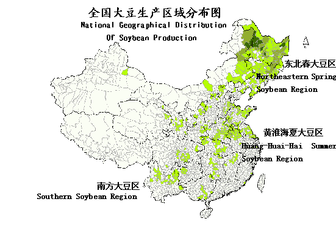

2. **省份最大：黑龙江**

3. 问题：消费量逐年上升；进口量迅速上升；进口>>>国产

盖钧镒

设计育种

### 二、大豆栽培的生物学基础

#### （一）大豆的起源和分类

1. 豆科大豆属。***Glycine max***，soybean。菊-兰-豆-禾本
2. 起源：**起源于中国**
3. 野生大豆的利用价值——了解但重要
4. **分类：**野生大豆和栽培大豆
   - 栽培大豆：
     - 春大豆型：短日性弱
     - 夏大豆型：短日性较强，16h
     - 秋大豆型：**短日性极强**，14h
     - 冬大豆型：短日性较弱

#### （二）大豆的形态特征

1. 种子

   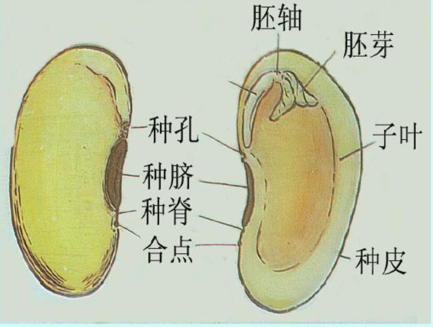

2. 根

   - 直根系，主根、侧根和根毛
   - 根瘤
   - SHR-SCR模块通过决定皮层细胞命运调控豆科植物根瘤起始
   - 人工改造根瘤菌

3. 茎

   - 主茎和分枝
   - 主茎生育习性：**直立型**、半直立型、半蔓生型、蔓生型
   - 主茎上分枝多少：主茎型、中间型、分枝型

4. 叶

   - 子叶、单叶、复叶
   - 子叶、单叶对生；复叶互生
   - 中部叶存留时间长

5. 花

   - 总状花序，蝶形花
   - 雄蕊10枚，二体雄蕊

6. 荚

   - 荚果，单心皮
   - 每荚1-4粒种子，以2-3粒居多
   - 表皮被茸毛
   - 个别无茸毛或荚皮硬者抗食心虫

#### （三）大豆的生长习性

1. **结荚习性**
   - 有限结荚型
   - 无限结荚型
   - 亚有限结荚型
   - **生产应用：重要生态性状，原因应用**
     - 南有限；北无限
     - 雨量充沛、土壤肥沃，宜种有限性品种
     - 干旱少雨、土质瘠薄，宜种无限性品种
     - 雨量较多、肥力中等，可选用亚有限性品种

#### （四）大豆生长发育特征

包括营养生长期和生殖生长两个时期

1. **生育期***

   （1）萌发出苗期

   （2）幼苗期：根系形态建成，根瘤形成

   （3）花芽分化期：4-5复叶，分枝

   （4）开花结荚期：伸长增宽加厚。开花-结荚3-7day

   （5）鼓粒期

   （6）成熟期：水分含量降低

   **花芽分化期和开花结荚期——营养、生殖生长并进期**

   **对产量影响最大——花芽分化期、开花结荚期**

   **对品质影响最大——鼓粒期、成熟期**

2. 特点

   - 营养生长与生殖生长并进
   - **光合产物局部供应和同侧运输（棉花亦此）**
   - 落花落荚
   - 根瘤固氮

#### （五）大豆生长对环境的要求

1. 温度：喜温。**20-25℃**。**开花期最敏感**。
   - 初花期低温影响百粒重
   - 开花后期低温影响
2. 水分
   - **开花结荚期最敏感**
3. 养分
   - 大豆是需要营养元素较全，需肥较多
   - **Mo、B、Mn促进根瘤形成**
   - 需肥规律
     - 苗期：对养分的需求量少。充足磷肥，少量氮肥
     - 开花结荚期：吸收高峰
     - 鼓粒期后：吸收能力下降
4. 光照
   - 光周期
     - **短日照作物**
     - **南方夏大豆和秋大豆要求短日照最为明显**
     - 早熟品种的临界光周期比晚熟品种长
   - 光合效率
     - 产量关键在于提高群体光能利用率
     - 结荚鼓粒期，上下冠层光合速率差异较小有利于产量的提高

#### （六）大豆产量形成特征

1. **产量构成因素**

   单位面积上的大豆产量=单位面积株数×**单株荚数**×每荚粒数×粒重

   如何提高单株荚数：**减少落花落荚**

   - **高产长相**
     - 幼苗期：子叶和第一对单叶较肥大
   
     - 开花期：**最大叶面积指数在4-5**
   
     - 成熟期：高大整齐
   
2. 落花落荚原因及其调控

   （1）规律：单株脱落量46%-70%。不同发育阶段、品种差异（无限高）

   （2）**原因：**

   - 内因：营养生长过旺；光合产物不足（过密）；养分积累少（根系弱）
   - 外因：机械损伤；病虫害；冷害；水分；养分不足或氮肥过多；种植密度过大或株间光照不足

   （3）**缓解措施**

   - 培育品种
   - 合理追肥，增施微量元素
   - 防旱排涝
   - 加强病虫害防治
   - 应用植物生长调节剂

#### （七）品质形成及其影响因素

1. 大豆品质形成

   （1）油分含量：20%左右；

   （2）蛋白质含量：40%左右

   油分和蛋白质的形成**都来自于糖**，两者在形成过程中呈**负相关**。

   **结荚鼓粒期是脂肪积累的重要时期；籽粒发育后期，蛋白质积累为主**

2. 影响品质的因素

   （1）**气候：气候冷凉、雨水少、光照充足、昼夜温差大，有利于脂肪积累**

   （2）地理纬度：

   - 原产于纬度低的品种，蛋白质含量高，脂肪含量低
   - 原产于纬度高的品种，相反

   （3）海拔高度

   - 低海拔地区，蛋白质含量高，脂肪含量低
   - 高海拔地区相反

   （4）播种期

   - 春播大豆蛋白质含量高，脂肪含量低
   - 夏播和秋播大豆相反

   （5）施肥

   - N素水平高利于提高蛋白质含量，P素充足利于提高油份含量

3. 优质专用大豆的品质指标

   - 双高大豆：蛋白质含量42%以上，脂肪含量21%以上

### 三、大豆栽培

#### （一）大豆的轮作与间作

1. 轮作

   （1）**重茬、迎茬、正茬**

   - 重茬：作物与前茬作物相同
   - 迎茬：作物与前茬作物的前茬相同
   - 正茬：作物与前茬作物都不同
   - 大豆重茬迎茬减产严重，忌连作，需轮作

   （2）原因了解：病虫害，营养失衡，微生物

   （3）合理轮作：

2. **间作和套作**

#### （二）选育良种

生育期、高产特性和适应性、栽培目的、栽培条件

#### （三）适时播种与合理密植

1. 播前准备

   （1）土壤耕作

   - 播前整地
   - 播前灌溉
   - 播前封闭除草

   （2）精选种子

   - 粒大饱满
   - 发芽率95%以上

   （3）种子处理

   - 药剂拌种

2. 以保全苗为中心，适时早播

   - 春大豆
   - 夏大豆：越早越好。晚播显著减产——光照，提早开花
   - 秋大豆：根据品种生育期长短和霜期早迟而定

3. 播种

   - 播种方法：条播、点播
   - 播种深度：5cm左右
   - 播种量：以种子发芽率在95%为标准。大粒较多

4. 合理密植

   （1）原则：使群体得到最大限度的发展，个体也得到充分发育

   - 考虑因素：品种；肥水条件；品种类型和种植季节（夏大豆生育期长，植株高大）

   （2）合理密植的幅度

   （3）种植方式

   - 肥地：宽窄行播种
   - 瘦地：等行距

#### （四）水分管理

1. 不同生育期水分管理特点
   - 发芽、开花、结荚、鼓粒是大豆的需水关键期

#### （五）肥料管理

1. 氮营养

2. 磷营养：出苗到盛花期需求迫切

3. 钾营养

4. 微量元素：叶面喷施

5. 施肥方法

   （1）基肥：有机肥

   （2）种肥

   （4）追肥

#### （六）防治病、虫、草害

病害：霜霉病、病毒病、根腐病、菌核病

虫害：豆天蛾、造桥虫、卷叶螟、食心虫、豆蚜虫

草害：单子叶和双子叶杂草，菟丝子

防治措施：种子处理，化学防治，合理轮作

#### （七）田间管理

1. 力争全苗壮苗
2. 中耕松土

#### （八）收获与储藏

1. 收获
2. 储藏
   - 充分干燥：10%以下，超过13%霉变
   - 低温密闭：红变
   - 及时倒仓过风散湿

#### （九）菜用大豆栽培要点

了解

### 思考题

1. 世界大豆生产情况？

   - 面积稳步增加，总产显著提高。主产区格局发生显著变化。
   - **三大国**：巴西（38%）、美国（31%）、阿根廷（14%）
   - 最大出口国：巴西、美国
   - **最大进口国：中国**

2. 我国大豆生产区域分为几个栽培区？种植面积最大的省份是哪个？

   东北春大豆区、黄淮海夏大豆区、南方大豆区

   黑龙江

3. 栽培大豆的分类

   - 春大豆型：短日性弱
   - 夏大豆型：短日性较强，16h
   - 秋大豆型：**短日性极强**，14h
   - 冬大豆型：短日性较弱

4. 豆科植物能够结瘤的关键分子机制是什么？

   豆科植物皮层细胞获得了SHR-SCR分子模块，其通过决定皮层细胞的命运调控豆科植物根瘤起始。豆科植物根的皮层在根瘤菌入侵后，进行快速的细胞分裂增殖，从而膨大形成根瘤。MtSCR和MtSHR在皮层的表达对于根瘤的发生是极为重要的。**根瘤菌的入侵诱发了MtSHR1蛋白在皮层的积累, MtSHR1增加了MtSCR的表达，MtSHR-MtSCR调控模块驱动了皮层细胞的快速分裂和根瘤的发生。**

5. 何谓大豆的有限结荚和无限结荚习性？生产上如何因地制宜种植这两种类型的大豆品种？

   有限结荚：主茎生长高度超过成株高度一半以后，主茎中上部开始开花，然后向上、向下逐节开花，主茎顶端出现一个大花簇后，茎的生长停止。植株矮，主茎粗，节间短，叶片肥大，豆荚多集中在主茎上。

   无限结荚：主茎和分枝顶端开花后，仍继续生长，开花顺序由下向上，顶端只长一个荚。植株较高，侧枝发达。豆荚均匀分布于各分枝上，主茎豆荚不集中，荚以中部分枝最多，向上逐渐减弱。

   应用：

   - 南有限；北无限
   - 雨量充沛、土壤肥沃，宜种有限性品种
   - 干旱少雨、土质瘠薄，宜种无限性品种
   - 雨量较多、肥力中等，可选用亚有限性品种

6. 大豆的生育时期是如何划分的？哪些时期是营养生长和生殖生长并进期，哪些生育期对产量影响较大，哪些对品质影响较大？

   生育时期：

   - 种子萌发和出苗期
   - 幼苗期
   - 花芽分化期
   - 开花结荚期：生育最旺盛的时期，对水肥、光需求最大。
   - 鼓粒期
   - 成熟期

   **营养、生殖生长并进期——花芽分化期和开花结荚期**

   **对产量影响最大——花芽分化期、开花结荚期**

   **对品质影响最大——鼓粒期、成熟期**

7. 大豆生长发育的特点有哪些？

   - 营养生长与生殖生长并进
   - **光合产物局部供应和同侧运输（棉花亦此）**
   - 落花落荚
   - 根瘤固氮

8. 简述大豆的需肥规律？

   - 苗期: 对养分的需求量少，但此期为促进根系生长及根瘤的形成，应供应充足的磷素，并施入少量氮肥。
   - 开花结荚期：大豆对养分的吸收达到高峰，充足养分供应是保证大豆产量的关键。
   - 鼓粒期以后：根系对养分的吸收能力降低，吸收量明显减少。

9. 影响大豆产量的因素有哪些？哪种因素最为关键？大豆产量形成过程中不同生育期的高产长相是什么？

   单位面积上的大豆产量=单位面积株数×**单株荚数**×每荚粒数×粒重

   如何提高单株荚数：**减少落花落荚**

   - **高产长相**
     - 幼苗期：根茎粗壮，**子叶和第一对单叶较肥大**
     - 开花期：**最大叶面积指数在4-5**。主茎及分枝节数多，各节开花多，花簇繁茂脱落少
     - 成熟期：高大整齐，荚、籽粒

10. 大豆落花落荚的原因是什么？如何缓解？

    **原因：**

    - 内因：营养生长过旺；光合产物不足（过密）；养分积累少（根系弱）
    - 外因：机械损伤；病虫害；冷害；水分；养分不足或氮肥过多；种植密度过大或株间光照不足

    **缓解措施**

    - 培育品种
    - 合理追肥，增施微量元素
    - 防旱排涝
    - 加强病虫害防治
    - 应用植物生长调节剂

11. 影响大豆品质形成的因素有哪些？

    （1）**气候：气候冷凉、雨水少、光照充足、昼夜温差大，有利于脂肪积累**

    （2）地理纬度：

    - 原产于纬度低的品种，蛋白质含量高，脂肪含量低
    - 原产于纬度高的品种，相反

    （3）海拔高度

    - 低海拔地区，蛋白质含量高，脂肪含量低
    - 高海拔地区相反

    （4）播种期

    - 春播大豆蛋白质含量高，脂肪含量低
    - 夏播和秋播大豆相反

    （5）施肥

    - N素水平高利于提高蛋白质含量，P素充足利于提高油份含量

12. 简述大豆栽培技术要点？

13. 间套作、轮作、宽窄行、重茬、迎茬、正茬、合理密植等

    重茬：在同一块地里种植的作物与前茬作物相同
    迎茬：在同一块地里种植的作物与前茬作物的前茬相同
    正茬：在同一块地里种植的作物与前茬作物都不同

## 甘薯栽培学

### 一、概述

####  （一）甘薯生产在国民经济中的意义

1. 甘薯是重要的粮食、蔬菜和饲料作物

2. 甘薯是优质的工业原料
（1）淀粉及其衍生产品
（2）营养保健品
（3）全粉类
（4）方便食品
（5）糖、有机酸、氨基酸类
（6）乙醇类

3. 甘薯抗逆性强、适应性广，良好的“先锋作物”和间套作作物

4. 营养价值丰富

- 甘薯叶，蔬菜皇后
- 抗癌蔬菜
- 长寿食品

#### （二）甘薯生产状况

全球：**第七大粮食作物，以亚洲和非洲最多**

**中国：全球最大的甘薯生产国，种植面积和总产量居首位**

超1亿亩

#### （三）中国甘薯种植区划

主要分为五个栽培区

- 长江流域夏薯区：麦茬后
- 黄淮流域春夏薯区：种植面积最大
- 南方夏秋薯区
- 南方秋冬薯区
- 北方春薯区

浙江省：

- 主要旱粮作物
- 以夏薯为主，但也有秋薯
- 栽培制度
- 主栽品种：心香（迷你薯）、浙薯13……

### 二、生物学基础

#### （一）栽培甘薯种的起源和分类

旋花科Convolvulaceae

*Ipomoea batatas*

1. 起源：美洲

2. 传播：明朝万历年间

3. 分类：

   （1）早熟型、中熟型、迟熟型

   （2）短蔓型、中蔓型、长蔓型

   （3）淀粉含量高低：**高中低干型**

   （4）春夏秋冬薯

4. 优良品种特性：产量高而稳，品质好，生态适应性强

#### （二）甘薯形态特征

1. 根

   （1）**根的形态：**

   - 细根：纤维根。吸收土壤中的水分和养分
   - 柴根：梗根或牛蒡根。无经济价值。主要在不良环境条件下中途停止增粗产生
   - 块根：组织分化和积贮养分。贮藏养分，生产中主要产品器官

2. 茎

   （1）类型：蔓生型

   （2）茎和茎节色

   （3）不定根原基

   （4）分枝

3. 叶

   （1）叶的形态：单叶互生，不完全叶，无托叶

   （2）叶形和叶缘

   （3）叶色

4. 花、果实与种子

   （1）花：聚伞花序，**异花授粉植物**，自交结实率很低

   （2）果实：蒴果

   （3）种子：褐色

#### （三）甘薯生育时期

**发根分枝结薯期**

**茎叶盛长，块根膨大期**

**块根盛长，茎叶渐衰期**

1. 发根分枝结薯期

   - 栽插-封垄始期
   - 生长中心为根系

2. 茎叶盛长，块根膨大期

   - 封垄-茎叶生长高峰期
   - 藤薯同长期、薯蔓并长期
   - 生长中心为茎叶
   - 春薯需要时间长

3. 块根盛长，茎叶渐衰期

   - 茎叶生长高峰期-收获
   - 甘薯块根产量积累主要时期
   - 生长中心为块根
   - 春薯需要时间长

4. 甘薯各阶段生育的协调

   （1）前稳长：茎叶生长要稳，有较多的养分分配到地下部， 供吸收根系形成和块根分化

   （2）中健旺：旺中求健，旺而不徒 

   （3）后迟衰：防止早衰

#### （四）甘薯的器官生长和产量形成

1. 茎叶生长和干物质生产

   （1）茎叶生长和株型

   - 根系的建成，块根的膨大

   - 株型：疏散型、中间型、重叠型

   （2）叶面积指数和光合性能

   - 高产田叶面积指数多在**3.5-4.5**
   - 脱毒苗

2. 块根的形成与膨大

   初生形成层和次生形成层活动

   （1）初生形成层活动与块根形成

   - 初生形成层的活动期：10-25天，决定块根能否形成
   - 初生形成层的活动与块根形成的关系：初生形成层的活动能力强弱和中柱细胞的木质化程度共同决定着幼根的发展方向。

   （2）次生形成层活动与块根膨大

   - 次生形成层活动力的强弱和分布范围大小是决定块根膨大的动力

   （3）块根周皮(薯皮）的形成

   - 木栓形成层，木栓组织、木栓形成层和栓内层

3. 甘薯茎叶生长与块根产量的关系

   （1）甘薯的源、流、库关系

   - **T/R：表示茎叶重量和块根重量的比值**
   - 蔓/薯比值为1时，称为“蔓薯平衡期”
   - 蔓薯平衡期出现时间因品种、栽培条件及长势等而异

   （2）甘薯茎叶生长与块根产量的关系

   - 茎叶正常生长、上下部生长协调，块根产量高

4. 决定块根分化与膨大的因素

   （1）分化：薯苗质量、外界环境条件、品种

   （2）决定块根膨大的环境因子：温度（昼夜温差）、水分、养分（K）、光照

   **☆根系发育**
   
   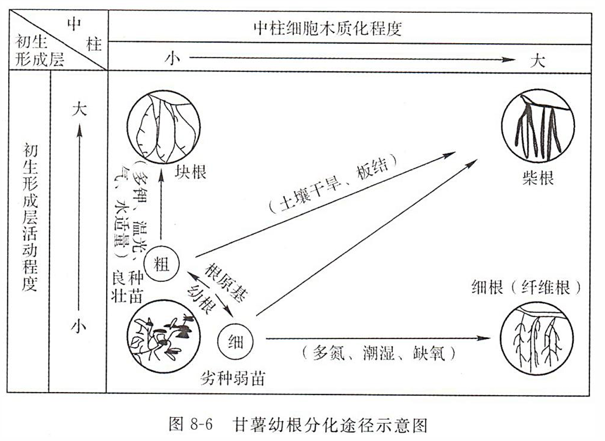

#### （五）甘薯的繁殖及萌芽出苗特性

1. 繁殖特性

   （1）有性生殖

   - 杂交种子实生繁殖
   - 性状分离，群体变异甚大

   （2）无性生殖

   - 薯块育苗繁殖：主要
   - 薯块直播繁殖：用种量大，易受病菌侵染
   - 茎蔓繁殖：连续多年，种性退化和产量降低
   - 叶片繁殖：生长期较短，薯块较小

2. 薯块萌芽特性

   （1）品种：薯皮较薄的萌芽性好

   （2）种薯来源：夏秋薯

   （3）块根部位：顶部的芽原基

   （4）薯块大小：100-200g的中等薯块

#### （六）甘薯生长的环境要求

1. 温度

   （1）薯块萌芽：28-32℃

   （2）茎叶生长：25-28℃

   （3）块根膨大：20-25℃

2. 光照

   喜光作物、短日照作物

3. 水分

   - 比较耐旱，特别怕涝
   - **发根分枝结薯期是一生中对水分相对敏感的时期**

4. 养分

   - 喜钾作物
   - N：P：K=2:1:4
   - 施肥技术：农家肥为主，化肥为辅；基肥为主，追肥为辅。
     - 追肥：前轻中重后补

5. 土壤

   土壤透气性
   
   沙性壤土

### 三、甘薯栽培技术

#### （一）甘薯品种选择与种薯繁殖

1. 品种选择
   - 合理搭配品种
   - 特色专用型品种
2. 脱毒种薯
   - 品种退化原因：生物学混杂、机械混杂和病毒病感染
   - 茎尖分生组织
   - 原原种薯：在防虫网室或温室里栽插试管苗，让其结薯，即为原原种薯，育出的薯苗即为原原种苗
   - 原种种薯：在自然隔离条件下或 在防虫网室内利用原原种薯 (苗) 再进一步繁殖，其种薯即为原种种薯
   - 合格种薯：利用原种种薯可再繁殖为1、2、3级种薯

#### （二）育苗

1. 意义

   （1）延长生育期，提高产量

   （2）节约种薯、降低成本

   （3）保证种植密度、降低病害

   壮苗特征

2. 育苗方式

   温床和冷床

   （1）露地育苗

   （2）塑料薄膜覆盖育苗

   （3）酿热温床覆盖薄膜育苗

3. 种薯准备和上床

   （1）种薯选择和种薯消毒：无病、无伤、无冷害和涝害

   - 温汤浸种
   - 药剂处理

   （2）适时育苗：根据育苗方法和栽插时期确定

   （3）填好床土：温床浅，冷床厚

   （4）排薯：头尾相压，不要头对头

4. 苗床管理

   （1）排种至齐苗阶段：高温催芽和防病为中心

   （2）齐苗至剪苗前阶段：以催为主，催中有炼

   （3）炼苗与采苗阶段：低温炼苗

5. 烂苗的原因与防治

   （1）病烂

   （2）热烂

   （3）水烂与缺氧

#### （三）整地做垄

1. 深耕
2. 改土
3. 起垄栽培

#### （四）薯苗移栽

适时早栽，合理密植，保证全苗

1. 选苗与采苗
2. 栽秧时间
3. 合理密植
   - 原因：地力，光能，协调茎叶生长与薯块生长的关系
   - 密度：据地力、品种、栽秧期而定
   - 栽秧方式：小垄单行（主要），大垄双行，堆栽
   - 栽秧方式：苗要插得浅，节要插得多

#### （五）地膜覆盖栽培

#### （六）田间管理

1. 发根、分枝结薯期田间管理：以促为主
2. 薯蔓并长期田间管理：茎叶平稳生长，促使块根膨大
   - 提蔓管理：提-放，控制徒长
3. 薯块盛长期田间管理：防早衰

#### （七）病虫害防治

1. 病害：黑斑病、茎线虫病
2. 虫害：小象甲、斜纹夜蛾
3. 防治

#### （八）收获与安全储藏

1. 收获

- 耕作制度
- 气温及霜期

2. 贮藏

   （1）生理生化变化

   （2）条件：10-15℃，RH80%-90%，通气

   （3）方式：窖藏

3. 管理

   （1）前期：入窑后20天内。通风降温、散湿

   （2）中期：入窑20天后到来年的2月初。保温防寒

   （3）后期：2月初到育苗。稳定窑温

4. 烂窑

   - 冷害和冻害
   - 病害
   - 湿害和干旱
   - 缺氧

### 思考题

#### 名词解释

1. 纤维根：细根。其形状细长，上有分枝和根毛，主要功能是吸收土壤中的水分和养分。生育前期生长快，分布浅；后期生长慢，分布深。
2. 柴根：又名梗根或牛旁根，粗如手指，细长似鞭，无经济价值。这种根主要在不良环境条件下中途停止增粗而形成，并与品种特性有关。
3. 块根：在适宜生长条件下，幼根经过一系列组织分化和积贮养分发育而成块根。它是贮藏养分的器官，成为生产中主要产品器官。
4. T/R值：表示茎叶重量和块根重量的比值。
5. 蔓薯平衡期：蔓/薯比值为1时

#### 简答题

1. 甘薯块根形成和膨大的机理，以及促进块根形成和膨大的技术措施。

   - 机理
     - 是前期初生形成层活动和后期次生形成层活动的结果，具有同等重要性。
     - 次生形成层活动分裂出许多薄壁细胞和次生木质部及次生韧皮部。由于薄壁细胞数量的增加，致使块根迅速膨大
   - 环境因子
     - 温度：20~25℃，昼夜温差大利于块根膨大
     - 水分：RH60%~70%
     - 养分：膨大阶段吸肥多，尤其是钾素
     - 光照：光照充足有利于光合产物合成输送

2. 甘薯茎叶生长与块根产量的关系，以及相应的田间管理措施。

   茎叶正常生长、上下部生长协调，块根产量高；
   茎叶生长差、过旺或早衰，块根产量低。

3. 壮苗的意义和标准。

   - 育苗意义
     - 延长生育期，提高产量
     - 节约种薯、降低成本
     - 保证种植密度、降低病害
   - 标准
     - 叶片肥厚、叶色较深、顶叶齐平
     - 节间粗短、剪口多白浆；
     - 秧苗不老化、又不过嫩；
     - 根原茎粗大而数目多、无气生根（影响成活率）；
     - 不带病，苗长20cm，春薯百株鲜重500g以上。

4. 甘薯的储藏特性，以及甘薯安全储藏的管理要点。

   - 特性
     - 一般为窖藏，要求为保温能力强，通风换气条件良好，结构坚实不塌不漏，不上水，便于管理检查。
   - 管理要点
     - 前期以通风降温、散湿为主。
     - 中期以保温防寒为主。
     - 后期以温度窑温为主。

5. 甘薯品种退化的原因，以及脱毒种薯的繁育体系。

   **原因：**
   甘薯品种在长期种植情况下，由于生物学混杂、机械混杂和病毒病感染而引起产量降低、品质变劣、适应性减退等退化现象，前两者通过精细的田间管理和去杂去劣可部分消除，但病毒病很难用常规方法去除；选育抗病毒病品种是极为困难的。
   **体系：**
   品种筛选-茎尖组织培养-病毒检测-品种性状鉴定和选优-脱毒试管苗快繁-原原种薯生产-原种种薯繁殖-合格种薯繁殖
