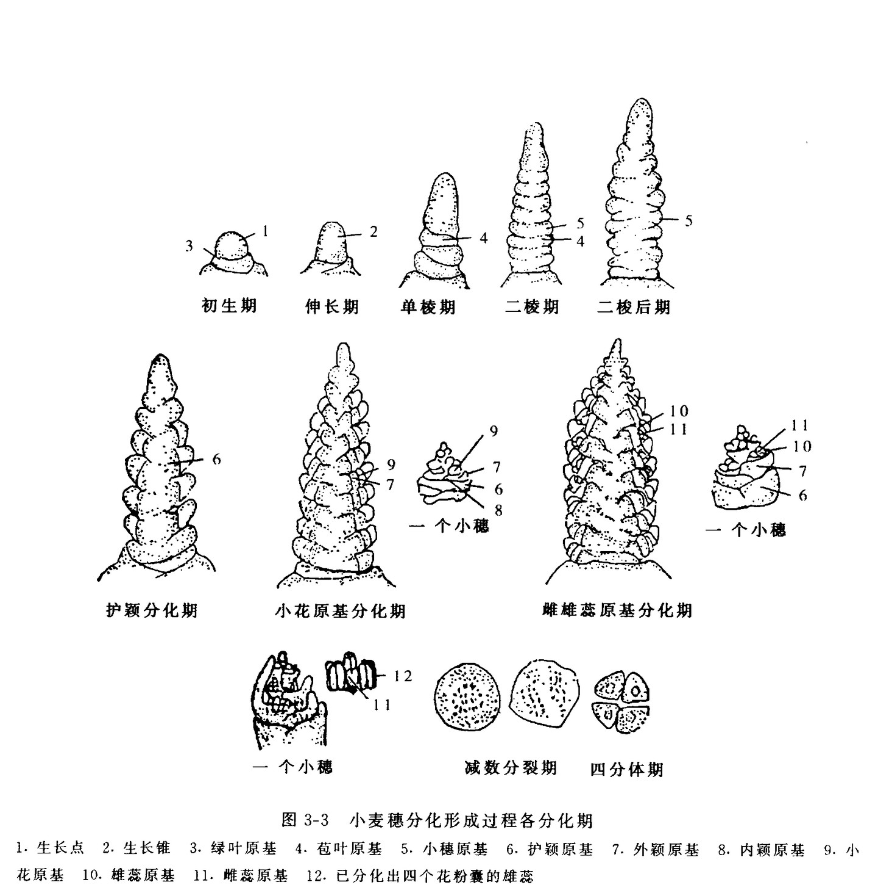
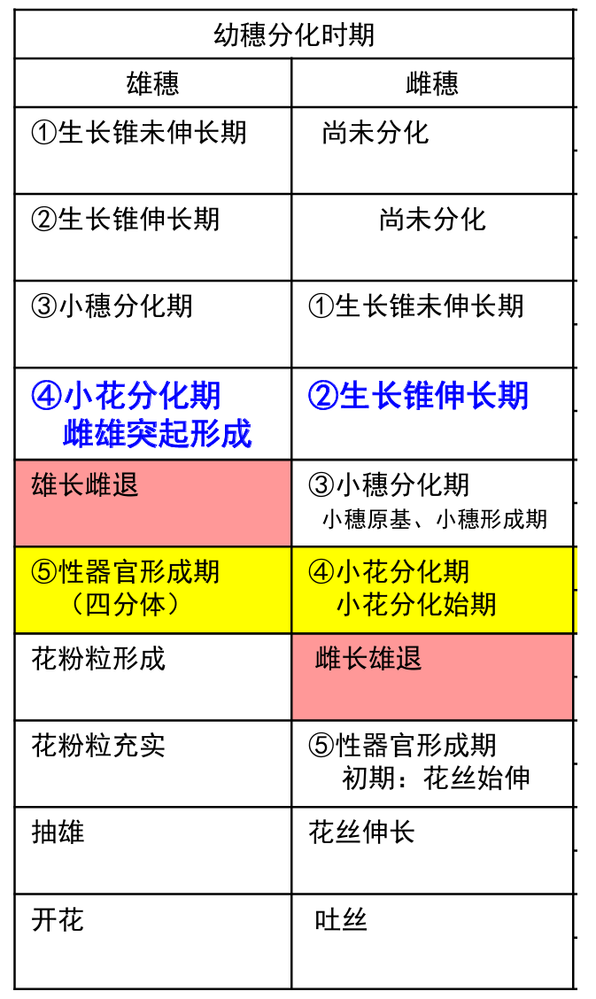

# 作物栽培学

## 绪论

World Food Day：10月16日

### 一、粮食安全与作物生产

#### （一）粮食安全

1. Food security

   指保证任何人在任何时候**能买得到又能买得起**为维持生存和健康所必需的足够食物

2. 影响全球粮食安全的主要因素
   - 人口
   - 耕地
   - 气候
     - 全球气候变化
     - 灾害性天气频发
   - 金融
     - 农业补贴
     - 贸易限制
     - 生物加工
   - 冲突
3. 中国粮食需求与安全状况
   - 水稻、小麦、玉米基本自足
   - 大豆大量进口，高粱和大麦
   - 粮食安全没有近忧，但有远虑
4. 影响中国粮食安全的主要因素
   - 人均耕地少
   - 耕地质量差
   - 水资源贫乏
   - 生产规模小

#### （二）作物学

### 二、作物栽培学的概念、地位与特点

#### （一）农业、种植业与作物的概念

1. 农业
   - 广义：农业产业、农业服务业
   - 中义：农业产业
   - 狭义：农业生产业——种植业、养殖业
2. 作物
   - 广义：由野生植物经过人类不断选择、驯化、**利用、**演化而来的具有经济价值的**人工栽培**的植物
     - 大致可分为农作物、园艺作物、林木
     - 对广义的作物进行栽培与管理即种植业
   - 狭义：田间大面积栽培的农艺作物
     - 粮、棉、油、麻、丝、茶、糖、烟和饲料等作物
     - ……即作物栽培

#### （二）作物栽培学的概念、性质与任务

1. 概念

   研究作物生长发育和产量品质形成规律及其与环境条件的关系

   探索通过轮作复种、栽培管理、生长调控、优化决策等途径

   实现作物高产、优质、高效及其可持续性的理论、方法与技术的科学

   **产量、品质（表现型）=基因型+环境（栽培）**

2. 性质与任务

#### （三）特点

必须满足作物的生物学规律，同时具有较强的区域性、系统性和综合性

1. 作物生长的规律性
   - 生长周期……
   - 光周期、春化作用
2. 作物种植的地域性和季节性
3. 作物生产的持续性
4. 作物系统的复杂与综合性

### 三、作物栽培学的历史与现状

#### （一）作物栽培学是我国古代农业的主要内容

#### （二）作物栽培学的建立

#### （三）作物栽培学的成就

1. 三阶段
   - 改革种植制度，提高单产和总产
     - 20世纪50-60年代
   - 采用新的生产资料，挖掘作物高产潜力
     - 20世纪70-80年代
   - 高科技跨学科现代化作物栽培
     - 20世纪90年代至今
2. 主要成就
3. 代表性理论成就
   - 作物产量源库流理论
   - 作物叶龄模式理论
   - 作物群体质量理论
   - 作物化学调控理论

### 四、农作物的分类

#### （一）按用途和植物学特征分类

1. 粮食作物
   - 禾谷类作物：大部分为禾本科，但荞麦是蓼科
   - 豆菽类作物
   - 薯类作物
2. 经济作物
   - 纤维作物
   - 油料作物
   - 糖料作物：甘蔗、甜菜、甜叶菊
   - 嗜好作物：啤酒花、烟草……
3. 绿肥与饲料作物

#### （二）根据作物的生物学特性分类

1. 按感温特性分类
   - 耐寒作物（>1-3℃）
   - 喜温作物（>10℃）
2. 按光周期特性分类
   - 长日照作物
   - 短日照作物
   - 日中性作物（荞麦、豌豆）
   - 中日性作物、定日作物（甘蔗）
3. 按对二氧化碳同化途径分类
   - C3作物
   - C4作物（玉米、高粱）
   - CAM作物（龙舌兰）

#### （三）按植物科属种分类

双名法

#### （四）发展中的特用作物（特种作物）

1. 概念

   在国内外的一定范围内特有的植物或在国民经济以及人类消费中具有特殊用途的植物

2. 类型

   - 特种粮食作物
   - 特种纤维作物
   - 特种油料作物
   - 特种糖料作物
   - 特种蔬菜作物
   - 香料作物
   - 色素作物
   - 药用作物

### 五、作物栽培科学与技术的发展方向

#### （一）优质高产栽培

#### （二）省工、省力、节本、持续高效栽培

1. 抗旱节水栽培

   - 作物需水规律
   - 抗旱生理机制
   - 节水耕作方法
   - 节水供水技术

2. 少免耕与节能和环境保护技术

   - 秸秆铺覆还田
   - 播种移栽的机械技术
   - 少免耕的应用条件
   - 少免耕对土壤结构、肥力、抗侵蚀性能的影响
   - 少免耕对作物的影响及栽培配套技术

3. 化学控制技术

   减少污染

4. 定量施肥技术

   - 作物需肥规律
   - 土壤供肥规律和肥料利用效率
   - 不同田块的肥料配比、施肥方法
   - 缓释（控释）肥、菌肥、药肥的应用技术

5. 作物机械化优质高产栽培技术

   技术体系、农机具、作业流程

#### （三）无公害农产品生产

#### （四）设施栽培

#### （五）规范化、标准化栽培技术体系

#### （六）信息化栽培

更丰富的农产品，更好的生态环境

### 思考题

1. 请你谈谈作物生产的重要性。

2. 如何理解保障我国粮食安全仍然是首要任务？

3. 什么是广义的作物？什么是狭义的作物？

4. 作物栽培学的概念与任务是什么？

5. 作物栽培学的特点有哪些？

6. 为什么说作物栽培学是一门既古老又年轻的学科？

7. 我国作物栽培学的发展过程怎样？近代取得的主要成就有哪些？

8. 按植物学位置与用途农作物划分为哪几部？各有哪些类？并熟悉主要农作物的分类位置。

## 小麦栽培学

### 一、概述

#### （一）小麦生产的意义与地位

1. 全球种植的三大粮食作物之一

2. 国际贸易的主要农产品

3. 多种多样的加工产品

   面筋——麦醇溶蛋白、谷蛋白

4. 适应性强、分布广

5. 种植制度多样，提高复种指数

   - 种植制度 cropping system：一个农业地区在一定时期或者几年内适应当地条件而形成的一整套农作物种植方式
   - 复种指数 multiple-cropping index：耕地上全年内农作物的总播种面积与耕地面积之比
   - 间作：同一田块中在相同生长季节内种植两种或以上的作物
   - 套种：同一田块在上一种作物生长后期在预留空间种植另一种作物

#### （二）小麦生产概况

1. 世界小麦种植面积与产量

   - 冬小麦：头年（上一年）秋冬播种，第二年夏季收获的小麦
   - 春小麦：当年春季播种，当年夏、秋季收获的小麦（气温低，难越冬）

   （1）冬春比例：约为3:1，春小麦集中在美国、俄罗斯、加拿大，近90%

   （2）产量和面积：2021年全球小麦收获面积约2.23亿公顷，总产7.76亿吨，单产**3.5吨/公顷**（230公斤/亩左右）

   - 1公顷=15亩，zjg2km*2km（400公顷，6000亩）

   （3）主产国和高产国

   - 主产国
     - 面积超过1.5亿亩（1000万公顷）的国家：中国、俄罗斯、印度、美国、澳大利亚、加拿大
   - 高产国

2. 世界小麦增产的主要经验

   （1）世界各国发展小麦生产的途径

   - 种植面积增加，但耕作粗放，单产较低
   - 土地资源少国家，依靠高度机械化和科学管理

   （2）主要措施

   - 良种
   - 肥料
   - 地力
   - 灌溉
   - 合理密植，化学除草

3. 中国小麦生产概况

   （1）冬春比例：春小麦种植面积占16%左右，产量占12%

   （2）产量和面积：2021年小麦种植面积2291万公顷，总产1.336亿吨，单产约5630公斤/公顷

   （3）生产省和高产省

   - 主产省：河南、山东、安徽、江苏、河北
   - 高产省区：西藏（6512kg/公顷），山东（6011kg/公顷），河南（5950kg/公顷），河北（5551kg/公顷），安徽（5357kg/公顷）
   - 高产记录**：14610kg/公顷（2017，河北）**

4. 小麦生产的发展及其主要原因

   - 推广种植高产、抗病的矮秆、半矮秆小麦新品种 ; 灌溉面积扩大 ; 肥料投入增加

5. 小麦产况预测

   小麦需求增长

6. 浙江省小麦生产发展简况

   - 30-33万公顷，各地均有种植
   - 水田小麦和旱地小麦
   - 主要问题
     - 病害，赤霉病
     - 雨水多
     - 高温
     - 籽粒蛋白质和面筋含量低
   - 发展对策：选用专用型小麦，提高单产，降低生产成本

#### （三）中国和浙江省小麦生产的分区

1. 中国小麦种植类型与区划

   （1）种植类型：普通小麦占绝对多数，密穗小麦、圆锥小麦、硬粒小麦仅为零星种植

   - 美国、加拿大等硬粒小麦种植面积扩大。因为面筋含量高，但对Cd的吸收高

   （2）种植区划：根据自然条件、小麦品种类型、种植制度、播种季节等特点划分10个麦区

   - 东北春麦区
   - 北方春麦区
   - 西北春麦区
   - **北方冬麦区**
   - **黄淮冬麦区**
   - **长江中下游冬麦区**
   - 西南冬麦区
   - 华南冬麦区
   - 新疆冬春麦区
   - 青海西藏春冬麦区

2. 浙江省小麦生产分区

   （1）气候特点：平原水网地带，地下水位高，土壤湿度大，降水不均匀，烂冬、烂春

   （2）种植区划：平原稻麦区（杭嘉湖），沿江沿海棉麦区，丘陵稻麦区，红黄壤地区（衢州）

### 二、小麦栽培的生物学基础

#### （一）起源与分类

栽培小麦：禾本科小麦族（*Triticeae*）小麦亚族小麦属（*Triticum*）

1. 分类

   （1）舒尔茨：按染色体数目，14条一粒系，28条二粒系，42条普通系；各系分为野生种、带皮栽培种和裸粒栽培种

   （2）麦基

   （3）道罗非耶夫

2. 小麦的进化

   - 野生一粒小麦（AA）
   - 塔斯奇小麦（方穗山羊草）（DD）
   - BB？某种山羊草——染色体饰变，难以确定B供体
   - 野生种研究潜力大

3. 鉴别性状

   - 穗的形状
   - 护颖形状
   - 芒的有无
   - 种子形状
   - 种子颜色
     - 红皮：休眠性好，浙江，减少穗发芽
     - 白皮：出粉率高

#### （二）小麦发育特性及其在生产上的应用

1. 春化阶段

   （1）低温起主导作用。5个基因控制，累加效应

   （2）分三类：

   - 冬性品种：春化要求温度低，时间长，北方冬小麦
   - 半冬性品种：长江中下游地区
   - 春性品种：春化要求低，耐寒性弱。北方春小麦和长江中下游地区早熟品种及华南地区冬小麦
   - 注意区分春、冬小麦与以上概念

   （3）春化生理学

   - 春化部位：萌动的胚或幼苗生长点
   - 不同类型特性
     - 冬性：耐寒能力强，匍匐，叶片狭而色浓
     - 春性：耐寒能力弱，直立，叶色淡
   - 结束标志：二棱期
   - 生理代谢变化：春化结束阶段后，抗寒力显著减弱

2. 光照阶段

   光周期

   （1）类型

   - 反应迟钝型：能在各种日长下通过，南方春性小麦
   - 反应中等型：小于8h不能完成，半冬性品种
   - 反应敏感型：须大于12h完成，北方高纬度地区小麦

   - 高纬度地区是敏感型，低纬度地区是迟钝型。
   - 冬小麦都是敏感型？×（南方）中国的春小麦都是敏感的？√

   （2）光照反应生理学

   - 光照阶段最适温度：15-20℃
   - 感应部位：叶片
   - 影响因子：光照强度不足，慢；氮肥水平高，时间延长
   - 结束标志：雌雄蕊分化期
   - 延长光照阶段，增加每穗的小穗和小花数

3. 阶段发育理论对小麦引种制种上的指导意义

   - 高纬度地区品种的引入——生育期延长
   - 低纬度地区品种的引入——防止冻害
   - 调节花期：播期与低温处理
   
   光照可以部分替代春化，22h

#### （三）小麦器官发育与产量形成

1. 小麦萌芽和出苗

   （1）麦粒的结构

   - 颖果
   - 皮层、胚、胚乳

   （2）发芽

   - 发芽过程：胚芽鞘伸长突破种皮，胚芽鞘破皮。水分过多，可能胚芽鞘先出
   - 发芽标准：胚根与麦粒等长，胚芽为一半
   - 发芽条件：
     - 最大田间持水量

   （3）出苗

   - 出苗标准：第一真叶从芽鞘顶端伸出2-3cm（主要可以看到），田间50%苗
   - 出苗所需时间
     - 播种到萌发：50-60℃积温
     - 伸长1cm：10-12℃积温
     - 每长1片叶：80℃积温
   - 影响出苗的好坏和快慢的条件：播后温度、土壤水分、整地质量

2. 根的生长

   （1）根的生长过程

   - 种子根
     - 从胚轴上长出，第一真叶展开停止
   - 次生根
     - 三叶期后在茎节上发生
   - 主茎叶龄（n）与发根节位的关系：n-3。一、二分蘖n-2
   - 根系分布
     - 品种
     - 水分

   （2）根的功能

   - 种子根：稳产性
   - 次生根：增产
     - 次生根分组
       - 下层根
       - 中层根
       - 上层根

   （3）影响根系生长的条件

   - 温度：对高温敏感度高于地上部，最高30℃
   - 水分：田间最大持水量60%-70%
   - 养分：N，P
   - 光照

3. 叶的生长

   （1）叶的分化与形成

   - 过程：
     - 叶原基分化期、细胞分裂期和伸长期
   - 功能期：叶片定型（2/3长度）到衰老枯黄
   - 功能期持续天数：品种、叶位（旗叶）、气候、栽培条件
   - **主茎叶数**：品种、播期、气候。与营养生长长短有关
   - 影响因子：温度、肥水、光照

   （2）叶的功能及分组

   - 近根叶
     - 着生在分蘖节
     - 拔节前定型和起作用
   - 茎生叶
     - 着生在伸长节上
     - 一般均为 4—6 叶

   （3）叶面积指数（LAI）

   - 单位面积土地的植株（绿色）叶面积
     - 与产量呈正相关，适宜的最大LAI与品种、生态条件有关
     - 禾谷类作物光补偿点在800-1000Lx？
     - 直立型叶片
   - 变化范围

   （4）主茎叶片数及其变异规律

   - 遗传和环境影响
   - 杭州 : 春性品种 7—10 片，冬性品种 12—15 片；半冬性10 一 12 片
   - 可判断小麦品种的春、冬性
   - 凡是促进春化，叶片数减少。营养生长→生殖生长

4. 分蘖及其成穗

   （1）分蘖节的作用

   - 发生分蘖
   - 贮藏养分

   （2）分蘖的发生

   - **叶蘖的同伸关系**

   - 胚芽鞘分蘖忽略不计

   - 分蘖提前，表明生长好

   （3）分蘖消长与成穗

   - 有效分蘖和无效分蘖
     - 成熟时具有5粒以上籽粒的穗的分蘖
   - 分蘖动态曲线
     - 北方小麦：双峰曲线（冬天温度低，部分死亡）
     - 南方冬麦区：单峰曲线
   - 拔节时，有3片以上叶片的分蘖可继续生长，**关键有无根系**

   （4）影响分蘖及成穗的条件

   - 品种
   - 温度
   - 光照强度
   - 水分
   - 养分：氮素

5. 茎的生长

   （1）茎的形态与生长

   - 形态：节间长度自下而上渐次增长，抗倒伏、透光
   - 生长条件
   - 拔节

   （2）影响条件

   温度、光照、养分（N控制，P、K）、水分

6. 穗的分化与发育

   （1）穗的结构

   穗。小穗基部**两片护颖**，多朵小花（外稃内稃……）

   （2）分化过程

   

   （3）幼穗分化与叶片生长的关系

   品种叶片差异在营养生长期（二棱期前）

   - 伸长期
   - 单棱期
   - 二棱期
   - 小花原基分化期
   - 雌雄蕊分化期
   - 药隔形成期
   - 剑叶抽出过程至孕穗期

   （3）增加穗粒数的途径

   - 增加途径：
     - 小花分化数
     - 小花结实率
   - 小花退化原因
     - 穗位上着生位置和养分竞争能力的差异

   - 小花退化阶段

   （4）影响穗分化的条件

   日照时数、温度、水分、养分（氮素，P）

7. 籽粒的发育与灌浆成熟

   （1）抽穗、开花和受精

   - 抽穗：顶小穗露出剑叶鞘
   - 开花顺序：中部稍上小穗先开花，向上下依次开花；每一小穗基部小花先开
   - 影响开花条件：温度（20℃）、湿度

   （2）籽粒发育与灌浆

   - 胚和胚乳：籽粒体积的大小，取决于胚乳细胞数的多少
   - 禾谷类作物：碳水化合物70-80%，蛋白质10%~。前期蛋白质积累较快，籽粒灌浆不畅，粒重越小，蛋白质含量越高
   - 籽粒形成与灌浆成熟
     - 乳熟期：糖分（蔗糖）→淀粉
     - 蜡熟期：可溶性物质大量转化为非溶性的贮藏物质
     - 完熟期：植株枯黄，麦粒变硬
   - 小麦粒重可塑性大，护颖张开

   （3）提高粒重的途径

   - 提高库容：品种遗传特性和籽粒形成期胚乳细胞的发育状况
   - 增加源强度：剑叶、倒二叶、倒三叶，芒。防早衰

### 三、栽培技术

#### （一）高产群体结构和合理密植

1. 小麦高产的群体结构

   （1）概念

   - 群体大小：苗、茎、蘖、穗的多少，叶面积指数的大小和根系发达程度等
   - 群体分布：叶片的长度、叶层分布、植株分布的均匀和整齐程度等
   - 群体动态：不同生育阶段群体叶面积变化和分蘖消长动态等
   - 群体结构：各生育阶段的群体大小、分布、长相及其动态变化

   （2）生产上常用的群体指标

   - 苗、茎蘖、穗数：单位面积的苗数、年前茎蘖数、年后最高茎蘖数和穗数
   - 叶面积指数
   - 产量结构：穗数、粒数和粒重等产量构成因素

2. 确定合理的基本苗

   （1）计算公式

   - $$
     每公顷基本苗数=\frac{每公顷预期穗数}{单株平均穗数}
     $$

   - $$
     每公顷播种量（kg）=\frac{每公顷基本苗数}{每kg种子粒数×种子净度×发芽率×田间出苗率}
     $$

   - $$
     每kg种子数=1000×\frac{1000}{千粒重（g）}
     $$

   - 田间出苗率一般70%-80%

   （2）合理基本苗的确定原则

   - 原则：满足所需必要穗数的前提下，尽可能减少基本苗
   - 理由：基本苗数越少，单株成穗越多，单穗重越高。（个体发育健壮）

3. 群体发展的促控指标

   （1）有效分蘖可靠叶龄期的茎蘖数

   有效分蘖可靠叶龄期的确定（N-n+2）。N，主茎叶片数；n，主茎伸长节间数

   适当提前茎蘖数的高峰期和降低高峰茎蘖数（减少无效分蘖）

   （2）干物质积累与叶面积指数

#### （二）播种技术

1. 适期播种
   - 适播期根据当地气候条件、品种特性、栽培制度等而定
   - 冬小麦：满足冬前形成壮苗所需积温，又不致当年拔节
2. 种子处理
3. 播种方式
   - 条播
   - 撒播（浙江省普遍）
   - 点播
4. 播种量
5. 提高播种质量
   - 要求：播深适宜（2-3cm，寒冷干燥-增加深度）、深浅一致、落子均匀、消灭三子（深子、露子、丛子）

#### （三）需肥特性和施肥原则

1. 需肥和吸肥规律

   （1）需肥量

   - 生产100kg麦粒，N 3kg，P 1.5kg，K 3kg
   - 产量水平提高，K提高

   （2）不同生育期养分代谢特点

   - 苗期
   - 拔节期：P、K肥
   - 孕穗期：养分的吸收和积累最大，N肥
   - 抽穗开花后
   - 产量水平↑，后期养分吸收量↑

2. 施肥种类及其作用

   - 基肥：播前施用
   - 苗肥：速效氮肥为主；促进发根和分蘖
   - 拔节孕穗肥
   - 根外追肥：抽穗后，防止叶片早衰

3. 施肥量和高产施肥原则

   （1）施肥量：差异大，不用记。不同养分土壤中有效性不同，速效磷（10ppm）、速效钾（80-120ppm）指导施肥。

   （2）施肥原则：三个有利于。“前促、中控、后攻”的“两促”施肥法

4. “两促”施肥法的增产作用

   第一促：施好基、苗肥

   第二促：施好穗肥

   稻板免耕栽培：后期供肥差（表层），施用穗肥

#### （四）田间管理

镇压敲麦：抑制地上部生长，促进地下部生长

### 四、进展

#### （一）轻型栽培

省工节本

小麦免耕栽培（**稻板麦**）

#### （二）优质栽培

#### （三）节水栽培

#### （四）群体质量栽培

## 油菜栽培学

### 一、概况

#### （一）生产意义

1. 四大食用油料作物（大豆、油菜、花生、芝麻）之一，全球第2，中国第1（占40%）
2. 用途广：油，菜籽饼（肥料、饲料）
3. 蜜源作物
4. 冬季油料作物
5. 观光农业

#### （二）油菜品质改良

1. 脂肪酸组成

   （1）提高油酸含量、降低饱和脂肪酸和亚麻酸含量，特别是降低芥酸含量

   （2）**低芥酸品种（<5%）**

2. 硫代葡萄糖苷（甙）

   主要在饼粕中，**低硫甙（<45μmol/g）**

   双低油菜（低芥酸、低硫甙），单低油菜

#### （三）生产概况

1. 全球栽培面积与产量

   - 总面积2800万公顷，4-4.5亿亩
   - 主产国：中国、印度、加拿大、法国、德国、英国、波兰和澳大利亚等，加拿大发展最快
   - 单产以欧洲最高

2. 中国生产情况

   （1）面积与产量

   - 总面积

   - 单产2000公斤/公顷左右
   - 总产

   （2）分布与类型

   油菜的耐冷略弱于小麦，春油菜分布北限低于春小麦

   - 冬油菜区：
     - 华北关中亚区
     - 长江中游亚区
     - 长江下游亚区
     - 四川盆地亚区
     - 云贵高原亚区
     - 华南沿海亚区
   - 春油菜区

   （3）发展特点

   - 种植集中
   - 生产发展迅速
   - 品种改良成效显著
   - 产业化经营成型

   （4）存在的主要问题

   - 多品种插花种植
   - 品质有待提升
   - 劳动成本高

   （5）市场前景预测

   - 世界油菜籽生产、贸易、消费同步增长
   - 世界油菜籽进出口贸易迅速发展
   - 国内植物油和饼粕需求增长较快，市场空间大
   - 市场需求潜力大

### 二、油菜栽培的生物学基础

#### （一）品种类型与分类

1. 植物学分类

   （1）以收获籽粒供榨油为栽培目的的十字花科芸薹属植物统称

   （2）根据染色体数及其同源性

   - 基本种：
     - 黑芥（n=8）b
     - 甘蓝（n=9）c
     - 白菜型油菜（n=10）a
   - 复合种
     - 甘蓝型油菜（n=19）ac
     - 芥菜型油菜（n=18）ab
     - 埃塞俄比亚芥（n=17）bc

2. 油菜的起源

   （1）起源学说：单源发生说、多源发生说。普遍认为存在两个起源中心

   - 亚洲：以中国和印度为主，白菜型油菜和黑芥的起源中心
   - 欧洲：甘蓝和甘蓝型油菜的起源中心
   - （非洲东北部：芥菜型油菜和埃塞俄比亚芥）

3. 三大栽培类型

   白菜型、芥菜型、甘蓝型

#### （二）生育阶段

1. 苗期
   - 种子发芽、出苗到现蕾
   - 营养生长
2. 蕾薹期
   - 现蕾到抽薹
   - 营养生长和生殖生长两旺
3. 开花结果期
   - 始花到终花
   - 生殖生长
4. 角果成熟期
   - 终花到成熟
   - 营养生长逐渐停止

#### （三）发育特性及其应用

1. 发育特性

   - 低温长日照作物
   - 春性、冬性和半冬性
     - 耐低温弱于小麦，春油菜分布纬度低于春小麦
     - 冬性油菜对春化温度要求低……

2. 发育特性的应用

   （1）指导品种选用与播种

   （2）指导田间管理

   （3）指导引种

#### （四）器官形态及建成

1. 根系

   （1）类型与组成：直根系。一条主根+多条侧根+大量支根和细根

   （2）分布

   （3）生长过程：苗期主要长根系，春季根系向水平方向发展，盛花期根量达最大

2. 根颈

   - 油菜的脚茎，子叶以下，幼茎继续生长
   - 长短粗细及直立与否
   - 形成：额外形成层，三生组织
   - 功能：形成不定根，贮藏养分，根茎粗短壮苗

3. 叶片

   （1）子叶+真叶

   （2）主茎总叶数：甘蓝型晚熟品种30-35叶。早、中熟品种20-30叶

   （3）叶片类型：

   - 长柄叶：占1/2，苗期生长，着生于缩茎段
   - 短柄叶：占1/4，现蕾后生长，着生于伸长茎段
   - 无柄叶：占1/4，抽薹后生长，着生于薹茎段

4. 茎

   蜡粉：减少水分散失，减少虫害

   （1）茎段

   - 缩茎段：基部
   - 伸长茎段：由下而上逐渐增长
   - 薹茎段：由下而上逐渐缩短

   （2）三个阶段

   - 缩头：薹的高度低于短柄叶
   - 平头：薹的高度与短柄叶齐平。平头高度（衡量油菜春发状况的重要形态指标）
   - 冒头：薹的高度高于短柄叶

5. 分枝

   （1）一次分枝，二次分枝，三次分枝

   （2）类型

   - 下生分枝型
   - 匀（中）生分支型
   - 上生分枝型

6. 花蕾发育及开花结果

   （1）发育过程

   （2）花序及花的构成

   - 无限总状花序（Raceme）
   - 常为黄色

   （3）花序分化顺序

   - 主-一次-二次
   - 分枝内，上早下迟
   - 花序内，下早上迟

   （4）花芽分化速度

   - 环境影响：主要温度
   - 苗期慢，现蕾抽苔后加快，开花期高峰
   - 有效花蕾和无效花蕾：大致50%为有效，现蕾前的一般有效
   - 现蕾特别是抽薹后对低温的抗性明显减弱

   （5）开花条件

   - 最适温度：12-20℃
   - 30℃以上结实不良

   （6）授粉与受精

   - 芥菜型和甘蓝型为常异交作物，自交结实率80-90%
   - 白菜型为异花授粉作物，异交率80-90%

7. 角果与种子发育

   （1）果实

   - 长角果（silique）
   - 两心皮，侧膜胎座

   （2）种子和油分形成

   - 千粒重3-4g，大麦的1/10
   - 糖含量下降，油分增加
   - 含油量影响因子：品种、种皮色泽（浅色高）、气候（北方高）、养分供应

   （3）种子发育过程

8. 结角率与结籽率

   （1）结角，阴角（无效角果，只有果皮而无种子），脱落

   （2）结籽

   （3）影响因素：

   - 营养：先开花养分充足，高
   - 气候
   - 种植密度：光照

#### （五）产量构成与形成过程

1. 产量构成因素

角果总数、每角粒数、粒重

（1）粒重：变异小，后期的营养条件与物质转运

（2）每角粒数：角果胚珠数、胚珠受精率和合子发育率

（3）总角果数：变异最大（1-5），种植密度×单株角果数

- 合理密植：trade-off；单株角果数取决主花序（10%）、**一次分枝（70%）**与二次分枝（20%）
- 100万果得到50公斤种子

2. 产量形成过程

   （1）角果数形成期：花芽分化始

   （2）每角粒数形成期：雌蕊胚珠原始体形成期

   （3）粒重形成期：受精后

### 三、栽培技术

#### （一）油菜育苗技术与直播栽培

1. 育苗技术

   （1）培育壮苗、提高秧苗素质的意义

   - 秧田期长

   - 五叶期前后生长方式变化

   - 壮苗的标志

     - 3个六（绿叶6-7片，苗高6寸20cm左右，根颈粗0.6-0.7cm）

     - 根颈粗短

   （2）苗床准备

   - 种过十字花科不宜，连作障碍

   （3）种子处理

   （4）苗床播种

   （5）苗床管理

   - 间苗定苗，叶不搭叶，1,2,3
   - 施肥浇水，移栽前，施少量起身肥（嫁妆肥）
   - 生长调节剂，防止徒长、高脚苗，多效唑PP333，烯效唑S3307
   - 防治病虫害

2. 大田整地和移栽

   （1）整地

   - 切忌湿耕
   - 开沟作畦
   - 免耕栽培法，稻板油菜
     - 优点
     - 缺点：杂草；基肥难深施

   （2）移栽

   - 移栽期：根据苗龄和前作收获期，适时早栽。11月上中旬
     - 苗龄叶片数。延长本田期
   - 移栽方法
     - 随拔随种，不种隔夜苗、露水秧
     - 分苗不伤叶，栽种不伤茎，根直叶笃，泥土揿实
   - 移栽后施“活棵肥”

3. 直播油菜的特点与栽培技术要点

   （1）生育特点

   - 省工省时
   - 抗旱、耐瘠、抗倒伏能力强

   （2）栽培技术要点

   - 精细整地，施足基肥
   - 早施苗肥和薹肥
   - 适当早播
   - 适当提高密度
   - 及时间苗

#### （二）油菜需肥特性与施肥技术

1. 需肥特性

   - 氮素：产量与品质之间的矛盾，N不能太多
     - 100kg菜籽，需吸收9-11kg
   - 磷素：反应敏感
     - 100kg菜籽，需吸收3-4kg
     - 临界土壤速效磷含量为10-15ppm，mg/kg，ug/g
   - 钾素
     - 100kg菜籽，需吸收（K2O）8.5-12.8kg
   - 白菜型对肥料利用率高，吸收量少
   - 各生育期吸收比例

2. 施肥技术

   （1）施肥量

   （2）基肥

   - 氮肥占施肥量的50%-60%
   - 生长初期对缺磷反应最敏感，施在根系附近

   （3）追肥

   - 苗肥
   - 腊肥
     - 越冬期
     - 保暖防冻
   - 薹肥和花肥
     - 抽薹前或刚开始抽薹
     - 开花前和初花期

3. 硼肥的施用

   萎缩不实。十字花科对硼敏感，特别是甘蓝型油菜

   （1）典型症状

   - 根：根颈膨大
   - 叶：……

   （2）原因及条件

   - 持续干旱
   - 偏施氮肥或石灰过量
   - 晚播晚栽
   - 甘蓝型油菜易发生
   - 临界
     - 叶片8-10ppm
     - 土壤0.4ppm

   （3）防治方法

   - 农业防治
   - 施用硼肥
     - 硼肥做底肥
     - 苗床施硼
     - 本田施硼

#### （三）田间管理技术

1. 合理密植

   单位面积的角果数，促进一次分枝

2. 田间管理

   - 高产长势长相
     - 冬前
     - 春季：盛花期叶面积指数4-5
   - 清沟排水
   - 中耕松土
   - 防治冻害
   - 防止早花
     - 摘薹，促进分枝生长；追施速效肥
   - 防治病虫害
     - 菌核病

3. 收获与贮藏

   （1）收获

   - 收获时期
   - 收获方法：割收、拔收。机械化收割

   （2）留种

   （3）种子贮藏

### 四、油菜优质高产栽培进展

#### （一）优质油菜高产栽培

单低油菜、双低油菜

1. 统一供种
2. 

#### （二）免耕直播栽培

节本节能

#### （三）机械化栽培

移栽与收获

油菜毯状苗机械化高效移栽技术

#### （四）观光农业

观光农业、创意农业

## 水稻栽培学

### 一、概述

#### （一）水稻生产的国民经济意义

1. 我国的主要粮食作物
2. 高产作物
   - 经济系数高
   - 高产记录：Ⅱ优084，18775kg/ha
3. 适应性强，种植范围广
4. 稻米营养价值高
   - 易于消化
   - 蛋白质含量低于小麦，但氨基酸平衡

#### （二）水稻生产概况

1. 全球生产概况

   - 主要集中在亚洲
   - 印度、中国、印度尼西亚、孟加拉国、泰国，1.5亿亩以上
   - 澳大利亚单产最高。中日韩
   - 泰国米质优良，在世界贸易中占很大的份额

2. 我国生产概况

   （1）总体情况

   - 单产增加较快
   - 种植面积波动大：2022年，4.42亿亩
   - 主产区格局显著变化

   （2）各省区

   - 黑龙江发展最快
   - 湖南省种植面积长期第一，现居第二
   - 3000万亩以上：黑湘苏鄂皖赣
   - 新疆单产最高

   （3）浙江省

   - 种植历史悠久：河姆渡文化、良渚文化

3. 我国水稻分区

   分布辽阔

   丁颖，6个稻作区（一级区）和16个稻作亚区（二级区）

### 二、水稻栽培的生物学基础

#### （一）起源与分类

1. 栽培稻种的起源

   - 禾本科Roaceae稻属*Oryza*
   - 20多个种，栽培种2个，普通栽培稻（*Oryza sativa*）和非洲栽培稻（*Oryza glaberrina*）
   - 普通野生稻和野生栽培稻的差异
     - 野生性状的利用：多年生、分蘖、抗逆等

2. 栽培稻种的分类

   （1）籼亚种*indica*和粳亚种*japonic* subsp.

   - 区别：杂交亲和力弱，杂交结实率低。形态和生理上有明显的区别
     - 粳稻穗短，籽粒密集；籼稻穗长，籽粒稀疏
     - 籼粳交，亚种间杂交，杂种优势
     - 籼稻细长；粳稻粗短，稃壳多毛
   - 两种不同的地理气候生态型
     - 高温籼稻
   - 籼稻是基本型

   （2）晚稻和早稻

   - 分别：
     - 栽培季节的气候环境不同，光照敏感性。适应不同日长条件的两种气候生态型
       - 野生稻：短日照作物，低纬度起源
       - 晚稻：典型的短日照作物
       - 早稻：对光照不敏感
   - 演变：晚稻是基本型
     - 浙江省晚稻多为粳稻，早稻为籼稻
       - 籼稻和粳稻——温度不同；早稻晚稻——光照不同。不能混为一谈

   （3）水稻和陆稻

   - 耐旱性不同
   - 水稻是基本型

   （4）粘稻和糯稻

   - 化学成分差异
     - 糯稻支链淀粉含量高（直链淀粉<3%）；粘稻直链淀粉含量高
   - 粘稻是基本型
   - 糯稻基本上是粳稻

   （5）栽培品种的演变与分类

   - 按穗粒性状分类
   - 按熟期区分
   - 按株型
   - 杂交稻种和常规稻种
   - 高产种和优质种

#### （二）发育特性与生产上的应用

1. 品种生育期的变化特点

   （1）生育期

   - 生殖生长期一般为60-70天，其余为营养生长期
   - 主要是营养生长期的差异

   （2）品种生育期随环境变化的规律

   - ……

2. 决定品种生育期的三性

   - 感光性
   - 感温性
   - 基本营养生长期（短日高温生育期），必须经历才能转入生殖生长

   （1）感温性

   - 以高温出穗促进率衡量

   （2）感光性

   - 短日照出穗促进率

   （3）短日高温生长期

   - 一定的高温和短日照条件下的营养生长期
   - 感温性和感光性弱，短日高温生长期稳定

3. 水稻发育特性理论的应用

   （1）栽培

   （2）引种

   （3）育种

#### （三）生育过程与器官建成

1. 生长发育过程

   - 营养生长期
     - 开始标志：稻谷萌发
     - 显著特征：分蘖数的增加
   - 生殖生长期
     - 开始标志：幼穗分化
     - 显著特征：

2. 器官建成

   （1）种子发育与幼苗生长

   - 种子的构造
     - 颖果
     - 每一小穗有一朵小花
   - 影响种子萌发能力的因素
     - 休眠
     - 成熟度
     - 贮藏条件及时间
   - 发芽与幼苗生长
   - 幼苗生长过程中的物质消长
     - 离乳期，贮藏养分基本耗尽
     - 超重期，合成干物质

   - 萌发需要适宜的环境条件
     - 水分
     - 温度：10（粳）-12（籼）
     - 氧气：干长根，湿长芽

   （2）根的生长

   - 浅：0-10cm
   - 根量满足地上部最佳，不宜多，影响干物质分配

   （3）叶的生长

   - 芽鞘、不完全叶、完全叶
   - 主茎叶片数

   （4）分蘖的生长

   - 生长与分化：
     - 基部的节（分蘖节）上的腋芽长成
     - 一般芽鞘节和不完全叶上不发生分蘖
     - 发育过程
   - 叶蘖同伸
     - n叶抽出≈n-3号分蘖的第一叶伸出
   - 分蘖的有效与无效
     - 拔节时叶片、根系
     - 有效分蘖临界叶龄期：N（品种总叶数）-n（伸长节间数）

   （5）茎的生长

   

   （6）穗的发育

   - 圆锥花序，一次枝梗，二次枝梗，小穗梗，小穗，颖花（每小穗一朵）
   - 分化发育
   - 每穗颖花（floret）数的消长
     - 不结实，秕谷
   - 稻穗的分化期
     - 二次枝梗原基及颖花原基分化期——决定颖花数，每穗粒数
     - 减数分裂——结实率，粒数

   （7）开花

   - 始穗20%，抽穗50%，齐穗80%
   - 浆片膨胀

3. 同伸关系

   （1）营养器官

   （2）营养器官和生殖器官

   - 叶龄余数

4. 叶龄模式

   - 主茎叶片数、伸长节间数
   - 主茎第4张叶片长出，长出分蘖
   - 拔节叶龄：主茎叶片数-伸长节间数+2
   - 几个关键的叶龄期

   

### 三、水稻产量形成及调控

   生物产量、经济产量、经济系数

#### （一）产量构成因素

单位面积穗数、每穗粒数、结实率、千粒重

1. 形成

   （1）单位面积穗数的形成与调控

   （2）每穗颖花数

   - 影响颖花分化的时期
     - 每穗颖花数=分化颖花数（二次枝梗分化期）+退化颖花数（减数分裂期）
     - 主要减少退化
   - 调控
     - 促分化，减退化
     - 氮素营养（穗肥）
       - 促花肥
       - 保花肥

   （3）结实率（有颖壳）

   - 颖花分化和减数分裂期，抽穗后开花到胚乳增长盛期
   - 空粒（前两个，雄性不育或受精不良），秕粒（后两个，灌浆不良）
   - 温度和养分（N）
   - 提高措施
     - 抽穗前：器官发育（植株体内化学组成、输导组织和着生颖花数）
     - 抽穗后：物质生产（同化物）

   
   （4）千粒重
   
   - 谷壳体积：减数分裂期
   - 胚乳的充实度：灌浆盛期
   
#### （二）产量形成模式与

1. 

2. 水稻品种产量形成的源库类型

   （1）源库的概念

   - 源：生产和输出同化产物的器官或组织
   - 库：接受和贮藏同化物质的器官或组织
   - 动态，相互转化

   （2）表示方法

   （3）类型

   - 源限制类型
     - 特征：颖花形成能力强；茎、鞘物质的输出率与转换率高；结实率偏低且稳定
     - 杂交稻籼粳交
     - 栽培策略
   - 库限制类型
     - 颖花形成能力较弱；茎、鞘物质的输出率低；结实率较高且稳定
     - 常规稻早熟品种
     - 栽培策略：提高总颖花数
   - 源库互作型

#### （三）群体质量指标及其调控

- 群体质量：反映群体发育优劣的多项性状指标的综合状况
- 高产群体质量指标：能不断优化群体结构，实现优质高产的各项形态、生理指标

1. 群体质量指标

   - 抽穗至成熟期群体光合生产量是衡量水稻群体质量的核心指标
   - 适宜的LAI及较高的总颖花量
   - 较高的粒叶比与良好的叶系配置
     - 粒叶比：反映单位叶面积所载荷的库容大小
     - 叶系配置：有效叶面积、无效叶面积；高效叶面积（倒三叶叶面积）
   - 较高的单茎茎鞘重
   - 较高的根活量
   - 茎蘖成穗率较高且穗数适宜

2. 群体质量调控技术

   （1）技术模式

   - 高产群体的培育，结实期群体高光效、高积累
   - 尽量压缩群体的起点和前期的总生产量
   - 充分发展个体，合理利用分蘖：小群体、壮个体、高积累

   （2）调控原则

   - 满足适宜穗数目标下，提高茎穗成穗率，主攻大穗
   - 控叶扩库

### 四、稻米品质的形成与调控

#### （一）稻米品质及其判定方法

加工、外观、蒸煮与食味、营养及卫生品质

收获、晒干（13%）、去杂后存放3个月以上（理化性状趋于稳定）

1. 加工品质
   - 反映稻米对加工的适应性，又称碾磨品质，与籽粒灌浆特性、胚乳
   - 糙米率、精米率、整精米
2. 外观品质
   - 市场或商品品质
   - 垩白米率、垩白面积、垩白度、透明度、粒型
   - 垩白是胚乳充实不良引起的空隙导致光的散射，外观上形成白色的不透明区。腹白、背白、心白
3. 蒸煮与食味品质
   - 米饭的色、香、味及其适口性
   - 口感品尝；理化指标，直链淀粉含量、糊化温度、胶稠度、米饭粘性、硬度、气味以及冷饭质地
4. 营养品质
   - 蛋白质及氨基酸含量组成
5. 卫生品质
   - 农药及重金属元素

#### （二）稻米品质的调控

1. 品种间差异
2. 环境与栽培条件
   - 气象因子
   - 土壤生态条件
   - 栽培条件
     - 多施化肥，品质下降
   - 环境污染

#### （三）稻米品质保优栽培技术

1. 品种选择与合理布局
2. 适宜的栽播期和种植密度
3. 土壤改良和优化施肥技术
4. 水分灌溉技术
5. 病虫草害防治与控污技术
6. 适时收获与合理干燥技术

### 五、水稻栽培技术

#### （一）育秧

1. 壮秧标准及其意义

   （1）秧苗类型

   - 小苗：3叶期内带土移栽
   - 中苗：3-4.5叶
   - 大苗：4.5-6.5；6.5叶以上，老壮苗
   - 一般能小则小

   （2）壮秧特征

   - 个体：茎基粗扁、叶挺色绿、根多色白、健壮
   - 光合能力强，碳氮比适中，束缚水含量高

   （3）壮秧的意义

   秧好一半稻

2. 播种期、秧龄与播种量的确定

   （1）播种期

   - 气候条件、品种和前后茬
   - 有利于出苗、分蘖、安全孕穗、
   - 早播界限期
     - 确保发芽：粳稻10℃，籼稻12℃
     - 适时早栽：15℃以上
     - 安全孕穗：孕穗期遇低温，结实率显著下降
   - 晚播界限
     - 不影响水稻的安全齐穗为原则

   （2）秧龄

   - 叶龄、天数、积温等，以叶龄法最能反映
   - 一般原则：品种生育期长短（能短则短）、品种特性、气候与密度
   - 适宜秧龄：移栽后保证有6-9叶出生

   （3）播种量

   - 能多则多，不影响个体生长
   - 影响因素：秧龄，温度，育秧方式，水稻类型（杂交稻少，常规稻多）

3. 种子处理与浸种催芽

   （1）种子处理：晒种，选种，种子消毒

   （2）浸种催芽

   - 浸种及其标准
     - 自重的40%（饱和吸水量）
     - 谷壳呈半透明状，胚部膨大突起（露白）
   - 浸种时间
     - 籼稻60度日，粳稻80度日
   - 催芽
     - 减少外界影响
     - 催芽标准：温度高短，温度低则长
     - 快齐匀壮

4. 主要育秧方式及其技术要点

   （1）露地湿润育

5. 烂秧、死苗的原因与防止

   （1）类型

   - 烂种
   - 烂芽
   - 死苗

   （2）原因

   种子发芽力低

   （3）防止方法

#### （二）稻田耕整、种植密度与移栽

1. 高产稻田土壤基本特征和耕地原则

   （1）基本特征

   - 构造良好
   - 养分充分协调，不缺微量元素
   - 适当的保水保肥力
   - 土壤有益微生物活动旺盛

   （2）耕地原则

2. 种植密度

   （1）合理密植增产的生理基础

   群体结构

   - 协调群体和个体的生长，增穗、增粒、增重，实现高产
   - 适当扩大绿叶面积，提高光能利用率

   （2）途径及其适宜条件

   - 增穗途径：早熟品种，生育期短；增大密度
   - 增粒途径：土水肥条件好，生育期长。适当稀植
   - 穗粒兼顾途径：常规粳稻品种

3. 移栽的方法和质量

   （1）移栽的方法

   - 手工拔秧插秧
   - 机插秧
   - 抛秧

   （2）适时早栽，提高栽插质量

   - 浅、匀、直、稳

#### （三）水稻的营养与施肥

1. 营养与需肥特性

   （1）对主要营养元素的吸收

   - 杂交水稻对钾需求量大
   - 硅需求量大（每生产500公斤，吸收硅88-100公斤）

   （2）各生育期吸肥情况

2. 施肥量和施肥时期的确定

   （1）施肥量的确定
   $$
   理论施肥量=\frac{计划产量吸收养分-土壤养分供给量}{肥料中该元素含量\%×肥料利用率\%}
   $$
   （2）施肥时期的确定

   - 增加穗数的施肥适期
   - 增加每穗粒数的施肥适期
     - 促花肥
     - 保花肥
   - 提高粒重和结实率的施肥适期

3. 肥料运筹与施用

   - 底肥“一道清”
   - 前促施肥法
   - 前促、中控、后补施肥法
   - 前稳、中促、后保施肥法
     - 生长期长，肥力、保肥力差的田

#### （四）稻田水分管理

1. 基本需水

   - 生理需水：直接用于水稻正常生理活动以及保持体内水分平衡所需要的水分
   - 生态需水：调节生态因子，创造适宜生长条件

2. 稻田需水与灌溉定额

   - 稻田需水量
     - 稻田需水量=叶面蒸腾量+棵间蒸发量+稻田渗漏量
     - 腾发量=叶面蒸腾量+棵间蒸发量
   - 灌溉定额
     - 单位面积稻田需要人工补给的水量
     - 灌溉定额=整田用水量+大田生育期间耗水量-有效降水量

3. 稻田灌溉与节水要点

   WUE

   （1）不同生育期对水分的要求及灌溉

   - 返青期
   - 分蘖期：水层要薄
   - 幼穗发育期
   - 出穗开花期
   - 灌浆结实期

   浅水插秧，深水活棵，薄水分蘖，适时晒田，足水养胎，有水抽穗，湿润灌浆，适时断水

   （2）晒田的作用及技术

   - 水稻分蘖盛期到幼穗分化前的排水晒田
   - 作用：改变土壤理化性质；改变幼苗形态。控制地上部生长
   - 晒田技术：时到不等苗，苗到不等时

#### （五）不同生育阶段栽培管理

1. 返青分蘖期
2. 拔节长穗期
3. 抽穗结实期

#### （六）栽培新方式及技术要点

1. 水稻抛秧栽培
2. 机械栽插技术
3. 水稻直播栽培
4. 再生稻栽培

## 棉花栽培学

### 一、概述

籽棉

- 皮棉35-42%
- 棉籽（毛子）
  - 短绒
  - 种壳
  - 种仁

衣分%=100*皮棉/籽棉

#### （一）棉花生产在国民经济中的重要性

1. 棉纤维是纺织工业等的重要原料
2. 棉花具有重要的综合开发价值
   - 棉酚：对人和单胃动物有毒

#### （二）棉花生产概况

1. 世界棉花生产概况

   （1）种植面积与总产

   - 种植面积：3300万公顷
   - 总产：2500万t
   - 单产：760kg/ha

   （2）五大洲分布

   - 种植面积各有分布，集中分布于亚洲、美洲
   - 产量分布

   （3）主产国

   - 面积：印度、中国、美国、
   - 总产：中国、印度、美国

   （4）棉花单产

   - 皮棉单产
   - 籽棉单产

   （5）进出口

   - 主要出口国：美国、印度、巴西、澳大利亚
   - 主要进口国：中国、越南、孟加拉国、

   （6）棉花消费量

   - 中国、印度、巴基斯坦

2. 中国棉花生产概况

   （1）种植面积与产量

   - 种植面积：2008年后下滑
   - 皮棉总产：2011-2023年均599万t
   - 皮棉单产

   （2）消费量

   - 2011-2023年年均皮棉消费量805万t

   （3）进出口

   - 世界第一大棉花生产国、消费国、进口国
   - 全球最大纺织品生产与出口国
   - 进口来源：美国、澳大利亚、

3. 浙江省棉花生产概况

   产棉小省，用棉大省

   （1）种植面积：2016-2022年5-8万亩；2023年3.6万亩

   （2）三大棉区

   - 钱塘江口和杭州湾南北两岸（80%以上）
   - 东部沿海棉区
   - 金衢棉区

#### （三）棉花分布

1. 世界分布区域（纬度和收花季）

   - 北带：20-47°N，主导
   - 中带
   - 南带

2. 中国棉花种植区划

   - 五大棉区

     - 南方棉区
       - 华南棉区
       - 长江流域棉区

     - 北方棉区
       - 黄河流域棉区
       - 北部特早熟棉区
       - 西北内陆棉区

   - 三大种植优势区
     - 黄河流域优势区
     - 长江流域优势区
     - 西北内陆优势区（新疆棉区）：日照充足，干旱少雨
       - **南疆棉区**
       - 北疆棉区
       - 东疆棉区
   - 棉花主产省区：新疆、山东、河北、湖北

### 二、棉花的栽培种和品种

锦葵科棉属

#### （一）棉花的栽培种

1. 草棉
   - 2n=26
   - 非洲棉
   - 各种小，单铃籽棉重2g
   - 纤维细短，品质差，产量低
   - 早熟和抗旱性种质资源

2. 中棉
   - 2n=26
   - 亚洲棉，印度
   - 单铃籽棉重3g左右
   - 纤维粗短（短绒棉），生长期较短，耐旱耐瘠，可逆性较强

3. 海岛棉

   - 4n=52

   - 原产南美、中美和加勒比地区
   - 植株最高大，单铃籽棉重3g左右
   - 长绒棉
   - 适应性较差，皮棉产量大多低于陆地棉

4. 陆地棉

   - ***Gossypium hirsutum***

   - upland cotton

   - 2n=4X=52，异源四倍体
   - 墨西哥一带高原地区
   - 适应性强，结铃性强，铃大、衣分高，产量高
   - 细绒棉

#### （二）我国目前栽培的主要品种类型

1. 常规棉
2. 杂交棉
3. 抗虫棉
4. 优质专用棉
   - 低酚棉：棉仁中棉酚含量低于**0.02-0.04%**，对人畜无害的棉花
     - 高产优质抗病，提高植株棉酚含量，降低棉籽棉酚含量
     - 抗虫低酚棉
     - 防治病虫鼠害
     - 综合利用，优质优价
   - 长绒棉
   - 彩色棉

### 三、棉花栽培的生物学基础

#### （一）生育期与生育阶段

1. 全生育期（大田生长期）：从播种到收花结束
2. 生育期：从出苗到第一个棉铃成熟吐絮（始絮）
3. 生育阶段：
   - 播种出苗期（播种-出苗）
   - 苗期（出苗-现蕾-约8叶）
   - 蕾期（现蕾-开花）
   - 花铃期（开花-吐絮）
   - 吐絮期（吐絮-收花完）

#### （二）生育特性

1. 喜温、好光、较耐旱

   （1）喜温

   （2）好光：对光强反应敏感

   - 短日照作物
   - 光补偿点和光饱和点均高

   （3）较耐旱

2. 无限生长习性

   （1）棉花株型的可塑性

3. 营养生长与生殖生长重叠并进长

4. 雌雄同花常异花授粉作物

5. 分枝发育，棉铃脱落

#### （三）棉籽发芽与出苗

1. 棉籽的形态、结构与化学组成

   （1）形态和结构

   - 籽指：百粒棉籽重（g）
   - 衣指：100粒

2. 发芽出苗的概念

3. 发芽出苗条件

   （1）温度

   - 出苗最低临界温度：16-18℃
   - 稳定在14℃

   （2）水分

   （3）氧气

#### （四）棉花根、茎、叶的生长

1. 根的生长

   （1）形态分布

   （2）不同生育阶段的根系生长特点

   - 苗期——根系发展期
   - 蕾期——根系生长盛期
   - 花铃期——吸收高峰期，根毛
   - 吐絮期——活动机能衰退期

2. 主茎的生长

   （1）大田

   （2）高产棉田

3. 叶的生长

   （1）形态（功能叶）

   - 功能叶：顶部第3或第4主茎叶，打顶后为顶叶。对肥水反应灵敏

   （2）叶序（主茎叶在主茎上排列的顺序）

   - 3/8排列
   - 光合产物的运输

   （3）主茎叶大小或叶面积动态

   （4）棉叶与营养缺乏症

#### （五）分枝和现蕾

1. 营养枝和果枝的区别
2. 现蕾
   - 第一果枝出现三角形花蕾
   - 现蕾期：50%以上棉株出现
   - 现蕾顺序：从下到上，从内到外
     - 上下果枝，相同节位的蕾（同位蕾），间隔3d左右
     - 同一果枝相邻的蕾（邻位蕾），间隔6d左右
   - 现蕾动态
     - 有效蕾：能开花、结铃，并能形成经济产量的蕾
     - 有效蕾终止期

#### （六）开花结铃

1. 开花的顺序和动态
   - 与现蕾一致
   - 同位花，间隔2-4d；邻位花，7d
   - 有效花铃期
2. 三桃
   - 伏前桃：7月15以前
   - 伏桃：7月16-8月15
   - 秋桃：8月16及以后（早秋桃，晚秋桃）
   - 新疆立秋分
3. 结铃
   - 外围结铃数：果枝第1、2果节

#### （七）棉铃和棉纤维的发育

1. 棉铃的发育

   （1）形态结构

   - 4-5个心皮
   - 单铃籽棉重一般5克

   （2）棉铃的发育

   - 铃期：从开花到棉铃成熟吐絮所需的天数称铃期
     - 体积增大阶段
     - 内部充实阶段
     - 脱水开裂阶段

2. 棉纤维的发育

   - 棉纤维由胚珠的外珠被的部分表皮细胞延伸发育而成
   - 伸长期，加厚期，扭曲期

#### （八）棉花的需肥特性及施肥原则

#### （九）棉花的产量构成因素

### 四、棉花栽培技术

#### （一）播种

选用适合当地栽培的良种。主推品种

1. 露地直播

   （1）播种期：气温稳定在14℃

   （2）播种方法：条播、点播

   （3）播种量：种植密度、棉籽大小、发芽率、播种方式、土壤、气候、病虫害
   $$
   理论播种量（kg/亩）=
   $$
   （4）过程

   - 整地开播种沟
   - 施肥
   - 播种
   - 盖土

2. 直播地膜棉

   （1）播种期：提早5d左右，4月10日前后

   （2）多4步

3. 育苗移栽

   （1）育苗方式

   - 薄膜覆盖营养钵育苗
   - 薄膜覆盖方格育苗
   - 塑料穴盘设施化育苗

   （2）播种期、移栽期

   - 提早15-30d播种，约3月下旬-4月上旬
   - 受前作影响

   （3）营养钵育苗技术要点

   - 培养壮苗
   - 适时移栽：最迟5月底
   - 安家肥和团结水

#### （二）苗期管理

出苗到现蕾

1. 扶理春花，抡收春花
2. 查苗、间苗、补苗、定苗（合理密植）
3. 中耕、除草，早施轻施苗肥
4. 病虫害防治

#### （三）蕾期管理

1. 稳施蕾肥

   - 盛蕾初花易徒长

2. 及时去叶枝

3. 中耕除草，清沟培土，促根系生长

4. 控制徒长

5. 防治病虫害

   - 棉铃虫、绿盲蝽、

   - 枯萎病、黄萎病

#### （四）花铃期管理

1. 重施花铃肥（速效氮）、补施长铃肥
2. 及时抗旱灌水
3. 防涝抗台风
4. 适时打顶与整枝
   - 去木枝：现蕾期
   - 打顶
5. 防病治虫
   - 主要病虫害记忆

#### （五）吐絮期管理

1. 病虫害防治
2. 及时采收（催熟脱叶）
3. 留种

### 五、棉作科学研究进展(栽培科技)

育苗移栽、地膜覆盖栽培和棉田化学调控技术曾被誉为棉花生产的“三大技术创新”

#### （一）棉花工厂化育苗和机械化移栽

1. “两无两化” 
   - 两无：采用基质育苗无土，裸苗移栽无载体；
   - 两化：育苗工厂化，移栽机械化。

#### （二）棉花轻简化栽培

简化种植管理工序、减少作业环节和次数，农机与农艺融合，实现棉花生产轻便简捷、节本增效的新型栽培技术体系。

1. 单粒精量播种技术
2. 膜下滴灌水肥一体化技术
3. 机械化栽培
   - 机采棉：早熟，结铃集中，成熟一致。脱叶
4. 简化整枝
5. 除草剂代替人工除草
   - 激光除草
6. 减少中耕
   - 保留蕾期
7. 简化施肥
   - 基肥，重施花铃肥
8. 智能化栽培

## 玉米栽培学

### 一、概述

#### （一）玉米生产的重要性

1. 三大粮食作物之一,高产粮食作物
   - 世界单产、总产最高，收获面积第二
   - 中国总产、种植面积最大，单产低于水稻
2. 玉米是营养丰富的饲料作物——“饲料之王”
3. 玉米是良好的工业原料作物

#### （二）世界玉米生产概况

1. 种植面积与产量

2. 分布与三大玉米生产带

   - 美洲、亚洲
   - 玉米生产带
     - 北美洲的美国
     - 亚洲中国玉米带
     - 欧洲玉米带

3. 主产国

   美国、中国、巴西

4. 进出口

   - 出口：巴西、美国、阿根廷、乌克兰
   - 进口：

5. 消费量

   三大消费国：美国、中国、巴西

#### （三）中国玉米生产概况

1. 种植面积与产量
2. 消费与进出口

### 二、玉米的起源、栽培与分类

#### （一）玉米的起源和传播

1. 起源中心
   - 瓦维洛夫等认为：起源地在中美洲的墨西哥、危地马拉和洪都拉斯
   - 达尔文等认为：起源地在南美洲的秘鲁和智利海岸的半荒漠地带
   - 曼格斯多夫，起源地有两个
   - 布卡索夫，多个起源中心
2. 传播

#### （二）玉米的分类

玉米栽培种 (*Zea mays* L.)，染色体数2n=2x=20

1. 按种植时间划分

   - 春玉米
   - 夏玉米
   - 秋玉米
   - 冬玉米

2. 果穗/籽粒形状、胚乳淀粉的结构分布，籽粒外部稃壳有无

   - 胚乳类型
     - 角质胚乳
     - 粉质胚乳
   - 九种类型
     - 马齿型
     - 半马齿型
     - 硬粒型
     - 甜质型：胚乳富含糖分及水分（鲜食玉米）
     - 糯质型：直链淀粉（鲜食玉米）
     - 爆裂型
     - 粉质型
     - 甜粉型
     - 有稃型

3. 按株型分类
   - 平展型：穗位以上叶片与主茎之间的夹角(茎叶夹角)大于60º
   - 紧凑型：小于30°
   - 半紧凑型
4. 按生育期长短分类
   - 早熟种
   - 中熟种
   - 晚熟种
5. 按用途分
   - 普通玉米
     - 硬粒型、马齿型、半马齿型
   - 特用玉米
     - 爆裂玉米、糯玉米、甜玉米
     - 高赖氨酸玉米
     - 高油玉米
     - 青贮玉米
     - 笋玉米

### 三、玉米栽培的生物学基础

#### （一）玉米的生长发育

1. 生育期：玉米从播种至成熟的天数

2. 生育时期：某种新器官出现,使植株形态发生特征性变化的日期

   - 出苗期：种子发芽出苗，第一片真叶展开苗高约2-3cm的日期
     - 株高：抽雄前，基部到最长叶；抽雄后，雄穗轴顶端
   - 拔节期
   - 大喇叭口期：棒三叶(果穗叶及其上下叶称棒三叶)开始抽出而未展开，~12叶
   - 抽雄期：雄穗主轴尖端从顶叶抽出约3-5cm
   - 开花期：雄穗主轴开始开花散粉
   - 吐丝期：雌穗花丝从苞叶露出2-3cm
   - 成熟期（乳熟期,蜡熟期,完熟期）

3. 生育阶段

   （1）苗期：播种-拔节

   （2）穗期：拔节-抽雄

   （3）花粒期：抽雄-成熟

#### （二）玉米的器官建成

1. 根的形态、生长与功能

   - 须根系，由胚根和节根(次生根和支持根)组成

   （1）胚根(初生根)：包括初生胚根和次生胚根

   （2）节根：长在地下茎节上的叫地下节根(次生根)，着生在地上茎节上的叫气生根或支持根

2. 茎的形态、生长与功能

   - 矮秆型、中秆型、高秆型
   - 地上节约15-25节
   - 基部节密集，着生次生根
   - 从上向下的第5-8节上的腋芽，可能发育成果穗
   - 基部腋芽可形成分蘖，除饲用玉米外应及早摘除

3. 叶的形态、生长与功能

   - 呈互生排列。全叶可分叶鞘、叶片、叶舌三部分

4. 雄穗和雌穗的形态特征与分化发育

   - 雌雄同株异花作物；天然杂交率95%左右，是典型的异花授粉作物

   （1）雄穗

   -  圆锥花序，由中央主轴和许多分枝组成
   - 每个节有1对小穗:其中1为有柄小穗，位于上方;1为无柄小穗，位于下方
   - 每穗两朵小花，两个颖片（护颖）
   - 每朵小花由1片**内稃**(内颖)，1片**外稃**(外颖)及3个雄蕊组成

   （2）雌穗

   - 果穗：由穗轴和雌小穗构成
   - 穗轴节很密，每节着生2个无柄小穗，成对排列； 每小穗内有2朵小花，上位花结实，下位花退化
   - 雌小穗：护颖，内外稃，1个雌蕊及退化的雄蕊。花柱和柱头总称为花丝
   - 吐丝与授粉

   （3）雄穗的分化发育

   - 生长锥未伸长期
   - 生长锥伸长期：生长锥伸长，拔节期
   - 小穗分化期
   - 小花分化期
     - 小花开始分化期
     - 雌雄蕊形成期
     - 雄蕊生长雌蕊退化期
   - 雄性器官发育形成期：大喇叭口期

   （4）雌穗的分化发育

   - 生长锥未伸长期
   - 生长锥伸长期：相当于雄穗小花开始分化期
   - 小穗分化期
   - 小花分化期
   - 雌性器官发育形成期

   （5）雌穗与雄穗分化时期的相关性

   

   （6）幼穗分化进程与叶片的同伸关系

5. 种子的结构与形成

   （1）玉米种子的结构

   - 一般百粒重约25-35g

   （2）种子的形成过程

   - 籽粒形成期
   - 乳熟期
   - 蜡熟期
   - 完熟期

#### （三）玉米生长生育与光温条件

1. 光照：喜光作物，C4植物，光饱和点约为10万Lx以上，光补偿点为500-1500Lx。短日照作物
2. 温度：喜温作物

#### （四）玉米的产量构成因素

公顷籽粒产量=公顷穗数×穗粒数×粒重

通过合理的栽培措施使玉米群体达到最佳结构，在主攻穗数基础上，使玉米产量三要素达到最佳比例，从而提高玉米产量。

合理密植

### 四、玉米栽培技术

#### （一）玉米对土壤的要求与整地

1. 高产玉米对土壤的要求
   - 土层深厚，土壤结构良好，疏松通气
   - 适宜的土壤酸碱度
   - 耕作层有机质和矿质营养丰富
2. 整地：春玉米播前进行适度深耕；夏、秋玉米贴茬播种

#### （二）种子准备与播种

1. 种子准备：

   （1）选用优良品种

   （2）精选种子

   （3）种子处理：晒种、药剂拌种、种子包衣

2. 播种技术

   （1）播种期：春玉米，浙江清明前后播种,7-9月成熟。夏播无早、越早越好

   （2）播种量、播种方法

   - 玉米播种量（公斤/亩）=亩种植密度\*千粒重（g）\*1.5（或2）/（1000\*1000*发芽率)
   - 单粒点播1.5，双粒点播2，条播2
   - 播种方式开沟条播和挖穴点播

   （3）种植密度

   - 品种类型
   - 肥水条件
   - 播种季节

   （4）种植方式

   - 等行距单株条植
   - 宽窄行种植

#### （三）玉米的需肥特性与施肥技术

1. 玉米的需肥规律

   （1）玉米产量与需肥量

   （2）不同生长时期玉米对养分的需求特点

   - 不同生育阶段对养分的需求比例
   - 不同生育时期对氮磷钾的吸收速率：吸收养分高峰期在大喇叭口期、乳熟期

   （3）缺肥症状

2. 玉米的施肥技术

   - 一般原则：适施基肥，早施、轻施和偏施苗肥，稳施拔节肥，重施穗肥，巧施粒肥
   - 施肥方法：
     - 基肥（缺P：-20mg/kg；缺K：-100mg/kg）
     - 种肥：氮肥；微量元素肥料用于拌种或浸种，硼锌
     - 追肥
       - 苗肥
       - 秆肥（拔节肥）：小喇叭口期
       - 穗肥：大喇叭口期
       - 粒肥
     - 简化栽培，简化施肥，追肥大多只施苗肥和穗肥

#### （四）田间管理

1. 苗期管理

   （1）查苗、补苗和间苗、定苗

   （2）中耕除草

   （3）酌施苗肥

   （4）防治虫害

2. 穗期管理

   （1）去分蘖

   （2）中耕-施肥-培土

   （3）灌溉与排水：拔节-小喇叭口期；大喇叭口期

   （4）防治病虫害：玉米螟

   （5）使用玉米健壮素

3. 花粒期管理

   （1）巧施粒肥：春玉米

   （2）人工去雄

   （3）人工辅助授粉

   （4）灌溉与排水

#### （五）收获与贮藏

1. 收获
   - 食用玉米：完熟期
   - 饲用青贮玉米：乳熟末期至蜡熟期
   - 鲜食玉米：乳熟期
2. 贮藏
   - 穗藏
   - 粒藏：13%以下，低于30℃

### 五、特用玉米栽培技术

#### （一）鲜食玉米栽培技术

甜玉米、糯玉米、甜加糯玉米和水果玉米

1. 选用良种
2. 严格隔离：隐性基因控制
   - 空间隔离
   - 时间隔离
3. 错开播期，延长供应期
4. 保证种植密度
5. 加强田间管理

#### （二）青贮饲用玉米栽培技术要点

## 马铃薯栽培学

### 一、概述

#### （一）马铃薯生产在国民经济中的意义

1. 重要的粮食作物之一（玉米、水稻、小麦、土豆）
2. 营养成分全，营养价值高，兼具主粮、蔬菜和功能食品的功能
3. 用途广泛重要
   - 纺织、医药制造、食品深加工、铸造等工业的重要原料

4. 适应性强，生育期短，适于与多种作物（粮、棉）**间套作**，能充分利用高杆作物行间的光能，**提高复种指数**，增加单位面积产量

#### （二）生产状况

1. 全球性作物
   - 种植面积排名：中国、印度、乌克兰、俄罗斯……
   - 年总产量排名：中国、印度、乌克兰、俄罗斯、美国……
   - 单产：新西兰最高，中国低于全球平均单产

#### （三）马铃薯栽培区

1. 北方一作区

   - 气候特点：气候凉爽，日照充足，昼夜温差大

   - 栽培品种：中熟及中晚熟为主

   - 栽培特点：主要产区，栽培面积大而集中，**种植面积占50%以上。重要的种薯基地**
2. 中原二作区

   - 气候特点：夏季长，温度高，不利于马铃薯的生长

   - 栽培品种：早熟品种，抗病，休眠期短……

   - 栽培特点：春秋两季栽培
3. 南方二作区
   - 气候特点：海洋性气候，夏长冬暖，四季不分明，日照短
   - 栽培品种：多种多样
   - 栽培特点：秋冬春三季，自然条件悬殊，耕作制度多样。**发展潜力最大的区域**，有很多冬闲田
4. 西南单、双季混作区
   - 低山河谷或盆地，气温高、无霜期长，春早、夏长、冬暖，雨量大、湿度大，适合种两季，与春秋两作区相似，以早熟品种为主
   - 高寒山区，气温低、无霜期短、四季分明、夏季凉爽，是马铃薯的主要分布地区，与北方一作区相似，需要抗晚疫病的晚熟品种
   - 栽培特点：产量高、增产潜力大，**栽培面积占40%以上，是我国马铃薯抗病育种和生产的重要基地**

### 二、马铃薯栽培的生物学基础

茄科（Solanaceae）茄属（*Solanum*）一年生草本植物。

*Solanum tuberosum*

#### （一）起源与分布

1. 起源：起源中心在南美洲西部沿岸的智利和秘鲁的**安第斯山区**

2. 传播：分布到全世界160多个国家和地区。明朝万历年间传入中国。

3. 分类：共有 8 个栽培种，154 个野生种。

   栽培种为四倍体（**48条染色体**），共两个亚种：

   - subsp. *Chilotanum*，马铃薯亚种，智利种，即**普通栽培种**，全世界范围种植，**属长日照类型**

   - subsp. *Andigena*，**安第斯亚种**，主要种植于南美洲安第斯山地区，**属短日照类型**

   - 两者差异很小

#### （二）品种类型

1. 熟性来分：极早熟、早熟、中熟、中晚熟、晚熟五类

2. 用途来分：鲜食、淀粉加工、全粉加工、炸片加工、炸条加工和烧烤等多种类型

#### （三）形态特征

1. 根

（1）两种类型：

- 直根系——种子繁殖所发生的根，有主侧根之分

- 须根系——块茎繁殖所发生的根，为不定根，无主、侧根之分

（2）须根系可分：

- 初生根——在初生芽的基部3-4节上发生的不定根，称为**芽眼根**或节根，这是发芽早期发生的根系，分枝能力强。主体根系。
- 后生根——在地下茎的上部各节上陆续发生的不定根，称为**匍匐根**，一般每节上发生3-6条，分枝能力较弱，长度较短。分布在表土层，生育后期培土有利此类根系生长。匍匐根对磷素有较强的吸收能力。

2. 茎

包括**地上茎、地下茎、匍匐茎和块茎**，都是**同源器官**，但形态和功能却各不相同。

（1）地上茎

①来源：块茎芽眼萌发的幼芽发育形成的地上枝条

②特点：

- 草质多汁，有茸毛和腺毛，幼茎上特别多，成长时逐渐脱落

- 节部横切面为圆形，节间部分为三角形或四棱形。

- 在茎的棱上，由于组织的增长形成突起的翅状物——茎翅（翼），分直翅与波状翅（直翼、波状翼、宽翼与窄翼），可作为鉴定品种的特征之一。

- 茎的色泽有绿色、紫色，是区别品种的特征之一

- 具有分枝性。早熟种分枝力弱，晚熟种分枝多而长。

- 茎的高度和繁茂程度因品种不同有很大差异、受栽培条件影响也较大。早熟品种节数少，茎较矮；中晚熟品种节数较多、茎较高。

- 再生能力强。生产上采用分枝、剪枝、扦插和压蔓等措施来增加繁殖系数以提高产量

（2）地下茎

主茎的地下结薯部位。母薯长出的茎

（3）匍匐茎

①来源：是由地下茎节上的腋芽发育而成，顶端膨大形成块茎。

②特点：
- 一般为白色
- 顶端呈弯曲状
- 数目多少因品种而异
- 正常情况下匍匐茎的成薯率为50-70%
- 匍匐茎具有向地性和背光性，入土不深
- 匍匐茎的长短因品种而异，早熟种较短，晚熟种较长，栽培种较短，野生种较长
- 具有地上茎的一切特性，担负着输送大量营养和水分的功能

（4）块茎

①来源：缩短而肥大的**变态茎**。当匍匐茎顶端停止极性生长后，由于**皮层、髓部及韧皮部的薄壁细胞的分生和扩大**，并积累大量淀粉，从而使匍匐茎顶端膨大形成块茎

②特征：

- 鳞片状退化小叶，凋萎脱落，残留的叶痕呈新月状，称为**芽眉**。芽眉内侧表面向内凹陷成为芽眼。

- **芽眼**在块茎上呈螺旋状排列，顶部密，基部稀。块茎最顶端的一个芽眼较大，内含芽较多，称为顶芽，顶端优势明显。

  -  芽眼过深是一种不良性状

  - 每个芽眼内有三个或三个以上未伸长的芽，中央较突出的为主芽，其余的为侧芽（或副芽），**发芽时主芽先萌发**。

  - 在块茎萌芽时：**顶芽最先萌发**，而且幼芽生长快而壮，从顶芽向下的各芽眼，依次萌发，其发芽势逐渐减弱

③块茎大小：圆形、长筒形、椭圆形。每一品种的成熟块茎，都具有固定的形状，是鉴别品种的重要依据之一。

④皮色和肉色：皮色多样。以黄肉和白肉者为多。

3. 叶
- 单叶：最初发生的几片初生叶均为单叶
- 复叶：随着植株的生长，逐渐长出**奇数羽状复叶**。复叶**互生，呈螺旋排列**
  - 每个复叶由**顶生小叶**和3-7对**侧生小叶**，侧生小叶之间的**小裂叶**，侧生小叶叶柄上的**小细叶**和复叶叶柄基部的**托叶**构成。
  - 顶生小叶叶形略大，形状和侧生小叶的对数，是品种的特征之一

4. 花

马铃薯为**自花授粉作物**。花序为**聚伞花序**。花冠**合瓣**，基部合生成管状，顶端五裂，并有星形色轮。**雄蕊5枚，雌蕊1枚**。子房上位，由两个连生心皮构成，中轴胎座，胚珠多枚。

5. 果实与种子

果实为**浆果**。种子很小，千粒重为0.4-0.6g，刚收获的种子有6个月左右的休眠期，贮藏时间长。

**开花不结实的原因：**

- 因高温或其他环境因素导致的花粉败育

- 离层环形成离层，导致落蕾、落花或落果

- 胚珠退化

- 遗传与生理上的不孕（自交不亲和）

  生产上所用的马铃薯均为复合的杂交种，不孕不育的概率极大

  需解决：自交不亲和；自交衰退

**育种**：1.0，随机（农家）育种；2.0，杂交育种；3.0，分子育种；4.0，智能育种

☆**马铃薯设计育种：Genome design of hybrid potato**

#### （四）生长发育特性

120 days

1. 生育时期

   （1）块茎的萌发和出芽

   ​	根系形成、芽的生长以及叶、侧芽和花原基分化

   （2）幼苗生长、匍匐茎伸长（出苗-出蕾）

   ​	茎叶和根系的生长

   ​	主茎孕育花蕾后，匍匐茎不再伸长，顶端膨大

   （3）块茎形成、茎叶生长（孕蕾-开花初期）

   ​	块茎形成期，是决定块茎数量多少的关键时期，地上部茎叶生长与地下部块茎形成并进

   （4）块茎增长、茎叶繁茂（盛花-茎叶衰老）

   ​	块茎增长期，叶面积已达最大值，决定块茎体积大小的关键时期

   （5）淀粉积累期（茎叶衰老-茎叶枯萎）

   ​	淀粉的积累一直延续到茎叶全部枯死之前。延迟早衰

   （6）成熟收获期

   ​	收获时期决定于生产目的和轮作中的要求。地上部茎叶黄枯，块茎内淀粉积累充分。

2. 块茎的休眠

   自然休眠和被迫休眠

   （1）休眠原因

   ​	块茎休眠及其解除受内在因素和外界环境所支配。

   ​	β-抑制剂（脱落酸类物质）等植物激素

   （2）影响因素

   ​	温度、湿度。高温、高湿条件下能缩短休眠期；低温、干燥则能延长休眠期。

#### （五）生长发育对环境条件的要求

1. 温度
 - **性喜冷凉，不耐高温。**
 - **日平均气温17-21℃为适宜，更广泛15-20℃。**（需记这个温度）
 - 芽条生长的最适温度为13-18℃。范围内，up-up
 - 茎的伸长以18℃最适宜。高温徒长
 - 对花器官的影响主要是夜间温度，**18℃时大量开花**（记住）
 - ……

2. 光照

 - 马铃薯是**长日照作物**。日照时间长，地上部生长快，块茎延迟形成，产量下降；短，块茎产量高
 - 一般早熟品种对日照反应不敏感，在较长日照条件下亦能结薯，晚熟品种则必须在短日照条件下才能形成块茎
 - 高温一般促进茎伸长，不利于叶片和块茎的发育
 - 根深叶茂→块茎增长

3. 水分

   蒸腾系数：形成单位干物质重所需水分

   土壤湿度保持田间最大持水量的60％-80％为最适宜（成团，可散）

   需水临界期在块茎增长期

4. 土壤

   表土层深厚，结构疏松，排水通气良好和富含有机质的土壤为最适宜

   砂壤土

   pH5.5-6为最适宜

   块茎产量随土壤中氯离子含量增高而降低

5. 矿质营养

   马铃薯对肥料三要素的需求量，以钾最多，氮次之，磷最少

#### （六）马铃薯的退化与防止

**马铃薯退化：**马铃薯经多年多季留种后反复种植时，植株的生长势会逐年逐季衰退，块茎变小，产量下降，品质变劣，最后失去种用价值

1. 原因
   - 内因：品种的抗逆性，即抗病毒、抗高温的能力
   - 外因：环境因素，即**病毒（直接外因）**、高温、营养

2. 防止措施
   - 选育和推广抗病毒品种
   - 秋播和晚播留种
   - 去除病毒
     - 选择优株扩大繁殖，淘汰有病的植株
     - 利用实生薯作种（***种子繁育的实生苗结出的薯块茎***）
     - 茎尖培养脱毒种薯
     - 小整薯播种，可避免借切刀传毒、传菌
     - 改进栽培技术和贮藏条件

### 三、马铃薯栽培技术

#### （一）轮作换茬

1. 轮作
   - 马铃薯忌连作，宜采用轮作方式
   - 避免与茄科作物、块根、块茎类作物轮作

2. 间、套作

   增加产量，扩大种植面积

#### （二）整地与施肥

1. 整地
   - 喜砂壤或壤土
   - 秋深翻晒垄：促土壤熟化，消灭害虫病原物，提高墒情
   - 耕地深度，一般以20-25cm为宜

2. 施肥

   （1）需肥特征

   （2）施肥技术

   - 原则：有机肥为主，化肥为辅，重施底肥，早施追肥，增施钾肥

   - 重施基肥。基肥用量一般占总施肥量的2/3以上

   - 及早追肥。

   - 马铃薯开花后，一般不进行根际追肥，特别是不能追施氮肥，马铃薯开花后，主要以叶面喷施磷、钾肥为主。

   - 马铃薯是喜钾作物，忌氯

#### （三）播种

1. 播前种薯准备

   - 种薯出窖与挑选

   - 种薯处理（催芽、切块、小整薯留种、药剂处理）
     - 催芽：解除休眠，缩短出苗时间，促进生育进程
     
     - 种薯切块：a. 能节约种薯，降低生产成本；b. 打破休眠，促进发芽、出苗
     
     - 小整薯留种：推荐
     
     - 拌种与药剂处理
   
2. 播种期

   - 适期播种

3. 播种方式

- 垄作
- 单垄单行等行距或单垄双行的宽窄行

4. 种植密度

   （1）产量结构
   
   - 单位面积产量=每亩株数×单株结薯重
   - 单株结薯重=单株结薯数×平均薯块重
   - 单株结薯数=单株主茎数×平均每主茎结薯数
   - **单位面积产量=每亩株数×单株主茎数×平均每主茎结薯数×平均薯块重**

​      （2）种植密度

北方一作区，以每亩3800-5500株为宜

南方地区，一般每亩都在6000株以上

在相同种植密度下，1）以宽、窄行方式为好；2）或以加大宽行、株(穴)距，适当增加每穴种薯数的方式较好

**群体个体协调发展**

#### （四）田间管理

1. 发芽出苗管理

   促根壮芽，防缺苗

2. 出苗后的田间管理
   - 查苗补苗
   - 中耕除草和培土
   - 追肥
   - 灌溉和排水
   - 防治病虫害

#### （五）收获与储藏

1. 收获

- 当植株**大部分茎叶枯黄**时，块茎很容易与匍甸茎分离，周皮
  变硬而厚，块茎干物质含量达到最高限度，为食用块茎的最
  适收获期。
- 种用块茎应比食用提前5-7天收获，以避免低温霜冻危害，提
  高种性。

2. 贮藏

   （1）生理生化变化

   （2）基本要求

   （3）基本条件和方法

#### （六）其他马铃薯栽培技术

1. 稻草覆盖免耕秋马铃薯栽培

2. 双膜冬播马铃薯栽培

3. 马铃薯雾化栽培

   主要用于脱毒种薯的种植

### 思考题

#### 名词解释

1. 芽眼根
在初生芽的基部3 – 4节上发生的不定根，称为芽眼根或节根，这是发芽早期发生的根系，分枝能力强，是马铃薯的主体根系。又称初生根。

2. 匍匐根
在地下茎的上部各节上陆续发生的不定根，称为匍匐根，分枝能力较弱，长度较短，分布在表土层。对磷素有较强的吸收能力。

3. 地上茎
由块茎芽眼萌发的幼芽发育形成的地上枝条。

4. 地下茎
马铃薯的地下茎，即主茎的地下结薯部位。

5. 匍匐茎
是由地下茎节上的腋芽发育而成，顶端膨大形成块茎。

6. 块茎
一缩短而肥大的变态茎。当匍匐茎顶端停止极性生长后，**由于皮层、髓部及韧皮部的薄壁细胞的分生和扩大**，并积累大量淀粉，从而使匍匐茎顶端膨大形成块茎。

7. 马铃薯退化
马铃薯经多年多季留种后反复种植时，植株的生长势会逐年逐季衰退，块茎变小，产量下降，品质变劣，最后失去种用价值，这种现象就是马铃薯退化。

8. 块茎形成期
从块茎具有雏形开始，经历地上茎顶端封顶叶展开、第一花序开始开花、全株匍匐茎顶端均开始膨大、直到最大块茎直径达3-4㎝、地上部茎叶干物重和块茎干物重平衡为止，为块茎形成期。是决定块茎数量多少的关键时期。

9. 块茎增长期
从地上部与地下部干物重平衡期开始，即进入块茎增长期。此期叶面积已达最大值，茎叶生长逐渐缓慢并停止，地上部制造的养分不断向块茎输送，块茎的体积和重量不断增长。 是决定块茎体积大小的关键时期。

#### 简答题

1. **简述我国四个马铃薯栽培区及其生态特点？**

   答：

   （1）北方一作区

   - 气候特点：气候凉爽，日照充足，昼夜温差大

   - 栽培品种：中熟及中晚熟为主

   - 栽培特点：主要产区，栽培面积大而集中，**种植面积占50%以上。重要的种薯基地**

   （2）中原二作区

   - 气候特点：夏季长，温度高，不利于马铃薯的生长

   - 栽培品种：早熟品种，抗病，休眠期短……

   - 栽培特点：春秋两季栽培

   （3）南方二作区

   - 气候特点：海洋性气候，夏长冬暖，四季不分明，日照短
   - 栽培品种：多种多样
   - 栽培特点：秋冬春三季，自然条件悬殊，耕作制度多样。**发展潜力最大的区域**，有很多冬闲田

   （4）西南单、双季混作区

   - 低山河谷或盆地，气温高、无霜期长，春早、夏长、冬暖，雨量大、湿度大，适合种两季，与春秋两作区相似，以早熟品种为主
   - 高寒山区，气温低、无霜期短、四季分明、夏季凉爽，是马铃薯的主要分布地区，与北方一作区相似，需要抗晚疫病的晚熟品种
   - 栽培特点：产量高、增产潜力大，**栽培面积占40%以上，是我国马铃薯抗病育种和生产的重要基地**

2. **马铃薯根系的类型有哪几种？**

   - 直根系——种子繁殖所发生的根，有主侧根之分

   - 须根系——块茎繁殖所发生的根，为不定根，无主、侧根之分
     - 须根系又可分为初生根（芽眼根）和后生根（匍匐根）

3. **茎的类型有哪几种，有何形态和功能上的差异？**

   | 茎     | 形态                                                         | 功能                                                         |
   | ------ | ------------------------------------------------------------ | ------------------------------------------------------------ |
   | 地上茎 | 直立，有分枝特性。茎翅。                                     | 支撑枝叶，运输养分，水分和进行光合作用。再生能力很强。       |
   | 地下茎 | 长度一般为10cm左右。节数多数品种为8节。                      | 节上发生匍匐根和匍匐茎。养分水分运输枢纽，起承上启下的作用。 |
   | 匍匐茎 | 是由地下茎节上的腋芽发育而成，顶端膨大形成块茎。一般为白色。顶端呈钥匙形的弯曲状。匍匐茎具有向地性和背光性，入土不深。 | 担负着输送营养和水分的功能，节上能形成纤细的不定根和匍匐茎。 |
   | 块茎   | 缩短而肥大的变态茎。芽眉，芽眼。                             | 贮存养分。繁殖器官。                                         |

   

4. 马铃薯一生分为哪几个生育时期，各有何特点？

   | 生育时期   | 特点                                                         | 备注                                                         |
   | ---------- | ------------------------------------------------------------ | ------------------------------------------------------------ |
   | 萌发出苗期 | 根系形成、芽的生长以及叶、侧芽和花原基分化                   | 根深。促进早发芽、多发根、快出苗、出壮苗。                   |
   | 幼苗期     | 茎叶和根系的生长。                                           | 孕蕾后，匍匐茎不再伸长，顶端开始膨大。促根，促苗，协调茎叶与块茎的生长。 |
   | 块茎形成期 | 地上部茎叶生长与地下部块茎形成并进                           | 叶茂。是决定块茎数量多少的关键时期                           |
   | 块茎增长期 | 叶面积已达最大值，茎叶生长逐渐缓慢并停止，地上部制造的养分不断向块茎输送，块茎的体积和重量不断增长。 | 决定块茎体积大小的关键时期                                   |
   | 淀粉积累期 | 块茎日增重达最大值。以淀粉积累为中心，淀粉的积累一直延续到茎叶全部枯死之前。 | 延迟早衰                                                     |
   | 成熟收获期 | 没有绝对的成熟期，收获时期决定于生产目的和轮作中的要求。一般当植株地上部茎叶黄枯，块茎内淀粉积累充分时。 |                                                              |

   

5. 马铃薯块茎休眠的原因及影响因素？

   - 内在因素：植物激素的抑制作用
     - 块茎内存在β-抑制剂（脱落酸类物质）等植物激素，这些激素抑制了α-淀粉酶、β-淀粉酶、蛋白酶、核糖核酸酶的活性和氧化磷酸化过程，从而使芽缺少所需要的可溶性糖类和进行代谢活动所需的能量，迫使块茎保持休眠状态
   - 外界环境：温度、湿度
     - 高温、高湿条件下能缩短休眠期；
     - 低温、干燥则能延长休眠期。

6. 马铃薯退化的原因及防止措施？

   - 原因
     - 内因：品种的抗逆性，即抗病毒、抗高温的能力
     - 外因：环境因素，即**病毒（直接外因）**、高温、营养等
     
   - 防止措施
     - 选育和推广抗病毒品种
     - 秋播和晚播留种：抗病力增强，不利于病毒的繁殖与感染
     - 去除病毒
       - 选择优株扩大繁殖，淘汰有病的植株；
       - 利用实生薯作种（**种子繁殖产生的实生苗结出的块茎**）；
       -  茎尖培养脱毒种薯；
       - 小整薯播种，可避免借切刀传毒、传菌；
       - 改进栽培技术和贮藏条件。
   

7. 简述马铃薯用小整薯做种的意义。
   - 避免切刀传病，减轻青枯病、疮痂病、环腐病等发病；
   - 能最大限度地利用种薯的顶端优势和保存种薯中的养分、水分；
   - 增强抗旱能力，出苗整齐健壮、生长旺盛、结薯数增加，显著增产等作用。
   - 节省切块用工，减少生产成本；
   - 便于机械播种，提高播种效率和质量。
8. 马铃薯播前种薯处理的主要方法有哪些？
   - 催芽：解除休眠，缩短出苗时间，促进生育进程
   - 切块：能节约种薯，降低生产成本；打破休眠，促进发芽、出苗。
   - 小整薯留种
   - 拌种与药剂处理
9. 简述马铃薯田间管理技术要点？
   - 发芽出苗：促进壮苗，防缺苗
   - 出苗后
     - 查苗补苗
     - 中耕除草和培土
     - 追肥
     - 灌溉和排水
     - 防治病虫害：晚疫病、青枯病、环腐病、疮痂病、癌肿病
10. 简述马铃薯的需肥特点和施肥方法？
    - 需肥特点
      - 马铃薯一生对N、P、K的吸收量随着植株生长而变化，幼苗期吸收较慢，茎叶生长期吸收猛增，块茎增长期又逐渐缓慢下来。
    - 施肥方法
      - 原则：有机肥为主，化肥为辅，重施底肥，早施追肥，增施钾肥。
        - 重施基肥。基肥用量一般占总施肥量的2/3以上
        - 及早追肥。幼苗期要追施氮肥。马铃薯开花后，一般不进行根际追肥，特别是不能追施氮肥，马铃薯开花后，主要以叶面喷施磷、钾肥为主
      - 喜钾作物，忌氯作物。选用硫酸钾。

