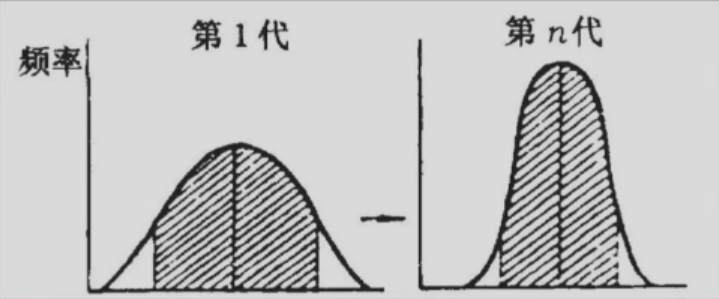
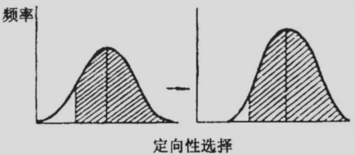
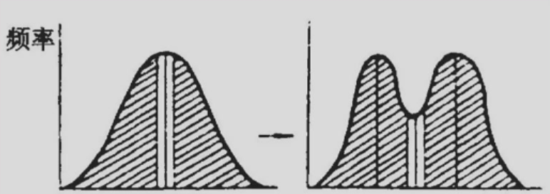
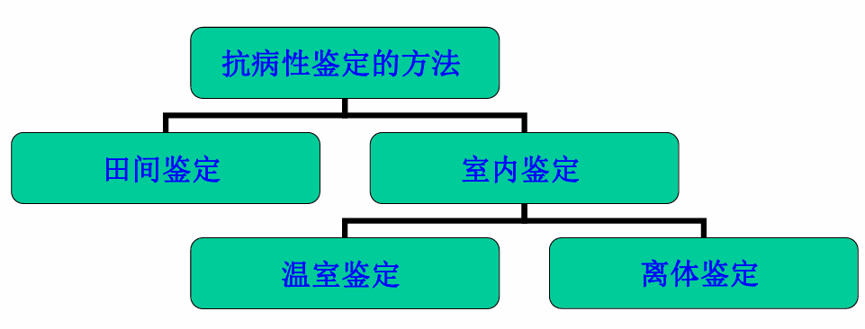

# 作物育种学

## 绪论

### 一、作物进化和遗传改良

#### （一）作物品种的概念

1. 作物品种（variety）：人类在一定的生态条件和经济条件下，根据人类的需要所选育的某种作物的一定群体。

2. 与变种相区别：作物品种属于一定的种及亚种，不同于变种 var. 。变种是自然选择、自然进化的产物。多用cultivar表示品种，cv.

3. 特性：特异性（distinctness）、一致性（uniformity）和稳定性（stability），简称DUS

#### （二）自然进化和人工进化

1. 育种阶段：1.0-4.0

2. 自然选择和人工选择：现代的作物品种是在自然选择基础上的人工选择的产物。

3. 自然进化和人工进化：作物育种实际上就是作物的人工进化，是适当利用自然进化的人工进化，其进程远比自然进化要快。

#### （三）遗传改良在作物生产发展中的作用

1. 优良品种：在一定地区和耕作条件下能符合生产发展要求，并具有较高经济价值的品种。

   生产上的良种，包括具有**优良品种品质**和**优良播种品质**的双重含义。

2. 优良品种的作用：

   （1）**提高单位面积产量**

   （2）改进产品品质

   （3）保持稳产性和产品品质

   （4）扩大作物种植面积

   （5）有利于耕作制度的改良、复种指数的提高、农业机械化的发展及劳动生产率的提高

### 二、作物育种学的发展

## 第一章 作物的繁殖方式和品种类型

### 一、作物的繁殖方式

有性繁殖（sexual reproduction）：**自花授粉、异花授粉和常异花授粉**。特殊形式——自交不亲和性和雄性不育性。

&

无性繁殖（asexual reproduction）：植株营养体繁殖和无融合生殖

#### （一）有性繁殖

1. 花器构造和开花习性对授粉的影响

   利于自花授粉：两性花，闭花受精，雌雄蕊同熟，开花时间短或开张角度小

   利于异花授粉：单性花，雌雄蕊异长，雌雄蕊异熟，虫媒花、风媒花，雄性不育，自交不亲和性，开花时间长或开张角度大

2. 作物天然异交率的测定

   根据作物的花器结构、开花习性、传粉方式、强制自交的结实性进行分析判断。

   天然异交是与人工杂交相对而言的，是指同作物不同品种间的自然杂交。天然异交率测定方法，通常是选择受1对基因控制的相对性状作为遗传测定的标记性状，**以具有隐性性状的品种为母本**，将父本与母本等距、等量隔行种植，任其自由传粉结实，然后将母本植株上收获的种子播种，进行后代苗期性状的测定。如果测定的性状为种子性状，表现花粉直感，则当代母本植株上收获的种子(已是F1代)可直接进行测定。计算出**F1代中显性个体出现的比例**，就是该品种的天然异交率。
   $$
   天然异交率=\frac{F_1代显性性状个体数}{F_1代总个体数}×100\%
   $$

3. 有性繁殖主要授粉方式

   （1）自花授粉：同一朵花的花粉传到同一朵花的雌蕊柱头上，或同株的花粉传播到同株的雌蕊柱头上。天然异交率**<4%**。如水稻、小麦、大麦、大豆等。

   （2）异花授粉：雌蕊柱头接受异株或**异花花粉**授粉的授粉方式称为异花授粉。天然异交率**>50%**。如**玉米**、黑麦、甘薯、向日葵、白菜型油菜等。

   （3）常异花授粉：一种作物**同时依靠自花授粉和异花授粉**两种方式繁殖后代的称为常异花授粉作物。常异花授粉作物通常仍然**以自花授粉为主要授粉方式**，同时存在一定比例的天然异交，是自花授粉作物和异花授粉作物的过渡类型。4%=<天然异交率<=50%。如棉花、甘蓝型油菜、芥菜型油菜、高粱等。

4. 两种特殊的有性繁殖方式

   均为某些基因型或品系，并非所有。

   （1）自交不亲和性

   （2）雄性不育性

   ​	受核基因控制的细胞核雄性不育性（GMS）和质核互作型雄性不育（简称细胞质雄性不育CMS）

#### （二）无性生殖

1. 营养体繁殖

   甘薯、马铃薯、木薯、甘蔗。大部分果树和花卉。

   无性系——如杂种优势保持可利用无性系。

2. 无融合生殖

   不经过正常受精和两性配子的融合过程而直接形成种子以繁衍后代的方式。

   无孢子生殖（由胚珠体细胞有丝分裂形成二倍体胚囊），二倍体孢子生殖（大孢子母细胞不经减数分裂，形成二倍体胚囊），不定胚生殖（由胚珠或子房壁的二倍体细胞经过有丝分裂形成胚，同时极核发育成胚乳），孤雌生殖（卵细胞，助细胞和反足细胞），孤雄生殖

### 二、自交和异交的遗传效应

#### （一）自交的遗传效应

1. 效应

   - 纯合基因型保持不变

   - 杂合基因型后代发生性状分离，连续自交则使初始的杂合基因型逐渐趋向于若干种遗传上不同的纯合基因型

     - 连续自交：n对不连锁基因控制的性状，自交各代（r）纯合体比例（Xn）
       $$
       X_n=(1-1/2^r)^n×100\%
       $$

   - 异花授粉作物后代生活力衰退：自交衰退

2. 自花授粉作物和常异花授粉作物的基因型

   现代自花授粉作物品种可理解为同质纯合群体，其个体间表现型整齐一致，且表现型和基因型是一致的，上代的遗传性状可稳定地传递给下一代。

   常异花授粉作物品种的基本群体是自交产生的后代，这部分基本群体的基因型是纯合的，也是同质的，代表品种的基本性状。另有小部分个体，基因型是杂合的。

#### （二）异交的遗传效应

1. 效应
   - 形成杂合基因型：异交是基因型不同（更广泛：不同植株）的两亲配子的受精结合。有选择的异交（人工杂交）是创造遗传变异的一种主要方法。
   - 增强后代的生活力：生长势、繁殖力、抗逆性，产量，即数量性状方面比亲本明显提高

2. 异花授粉作物的基因型

   基因型高度杂合，个体间的基因型是异质的。异质杂合群体。

### 三、作物的品种类型及其育种特点

#### （一）自交系品种

1. 定义：纯系品种，同质纯合群体。包括**自花授粉作物和常异花授粉作物的纯系品种和异花授粉作物的自交系品种**。自交系的理论亲本系数到达0.87或更高，即具有亲本纯合基因型的后代植株比例达到或超过87%

2. 育种特点：

   - 自花授粉加单株选择的育种方法

   - 拓宽遗传变异范围，在大群体中进行单株选择

#### （二）杂种品种

1. 定义：在严格选择亲本和控制授粉的条件下生产的各类杂交组合的杂种一代植株群体。基因型高度杂合。异花授粉作物，自花授粉作物和常异花授粉作物也可（雄性不育系）。

2. 育种特点：

   - 自交系间的配合力是关键：自交系间杂交种的杂种优势最强

   - ……

#### （三）群体品种

遗传基础比较复杂，群体内植株基因型有一定程度的杂合性和异质性。

1. 分类
   - 异花授粉作物的自由授粉品种
   - 异花授粉作物的综合品种：异质杂合群体
   - 自花授粉作物的复合品种：异质纯合群体
   - 自花授粉作物的多系品种：若干近等基因系的种子混合繁殖而成。异质纯合群体。抗病培育
2. 育种特点

#### （四）无性系品种

1. 定义：由一个无性系或几个遗传上近似的无性系经过营养器官繁殖而成。

2. 育种特点：
   - 利用无性系迅速固定优良性状和杂种优势
   
   - 选择优良芽变，培育新的优良无性系品种：芽的分生组织细胞发生的突变
   

## 第二章 种质资源

### 一、种质资源的重要性

#### （一）作物种质资源

1. 定义：Germplasm，包括品种、类型、近缘种、野生种的种子、植株、无性繁殖器官、花粉、单细胞无性系等。又叫原始材料、遗传资源、基因资源

2. 作用：

   （1）育种工作的突破，关键是种质资源

   - 水稻矮杆育种
     - 1950s
     
   - 小麦矮秆育种
   
   - 玉米的高赖氨酸育种
   
   - 双低油菜育种
     - 低芥酸，低硫甙

​	（2）种质资源是人类的宝贵财富。人类的命运将取决于我们对种质资源的发掘和开发利用

### 二、作物起源中心学说及其发展

#### （一）形成及其主要内容

瓦维洛夫，作物起源中心学说（Origin center of crop）

1. 主要内容

   （1）作物起源中心的两个特征：**基因多样性和显性基因的高频率性**。基因中心或变异多样化中心

   （2）最初起源地为原生起源中心，扩散后形成次级中心或次生基因中心，次级中心为隐性基因控制的多样化地区

   *比较表格*

   （3）遗传变异性的同源系列规律：在一定的生态环境下，一年生草本作物间的遗传性状存在着平行现象

   （4）原生作物和次生作物 有目的地驯化植物称为原生作物；伴原生作物的杂草到异地，原生作物不适，而杂草成为主体，称次生作物如燕麦和黑麦

2. 瓦维洛夫提出的作物起源中心

   （1）中国-东亚中心

   （2）印度中心

   印度-马来西亚补充区

   （3）中亚细亚中心

   （4）西亚中心

   （5）地中海中心

   （6）埃塞俄比亚中心

   （7）墨西哥南部和中美中心

   （8）南美（秘鲁-厄瓜多尔-玻利维亚）中心

   智利中心

   巴西-巴拉圭中心

3. 发展和补充

   （1）哈伦

   - 土生型
   - 半土生型
   - 单一中心型
   - 无中心
   - 次级中心

​	（2）茹科夫斯基

​		十二个中心

​	（3）A.C.泽文

### 三、种质资源的研究和利用

研究内容：搜集、保存、鉴定、创新和利用

#### （一）种质资源的类别

1. 根据来源
   - 本地种质资源：包括古老的地方品种和当前推广品种，适合本地的特点
   - 外地种质资源：从其他国家和地区引用的品种或类型，反映原产地的特点，不同的生物学和遗传特性
   - 野生种质资源：作物的近缘种和有价值的野生种，具有某些特有的优良性状
   - 人工创造的种质资源：包括遗传研究和育种的中间材料，变异丰富

2. 按亲缘关系来分
   - 初级基因库：同一种内的材料，可杂交进行基因重组，最有价值
   - 次级基因库：种间及近缘植物，基因转移是可能的，但较困难
   - 三级基因库：亲缘关系更远，杂交不实和杂种不育现象更明显

3. 从育种角度
   - 地方品种：不包括正在推广的品种。缺点明显，但有特殊的性状，如抗性、适应性、口味
   - 主栽品种
   - 原始栽培品种
   - 野生近缘种
   - 育种中间材料

#### （二）种质资源的收集

1. 种质资源收集的近切性和必要性

2. 收集方法
   - 直接考察收集；
   - 征集；
   - 单位之间彼此交换；
   - 转引

3. 收集材料的整理

   分类、登记

4. 品种资源的保存

   原则：

   （1）生活力

   （2）遗传变异度

   （3）一定数量

5. 种质资源的鉴定

6. 种质资源的利用

## 第三章 育种目标

### 一、现代农业对作物品种的要求

#### （一） 高产

提高单位面积产量

因素：密度，穗数，穗粒数，粒重

多穗型丰产品种，大穗型丰产品种，中间型（穗、粒、粒重并重）

**高光效育种**：株型、叶型、叶功能期长短；生理因素

#### （二）稳产

抗生物逆境：病害虫害草害

抗非生物逆境：干旱盐碱

持久抗性：生物逆境+非生物逆境

#### （三）早熟

提高复种指数，提高单位面积产量，避逆境

#### （四）优质

营养品质

​	口感品质

播种品质

工业原料

#### （五）广适应性

作物类型之间差异

品种之间的差异

#### （五）适宜于机械化作业

### 二、制定育种目标的原则

1. 考虑到国民经济的发展和生产需求
2. 根据当地的条件，抓主要矛盾
3. 育种目标要具体化和可能性
4. 考虑品种搭配

## 第四章 引种与驯化

### 一、引种的作用

#### （一）概念

1. 引种：将异地的优良品种、品系或具有某些优良特性的类群引入本地作为育种素材或直接推广应用的育种措施。

   广义：从外地区、外国引进新植物、新作物、新品种以及用于育种和有关理论研究的各种遗传资源

2. 驯化：某一物种习惯于新迁入地区的气候和生境条件的过程

3. 引种驯化的情形：立即成功，基本成功，不成功，引种栽培

#### （二）作用

1. 引进新作物、新品种，发展工农业生产
2. 充实种质资源，丰富作物的种质资源
3. 利用异地种植，提高作物产量

### 二、引种的基本原理☆

#### （一）作物的生态环境与生态类型

1. 相关概念

   （1）生态因素

   对作物的生长发育有明显的影响和直接作为作物所同化的因素。土肥水温

   （2）生态环境

   综合起作用的一些生态因素的复合体

   （3）生态适应

   对于一定的生态环境表现生育正常的反应

   （4）生态适应范围

   对于一定的生态环境表现生育正常的反应范围

   （5）生态区

   对于一种作物具有大体相同的生态环境的地区，同生态适应范围

   （6）生态类型

   一种作物对一定地区的生态环境具有相应的遗传适应性，具有相似遗传适应性的一个品种类群

#### （二）气候相似性原理

Mayr

地区之间，在影响作物生产的主要气候因素上，应该相似到足以保证作物品种互相引用成功时，引种才有成功的可能

#### （三）纬度、海拔、作物发育特性与引种的关系

1. 温度
   - 生物生长温度：
     - 温度由低到高，早熟；
     - 反之延迟成熟
   - 植物发育温度
     - 生长温度与发育温度不同
     - 春化
   
2. 光照

3. 作物的发育特性

   - 高温短日性作物：水稻、玉米、大豆
   - 低温长日性作物：小麦、大麦、油菜

   **感温阶段**

   - 低温作物
     - 冬性：0-5℃，30-70d
     - 半冬性：3-15℃，20-30d
     - 春性：5-20℃，3-15d
   - 高温作物（喜温作物）：20-30℃，5-7d

   **感光阶段**

   - 长日照作物：>12h
   - 短日照作物：<12h
   - 中间性作物：对日照长短反应不敏感

4. 纬度、海拔
   - 低纬度：高温、短日照
   - 高纬度：低温、长日照
   - 海拔增加100m，相当于纬度+1°

### 三、引种的一般规律及方法

#### （一）引种的一般规律

作物的发育特性，对环境反应的敏感性

1. 低温长日性作物的引种规律

   **春化**是主要因素

   （1）原产高纬度地区的品种：向南引种，不能满足春化的低温要求，迟熟或不抽穗

   （2）原产低纬度地区的品种：向北引种，生育期缩短，早熟，冻害

   （3）冬播区春性品种（如浙江冬播的春性小麦）：向春播区引种，适应，早熟、高产。因日照变长，变强。抗病性限制（锈病）

   （4）春播区的春性品种：春播区大多不需要春化，向冬播区，大多不适应。迟熟，结实不良，易受冻害。春季光照不足。

   （5）高海拔地区的冬作作物品种：偏冬性，引种到平原大多不适，反之有可能。

2. 高温短日性作物

   （1）原产高纬度地区的品种：早熟春播作物，感温性强而感光性弱。向南引种，早熟、低产

   （2）原产低纬度地区的品种：有春、夏、秋播之分

   - 春播品种：感温性强而感光性弱，向北引种迟熟营养器官变大（温度）
   - 夏秋播品种：感温性弱而感光性强，向北引种，光照要求不能满足，植株和穗可能较大，生育期推迟。冻害（安全成熟问题）。

   （3）高海拔地区品种：感温性强，引到平原，早熟、低产（高产问题）；反之延迟成熟，安全成熟问题

3. 作物对环境敏感性与引种

   （1）敏感型作物：大豆引种范围较窄，南北之间相互引种不能超过2度

   （2）迟钝型作物：如甘薯，引种较广

   （3）中间型作物：介于二者之间。驯化的结果

#### （二）引种的方法与技术

1. 明确目的和要求
2. 先试后引
3. 与栽培试验相结合
4. 引种与繁殖相结合，少引多繁
5. 检疫工作
6. 选择工作

**引种实践**

- 水稻引种
  - 类型：早稻、中稻、晚稻，籼稻、粳稻
  - 南种北引：选择早稻早熟、中熟品种或对短日照反应迟钝的品种
  - 北种南引：高温和短日照，生育期缩短，减产。引晚熟，但一般不能引种
  - 光温二系杂交水稻引种问题

- 小麦引种
  - 冬麦、春麦；春性、冬性
  - 北方冬小麦向南引，气温偏高日照变短，不能顺利完成感温阶段，成熟期延长，甚至不能抽穗
  - 南方弱冬性小麦品种引北，越冬前通过感温阶段，冻害
  - 北方的春小麦的感温阶段短，范围宽，适应性强
- 大豆引种
  - 南种北引：日照增长，延迟开花，正常成熟
  - 北种南引：日照缩短，生长发育加快，植株变小，成熟提早，产量降低
- 玉米、高粱、麻类均属短日性作物，与水稻、大豆相似

### 四、驯化的原理和方法

#### （一）概念

人类对植物适应新的地理环境能力的利用和改造

引种是驯化的前提；驯化是引种的客观需要

#### （二）植物驯化的原理与方法

1. 米丘林的“风土驯化学说”

   （1）基本原理：生物体与其生存的环境之间存在着对立统一的关系，生物体的遗传可塑性使得它可以经过驯化而适应新的环境

   （2）具体做法：选用植物**遗传不稳定、最易动摇**的幼龄实生苗，作为风土驯化的材料，采用逐步迁移的方法，使其在新的环境影响下，逐步改变原有的本性，最终适应新的环境

   （3）方法依据

   - 幼龄阶段变异性较大
   - 实生苗对新环境适应能力强

   对果树引种具有重要的指导意义

2. 其他驯化理论和驯化方法

   

## 第四-2章 选择育种

育种成败的关键在于亲本选配和后代选择

选择育种：对现有品种群体中出现的自然变异进行性状鉴定、选择并通过品系比较试验、区域试验和……

又称系统育种。

### 一、人工选择的特点

#### （一）相关概念

1. 自然选择：自然条件对植物的选择。把一切不利于生物生存与发展的变异淘汰掉，而保留一切对生物本身有利的变异

2. 人工选择：根据人们的需求，从混杂的群体中挑选符合要求的个体或类型。优株选择、种源选择等选择育种。

3. 区别

   |          | 自然选择                       | 人工选择                             |
   | -------- | ------------------------------ | ------------------------------------ |
   | 选择动力 | 自然因素                       | 人为选择的影响（包括有意识和无意识） |
   | 选择方向 | 利于对生物体合理的、有益的变异 | 选择对人类有利的变异                 |
   | 选择效果 | 适应自然环境                   | 更符合人类要求                       |
   | 时间     | 长                             | 短                                   |

#### （二）自然选择和人工选择的联系

- 人工选择必须接受自然选择的检验，只有能适应自然环境条件的群体或个体，才能在生产上推广
- 人工选择应在自然选择的基础上进行，充分利用自然选择创造的条件
- 人工选择的结果会使群体遗传基础变窄，使基因资源丢失，造成不良后果。在选择育种过程中不断补充新的育种材料，使育种群体遗传基础不致因选择而迅速窄化。
  - 驯化中的遗传瓶颈

#### （三）选择类型

1. 稳定选择

   有利于中间类型，数量性状的平均值不变，变异系数减小或不变。

   **良种繁育**、自然选择

   

2. 定向选择

   选择偏向某一极端，群体遗传组成定向变化。如高产

   人工选择

   

3. 多向选择

   两个或两个以上不同方向，不利于中间类型。如需要高产、优质，打破连锁

   群体变异增大，最终形成分离的两个群体
   
   

### 二、作物群体中的遗传变异与利用

#### （一）自然变异的原因

1. 异交引起基因重组，是绝对的
2. 天然突变
3. 新育成品种剩余的变异：未真正纯合，自交分离

#### （二）自然变异在育种中的应用

直接应用与间接应用——育成新品种

自花和常异花授粉作物常用的方法

#### （三）影响选择效果的主要因素

1. 性状遗传力和遗传增益

   （1）性状的遗传力：亲本传递某一性状传递给子代的能力

   - 广义遗传力：遗传方差占表型方差的比值
     $$
     H^2=\frac{V_G}{V_P}=\frac{V_G}{V_G+V_E}
     $$

   - 狭义遗传力：加性方差占表型方差的比值
     $$
     h^2=\frac{V_A}{V_P}=\frac{V_A}{V_A+V_D+V_I+V_E}
     $$

   - 现实遗传力：选择响应与选择差的比值。
     $$
     h_r^2=\frac{R}{S}
     $$
     
     - 选择响应R：**入选亲本子代**平均值据被选择亲本群体平均值的离差
     - 选择差S：**入选群体平均值**距被选群体平均值的离差
     - 遗传增益△G：选择响应与亲本群体平均值比值，百分数

2. 影响选择效果的主要指标

   （1）选择响应与选择差和遗传力

   事实上，现实遗传力可以看做狭义遗传力
   $$
   R=h^2S
   $$
   由上述公式可知，改良效果受遗传力和选择差制约。预估改良效果。

   （2）选择响应与入选率和选择差

   - 入选率P是指选出个体数目占选择群体总数的比率
   - 入选率和选择响应的关系：**入选率越小**，即从群体中选出的株数越少，则选出数目性状平均值越大，**选择差越大**，选择效果越好，因此可以通过**降低入选率来提高选种效果**。

   （3）选择强度、选择性状的变异系数和遗传力平方根越大，改良效果越好

3. 影响选择效果的因素

   （1）选择的环境条件

   性状遗传力越大，选种效果越好

   （2）性状标准差

   选择群体性状变异幅度大，即加性方差大的性状，选种效果好

   （3）选择强度

   适当降低入选率，增加选择差，提高选择效果。入选率越低，选择差越大，但它们不是直线关系

#### （四）性状鉴定方法

1. 基本方法和特点

   （1）直接鉴定（被鉴定的性状）和间接鉴定（相关性状）

   （2）田间鉴定和实验室鉴定

   （3）自然鉴定和诱发鉴定

   （4）当地鉴定和异地鉴定

2. 鉴定效率与育种效果

   效率决定育种效果

#### （五）纯系学说

约翰逊

1. 内容

   （1）自花授粉作物原始群体通过选择育种可产生一些不同的纯系。即原始品种选择有效

   （2）

   （3）

### 六、选择育种的方法

#### （一）选择的基本方法

1. 单株选择

2. 混合选择

   适合于常异花授粉作物和异花授粉作物

#### （二）选择育种的方法

1. 系统育种（单株选择、纯系育种）

   - 原始品种群体选择优良单株
   - 株行试验
   - 品系比较试验
   - 区域试验和生产试验
   - 品种审定

2. 混合选择育种

   - 原始品种群体选择优良单株，混合成群体
   - 选择群体与原始群体比较
   - 繁殖优质种子
   - 大面积推广

3. 集团混合选择育种

   原始品种群体按类型分类型选择……

4. 改良混合选择育种

#### （三）芽变育种

## 第五章 杂交育种

杂交育种成败在于亲本选配和后代选择

杂交育种得到纯系，杂交种利用杂种优势

### 一、杂交育种的意义
#### （一）杂交育种

1. 杂交育种：通过两个或更多个亲本品种杂交，进一步从杂种后代的自交分离群体内选择培育新品种
2. 目的：有目的地人工创造变异类型
3. 杂交与选择：相联系。创造变异，综合亲本的优点到一个新品种中去，但育成一个品种必须对杂交后进行选择。
4. 意义：比单纯的选择育种更富于创造性和预见性。与其他育种方法相结合，效果更好。培育新品种的最主要方法和有效途径。

#### （二）杂交的类型

1. 天然杂交
2. 品系间杂交：未形成品种的材料间相互杂交
3. 品种间杂交：最常见，单交、双交、复交、回交
4. 亚种间杂交：如水稻japonica&indica
5. 种间及属间杂交：远缘杂交，创造种质资源时

#### （三）杂交育种原理

1. 基因重组综合双亲优良性状
2. 基因互作产生新的性状
3. 基因积累产生超亲性状

组合育种和超亲育种

- 组合育种：将双亲控制不同性状的优良基因随机结合，通过定向选择，育成集双亲优良性状于一体的新品种。基因重组和互作
- 超亲育种：将双亲控制同一性状的不同微效基因积累于同一杂种个体中，形成在该性状上超过亲本的类型。基因累加和互作

#### （四）杂交育种与杂交种

杂交种：利用杂种优势，杂种优势利用

杂交育种：育种的一种方法，基因重组产生变异

### 二、杂交亲本的选配

#### （一）亲本选配工作的重要性

关系到育种工作的成败

#### （二）一般原则

1. 双亲都有较多优点，没有突出缺点，优缺点互补
   - 目标性状要求是多方面的、综合的
   - 优缺点互补
   - 没有严重缺点
2. 亲本之一适应当地条件、综合性状较好推广品种
3. 注意亲本间的遗传差异，选用生态类型差异较大的，亲缘关系较远的亲本材料相互杂交
   - 杂交后代分离广泛，有可能出现超亲类型
   - 不同生态条件下，容易出现适用性更广的后代
   - 克服当地材料的缺点
   - 杂种优势大，变异类型多，选择机会多
   
   不同育种家，不同地域
4. 杂交亲本应具有较好的配合力

### 三、杂交技术和方式

#### （一）杂交技术

了解具体作物的花器构造、开花习性、授粉方式、花粉寿命、胚珠受精能力与寿命等

1. 花期调节：分期播种（早播早熟）、光温处理、再生植株、肥控（少肥少水——早熟；多氮肥——晚熟；多磷钾肥——早熟）

2. 控制授粉：母本防止自花授粉和天然杂交（授粉前去雄隔离）

3. 授粉后管理

   条件允许，一行做一个组合

花粉收集

花粉贮藏

花粉生活力测定方法

- 直接授粉
- 形态鉴定
- 染色法
- 花粉发芽试验

#### （二）杂交方式

1. 单交：两个亲本成对杂交

   - 表示方式：A/B或A×B，前者为母本，后者为父本
   - 特点：
     - 亲本在杂种和后代群体遗传成分各占50%
     - 杂交一次，育种时间短、分离不大
     - 群体要求较小。一般以当地品种为母本

2. 复交：三个及以上亲本进行两次或两次以上的杂交

   - 三交：（A×B）×C，A/B//C
   - 双交：（A×B）×（C×D），A/B//C/D
   - 四交
   - 五交
   - 聚合杂交

3. 回交

   - 表示：（A×B）×A
   - 优良特性的品种第一次杂交时用作母本，而在以后各次回交后用作父本。
   - 轮回亲本（受体亲本）、非轮回亲本（供体亲本）
   - BC1，BC2

4. 多父本混合授粉杂交

   用多个亲本的花粉混合，对一个母本进行授粉

### 四、杂种后代的处理

#### （一）系谱法

1. 方法
2. 各代工作要点

#### （二）混合法

自花授粉植物的杂种分离世代开始，组内混种，不加选择

#### （三）衍生系统法

#### （四）单籽传法

### 五、杂交育种程序

#### （一）杂交育种试验圃与工作内容

1. 原始材料圃与亲本圃
2. 选种圃：杂交后代各世代材料
3. 鉴定圃
4. 品系比较试验和多点试验
5. 区试和生产试验
6. 杂交育种早代测验

## 第六章 回交育种

### 一、意义和遗传效应

回交：两个品种杂交后，子一代与其亲本之一再进行杂交

采用一次或多次回交的育种方法，称为回交育种

轮回亲本（受体亲本）：用于多次回交的亲本；有利性状（目标性状）的接受者

非轮回亲本（供体亲本）：只在第一次杂交时应用的亲本；目标性状的提供者

#### （一）意义

1. 转育某几个优良性状，改良现有的优良品种
2. 近等基因系的选育：抗病育种和分子生物学研究
3. 细胞质雄性不育系的选育：核置换，杂种优势利用
4. 打破不良的遗传相关：远缘杂交中常用的方法

#### （二）遗传效应

1. 纯合群体：不加选择的情况下，回交的最后产物为轮回亲本；在选择的情况下可得到非轮回亲本的目标性状+轮回亲本综合性状的后代
2. 打破连锁

### 二、回交育种方法

#### （一）步骤

1. 双亲杂交，F1回交于轮回亲本
2. 从回交后代中选择具有目标性状（像非轮回亲本，前景选择）和综合性状（像轮回亲本，背景选择）的植株与轮回亲本连续回交
3. 自交纯化，在自交过程中选择具有目标现状且农艺性状优良的植株及稳定系统
4. 按常规进行产量比较试验，区域试验，生产试验

#### （二）回交亲本选择

1. 轮回亲本
   - 接受改良的对象，要求综合性状、适应性强、有丰产潜力
   - 当地栽培时间长，综合性状好的推广品种或最有希望推广
   - 具有良好的农艺性状，只存在个别缺点
   - 改良后有发展前途
2. 非轮回亲本
   - 目标性状的提供者
   - 目标性状要突出
   - 目标性状遗传传递力强，受少数基因控制
   - 目标性状最好是显性

#### （三）回交后代的选择

1. 质量性状基因的回交转育

   （1）目标性状为显性

   - 最后自交两次

   （2）目标性状为隐性

   - 同时进行回交和自交
     - 同一单株一部分穗自交，一部分穗回交。回交是否有效
   - 每次回交之前均自交一次

2. 数量性状基因的回交转育

   - 基因数目
   - 环境影响

3. 多个目标性状基因

   - 逐步导入法
   - 聚合回交法

#### （四）回交次数

4-5次

回交次数以轮回亲本的特征特性基本得到恢复为准

严格选择有助于轮回亲本性状的迅速恢复，可以减少回交次数

#### （五）轮回亲本异质性的保持

采用多株混合花粉回交的方法

#### （六）回交方法

1. 逐步回交法
   - 在同一回交方案中同时转移几个目标性状基因
   - 先以一个供体亲本进行性状转移，获得一个性状得到改良的材料后，再以它为轮回亲本，进行第二个性状的转移。。
2. 双回交法
   - 两个品种，分别回交，育成两个品系,一个具有B品种优良性状的A品系,一个具有A品种优良性状的B品系
   - 将A和B两个品系杂交,再自交
3. 聚合回交法
   - 在几个不同的回交方案中分别地转移不同基因，最后通过杂交将它们组合于同一个体中

### 三、回交育种的特点及其应用价值

#### （一）回交的用途

1. 用于改良品种的个别缺点
2. 杂种优势利用中，不育系和恢复系的转育

2. 远缘杂交，解决杂种不育和分离世代过长等问题
3. 打破连锁
4. 选育近等基因系和多系品种
   - 多系品种：由多个近等基因系的混合品种

#### （二）回交育种的优点

1. 可控制杂交群体，改良个别性状
2. 有利于打破负相关
3. 比杂交育种所需群体小
4. 有利于推广

#### （三）缺点

1. 轮回亲本选择不恰当，不能适应发展要求
2. 改良数量性状难
3. 工作量大
4. 多效性，不利基因连锁
5. 回复出现偏离

#### （四）如何克服

1. 选好亲本，加强后代选择
2. 适当减少回交次数
3. 异质性
4. 分别导入法再聚合
5. 改良回交法

## 第七章 诱变育种

### 一、诱变育种的成就和特点

#### （一）概念和发展历史

1. 概念：利用理化因素诱发植株发生变异，再通过后代的鉴定培育新品种的育种方法
2. 发展历史

#### （二）主要成就

1. 育成大量的植物新品种
2. 创造并提供了大量的优异种质资源

#### （三）特点

1. 提高突变率，创造新类型
2. 适用于改良品种的个别性状
3. 性状稳定快
4. 变异方向和性质难于控制
5. 与其他育种方法结合使用，作用巨大

### 二、常用的物理诱变剂及其处理方法

常用诱变技术：物理诱变、化学诱变、太空诱变

#### （一）类别和选择

1. 紫外线
2. X射线
3. γ射线
4. 粒子辐射
   - β射线
   - α射线
   - 中子
5. 其他
   - 电子束
   - 激光
   - 离子注入
6. 航天育种

#### （二）处理方法

1. 材料

   - 各个部位，最常用的是种子、花粉、子房、营养器官以及愈伤组织等

2. 辐射处理

   - 外照射：被照射的种子或植株所受的辐射来自外部某一辐射源
     - 急性照射
     - 慢性照射
     - 连续照射
     - 分次照射
   - 内照射：将辐射源引入生物体组织和细胞内进行照射
     - 特点：
       - 慢性照射
       - 分布不均
       - 元素本身
       - 常用射源：β射线源
       - 主要方法：浸泡法，注入法，施入法，合成法
       - 安全防护

3. 辐射处理的剂量

   能够最有效地诱发育种家所希望获得的某种变异类型的照射量

   - 不同作物和品种
   - 不同器官、组织和发育时间和生理状况
   - 环境

   半致死剂量LD50：处理当代植株成活50%

   临界剂量：处理当代植株成活40%

### 三、化学诱变剂及其处理方法

特点：

- 诱发突变率较高，而染色体畸变较少
- 针对性强
- 生物损伤大，易引起不育
- 具有一定的特异性

#### （一）类别与性质

1. 烷化剂

2. 叠氮化钠

3. 碱基类似物

4. 其他

   抗生素、亚硝酸、羟胺、吖啶类物质

#### （二）处理方法

1. 处理材料和方法

   - 浸泡法
   - 滴液法
   - 注射法
   - 施入法
   - 熏蒸法

2. 剂量

   性质、处理浓度、处理时间、处理温度

### 四、诱变育种程序

明确育种目标，哪种更易达到

改良的个别性状为隐性基因控制，采用诱变育种效果好

花卉育种中应用诱变育种比较广泛，更特异的性状

#### （一）处理材料的选择

1. 高产综合性状好和适应性好的推广品种
2. 高世代优良品种
3. 多倍体材料：耐受染色体畸变
4. 稳定一致材料

#### （二）诱变剂量的选择

1. 参考过去研究者的结果，确定
   - 降低30%-50%苗高
   - 半致死剂量
2. 确定该诱变源的高频剂量范围，选择2-3种不同剂量进行试验

#### （三）处理群体的大小

根据突变率和M2群体大小

半致死剂量

#### （四）后代种植和选择方法

根据突变率、M2群体大小、M1存活率、目标性状

1. M1代植株及种植
   - 诱变一代
   - 尽可能存活
   - 主茎突变率高
   - 不选择
2. M2代及其以后世代的种植
   - 选择
   - 系谱法：每个M1主穗种植一个M2穗行，便于穗行间鉴别，工作量大
   - 混合法：M1每穗混收10-20粒左右，M2混种，选择，M3株行鉴定

### 五、诱变育种的成就

## 第八章 远缘杂交育种

### 一、远缘杂交育种的重要性

#### （一）概念

不同种、属或亲缘关系更远的植物类型间进行的杂交

- 种间杂交
  - 普通小麦×硬粒小麦，陆地棉×海岛棉
- 属间杂交
- 科、纲间杂交
- 亚种的杂交
  - 亚远缘杂交，籼稻×粳稻

#### （二）育种学意义

1. 培育新品种和种质系
2. 创造新作物类型
3. 创造异染色体体系
   - 异附加系：在某物种染色体组的基础上，增加数量不等的异源染色体。
     - 单体附加系
     - 二体附加系
     - 双单体附加系
   - 异替换系：物种的一对或几对染色体被另一物种的染色体所取代
   - 易位系：某物种的一段染色体与其它物种的染色体段发生交换
4. 诱导单倍体
   - 远缘花粉诱导孤雌生殖
   - 远缘杂种产生单倍体
5. 利用杂种优势
   - 利用远缘种的细胞质差异发掘细胞质雄性不育系
   - 远缘、亚远缘杂交也可直接利用其杂种优势
   - 体细胞杂交产生核质杂种
6. 研究生物的亲缘关系和进化

### 二、远缘杂交的困难及其克服

#### （一）杂交不亲和性

1. 原因

   （1）双亲受精因素的差异

   - 生理差异
   - 花器结构差异

   （2）双亲基因的差异

   - 控制可交配性基因
   - 致死基因

2. 克服方法

   （1）亲本选择与组配

   - 广泛测交与正反交筛选
   - 以栽培种为母本
   - 以染色体数目多的物种作母本
   - 杂种为母本
   
   （2）染色体预先加倍法
   
   （3）桥梁法
   
   （4）特殊的授粉方法
   
   （5）外源激素处理
   
   （6）柱头手术和子房受精
   
   （7）植物组织培养

#### （二）杂种夭亡、不育

1. 表现

   合子往往不能进一步发育成正常、完整的胚，后代不能完成正常的生活史

   不正常、不完整的胚和种子

   不正常的后代

2. 原因

   （1）核质互作不平衡

   （2）染色体不平衡

   （3）基因不平衡

   （4）组织不协调

3. 如何克服

   - 幼胚离体培养
   - 杂种染色体加倍法
   - 回交法
   - 延长杂种的生育期，恢复生殖机能及育性
   - 嫁接法

#### （三）杂种后代的选择和分离

1. 分离特点
   - 分离规律不强
   - 分离类型、生殖丰富、并有向两亲分化的倾向
   - 分离世代长、稳定慢
2. 后代分离的控制
   - F1染色体加倍
   - 回交
   - 诱导单倍体
   - 诱导染色体易位
3. 选择技术
   - 杂种早代大群体
   - 放宽早代选择的标准
   - 灵活地应用选择方法

### 三、其他策略

#### （一）杂种品系间杂交技术

#### （二）三元杂种技术

#### （三）诱导产生单倍体

#### （四）外源染色体导入

#### （五）体细胞杂交技术的应用

#### （六）染色体片段的转移技术

#### （七）外源DNA的直接导入技术

## 第九章 倍性育种

### 一、多倍体育种

#### （一）植物多倍体及其意义

1. 相关概念
   - 染色体组：一个属内最低数目的一组染色体，物种所特有的，能维持其生活机能
   - 多倍体：具有2个以上的染色体组的植物
2. 多倍体的种类
   - 同源多倍体：同一染色体组的多倍体，由二倍体加倍产生的
     - 大多同源多倍体是无性繁殖作物或多年生
     - 基因型多于二倍体
     - 育性差，结实率低
     - 达到遗传平衡时间长
     - 器官巨型，生理、生化特性优于二倍体
   - 异源多倍体：二个以上不同染色体组所组成的多倍体
     - 区段异源多倍体、同源异多倍体、倍半多倍体
3. 育种意义
   - 生产上直接应用：香蕉、西瓜、小黑麦
   - 克服远杂交的困难
   - 中间桥梁材料

#### （二）多倍体诱导与育种

1. 诱导材料的选择
   - 多倍体高的科、属或族的植物易成功
   - 综合性状好，染色体数较少的易成功
   - 杂合程度高的材料
   - 以收获营养体为目的的植物，如蔬菜
   - 远缘杂交后代F1可产生双二倍体
   - 育种周期短的作物
2. 诱导方法
   - 自然加倍
   - 人工加倍
3. 鉴定
   - 间接鉴定：植物器官大小，生理、生长发育、气孔大小
   - 直接鉴定：细胞学观察其染色体数
4. 多倍体的改良：主要是改良其农艺性状，如结实率、子粒饱满度

### 二、单倍体育种

#### （一）相关概念

1. 概念：具有配子染色体数的个体，二倍体的单倍体为一倍体。单倍体在自然界经常发生
2. 类型：整倍单倍体、非整倍体

#### （二）产生途径

1. 自然：单性生殖。极核受精产生胚乳是产生单倍体的必要条件
2. 人工诱导
   - 种间或属间杂交
   - 化学处理或辐射
   - 筛选孪生苗：自然产生单倍体的主要机制
   - 异源细胞质
   - 标记基因
   - 染色体消减技术（球茎大麦技术）
   - 花药和子房培养途径
   - 半配合生殖（Se基因）：棉花单倍体产生

#### （三）鉴定与二倍化

1. 间接鉴定
   生长发育、植株大小、育性、显隐性变化
2. 直接鉴定
   细胞遗传学鉴定
3. 单倍体的加倍：
   自然加倍和工人加倍

#### （四）应用

1. 优点
   - 加速育种进程
   - 提高选择效率
   - 提高杂种优势
   - 分子育种应用：DH群体
2. 问题
   - 基因重组机率低
   - 单倍体产生技术：
     绿苗率低…
   - 单倍体加倍困难

## 第十章 杂种优势利用

### 一、杂种优势利用的简史

### 二、杂种优势的概念及表现

#### （一）杂种优势的普遍性

#### （二）杂种优势表现的复杂性

杂种优势是由双亲基因互作和环境条件互作的结果复杂性

#### （三）杂种优势的度量

1. 中亲优势：杂交种某一性状的平均值和双亲平均值的差值与双亲平均值之比（%）
2. 超亲优势：杂交种某一性状的平均值和高值亲本平均值的差值与高值亲本平均值之比（%）
3. 竞争优势：杂交种某一性状的平均值和对照平均值的差值与对照平均值之比（%）
4. 杂种优势指数：杂交种某一性状的平均值与双亲平均值的比值（%）

#### （四）F2及其后世代的优势衰退

一般来讲，F1优势愈强，F2衰退愈明显

### 三、杂种优势的遗传基础

#### （一）遗传理论

1. 显性假说或显性互补假说

   （1）显性基因有利；隐性基因不利

   （2）AA=Aa

   （3）双亲各有一些显性基因和隐性基因

   （4）F1聚集了全部的显性基因

   问题：

   - 显隐性基因连锁假说：多基因连锁，难以选择纯合个体
   - 多基因不完全显性
   - 忽略了上位性

2. 超显性假说

   （1）等位基因没有显隐性关系，杂种优势来源于等位基因、复等位基因互作

   （2）异质的等位基因，代谢功能互补或生化反应加强

   （3）等位基因、复等位基因互作难以区别

3. 上位性

### 四、杂种品种的选育程序

#### （一）杂种优势利用的基本条件

1. 强优势的杂交组合
2. 繁殖与制种技术简单：成本，推广
3. 效益
   - 产量高、品质优、抗逆性：产出
   - 杂交种子廉价：制种
   - 固定杂种优势：营养体繁殖

#### （二）亲本选配

1. 基本要求

   - 纯度高=优势强
   - 具有较高的一般配合力
   - 具有优良的农艺性状
   - 亲本自身产量高

2. 亲本选育

   （1）选育自交系的原始材料

   - 基本要求：纯合、一般配合力强、农艺性状好
   - 原始材料
     - 地方品种和推广品种
     - 杂种品种
     - 综合品种和群体品种

   （2）自交系选育方法

   - 材料
     - 从自交系中选育自交系：一环系
     - 从自交系间的杂交种选育自交系：二环系
     - 综合品种和人工合成群体：三环系
   - 方法
     - 人工套袋自交
     - 自交系农艺性状的选择

   （3）自交系改良

   - 改良自交系的个别性状
   - 回交

3. 选配原则

   （1）配合力高

   （2）亲缘关系较远

   （3）性状优良并能互补

   （4）亲本自身产量高、花期相近

### 五、配合力及其测定

#### （一）配合力的种类

1. 一般配合力（GCA）

   一个被测自交系与一系列测验种之间的产量或其他性状的平均表现

2. 特殊配合力（SCA）

   两个特定的亲本系所组配的杂交种产量或其他性状的表现

   ？显性假说和超显性假说

#### （二）配合力的测定

1. 测定时间
   - 早代测定：减轻工作量，不能替代晚代测定
   - 中代测定：缩短育种时间
   - 晚代测定
2. 测验种的选择
   - 群体品种、杂交种、综合品种：**测定一般配合力**，加性效应
   - 自交系：**测定特殊配合力**，同时也可测定一般配合力，测定显性、上位性、互作等非加性效应
   - 测验种与被测种之间的亲缘关系：近，结果偏低；远，结果偏高，一般选中间型
3. 测定方法
   - 顶交法：用遗传力广泛的品种群体为测验种A，对各被测种进行杂交
   - 双列杂交法（轮交法）：一般只做正交
   - 多系测交法：用几个优异骨干系做测验种

### 六、杂交种类型

#### （一）品种间

#### （二）品种-自交系间

#### （三）自交系间杂交种

1. 单交种
2. 三交种
3. 双交种
4. 综合

#### （四）雄性不育杂交种

#### （五）自交不亲和性杂交种

十字花科的甘蓝型油菜和白菜型油菜

#### （六）种间或亚种间杂交种

陆地棉与海岛棉

籼粳杂交水稻

### 七、利用杂种优势的方法

基本条件

1. 高纯度
2. 强优势组合
3. 制种简单

#### （一）人工去雄制种

玉米、棉花、烟草

随意组配、易选出高优势组合

三大难题

#### （二）化学杀雄

内吸性的化学药剂适时喷施

#### （四）雄性不育

#### （五）利用标志性性状生产杂交种子

一般利用不完全显性性状，种子性状、苗期性状较佳

#### （六）F2剩余优势

## 抗病育种

1. 系统育种：选抗病品种

2. 引种

3. 种质资源筛选

- 抗病种质：回交育种、杂交育种
- 没有抗病种质：诱变育种、远缘杂交育种，再进行回交育种、杂交育种
- 生物技术育种

## 第十一章 雄性不育及其杂种品种的选育

袁隆平

李必湖：野败

石明松：光敏感核不育

### 一、雄性不育性的遗传

雄性不育：雄性器官发育不良，失去生殖功能，导致不育的特性。

#### （一）质不育型

不育性只能被保持而不能被恢复

#### （二）核不育型

1. 隐性核不育

   （1）核内基因决定

- 可育基因Ms；不育基因ms

  （2）遗传特点：

  - 败育过程发生较早，花粉母细胞减数分裂期间，不能形成正常花粉

  - 败育十分彻底

  （3）遗传：多数均由一对隐性基因控制

  （4）繁殖与制种
   - 难保持
   - 连锁基因，标记

2. 显性核不育
   - 可育：msms
   - 不可育：Msms；MsMs（一般不存在）
   - 生产上不可用

3. 环境诱导型核雄性不育

光温敏核不育材料

（1）水稻光敏核不育材料

- 长日照为不育（>14h，制种）
- 短日照为可育（<13.75，繁种）

（2）水稻温敏核不育材料

- \>28℃，不育
- ＜23-24℃，育性转为正常

#### （三）质-核不育型

1. 由细胞质基因和核基因互作控制的不育类型
2. 花粉败育时间复杂
3. 遗传特点
   - 胞质不育S
   - 胞质可育N
4. 多种不育基因
5. 孢子体不育和配子体不育
   - 孢子体不育：花粉育性的表现由孢子体的基因型控制，与花粉本身的基因无关
   - 配子体不育：不育系的花粉败育发生在雄配子体阶段，**受配子体本身基因型控制**
6. 三系
   - 不育系A：S(rr)
   - 保持系B：N(rr)
   - 恢复系R：N(RR)，S(RR)

### 二、生物学特性

#### （一）形态

#### （二）细胞学

花药发育（任一阶段异常）

#### （三）生理生化特性

### 三、质核互作雄性不育杂种品种的选育

#### （一）不育系和保持系的选育

1. 不育资源材料的获得：种质资源——野生类型，突变
2. 不育系和保持系的选育方法：回交核置换，轮回亲本（保持系）
3. 要求
   - 一般配合力高
   - 农艺性状好，自身产量
   - 花期与开花习性

#### （二）恢复系的选育

1. 恢复基因的发掘：广泛测交，不育系来源野生材料

2. 选育方法

   - 测交选育
   - 杂交选育
   - 回交育种
     - 选用不育细胞质（保证可育植株都带有核可育基因）
   - 人工诱变

3. 优良恢复系的选育标准

   纯系、恢复度

   恢复力、配合力、遗传基础、株高、品质、抗性……

#### （三）杂种品种的选配

1. 亲本选配原则
   - 遗传差异大
   - ……

### 四、核雄性不育品种的选育

#### （一）种质的获得和鉴定

1. 获得：突变；远缘杂交；组培
2. 鉴定：遗传鉴定，育种潜力评价
3. 核雄性不育系要求
   - 100%不育，遗传稳定
   - 恢复力强，100%
   - 开花习性适于异交
   - 农艺性状好，产量高
   - 一般配合力高

#### （二）杂交种的选育和利用

优点：组配自由，易选育强优势组合

问题：繁种和制种

选育途径：

#### （三）光温敏核雄性不育种质的获得和鉴定

繁种方便、组配自由，但可用资源较少

1. 不同生态点分期播种鉴定
2. 人工气候箱鉴定

#### （四）光温敏核雄性不育杂交种的选育和利用

与一般核雄性不育相同。重点：光温性的稳定性；转育的稳定性

### 田间发现雄性不育株，如何？

确定遗传方式，不育类型

利用方式

## 第十二章 作物抗性育种

### 一、作物抗病育种

#### （一）意义和特点

最经济、最有效的病害防治措施

抗病：发病轻，产量损失少

免疫、高抗，耐病、感病

水平抗性和垂直抗性

#### （二）病原物的致病性和寄主的抗病性

1. 病原物的致病性
   - 致病性：包括毒性和侵袭力两个方面
   - 毒性：病原物能克服某个专化抗病基因而侵染
   - 专化性致病性
   - 侵袭力：非专化性致病性。在能够侵染寄主的前提下，病原菌在寄生生 活中的生长繁殖速率和强度，数量性状，无专化性
   - 生理(毒性)小种：同一种病原菌可以分化成许多类型，不同类型之间对某一品种的专化致病性有明显差异，这种根据病原菌致病性差别划分出的类型，就是生理小种，也称毒性小种。
     - 鉴别：鉴别寄主来区分
       - 鉴别寄主：鉴别力强、抗性反应稳定、含有不同抗病基因、生产或育种上有代表性
       - 鉴定举例：
     - 变异：原有生理小种的致病能力发生了变化；出现了新的生理小种
     - 小种组成：组成病菌群体的各个小种的种类及其比例。优势小种
   - 生理型：按品种以上的致病范围划分

2. 寄主的抗病性

   （1）抗病性的类型

   - 感病
   - 抗病
   - 免疫
   - 避病
   - 抗侵入
   - 抗扩展

   （2）抗病性的分类

   - 垂直抗病性：寄主品种的抗病性与病原物小种的毒性之间有特异的相互作用
   - 水平抗病性：寄主和病原物间没有特异的相互作用

3. 寄主抗病性的遗传

   - 主基因抗性：显性、复等位基因、不同抗病基因之间存在着连锁和互作，对于育种有益。垂直抗性
   - 微效基因遗传：水平抗性，但加性效应很强
   - 细胞质遗传：报道较少，但玉米T型细胞质受小斑病侵染，正常者抗病

#### （三）寄主与寄生物的关系

1. 基因对基因学说：基因（寄主）对基因（寄生物）关系。寄主方面的每一个抗性基因的育成，寄生物中或迟或早也会出现一个相应的毒性基因，毒性基因只能克服相应的抗性基因而产生致病效应。
   - **抗病基因为显性，无毒基因为显性**，只有当抗病基因与对应的无毒基因匹配，寄主才表现抗病反应，其他均为感病
2. 协同进化
3. 定向选择：垂直抗性品种的推广，使得毒性小种量上升，导致抗病性的消失
4. 稳定化选择：当**抗强毒性小种品种减少而感病品种扩大**时，因强毒性小种适应性差竞争不过无毒小种而频率下降形成不了优势小种，而无毒小种频率上升。结果使寄主的抗生得以保持

#### （四）抗病虫性鉴定

1. 田间鉴定：一般在专设病圃中进行，均匀地种植感病材料作诱发行
   - 病情调查方法及抗病性分级标准
   - 发病率和病情指数
2. 室内鉴定

#### （五）抗病育种的特点

艰巨和复杂

#### （六）抗病育种的方法

1. 抗源的收集和创新
2. 引种
3. 选择育种
4. 杂交育种
5. 回交育种
6. 多系品种
7. 远缘杂交、诱变育种
8. 细胞工程
9. 基因工程

利用策略：抗源轮换、抗源聚集、抗源合理布局、应用多系品种或混合品种抗源合理布局、有害生物生态治理

### 二、作物抗虫育种

#### （一）抗虫性机制

1. 不选择性(拒虫性、排趋性、无偏嗜性)
2. 抗生性
3. 耐害性

#### （二）抗虫性鉴定

#### （三）抗虫育种的方法

1. 引种：简便有效的方法
2. 选择育种：选择很有效
3. 杂交育种：常用的方法
4. 回交育种：较常用的方法
5. 多系品种：对于不同虫害抗性的近等基因系
6. 远缘杂交：转育新种质
7. 诱变育种：创制新种质
8. 生物技术：抗虫基因工程

### 三、抗非生物逆境育种

逆境：对植物生长发育有不利影响的环境因素

环境胁迫：逆境对植物生长发育的影响称为环境胁迫

抗逆性：作物对环境胁迫的抗耐性

抗逆性育种

 #### （一）抗逆性育种意义和特点

作物逆境类型：温度胁迫、水分胁迫、矿物质胁迫

特点：环境变化大；植物自身变化大；遗传复杂性；相似性

#### （二）抗逆性育种方法

1. 难度
   - 遗传机理不清
   - 抗逆性鉴定困难，费用高
   - 产量、品质等与抗逆性平衡
2. 抗逆性育种
   - 引种：简便有效的方法
   - 选择育种：选择很有效
   - 杂交育种：大品种来源
   - 回交育种：较常用的方法
   - 远缘杂交：转育新种质
   - 诱变育种：创制新种质
   - 生物技术：基因工程，基因组选择育种

## 第十三章 群体改良与轮回选择

### 一、群体改良的意义

1. 创造新的种质资源
2. 选育优良的综合品种
3. 改良外来种质的适应性

### 二、群体改良的原理

#### （一）基因平衡定律

完全随机交配大群体，无选择、突变、遗传漂变等，基因和基因型频率保持恒定

#### （二）选择和重组是群体进化的主要动力

群体改良实质是不断打破群体基因……

### 三、基础群体的建立

#### （一）基础群体的选择

1. 开放授粉品种：利用自然界存在有利基因并使之重组；基础材料广泛些；亲缘关系远一些
   - 本地品种
   - 外来品种
2. 复合品种：复合杂交的方法配制的杂交种
3. 综合品种：根据一定的遗传交配方案有计划合成的群体

#### （二）基础群体的合成

1.基本材料的选择：注意：

- 自身优良，遗传变异大
- 遗传多样样丰富
- 遗传亲缘关系较远
2. 合成方式
     - 一母多父，一父多母
     - 等量混合、隔种种植、自由授粉
     - 轮交法：配制组合、比较试验、择优组配
3. 充分重组，提高优良基因重组体出现频率
4. 自花授粉作物异交化

### 四、群体改良的轮回选择法

#### （一）概念

某一个群体中选择理想的个体进行互交，使其进行基因重组，形成新的群体的方法，称之为轮回选择法。

#### （二）轮回选择的步骤

1. 产生杂交后代，形成一个原始的杂种群体
2. 原始群体中选择具有目标性状的个体作为亲本
3. 当选个体进行互交、重组，形成一个新的群体。并作为下一轮回的原始群体，进入下一轮回。

#### （三）轮回选择的作用

1. 提高群体内数量性状有利基因的频率
2. 打破不利连锁，增加有利基因重组的机会
3. 使群体不断得到改良良，并保持较高的遗传变异水平，增强群体的适应力。
4. 把育种工作中短期、中期、长期的育种目标结合起来

#### （四）基础群体的培育

1. 考虑到亲本的性状表现、来源、亲缘关系：
   好、不同、远，以保持优良群体的异质性
2. 亲本数目：愈多愈好，但工作量应考虑
3. 互交代数：根据实际情况而定
4. 个体鉴定：分表型和基因鉴定，其中基因型鉴定必须进行测交

#### （五）轮回选择的方法

1. 群体内改良方法

   （1）混合选择法

   - 混合选择法
   - 改良混合选择法

   （2）改良穗行选择法

   （3）自交后代选择

   （4）轮回选择：自交、测交

   - 测验种选择
     - 遗传基础比较复杂的品种——一般配合力
     - 自交系或纯系——特殊配合力
     - 轮流
   - 半同胞轮回选择
   - 全同胞轮回选择

2. 群体间遗传改良方法

   （1）半同胞相互轮回选择

   （2）全同胞相互轮回选择

3. 复合选择法

#### （六）其他

### 五、雄性不育的应用

由于自花授粉作物杂交困难，难于产生足够的F1种子

#### （一）混合集团选择法

1. 导入雄性不育基因（显性），从母本上收获种子混合
2. 第一轮同方法一，第二轮从优良不育系后代中选育可育植株进行自交，分离得到不育系植株进行下一轮。

## 第十四章 品种审定保护与种子生产
