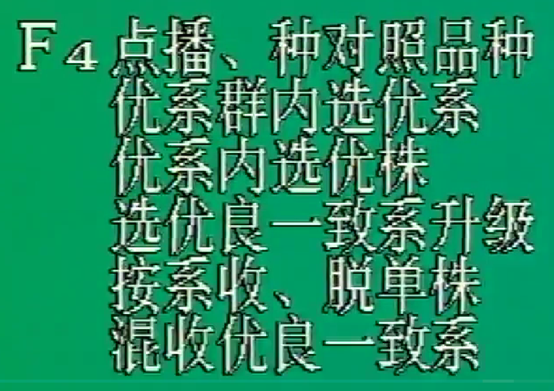

# 作物育种学

## 绪论

### 一、作物进化和遗传改良

#### （一）作物品种的概念

1. 作物品种（variety）：人类在一定的生态条件和经济条件下，根据人类的需要所选育的某种作物的一定群体。

2. 与变种相区别：作物品种属于一定的种及亚种，不同于变种 var. 。**变种是自然选择、自然进化的产物**。多用**cultivar表示品种，cv.**

3. 特性：**特异性（distinctness）、一致性（uniformity）和稳定性（stability），简称DUS**

#### （二）自然进化和人工进化

1. 育种阶段：1.0-4.0

2. 自然选择和人工选择：现代的作物品种是在**自然选择基础上的人工选择的产物**。

3. 自然进化和人工进化：作物育种实际上就是作物的人工进化，是**适当利用自然进化的人工进化**，其进程远比自然进化要快。

#### （三）遗传改良在作物生产发展中的作用

作物增产：良种良法

1. 优良品种：在一定地区和耕作条件下能符合生产发展要求，并具有较高经济价值的品种。

   生产上的良种，包括具有**优良品种品质**和**优良播种品质**的双重含义。

2. 优良品种的作用：

   （1）**提高单位面积产量**

   （2）改进产品品质

   （3）保持稳产性和产品品质

   （4）扩大作物种植面积

   （5）有利于耕作制度的改良、复种指数的提高、农业机械化的发展及劳动生产率的提高

### 二、作物育种学的发展

#### （一）作物育种学的性质与任务

1. 性质：研究选育和繁殖作物良种的理论与方法的学科
2. 任务：
   - 基础
   - 选育出适于该地区生产发展需要的高产、稳产、抗逆、优质的新品种或杂交种
   - 同时在其繁殖过程中保持和提高其种性，提供种子，促进高效农业的发展

#### （二）作物育种学的内容

1. 制订育种目标及实现这些目标的相应策略
2. 种质资源搜、保存、评价、利用、创新
3. 选择方法与理论研究
4. 人工创造变异方法与技术
5. 杂种优势利用途径与方法
6. 目标性状的遗传、鉴定及筛选方法
7. 各阶段的田间试验技术
8. 新品种审定、推广和种子生产

#### （三）作物育种学的发展

#### （四）现代作物育种学的发展趋势

1. 育种目标要求提高
2. 品种资源工作重视和加强
3. 采用现代技术和仪器进行快速精确的鉴定，提高育种效率
4. 传统育种技术与现代生物技术相结合

### 三、国内外作物育种的成就与展望

1. 种质资源工作
2. 育种途径、方法和技术

### 四、作物育种研究的前景

## 第一章 作物的繁殖方式和品种类型

### 一、作物的繁殖方式

有性繁殖（sexual reproduction）：**自花授粉、异花授粉和常异花授粉**。特殊形式——自交不亲和性和雄性不育性。

&

无性繁殖（asexual reproduction）：植株营养体繁殖和无融合生殖

#### （一）有性繁殖

1. 花器构造和开花习性对授粉的影响

   利于自花授粉：两性花，闭花受精，雌雄蕊同熟，开花时间短或开张角度小

   利于异花授粉：单性花，雌雄蕊异长，雌雄蕊异熟，虫媒花、风媒花，雄性不育，自交不亲和性，开花时间长或开张角度大

2. 作物天然异交率的测定

   - **根据作物的花器结构、开花习性、传粉方式、强制自交的结实性进行分析判断。**
   - 天然异交：与人工杂交相对而言的，是指同作物不同品种间的自然杂交。
   - 天然异交率测定方法
     - 通常是选择受1对基因控制的相对性状作为遗传测定的标记性状，
     - **以具有隐性性状的品种为母本**，将父本与母本等距、等量隔行种植，任其自由传粉结实
     - 然后将母本植株上收获的种子播种，进行后代苗期性状的测定。
     - 如果测定的性状为种子性状，表现花粉直感，则当代母本植株上收获的种子(已是F1代)可直接进行测定。计算出**F1代中显性个体出现的比例**，就是该品种的天然异交率。

   $$
   天然异交率=\frac{F_1代显性性状个体数}{F_1代总个体数}×100\%
   $$

3. 有性繁殖主要授粉方式

   （1）自花授粉：同一朵花的花粉传到同一朵花的雌蕊柱头上，或同株的花粉传播到同株的雌蕊柱头上。**天然异交率<4%。**如水稻、小麦、大麦、大豆等。

   （2）异花授粉：雌蕊柱头接受异株或**异花花粉**授粉的授粉方式称为异花授粉。**天然异交率>50%。**如**玉米**、黑麦、甘薯、向日葵、白菜型油菜等。

   （3）常异花授粉：一种作物**同时依靠自花授粉和异花授粉**两种方式繁殖后代的称为常异花授粉作物。常异花授粉作物通常仍然**以自花授粉为主要授粉方式**，同时存在一定比例的天然异交，是自花授粉作物和异花授粉作物的过渡类型。**4%=<天然异交率<=50%。**如棉花、甘蓝型油菜、芥菜型油菜、高粱等。

4. 两种特殊的有性繁殖方式

   均为某些基因型或品系，并非所有。

   （1）自交不亲和性

   - 雌雄配子完全正常，但不能自花授粉结实
   - **白菜型油菜、烟草、马铃薯**
   
   （2）雄性不育性
   
   - 雌配子发育正常，而雄配子败育
   - 水稻、棉花、小麦、玉米
   - 受核基因控制的细胞核雄性不育性（GMS）和质核互作型雄性不育（简称细胞质雄性不育CMS）

#### （二）无性生殖

1. 营养体繁殖

   - 由植物营养器官，如茎、根、叶等通过分根、压条、扦插、嫁接等方法繁殖
   - 甘薯、马铃薯、木薯、甘蔗。大部分果树和花卉。
   - 无性系——如杂种优势保持可利用无性系。

2. 无融合生殖

   - **不经过正常受精和两性配子的融合过程而直接形成种子以繁衍后代的方式**。
   
   
      - 分类
        - 无孢子生殖：由胚珠体细胞有丝分裂形成二倍体胚囊
        - 二倍体孢子生殖：大孢子母细胞不经减数分裂，形成二倍体胚囊
        - 不定胚生殖：由胚珠或子房壁的二倍体细胞经过有丝分裂形成胚，同时极核发育成胚乳
        - 孤雌生殖：卵细胞，助细胞和反足细胞
        - 孤雄生殖
   

### 二、自交和异交的遗传效应

#### （一）自交的遗传效应

1. 纯合基因型保持不变

2. 杂合基因型后代发生性状分离，连续自交则使初始的杂合基因型逐渐趋向于若干种遗传上不同的纯合基因型

     - 连续自交：n对不连锁基因控制的性状，自交各代（r）纯合体比例（Xn）
       $$
       X_n=(1-\frac{1}{2^r})^n×100\%
       $$

3. 后代生活力衰退：自交衰退

     - 杂合基因型作物，自交后代的生活力、生长势和繁殖力下降现象
     - 产量下降、长势下降、繁殖力下降、抗逆性下降
     - 自交愈多，衰退愈严重
     - 异花>常异花>自花

#### （二）自花授粉作物和常异花授粉作物的基因型

1. 自花授粉作物

      - 可理解为同质纯合群体

      - 表现型整齐一致，表现型和基因型是一致

      - 上代的遗传性状可稳定地传递给下一代

2. 常异花授粉作物

      - 基本群体是自交产生的后代，这部分基本群体的基因型是纯合的，也是同质的，代表品种的基本性状

      - 另有小部分个体，基因型是杂合的
        - 品种基因群体同质基因型
        - 杂合基因型
        - 非基因群体的纯合基因型，由异交分离产生

#### （三）异交的遗传效应

1. 效应
   - 形成杂合基因型：异交是基因型不同（更广泛：不同植株）的两亲配子的受精结合。有选择的异交（人工杂交）是创造遗传变异的一种主要方法。
   - 增强后代的生活力：生长势、繁殖力、抗逆性，产量，即数量性状方面比亲本明显提高
     - 杂种优势利用
2. 异花授粉作物的基因型
   - 长期自由授粉形成的群体，基因型高度杂合
   - 个体间的基因型是异质的
   - 表现型多种多样
   - 异质杂合群体

### 三、作物的品种类型及其育种特点

#### （一）自交系品种（纯系品种）

1. 定义：群体中个体基因型和群体均是纯合一致的
   - 纯系品种，同质纯合群体
   - 理论亲本系数到达0.87或更高，即**具有亲本纯合基因型的后代植株比例达到或超过87%**
   - 包括**自花授粉作物和常异花授粉作物的纯系品种和异花授粉作物的自交系品种**。
2. 育种特点：

   - **自花授粉加单株选择的育种方法**

   - 拓宽遗传变异范围，在大群体中进行单株选择

   - 利用天然突变或诱变产生突变的系统育种十分有效

   - 质量性状或主基因制的性状只需1-2次单株选择即可使性状达到稳定；而数量遗传性状则要进行多代选择

   - **异花授粉作物或常异花授粉作物因基因的杂合性，经多代自交才能产生自交系**

#### （二）杂种品种

1. 定义：在严格选择亲本和控制授粉的条件下生产的各类杂交组合的杂种一代植株群体。
   - 群体内个体之间的基因型是纯合一致的，个体基因型高度杂合。（就都是一样的杂合）
   - 异花授粉作物，自花授粉作物和常异花授粉作物也可（雄性不育系）
2. 育种特点：

   - 亲本应为自交系，自交系间杂交种的杂种优势最强
   - 亲本自交系间的配合力是关键，一般配合力和特殊配合力均要进行测定
   - 亲本繁殖要严格进行隔离
   - 制种成本要低、并能进行纯度检测以进行质量控制

#### （三）群体品种

1. 分类：遗传基础比较复杂，群体内植株基因型有一定程度的杂合性和异质性。

   - 异花授粉作物的自由授粉品种

   - 异花授粉作物的综合品种：异质杂合群体。综合品种中的个体基因型杂合，个体间基因型异质，但也有一个或多个代表本品种特征的性状。

   - 自花授粉作物的复合品种：异质纯合群体。将两个以上的自花授粉作物的自交系进行杂交，然后将其种植在特殊环境中繁殖出的分离混合群体。群体内植株个体基因型纯合，个体间存在一定差异，但主要农艺性状差异较小。

   - 自花授粉作物的多系品种：若干近等基因系的种子混合繁殖而成。**近等基因系具有相似的遗传背景，只在个别性状上存在差异或改善。**异质纯合群体。抗病培育。

   

2. 育种特点
   - 为了创造和保持群体广泛变异，选择若干个有遗传差异的自交系作为原始亲本进行杂交
   - 增加育种群体，以尽可能大地保持其遗传变异
   - 后代一般不作选择，以免发生遗传漂移

#### （四）无性系品种

1. 定义：由一个无性系或几个遗传上近似的无性系经过营养器官繁殖而成。
   - 个体间纯合一致，但其基因型往往是杂合的，并可能是多倍体或不育的三倍体
2. 育种特点：
   - 利用无性系迅速固定优良性状和杂种优势
   - 选择优良芽变，培育新的优良无性系品种
     - 芽的分生组织细胞发生的突变

   - 充分利用多倍体、三倍体和非整倍体
   - 有性繁殖，以产生变异。一旦选到合符育种目标的个体即进行无性繁殖，育成新的品种

## 第二章 种质资源

### 一、种质资源的重要性

#### （一）作物种质资源

1. 定义：Germplasm，包括品种、类型、近缘种、野生种的种子、植株、无性繁殖器官、花粉、单细胞无性系等。又叫原始材料、遗传资源、基因资源

2. 作用：

   （1）育种工作的突破，关键是种质资源

   - 水稻矮杆育种
     - 1950s
     
   - 小麦矮秆育种
   
   - 玉米的高赖氨酸育种
   
   - 双低油菜育种
     - 低芥酸，低硫甙

​	（2）种质资源是人类的宝贵财富。人类的命运将取决于我们对种质资源的理解、发掘和开发利用

### 二、作物起源中心学说及其发展

#### （一）形成及其主要内容

瓦维洛夫，作物起源中心学说（Origin center of crop）

1. 主要内容

   （1）作物起源中心的两个特征：**基因多样性和显性基因的高频率性**。

   - 基因中心或变异多样化中心

   （2）最初起源地为**原生起源中心**，扩散后形成**次级中心或次生基因中心**，次级中心为**隐性基因控制的多样化地区**

   | 原生起源中心       | 次生起源中心     |
   | ------------------ | ---------------- |
   | 有野生祖先         | 无野生祖先       |
   | 有原始特有类型     | 有新的特有类型   |
   | 有明显的遗传多样性 | 有大量的变异     |
   | 有大量的显性基因   | 有大量的隐性基因 |

   （3）**遗传变异性的同源系列规律：**在一定的生态环境下，一年生草本作物间的遗传性状存在着平行现象

   - 如小麦有一性状，可能在大麦或水稻中也有此基因

   （4）原生作物和次生作物

   - **有目的地驯化植物称**为**原生作物**
   - **伴原生作物的杂草**到异地，原生作物不适，而杂草成为主体，称**次生作物**，如燕麦和黑麦

2. 瓦维洛夫提出的作物起源中心

   天然隔离。每个中心物种多样普遍，具有特殊的种质资源，是育种的资源宝库

   （1）中国-东亚中心

   - 稷、粟、高梁、裸粒无芒大麦、荞麦、大豆、茶、大麻、苎麻等共136物种，11个作物

   （2）印度中心（南亚热带中心）

   - 水稻、绿豆、饭豆、豇豆、甘蔗、芝麻、红麻等共117物种，15个作物（包括补充区）
   - 印度-马来西亚补充区：薏苡、香蕉

   （3）中亚细亚中心（西南中心）

   - 普通小麦、密穗小麦、印度园粒小麦、豌豆、蚕豆、草棉等42个物种，15个物种

   （4）近东中心（西亚中心）

   - 一粒小麦、二粒小麦、黑麦、葡萄、石榴、核桃、无花果、苜蓿等 83 物种，20个作物

   （5）地中海中心

   - 大量蔬菜作物、牧草的起源中心，小麦、豆类的次级起源中心

   （6）埃塞俄比亚中心

   - 小麦、大麦，亚麻（种子用于面粉），共有38个物种，15个作物

   （7）墨西哥南部和中美中心

   - 玉米、陆地棉、甘薯、番茄，共有49物种，9个作物

   （8）南美（秘鲁-厄瓜多尔-玻利维亚）中心

   - 多种块茎作物。包括马铃薯的特有栽培种整个南美共有62个物种，17个作物

   - 智利中心：木薯、花生和凤梨
   - 巴西-巴拉圭中心

3. 发展和补充

   （1）哈伦：将作物变异从空间和时间两方面来论证

   - 土生型
   - 半土生型：被驯化栽培的植物只在邻近地区扩散
   - 单一中心型：在原产地被驯化后迅速在相似的其他适宜地区大量栽培，不产生次生中心
   - 有次级中心型：作物从一个明确的原生起源中心广泛扩散栽培，在一个或几个地点形成次生变异起源中心
   - 无中心：有些作物看不出有明显的原生起源地点。**时间久远并不是多样化变异中心形成的唯一因素，栽培环境的复杂性更易引起多种变异类型的形成。**

   基因小中心：某些作物的特殊隐性基因类型出现于一些较窄的生态地区，同样具有推动作物进化的作用

​	（2）茹科夫斯基

- 十二个中心
- 除大中心外，还划分基因小中心。基因小中心对于育种更有价值。

​	（3）A.C.泽文：多样化变异区域。大基因中心或多样化变异区域都包括作物的原生起源地点和次生起源地点

### 三、种质资源工作的内容

工作内容：搜集、保存、研究、创新和利用

工作方针

#### （一）种质资源的类别和特点

种质资源又称**遗传资源**。**种质系指农作物亲代传递给子代的遗传物质**，它往往存在于特定品种之中。

1. 根据来源
   - **本地种质资源**：包括古老的地方品种和当前推广品种，适合本地的特点
   - **外地种质资源**：从其他国家和地区引入的品种或类型，反映原产地的特点，不同的生物学和遗传特性
   - **野生种质资源**：作物的近缘种和有价值的野生种，具有某些特有的优良性状
   - **人工创造的种质资源**：包括遗传研究和育种的中间材料，变异丰富

2. 按亲缘关系来分
   - **初级基因库**：同一种内的材料，可杂交进行基因重组，最有价值
   - **次级基因库**：种间及近缘植物，基因转移是可能的，但较困难
   - **三级基因库**：亲缘关系更远，杂交不实和杂种不育现象更明显

3. 从育种角度
   - **地方品种**：不包括正在推广的品种。缺点明显，但有特殊的性状，如抗性、适应性、口味
   - **主栽品种**：丰产性好，适应性广
   - **原始栽培品种**：与杂草共生，许多已灭绝
   - **野生种和近缘种**：包括野生、半野生类型
   - **育种中间材料**：具有某些缺点，但遗传变异丰富

#### （二）种质资源的收集

1. 种质资源收集的近切性和必要性

   - 育种需求
   - 生产需求
   - 资源需求
   - 利用需求

2. 收集方法
   - 直接考察收集；
   - 征集；
   - 单位之间彼此交换；
   - 转引

3. 收集材料的整理

   分类、登记

4. 品种资源的保存

   （1）原则：

   - 保持生活力
   - 保持原有的遗传变异度
   - 维持样本的一定数量

   （2）优先保存的内容

   - 应用研究和基础研究的种质材料
   - 可能灭绝的稀有种和已经濒危的种质，特别是野生祖先种
   - 具有经济利用潜力而尚未被发展和利用的种质
   - 在科普及教育有用的种质

   （3）保存方法

   - 种植保存
   - 贮藏保存
     - 
   - 离体保存：愈伤组织、悬浮细胞、幼芽生长点、花粉、花药、体细胞、原生质体、幼胚等
   - 基因文库保存：DNA
   - 活体保存：主要用于木本植物

5. 种质资源的鉴定与研究

   - 特征、特性的观察与鉴定
   - 性状遗传特点研究

6. 种质资源的利用

   - 通过杂交、诱变及其它手段创造新种质
   - 直接从中选择优良个体培育新品种
   - 通过杂交、诱变等，从后代中选择优良变异个体，培育成新品种

### 四、电子计算机在种质资源管理中的应用

种质资源数据库

## 第三章 育种目标

### 一、现代农业对农作物品种的一般要求

#### （一） 高产

提高单位面积产量

**产量构成因素（栽培学内容）**

途径：多穗型丰产品种，大穗型丰产品种，中间型（穗、粒、粒重并重）

**高光效育种**：株型、叶型、叶功能期长短；生理因素

#### （二）稳产（抗性）

抗生物逆境：病害、虫害、草害

抗非生物逆境：干旱盐碱

持久抗性：生物逆境+非生物逆境

#### （三）早熟

作用：提高复种指数，提高单位面积产量，避逆境

性状：提高作物生长进程，集中开花

问题：品质、产量、性状指标

#### （四）优质

营养品质、口感品质

播种品质

工业原料，如棉花纤维品质

#### （五）广适应性目标

作物类型之间差异

品种之间的差异：光温敏感性

#### （六）适宜于机械化作业

降低劳动力成本

### 二、制定育种目标的一般原则

1. 考虑到国民经济的发展和生产需求
2. 根据当地的条件，抓主要矛盾
3. 育种目标要具体化和可能性
   - 量化
4. 考虑品种搭配

## 第四章 引种与驯化

### 一、引种的作用

#### （一）概念

1. **引种：**将异地的优良品种、品系或具有某些优良特性的类群引入本地作为育种素材或直接推广应用的育种措施。

   广义：从外地区、外国引进新植物、新作物、新品种以及用于育种和有关理论研究的各种遗传资源

   **作为育种途径：**从外地区、外国引进作物新品种，通过适应性试验，直接在本地区或本国推广种植。

2. **驯化：**某一物种习惯于新迁入地区的气候和生境条件的过程

3. 引种驯化的情形：

   - 立即成功：快速适应
   - 基本成功：最初不适应，逐渐适应
   - 不成功：完全死亡、无法繁殖
   - 引种栽培：不能结籽但能生产（大麻亚麻木薯北引）

#### （二）作用

1. 引进新作物、新品种，发展工农业生产
2. 充实种质资源，丰富作物的种质资源
3. 利用异地种植，提高作物产量

### 二、引种的基本原理☆

#### （一）作物的生态环境与生态类型

1. 相关概念

   （1）**生态因素**

   对作物的生长发育有明显的影响和直接作为作物所同化的因素。土肥水温

   （2）**生态环境**

   综合起作用的一些生态因素的复合体

   （3）**生态适应**

   对于一定的生态环境表现生育正常的反应

   （4）**生态适应范围**

   对于一定的生态环境表现生育正常的反应范围

   （5）**生态区**

   对于一种作物具有大体相同的生态环境的地区，同生态适应范围

   （6）**生态类型**

   一种作物对一定地区的生态环境具有相应的遗传适应性，具有相似遗传适应性的一个品种类群
   

#### （二）气候相似性原理

Mayr

**地区之间，在影响作物生产的主要气候因素上，应该相似到足以保证作物品种互相引用成功时，引种才有成功的可能**

#### （三）纬度、海拔、作物发育特性与引种的关系

1. 温度
   - 生物生长温度：
     - 温度由低到高，早熟；
     - 反之延迟成熟
   - 植物发育温度
     - 生长温度与发育温度不同
     - 春化：植物发育必须的低温阶段

2. 光照

   - 充足有利于植物的生长发育

3. 作物的发育特性

   - 高温短日性作物：水稻、玉米、大豆
   - 低温长日性作物：小麦、大麦、油菜

   **感温阶段**

   - 低温作物
     - 冬性：0-5℃，30-70d
     - 半冬性：3-15℃，20-30d
     - 春性：5-20℃，3-15d
   - 高温作物（喜温作物）：20-30℃，5-7d

   **感光阶段**

   - 长日照作物：**>12h**（<u>有问题，临界日长不一定为12h</u>）
   - 短日照作物：**<12h**
   - 中间性作物：对日照长短反应不敏感

4. 纬度、海拔
   - 低纬度：高温、短日照
   - 高纬度：低温、长日照
   - 海拔增加100m，相当于纬度+1°

### 三、引种的一般规律及方法

#### （一）引种的一般规律

作物的发育特性，对环境反应的敏感性

1. 低温长日性作物的引种规律

   **春化**是主要因素

   （1）原产高纬度地区的品种：向南引种，不能满足春化的低温要求，迟熟或不抽穗

   （2）原产低纬度地区的品种：向北引种，生育期缩短，早熟，冻害

   （3）冬播区春性品种（如浙江冬播的春性小麦）：向春播区引种，适应，早熟、高产。**因日照变长，变强**。抗病性限制（锈病）

   （4）春播区的春性品种：春播区大多不需要春化，向冬播区，大多不适应。迟熟，结实不良，易受冻害。春季光照不足。

   （5）高海拔地区的冬作作物品种：**偏冬性，引种到平原大多不适**，反之有可能。

2. 高温短日性作物

   （1）原产高纬度地区的品种：早熟春播作物，感温性强而感光性弱。向南引种，早熟、低产

   （2）原产低纬度地区的品种：有春、夏、秋播之分

   - 春播品种：感温性强而感光性弱，向北引种迟熟营养器官变大（温度）
   - 夏秋播品种：感温性弱而感光性强，向北引种，光照要求不能满足，植株和穗可能较大，生育期推迟。冻害（安全成熟问题）。

   （3）高海拔地区品种：感温性强，引到平原，早熟、低产（高产问题）；反之延迟成熟，安全成熟问题

3. 作物对环境敏感性与引种

   （1）敏感型作物：**大豆引种范围较窄，南北之间相互引种不能超过2度**

   （2）迟钝型作物：如甘薯，引种较广

   （3）中间型作物：介于二者之间。驯化的结果

#### （二）引种的方法与技术

1. 明确目的和要求
2. 先试后引，做好引种试验
3. 与栽培试验相结合
4. 引种与繁殖相结合，少引多繁
5. 检疫工作
6. 选择工作

**引种实践**

- 水稻引种
  - 类型：早稻、中稻、晚稻，籼稻、粳稻
  - 南种北引：选择早稻早熟、中熟品种或对短日照反应迟钝的品种
  - 北种南引：高温和短日照，生育期缩短，减产。引晚熟，但一般不能引种
  - 光温二系杂交水稻引种问题

- 小麦引种
  - 冬麦、春麦；春性、冬性
  - 北方冬小麦向南引，气温偏高日照变短，不能顺利完成感温阶段，成熟期延长，甚至不能抽穗
  - 南方弱冬性小麦品种引北，越冬前通过感温阶段，抗寒性降低，冻害
  - 北方的春小麦的感温阶段短，范围宽，适应性强
- 大豆引种
  - 南种北引：日照增长，延迟开花，正常成熟
  - 北种南引：日照缩短，生长发育加快，植株变小，成熟提早，产量降低
- 玉米、高粱、麻类均属短日性作物，与水稻、大豆相似

### 四、驯化的原理和方法

#### （一）概念

人类对植物适应新的地理环境能力的利用和改造

引种是驯化的前提；驯化是引种的客观需要

既有联系又有区别

#### （二）植物驯化的原理与方法

1. 米丘林的“风土驯化学说”

   （1）基本原理：生物体与其生存的环境之间存在着对立统一的关系，**生物体的遗传可塑性使得它可以经过驯化而适应新的环境**

   （2）具体做法：选用植物**遗传不稳定、最易动摇**的幼龄实生苗，作为风土驯化的材料，采用逐步迁移的方法，使其在新的环境影响下，逐步改变原有的本性，最终适应新的环境

   （3）方法依据

   - 幼龄阶段变异性较大
   - 实生苗对新环境适应能力强

   对果树引种具有重要的指导意义

2. 其他驯化理论和驯化方法

   - 生态因子季节节律同步论
   - 顺应与改造相结合理论
   - 直播育苗、循序渐进、顺应自然、改造本性方法
   - 地理生态生物学特性综合分析法
   - 生境因子分析法

## 第四-2章 选择育种

育种成败的关键在于亲本选配和后代选择

选择育种：对现有品种群体中出现的自然变异进行性状鉴定、选择并通过品系比较试验、区域试验和生产试验培育新品种。

**又称系统育种**。对典型的自花授粉作物又可称为纯系育种。

### 一、人工选择的特点

#### （一）相关概念

1. 自然选择：自然条件对植物的选择。把一切不利于生物生存与发展的变异淘汰掉，而保留一切对生物本身有利的变异

2. 人工选择：根据人们的需求，从混杂的群体中挑选符合要求的个体或类型。优株选择、种源选择等选择育种。

3. 区别

   |          | 自然选择                       | 人工选择                             |
   | -------- | ------------------------------ | ------------------------------------ |
   | 选择动力 | 自然因素                       | 人为选择的影响（包括有意识和无意识） |
   | 选择方向 | 利于对生物体合理的、有益的变异 | 选择对人类有利的变异                 |
   | 选择效果 | 适应自然环境                   | 更符合人类要求                       |
   | 时间     | 长                             | 短                                   |

#### （二）自然选择和人工选择的联系

- **人工选择必须接受自然选择的检验**，只有能适应自然环境条件的群体或个体，才能在生产上推广
- 人工选择**应在自然选择的基础上**进行，充分利用自然选择创造的条件
- **人工选择的结果会使群体遗传基础变窄**，使基因资源丢失，造成不良后果。在选择育种过程中不断补充新的育种材料，使育种群体遗传基础不致因选择而迅速窄化。
  
  - 驯化中的遗传瓶颈
  
  

#### （三）选择类型

1. 稳定选择

   有利于中间类型，数量性状的平均值不变，变异系数减小或不变。

   **良种繁育**、自然选择

   

2. 定向选择

   选择偏向某一极端，群体遗传组成定向变化。如高产

   人工选择

   

3. 多向选择

   两个或两个以上不同方向，不利于中间类型。如需要高产、优质，打破连锁

   群体变异增大，最终形成分离的两个群体
   
   

### 二、作物群体中的遗传变异与利用

#### （一）自然变异的原因

1. 异交引起基因重组，是绝对的
2. 天然突变
3. 新育成品种剩余的变异：未真正纯合，自交分离

#### （二）自然变异在育种中的应用

直接应用与间接应用——育成新品种

自花和常异花授粉作物常用的方法

#### （三）影响选择效果的主要因素

1. 性状遗传力和遗传增益

   （1）性状的遗传力：亲本将某一性状传递给子代的能力。**可作为确定选择方法和预估遗传增益的一个参考指标。**

   - 广义遗传力：遗传方差占表型方差的比值
     $$
     H^2=\frac{V_G}{V_P}=\frac{V_G}{V_G+V_E}
     $$

   - 狭义遗传力：加性方差占表型方差的比值
     $$
     h^2=\frac{V_A}{V_P}=\frac{V_A}{V_A+V_D+V_I+V_E}
     $$

   - 现实遗传力：选择响应与选择差的比值。
     $$
     h_r^2=\frac{R}{S}
     $$
     
     - 选择响应R：**入选亲本子代**平均值据被选择亲本群体平均值的离差
     - 选择差S：**入选群体平均值**距被选群体平均值的离差
     - **遗传增益△G：选择响应与亲本群体平均值比值，百分数**

2. 影响选择效果的主要指标

   （1）选择响应与选择差和遗传力

   事实上，现实遗传力可以看做狭义遗传力
   $$
   R=h^2S
   $$
   由上述公式可知，**改良效果受遗传力和选择差制约。预估改良效果。**

   （2）选择响应与入选率和选择差

   - 入选率P是指选出个体数目占选择群体总数的比率
   - 入选率和选择响应的关系：**入选率越小**，即从群体中选出的株数越少，则选出数目性状平均值越大，**选择差越大**，选择效果越好，因此可以通过**降低入选率来提高选种效果**。

   （3）选择强度、选择性状的变异系数和遗传力平方根越大，改良效果越好

3. 影响选择效果的因素

   （1）选择的环境条件

   - 性状遗传力越大，选种效果越好
   
   - 性状遗传力的估算，与环境条件有关。环境条件局部控制
   
   （2）性状标准差
   
   - 选择群体性状变异幅度大，即加性方差大的性状，选种效果好

   
   （3）选择强度
   
   - 适当降低入选率，增加选择差，提高选择效果。
   - 入选率越低，选择差越大，但它们不是直线关系

#### （四）性状鉴定方法

1. 基本方法和特点

   （1）**直接鉴定（被鉴定的性状）和间接鉴定（相关性状）**

   - **对被鉴定的性状直接进行鉴定**
   - **根据与目标性状有高度相关的性状表现来鉴定该目标性状**

   （2）田间鉴定和实验室鉴定

   - 将试验材料种于大田，进行各种性状的直接鉴定
   - 对作物品质性状及生理生化指标在实验室内进行的鉴定

   （3）自然鉴定和诱发鉴定

   - 在试验田里对试验材料的生物胁迫和非生物胁迫的抗（耐）性等进行的直接鉴定
   - 在人工创造诱发条件下，对试验材料进行抗（耐）性等的鉴定

   （4）当地鉴定和异地鉴定

   - 试验材料在当地条件下进行鉴定
   - 将试验材料种植到异地进行的鉴定

2. 鉴定效率与育种效果

   效率决定育种效果

#### （五）纯系学说

约翰逊

1. 内容

   （1）自花授粉作物原始群体通过选择育种可产生一些不同的纯系。即原始品种选择有效

   （2）纯系中选择无效

   （3）纯系学说是自花授粉作物选择育种的基础。但也有某些局限性。因为纯是相对的，而不纯则是绝对的。

### 六、选择育种的方法

#### （一）选择的基本方法

1. 单株选择
   - 从品种群体中选择优良的个体，分别脱粒保存，第二年分别各种一小区，根据各小区植株的表现来鉴定上年当选个体的优劣，并据此淘汰不良个体的后代
   - 该方法对**改良自花授粉作物品种群体**的效果明显
2. 混合选择
   - 从品种群体中选择目标性状基本相似的个体，**混合后加以繁殖**，与原品种进行比较，从而培育新的品种
   - 该方法适合于**常异花授粉作物和异花授粉作物品种群体**的改良

#### （二）选择育种的方法

1. 系统育种（单株选择、纯系育种）

   - 原始品种群体选择优良单株（穗、铃等）
   - 株行试验（隔9设**对照**，原始品种和推广品种）
   - 品系比较试验（重复试验，推广品种对照，随机区组）
   - 区域试验和生产试验
   - 品种审定

   

   株行→株系→品系→品种

2. 混合选择育种

   - 原始品种群体选择优良单株，混合成群体
   - 选择群体与原始群体比较
   - 繁殖优质种子
   - 大面积推广（原品种种植地区）：相当于良种繁育

   

3. 集团混合选择育种

   - 原始品种群体**按类型分类型选择优良一致的单株混合成不同的集团**
   - 各集团与原品种进行比较试验
   - 优良集团繁殖推广

   

4. 改良混合选择育种

   - 结合系统育种与混合选择育种的一种方法。
   - 先采用系谱法选择单株种成株行
   - 选优良一致株行混合成改良品种

   

5. 无性繁殖作物的选择育种

   无性繁殖作物群体中一旦发现优良的变异即可通过**芽变**的方法加以繁殖

#### （三）芽变育种

1. 芽变：在树木生长点的分生组织细胞发生变异，由变异了的芽萌发成枝，或由此长成的个体，在组织和器官性状上与原类表现不同

## 第五章 杂交育种

杂交育种成败在于亲本选配和后代选择

杂交育种得到纯系，杂交种利用杂种优势

### 一、杂交育种的意义
#### （一）杂交育种

1. 杂交育种：通过两个或更多个亲本品（系）种杂交，进一步从杂种后代的**自交分离群体内选择培育新品种**
2. 目的：打破品种间的生殖隔离，有目的地人工创造变异类型
3. 杂交与选择：相联系。创造变异，综合亲本的优点到一个新品种中去，但育成一个品种必须对杂交后代进行选择。
4. 意义：
   - 比单纯的选择育种更富于创造性和预见性。
   - 与其他育种方法（引种、倍性育种、诱变育种）相结合，效果更好。
   - 培育新品种的最主要方法和有效途径。

#### （二）杂交的类型

1. 天然杂交：机率较低，特别是自花授粉作物
2. 品系间杂交：**未形成品种的材料间相互杂交**
3. 品种间杂交：最常见，单交、双交、复交、回交
4. 亚种间杂交：如水稻japonica&indica，结实率问题
5. 种间及属间杂交：远缘杂交，创造种质资源时。种间隔离，不易成功

#### （三）杂交育种原理

1. 基因重组综合双亲优良性状

   

2. 基因互作产生新的性状

   

3. 基因积累产生超亲性状

   

**杂交育种可分为组合育种和超亲育种**

- 组合育种：将双亲控制不同性状的优良基因随机结合，通过定向选择，育成集双亲优良性状于一体的新品种。**基因重组和互作**
- 超亲育种：将双亲控制同一性状的不同微效基因积累于同一杂种个体中，形成在该性状上超过亲本的类型。**基因累加和互作**

#### （四）杂交育种与杂交种

杂交种：利用杂种优势，杂种优势利用

杂交育种：育种的一种方法，基因重组产生变异

### 二、杂交亲本的选配

#### （一）亲本选配工作的重要性

关系到育种工作的成败

#### （二）一般原则

1. 双亲都有较多优点，没有突出缺点，优缺点互补
   - 目标性状要求是多方面的、综合的
   - 优缺点互补
   - 没有严重缺点
2. 亲本之一适应当地条件、综合性状较好推广品种
3. 注意亲本间的遗传差异，选用生态类型差异较大的，亲缘关系较远的亲本材料相互杂交
   - 杂交后代分离广泛，有可能出现超亲类型
   - 不同生态条件下，容易出现适用性更广的后代
   - 克服当地材料的缺点
   - 杂种优势大，变异类型多，选择机会多
   
   不同育种家，不同地域
4. 杂交亲本应具有较好的配合力

### 三、杂交技术和方式

#### （一）杂交技术

了解具体作物的花器构造、开花习性、授粉方式、花粉寿命、胚珠受精能力与寿命等

1. 花期调节：分期播种（早播早熟）、光温处理、再生植株、肥控（少肥少水——早熟；多氮肥——晚熟；多磷钾肥——早熟）

   - 花期相遇，诱导开花

2. 控制授粉：母本防止自花授粉和天然杂交（授粉前去雄隔离）

3. 授粉后管理：挂牌标记

   条件允许，一行做一个组合。

花粉收集

花粉贮藏：花期不能相遇，或距离很远。低温干燥黑暗

花粉生活力测定方法

- 直接授粉
- 形态鉴定
- 染色法：酶氧化还原
- 花粉发芽试验

#### （二）杂交方式

1. 单交：两个亲本成对杂交

   - 表示方式：A/B或A×B，前者为母本，后者为父本
   - 特点：
     - 亲本在杂种和后代群体遗传成分各占50%
     - 杂交一次，育种时间短、分离不大
     - 群体要求较小。一般以当地品种为母本
2. 复交（复式杂交或多元杂交）：三个及以上亲本进行两次或两次以上的杂交

   - 三交：（A×B）×C，A/B//C
   - 双交：（A×B）×（C×D），A/B//C/D
     - 亲本的遗传组分不同
   - 四交：[(A×B)×C]×D，A/B//C/3/D
     - 最后杂交的亲本遗传占50%，杂交周期长
   - 五交：{[(A×B)×C]×D}×E，A/B//C/3/D/4/E
   - 聚合杂交：[(A×B)×(C×D)]×[(E×F)×(G×H)]
     - 遗传基础丰富
     - 分离早，分离时间长，类型多
     - 杂交数量和后代群体规模要大
3. 回交

   - 表示：（A×B）×A或（A×B）×B
   - 回交可进行多次
   - 优良特性的品种第一次杂交时用作母本，而在以后各次回交后用作父本。
   - 轮回亲本（受体亲本）、非轮回亲本（供体亲本）
   - BC1，BC2
4. 多父本混合授粉杂交

   - 用多个亲本的花粉混合，对一个母本进行授粉
   - A× (B+C+D+……)
   - **在一次杂交中就取得遗传基础更为丰富的原始材料；或克服远缘杂交不可配性而取得杂种**

### 四、杂种后代的处理

#### （一）系谱法

1. 方法

   - 自杂种第一次分离世代（单交F2，复交F1）开始**选株，分别种成株行，每株行成为一个系统（株系）**
   - 以后各世代在优良系统中**连续选单株**，直到选出优良一致系统，升级进行产量试验
   - 在选择过程中，各世代都给以系统的编号，以便查找**系统史和血缘关系**

2. 各代工作要点

   - F1：

     - 栽植：单本，去除假杂种；淘汰不良组合
     - 选择：单交不选择混收，亲本不纯F1有分离应选择，复交F1因群体大视同F2
     - 目的：保证足够的后代种子，单交10-20株

     

   - F2和复交F1处理

     - 种植：按组合，点播，单本稀植，设立亲本行
     - 群体：500~5000株不等。根据作物、亲本差异、杂交方式、组合优劣目标性状和实际情况。
     - 选择：是选择的关键世代（F2单株决定后代）也是选择难度最大的世代（单株选择比群体选择困难，杂种优势）

     
     
     
     
   - F3处理

     - 田间种植：**按组合排列，当选单株点播成行**（株行、株系或家系），每系80~200株不等；设对照品种（每9或19个设立1对照）

     - 记载内容：本年号、上年号、亲本组合、世代、播种期、移栽期、抽穗开花期、成熟期、抗病虫性及其它主要经济性状的特征描述

     - 特征：系统内变异度缩小，主要性状表现趋势明显，个别株行基本稳定

     - 选择方法：参考记载，优良组合中确定优良系统，从中选择优良单株；入选的系统选择3~10株不等；每个单株按系统分别收获、编号；（常）异花授粉作物开花前套袋自交或隔离

       

   - F4及其以后世代处理

     - 田间种植：按组合、按系统排列，当选单株点播成行；每行 80~100株；设对照；
     
     - 记载内容：同F3。**同一F3系统（来自同一F2单株）形成多个F4系统组成系统群**；系统群内各系互为姊妹系
     
       
     
       

3. 优缺点

   （1）对于质量性状和遗传力高的性状来讲，系统法更有效，反之效果较差；
   （2）来源与亲缘关系清楚；
   （3）工作量大，有利基因易流失

#### （二）混合法

1. 自花授粉植物的杂种分离世代开始，**组内混种混收，不加选择，直到杂种后代基因型纯合达到80%以上时**（F5-F8），才开始选择一次单株，形成株系，从中选择优系升级进入产量试验
2. 工作要点：
   - 从分离世代开始，按组合混播混收，淘汰少量不良单株；
   - 混合世代群体大；
   - 第一次选择放宽要求（环境影响大，尤其是一些群体弱势性状）；
   - 第二次严格选择；

| 系谱法                                                       | 混合法                                                       |
| ------------------------------------------------------------ | ------------------------------------------------------------ |
| 遗传力较高性状，早代选择可靠尽早集中掌握少数优良系统；便于比较，控制规模；及时升级试验、审定、推广； | 遗传力低数量性状高代选择可靠；保留更多的优良基因型和重组类型；早代工作量相对较少； |
| 中选率低；多基因控制的性状的选择效果差；早代工作量大；       | 混合世代群体规模大；选择世代的工作量较大；可能丢失群体弱势性状；育种周期相对较长；无法考查系统间关系 |

#### （三）衍生系统法

1. 工作要点
   - F2或F3世代进行一次单株选择；
   - 单株繁殖的后代混合种植成衍生系统，混种混收几代；
   - 淘汰明显不良的衍生系统，直至性状趋于稳定；
   - 从中再进行一次单株选择，种成株系（系统）；
   - 优系升级为品系进入产量试验
2. 特点
   - **兼具系谱法和混合法的优点，克服了两种方法的缺点**
   - **在早代，主要遗传力高的性状进行一次选择，中选数量上可以比系谱法多，保留较多的基因型；按株行种植，在株行内可以及早获得优良株系；**
   - **在高代，主要选择遗传力低的性状，保证了选择的可靠性，减少了选择世代的工作量**

#### （四）单籽传法

1. 工作要点
   - 从分离世代开始，每株收获一粒种子；
   - 之后按组合每年混合种植，每株收获一粒种子；
   - F5或F6世代群体中选择单株，种成株行；
   - 选择优良株行升级成品系进入产量试验。
2. 特点
   - 群体遗传变异度大；
   - 节省时间和空间；
   - 优良重组类型少，群体平均水平低下；
   - 只进行一次单株选择，获得突出材料的可能性小；
   - 后期工作量大
   - 群体越来越小，要求F2有足够大的群体
   - **稳定的单粒传群体也被称为重组自交系群体（Rils），是目前常用的分子遗传研究群体（永久群体）**

### 五、杂交育种程序

#### （一）杂交育种试验圃与工作内容

1. 原始材料圃与亲本圃

   （1）材料：原始材料、种质资源、杂交亲本

   （2）种植：一般单行区或多行区（根据用途）；设对照或不设；密度稍稀

   （3）工作内容：观察各材料的特性；杂交、自交。

2. 选种圃：杂交后代各世代材料

   （1）材料：杂种F1、F2及后代群体
   （2）种植：土地要求均匀便以选种；密度稍稀**其中F1不选单株，但选组合**，**F2以后要选单株**，株行以后每隔9行设一对照，以便鉴定株行
   （3）工作内容：选择、鉴定稳定性与其它性状，关键

3. 鉴定圃

   （1）材料：**升入品系比较试验之前的材料**
   （2）种植：顺序排列，设对照，重复2~3次
   （3）工作内容：鉴定丰产、品质、抗性及其它性状；优良材料升为品系，其它淘汰或继续再鉴定一年。

4. 品系比较试验和多点试验

   （1）材料：品系，数量在10个以下。从鉴定圃中入选材料和上年从品系比较试验留下的材料。
   （2）种植：随机排列、重复3~4次，设对照
   （3）工作内容：1~2年，进一步鉴定品种的特性

5. 区试和生产试验

   省以上种子管理部门的工作，科研单位参与

6. 杂交育种早代测验

   可减少工作量，提高育种效率。
   只要有足够的种子就可进行早代测定。

## 第六章 回交育种

### 一、意义和遗传效应

1. 回交：两个品种杂交后，子一代与其亲本之一再进行杂交

2. 回交育种：**采用一次或多次回交的育种方法，称为回交育种**

3. 轮回亲本（受体亲本）：用于多次回交的亲本；有利性状（目标性状）的接受者

4. 非轮回亲本（供体亲本）：只在第一次杂交时应用的亲本；目标性状的提供者

#### （一）意义

1. **转育某几个优良性状，改良现有的优良品种**
2. **近等基因系的选育：抗病育种和分子生物学研究**
3. **细胞质雄性不育系的选育：核置换，杂种优势利用**
4. **打破不良的遗传相关：远缘杂交中常用的方法**

#### （二）遗传效应

1. 纯合群体：不加选择的情况下，回交的最后产物为轮回亲本；**在选择的情况下可得到非轮回亲本的目标性状+轮回亲本综合性状的后代**
2. 打破连锁：若非轮回亲本中目标性状基因与不良基因连锁时，则轮回亲本优良基因置换非轮回亲本的相应不良基因的进程将要减缓，其减缓程度依连锁的紧密程度即交换价（C）的大小而异。

### 二、回交育种方法

#### （一）步骤

1. 双亲杂交，F1回交于轮回亲本
2. 从回交后代中选择具有目标性状（像非轮回亲本，前景选择）和综合性状（像轮回亲本，背景选择）的植株与轮回亲本连续回交
3. **自交纯化，在自交过程中选择具有目标性状且农艺性状优良的植株及稳定系统**
4. 按常规进行产量比较试验，区域试验，生产试验

#### （二）回交亲本选择

1. 轮回亲本
   - 接受改良的对象，要求综合性状、适应性强、有丰产潜力
   - 当地栽培时间长，综合性状好的推广品种或最有希望推广
   - 具有良好的农艺性状，只存在个别缺点
   - 改良后有发展前途
2. 非轮回亲本
   - 目标性状的提供者
   - 目标性状要突出，**轮回亲本所缺少的一两个优良性状**
   - 目标性状遗传传递力强，受少数基因控制
   - 目标性状最好是显性，控制基因一两个

#### （三）回交后代的选择

1. 质量性状基因的回交转育

   （1）目标性状为显性

   

   - 最后自交两次

   （2）目标性状为隐性

   - **同时进行回交和自交**
     - **同一单株一部分穗自交，一部分穗回交。回交是否有效**
   - **每次回交之前均自交一次**

   

2. 数量性状基因的回交转育

   - 基因数目
   - 环境影响：**最好每回交一次，接着就进行自交一次，并在BCF2群体进行选择**

3. 多个目标性状基因

   - 逐步导入法
   - 聚合回交法

#### （四）回交次数

4-5次

原则：回交次数以轮回亲本的特征特性基本得到恢复为准。一般双亲差异小，回交次数可少些；**相反，亲本差异大，或目标性状与不良性状连锁时，应适当增加回交次数。**

**严格选择有助于轮回亲本性状的迅速恢复，可以减少回交次数**（前景选择和背景选择）

数量性状的回交次数不宜过多，否则目标性状不能保持，选择有效。

#### （五）轮回亲本异质性的保持

采用多株混合花粉回交的方法

#### （六）回交方法

1. 逐步回交法
   - 在同一回交方案中同时转移几个目标性状基因
   - 先以一个供体亲本进行性状转移，获得一个性状得到改良的材料后，再以它为轮回亲本，进行第二个性状的转移。
2. 双回交法
   - 两个品种，分别回交，自交，育成两个品系，一个具有B品种优良性状的A品系,一个具有A品种优良性状的B品系
   - 将A和B两个品系杂交,再自交
   
   
3. 聚合回交法
   - **在几个不同的回交方案中分别地转移不同基因，最后通过杂交将它们组合于同一个体中**

### 三、回交育种的特点及其应用价值

#### （一）回交的用途

1. 用于改良品种的个别缺点

   - 可将抗病品种作为非轮回亲本，以原品种做轮回亲本，将抗病基因导入原品种中，育成抗病且具有原品种全部优良性能的新品种

2. 杂种优势利用中，不育系和恢复系（？）的转育

   

   **轮回亲本就是保持系。**

3. 远缘杂交，解决杂种不育和分离世代过长等问题

4. 打破基因连锁

5. 选育近等基因系和多系品种
   - 多系品种：由多个**近等基因系**的混合品种
   - 抗病的多系品种：
     - 选择一个综合性状好的品种为轮回亲本同具有不同抗病基因的非轮回亲本回交，育成以A品种为遗传背景但具有不同抗性基因的**近似品系**（近等基因系）
     - **然后根据需要混合其中若干品系组成多系品种用于生产**

#### （二）回交育种的优点

1. 可控制杂交群体，改良个别性状
2. 有利于打破负相关：打破连锁
3. 比杂交育种所需群体小，缩短育种年限
4. 有利于推广，像轮回亲本

#### （三）缺点

1. **轮回亲本选择不恰当，不能适应发展要求**
2. 改良数量性状难，限于由少数主基因控制的性状
3. 每一代都需人工杂交，工作量大
4. 多效性，不利基因紧密连锁
5. 回复为轮回亲本基因型常出现偏离

#### （四）如何克服

1. 选好亲本，加强后代选择（前景选择和背景选择）
2. 适当减少回交次数，加强选择
3. 保持轮回亲本的异质性
4. 多种性状分别导入法再聚合
5. 改良回交法，更换轮回亲本

## 第七章 诱变育种

### 一、诱变育种的成就和特点

#### （一）概念和发展历史

1. 概念：利用理化因素**诱发**植株发生变异，再通过后代的**鉴定培育新品种**的育种方法
2. 发展历史

#### （二）主要成就

1. 育成大量的植物新品种
2. 创造并提供了大量的优异种质资源

#### （三）特点

1. 提高突变率，扩大变异谱，创造新类型
2. 适用于改良品种的个别性状，同时改良多个性状较困难
3. 性状稳定快，育种年限短
4. 变异方向和性质难于控制
5. 与其他育种方法结合使用，作用巨大

### 二、常用的物理诱变剂及其处理方法

常用诱变技术：物理诱变、化学诱变、太空诱变

#### （一）类别和选择

1. 紫外线：非电离辐射。250-290nm诱变作用最强
2. X射线：电子跃迁。工作电压和靶材料。软X射线，硬X射线，高能X射线
3. γ射线：原子核跃迁。**最常用。Co-60，Cs-137。**外照射
4. 粒子辐射
   - β射线：放射性同位素。内照射
   - α射线：氦的原子核。
   - 中子：外照射
5. 其他
   - 电子束
   - 激光
   - 离子注入
6. 航天育种

#### （二）处理方法

1. 材料

   - 各个部位，最常用的是种子、花粉、子房、营养器官以及愈伤组织等
     - 种子
     - 绿色植株
     - 花粉
     - 子房
     - 合子和胚细胞
     - 营养器官
     - 离体培养中的细胞和组织

2. 辐射处理

   - 外照射：被照射的种子或植株所受的辐射来自外部某一辐射源
     - 急性照射
     - 慢性照射
     - 连续照射
     - 分次照射
   - 内照射：将辐射源引入生物体组织和细胞内进行照射
     - 特点：
       - 慢性照射
       - 分布不均：生长点、形成层放射性较高
       - 元素本身
       - 常用射源：β射线源（放射性同位素）
       - 主要方法：浸泡法，注入法，施入法，合成法
       - 安全防护

3. 辐射处理的剂量

   **能够最有效地诱发育种家所希望获得的某种变异类型的照射量**

   - 不同作物和品种
   - 不同器官、组织和发育时间和生理状况
   - 环境

   半致死剂量LD50：处理当代植株成活50%

   临界剂量：处理当代植株成活40%

### 三、化学诱变剂及其处理方法

特点：

- 诱发突变率较高，而染色体畸变较少
- 针对性强
- 生物损伤大，易引起不育
- 具有一定的特异性，一定性质的诱变剂能诱发某些特定的变异

#### （一）类别与性质

1. 烷化剂：带有一个或多个烷基

   - 碱性条件下：烷化碱基、磷酸
   - 酸性条件下：没有诱变能力，生理伤害
   - EMS、DES、EI

2. 叠氮化钠

   - 酸性条件下，产生NH3，替换
   - 只作用于复制中的DNA
   - 碱性条件下无效
   - 对多倍体无效

3. 碱基类似物

   - 碱基错配
   - 5-溴尿嘧啶，5-氨基嘌呤

4. 其他

   抗生素、亚硝酸、羟胺、吖啶类物质

#### （二）处理方法

1. 处理材料和方法

   - 浸泡法
   - 滴液法
   - 注射法
   - 施入法：浸根和培养
   - 熏蒸法

2. 剂量

   性质、处理浓度、处理时间、处理温度

### 四、诱变育种程序

明确育种目标，哪种更易达到

改良的个别性状为隐性基因控制，采用诱变育种效果好

花卉育种中应用诱变育种比较广泛，**更特异的性状**，不要求种子产量

#### （一）处理材料的选择

1. 高产综合性状好和适应性好的推广品种：通过诱变改良一两个性状的缺点
2. 高世代优良品种：改良后可直接推广
3. 多倍体材料：耐受染色体畸变
4. 稳定一致材料：否则难以鉴定和选择

#### （二）诱变剂量的选择

1. **参考过去研究者的结果，确定**
   - **降低30%-50%苗高**
   - **半致死剂量**
2. 确定该诱变源的高频剂量范围，选择2-3种不同剂量进行试验

#### （三）处理群体的大小

根据突变率和M2群体大小

**突变率的高低与处理当代（M1）所见到的损伤（不育性和死亡）有关**

**M2获得特定的有益性状突变体的频率很低**

半致死剂量（LD50）

#### （四）后代种植和选择方法

根据突变率、M2群体大小、M1存活率（LD50）、目标性状的预期变异率

1. M1代植株及种植
   - **诱变一代：经诱变处理的种子或营养器官所长成的植株或直接出来的植株**
   - 尽可能存活
   - 主茎、穗突变率高
   - 不选择
   
   
2. M2代及其以后世代的种植
   - 突变细胞参与生殖细胞的形成，在M2代变异的遗传性状出现分离的世代，应该加以选择
   - 系谱法：每个M1主穗种植一个M2穗行，便于穗行间鉴别，工作量大
   - 混合法：M1每穗混收10-20粒左右，M2混种，选择，M3株行鉴定

### 五、诱变育种的应用效果和发展前景

#### （一）植物辐射诱变育种的主要成就

1. 育成大量植物新品种
2. 促进农业增产增收
3. 提供大量优异的种质资源

#### （二）植物诱变育种的发展趋势

1. 提高植物辐射诱变效率
2. 调整育种目标，拓宽应用范围
3. 加强诱变育种与其它育种方法的结合
4. 加强诱变育种与遗传工程的结合

## 第八章 远缘杂交育种

### 一、远缘杂交育种的重要性

#### （一）概念

**不同种、属或亲缘关系更远的植物类型间进行的杂交**

- 种间杂交
  - 普通小麦×硬粒小麦，陆地棉×海岛棉
- 属间杂交
- 科、纲间杂交：难度大
- 亚种的杂交
  - 亚远缘杂交，籼稻×粳稻

#### （二）育种学意义

1. 培育新品种和种质系

2. 创造新作物类型：导入不同种、属的染色体组。如八倍体小黑麦，六倍体小黑麦

3. 创造异染色体体系：**导入或置换某个异源染色体或染色体片段**

   - 异附加系：**在某物种染色体组的基础上，增加数量不等的异源染色体。为非整倍体**
     - 包括：
       - 单体附加系：附加一条外源染色体的个体
       - 二体附加系：附加一对外源染色体的个体
       - 双单体附加系：附加二条不同的染色体
     - 特点：
       - 染色体数目不稳定，容易恢复到二倍体
       - 育性减退
       - 异源染色体可能伴有不良性状
       - 不能用于生产，但可创造异替换系和易位系
   - 异替换系：物种的**一对或几对染色体**被另一物种的染色体所取代
     - 来源：由附加系（2n+1）与单体（2n-1）杂交再自交得到染色体的代换系
     - 特点：
       - 染色体数目未变
       - 细胞学和遗传学上都比相应的附加系稳定
       - 有时可在生产上直接利用
   - 易位系：**某物种的一段染色体与其它物种的染色体段发生交换**
     - 来源：异置换系、异附加系与栽培品种杂交、回交产生；辐射诱变、组织培养
     - 特点：
       - 导入有用基因的染色体片段、排除不利基因的染色体片段
       - 细胞学和遗传学特性更稳定更平衡
       - 可直接应用于生产

4. 诱导单倍体
   - 远缘花粉诱导孤雌生殖：远缘花粉诱导母本孤雌生殖，产生母本单倍体
   - 远缘杂种产生单倍体：远缘杂种会排除亲本之一的染色体，产生单倍体植株
   - so，**远缘杂交也是倍性育种的重要手段之一**

5. 利用杂种优势
   - 利用远缘种的细胞质差异发掘细胞质雄性不育系
     - 细胞质不育与核恢复基因相伴而存，无法在表型上识别
     - 通过远缘、亚远缘杂交、回交可以将细胞质不育与核不育结合在一起，获得核质互作雄性不育
   - 远缘、亚远缘杂交也可直接利用其杂种优势
     - 水稻的籼粳杂交
     - 棉花的陆海杂交
   - 体细胞杂交产生核质杂种
     - 质核来自不同物种
     - 双重杂种优势：
       - 基因之间的互作
       - 核质之间的互作

6. 研究生物的亲缘关系和进化

   许多物种是通过天然的远缘杂交演化而来的

### 二、远缘杂交的困难及其克服

#### （一）杂交不亲和性

远缘杂交常出现花粉不萌发、花粉管不能伸入柱头、花粉管生长缓慢或破裂、花粉管不能达到子房、雌雄配子不能结合形成合子等现象。

1. 原因

   （1）双亲受精因素的差异

   - 生理差异
   - 花器结构差异

   （2）双亲基因的差异

   - 控制可交配性基因
   - 基因互补的致死基因

2. 克服方法

   （1）亲本选择与组配

   - 广泛测交与正反交筛选
   - 以栽培种为母本
   - 以染色体数目多的物种作母本
   - 杂种为母本
   
   （2）染色体预先加倍法：染色体数目少的亲本人工加倍
   
   （3）桥梁（媒介）法
   
   （4）特殊的授粉方法：混合授粉、重复授粉、提前或延迟授粉、射线处理
   
   （5）外源激素处理：调节雌、雄性器官生理状态
   
   （6）柱头手术和子房受精：如雷蒙德氏棉
   
   （7）植物组织培养：试管受精、体细胞融合

#### （二）杂种夭亡、不育

1. 表现

   - 合子往往不能进一步发育成正常、完整的胚，后代不能完成正常的生活史
   - 不正常、不完整的胚和种子
   - 不正常的后代

2. 原因

   **（1）核质互作不平衡**

   **（2）染色体不平衡：同源染色体配对、分离异常，不能形成正常的配子**

   **（3）基因不平衡：基因剂量，异源DNA降解**

   **（4）组织不协调**：胚乳

3. 如何克服

   - 幼胚离体培养：
     - “保姆法”培养
   - 杂种染色体加倍法：
   - 回交法
     - 有些雌配子可接受正常花粉受精结实，或能产生有生活力的少数花粉
   - 延长杂种的生育期，恢复生殖机能及育性
     - 无性繁殖
     - 光温条件
   - 嫁接法
     - 不育F1杂种嫁接到栽培种上，提高杂种的育性（马铃薯）

#### （三）杂种后代的选择和分离

1. 分离特点
   - 分离规律不强
   - 分离类型、生殖丰富、并有向两亲分化的倾向
     - 中间类型、偏亲类型、亲本类型、亲本祖先类型、超亲类型以及单倍体、非整倍体等
     - 染色体消失、无融合生殖、染色体自然加倍
   - 分离世代长、稳定慢
2. 后代分离的控制
   - F1染色体加倍
   - 回交
   - 诱导单倍体，加倍
   - 诱导染色体易位
3. 选择技术
   - 杂种早代大群体
   - 放宽早代选择的标准
     - 早期世代一些不良性状会消失
     - 只要具有某些可取的经济性状，可进一步改造
   - 灵活地应用选择方法
     - 难以采用系谱法
     - 混合种植法
     - 回交法
     - 歧化选择法

### 三、其他策略

#### （一）杂种品系间杂交技术

#### （二）三元杂种技术

三元杂种技术即选由两个物种进行远缘杂交产生杂种Fl，经染色体加倍后成，或直接与另一物种进行远缘杂交，产生三元杂种。

#### （三）诱导产生单倍体

F1的花粉进行离体花粉培养，可以诱导产生单倍体植株。再经染色体加倍，即可形成各种纯合的二倍体植株。

#### （四）外源染色体导入

非整倍体的附加系、整倍体的置换系

#### （五）体细胞杂交技术的应用

#### （六）染色体片段的转移技术

#### （七）外源DNA的直接导入技术

花粉通道技术，基因工程

## 第九章 倍性育种

### 一、多倍体育种

#### （一）植物多倍体及其意义

1. 相关概念
   - **染色体组：一个属内最低数目的一组染色体，物种所特有的，能维持其生活机能**，其基数也叫染色体基数
   - 多倍体：具有2个以上的染色体组的植物
2. 多倍体的种类
   - 同源多倍体：同一染色体组的多倍体，由二倍体加倍产生的
     - 大多同源多倍体是无性繁殖作物或多年生
     - 基因型多于二倍体
     - 育性差，结实率低
     - 达到遗传平衡时间长
     - 器官巨型，生理、生化特性优于二倍体
   - 异源多倍体：二个以上不同染色体组所组成的多倍体
     - 区段异源多倍体、同源异多倍体、倍半多倍体
3. 育种意义
   - 生产上直接应用：香蕉、西瓜、小黑麦
   - 克服远杂交的困难
   - 中间桥梁材料

#### （二）多倍体诱导与育种

1. 诱导材料的选择
   - 多倍体高的科、属或族的植物易成功
   - 综合性状好，染色体数较少的易成功
   - 杂合程度高的材料
   - 以收获营养体为目的的植物，如蔬菜
   - 远缘杂交后代F1可产生双二倍体
   - 育种周期短的作物
2. 诱导方法
   - 自然加倍
   - 人工加倍
3. 鉴定
   - 间接鉴定：植物器官大小，生理、生长发育、气孔大小
   - 直接鉴定：细胞学观察其染色体数
4. 多倍体的改良：主要是改良其农艺性状，如结实率、子粒饱满度

### 二、单倍体育种

#### （一）相关概念

1. 概念：具有配子染色体数的个体，二倍体的单倍体为一倍体。单倍体在自然界经常发生
2. 类型：整倍单倍体、非整倍体

#### （二）产生途径

1. 自然：单性生殖。极核受精产生胚乳是产生单倍体的必要条件
2. 人工诱导
   - 种间或属间杂交
   - 化学处理或辐射
   - **筛选孪生苗：自然产生单倍体的主要机制**
   - 异源细胞质
   - 标记基因
   - 染色体消减技术（球茎大麦技术）：远缘杂交
   - 花药和子房培养途径
   - 半配合生殖（Se基因）：棉花单倍体产生

#### （三）鉴定与二倍化

1. 间接鉴定
   生长发育、植株大小、育性、显隐性变化
2. 直接鉴定
   细胞遗传学鉴定
3. 单倍体的加倍：
   自然加倍和工人加倍

#### （四）应用

1. 优点
   - 加速育种进程
   - 提高选择效率
   - 提高杂种优势
   - 分子育种应用：DH群体。**Double Haploid(DH)系是由单倍的细胞通过自然或者人工染色体加倍后形成的,也称DH群体、纯系群体,可直接用于育种,极大地缩短育种周期。**
2. 问题
   - 基因重组机率低
   - 单倍体产生技术：
     绿苗率低…
   - 单倍体加倍困难

## 第十章 杂种优势利用

### 一、杂种优势利用的简史

马驴杂交产生骡子

杂种优势

杂交玉米

杂交水稻

### 二、杂种优势的概念及表现

#### （一）杂种优势的普遍性

1. 生长势和营养体
2. 抗逆性和适应性
3. 生理功能方面
4. 产量和产量因素
5. 品质方面
6. 生化表现方面

#### （二）杂种优势表现的复杂性

杂种优势是由双亲基因互作和环境条件互作的结果复杂性

不同作物、不同性状、不同地点和不同年份的差异

#### （三）杂种优势的度量

1. 中亲优势：杂交种某一性状的平均值和双亲平均值的差值与双亲平均值之比（%）
   $$
   中亲优势（\%）=\frac{F1-MP}{MP}×100；MP=\frac{P1+P2}{2}
   $$
   
2. 超亲优势：杂交种某一性状的平均值和高值亲本平均值的差值与高值亲本平均值之比（%）
   $$
   超亲优势（\%）=\frac{F1-HP}{HP}×100
   $$

3. 竞争优势（超标优势）：杂交种某一性状的平均值和对照平均值的差值与对照平均值之比（%）
   $$
   竞争优势（\%）=\frac{F1-CK}{CK}×100
   $$

4. 杂种优势指数：杂交种某一性状的平均值与双亲平均值的比值（%）
   $$
   杂种优势指数（\%）=\frac{F1}{MP}×100
   $$

#### （四）F2及其后世代的优势衰退

一般来讲，F1优势愈强，F2衰退愈明显

### 三、杂种优势的遗传基础

#### （一）遗传理论

1. 显性假说或显性互补假说

   （1）显性基因有利；隐性基因不利

   （2）AA=Aa

   （3）双亲各有一些显性基因和隐性基因

   （4）F1聚集了全部的显性基因

   

   问题：后代选出全部位点显性纯合的个体，可以永久保持优势，但很难。

   - 显隐性基因连锁假说：多基因连锁，难以选择纯合个体
   - 多基因不完全显性：AA≠Aa，Aa＞AA＞aa
   - 忽略了上位性

2. 超显性假说

   （1）等位基因没有显隐性关系，杂种优势来源于等位基因、复等位基因互作

   （2）**异质的等位基因，代谢功能互补或生化反应加强**。a1a2大于a1a1或a2a2

   （3）等位基因、复等位基因互作难以区别

   

3. 上位性

### 四、杂种品种的选育程序

#### （一）杂种优势利用的基本条件

1. 强优势的杂交组合
2. 繁殖与制种技术简单：成本，推广
3. 效益
   - 产量高、品质优、抗逆性：产出
   - 杂交种子廉价：制种
   - 固定杂种优势：营养体繁殖

#### （二）亲本选配

1. **对杂种亲本的基本要求**

   - **纯度高=优势强**
   - **具有较高的一般配合力**
   - **具有优良的农艺性状**
   - **亲本自身产量高（制种产量高）**

2. 杂种亲本的选育

   （1）**选育自交系**的原始材料

   - 基本要求：纯合、一般配合力强、农艺性状好
   - 原始材料
     - 地方品种和推广品种
     - 杂种品种
     - 综合品种和群体品种

   （2）自交系选育方法

   - 材料
     - 从自交系中选育自交系：**一环系**
     - 从自交系间的杂交种选育的自交系：**二环系**
     - 综合品种和人工合成群体：**三环系**
   - 方法
     - 人工套袋自交
     - 自交系农艺性状的选择

   （3）自交系改良

   - 目的：改良自交系的个别性状
   - 基本方法：回交，供体的选择和适宜的回交次数

3. 选配原则

   （1）配合力高：配合最高的放在最后

   （2）亲缘关系较远

   - 地理亲缘远
   - 血缘亲缘远
   - 类型和性状差异大
   
   （3）性状优良并能互补
   
   （4）**亲本自身产量高**、花期相近：很重要

### 五、配合力及其测定

#### （一）配合力的种类

1. **一般配合力（GCA）**

   一个被测自交系与一系列测验种之间的产量或其他性状的平均表现

2. **特殊配合力（SCA）**

   两个特定的亲本系所组配的杂交种产量或其他性状的表现

   ？显性假说和超显性假说

#### （二）配合力的测定

1. 测定时间
   - 早代测定：减轻工作量，不能替代晚代测定，S1~S2代进行
   - 中代测定：缩短育种时间，大多玉米自交系是通过中代测定育成的，S2~S4
   - 晚代测定：结果最可靠，S5~S6
2. 测验种的选择
   - 群体品种、杂交种、综合品种：**测定一般配合力**，加性效应
   - 自交系：**测定特殊配合力**，同时也可测定一般配合力，测定显性、上位性、互作等非加性效应
   - 测验种与被测种之间的亲缘关系：近，结果偏低；远，结果偏高，一般选中间型
3. 测定方法
   - **顶交法：**用遗传力广泛的品种群体为测验种A，对各被测种进行杂交
   - **双列杂交法（轮交法）：**一组被测系相互轮交，配成杂交组合，进行后代测定。同时测定一般配合力和特殊配合力。一般只做正交。
   - **多系测交法：**用几个优异骨干系做测验种，与被测种进行杂交。减少双列杂交的工作量。

### 六、杂交种类型

#### （一）品种间杂交种

主要用于自花或常异花作物，异花授粉作物一般不用

#### （二）品种-自交系间

异花作物用得较少，也叫顶交种

#### （三）自交系间杂交种

1. 单交种：制种产量低，但优势强，是主要的应用类型

2. 三交种：制种产量高，但优势较低

3. 双交种：不很常用

4. 综合杂交种：用多个自交系组配而成，不少于8个

   （1）用亲本自交系直接组配：种子等量混合，自由授粉，形成平衡群体

   （2）双列杂交配制n(n-1)个单交种，等量种子混合，自由授粉，形成平衡群体

#### （四）雄性不育杂交种

1. 细胞核雄性不育杂交种
2. 光敏核不育不育杂交种
3. 细胞质雄性不育：三系杂交种

#### （五）自交不亲和性杂交种

十字花科的甘蓝型油菜和白菜型油菜

#### （六）种间或亚种间杂交种

陆地棉与海岛棉

籼粳杂交水稻：广亲和性的发现

### 七、利用杂种优势的方法

基本条件

1. 高纯度的优良亲本品种或自交系
2. 强优势组合：综合性状优良
3. 制种简单，杂种成本低
   - 自交系种子繁殖力强
   - 制种简便：如雄性不育，去雄方便
   - 种子生产销售推广合理

#### （一）人工去雄制种

玉米、棉花、烟草

随意组配、易选出高优势组合

三大难题：成本高、制种难、纯度难控制

#### （二）化学杀雄

内吸性的化学药剂适时喷施，如稻角青、某些除草剂、乙烯利

问题：发育不同步、气候、残毒

#### （三）自交不亲和性

- 配子体自交不亲和性。配子体基因控制雌雄之间的作用，花粉能发芽进入胚囊，但遇卵细胞后受抑制。
- 孢子体自交不亲和性：受花粉和柱头基因型之间的作用，花粉与柱头能识别，花粉粒不能萌发或伸长。

**问题在自交不亲和系的选育和繁殖**

#### （四）雄性不育

1. 细胞质雄性不育性：
2. 细胞核雄性不育性：
   二系杂交种的利用
3. 核质互作雄性不育性
   三系杂交种的利用

#### （五）利用标志性性状生产杂交种子

一般利用不完全显性性状，即**杂种与亲本有区分**。种子性状、苗期性状较佳

#### （六）F2剩余优势

棉花：人工去雄制种时可利用F2

## 抗病育种

1. 系统育种：选抗病品种

2. 引种

3. 种质资源筛选

- 抗病种质：回交育种、杂交育种
- 没有抗病种质：诱变育种、远缘杂交育种，再进行回交育种、杂交育种
- 生物技术育种

## 第十一章 雄性不育及其杂种品种的选育

袁隆平

李必湖：野败

石明松：光敏感核不育

### 一、雄性不育性的遗传

**雄性不育：雄性器官发育不良，失去生殖功能，导致不育的特性。**

#### （一）质不育型

不育性只能被保持而不能被恢复

#### （二）核不育型

一种由核内染色体上基因所决定的雄性不育类型

1. 隐性核不育

   （1）核内基因决定

- 可育基因Ms；不育基因ms

  （2）遗传特点：

  - 败育过程发生较早，花粉母细胞减数分裂期间，不能形成正常花粉

  - 败育十分彻底

  （3）遗传：多数均由一对隐性基因控制

  （4）繁殖与制种
   - 不育性难保持
   - 连锁基因，标记

2. 显性核不育
   - 可育：msms
   - 不育：Msms；MsMs（一般不存在）
   - MsMsMfMf可育
   - 生产上不可用

3. 环境诱导型核雄性不育

   光、温敏核不育材料

（1）水稻光敏核不育材料

- 长日照为不育（>14h，制种）
- 短日照为可育（<13.75，繁种）

（2）水稻温敏核不育材料

- ＞28℃，不育
- ＜23-24℃，育性转为正常

#### （三）质-核不育型

1. 由细胞质基因和核基因互作控制的不育类型

2. 花粉败育时间复杂

3. 遗传特点
   - 胞质不育基因S
   - 胞质可育基因N
   - 核不育基因r，不能恢复不育株育性
   - 核可育基因R，能够恢复不育株育性

4. 多种质核基因对应的遗传

   胞质不育基因和核基因的来源和性质不同，在表型特征和恢复性反应上往往表现明显的差异

5. 孢子体不育和配子体不育
   - 孢子体不育：花粉育性的表现由孢子体的基因型控制，与花粉本身的基因无关。**Rf和rf 均可育。水稻野败型、玉米T型不育系。**
   - 配子体不育：不育系的花粉败育发生在雄配子体阶段，**受配子体本身基因型控制**。**Rf可育，rf不育。水稻包台型，玉米M型不育系。**

   

6. 三系配套
   - 不育系A：S(rr)
   - 保持系B：N(rr)
   - 恢复系R：N(RR)，S(RR)

### 二、生物学特性

#### （一）雄性不育的形态差异

#### （二）细胞学

花药发育（任一阶段异常）

1. 花粉：无花粉型、单核败育型、双核败育型
2. 花药壁结构：绒毡层异常

#### （三）生理生化特性

1. 特质运输和代谢
2. 能量代谢
3. 蛋白质组成
4. 氨基酸含量
5. 酶活性
6. 内源激素

### 三、质核互作雄性不育杂种品种的选育

#### （一）不育系和保持系的选育

1. 不育资源材料的获得：种质资源——野生类型，突变
2. 不育系和保持系的选育方法：回交核置换，轮回亲本（保持系）
3. 不育系和保持系的要求
   - 一般配合力高
   - 农艺性状好，自身产量
   - 花期与开花习性

#### （二）恢复系的选育

1. 恢复基因的发掘：广泛测交，不育系来源野生材料

2. 选育方法

   - 测交选育：与不育系测
   - 杂交选育：恢×恢；恢×保；不×恢
   - 回交育种
     - 选用不育细胞质（保证可育植株都带有核可育基因）
   - 人工诱变

3. 优良恢复系的选育标准

   纯系、恢复度

   恢复力、配合力、遗传基础、株高、品质、抗性……

#### （三）杂种品种的选配

1. 亲本选配原则
   - 遗传差异大
   - 产量高、配合力好
   - 优良性状多，缺点少且能互补
   - 有利于异交

### 四、核雄性不育品种的选育

#### （一）种质的获得和鉴定

1. 获得：突变；远缘杂交；组培
2. 鉴定：遗传鉴定，育种潜力评价
3. 核雄性不育系要求
   - 100%不育，遗传稳定
   - 恢复力强，100%
   - 开花习性适于异交
   - 农艺性状好，产量高
   - 一般配合力高

#### （二）核雄性不育杂交种的选育和利用

优点：组配自由，易选育强优势组合

问题：繁种和制种

不育系选育途径：

- 杂交途径
- 辐射选育
- 系统选育
- 组织培养

#### （三）光温敏核雄性不育种质的获得和鉴定

繁种方便、组配自由，但可用资源较少

1. 不同生态点分期播种鉴定
2. 人工气候箱鉴定

#### （四）光温敏核雄性不育杂交种的选育和利用

与一般核雄性不育相同。重点：光温性的稳定性；育性转化的稳定性

### 田间发现雄性不育株，如何？

确定遗传方式，不育类型

利用方式

## 第十二章 作物抗性育种

### 一、作物抗病育种

#### （一）意义和特点

1. 意义：最经济、最有效的病害防治措施，降本增效，保护生态
2. 相关概念：
   - 抗病：不发病或发病轻，对产量损失少
   - 可分为免疫、高抗，耐病、感病
   - 根据遗传基础：水平抗性和垂直抗性

#### （二）病原物的致病性和寄主的抗病性

1. 病原物的致病性
   - 致病性：包括毒性和侵袭力两个方面
   
     - 毒性：病原物能克服某个专化抗病基因而侵染。**专化性致病性，某种毒性只能克服其相应的抗病性**
     - 侵袭力：**非专化性致病性。在能够侵染寄主的前提下，病原菌在寄生生活中的生长繁殖速率和强度，数量性状，无专化性**
   
   - 生理(毒性)小种：同一种病原菌可以分化成许多类型，不同类型之间对某一品种的专化致病性有明显差异，**这种根据病原菌致病性差别划分出的类型，就是生理小种，也称毒性小种。**
     - 鉴别：鉴别寄主来区分
       - 鉴别寄主：一套鉴别力强、抗性反应稳定、含有不同抗病基因、生产或育种上有代表性的品种。**等基因系最理想。**
       - 鉴定举例：
       
       
     - 变异：**原有生理小种的致病能力发生了变化；出现了新的生理小种**
     - 小种组成：组成病菌群体的各个小种的种类及其比例。**其中数量比例最大的一个或二、三个，称为优势小种。其它称为次要小种。**
     - 哺育品种：**小种组成主要决定于寄主品种的组成。**某个小种要能上升为优势小种，必须有**最适于它寄生繁殖的品种大量种植**，这种品种称为该小种的哺育品种。
   
   - 生理型：按品种以上的致病范围划分
   
2. 寄主的抗病性

   （1）抗病性的类型

   - 感病：发病的。严重感病。
   - 抗病：发病轻-抗病、中度抗病；发病很轻-高度抗病
   - 免疫：不发病或观察不到症状
   - 避病：不是具有抗病性。没有受到病害侵染或条件不利于发病
   - 抗侵入：抵抗侵入
   - 抗扩展：在侵入点限制和孤立病原物

   （2）抗病性的分类

   - **垂直抗病性：寄主品种的抗病性与病原物小种的毒性之间有特异的相互作用**
   - **水平抗病性：寄主和病原物间没有特异的相互作用**

3. 寄主抗病性的遗传

   - **主基因抗性：显性、复等位基因、不同抗病基因之间存在着连锁和互作，对于育种有益。垂直抗性**
   - **微效基因遗传：水平抗性，但加性效应很强**
   - 细胞质遗传：报道较少，但玉米T型细胞质受小斑病侵染，正常者抗病

#### （三）寄主与寄生物的关系

1. 基因对基因学说：**基因（寄主）对基因（寄生物）关系**。寄主方面的每一个抗性基因的育成，寄生物中或迟或早也会出现一个相应的毒性基因，**毒性基因只能克服相应的抗性基因而产生致病效应。**
   - **抗病基因为显性，无毒基因为显性**，只有当抗病基因与对应的无毒基因匹配，寄主才表现抗病反应，其他均为感病
   - 受体蛋白与激发子互作，启动下游信号通路
   
   
2. 协同进化
3. 定向选择：垂直抗性品种的推广，使得毒性小种量上升，导致抗病性的消失
4. 稳定化选择：当**抗强毒性小种品种减少而感病品种扩大**时，因强毒性小种适应性差竞争不过无毒小种而频率下降形成不了优势小种，**而无毒小种频率上升。结果使寄主的抗性得以保持**

#### （四）抗病虫性鉴定

1. 田间鉴定：一般在专设病圃中进行，均匀地种植感病材料作诱发行（分化多，混合）
   - 病情调查方法及抗病性分级标准
   - 发病率和病情指数
2. 室内鉴定
   - 温室鉴定，人工接种。不能充分表现出群体(抗流行)的抗病性
   - 离体鉴定
3. 关键技术
   - 病圃的设置和田间设计
   - 人工接种与环境调节
   - 感、抗对照的设置
   - 常用的鉴定方法
   - 病情调查方法及抗病性分级标准

#### （五）抗病育种的特点

艰巨和复杂

寄主植物的抗病性或抗虫性，是寄主和寄生物双方基因型在一定环境条件下相互作用的结果。

#### （六）抗病育种的方法

1. 抗源的收集和创新
2. 引种：简便有效
3. 选择育种：病地选择
4. 杂交育种：抗×感，抗×抗，感×感
5. 回交育种：常用的方法
6. **多系品种：一个农艺性状和表现型基本一致，而抗性基因多样化的混合群体。对于多种生理小种专化型作物**
7. 远缘杂交、诱变育种
8. 细胞工程：组织筛选
9. 基因工程

**轮回选择：多基因控制的、水平抗性育种；多抗品种选育**

双列选择交配法

**抗性品种的利用策略：**

- **抗源轮换**
- **抗源聚集：多抗品种**
- **抗源合理布局**
- **应用多系品种或混合品种抗源合理布局**
- **有害生物生态治理**

### 二、作物抗虫育种

#### （一）抗虫性机制

1. 不选择性(拒虫性、排趋性、无偏嗜性)：形态生理特征
2. 抗生性：毒素或抑制剂，缺乏营养物质
3. 耐害性：受害后仍能生长，再生补偿

#### （二）抗虫性鉴定

1. 田间鉴定：抗虫性试验，在测试材料中，套种感虫品种；或种植诱虫田
2. 室内鉴定：温室和生长箱。特别适合苗期为害的害虫

#### （三）抗虫育种的方法

1. 引种：简便有效的方法
2. 选择育种：选择很有效
3. 杂交育种：常用的方法
4. 回交育种：较常用的方法
5. 多系品种：对于不同虫害抗性的近等基因系
6. 远缘杂交：转育新种质
7. 诱变育种：创制新种质
8. 生物技术：抗虫基因工程

### 三、抗非生物逆境育种

**逆境：对植物生长发育有不利影响的环境因素**

**环境胁迫：逆境对植物生长发育的影响称为环境胁迫**

**抗逆性：作物对环境胁迫的抗耐性**

**抗逆性育种：选育在相应的环境胁迫下保持相对稳定的产量和品质新品种。**

 #### （一）抗逆性育种意义和特点

作物逆境类型：温度胁迫、水分胁迫、矿物质胁迫

特点：环境变化大；植物自身变化大；遗传复杂性；相似性（基因表达模式）

#### （二）抗逆性育种方法

1. 难度
   - 遗传机理不清
   - 抗逆性鉴定困难，费用高
   - 产量、品质等与抗逆性平衡
2. 指标：形态、生理、生化、产量、综合指标
2. 抗逆性育种
   - 引种：简便有效的方法
   - 选择育种：选择很有效
   - 杂交育种：大品种来源
   - 回交育种：较常用的方法
   - 远缘杂交：转育新种质
   - 诱变育种：创制新种质
   - 生物技术：基因工程，基因组选择育种

### 思考题

1. 抗病虫育种在现代农业生产中的主要作用？
2. 何为生理小种、生理型、生物型和鉴别寄主（品种）？
3. 何为基因对基因学说？
4. 何为垂直抗性和水平抗性？抗病虫育种的主要工作环节？
5. 如何保持抗病虫品种抗性的稳定？
6. 作物抗逆育种的一般程序？

## 第十三章 群体改良与轮回选择

### 一、群体改良的意义

1. 创造新的种质资源
2. 选育优良的综合品种
3. 改良外来种质的适应性

### 二、群体改良的原理

#### （一）基因平衡定律

完全随机交配大群体，无选择、突变、遗传漂变等，基因和基因型频率保持恒定。哈代温伯格定律

#### （二）选择和重组是群体进化的主要动力

群体改良实质是不断打破群体基因和基因型的平衡，**不断地提高优良基因与基因型的频率。**在特定群体下，优良基因和基因型频率增加的基础在于**选择和基因重组**。

### 三、基础群体的建立

#### （一）基础群体的选择

1. **开放授粉品种：利用自然界存在有利基因并使之重组；基础材料广泛些；亲缘关系远一些**
   - **本地品种**
   - **外来品种：来源广泛，遗传变异丰富**
2. **复合品种：复合杂交的方法配制的杂交种**
3. **综合品种：根据一定的遗传交配方案有计划合成的群体**

#### （二）基础群体的合成

1. **基本材料的选择：注意：**

   - **自身优良，遗传变异大**
   - **遗传多样样丰富**
   - **遗传亲缘关系较远**

2. **合成方式**

   - **一母多父，一父多母**

   - **等量混合、隔种种植、自由授粉**

   - **轮交法：配制组合、比较试验、择优组配**

3. **充分重组，提高优良基因重组体出现频率**
4. **自花授粉作物异交化：雄性核不育基因**

### 四、群体改良的轮回选择法

#### （一）概念

某一个群体中选择理想的个体进行互交，使其进行基因重组，形成新的群体的方法，称之为轮回选择法。

#### （二）轮回选择的步骤

1. 产生杂交后代，形成一个**原始的杂种群体**
2. 原始群体中选择具有目标性状的个体作为亲本
3. 当选个体进行互交、重组，形成一个新的群体。并作为下一轮回的原始群体，进入下一轮回。

#### （三）轮回选择的作用

1. 提高群体内数量性状有利基因的频率
2. 打破不利连锁，增加有利基因重组的机会
3. 使群体不断得到改良，并保持较高的遗传变异水平，增强群体的适应力。
4. 把育种工作中短期、中期、长期的育种目标结合起来

#### （四）基础群体的培育

1. 考虑到亲本的性状表现、来源、亲缘关系：
   好、不同、远，以保持优良群体的异质性
2. 亲本数目：愈多愈好，但工作量应考虑
3. 互交代数：根据实际情况而定
4. 个体鉴定：分表型和基因鉴定，其中基因型鉴定必须进行测交

#### （五）轮回选择的方法

**表型轮回选择的一般方法**

- 第一季：基础群体中选择单株（自交），测定其性状
- 第二季：根据性状鉴定结果，当选单株种于第二季，并进行互交，每一互交组合种子等量混合形成第一周期群体。
- 第三季：第一周期群体中选择单株（自交），测定其性状（室内外）
- 第四季：根据性状鉴定结果，当选单株种于第二季，并进行互交，每一互交组合种子等量混合形成第二周期群体。

1. 群体内改良方法

   （1）混合选择法

   - 混合选择法

     - 按改良目标，进行表型选择，即**选择优良的表现型**，淘汰不良的表现型。
     - 由于该方法未控制授粉，不进行后裔鉴定，**只根据表型选择**
     - 时间短，费用低，简单易行，效果差

   - 改良混合选择法

     - 先进行单株选择，次年用半分法种成穗行进行比较
     - 然后根据穗行比较结果，将表现优良穗行的**预留种子**下一年进行混合繁殖，形成新的改良基础群体。

     

   （2）改良穗行选择法

   - 根据改良目标，按表型从基础群体选择250个优株（即250穗）。入选优株单穗脱粒后保存。
   - 次年将其种子一分为三，分别播种在3个生态条件不同的地点，这3个试点中，1个试点应在隔离区内进行，另外两个试点则不需要隔离条件。
   - 隔离区内按穗行法种植，即每穗播一行，每行就是一个家系。一般是种4个穗行母本，再种1行父本。父本种子由入选的250个优穗各取等量种子均匀混合而成。母本全部去雄，父本行则去掉劣株的雄穗。
   - 另外两个不需要隔离条件的试验地，主要目的在于对各入选家系进行异地鉴定。
   - 乳熟期进行预选，成熟后，结合异地鉴定结果，定选20%的最优穗行，并从每个入选穗行中选择5个最优株（5穗）留种一250个穗。进行下一轮回的选择。

   

   （3）自交后代选择

   

   半分法，预留种子

   （4）轮回选择：自交、测交

   - 基本过程：

     - 轮回选择首先是从基础群体中选择优株进行自交测交，以取得相当数量（一般不少于100）的S1系和测交组合。
     - 经过测交组合鉴定后，选出优良组合的相应自交优系，**互交，合成第一轮改良群体**
     - 这一整个过程称为一个轮回（周期），以后还可照此进行若干轮回。

     

   - 测验种选择
     - **遗传基础比较复杂的品种——改良一般配合力。双交种、综合品种、复合品种**
     - **遗传基础比较简单的自交系或纯合品系——改良特殊配合力**
     - **轮流使用综合品种和自交系**
   - **半同胞轮回选择**

     - 群体中当选个体用**一共同的测验种进行测交**，根据一般配合力大小入选个体互交组成一个新的群体。
     - 基本过程

       
   - **全同胞轮回选择**

     - **同时对群体的双亲进行改良**，杂交

     - 基本过程

       - 第一季：群体中选择200个以上单株，进行成对杂交，获100个以上杂交组合
       - 第二季：半分法，一半留用，一半用于比较试验。与原始群体比较，选出10%最优组合
       - 第三季：入选优良组合的预留种子等量混合种于隔离区，**自由授粉，形成第一轮回改良群体**
       - 第四季：新一轮回开始

       

2. 群体间遗传改良方法

   同时进行两个群体遗传改良的轮回选择方法。异花授粉作物

   （1）半同胞相互轮回选择

   - 第一季：两个异质群体各自选单株自交（100个以上）。两个群体又互为测验种（5株）对另一群体当选**单株进行测交**（1对5），**同一测交组合的5个穗等量混合。自交单株分收，**
   - 第二季：两个群体对**测交种分别鉴定，分别与起始群体比较，各选10%优良测交组合。**
   - **第三季：各群体入选10%组合的对应自交单株种子等量混合，分别播于两个隔离区中**，自由授粉，随机交配，分别形成第一轮改良群体
   - 如此循环

   

   （2）全同胞相互轮回选择

   - **前提：被改良的两个群体中的各个单株必须为双穗，同时自交和测交**

   

3. 复合选择法

   自由。群体有不足之处，渗入异源种质或所需基因。提高选择改良效率。

#### （六）其他改良途径

1. 复合杂种群体的形成
2. 歧化选择（分裂杂交法）

### 五、雄性不育的应用

由于自花授粉作物杂交困难，难于产生足够的F1种子，故采用雄性不育性于轮回选择

去雄授粉困难，结实少

隐性细胞核基因控制的雄性不育

#### （一）混合集团选择法

1. 母本混合集团选择法：导入雄性不育基因，选择优良雄性不育株，从母本上收获种子混合，隔离区播种，形成下一代改良群体
2. 交替混合集团选择法：第一轮同方法一，第二轮从优良不育系后代中选育可育植株进行自交得到分离群体，分离得到不育系植株，收获种子等量混合播种，进行下一轮。（增加1次自交和选择，打破不利基因连锁）

#### （二）自交株选择

#### （三）自交半同胞家系轮回选择

### 思考题

1. 群体改良的概念和作用。
2. 群体改良的原理。
3. 群体改良的基本过程和主要环节。复合品种与综合品种的异同点？怎样合成群体改良的基础群体？
4. 轮回选择法是怎样实现群体改良与育种实际紧密结合的？
5. 群体内轮回选择法有那些，各有那些特点？
6. 群体内与群体间改良的异同点，它们各适用于那些情况。
7. 在那些情况下适宜应用复合轮回选择方法？
8. 为什么说导入隐性雄性核不育基因是自花授粉与常异花授粉作物进行轮回选择的基础和前提？

## 第十四章 品种审定保护与种子生产

良种：品种优良，品质优良（播种和品种）

### 一、品种审定

#### （一）品种审定

1. 品种审定：法律规定的、新品种育成或新品种引进在推广之前政府主管部门对作物品种管理的一项规范措施，以审查其能否推广及其推广范围
2. 良种繁育（seed production）和推广的前提，只有品种审定合格的品种，经农业行政部门公告后，才可正式开始进行繁殖推广

#### （二）审定范围

主要农作物：稻、小麦、玉米、棉花、大豆以及油菜、马铃薯

#### （三）审定机构

国家，省级品种审定委员会

#### （四）申请品种审定的条件

1. 人工选育或发现并经过改良；
2. 与现有品种（本级品审会已受理或审定通过的品种）有明显区别；
3. 遗传性状相对稳定；
4. 形态特征和生物学特性一致；
5. 指纹图谱
6. 具有适当的名称

#### （五）品种审定的一般程序

1. 申请品种审定
2. 品种审定的试验
   - 预备试验：申请品种较多时
   - 区域试验：在同一生态类型区不少于5个试验点，3~5次重复，时间不少于两个生产周期。区域试验应当对品种丰产性、适应性、抗逆性和品质等农艺性状进行鉴定。
   - 生产试验：在同一生态类型区不少于5个试验点，一个试验点的种植面积不少于300平方米，试验时间为一个生产周期。生产试验是在接近大田生产的条件下，对品种的丰产性、适应性、抗逆性等进一步验证，同时总结配套栽培技术。
3. 审定与公告

### 二、植物新品种保护

植物新品种，**是指经过人工培育的或者对发现的的野生植物加以开发，具备新颖性、特异性、一致性和稳定性并有适当命名的植物品种。**

#### （一）保护对象

#### （二）授予品种权的条件

**新颖性、特异性、一致性和稳定性并有适当命名**

#### （三）品种权的申请

#### （四）审查批准

#### （五）期限、终止

### 三、种子生产

按照操作规程生产原种种子和大田用种种子的过程

**育种家种子：**育种家育成的遗传性状稳定的品种或亲本的最初一批种子。用于进一步繁殖原种种子。

**原种：**用育种家种子繁殖的第一代至第三代，或按原种生产技术规程生产的达到原种质量标准的种子。用于进一步繁殖良种种子。

**良种**：即生产用种，用常规种原种繁殖的第一代至第三代种子，以及达到良种质量标准的一代杂种种子。供大面积生产使用的种子。

#### （一）原种种子生产方法

1. 必要性：
   - **品种退化：**品种在其适应地区正常栽培条件下产量品质抗性下降的现象
   - **品种混杂：**品种里混有非本品种的个体。包括：机械混杂、自然杂交、自然变异、微效基因分离重组、自然选择、不正确的人工选择等。

2. 自花授粉作物和常异花授粉作物的原种生产

（1）保纯繁殖法

（2）循环选择繁殖法（三年三圃制的原种生产）

（3）株系循环繁殖法：

- 先分系收获若干单株，系内单株混合留种为株系种。
- 将各系剩余单株去杂后全部混收留种为核心种

（4）自交混繁法（常异花授粉作物：棉花、油菜等）

3. CMS三系亲本的原种生产

   成对回交测交法（不育系和保持系、恢复系）

## 第十五章 育种试验技术

### 一、作物育种的田间试验技术

#### （一）田间试验设计技术

基本要求：环境条件的一致性

三项基本原则：重复、小区的随机排列、局部控制

使试验误差降低到最小程度

#### （二）试验小区设计技术

小区的面积：5-15-25

小区形状：长方形小区

边际效应和生长竞争：种保护行

小区的安排

小区的朝向：行东西

#### （三）不同育种阶段的试验技术

1. 亲本圃

2. 选种圃：种植选择育种中当选的单株后代、杂交育种中的F1、F2以及F3以后的分离世代。多种对照

3. 鉴定圃：种植由选种圃中入选的株系。设置重复，采用顺序排列的间比法试验设计，多加对照

4. 品系比较试验：**鉴定圃中入选的优良株系称为品系**。重复的完全随机区组设计。

5. 生产试验、多点试验与品系繁殖
   - 两年品系比较试验结果和多点试验结果。一般要求比对照增产10%以上，或产量不低于对照，但具有其他突出的优良性状。**申请参加区试**

### 二、品种区域试验技术

**区域试验：将各育种单位育成的新品种，用统一的对照品种通过在不同生态地区的种植试验，对新品种的产量性能、生育特性、抗性表现等进行评价，确定新品种的使用价值和适宜地区。**

#### （一）方法和程序

组织管理：国家和省两级品种审定机构

设立试点：>5个试点

试验设计：完全随机区组设计

试验年限：2+1

总结评定：审定或淘汰

#### （二）统计分析

### 三、品种稳定性和适应性分析

**适应性：**作物品种对环境的适应范围和在一定范围内的适应程度

**稳定性：**作物品种基因型能自行调节其表现型的状态以适应于变动的环境，使其生长发育和主要性状表现保持相对稳定的能力。

## *以下不考

## 全基因组选择生物育种

### 一、分子标记类型与特性

#### (一)理论与技术

基因定位

前景选择

背景选择

标记开发：同工酶、RFLP、AFLP、SSR、SNPs、NGS

#### （三）标记辅助选择育种

### 二、基因组测序

#### （一）测序技术

双脱氧终止法……

宏基因组

基因组测序与植物精准育种

#### （二）主要农作物基因组测序

#### （三）植物精准育种研究重点

### 三、人工智能与精准育种

## 转基因育种

GM作物：通过现代生物技术而获得的具有新型组合的作物

第一个商品化利用的转基因产品：迟熟番茄

