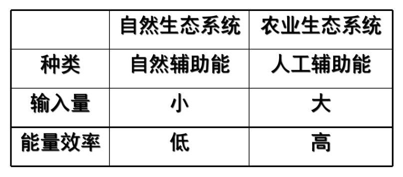
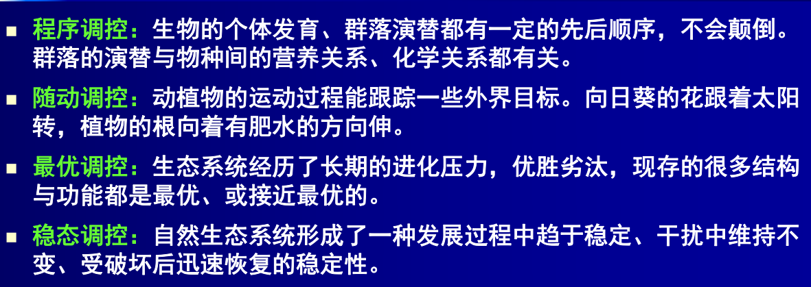
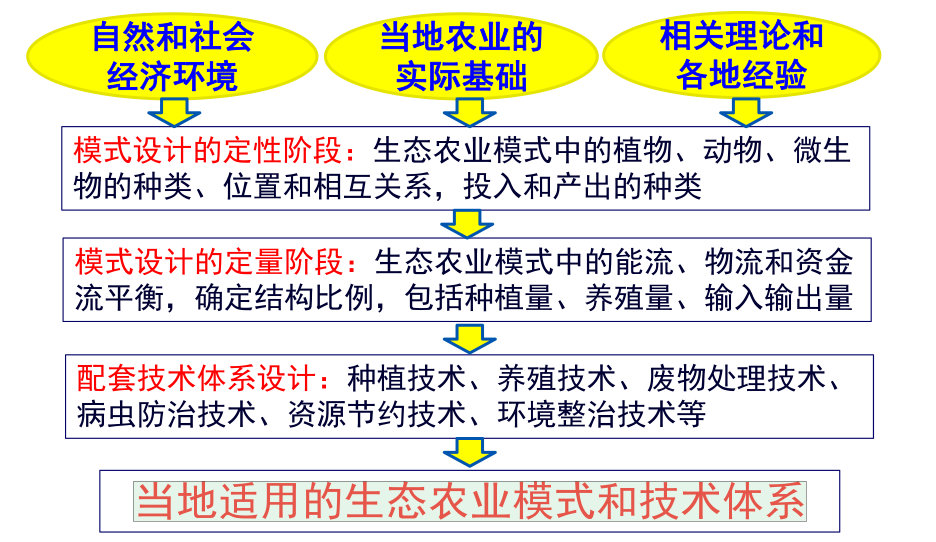

# 农业生态学

骆世明《农业生态学》

能值

## 第一章 绪论

### 一、农业生态学的发展基础

#### （一）农业生态学

1. **含义：**运用生态学和系统论的原理和方法，把**农业生物**与自然和社会**环境**作为一个整体，研究其中的**相互联系、协同演变、调节控制和持续发展规律**的学科。
   - 生态系统层次展开，侧重于生态系统水平上的规律
2. 发展基础：生态学及其相关学科
3. 发展动力：农业可持续发展
4. 地位作用：为农业的可持续发展

#### （二）生态学基础

1. **基本含义：研究生物与其环境相互关系的学科**。既古老又年轻

   - 生态学名词的提出：
     - **Reiter（1865）提出“Oikologie”，即英文“Ecology”**
     - Haeckl E.（1866）:Ecology为研究有机体与环境间相互关系的学科
   - 迅速发展
     - **Tansley（1935）：提出生态系统概念**
     - E.P. Odum（1956）：生态学是研究生态系统的结构与功能的学科
     - Hedgpm（1969）

   生态学是研究地球表面**生命系统、环境系统和社会系统**相互关系的学科，包括系统的结构、组成、功能、动态及其相互关系。
   
2. 发展阶段

   - 生态学知识累积阶段（1866年前）
   - 个体生态学与群落生态学时期（1866-1935）
   - 生态系统生态学时期（1935-1962）
   - 人与生物圈时期（生态调控与生态工程建设）（1962-）
     - Carson 《寂静的春天》

3. 学科体系

   （1）理论生态学

   （2）应用生态学

#### （三）可持续发展背景

1. 农业和农村可持续发展的社会现实需要促进农业生态学的发展
   - 社会效益
   - 经济效益
   - 生态效益
2. 农业生态学对农业和农村发展

#### （四）科学从还原论向整体论发展对农业生态学的影响

### 二、农业生态学的发展回顾

#### （一）国际

1. 20世纪70年代初步成型

#### （二）中国

1. 始于上世纪70年代末80年代初
2. 20世纪90年代生态农业建设得到国家的高度重视

#### （三）展望

### 三、农业生态系统的概念

#### （一）系统及系统特性

1. **含义**
2. 必备条件
   - 有两个以上组分
   - 组分之间有密切联系
   - 能以整体方式共同完成一定的功能
3. 结构
   - 系统的边界：区分系统内外的标志
   - 系统的层次
     - 自然生态系统的组织层次
     - 层次越低，组分间关系强度越大
     - 层次越低，行为频率越快
   - 系统组分的量比关系：组分的数量比例关系
   - 系统组分的空间关系：空间格局
4. 功能特点：整合特性，“整体大于部分之和”
   - 各组分的独立功能
   - 各组分间互作产生的新效应

#### （二）生态系统及其特点

1. **定义：生物间以及生物与其生存环境之间密切联系、相互作用，通过物质循环、能量转化、信息传递，成为占据一定空间、具有一定结构、执行一定功能的动态平衡整体，称为生态系统**
2. 基本组分
   - 生物组分：生产者、消费者、分解者
   - 环境组分：辐射，气体，水体，土体
3. **特点**
   - **区别于一般系统：**
     - **组成成分上：生物群落是生态系统的核心组分**
     - **空间结构上：具有明显的地域特征**
     - **时间变化上：具有从简单到复杂，低级到高级的演变规律**
     - **内部功能上：主要靠三大类群生物协调完成物质循环能量转化过程**
     - **外部环境上：开放系统。与外界不断进行物质能量的交换**
4. 类型
   - 环境性质
     - 陆地
     - 淡水
     - 海洋
   - 受人类干扰程度
     - 自然生态系统
       - 目前已无完整意义上的自然生态系统
     - 人工驯化的生态系统：农业
     - 人工生态系统：城市

#### （三）农业生态系统

1. **定义：以农业生物为主要组分、受人类调控、以农业生产为主要目的的生态系统**
2. 组成
   - 农业生物组分
     - 初级生产者：种植业、林业
     - 次级生产者：养殖业
     - 腐生生产者
     - 人
   - 农业环境组分
     - 自然环境
     - 人工环境
3. 类型
   - 生产项目：农田、林业、渔业、牧业、农林生态系统等
     - 利用农业生物来生产农产品的产业——农业
   - 所处位置：旱地、低洼地、庭院生态系统
   - 生产方式：刀耕火种、传统农业、石油农业生态系统
4. **特点**
   - **生物构成不同，组分单一**
   - **人工环境占重要地位**
   - **系统的稳定机制不同**
   - **系统开放程度不同：输入输出量大，开放程度高**
   - **系统的净生产率高**
   - **系统服从规律不同：受自然、社会、经济规律制约**
   - **系统运行目的不同**
5. 基本功能
   - 能量流
   - 物质流
   - 价值流
   - 信息流

#### （四）农业效益

1. 构成：社会效益、经济效益、生态效益
2. 相互关系：相互依赖，相互矛盾

### 四、农业生态学的任务及研究方法

#### （一）任务

1. **任务**
   - **揭示农业生态系统各种内外相互关系的规律**
   - **探讨最佳农业生态系统或生态农业模式**
   - **协调农业的社会效益、经济效益和生态效益**
   - **促进农业的可持续发展**
2. **研究对象：农业生态系统**

#### （二）研究内容

1. 基础性研究
2. 应用性研究

#### （三）与相关学科的关系

1. 土壤学、气象学
2. 作物学、动物学、微生物学、林学
3. 农业环境学
4. 农业经济学
5. 农业区划学
6. 耕作学

#### （四）基本研究方法

1. 熟悉研究对象
2. 研究数据的收集
3. 研究数据的分析整理
4. 研究策略
   - 多学科协作
   - 多系统大跨度对比
   - 用对象替换来赢得时间
   - 选择适当的研究单元
   - 把握合适的研究层次

## 第二章 农业的基本生态关系

### 一、个体生态学关系

#### （一）环境对生物的制约

1. **最小因子定律（Justus Liebig）：植物的生长取决于数量最不足的那一种营养元素。**

2. **耐受性定律：对具体生物来说，各种生态因子都存在着一个生物学的上限和下限（或称阀值），它们之间的幅度就是该种生物对某一生态因子的耐性范围（耐性限度）**。

   - 同一种生物对各种生态因子的耐受性范围不同
   - 不同种生物对同一生态因子耐性范围不同
   - 同一生物不同生长发育阶段对生态因子的耐受范围不同
   - 生态因子相互作用
   - 同一生物种的不同品种，生活环境不同，生态型分化

3. 生活型和生境

   （1）**生活型**

   - 趋同适应→生活型
   - **不同种生物长期生存在相同的环境中，发生趋同适应，经过自然选择和人工选择形成具有类似形态、生理和生态特性的物种类群称为生活型**。
   - 种以上分类单位

   （2）**生境**

   - **在环境条件制约下，具有特定生态特性的生物种和生物群落生存的特定小区域**

#### （二）生物对自然环境的适应

1. **生态型**
   - 趋异适应→生态型
   - **同种生物的不同个体群，长期生存在不同的条件下，会发生趋异适应。经自然选择和人为选择而分化形成的生态、形态和生理特性不同的可以遗传的类群，称为生态型。**
   - **种以下的分类单位**
   - 生态型类型
     - 气候生态型：长期适应不同的光周期、气温和降水等气候因子而形成的（**早、中、晚稻**属光照生态型；**籼、粳稻**属温度生态型）
       - 早稻温度，晚稻光照，中稻基本营养生长期
     - 土壤生态型：长期在不同的土壤水分、温度和肥力等自然和栽培条件的作用下分化形成的（**水、陆稻**；作物的耐重金属类型）
     - 生物生态型：在生物因子作用下形成的（抗病虫草，水田稗草和旱地稗草——植物间竞争）
2. 生态位niche
   - **生物完成其正常生活周期所表现的对特定生态因子的综合适应位置**
     - 空间生态位：一个种或亚种所占据的基本空间
     - 营养生态位：一个种在生物环境中的地位及其与食物和天敌的关系
     - 基础生态位/多维超体积生态位：由允许某一物种生存和繁殖的各环境变量确定的一个n维超体积
     - 现实生态位：在某一生物的基础生态位中该生物实际占领的生态位

#### （三）生物对自然环境的影响

森林的生态效应

### 二、种群

**种群：指在某一特定时间占据某一特定空间的一群同种生物的集合体。**

#### （一）种群结构

1. 大小和密度
   - 种群大小：一定面积或容积内某个种群的个体数
   - 种群密度：单位面积或容积内某个种群的个体总数
     - 粗密度：单位空间内某个种的实际个体数量（或生物量），又称天然密度
     - **生态密度：单位栖息空间内某个种群的个体数量（或生物量）。又称经济密度**
     - 农业生产中，生态密度更有指导意义
2. 年龄结构和性比
   - 年龄结构：各个年龄级占比
     - 年龄锥体（金字塔）：增长型、稳定型、衰退型
   - 性比：雄性对雌性
3. 出生率和死亡率
   - 绝对出生率和相对出生率
   - 生理出生率和生态出生率
   - 绝对死亡率和死亡比例
   - 生理死亡率和生态死亡率
4. 内禀增长率与环境容纳量
   - **内禀增长率：在环境条件没有限制性影响下，由种群内在因素决定的、稳定的最大相对增殖速度（rm）**
     - 决定于：
       - 年龄组成
       - 各年龄群的特殊增长率
   - **环境容纳量：在一生态系统中，有限的环境条件下种群能达到的稳定的最大数量**
     - 决定于
       - 光、温、水、养分等因子或食物、空间等资源所构成的环境
       - 食性、行为、适应能力等种群的遗传特性
5. 空间分布和阿利氏原则
   - 类型：随机分布、均匀分布、集群分布
   - 判断：分散度（方差）；空间分布指数（方差和均数）
   - **阿利氏原则：每个生物都有自己最适的密度，过疏或过密都会产生限制影响。种群总是避免过分的分散和过分拥挤，使种群内个体能获得最佳的生活和生存条件**

#### （二）种群动态

1. 生命表和生命曲线

   - 生命表：用来综合评定种群各年龄组的死亡率和寿命的表
   - 生命曲线
     - 以相对年龄为横坐标，存活数的对数值为纵坐标绘制的存活曲线
     - A、B、C型

2. **种群的增长型**

   - 指数增长：无环境限制条件

     - 世代分离

       - $$
         N_t=N_0λ^t
         $$

         

     - 世代重叠

       - $$
         N_t=N_0e^{rt}
         $$

       - $$
         \frac{dN}{dt}=rN
         $$

         

   - Logistic增长：环境条件制约

     - $$
       \frac{dN}{dt}=rN(\frac{K-N}{K})
       $$

#### （三）种群间相互关系

1. **负相互作用**
   - **竞争**
     - **干扰竞争：指一种生物借助行为排斥另一种生物，使其得不到资源**
     - **利用竞争：两种生物同时竞争利用同一种资源**
   - **捕食**
     - **传统捕食**
     - **植食**
     - **同种相残**
     - **拟寄生**
   - **寄生：一个物种从另一个物种的体液、组织或已消化物质获取营养并对宿主造成危害**
   - **偏害作用：化感**
2. **正相互作用**
   - **偏利共生：长期和暂时。附生植物、筑巢**
   - **原始合作：相互作用的两个种群均有利，但不发生依赖关系**
     - **蟹与腔肠动物的结合**
     - **作物的间作**
   - **互利共生：两个生物种群生活在一起，相互依赖，互相得益** 
     - **豆科植物与根瘤菌**

#### （四）次生代谢产物在种间关系中的作用

1. **化感作用：植物通过向环境释放化学物质，对周围其他植物（包括微生物）产生直接或间接的作用**

2. 化感物质

3. 释放途径：

   - 淋洗
   - 根系分泌
   - 挥发
   - 植物残体或凋落物分解

4. 植物间的化感作用

   - 产生克生物质
   - 产生自体毒性物质
   - 产生产生刺激促进又有抑制效应的物质

5. 作物的化感作用

   - 对杂草
   - 作物自毒作用
     - 茄、黄瓜、大豆

6. 杂草的化感作用

   - 杂草对作物

7. 化感作用在农业上的应用

   （1）作物秸秆还田技术的改进

   - 秸秆还田中化感作用的抑制效应
   - 秸秆还田中化感作用的有益效应
   - 秸秆还田中化感作用的合理应用
     - 适时、适量、有选择地进行秸秆还田以及运用其他的管理措施
     - 研究和开发作物秸秆的化感作用

   
   （2）建立合理的栽培技术和耕作制度

   - 合理利用轮作制度
   - 合理种植伴生植物，探索新的栽培措施
   
   （3）开发新一代无公害农药和植物生长调节剂

#### （五）种群的生活史对策

1. 生态对策：为适应环境而朝不同方向进化的对策

2. **基本类型：r-对策和K-对策**

   

#### （六）种群的调节

1. 种群调节作用：当种群数量偏离平衡水平上升或下降时，有一种使种群数量返回平衡水平的作用。一定的稳定性
2. 影响因素
   - 密度制约因素
   - 非密度制约因素
3. **密度制约**
   - **良好环境条件下种群数量变化的主要原因**
     - **种内调节**
       - **种内个体间竞争食物、空间**
       - **生理调节**
     - **种间牵制**
       - **捕食、寄生和种间竞争共同资源**
4. **非密度制约**
   - **非生物因子：气候因素、污染物、化学因素**
   - **恶劣或不太适宜的环境条件下**
5. 种群调节理论
   - 气候学派：受天气条件的强烈影响
   - 生物学派：主张捕食、寄生、竞争等生物过程对种群调节起决定作用
   - 食物因素
   - 自动调节学说：重点放在动物种群内部
     - 行为调节
     - 内分泌调节
     - 遗传调节
       - 低密度型：数量低时占优势。进攻性低，繁殖力高，有留居倾向
       - 高密度型：数量高时占优势，进攻性高，繁殖力低，有外迁倾向

### 三、群落

**群落：同一区域内生物种群的集合**

#### （一）基本特征

1. **具有一定的种类组成**
2. **具有一定的结构**
3. **具有一定的动态特征**
4. **不同物种之间存在相互影响**
5. **具有一定的分布范围**
6. **形成一定的群落环境**
7. **具有特定的群落边界特征**

#### （二）群落的结构

1. 水平结构

   （1）概念：在水平方向上的配置状况或水平格局

   （2）产生原因：

   - 环境的异质性
   - 亲代的扩散分布习性
   - 种间相互作用
   - 人及动物的干扰

   （3）**农业生态系统的水平结构：农、林、牧、渔以及各业内部的面积比例及其格局**

   （4）控制农业生态系统的水平结构的基本方式

   - 因地制宜选择合适物种
   - 最佳密度，管理控制密度

2. 垂直结构

   （1）概念：主要指群落成层现象

   （2）表现形式：

   - 不同类型群落在海拔高度不同的生境中的垂直分布
   - 同一群落内部不同类型物种及不同个体的垂直分层

3. 时间结构

   （1）概念：**环境因子的时间节律变化引起群落组成和结构规律变化**

   - 周期性变化
   - 群落演替

4. 群落的交错区与边缘效应

   （1）概念

   - 交错区：群落或生态系统之间的过渡区域
   - **边缘效应：由于交错区生境条件的特殊性、异质性和不稳定性，交错区具有聚集毗邻群落生物，增大物种多样性和种群密度，增大某些物种的活动强度和生产力的效应**

#### （三）群落的演替

1. 自然群落演替

   （1）**概念：群落组成及其环境随时间向一定方向有顺序的发展变化**

   （2）标志：群落组成发生质变（优势种或全部种类的变化）

   （3）类型：**原生演替（在从未有过的生物的裸地上开始的演替）和次生演替（在原有生物群落被破坏的地段上进行的演替）**

   （4）**演替系列：演替各阶段由一种类型转变成另一种类型的整个取代顺序**

   （5）**顶极群落：生物群落通过复杂的发展演替，最后达到与周围物理环境处于相对平衡的稳定的群落**

   - 单元顶极理论
   - 多元顶极理论
   - 顶极-格局理论

2. **演替的趋势**

   **（1）种类变换**

   - **K对策取代r对策**
   - **数目增多**
   - **分层明显**
   - **食物和生物场所增加**
   - **食物链关系变复杂，形成食物网**

   **（2）总生物量增多**

   **（3）可溶性物质聚集**

   **（4）营养物质循环的封闭程度增大**

   **（5）稳定性提高**

3. 利用群落演替原理建造农业群落

   （1）建立包括多年生木本植物的混交群落

   （2）模仿自然顶极的人工群落

   （3）利用和仿照自然演替过程建造农业生态系统

   - 养地作物

#### （四）协同进化

1. **概念：指在种间相互作用的影响下，不同种生物间相关性状在进化中得以形成和加强的过程。相互适应、相互作用的共同进化**

### 五、景观生态关系

**景观：指一定空间范围内，由不同生态系统所组成的，具有重复性格局的异质性地域单元**

**景观生态学：是研究在一个由许多不同生态系统所组成的区域内(即景观)不同类型生态系统的空间格局及其相互作用过程的综合性学科。**

景观要素的类型：

- **斑块：泛指与周围环境在外貌或性质上不同，但又具有一定内部均质性的空间部分**
- **廊道：指景观中与相邻两边环境不同、具有通道或屏障功能的线状或带状的景观要素，是联系斑块的重要桥梁和纽带。**
- **基底：指景观中分布最广、连续性最大的背景结构。**

景观功能

主要理论：

- 岛屿生物地理学理论
  - 距离效应
  - 面积效应
- 等级理论与尺度效应
- 自组织系统
- **边缘效应理论**
  - **斑块边缘部分由于受相邻斑块和周围环境的影响而表现出与斑块中心部分不同的生态学特征的现象**

## 第三章 农业生态系统的结构

生态系统的结构：**生态系统组分的时空配置及组分间能物流的顺序关系**

物种结构：物种结构（多物种配置）

空间结构（多层次配置）：水平结构、垂直结构

时间结构（时间排序）

营养结构/食物链结构（物质多级循环)

生物组分与环境组分构成的格局

### 一、农业生态系统的物种结构

**物种结构，又称组分结构：是指农业生态系统或模式内农业生物种类的组成、数量及其相互关系**

#### （一）物种结构的设计原则

1. 以一种生物为主的原则

2. 正确分析竞争与互补关系

3. 增加初级生产者，提高光能利用率

4. 注意社会经济因素

#### （二）农林牧渔各业相结合的组分结构

种植业结构：不同作物

农业结构：农林牧渔

农村产业结构：一二三产

1. 种植业与养殖业相结合的组分结构
   - 饲草生产技术
   - 以作物产品为原料的配合饲料生产技术
   - 作物秸秆喂饲动物
   - 动物粪便肥田
2. 种植业与林业相结合的组分结构
   - 农林间作
   - 林药间作
3. 种植业与渔业相结合的组分结构
   - 基塘系统模式
   - 稻鱼共生
   - 水产池塘“水稻-水产”种养耦合
4. 养殖业（畜牧业）与渔业相结合的组分结构
   - 鱼塘养鸭技术
   - 塘边养猪技术
   - 鲜禽粪

#### （三）大农业的组分结构

大农业是种植业、林业、牧业、渔业及其延伸的农产品加工业、农产品贸易与服务业等密切联系协同作用的耦合体。

围山转，农牧能商、农渔能商

### 二、农业生态系统的水平结构

**水平结构：在一定生态区域内，各种生物种群所占面积比例、镶嵌形式、聚集方式等水平分布特征**

#### （一）景观多样性与农业生态系统的水平结构

1. 景观多样性：指生物圈内栖息地、生物群落和生态学过程的多样化
2. 生态交错带与边缘效应
   - **交错带：景观中不同斑块连接之处的交错区域** 
   - **边缘效应：交错带中表现出的两个斑块间能量、物质和信息交换频繁，生物种类繁多，生产力高等方面的效应。**

#### （二）农业生态系统水平结构影响因素

1. 影响因素

   （1）自然环境条件

   （2）农业区位

   - 自然区位
   - 农业经济区位
   - 生态经济区位

   （3）社会经济条件

   - 人口密度梯度
   - 城乡经济梯度

2. 自然条件引起的农业生态系统水平结构

   （1）温湿度

   （2）地貌类型

3. 农业区位引起的农业生态系统水平结构

   （1）自然区位：自然条件差异

   （2）农业经济区位：运输限制

   - 生产集约理论
   - 生产结构理论

   （3）生态经济区位：自然资源，专业化生产区域

### 三、农业生态系统的垂直结构

**垂直结构：农业生物之间在空间垂直方向上的配置组合**

**农田立体模式：农作物间作、稻田养鱼、稻萍鱼、农田养菇**

水体立体模式：鱼的分层放养，鱼牧结构

坡地立体模式

养殖业立体模式：分层立体养殖

农林系统：指在同一土地单元内将农作物生产与林业和畜牧业生产同时或交替地结合起来，使得土地总生产力得以提高的持续性土地经营系统。复合性、系统性、集约性。

### 四、农业生态系统的营养结构

#### （一）食物链

1. **生态系统中生物成员间通过吃与被吃（食物营养关系）联系起来的序列**
2. **类型：**
   - **捕食食物链：以直接消费活有机体或其组织为特点**
   - **腐食食物链：以取食死有机体或生物排泄物为特点**
   - **寄生食物链：以寄生方式取食活的生物有机体**
   - **混合食物链：既有活食性生物又有腐食性生物成员**

#### （二）食物网

1. **多条食物链交错相联组成的网络结构**

#### （三）食物链结构类型

1. **以营养为纽带，把生物与环境、生物与生物紧密联系起来的结构**（生态系统的营养结构）
2. 类型
   - 以养殖业为主的类型
   - 种植业和养殖业相结合的类型
   - 种植业和渔业相结合的类型
   - 渔业和畜牧业相结合的类型

#### （五）食物加环和解链

1. **食物链加环**

   **（1）作用**

   - **提高农业生态系统的稳定性**
   - **提高农副产品的利用率**
   - **提高能量利用率和转化率**

   **（2）加环类型**

   - **生产环：如在传统的种植业生产中，加上动物饲养**
   - **增益环：增环的本身转化产品并不直接为人类需求，而是加大了生产环的效益（养蚯蚓、蝇蛆作鸡饲料）**
   - **减耗环：减少生产耗损，增加系统生产力**
   - **复合环：增加具有两种以上功能的环（稻田养鱼、养鸭，养蜂）**
   - **加工环：农产品初加工、深加工及农工商结合**

2. 食物链解列

   （1）**概念：有毒物质在食物链上富集到一定程度后，将其从食物链中除去**

   （2）应用：污染土壤处理（种植植物富集）；污水处理（水生植物）

### 五、农业生态系统的时间结构

#### （一）作物套作

#### （二）轮作、轮养

#### （三）农业生产模式的演替

#### （四）退化生态系统的恢复过程

恢复生态系统合理的结构、高效的功能和协调的关系

## 第四章 农业生态系统的功能——能量流动

### 一、生态系统的能流

#### （一）能量来源

1. 太阳能

2. **辅助能**

   **（1）自然辅助能**

   **（2）人工辅助能：**

   - **生物辅助能：人力、畜力、有机肥、饲料、种子**
   - **工业辅助能**
     - **直接工业辅助能：燃料、电力**
     - **间接工业辅助能：机械、化肥、农（兽）药、农用薄膜等**

#### （二）遵循规律

1. 热力学第一定律
2. 热力学第二定律
3. 熵与熵增原理
4. 普里高津的耗散结构理论
   - 低熵状态，需要从系统外输入能量，即不断输入太阳能和辅助能，克服熵增

#### （三）能流途径

**生态效率：**

- 营养级内：
  - 组织增长率：生产量与同化量之比
  - 同化效率：同化量与摄食量之比
  - 生态增长率：生产量与摄食量之比
  - 维持价：生产量与呼吸量之比
- 营养级间：
  - 摄食效率：上一营养级摄食量与该级营养级摄食量之比。
  - 同化效率：上一营养级同化量与该级营养级同化量之比。
  - 生产效率：上一营养级生产量与该级营养级生产量之比。
  - 利用效率：上一营养级同化量与该级营养级生产量之比
  - **林德曼效率（能量转化效率）：**某一营养级所固定的能量与前一营养级所持有的能量之比。十分之一定律

**生态金字塔：营养级由低到高，其个体数目、生物量、所含能量一般呈现出下大上小的塔形分布。**

- 个体数金字塔
- 生物量金字塔
- 能量金字塔

#### （四）能流分析方法与能流图

实际、统计、输入输出、过程分析

能流图

**能值分析：**

- **能值：某种类别能量转化形成过程所需要的另一种类别能量之量称为该能的能值。**
- 太阳能值：任何能量追朔到初期所需要的太阳能之量

### 二、农业生态系统的辅助能

#### （一）农业的辅助能

自然辅助能和人工辅助能

#### （二）作用

1. **改善农业生态系统中的生态限制因子**
2. **改善农业生态系统机能**
3. **提高农业生产力**

#### （三）不同类型生态系统辅助能的特点与能量效率

#### （四）高辅助能投入“石油农业”的困境

1. 过度依赖化石燃料
2. 农产品中有害化学物质的残留
3. 环境破坏
4. 农区生物多样性减少，农业生态系统服务功能削弱

### 三、初级生产中的能流

#### （一）初级生产中的能量平衡关系

#### （二）初级生产的能量效率与生产力比较

1. 不同种类植物的光合能力差异较大
2. 同种植物不同生态型品种光合能力差异较大
3. 同一生态型品种不同群体结构光合能力差异较大

#### （三）地球主要生态系统的初级生产力

**光能、光温、气候、土地生产潜力**

#### （四）初级生产力的改善方向

**环境，良种，良法，群体结构**

1. **因地制宜，增加绿色植被覆盖**
2. **保护改善环境，消除或减缓限制因子制约**
3. **选育高光效抗逆良种**
4. **改进耕作制度。提高复种指数，提高栽培管理技术**
5. **调控作物群体结构。尽早形成并尽量维持最佳的群体结构**

### 四、次级生产中的能量流动

#### （一）次级生产的能量平衡

P=NI+I=NI+A+（R1+R2+R3）+F+U+G

#### （二）次级生产的地位和作用

1. **转化农副产品，提高利用价值**
2. **生产动物蛋白质，改善膳食结构，提高人民生活水平**
3. **促进物质循环，增强生态系统功能**
4. **种养结合，农牧互促，合理利用农业资源**
5. **增加就业门路，增加农民收入**
6. **有助于建立种--养--加--贸一体化的农业产业化体系**

#### （三）次级生产的能量转化效率

次级生产的能量效率因生产者的种类和生态型不同而不同

#### （四）次级生产力的制约和改善方向

品种、饲料营养、养殖技术、管理水平

**调整结构、品种改良、集约养殖、综合养殖……**

1. **调整种植业结构，建立“粮、经、饲”三元体系，扩大饲料来源；**
2. **培育、改良、推广优良畜禽渔品种；**
3. **适度集约养殖，加强畜禽渔环境建设及设施工程建设，减少维持能和其他消耗；**
4. **推广鱼畜禽结合、种养加配套的综合养殖模式，充分利用各种农副产品和废弃物**
5. **发展草食动物；充分利用水面发展水生生物；发展腐生食物链生产；发展沼气和堆肥；混合养殖、多级利用**

**初级生产是指自养生物利用无机环境中的能量进行同化作用，在生态系统中首次把环境中的能量转化成有机体化学能，并储存起来的过程。**

**次级生产是指异养生物的生产，也就是生态系统消费者、分解者利用初级生产量进行同化、生长发育、繁殖后代的过程。**

## 第五章 农业生态系统的功能——物流

### 一、生态系统物流的一般特点

#### （一）生命与元素

1. 高等植物必需营养元素
   - 大量元素
   - 微量元素

#### （二）物质循环的库与流

1. **库：物质在循环过程中被暂时固定、贮存的场所。生态系统中的各个组分都是物质循环的库。**
- 贮存库：一般为非生物成分。容积大
   
- 交换库：一般为生物成分

2. **物质流：库与库之间物质的转移运行**

#### （三）物质流动的特征

1. 生物量与现存量
   - **某地特定时刻单位面积或单位体积内积存的有机物质总量。也称现存量。**
   - 生产量=现存量+损失量
2. 周转率与周转期
   - 周转率（R）=（系统达到稳定状态时）单位时间内某组分流进F1（或流出Fo）的物质量/该组分的物质贮存量（库存量）（S）
   - 周转期（T）=1/R
3. 循环效率
   - 循环效率（Ec）=循环物质（Fc）/总输入物质（F）

#### （四）物质循环的基本类型

1. 生物地球化学循环

   （1）地质大循环

   （2）生物小循环

2. **基本类型**

   **（1）水循环：水圈为主要贮藏库**

   **（2）气体循环：大气圈为主要贮藏库**

   **（3）沉积物循环：岩石圈与土壤圈为主要贮藏库**

#### （五）研究主要领域

1. 水分循环与管理
2. 温室效应气体
3. 养分循环与管理
4. 污染物的迁移转化与控制

### 二、水循环与节水

#### （一）水循环的库存和流动特点

#### （二）人类对水循环的影响和水资源危机

1. 影响
   - 植被破坏：水土流失、下游季节性旱涝
   - 围湖造田，排干沼泽、冬水田、低湿地
   - 城镇建设硬质化地面
   - 截流、蓄水、引水、灌溉工程
   - 过度开采地表与地下水
   - 巨大的生产、生活用水，大量的生产、生活污水排放
2. 危机：供需矛盾；污染；利用方式粗放，浪费；水生态环境安全威胁

#### （三）农田生态系统的水分平衡

#### （四）农业生态系统的水分管理

1. 植树造林
2. 工程节水
3. **节水农业**
   - **抗旱品种，合理布局**
   - **节水型种植方式：间作、套种、少免耕、喷灌**
   - **地面覆盖：生物覆盖、沙砾覆盖、化学覆盖**
4. 防治水体污染
5. 管理节水

### 三、碳流动

#### （一）自然界的碳循环

碳的生物小循环层次：细胞、个体、食物链

碳的地质大循环：动物有机体、二氧化碳与水反应

#### （二）农业生态系统中的碳素流动

1. 通过作物光合作用从大气流向作物；
2. 通过凋落、收获归还及根系分泌物、脱落物从作物流向土壤
3. 沿食物链流向人体与动物，并通过排泄及遗体等形式流向环境
4. 通过人为作用以肥料形式流向土壤
5. 通过微生物分解作用从土壤流向大气
6. 通过收获物从农业生态系统流向其它系统

#### （三）人类活动对碳循环的干扰

1. 对大气二氧化碳浓度的干扰
   - 燃烧矿物燃料：岩石圈有机碳消耗
   - 砍伐森林：减弱生物圈同化二氧化碳能力
2. 对大气甲烷含量的影响
   - 来源：沼泽、稻田、反刍牲畜、白蚁
3. 温室效应对农业生态系统的可能影响
   - 直接影响：CO2浓度增加，温度增加，降水，海平面上升
   - 间接影响：农业投资增加（水利、化肥农药、土地生产力建设）
4. **温室效应对农业的影响**
   - **产量：总体减产**
   - **品质：C/N比升高**
   - **施肥量**
   - **病虫草害**
   - **耕作制度：多熟面积**
   - **畜牧业**

### 四、氮磷钾流动

#### （一）氮流动

**推广包括生物固氮的耕作制度：禾豆间作、绿肥、应用根瘤菌肥**

**加强农业生态系统中的氮素循环利用：秸秆还田、动物排泄物还田、制沼气、种养结合**

**推广应用环境友好的新型肥料：缓（控）释肥**

**改进氮肥施用技术：因地、因作物施肥；平衡施肥；测土施肥；氮肥深施；使用硝化抑制剂；叶面喷施；适期使用；合理灌溉**

#### **（二）磷流动**

**推广应用新型高效磷肥**

**采用磷肥高效施用技术与方法**

- **因土、因作物施用**
- **配施N、K，配施有机肥、配施微肥适期施用**
- **集中施用、分层施用、根外喷施粉碎施用**
- **避免与碱性肥料混施**

**选育与推广应用磷肥高效利用的作物品种**

**加强农业生态系统内的磷素循环**

#### **（三）钾流动**

**秸秆还田**

**施用有机肥**

**耕作使难溶钾有效化**

**合理使用化学钾肥**

#### （四）硫流动

### 五、农业生态系统中的养分循环

#### （一）农业生态系统养分循环的特点

1. **养分输出率和输入率高**
2. **养分库存量小，流量大、周转快**
3. **养分保持能力弱，易流失**
4. **养分供求同步性差**

#### （二）土壤有机质与农田养分循环

1. 有机质的作用
   - 提供各种养分
   - 为土壤微生物提供生活物质
   - 吸附阳离子，增加土壤阳离子交换量
2. 土壤有机质来源
   - 作物残体
   - 人畜排泄物
   - 土壤微生物

#### （三）农业生态系统养分循环的调节

1. **基本原则**
   - **合理输入**
   - **建立养分再生机制**
   - **强调养分保蓄、供求同步**
   - **充实有机库存**
   - **提高投入效率**
   - **整体优化**
2. **调节途径**
   - **合理搭配种植归还率高的作物**
   - **实行合理轮作**
   - **建立良性循环体系**
   - **区域性养分富集**
   - **系统外的输入补给**

### 六、污染物的流动和积累

**生物放大作用：有毒物质沿食物链各营养级传递时，在生物体内的残留浓度不断升高，愈是上面的营养级，体内有毒物质的残留浓度愈高的现象**

农业面源污染

- **特点**

  - **形成过程具有随机性**
  - **影响因子多**
  - **时空不确定性：范围广、分散、不均匀**
  - **不易监测**

- 种类

  - 化肥污染

  - 农药污染：立法管理；无公害农药和生物农药；综合防治；改进农药剂型及喷洒技术；修复土壤
  
  
    - 畜禽粪便污染：
  
      - 氮磷污染；恶臭污染；生物污染；饲料添加剂与兽药污染
  
      - 处理方式：肥料；饲料；培养基；能源；异位生物发酵
  

工业源污染

- 重金属污染：重金属超积累植物
- **持久性有机污染物POP：持久存在于环境中，通过长距离传输和食物链积聚，对人类健康及环境造成不利影响的化学物质。**杀虫剂、工业化学品、副产物
  - 持久性
  - 生物积累性
  - 迁移性
  - 生物毒性

### 农业生态系统物质循环的特点
与自然生态系统相比，农业生态系统的物质循环带有许多人工调控的特色。

1. 能量和物质的输入与输出量大而且比较迅速。
2. 能量流动和物质循环不单发生于“生物-环境”系统中，而是进行于“生物—环境一社会”系统之中，途径多，变化大。
3. 可改变物质原有的自然循环过程。

## 第6章 农业生态系统的信息流与资金流

### 一、信息流

信息系统的构成：信源+信道+信宿

#### （一）自然信息流

1. 环境与动植物的信息联系
   - 日照时间长短
   - 月亮和恒星的位置
   - 地球的磁场和重力
   - 阳光与植物
2. 植物与植物——次生代谢物
3. 植物与动物——色香味
4. 动物与动物——领域行为，蜜蜂舞蹈语言

#### （二）人工信息流

1. 人工仿自然信息：人工光源、人工合成信息素
2. 人工采集和生长的信息：根据长势长相判断栽培措施；灯光诱杀害虫；气象卫星进行气象预报
3. 社会信息：利用广播、电视、邮电、出版物等进行信息的传递等

#### （三）自然信息流和人工信息流的特点

### 二、资金流

**资金流与能物流的关系：偶联关系；独立关系**

能物流与资金流相分离，容易产生经济外部性。

经济外部性：

- **成本外摊：生产过程中消耗的自然资源成本和利用的自然环境成本没有在系统成本核算中得到反映的现象**
  - **导致生产规模超过最适规模**
- **收益外泄：生产过程增殖的自然资源、改善的自然环境系统在经济核算中没有得到反映的现象**
  - **导致生产规模小于最适规模**

资源经济外部性的解决途径：行政（确定资源的所有权和使用权，使外部问题内部化）、立法、教育、经济

高斯理论：通过产权的确定可以使经济的外部问题内部化。前提是交易成本足够低。

### 三、农业生态系统的调节控制特点

**兼有中心式调控和非中心式调控**

**具有层次性：自然调控，人工直接调控、社会间接调控**

**非中心式调控：没有固定信息通道、没有信息处理和传输中心的分散信息网**

**中心式调控：信息专用通道、信息集中处理、控制指令根据目标和实际的差距制定和传输**

#### （一）自然调控

1. **程序调控**

2. **随动调控**

3. **最优调控**

4. **稳态调控：**负反馈作用。**功能组分冗余（在一个系统中，具有同一功能的组分数量超过必须的数量，处于备用状态）**

   

#### （二）人工调控

1. **经营者的直接调控**

   **（1）生境调控**

   **（2）输入输出调控**

   **（3）农业生物调控**

   - **个体**：品种
   - **种群**：栽培，群体结构
   - **群落**：垂直结构、水平结构、时间结构、食物链结构，复种混养混交

   **（4）系统结构调控：数量、空间、时间**

2. **社会间接调控**

   **（1）财贸、金融系统**

   **（2）工交通讯系统**

   **（3）科技文教系统**

   **（4）政法管理系统**

## 第8章 农业发展的生态关系

### 一、生态环境对农业起源与农业文明的影响

**多样化环境促进农业的起源**

**单调的环境限制农业的发展**

**生态环境与古农业社会文明的消亡**

### 二、农业发展阶段和生态农业方向

#### （一）农业发展的历史阶段

1. 刀耕火种阶段
2. 传统农业阶段
3. 工业化农业阶段

传统农业——铁器农具的出现

近代农业（工业化农业）：良种化、化学化、机械化

现代农业：智能化、机械化生产工具

### 三、世界各国对未来农业的探索

替代农业模型：

- 回归型农业
- 替代型农业
- 持续性农业

可持续发展：可持续发展是在满足当代人需要的同时，不损害后代人满足其自身需要的发展

**自然农业：不干预，与自然合作、而不是“征服”自然的道路，是人的一种自然生活方式。**

**生态农业：建立和管理生态上能够自我维持，低输入，经济上有生命力的农业**

**有机农业：遵循可持续发展原则，按照有机农业基本标准，建立和恢复农业生态系统的生物多样性和良性循环**

**可持续农业：管理和保护自然资源基础，调整技术和机制变化的方向，以确保获得并持续地满足目前和今后世世代代人们的需要。**

### 四、中国的传统农业

#### （一）中国精耕细作农业形成发展的阶段

1. 萌芽期：夏、商、西周、春秋。
2. 成型期：战国、秦汉魏晋南北朝
3. 扩展期：隋、唐、宋、辽、金、元
4. 深入发展期：明、清

中国传统农业的精华—“精耕细”作的内涵

- 集约的土地利用方式
- 改善农业环境和提高农业生物生产力
- “三才”理论—精耕细作的指导思想
  - 天、地、人“三才”
  - **因时、因地、因物制宜的“三宜”论**

#### （二）我国传统农业的经验

1. **传统农业的地力和养分维持机制**
   - **农业内部物质的循环**
   - **外部物质的收集利用**
   - **绿肥生产与利用**
   - **用地养地结合的耕作制度**
   - **粪肥循环利用**
2. **传统农业的有害生物控制技术**
   - **虫害**
   - **病害**
   - **草害**
   - **鼠害、鸟害**
3. **哲学思想和系统构建**
   - **三才、三宜**
     - **“天、地、人”的和谐、统一思想**
     - **“因地制宜，因时制宜，因物制宜”**
   - **保护自然资源的思想**
   - **构建农业生态系统的实践**

#### （三）对农业发展的启示

1. 未来农业与传统农业的共同基础
   - 受到投入资源的制约
   - 不简单依赖化肥农药
   - 注重农业的长远效益
2. **借鉴与发扬**
   - **实施就地保护**
   - **广泛收集整理经验**
   - **有效性的严格筛选**
   - **深入的作用机理研究**
   - **系统的适应性研究**
   - **科学改进和推广应用**

### 五、我国未来农业道路的选择

面临的挑战，农业发展成就巨大，挑战严峻，发展不平衡

#### （二）我国生态农业及其发展

1. 生态农业：整体、协调、循环、再生原则；高产、优质、高效、可持续发展

   **中国生态农业（Chinese Ecological Agriculture）是把农业生产、农村经济发展和生态环境治理与保护、资源培育和高效利用融为一体的新型综合农业体系。其本质是把农业生产纳入生态合理的轨道，寻求经济增长与资源环境保护的协调、同步发展，在农业生产和农村经济增长的同时，保护和改善农业生态环境。**

2. 主要特征

3. 发展阶段

4. 现状

**在措施上，强调因地制宜地建立有多种产业部门的大农业结构；强调通过人工设计的生态工程实现生产过程的资源深度开发、环境保护、生态调节和生态循环；强调采用节能、节地、节水、节省资源投入、用养结合的保护性技术措施，提高生产效益。增强生产后劲。**

## 第10章 生态农业的模式和技术体系

### 一、生态农业模式与技术体系概述

#### （一）三个层次

1. 宏观：区域和景观水平，开展生态规划
2. 中观：生态系统范围内，建立循环系统
3. 微观：群落和种群及以下水平，利用物种多样性重建农业生态系统的生物多样性格局

#### （二）模式和技术体系

1. **生态农业模式：生态农业实践中经常使用的、相对稳定的农业生态系统结构形式**
2. **生态农业技术体系：推动生态农业模式运行、相互关联的多个技术的集成**

#### （三）生态农业模式确定的步骤与方法

**依据自然和社会经济环境、当地农业的实际基础、相关理论和各地经验；**

**模式设计的定性阶段**

**模式设计的定量阶段**

**配套技术体系设计**

**得到当地适用的生态农业模式和技术体系**

****

#### （四）生态农业技术

1. 常用技术
   - 多维用地技术
   - 物质能量多级利用及有机废弃物转化再生技术
   - 物质良性循环技术
   - 有害生物综合防治技术
   - 生物能及再生能源的开发利用技术
   - 生产自净技术：沼气，污水
2. 农业技术的生态化改造
   - 肥料、农药、薄膜的生态化改造
   - 基因工程与生物安全
   - 精确农业技术体系

单项农业技术间的关系：依赖、互补、相容、减效、排斥

### 二、缓解生态制约的模式与技术体系

#### （一）缓解干旱

1. 集水农业模式
2. 节水农业技术

#### （二）缓解盐碱

黄淮海治碱模式

#### （三）缓解水土流失

水土保持模式、小流域模式、退耕还林模式、生态恢复模式

#### （四）缓解风蚀和台风

防风固沙、防风林模式

### 三、循环模式

农田、农牧、农村、城乡、全球

#### （一）农田内

- 秸秆利用
- 间套轮作
- 田内养殖

#### （二）种养之间

- 畜禽粪便综合利用
- 秸秆综合利用

#### （三）农业与企业间形成的循环模式

#### （四）城乡之间

工业废物、城市垃圾

### 四、减少对农用化学物质依赖

#### （一）养分供应的模式与技术体系

1. 养分平衡有关的生态农业模式
   - 粮—豆轮作模式
   - 稻菇综合利用模式
   - 作物—食用菌—禽（畜）循环模式
   - 以沼气为纽带的复合系统模式
2. 养分平衡有关的技术体系
   - 扩大养分来源
   - 科学改进肥料
   - 改进使用方法
   - 提高利用效率

#### （二）减少农药依赖的有害生物控制技术体系

1. 生态农业模式
   - 间混套作种植模式
   - 引进减耗环模式
2. 技术体系
   - 建立生物多样性农业模式抑制有害生物
   - 抗性育种减少有害生物的暴发机会
   - 健身栽培增强作物对有害生物的抗性
   - 有害生物的综合管理

#### （三）畜禽生态养殖模式

#### （四）减少激素和兽药依赖的技术体系

### 五、生态农业模式的区域特点和区域典型

东北区、黄淮海区、黄土高原区、长江中下游区、西南区、华南区、甘新区

### 六、现代生态循环农业

遵循原则：减量化、再利用、再循环、可控化

主体小循环、园区中循环、县域大循环

### 中国生态农业技术体系的特点

**中国生态农业技术体系继承了中国传统农业的精华；**

**中国生态农业技术体系充分利用资源、合理保护资源；**

**中国生态农业技术体系有效地连接不同农业组分。**
