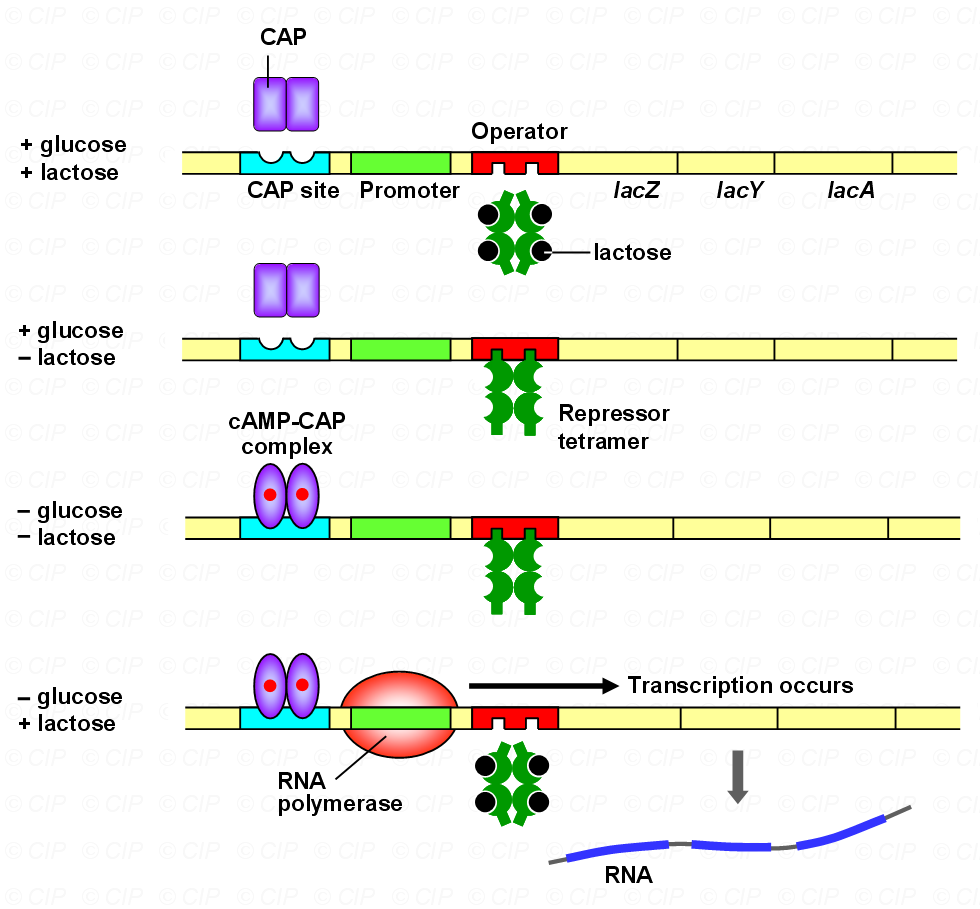
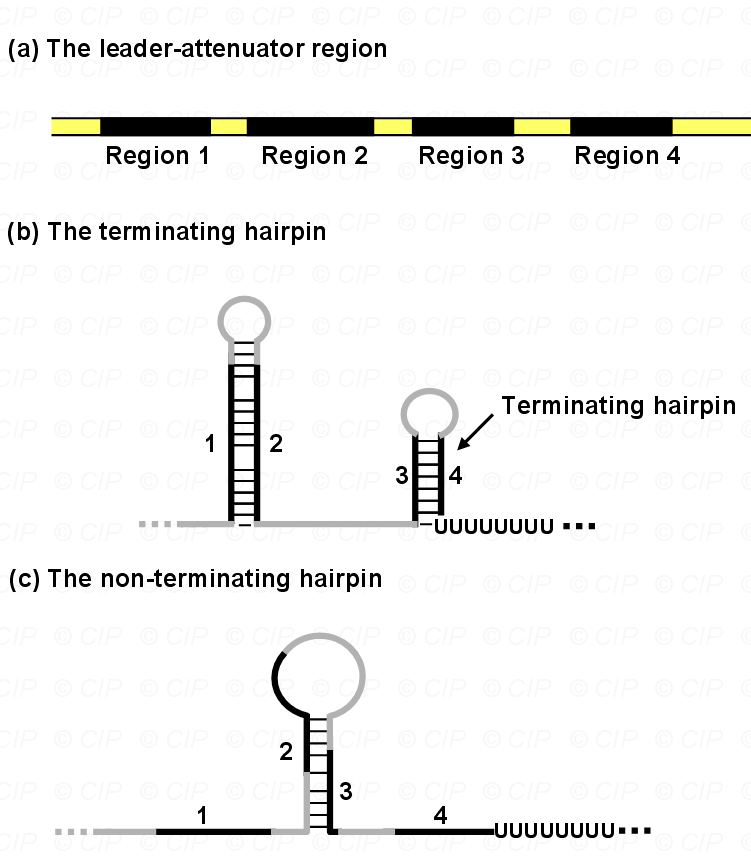

# 分子生物学概论

## Chapter 1 Introduction

### 1.1 History

一系列科学家及其发现

Molecular biology grows out of the disciplines of genetics, biochemistry and cell biology.

### 1.2 Afterwards

#### 1.2.1 基因组编辑系统

1. 相关概念
   - 核酸酶（nuclease）：能够将聚核苷酸链的磷酸二酯键切断的酶
   - 限制性内切酶（restriction endonuclease）：用来识别特定的脱氧核苷酸序列，并对每条链中特定部位的两个脱氧核糖核苷酸之间的磷酸二酯键进行切割的一类酶
   - 回文序列（palindrome sequence）
     - 有对称中心，长链可形成发夹结构
     - 功能：
       - 限制性内切酶的识别位点
       - 具有调节基因的表达作用
       - 转录终止时的识别结构
       - 基因工程的载体构建
2. 发展历史
   - 第一代：90年代，巨型核酸酶，锌指核酸酶
   - 第二代：2009年，TALEN
   - 第三代：2013年，CRISPR/Cas
3. CRISPR/Cas
   - CRISPR:成簇规律间隔短回文序列；Cas：CRISPR相关蛋白
   - 工作机制：
     - CRISPR转录形成pre crRNAs
     - tracrRNA和pre crRNA杂交，被RNaseIII切割处理成为成熟crRNA
     - tracrRNA与crRNA结合形成gRNA，与Cas蛋白结合
     - 组成的复合体识别外来DNA上的PAM序列
     - 目标DNA局部解旋，crRNA与目标DNA碱基互补配对结合
     - Cas蛋白构象变化，核酸酶结构域激活，切割目标DNA，产生双链断裂（DSB）
     - 通过双链断裂修复机制（NHEJ、HR等）引入突变，造成目标DNA失活。
   - 实际应用中，将crRNA和tracrRNA合并形成sgRNA
   - 相关应用：
     - 转录调控
       - CRISPRa：基于切割活性丧失的dCas9结合多种转录激活因子，gRNA引导dCas9和转录因子结合在特定的DNA序列，从而激活基因表达
       - CRISPRi：dCas9融合了一个基因抑制结构域
     - 单碱基编辑器
       - CBE：C→U→T。
         - 改造的Cas 9 蛋白
         - 胞嘧啶脱氨酶：将胞嘧啶C脱氨基变成尿嘧啶U
         - 尿嘧啶糖基化酶抑制子：抑制中间产物U的切除
       - ABE：A→G
         - nCas9
         - 腺嘌呤脱氨酶：将腺嘌呤 A 脱氨基变成肌苷 I（会被当作G）
     - 引导编辑（Prime Editing）
       - 包括pegRNA和融合蛋白。
         - 融合蛋白由Cas9切口酶组成，具有失活的HNH结构域和逆转录酶结构域
         - pegRNA含有突变位点，可与NTS结合
       - Cas9蛋白在NTS中产生一个缺口，pegRNA互补，通过逆转录引入突变。

## Chapter 2 Nucleic acid and DNA structure

### ***“DNA元件百科全书”计划（ENCODE）

目的是寻求新一代DNA研究技术对人类基因调控序列在全基因组的水平上研究的应用

计划的研究对象包括编码基因、非编码基因、调控区域、染色体结构维持和调节染色体复制动力的DNA元件

### 2.1 遗传物质的性质

- 携带遗传信息，如何编码蛋白
- 稳定
- 具有容忍变化的能力（变异和进化）
- 能够被复制（传递）

### 2.2 核酸和DNA结构

氢键 Hydrogen bond

磷酸二酯键 Phosphodiester bond

minor groove

major groove

#### 2.2.1 (deoxy)Nucleotides

含氮碱基，（脱氧）核糖，磷酸基团

#### 2.2.2 核酸的一般结构

磷酸二酯键，3'末端，5'末端，糖-磷酸骨架

#### 2.2.3 DNA的结构

双链DNA，反向平行

维持稳定性：氢键、碱基堆积力

双螺旋宽度2nm，每一圈长3.4nm，10bp

小分子结合在小沟，蛋白质结合在大沟

B DNA，A DNA，Z DNA

三螺旋：重复序列

**G四联体**

- **富含鸟嘌呤（G）**的DNA或RNA分子的核苷酸序列形成的特殊的局部二级结构。四个鸟嘌呤通过胡斯坦（Hoogsteen）氢键相互连接组成一个**环状平面**，多个由鸟嘌呤组成的环状平面通过π-π堆积形成四联体。
- 调控基因表达，激活、抑制，位置相关

denaturation变性

renaturation复性

Tm熔解温度：OD260吸光值增加到最大值的一半时的温度称为DNA的解链温度或熔点

### 2.3 DNA作为遗传物质

Why？

1. 碱基序列保存氨基酸信息
2. 结构的稳定性
   - 碱基在螺旋内
   - 糖-磷酸骨架在外
   - 共价键，氢键
   - 损伤修复
3. 碱基序列变化，突变
4. 易于复制

### 2.4 细胞中的DNA

Gene：泛指被转录的一个DNA片段。在某些情况下，基因常用来指编码一个功能蛋白或RNA分子的DNA片段。**何时何地多少表达**

原核生物：染色体。环状，没有头尾。

真核生物：染色体。线性，细胞核中，组蛋白。压缩。

- 组蛋白：H1，H2A，H2B，H3，H4

- 核小体：组蛋白核心八聚体，缠绕DNA
- 组装层次：染色质纤维→核小体串珠结构→螺线管→超螺线管→染色单体

### 2.5 RNA

DNA比RNA更稳定

RNA世界

### 2.6 证明DNA是遗传物质的实验

Griffith，Avery，Hershey-Chase

### ***DNA存储

1. 原理：

   - DNA分子由四种碱基组成，数据由二进制0和1组成
   - DNA用来储存遗传信息，数据正好需要一个介质存储
   - DNA在合适的条件下超级稳定，DNA的半衰期为521年，可保存数十甚至数百万年

2. 优势

   - 存储密度高
   - 具有稳定性。至少可保留上百年的数据
   - 维护成本低。仅需保存在低温环境中，能耗低

3. 挑战与潜力

   数据输入和读取效率

4. 战略意义

## Chapter 3 DNA复制

### 3.1 半保留复制

semi-conservation replication

### 3.2 原核生物中DNA复制的起始

富AT，OriC

mer，意即单体单元，相当于nt或bp

**质粒载体元件**

- Tag——WB检测，如3*Flag标签

DNAa：识别起始位点，解开双链，募集其他必需因子

双向复制

解旋酶

与解链有关的酶和蛋白质包括：1.单链结合蛋白2.解旋酶 3.拓扑异构酶Ⅰ 4.拓扑异构酶Ⅱ

引物酶：一种RNA聚合酶

### 3.3 半不连续复制

semi-discontinuous replication

半不连续复制是指DNA复制时，前导链上DNA的合成是连续的，后随链上是由间断合成的短片段连接而成的，不连续的，故称为半不连续复制

冈崎片段

### 3.4 复制延伸及相关蛋白

Helicase&SSBs

- 解旋酶：打断氢键，分开
- 单链DNA结合蛋白：防止退火；保护单链，防止断裂和降解

DNA polymerase

- DNA聚合酶Ⅰ

  - 5'→3'聚合酶活性
  - 3'→5'外切酶活性，校对
  - 5'→3'外切酶活性，切除引物或受损伤的DNA
  - 不是主要的聚合酶

- DNA聚合酶Ⅱ

  - 5'→3'聚合酶活性
  - 3'→5'外切酶活性
  - 不是DNA复制的主要聚合酶，损伤修复

- **DNA聚合酶Ⅲ**

  - 多酶复合体，复制合成的主要酶
  - 10个亚基
  - 核心酶：α、ε和θ亚基
    - α亚基含5'→3'聚合酶活性中心
    - ε亚基含3'→5'外切酶活性中心，θ亚基可能起装配作用
  
  - β亚基：滑行夹。持续合成能力。
  - 其他亚基：形成γ复合体，滑行夹加载器。持续合成。
  

引物

  - DNA聚合酶不能启动复制
  - 引发酶，合成引物
  - DNA聚合酶Ⅰ，切除引物，合成DNA

  片段扩增——PCR，**质粒扩增**

Ligase——如T4连接酶

### 3.5 DNA拓扑学

超螺旋

拓扑异构酶

- Ⅰ型拓扑异构酶
  - 单链切口
- Ⅱ型拓扑异构酶
  - 双链切口
  - DNA旋转酶
  - 复制终止

### 3.6 真核生物DNA复制

额外挑战：

- 基因组大
- 复制叉移动慢，组蛋白

解决方法

- 多个复制起点
- 大量DNA聚合酶

5种DNA聚合酶——DNA polymerase α & DNA polymerase δ

相关蛋白不用记

大概过程，与原核生物的差异

**细胞周期**

**Telomeres**

- 末端复制问题，去除引物，但不能填补空缺。后随链5'末端
- 端粒的功能
  - 稳定染色体末端结构，保护染色体不被核酸酶降解；
  - 防止染色体间末端连接；
  - 可补偿滞后链5'末端在消除RNA引物后造成的空缺；
  - 组织培养的细胞证明，端粒在决定动植物细胞的寿命中起着重要作用，经过多代培养的老化细胞端粒变短，染色体也变得不稳定；
- 端粒酶telomerase，RNA+蛋白质
  - 端粒延伸的反转录DNA合成酶
  - 过程：以RNA为模板延长母链。而后引物酶合成引物，复制新链末端序列
  - 在生殖细胞、干细胞、肿瘤细胞中有端粒酶活性，在其他体细胞中没有端粒酶活性
  - 没有端粒酶活性的细胞末端如何解决
    - 大量末端重复
    - 折叠并有蛋白保护

**蛋白质改造**

- **定向进化**
  - **定向进化**是在试管中模拟达尔文进化过程，通过随机突变和重组，人为制造大量的突变，按照特定的需要和目的给予选择压力，筛选出具有期望特征的蛋白质,实现分子水平的模拟进化。
  - **非理性设计**
- 理性设计
  - 需要对酶蛋白分子的三维空间结构和催化机制有非常充分的了解，通过改变个别氨基酸而对酶的结构进行精确的调控，从而获得具有所需催化活性的新酶
    - 基于实验结果的设计：活性中心
    - 计算机辅助设计：AI，从头设计
  - **目的性更强，更为高效和快捷**
  - 理性设计方法与非理性方法的相互融合与发展

**AlphaFold**

- 预测蛋白质结构，从氨基酸序列预测蛋白质三维结构

## Chapter4 原核生物的转录

### 4.1 为什么使用RNA为中间体

1. 染色体结构复杂，而核糖体本身也比较复杂，直接从DNA读取序列比较缓慢、效率低
2. 遗传物质必须要稳定，对DNA进行直接翻译需要将DNA链频繁地分开，大大增加了遗传物质暴露并受损的机会
3. 核糖体在细胞质中，而DNA通常在细胞核或核区中，接触和移动效率低
4. 采用RNA转录，核糖体可以直接从RNA上读取信息，减少与染色体的接触
5. 原核生物的多顺反子和真核生物的可变剪接，同一条RNA可以产生多种不同的蛋白质
6. 此外，一条mRNA可以结合多个核糖体，形成多聚核糖体，大大提高翻译效率，产生大量蛋白质
7. 易于调控

### 4.2 转录机制

#### 4.2.1 启动子

转录以3'→5'方向进行

上游区域

两个重要元件：-10框和-35框

#### 4.2.2 RNA聚合酶

原核生物只有1种，α、β、β'、σ四个亚基。

核心：α、β、β'。可转录但不能识别启动子。

σ亚基：识别、结合DNA

#### 4.2.3 三个阶段

1. 起始
2. 延伸
3. 终止
   - 内在型终止
     - 仅依靠核苷酸序列
     - 反向重复序列，形成发夹环结构
     - 下游一长串A
   - ρ依赖型终止
     - 蛋白协助
     - 发夹环结构
     - 形成发夹后，RNA聚合酶停止，ρ分离RNA
     - 不需要一长串A

### 4.3 表达调控

#### 4.3.1 协同调控

功能相关的基因通常在一起被调控，组织形成操纵子

RNA聚合酶转录操纵子所有基因，形成多顺反子mRNA。顺反子之间含有翻译的终止和起始信号，各自翻译。

#### 4.3.2 乳糖操纵子Lac operon

操纵子：有**启动子、操纵基因、若干连锁的结构基因**组成，很多功能上相关的基因前后相连成串，由一个共同的控制区进行转录的控制，包括结构基因以及调节基因的整个DNA序列。

**顺式作用元件cis**：是DNA上一段序列，它不能转变成任何其它的形式

**反式作用因子trans**：编码调节蛋白的基因称调节基因。调节蛋白可调节其它基因的表达。由于调节基因的产物可以自由地结合到其相应的靶上，因此被为反式作用因子

1. 结构

   - lac I：阻遏蛋白

   - lac P

   - lac O

   - lac Z：乳糖渗透酶

   - lac Y：β-半乳糖苷酶

   - lac A：半乳糖苷乙酰转移酶

2. 代谢条件

   - 存在乳糖并且不存在葡萄糖，才能表达

   - 代谢葡萄糖更容易

   - 表达蛋白浪费能量
3. 负调控

   - 蛋白质结合到DNA上阻止基因转录
   - **lac阻遏蛋白**
   - 乳糖（异乳糖）结合lac阻遏蛋白，构象变化
4. 正调控
   - CAP，感应细胞内葡萄糖水平
   - 蛋白质结合到DNA上刺激转录发生
   - 与cAMP结合，才能结合到DNA上并激活转录。cAMP的浓度与葡萄糖的浓度成反比。
5. **需要负调控和正调控协同控制表达**

#### 4.3.3 色氨酸操纵子

合成代谢

1. 负调控

   - trp阻遏蛋白
     - Trp结合，构象变化，结合到操纵基因阻止转录
     - 没有Trp，不能结合到DNA上
   - 与lac操纵子的异同
     - 相同点：负调控，结合到DNA上关闭转录
     - 不同点：发生作用方式不同
       - lac阻遏蛋白结合乳糖，从DNA脱落
       - trp阻遏蛋白结合色氨酸，结合到DNA上
     - **乳糖为诱导物**，因为结合后诱导转录；**色氨酸为辅阻遏物**，结合后阻止转录发生

2. 衰减作用 attenuation

   - 存在问题：没有正调控，阻遏蛋白发挥的阻遏作用不是非常强，转录仍能进行
   - leader-attenuator region：前导子和衰减子
     - 从衰减子转录出来的RNA形成不同的发夹结构
     - 一种类似内在终止结构，连一串U
     - 

   - 具体过程
     - 偶联转录翻译
     - 前导子序列转录后，翻译前导区域mRNA
     - 含有两个相邻Trp密码子
       - Trp含量低，核糖体停顿，RNA形成抗终止结构，区域2和3形成的发夹结构
       - Trp含量高，核糖体不会停顿。两个发夹结构，区域1和2，区域3和4（转录终止信号）

#### 4.3.4 阿拉伯糖和半乳糖操纵子

## Chapter5 真核生物的转录

### 生物制造 Biomanufacture

1. 降低能源消耗，减少污染
2. 有助于拉动制造业研发、资本等投入，缩短新品研发周期，提升产品附加值和工厂生产效率
3. 实现化工原料和过程的替代，有望彻底变革未来物质加工和生产模式
4. 可以生产一系列能源与化工产品，生物环保材料和生物制剂，或生产原料药、疫苗和抗体药物，生产淀粉、蛋白质、油脂等食品成分
5. ……

### 植物合成生物学技术

涉及多学科交叉融合的前沿技术，在生物育种及生物智造中将发挥关键作用。

多组学集成分析与资源挖掘，元件、模块库设计与构建，植物高效遗传转化与筛选，蛋白酶定向优化，植物细胞工厂，数据驱动的细胞改造

### 5.1 真核生物RNA聚合酶

三种不同的RNA聚合酶

- RNA聚合酶Ⅰ
  - 大的rRNA前体基因，5.8s、18s、28s
- RNA聚合酶Ⅱ
  - hnRNA，mRNA前体
  - 大部分snRNA
  - 12个亚基，Rpb1-12
- RNA聚合酶Ⅲ
  - 5s rRNA
  - tRNA基因
  - U6 snRNA（***PPT上是U5？***）

### 5.2 启动子

**上游启动元件**

**核心启动子**

- TFⅡB识别元件：位于TATA框上游
- TATA框：-25位。持家基因和作用重要的基因一般没有
- 起始子：共有序列，普遍性
- 下游启动子元件：转录起始位点下游约+30位置

### 5.3 通用转录因子与转录起始

转录因子与RNA聚合酶Ⅱ形成转录起始复合体，共同参与转录起始的过程（通用转录因子和特异转录因子）

真核生物中，识别启动子和起始转录需要RNA聚合酶Ⅱ和至少6种通用转录因子。确定转录起始位点和方向，形成前起始复合体。

具体的转录因子不用记

### 5.4 特异转录因子与转录调控

基础转录（仅有通用转录因子）→改变转录速率（特异转录因子）

**activitor**

- 提高转录速率
- 增强通用转录因子、RNA聚合酶Ⅱ和启动子之间的结合
- 改变DNA的高级包装结构

**repressor**

- 阻止转录
- 阻断激活蛋白的功能
- 结合到DNA上防止通用转录因子与启动子结合

**增强子、沉默子**

- 属于顺式作用元件，通过与反式作用因子如转录因子相互作用来参与基因表达的调控
- **超级增强子**
  - 具有转录活性增强子的一个大簇，富集高密度的关键转录因子、辅因子和增强子表观修饰标记
  - 超级增强子已被报道与动物的生长发育及多种疾病发生有关

histone

**常染色质（euchromatain）和异染色质（heterochromatin）**

### 5.5 特异性转录因子的结构

绝大部分结合在DNA大沟

**原核生物DNA结合基序**

- 螺旋-转角-螺旋

**真核生物DNA结合基序**

- 同源异型结构域：3个α-螺旋
- 锌指
- 亮氨酸拉链
- 螺旋-环-螺旋

**α鹅膏蕈碱**：低浓度抑制RNA聚合酶Ⅱ，更高浓度也能抑制RNA聚合酶Ⅲ，对RNA聚合酶Ⅰ没有影响。

**相分离**

- 概念：二元或多元混合物会在一定的条件下分离为不同的相。无膜细胞器。
- 意义：构建特定反应体系和反应环境。在没有膜的束缚下，可以形成与外界环境隔离的稳定反应空间，并可以发生频繁物质交换。

## Chapter6 突变和突变修复

**手性chirality**

**镜像生物学**

- 天然：L-氨基酸和D-糖，D-DNA。
  - DNA复制，RNA转录，蛋白质翻译，以及这些生物大分子之间的彼此识别，统统都是以此为基础
- L-DNA→L-RNA→D-Protein，
- 镜像DNA合成系统
- 前景：
  - 信息存储的稳定性。左手镜像DNA不能被天然DNA酶切割，稳定性能大大提高
  - 镜像左手DNA分子还能用来给信息加密
  - 增强DNA, RNA, Protein的稳定性

**非天然氨基酸**

- 可位点特异性地引入目标蛋白，且对蛋白结构的扰动较小，通过更换氨基酸的侧链基团更可实现修饰蛋白的功能多样化
- 基因密码子拓展技术既能实现具有新功能或增强功能的蛋白质生物合成，又能把非天然氨基酸定点整合进蛋白质中
- 应用前景：
  - 提高酶催化活性
  - 增强酶热稳定性
  - 药物蛋白

**点突变**

- 单个碱基对的变化

- 转换transition（嘧啶变嘧啶，嘌呤变嘌呤）、颠换transversion（嘧啶嘌呤互变）
- 错配碱基
  - DNA复制过程中，一般能被校正
  - 未被修复→突变
- 自发突变
  - 脱氨基，如胞嘧啶脱氨基变为尿嘧啶
  - 脱嘌呤
  - 互变异构，4种碱基各自的异构体间都可以自发地相互变化，如烯醇式和酮式（G&T），氨基式和亚氨基式（A&C）
- 诱发突变
  - 碱基类似物：与碱基相似的化学物质。
    - 5-BrU，类似T，异构化与G配对
    - 2-氨基嘌呤，类似A，与C和G配对
  - 烷化剂：添加烷基到碱基
    - 乙基甲磺酸EMS
  - 亚硝酸：胺变酮
    - A→次黄嘌呤，G→黄嘌呤，C→尿嘧啶
  - 紫外辐射UV：嘧啶二聚体
  - 交联剂：同一条链相邻碱基之间或位于相对链上核苷酸之间的连接

**插入和缺失**

- 碱基的插入或缺失，InDel。复制错误或化学物质的作用。
- 链滑动
  - 重复序列，插入/缺失环
  - 微卫星不稳定性MSI
- 转座子
- 嵌入剂：与碱基对相似、能插入到DNA双螺旋中的分子
  - 插入突变；链滑动

**大规模DNA变化**

- 易位
- 倒位

**DNA突变的影响**

- 点突变
  - 沉默突变（同义突变）：不改变氨基酸序列。密码子的简并性
  - 错义突变：氨基酸序列改变
    - 被相似的氨基酸替换，影响小
    - 渗漏突变：活性下降，但功能并没有被彻底破坏
  - 无义突变：变为终止密码子
- 插入和缺失
  - 移码突变
- 易位
  - 没有功能
  - 融合蛋白
  - 完整移到新的启动子下
- 突变热点
  - 比基因组其他位置更频繁地累计突变的位置
  - 短序列重复
  - 含有甲基化的C的CG序列

**氨基酸**

- 磷酸化：Ser、Thr、Tyr，羟基
- 非极性氨基酸：Gly、Ala、Pro、Val、Leu、Ile、Met
- 极性氨基酸
  - 不带电荷：Ser、Thr、Gln、Asn、Cys、（Pyl 吡咯赖氨酸）
  - 带负电：Asp、Glu、（Sec 硒代半胱氨酸）
  - 带正电：Arg、Lys、His
- 芳香族氨基酸：Phe、Tyr、Trp

**突变修复**

- 易位和转座几乎不能逆转
- 直接回复
  - 嘧啶二聚体，光解酶——光复活反应
  - 鸟嘌呤烷基化，甲基转移酶
- 错配修复 MMR
  - 碱基错配和链滑动
  - 母链和子链，甲基化识别
- 核苷酸切除修复 NER
  - 发生化学修饰的核苷酸
  - 与MMR相似，去除包含错误核苷酸的片断并重新合成
    - 不同点：识别不同类型的错误并使用不同的蛋白；MMR主要在复制过程中进行，NER整个细胞周期
- 碱基切除修复 BER
  - 取代经历了常见的和较小修饰（如脱氨基）的碱基
  - DNA糖基化酶、AP内切核酸酶、DNA磷酸二酯酶，DNA聚合酶Ⅰ

- 双链断裂修复
  - 非同源末端连接
  - 同源重组

## Chapter7 真核生物mRNA的修饰

基因的结构

上游开放阅读框（uORF）

**加帽**

- hnRNA
- 在前体mRNA的5'末端加上一个鸟嘌呤核苷酸衍生物的过程
  - 7-甲基鸟嘌呤核苷
  - RNA三磷酸酶，鸟苷酸转移酶，甲基转移酶
  - NAD+-cap

- 功能
  - 防止降解：5'-5'三磷酸键
  - 运送到细胞质中
  - 增强翻译：cap结合蛋白，帮助与核糖体结合
  - 帮助去除第一个内含子

**聚腺苷酸化**

- Poly A
- 在转录物的3'端加入一串约250个腺嘌呤核苷酸的修饰
- 聚腺苷酸化信号：
  - **AAUAAA**
  - 切割下游约20个核苷酸
  - G/U rich region

- 切割复合体
  - CPSF：切割与聚腺苷酸化特异因子，结合到PolyA加尾信号AAUAAA
  - CstF：切割激活因子
  - CFⅠ
  - CFⅡ
- 加尾步骤
  - RNA聚合酶Ⅱ CTD结构域
  - CPSF结合到PolyA加尾信号，CstF结合到富含GU的下游序列
  - CFⅠ和Ⅱ切割
  - CPSF仍结合，PolyA聚合酶+PBP（聚腺苷酸结合蛋白）

- 功能
  - 保护免受核糖核酸酶降解
  - 剪接，增强mRNA的翻译

**剪接splicing**

- exon，intron
- splicing：将内含子从前体mRNA中去除
- 基本剪接反应：
  - 剪接位点：内含子开始和结束的位置。GU-AG
  - 腺苷酸羟基进攻，形成套索。露出5'剪接位点G的羟基，继续进攻3'剪接位点，连接

- 相关蛋白
  - 剪接体，snRNPs
  - snRNA与hnRNA互补配对
  - U1、U2、U4、U5和U6

- 自我剪接
  - 没有蛋白质或snRNP下的剪接
  - Ⅰ类内含子
  - Ⅱ类内含子

- 反式剪接
  - 剪接前导序列SL

- 内含子存在的原因
  - 内含子早现说
  - 内含子晚现说

- 可变剪接
  - 可以从一个基因中产生多种蛋白质的剪接

**mRNA编辑**

- 锥虫
- C→U
- A→I（相当于A→G）

**其他修饰**

- m6A，最丰富，参与RNA剪接、稳定性和翻译
- m5C
- m1A
- m7G
- 假尿苷化ψ
- 肌苷编辑
- ac4C

**实验研究**

- mRNA与DNA之间的杂交
- 切割单链DNA的核酸酶处理
- 前体mRNA与DNA之间的杂交

## Chapter8 翻译

**遗传密码**

- AUG
- UAA，UGA，UAG

**原核生物翻译机理**

- 核糖体组成
  - 5S rRNA+23S rRNA+32种蛋白质→50S
  - 16S rRNA+21种蛋白质→30S

- 翻译

  - 起始

    - 大小亚基分离：IF
    - SD序列：16S rRNA识别
    - 30S 起始复合体
    - 70S 起始复合体
      - A、P、E位点
      - 起始tRNA进入P位点

  - 延伸

    - tRNA进入
      - 延伸因子EF
    - 肽基转移
    - 移位
    - tRNA离开

  - 终止

    - Termination Codons

      - 释放因子RF
        - RF1
        - RF2
        - RF3

    - Non-Stop mRNA

      - tm-RNA

真核生物翻译

- 核糖体组成
- 与原核不同点
  - 起始tRNA
    - 烷基化A
  - 扫描模型
  - 通过直接进入IRES位点启动翻译
- 翻译
  - 起始
    - eIF
  - 终止
    - eRF1
    - eRF3
    - Ski7p——Non-stop mRNA

