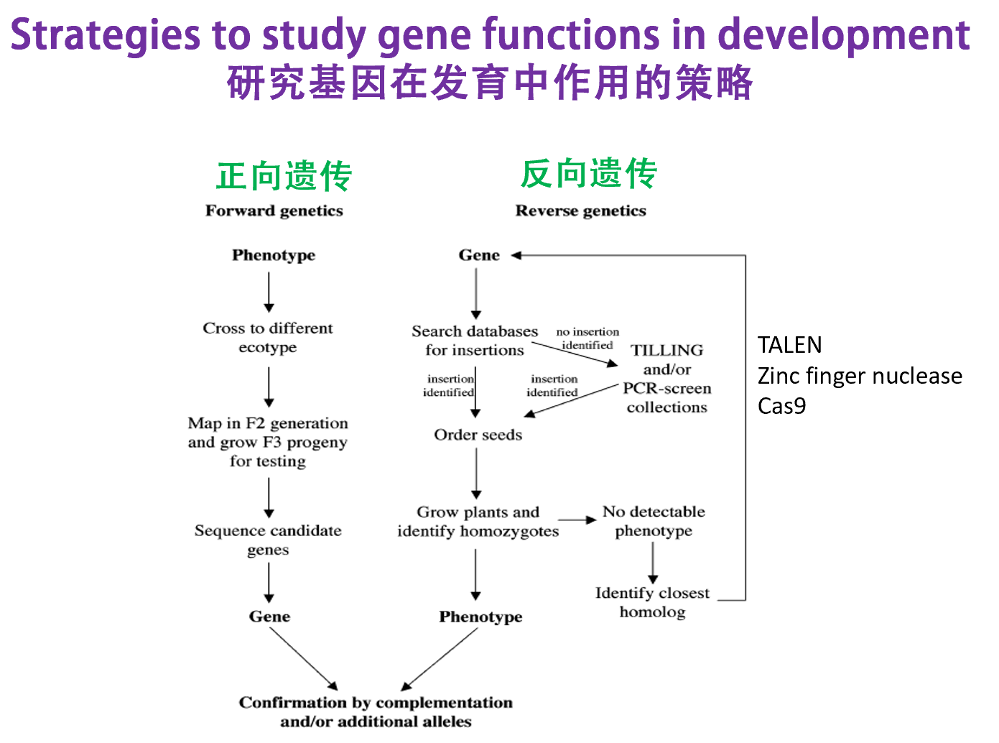
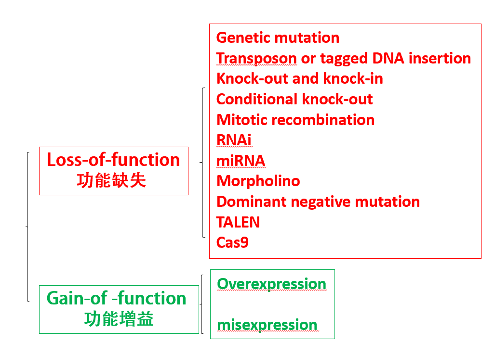
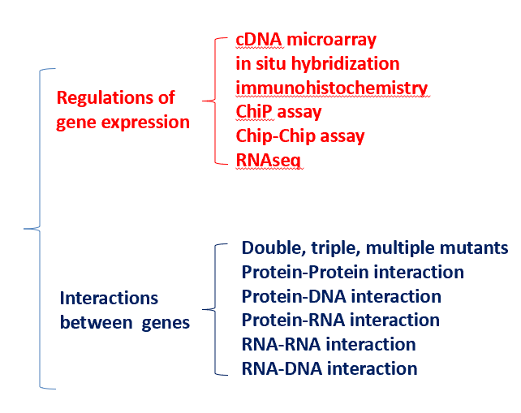
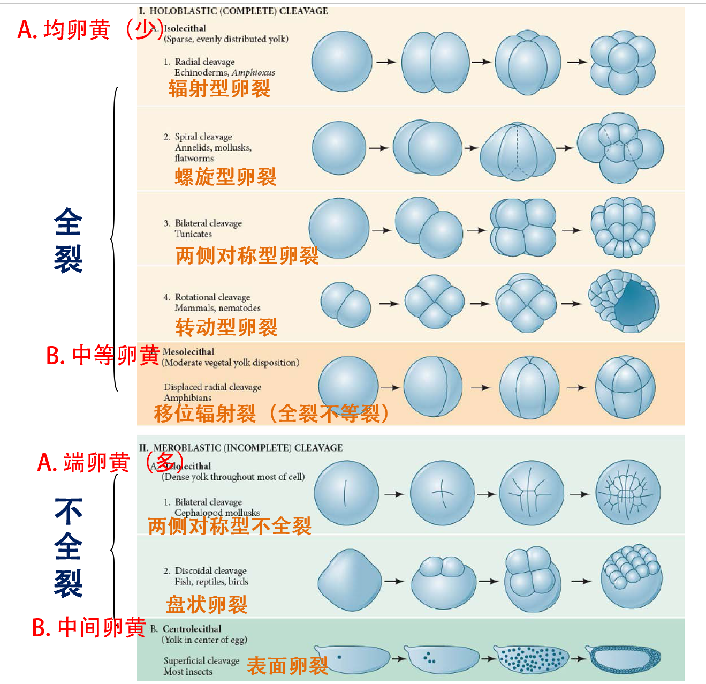
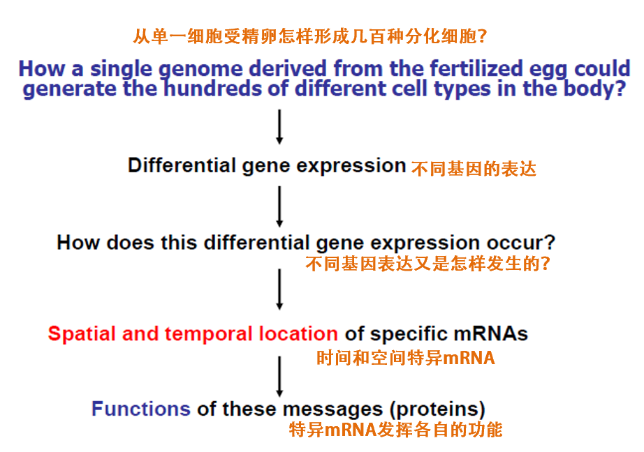

# 发育生物学

## 绪论

### 一、发育的概念

发育（development）是指**多细胞生物**的受精卵通过细胞的增殖、分化，从无到有，从简单到复杂，自我构建和自我组织生命个体结构的过程以及在这一过程中的各种复杂的变化。

胚胎发育就是按照严格的时空时序将这些遗传密码转换为实际的形态、结构和功能的过程，即基因型（genotype）转换为表型(phenotype）的过程。

### 二、发育生物学的发展

#### （一）先成论和后成论

1. 后成论（epigenesis）

   认为胚胎是由简单到复杂逐渐形成的。

2. 先成论（preformation)

   认为胚胎预先存在于精子中或卵子中，发育不过是长大而已。

   混血？杂交？

#### （二）比较胚胎学的发现：各种动物的发育有共同性

1. Wolff：《发生论》

2. von baer法则

   （1）在动物胚胎中动物的一般特征比特化特征出现早；

   （2）从一般的特征发育出较特化的特征，最后发育出最特化的特征；

   （3）给定物种的的胚胎并不经历其他低等动物成年期特征的发育阶段，而是逐渐远离低等动物成年期的特征；

   （4）因此，高等动物的早期胚胎并不像低等动物的成体，而只是与其早期胚胎相似。

3. 演化胚胎学

4. 脊索：无脊椎动物到脊椎动物进化的发育证据

5. Homologous 同源和Analogous 类似

6. 畸形学

#### （三）实验胚胎学

1. 决定子假说：合子的细胞核含有大量的特殊的信息物质，决定子。在卵裂的过程中这些决定子被不均匀地分配到子细胞中，导致细胞具有不同的发育命运。镶嵌型发育
2. 缺失实验
3. 分离实验
4. 复杂的联合实验
5. 体外诱导实验
6. 细胞谱系追踪
7. 细胞移植实验

#### （四）细胞生物学，遗传学，分子生物学，显微成像学等学科进步推动现代发育生物学的发展

### 三、动物发育的基本过程

•**Fertilization** **受精**

•**Cleavage** **卵裂期**

•**Gastrulation** **原肠期**

   **(endoderm, mesoderm, ectoderm)**

•**Organogenesis** **器官发生**

•**Metamorphosis** **变态**

•**Gametogenesis** **配子发生**

•**Regeneration** **再生**

•**Ageing and Senescence** **衰老**

### 四、发育生物学的八个基本问题

•**The question of differentiation**细胞分化

•**The question of morphogenesis**形态发生

•**The question of growth**生长

•**The question of reproduction**生殖

•**The question of evolution**进化

•**The question of environmental integration**适应环境

•**The question of tissue or organ regeneration**再生

•**The question of ageing**衰老

### 五、用于发育生物学研究的主要模式动物

#### （一）模式动物主要特征

1. 适合于生命科学研究并具有代表性

2. 对环境和人类无害，容易在实验室养殖

3. 世代周期短，可产生大量子代，遗传背景清楚，可进行遗传操作

4. 容易进行实验，特别是表型观察

#### （二）模式动物介绍

1. 海胆：用于受精机制研究，早期胚胎发育
2. 线虫
3. 果蝇
4. 非洲爪蟾
5. 斑马鱼
6. 小鼠

### 六、发育生物学的主要研究思路和方法

#### （一）研究基因功能方法

1. 正向遗传学：遗传突变体筛选和突变基因克隆

   （1）物理或化学诱变剂诱导的遗传突变

   - 化学诱变：ENU（动物）和EMS（植物）

   - 图位法克隆突变基因

     - 遗传图谱

     - 不同类型的遗传标记

     - 基本原理：通过连锁互换，确定遗传距离

     - 找到突变基因：在此区域有几个基因，是否有候选基因，cDNA测序，找到突变

     - 互补实验验证是否是由于此基因突变造成的表型：野生型基因拯救

   （2）DNA随机插入引起的基因突变

   - T-DNA或转座子介导的DNA插入
   - 通过引入RNA剪切的接受位点，将T-DNA引入基因外显子中
   - 克隆插入位点基因的方法
     - Tail PCR
     - Inverted PCR
     - Linker-Mediated PCR

2. 反向遗传：敲除或敲低某个基因的不同方法

   （1）基因敲除基本原理

   （2）siRNA和miRNA特异基因敲低

   （3）反义吗啉代核苷酸基因敲低

   （4）基因编辑技术

   （5）以核酸酶失活的Cas9为平台的基因表达调控系统

   （6）CRISPR-based RNA编辑技术：单一切割结构域

   （7）显性负突变：受体、转录因子

   （8）利用光照调控：基因表达、信号和离子通道

3. 怎样研究胚胎致死基因在后期发育中的作用

   （1）温敏突变体

   （2）有丝分裂重组

   （3）基因条件性敲除

   - Cre/loxP
   - 组织特异性启动子或可诱导型启动子：启动Cre表达
   - 条件性：特定时间、特定细胞

   （4）组织特异性或诱导型启动子

   （5）遗传补偿效应

   - 敲低一个基因会造成明显发育异常（出现表型），完全敲除此基因反而没有表型
   - 相关基因仅仅只在突变体中表达上调，从而弥补脱靶基因功能缺失
   - 分子机制：NMD（降解）……

4. 基因增益:过表达和异位表达研究基因功能

   - 强启动子
   - 双转基因系统可克服转基因致死，以及具有放大等作用
   - 化学诱导体系
   - 异位表达

#### （二）研究基因互作的方法

1. 基因芯片技术

2. 原位杂交检测RNA表达

3. 免疫组化检测蛋白表达及亚细胞定位

4. 染色体免疫共沉淀测序

5. 双突变体、三突变体、多突变体研究基因功能互作

6. 蛋白与蛋白之间互作

   （1）酵母双杂交

   - 构建两个表达载体：
     - DNA结合域+目标基因的融合蛋白
     - 转录激活域+寻找与目标蛋白互作文库
   - 如果两蛋白之间能够形成复合体，则报告基因就能表达

   （2）免疫共沉淀

   - 采用识别目标蛋白特异抗体
   - 检测拉下蛋白：Western或蛋白测序找到或验证与目标蛋白互作的蛋白
   - 无抗体，加标签

   （3）荧光共振能量转换（FRET）

   - 共同表达两融合蛋白:目标蛋白A+CFP与目标蛋白B+YFP
   - 激发

7. 蛋白与DNA之间互作

   - ChIP、酵母单杂交、EMSA
   - 已知启动子，如何寻找调控的转录因子
   - 酵母单杂交
     - 构建已知启动子启动报告基因
     - 表达融合蛋白：文库+GAL4转录激活蛋白
   - 电泳位移实验

8. 蛋白与RNA之间互作

   - RNA immunoprecipitation
   - RNA gel shift
   - Yeast three hybrid system
     - 通过构建三个表达载体找到（或证明）与已知长非编码RNA结合蛋白
       1. 融合蛋白：已知DNA 结合域+已知非编码RNA结合蛋白；
       2. 融合非编码RNA：已知非编码RNA+目标非编码RNA；
       3. 融合蛋白文库：蛋白文库+转录激活域

9. RNA-RNA and RNA-DNA 之间互作

   - Southern
   - Northern
   - FISH
   - FRET

#### （三）通过遗传方法进行细胞谱系追踪

1. 构建两个转基因：
   - 由心肌细胞特异表达的启动子cmlc2（cardiomyocyte light chain 2基因）启动表达可诱导的Cre(CreER); ER为脱皮激素受体，CreER为融合蛋白，该融合蛋白Cre重组酶只有在脱皮激素诱导下才能进核发挥重组作用；
   - 由泛表达启动子β-actin2启动表达：loxP-DsRed-loxP-EGFP报告基因；没有Cre作用下，所有细胞只翻译红色荧光蛋白；当Cre重组酶起作用时，切掉Dsred，细胞及其后代细胞永远只表达绿色荧光蛋白
2. 细胞谱系追踪证明心脏再生来源于心肌细胞增殖

#### （四）单细胞测序

## 第二章 特征的特化：发育模式的机制

### 三胚层动物早期发育基本过程

- 细胞分化
- 细胞定型或命运决定
- 器官发生

### 卵裂的方式

1. 卵裂：受精卵经过多次重复的有丝分裂形成很多细胞的过程
2. 卵裂球或分裂球：卵裂所形成的细胞

卵裂→囊胚→细胞通过运动分成不同胚层

### 胚层形成与器官发生

- 囊胚的细胞通过细胞迁移，重新排列和再组合，形成双胚层或三个胚层的胚胎，叫做原肠胚（gastula）
- 在这一过程中，囊胚的部分细胞通过不同的方式迁移到囊胚内部，形成原肠。留在外面的的细胞组成的胚层称为外胚层（ectoderm），迁移到内部的细胞组成的胚层内胚层（endoderm）或中内胚层（meso-endoderm）
- 由囊胚形成原肠胚的细胞运动或迁移过程称为原肠形成或原肠作用（gastulation）；也称为形态发生（morphogenesis）

### 原肠期细胞运动方式

内陷、内卷、内迁、分层、外包

### 三胚层形成以及各自细胞分化

细胞分化是胚胎不同组织、器官和系统等结构形态发生的基础

### 细胞分化（differentiation）

由同一个受精卵分裂、增殖而来的胚胎细胞经过多个相继的发育阶段（如三胚层动物：囊胚、原肠胚、神经胚等），逐渐出现差异，产生许多形态结构、生理功能和生化特征都不同的细胞类型

需要通过细胞定型（Commitment）的阶段

### 细胞定型（commitment）

指细胞被赋予特殊的“使命”或“命运”，并进入程序性分化的过程。在这一阶段，细胞虽然还没有显示出特定形态的、生理的和生化的特征，但是已经确定了向特定方向分化的程序

包括细胞特化 specification 和 细胞命运决定 deternmination

#### （一）分化之前先有细胞命运的特化与定型

 细胞的特化（specification）：细胞已经向特定类型细胞转变，但细胞的命运仍可被外界信号逆转。

细胞命运决定或定型（determination or commitment）：细胞已经确定了分化方向，并进入了特定类型细胞的分化程序，其发育命运在正常发育过程中已不可逆转。

果蝇的**器官芽或成虫盘**是幼虫中一些还没有分化但已决定了分化方向的细胞团

决定状态是非常稳定的；在正常状态下，胚胎细胞的命运被决定以后，  就丧失了发育成其他类型细胞的潜能，成为特定类型的干细胞。

#### （二）特化的三种基本方式

1. 自主型（镶嵌型）特化
   - 由卵裂球所分得的形态发生决定因子决定 ，称为自主特化。整体胚胎像是自我分化的各部分组装在一起的集合体
   - 分裂球不管在体内，还是分离出来在体外都发育成同种细胞。胚胎将缺失此分裂球的子代细胞
   - 镶嵌发育
   - 柄海鞘
   - 镶嵌型胚胎发育的形态发生决定子与细胞质定域
   - 海鞘胚胎细胞发育命运是由其所含有的细胞质形态决定子决定，而不是由细胞核的来源决定
     - 海鞘类动物受精卵不同的细胞质区域含有特殊的形态发生决定子。卵裂时，这些组分被准确地分布到胚胎的一定部位，通过调控不同基因的表达而决定细胞的分化方向。
     - 呈典型的镶嵌型胚胎发育动物卵子还有栉水母、环节动物，线虫和软体动物等。在这些典型的镶嵌型发育的动物卵子细胞质中。都存在着形态发生决定子。
2. 条件型（调节型）特化
   - 胚胎发育过程中，相邻细胞之间通过相互作用，决定其中的一方或双方的分化方向。
   - 在胚胎发育的早期，从采用这种方式发育的胚胎上分离出一个卵裂球，则胚胎上的其他相邻的卵裂球可以调整和改变发育命运，填补分离掉的卵裂球所留下的空缺，使其仍然可以发育成一个完整的胚胎
   - 调整型胚胎发育的细胞质定域
     - 海胆：动物极和植物极含有不同的形态发生决定子。这种决定子在8细胞时分离
   - 调整型发育的胚胎中也存在形态发生决定子的细胞质定域
     - 两栖类的卵子在受精后会因细胞质流动而形成一个灰色新月区
     - 灰色新月区含有合子形成完整胚胎所必须的形态发生决定子
     - 镶嵌型发育胚胎和调整型发育胚胎之间的差异只是程度上的不同
   - 哺乳动物卵裂球命运的决定：细胞所处的位置
     - 哺乳动物的卵是调整型卵子，卵裂期间没有明显对以后的发育分化起决定作用的形态发生决定子的细胞质定域
     - 用传统手段将卵裂球分离培养，证明哺乳动物胚胎2细胞，4细胞及至8细胞的单个卵裂球都具有发育成滋胚层和内细胞团的两种可能性
     - 用二个或多个卵裂球聚合成嵌合体胚胎，发现发育的方向是由细胞所在的位置决定的
     - 卵裂球的发育命运取决于其在胚胎中所处的相对位置
3. 合包体特化
   - 合包体特化是通过受精卵中形成素梯度来实现的
   - Bicoid，Nanos

### 母源基因效应

母体基因控制个体早期胚胎发育并决定了胚胎形体发育的体轴和胚胎的细胞分化大格局

- 母体基因在卵子发生过程中已编码好了早期卵裂及发育的程序。因此，在卵子受精后去除或破坏合子细胞核，无核的受精卵仍能正常发育成囊胚
- 母体基因决定了胚胎形体发育的体轴或胚胎的细胞分化大格局

## 第三章 不同基因的表达：细胞分化的机制

### 一、定型、决定、分化并不是遗传物质的不可逆的改变

时间-空间机制是发育的基本特征

### 二、基因表达的转录调控

不同组蛋白修饰（不同位点甲基化、乙酰基化等）

转录因子，转录激活因子，转录抑制因子等

DNA甲基化与印迹基因

启动子区域DNA甲基化抑制基因转录

DNA甲基化通过改变组蛋白修饰调控基因表达

基因组印迹：在配子发生过程中几乎所有基因组的DNA序列上的修饰(甲基化）都被抹掉。但还有部分基因（哺乳动物中大约有100个此类基因）DNA存在着甲基化，但在不同配子（精子和卵子）中是不同的，有些仅在精子中被甲基化，有些仅在卵子中被甲基化。这些基因在早期胚胎发育中剂量非常重要只有适当剂量，胚胎才能正常发育，多了少了都不能，从而确保子代是通过有性生殖而产生。

### 三、基因表达的转录后调控

1. mRNA不同剪接，转运调控
2. mRNA稳定性，翻译效率调控
3. mRNA修饰（比如A6-甲基化）：稳定性与翻译效率

### 四、基因表达的蛋白翻译后调控

## 第四章 细胞与细胞之间的通讯：形态发生的机制

### 一、形态发生

#### （一）概念

发育不仅仅只是细胞分化，不同细胞不是随机排列在机体内，而是有机的整合成具有三维空间结构特征、特定功能的不同组织和器官。不同组织形式的构建就是形态发生。

#### （二）细胞之间通讯

细胞与细胞之间的互作，都源于细胞膜释放的信号，和细胞膜接收的信号

近分泌相互作用：一个细胞表面的膜蛋白与相邻细胞表面的受体蛋白相互作用；

旁分泌相互作用：一个细胞合成分泌的蛋白可以扩散一段短的距离而诱导相邻细胞的变化；

配体和受体

同种结合和杂合结合

#### （三）细胞粘附和分选

不同细胞有选择的亲和性

细胞有能力迁移、分选到正确的胚胎发育位置

这些能力对于形态发生极为重要

**细胞互作热动力学模型**

- 细胞聚集依赖于自由能最低假设
- 细胞粘附力大的细胞倾向于聚集在内部
- 细胞粘附力相似趋向于随机排列

#### （四）钙粘蛋白和细胞粘附性

钙粘蛋白是钙依赖的粘连分子，胞内通过连环素（catenins）连接肌动蛋白（细胞骨架）调节细胞形态和迁移

5种钙粘蛋白介导钙依赖的同型细胞粘附

钙粘蛋白数量决定相同细胞群体细胞迁移和聚集位置

#### （五）细胞外基质：发育信号的一种来源

#### （六）整合素：胞外基质的受体

上皮-间充质转化：神经嵴细胞、中胚层细胞

#### （七）细胞信号传导

相邻细胞之间通过相互作用，决定其中的一方或双方的分化方向，是胚胎发育过程中基因选择性表达调节和整体协调控制的主要机制之一

#### （八）诱导与感应能力

在紧邻区域中两种或多种细胞的相互作用称为诱导

每一个诱导过程涉及两个部分的相互作用：

- 第一部分是诱导者(inducer)，即发出信号引起其他组织的细胞改变行为的组织；
- 第二部分是感应者（responder），即被诱导的组织。

被诱导组织对特定的诱导信号进行应答的能力称为感应能力

 感应性并不是一种被动的状态，而是一种主动的状态。在被诱导组织的细胞中存在感应因子

初级诱导：中胚层诱导背部外胚层神经发生

次级诱导：如视泡诱导头部表皮细胞晶体板发生

诱导互作两种模式：指导性和允许性

- 指导性相互作用：来自诱导细胞的信号对启动感应细胞中新基因的表达是必须的，没有诱导细胞，感应细胞就不能按特定的途径分化。如视泡对晶状体的诱导即是。
- 允许性相互作用：感应细胞已经特化了，只需要一种环境允许这些特性的出现。如上皮细胞与间充质细胞的相互作用

#### （九）旁分泌因子：诱导分子

对于早期胚胎发育来说，主要是旁分泌信号和近分泌信号

可扩散的蛋白称为旁分泌因子或生长分化因子

自分泌调节，即细胞分泌的旁分泌因子在自身的细胞膜上有反应受体

- 成纤维生长因子家族
- Hedgehog家族
- Wnt家族
- TGF-β超级家族

#### （十）成型素梯度

成形素一般指的分泌细胞外的可溶性分子，由于扩散浓度的梯度可诱导临近细胞产生不同的细胞命运；对于合包体发育形式来讲，胞內分子比如转录因子梯度同样被认为是成形素

#### （十一）信号传导级联反应

#### （十二）不同细胞膜受体类型

1. 离子通道偶联受体
2. G蛋白偶联受体
3. 酶偶联受体

#### （十三）受体酪氨酸激酶

酪氨酸蛋白激酶途径

- 受体酪氨酸激酶
- 非受体酪氨酸激酶（受体本身没有酪氨酸激酶活性，但接头分子有此酶活性）

#### （十四）旁分泌诱导分子信号传导

1. 成纤维生长因子家族（fibroblast growth factor, FGF）受体酪氨酸激酶

   - 一般机制：FGF配体二聚体通过细胞外基质转运，与FGF受体结合一个受体，受体将形成二聚体，二聚体将休眠酪氨酸激酶激活，自生磷酸化，自生磷酸化将招募接头蛋白，激活小G蛋白Ras，再激活所谓MAP激酶途径，最后磷酸化转录因子，磷酸化的转录因子将转录目标基因。
   - 非受体酪氨酸激酶：JAK-STAT通路，酪蛋白基因激活。FGF信号也可通过磷酸化STAT激活此通路

2. Hedgehog家族 

   （1）分类：shh、dhh、ihh

   （2）通路：

   在其受体Patched蛋白没有被hedgehog结合时，信号传导者蛋白Smoothened被其抑制而无活性，Ci蛋白被固定在感应细胞的微管上而被裂解，被裂解的Ci进入细胞核后成为转录抑制因子。

   Patched被hedgehog结合后，不再抑制Smoothened蛋白，Ci被从微管上释放而不会被裂解。未被裂解的蛋白进入细胞核后成为同一个基因的激活因子

3. Wingless或Wnt家族

   Wnt家族是一类富含半胱氨酸的糖蛋白家族

   Wnt蛋白也需要加工，棕榈酰化，分泌与Hedgehog类似：自由扩散，外吐，和脂蛋白微粒

   作用途径：

   （1）经典的Wnt途经（canonical Wnt pathway）：依赖于激活β-catenin, β-catenin进核促进下游基因转录；

   （2）非经典Wnt途径：通过激活Rho GTPase，从而改变细胞的形状、极性和运动能力；

   （3）促进钙离子释放：Frizzled受体激活一种磷脂酶C（PLC），释放二脂甘油和3磷酸肌醇（IP3）,IP3使钙离子从细胞内质网中释放出来。游离的钙离子可以激活一些酶、转录因子和翻译因子

4. TGF-β 超级家族

   包括TGF-β家族，Nodal、活化素(activin)家族，骨形态发生蛋白(BMPs)家族，VG1家族以及其他几种蛋白质

   作用机制：

   TGF-β配体结合到TGF-β受体II上后，TGF-β受体II二聚化就可以和二聚化TGF-β受体I结合。一旦这两个受体紧密接触，受体II便将受体I上的一个丝氨酸或苏氨酸磷酸化而使受体I被活化。被活化的受体I可以使Smad蛋白磷酸化。

   这些被磷酸化了的Samd蛋白与Smad 4结合而形成能进入细胞核的转录因子复合体。TGF-β家族中的BMP激活Smad 1、5；TGF-β、活化素和Nodal蛋白则使Samd2、3磷酸化。

#### （十五）旁分泌因子的运输

细胞外扩散机制：分泌到细胞外的旁分泌因子，并不能自己自由扩散，往往需要其它蛋白或蛋白聚糖结合保护才能扩散

通过聚焦膜突出作为信号源机制

​    1. 初级纤毛8+0

​    2. 丝状伪足

细胞外囊泡、迁移小体

#### （十六）近分泌信号途径

Notch

Cadherins

Ephrins

## 第五章 干细胞：潜能与干细胞巢

干细胞：具有细胞分裂自我更新能力，并且子代细胞有能力发育和分化成各种不同细胞。

### 二、分裂或不分裂：干细胞调节机制

物理机制：巢结构改变，胞外基质，粘附因子，细胞间机械力，细胞密度等能够改变干细胞行为

化学调节：微环境中内分泌，旁分泌，近分泌各类因子

细胞质决定因子，例如：不对称分裂；

转录调控；

表观遗传调控；

### 三、胚胎干细胞(全能干细胞）

内细胞团

囊胚期内细胞团建立

滋养外胚层细胞不对称分裂

**Hippo信号通路和ICM发育**

### 四、动物成体干细胞巢

果蝇卵巢干细胞巢持续补充卵母细胞

肠道干细胞及调控因子

成体造血干细胞巢模型

### 五、干细胞应用

