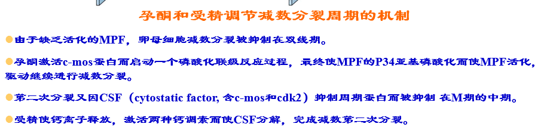

# 发育生物学

## 绪论

### 一、发育的概念

发育（development）是指**多细胞生物**的受精卵通过细胞的增殖、分化，从无到有，从简单到复杂，自我构建和自我组织生命个体结构的过程以及在这一过程中的各种复杂的变化。

胚胎发育就是按照严格的时空时序将这些遗传密码转换为实际的形态、结构和功能的过程，即基因型（genotype）转换为表型(phenotype）的过程。

### 二、发育生物学的发展

#### （一）先成论和后成论

1. 后成论（epigenesis）

   认为胚胎是由简单到复杂逐渐形成的。

2. 先成论（preformation)

   认为胚胎预先存在于精子中或卵子中，发育不过是长大而已。

   混血？杂交？

#### （二）比较胚胎学的发现：各种动物的发育有共同性

1. Wolff：《发生论》

2. von baer法则

   （1）在动物胚胎中动物的一般特征比特化特征出现早；

   （2）从一般的特征发育出较特化的特征，最后发育出最特化的特征；

   （3）给定物种的的胚胎并不经历其他低等动物成年期特征的发育阶段，而是逐渐远离低等动物成年期的特征；

   （4）因此，高等动物的早期胚胎并不像低等动物的成体，而只是与其早期胚胎相似。

3. 演化胚胎学

4. 脊索：无脊椎动物到脊椎动物进化的发育证据

5. Homologous 同源和Analogous 类似

6. 畸形学

#### （三）实验胚胎学

1. 决定子假说：合子的细胞核含有大量的特殊的信息物质，决定子。在卵裂的过程中这些决定子被不均匀地分配到子细胞中，导致细胞具有不同的发育命运。镶嵌型发育
2. 缺失实验
3. 分离实验
4. 复杂的联合实验
5. 体外诱导实验
6. 细胞谱系追踪
7. 细胞移植实验

#### （四）细胞生物学，遗传学，分子生物学，显微成像学等学科进步推动现代发育生物学的发展

### 三、动物发育的基本过程

•**Fertilization** **受精**

•**Cleavage** **卵裂期**

•**Gastrulation** **原肠期**

   **(endoderm, mesoderm, ectoderm)**

•**Organogenesis** **器官发生**

•**Metamorphosis** **变态**

•**Gametogenesis** **配子发生**

•**Regeneration** **再生**

•**Ageing and Senescence** **衰老**

### 四、发育生物学的八个基本问题

•**The question of differentiation**细胞分化

•**The question of morphogenesis**形态发生

•**The question of growth**生长

•**The question of reproduction**生殖

•**The question of evolution**进化

•**The question of environmental integration**适应环境

•**The question of tissue or organ regeneration**再生

•**The question of ageing**衰老

### 五、用于发育生物学研究的主要模式动物

#### （一）模式动物主要特征

1. 适合于生命科学研究并具有代表性

2. 对环境和人类无害，容易在实验室养殖

3. 世代周期短，可产生大量子代，遗传背景清楚，可进行遗传操作

4. 容易进行实验，特别是表型观察

#### （二）模式动物介绍

1. 海胆：用于受精机制研究，早期胚胎发育
2. 线虫
3. 果蝇
4. 非洲爪蟾
5. 斑马鱼
6. 小鼠

### 六、发育生物学的主要研究思路和方法

#### （一）研究基因功能方法

1. 正向遗传学：遗传突变体筛选和突变基因克隆

   （1）物理或化学诱变剂诱导的遗传突变

   - 化学诱变：ENU（动物）和EMS（植物）

   - 图位法克隆突变基因

     - 遗传图谱

     - 不同类型的遗传标记

     - 基本原理：通过连锁互换，确定遗传距离

     - 找到突变基因：在此区域有几个基因，是否有候选基因，cDNA测序，找到突变

     - 互补实验验证是否是由于此基因突变造成的表型：野生型基因拯救

   （2）DNA随机插入引起的基因突变

   - T-DNA或转座子介导的DNA插入
   - 通过引入RNA剪切的接受位点，将T-DNA引入基因外显子中
   - 克隆插入位点基因的方法
     - Tail PCR
     - Inverted PCR
     - Linker-Mediated PCR

2. 反向遗传：敲除或敲低某个基因的不同方法

   （1）基因敲除基本原理

   （2）siRNA和miRNA特异基因敲低

   （3）反义吗啉代核苷酸基因敲低

   （4）基因编辑技术

   （5）以核酸酶失活的Cas9为平台的基因表达调控系统

   （6）CRISPR-based RNA编辑技术：单一切割结构域

   （7）显性负突变：受体、转录因子

   （8）利用光照调控：基因表达、信号和离子通道

3. 怎样研究胚胎致死基因在后期发育中的作用

   （1）温敏突变体

   （2）有丝分裂重组

   （3）基因条件性敲除

   - Cre/loxP
   - 组织特异性启动子或可诱导型启动子：启动Cre表达
   - 条件性：特定时间、特定细胞

   （4）组织特异性或诱导型启动子

   （5）遗传补偿效应

   - 敲低一个基因会造成明显发育异常（出现表型），完全敲除此基因反而没有表型
   - 相关基因仅仅只在突变体中表达上调，从而弥补脱靶基因功能缺失
   - 分子机制：NMD（降解）……

4. 基因增益:过表达和异位表达研究基因功能

   - 强启动子
   - 双转基因系统可克服转基因致死，以及具有放大等作用
   - 化学诱导体系
   - 异位表达

#### （二）研究基因互作的方法

1. 基因芯片技术

2. 原位杂交检测RNA表达

3. 免疫组化检测蛋白表达及亚细胞定位

4. 染色体免疫共沉淀测序

5. 双突变体、三突变体、多突变体研究基因功能互作

6. 蛋白与蛋白之间互作

   （1）酵母双杂交

   - 构建两个表达载体：
     - DNA结合域+目标基因的融合蛋白
     - 转录激活域+寻找与目标蛋白互作文库
   - 如果两蛋白之间能够形成复合体，则报告基因就能表达

   （2）免疫共沉淀

   - 采用识别目标蛋白特异抗体
   - 检测拉下蛋白：Western或蛋白测序找到或验证与目标蛋白互作的蛋白
   - 无抗体，加标签

   （3）荧光共振能量转换（FRET）

   - 共同表达两融合蛋白:目标蛋白A+CFP与目标蛋白B+YFP
   - 激发

7. 蛋白与DNA之间互作

   - ChIP、酵母单杂交、EMSA
   - 已知启动子，如何寻找调控的转录因子
   - 酵母单杂交
     - 构建已知启动子启动报告基因
     - 表达融合蛋白：文库+GAL4转录激活蛋白
   - 电泳位移实验

8. 蛋白与RNA之间互作

   - RNA immunoprecipitation
   - RNA gel shift
   - Yeast three hybrid system
     - 通过构建三个表达载体找到（或证明）与已知长非编码RNA结合蛋白
       1. 融合蛋白：已知DNA 结合域+已知非编码RNA结合蛋白；
       2. 融合非编码RNA：已知非编码RNA+目标非编码RNA；
       3. 融合蛋白文库：蛋白文库+转录激活域

9. RNA-RNA and RNA-DNA 之间互作

   - Southern
   - Northern
   - FISH
   - FRET

#### （三）通过遗传方法进行细胞谱系追踪

1. 构建两个转基因：
   - 由心肌细胞特异表达的启动子cmlc2（cardiomyocyte light chain 2基因）启动表达可诱导的Cre(CreER); ER为脱皮激素受体，CreER为融合蛋白，该融合蛋白Cre重组酶只有在脱皮激素诱导下才能进核发挥重组作用；
   - 由泛表达启动子β-actin2启动表达：loxP-DsRed-loxP-EGFP报告基因；没有Cre作用下，所有细胞只翻译红色荧光蛋白；当Cre重组酶起作用时，切掉Dsred，细胞及其后代细胞永远只表达绿色荧光蛋白
2. 细胞谱系追踪证明心脏再生来源于心肌细胞增殖

#### （四）单细胞测序

## 第二章 特征的特化：发育模式的机制

### 三胚层动物早期发育基本过程

- 细胞分化
- 细胞定型或命运决定
- 器官发生

### 卵裂的方式

1. 卵裂：受精卵经过多次重复的有丝分裂形成很多细胞的过程
2. 卵裂球或分裂球：卵裂所形成的细胞

卵裂→囊胚→细胞通过运动分成不同胚层

### 胚层形成与器官发生

- 囊胚的细胞通过细胞迁移，重新排列和再组合，形成双胚层或三个胚层的胚胎，叫做原肠胚（gastula）
- 在这一过程中，囊胚的部分细胞通过不同的方式迁移到囊胚内部，形成原肠。留在外面的的细胞组成的胚层称为外胚层（ectoderm），迁移到内部的细胞组成的胚层内胚层（endoderm）或中内胚层（meso-endoderm）
- 由囊胚形成原肠胚的细胞运动或迁移过程称为原肠形成或原肠作用（gastulation）；也称为形态发生（morphogenesis）

### 原肠期细胞运动方式

内陷、内卷、内迁、分层、外包

### 三胚层形成以及各自细胞分化

细胞分化是胚胎不同组织、器官和系统等结构形态发生的基础

### 细胞分化（differentiation）

由同一个受精卵分裂、增殖而来的胚胎细胞经过多个相继的发育阶段（如三胚层动物：囊胚、原肠胚、神经胚等），逐渐出现差异，产生许多形态结构、生理功能和生化特征都不同的细胞类型

需要通过细胞定型（Commitment）的阶段

### 细胞定型（commitment）

指细胞被赋予特殊的“使命”或“命运”，并进入程序性分化的过程。在这一阶段，细胞虽然还没有显示出特定形态的、生理的和生化的特征，但是已经确定了向特定方向分化的程序

包括细胞特化 specification 和 细胞命运决定 deternmination

#### （一）分化之前先有细胞命运的特化与定型

 细胞的特化（specification）：细胞已经向特定类型细胞转变，但细胞的命运仍可被外界信号逆转。

细胞命运决定或定型（determination or commitment）：细胞已经确定了分化方向，并进入了特定类型细胞的分化程序，其发育命运在正常发育过程中已不可逆转。

果蝇的**器官芽或成虫盘**是幼虫中一些还没有分化但已决定了分化方向的细胞团

决定状态是非常稳定的；在正常状态下，胚胎细胞的命运被决定以后，  就丧失了发育成其他类型细胞的潜能，成为特定类型的干细胞。

**首先是命运特化，然后是命运决定，最后是细胞分化**

#### （二）特化的三种基本方式

1. 自主型（镶嵌型）特化
   - 由卵裂球所分得的形态发生决定因子决定 ，称为自主特化。整体胚胎像是自我分化的各部分组装在一起的集合体
   - 分裂球不管在体内，还是分离出来在体外都发育成同种细胞。胚胎将缺失此分裂球的子代细胞
   - 镶嵌发育
   - 柄海鞘
   - 镶嵌型胚胎发育的形态发生决定子与细胞质定域
   - 海鞘胚胎细胞发育命运是由其所含有的细胞质形态决定子决定，而不是由细胞核的来源决定
     - 海鞘类动物受精卵不同的细胞质区域含有特殊的形态发生决定子。卵裂时，这些组分被准确地分布到胚胎的一定部位，通过调控不同基因的表达而决定细胞的分化方向。
     - 呈典型的镶嵌型胚胎发育动物卵子还有栉水母、环节动物，线虫和软体动物等。在这些典型的镶嵌型发育的动物卵子细胞质中。都存在着形态发生决定子。
   - 细胞剔除、分离实验
   
2. 条件型（调节型）特化
   - 胚胎发育过程中，相邻细胞之间通过相互作用，决定其中的一方或双方的分化方向。
   - 在胚胎发育的早期，从采用这种方式发育的胚胎上分离出一个卵裂球，则胚胎上的其他相邻的卵裂球可以调整和改变发育命运，填补分离掉的卵裂球所留下的空缺，使其仍然可以发育成一个完整的胚胎
   - 调整型胚胎发育的细胞质定域
     - 海胆：动物极和植物极含有不同的形态发生决定子。这种决定子在8细胞时分离
   - 调整型发育的胚胎中也存在形态发生决定子的细胞质定域
     - 两栖类的卵子在受精后会因细胞质流动而形成一个灰色新月区
     - 灰色新月区含有合子形成完整胚胎所必须的形态发生决定子
     - 镶嵌型发育胚胎和调整型发育胚胎之间的差异只是程度上的不同
   - 哺乳动物卵裂球命运的决定：细胞所处的位置
     - 哺乳动物的卵是调整型卵子，卵裂期间没有明显对以后的发育分化起决定作用的形态发生决定子的细胞质定域
     - 用传统手段将卵裂球分离培养，证明哺乳动物胚胎2细胞，4细胞及至8细胞的单个卵裂球都具有发育成滋胚层和内细胞团的两种可能性
     - 用二个或多个卵裂球聚合成嵌合体胚胎，发现发育的方向是由细胞所在的位置决定的
     - 卵裂球的发育命运取决于其在胚胎中所处的相对位置
   
3. 合包体特化
   - 含有很多核的细胞质称为一个合胞体，在这样一个合胞体中预定细胞命运的特化
   - 合胞体胚盘
   - 未来细胞的特征沿胚盘的前 - 后轴方向同时建立在胚胎的合胞体胚盘内部。
   - 合包体特化是通过受精卵中形成素梯度来实现的（细胞质决定因子）
   - 核之间的相互作用及决定因子在量上的差异特化细胞的命运
   - Bicoid（前高），Nanos、Caudal（后高）
   
   

### 母源基因效应

母体基因控制个体早期胚胎发育并决定了胚胎形体发育的体轴和胚胎的细胞分化大格局

- 母体基因在卵子发生过程中已编码好了早期卵裂及发育的程序。因此，在卵子受精后去除或破坏合子细胞核，无核的受精卵仍能正常发育成囊胚
- 母体基因决定了胚胎形体发育的体轴或胚胎的细胞分化大格局

## 第三章 不同基因的表达：细胞分化的机制

### 一、定型、决定、分化并不是遗传物质的不可逆的改变

时间-空间机制是发育的基本特征

### 二、基因表达的转录调控

不同组蛋白修饰（不同位点甲基化、乙酰基化等）

转录因子，转录激活因子，转录抑制因子等

DNA甲基化与印迹基因

启动子区域DNA甲基化抑制基因转录

DNA甲基化通过改变组蛋白修饰调控基因表达

基因组印迹：在配子发生过程中几乎所有基因组的DNA序列上的修饰(甲基化）都被抹掉。但还有部分基因（哺乳动物中大约有100个此类基因）DNA存在着甲基化，但在不同配子（精子和卵子）中是不同的，有些仅在精子中被甲基化，有些仅在卵子中被甲基化。这些基因在早期胚胎发育中剂量非常重要只有适当剂量，胚胎才能正常发育，多了少了都不能，从而确保子代是通过有性生殖而产生。

### 三、基因表达的转录后调控

1. mRNA不同剪接，转运调控
2. mRNA稳定性，翻译效率调控
3. mRNA修饰（比如A6-甲基化）：稳定性与翻译效率

### 四、基因表达的蛋白翻译后调控

## 第四章 细胞与细胞之间的通讯：形态发生的机制

### 一、形态发生

#### （一）概念

发育不仅仅只是细胞分化，不同细胞不是随机排列在机体内，而是有机的整合成具有三维空间结构特征、特定功能的不同组织和器官。不同组织形式的构建就是形态发生。

#### （二）细胞之间通讯

细胞与细胞之间的互作，都源于细胞膜释放的信号，和细胞膜接收的信号

近分泌相互作用：一个细胞表面的膜蛋白与相邻细胞表面的受体蛋白相互作用；

旁分泌相互作用：一个细胞合成分泌的蛋白可以扩散一段短的距离而诱导相邻细胞的变化；

配体和受体

同种结合和杂合结合

#### （三）细胞粘附和分选

不同细胞有选择的亲和性

细胞有能力迁移、分选到正确的胚胎发育位置

这些能力对于形态发生极为重要

**细胞互作热动力学模型**

- 细胞聚集依赖于自由能最低假设
- 细胞粘附力大的细胞倾向于聚集在内部
- 细胞粘附力相似趋向于随机排列

#### （四）钙粘蛋白和细胞粘附性

钙粘蛋白是钙依赖的粘连分子，胞内通过连环素（catenins）连接肌动蛋白（细胞骨架）调节细胞形态和迁移

5种钙粘蛋白介导钙依赖的同型细胞粘附

钙粘蛋白数量决定相同细胞群体细胞迁移和聚集位置

#### （五）细胞外基质：发育信号的一种来源

#### （六）整合素：胞外基质的受体

上皮-间充质转化：神经嵴细胞、中胚层细胞

#### （七）细胞信号传导

相邻细胞之间通过相互作用，决定其中的一方或双方的分化方向，是胚胎发育过程中基因选择性表达调节和整体协调控制的主要机制之一

#### （八）诱导与感应能力

在紧邻区域中两种或多种细胞的相互作用称为诱导

每一个诱导过程涉及两个部分的相互作用：

- 第一部分是诱导者(inducer)，即发出信号引起其他组织的细胞改变行为的组织；
- 第二部分是感应者（responder），即被诱导的组织。

被诱导组织对特定的诱导信号进行应答的能力称为感应能力

 感应性并不是一种被动的状态，而是一种主动的状态。在被诱导组织的细胞中存在感应因子

初级诱导：中胚层诱导背部外胚层神经发生

次级诱导：如视泡诱导头部表皮细胞晶体板发生

诱导互作两种模式：指导性和允许性

- 指导性相互作用：来自诱导细胞的信号对启动感应细胞中新基因的表达是必须的，没有诱导细胞，感应细胞就不能按特定的途径分化。如视泡对晶状体的诱导即是。
- 允许性相互作用：感应细胞已经特化了，只需要一种环境允许这些特性的出现。如上皮细胞与间充质细胞的相互作用

#### （九）旁分泌因子：诱导分子

对于早期胚胎发育来说，主要是旁分泌信号和近分泌信号

可扩散的蛋白称为旁分泌因子或生长分化因子

自分泌调节，即细胞分泌的旁分泌因子在自身的细胞膜上有反应受体

- 成纤维生长因子家族
- Hedgehog家族
- Wnt家族
- TGF-β超级家族

#### （十）成型素梯度

成形素一般指的分泌细胞外的可溶性分子，由于扩散浓度的梯度可诱导临近细胞产生不同的细胞命运；对于合包体发育形式来讲，胞內分子比如转录因子梯度同样被认为是成形素

#### （十一）信号传导级联反应

#### （十二）不同细胞膜受体类型

1. 离子通道偶联受体
2. G蛋白偶联受体
3. 酶偶联受体

#### （十三）受体酪氨酸激酶

酪氨酸蛋白激酶途径

- 受体酪氨酸激酶
- 非受体酪氨酸激酶（受体本身没有酪氨酸激酶活性，但接头分子有此酶活性）

#### （十四）旁分泌诱导分子信号传导

1. 成纤维生长因子家族（fibroblast growth factor, FGF）受体酪氨酸激酶

   - 一般机制：FGF配体二聚体通过细胞外基质转运，与FGF受体结合一个受体，受体将形成二聚体，二聚体将休眠酪氨酸激酶激活，自生磷酸化，自生磷酸化将招募接头蛋白，激活小G蛋白Ras，再激活所谓MAP激酶途径，最后磷酸化转录因子，磷酸化的转录因子将转录目标基因。
   - 非受体酪氨酸激酶：JAK-STAT通路，酪蛋白基因激活。FGF信号也可通过磷酸化STAT激活此通路

2. Hedgehog家族 

   （1）分类：shh、dhh、ihh

   （2）通路：

   在其受体Patched蛋白没有被hedgehog结合时，信号传导者蛋白Smoothened被其抑制而无活性，Ci蛋白被固定在感应细胞的微管上而被裂解，被裂解的Ci进入细胞核后成为转录抑制因子。

   Patched被hedgehog结合后，不再抑制Smoothened蛋白，Ci被从微管上释放而不会被裂解。未被裂解的蛋白进入细胞核后成为同一个基因的激活因子

3. Wingless或Wnt家族

   Wnt家族是一类富含半胱氨酸的糖蛋白家族

   Wnt蛋白也需要加工，棕榈酰化，分泌与Hedgehog类似：自由扩散，外吐，和脂蛋白微粒

   作用途径：

   （1）经典的Wnt途经（canonical Wnt pathway）：依赖于激活β-catenin, β-catenin进核促进下游基因转录；

   （2）非经典Wnt途径：通过激活Rho GTPase，从而改变细胞的形状、极性和运动能力；

   （3）促进钙离子释放：Frizzled受体激活一种磷脂酶C（PLC），释放二脂甘油和3磷酸肌醇（IP3）,IP3使钙离子从细胞内质网中释放出来。游离的钙离子可以激活一些酶、转录因子和翻译因子

4. TGF-β 超级家族

   包括TGF-β家族，Nodal、活化素(activin)家族，骨形态发生蛋白(BMPs)家族，VG1家族以及其他几种蛋白质

   作用机制：

   TGF-β配体结合到TGF-β受体II上后，TGF-β受体II二聚化就可以和二聚化TGF-β受体I结合。一旦这两个受体紧密接触，受体II便将受体I上的一个丝氨酸或苏氨酸磷酸化而使受体I被活化。被活化的受体I可以使Smad蛋白磷酸化。

   这些被磷酸化了的Samd蛋白与Smad 4结合而形成能进入细胞核的转录因子复合体。TGF-β家族中的BMP激活Smad 1、5；TGF-β、活化素和Nodal蛋白则使Samd2、3磷酸化。

#### （十五）旁分泌因子的运输

细胞外扩散机制：分泌到细胞外的旁分泌因子，并不能自己自由扩散，往往需要其它蛋白或蛋白聚糖结合保护才能扩散

通过聚焦膜突出作为信号源机制

​    1. 初级纤毛8+0

​    2. 丝状伪足

细胞外囊泡、迁移小体

#### （十六）近分泌信号途径

Notch

Cadherins

Ephrins

## 第五章 干细胞：潜能与干细胞巢

干细胞：具有细胞分裂自我更新能力，并且子代细胞有能力发育和分化成各种不同细胞。

### 二、分裂或不分裂：干细胞调节机制

物理机制：巢结构改变，胞外基质，粘附因子，细胞间机械力，细胞密度等能够改变干细胞行为

化学调节：微环境中内分泌，旁分泌，近分泌各类因子

细胞质决定因子，例如：不对称分裂；

转录调控；

表观遗传调控；

### 三、胚胎干细胞(全能干细胞）

内细胞团

囊胚期内细胞团建立

滋养外胚层细胞不对称分裂

**Hippo信号通路和ICM发育**

### 四、动物成体干细胞巢

果蝇卵巢干细胞巢持续补充卵母细胞

肠道干细胞及调控因子

成体造血干细胞巢模型

### 五、干细胞应用

## 第六章 性别决定与配子发生

### 一、性别决定

**性别由染色体决定，但有些动物类群，其性别由环境决定。**

#### （一）染色体决定性别的类型

1. 大多数哺乳类（XX: 雌性；XY:雄性）
   - 在原生殖细胞进入发育中的生殖腺（此时也称为生殖脊），继续增殖2-3天。此时它们开始决定自生发育方向及发育成卵子或精子
   - 决定与生殖脊是发育成卵巢或精巢
   - Y-染色体上一个单一的基因起着重要的决定作用
2. 鸟类（ZZ:雄性；ZW:雌性）
3. 果蝇（X/常染色体比值：≤0.5 雄性；≥1.0 雌性）

#### （二）初级性别决定和次级性别决定

1. 初级性别决定指的是由胚胎中是否产生卵巢或睾丸决定的性别
   - 哺乳动物初级性别决定取决于染色体：Y-染色体上的睾丸决定因子（TDF）调控生殖脊发育成睾丸而非卵巢
2. 次级性别决定指的是由性激素调控的雌雄表型
   - 次级性别决定是指生殖脊外生殖器官表型：雄性（阴茎，精囊，前列腺），雌性（阴道，子宫颈，子宫，输卵管，乳腺）；通常由生殖脊分泌的激素决定

3. 哺乳类胚胎发育早期具有两套生殖系统，具有向雄性或雌性发育的潜能

#### （三）哺乳动物初级性别决定的机制

1. SRY

   - Y染色体上的性别决定区域
   - 编码人类的主要精巢决定因子
   - 基因位于Y染色体的短臂上
   - RNA剪接？转录因子？

2. SOX9：常染色体上的睾丸决定基因

   - SOX9是常染色体上能诱导精巢形成的基因，也是一个转录因子含有an HMG box
   - 仅在精巢中表达
   - 功能
     - 能结合到自身启动子上而维持自身的转录；
     - 直接和间接阻断β-catenin诱导卵巢发育
     - 结合到许多调控精巢形成基因的调控序列上；
     - 结合到抗Mullerian激素基因(AMH)的启动子区域上，在通向雄性表型途径上提供了关键的连接。
     - 启动调控精巢形成的关键旁分泌因子Fgf9基因的表达，Fgf9又是维持Sox9基因表达所必须的，由此形成了驱动雄性发育途径的正反馈回路。

3. SRY可能的作用机制

   - 将生殖脊上皮细胞转换为雄性特异的支持细胞
   - 与Sox9调控fgf9表达
   - 诱导生殖脊细胞释放趋化因子使中肾细胞迁移到XY性腺
   - 中肾细胞诱导生殖脊上皮细胞成为支持细胞

4. 常染色体上的WNT4基因决定卵巢的发育

5. 哺乳动物性腺性别决定起始可能的机制

   

#### （四）哺乳动物次级性别决定

次级性别决定：在旁分泌因子和激素调节下外生殖器官，生殖导管等第二性征的形成

Wnt信号促进男性，与初级性别决定不同

次级性别决定有两个时期：一是在胚胎发生的器官发生期；二是在青春期

雄激素不敏感综合征

哺乳动物X-染色体失活 

#### （五）果蝇的性别决定

没有激素介导产生表型，所以是通过X染色体上的雌性决定子和常染色体上的雄性决定子的平衡来实现的

Sxl基因

Doublesex

果蝇特异四种mRNA剪接决定性别

#### （六）环境决定性别

1. 爬行动物中的温度决定性别
   - 大多数蛇和蜥蜴是性染色体决定，但是大多数乌龟和所有鳄鱼是有受精后环境决定
   - 乌龟蛋发育过程中特异时间段时的温度是性别决定因子，小的温度改变会改变性别比例
2. 芳香化酶和雌性激素的生产
   - 爬行类和鸟类的初级性别决定是激素依赖型的。雌激素是卵巢发育必须的
   - 能将睾酮转换成雌激素的芳香化酶在温度依赖型性别决定中起关键作用

### 二、原始生殖细胞的迁移

### 三、减数分裂

联会复合体形成与解体：SYCP1，分离酶

### 四、哺乳动物的精子发生

#### （一）精子的结构

1. 头部
   - Acrosome顶体:
   - Nucleus核:

2. Midpiece中间部分
   - Centrioles中心体:
   - Mitochondria线粒体:

3. Tail尾部: 
   - flagellum鞭毛
   - Microtubules微管:

#### （二）精子发生

支持细胞、精原细胞、间质细胞、成纤维细胞、初级精母细胞、次级精母细胞、精细胞

A型精原细胞通过细胞质桥连接，细胞也可以脱离再次形成干细胞；支持细胞分泌GDNF使干细胞进行有丝分裂；BMP和Wnt信号诱导A型精原细胞分化成精子

B型精原细胞含有高水平Stra8,是最后进行有丝分裂的细胞，在进行最后一次有丝分裂后成为初级精母细胞，走向减数分裂，每个初级精母细胞进行第一次减数分裂产生两个次级精母细胞，每个次级精母细胞完成第二次减数分裂产生两个单倍体细胞

1. 精子发生起始：在青春期，精原细胞合成BMP8b调控精子发生的起始

2. 四大阶段

   （1）二倍体增殖

   - GDNF
   - FSH
   - 细胞质桥

   （2）**Spermatocytes** **stage** 

   （3）次级精母细胞

   （4）精子变形

精子变形期：随着精细胞向腔内迁移，它们将失去细胞质桥及与其它细胞联系，分化成精子，这个过程叫精子变形期

- 过程：
  - 核中染色质上的组蛋白被鱼精蛋白取代，染色质高度浓缩；
  - 高尔基体在核的前端形成顶体泡；
  - 线粒体向核的后端集中形成线粒体环；
  - 核的后端由中心粒形成鞭毛
  - 细胞质抛弃

#### （三）体细胞在配子发生中的作用

1. 支持细胞

   （1）与发育中精子紧密联系

   （2）营养，支持和保护发育中的细胞

   （3）产生雄激素结合蛋白（ABP）

   （4）将精子转运到内腔：控制精子发生率

   （5）增加雄性激素水平

   （6）分泌精液

   （7）建立血睾屏障

### 五、精子发生的激素调节

下丘脑-垂体-睾丸轴系

机制：

- 下丘脑分泌促性腺激素释放激素GnRH，刺激垂体分泌FSH和LH
- LH可刺激睾丸中的间质细胞Leydig cell分泌睾酮，调节精子发生
- FSH通过与位于支持细胞表面的受体结合，作用于支持细胞促使其分泌雄激素结合蛋白(androgen binding protein, ABP) 。ABP结合睾丸酮，促进精子发生

#### 六、哺乳动物的卵子发生

1. 三个基本阶段

激素调节

卵泡形成、卵泡激活和卵泡闭锁

卵母细胞减数分裂抑制和解除以及卵子成熟的调节机制

- 不管是有丝分裂还是减数分裂，进入细胞周期的M期都是由促分裂因子（mitosis-promoting factor，MPF也称为促成熟因子，maturation-promoting factor）调控的。
  - MPF由调节亚基cyclin B 和催化亚基P34组成；
  - cyclin B是一种周期性合成和降解的蛋白，P34是一种周期蛋白依赖型激酶

## 第七章 受精

精子的结构

卵细胞的结构

### 受精的主要过程

1. 精卵识别
2. 精子入卵，保证一个精子进入卵细胞
3. 遗传物质的融合
4. 发育的启动

### 海胆精卵识别

**物种特异性精子吸引**

**物种特异性精子活化**

1. 精子吸引：远距离作用
   - 在许多物种中，精子因趋化性而被吸向同种卵子，即精子跟随卵子所分泌的某种化学物质的浓度梯度而向卵子运动。
2. 海胆受精的物种特异性识别：调节这种识别的海胆顶体蛋白称为结合素（bindin） 
3. 海胆的顶体反应
   - 顶体泡与精子质膜的融合，蛋白水解酶释放
   - 顶体突起的伸出
   - 钙离子与顶体反应
     - 精子表面的精卵结合受体打开卵母细胞表面的钙离子通道，使钙离子大量流入精子头部
     - 精子质膜和顶体外膜的融合导致顶体内容物发生胞吐作用
     - 顶体丝打开卵黄膜上的通道

### 海胆的体外受精主要事件

**1、精子与胶体层结合；**

**2、顶体反应：精子的顶体通过胞吐作用释放顶体内的酶；**

**3、消化胶体层；**

**4、精子结合到卵黄膜；**

**5、顶体突起：与卵膜融合。**

### **配子融合与阻止多精受精**

海胆精子进入卵子的过程 ：在精卵接触处，卵子中肌动蛋白聚合伸出微绒毛，包裹精子的头部而形成受精锥受精锥最终将精子拉入卵子内。

**海胆有两种机制避免多精受精**

（1）通过卵子细胞膜上膜电位的变化完成的快速反应机制

- 通过卵子质膜上的电位变化实现的
- 精子能与静止电位为-70mv的卵子质膜融合，但不能与静止电位为正的细胞膜融合
- 如果人工保持膜电位的负电性或环境钠离子的供应不足以有效引发膜电位的转换，就会发生多精受精

（2）由皮层颗粒胞吐作用引起的慢速反应机制

- 卵子皮层反应
- **卵子的皮层有很多由膜包围的小而圆的细胞器称为皮质颗粒或小泡，它们是在卵子发生过程中由高尔基体形成的。在卵子成熟过层中迁移到卵的四周，位于质膜下面。受精或人工激动一个主要的结果是皮质颗粒与质膜融合，导致皮质颗粒发生胞吐作用，这种现象称为皮质反应。**
- 多种蛋白质：胰酶样蛋白酶、粘多糖、过氧化物酶、透明素
- 游离钙离子启动皮层颗粒反应
  - 一旦受精，卵子内游离钙离子的浓度大大增加。在这种高钙离子的环境里，皮层颗粒膜与细胞质膜融合，释放其内含物
  - 一旦皮层颗粒的融合在精子入卵处开始，皮层颗粒胞吐作用的波就会围绕皮层向卵子的另一面迅速传布

### 海胆受精后发生的事件

早期应答：早期应答发生在精卵接触后的几秒钟之内。包括皮层反应、受精膜形成和一系列代谢反应的激活。

晚期应答：发生在受精后数分钟之内。包括DNA合成和蛋白质合成。

与皮层颗粒反应相关的钙离子浓度和pH值的升高共同作用刺激新的蛋白质和DNA合成

### 哺乳动物的体内受精

#### 哺乳动物配子的结合和识别

1. 哺乳动物的受精是在输卵管中进行的 。

2. 哺乳动物的精子离开精巢时不具备使卵子受精的能力。

3. 精子在雌性生殖道内获得受精能力的现象称为精子获能。
4. 精子获能的过程可能分为两步：第一步去掉一些附着在精子表面的胆固醇、氨基多糖。第二步是使精子质膜表面的糖蛋白发生改变，从而为顶体反应做好准备。
5. 精子获能可能与蛋白激酶A（PKA）等以及雌性生殖道内的受精促进肽等有关。
6. 已经获能的精子用精液处理又可去获能，失去受精能力,称为去获能

## 第四章 胚胎发育：卵裂、原肠运动和体轴形成

### 概述：胚胎发育的基本阶段

| **基本阶段**                    | **结果**               |
| ------------------------------- | ---------------------- |
| **卵裂**  **Cleavage**          | 细胞数增多；形成囊胚   |
| **原肠运动**  **Gastrulation**  | 三胚层分化；  体轴形成 |
| **器官发生**  **Organogenesis** | 形成各器官             |

### 一、卵裂

#### （一）概述

1. 卵裂（Cleavage）：是受精卵经过多次重复的有丝分裂形成很多细胞的过程。

2. 卵裂球（blastomere）：卵裂所形成的细胞。

3. 囊胚（blastocyst，or blastula）：卵裂球包裹着中空的囊形成的胚胎。

#### （二）卵裂的方向

1. 经线裂（meridional cleavage）：分裂沟通过受精卵的卵轴，与卵的赤道面垂直，贯穿受精卵的动物极和植物极。
2. 纬线裂（latitudinal cleavage）：卵裂沟与赤道面平行，而与受精卵的卵轴垂直的卵裂。
3. 切线裂（tangential cleavage）：卵裂沟与卵子的表面平行的卵裂。 

#### （三）卵裂的类型

1. 全裂

   （1）辐射型卵裂：海胆

   （2）螺旋型卵裂：腹足类

   （3）两侧对称型卵裂：尾索动物

   （4）转动型卵裂：哺乳动物

   （5）移位辐射型卵裂：两栖类

   - 全裂到不全裂的过渡

2. 不全裂

   （1）两侧对称型不全裂：头足类

   （2）盘状卵裂：鱼类、爬行类、鸟类

   （3）表面卵裂：昆虫

#### （四）卵裂的特点

1. 一类有丝分裂：早期卵裂无一般有丝分裂的间期（G1和G2期），只有S期和M期 ，在囊胚中期后才出现G1和G2期

2. 卵裂的速度

3. 卵子成分

4. 全裂和不全裂

5. 卵裂的特点

   （1）受精卵细胞质中物质的相对空间位置在卵裂前和卵裂后基本一致；胚胎体积极少增加，核质比升高。

   （2）在大多数物种中（哺乳动物是主要的例外），卵裂的速度和卵裂球的排列方式完全由母体储藏在卵子细胞质中的蛋白质和mRNA控制，合子核基因组在囊胚中期后才开始转录，在卵裂期基本不起作用。

   （3）一个物种卵裂的速度虽然与环境温度有关，但主要决定于遗传因素。

#### （五）母源-胚胎转换

1. 意义：随着“母源-胚胎转换”发生，合子基因组开始发挥功能，控制胚胎发育过程；细胞周期中出现G1和G2期；

### 二、囊胚形成

一般在分裂到形成8—16个分裂球时，细胞之间出现一个不规则的空隙。随着分裂球的增多，空隙逐渐发展成一个圆型的空腔。这种由卵裂球包裹着中空的囊的胚胎称为囊胚。中间的腔称为囊胚腔。

#### （一）囊胚类型

1. 腔囊胚

   （1）腔囊胚：均黄卵或少黄卵经过多次全裂和等裂，形成皮球状的囊胚，囊胚壁由单层细胞构成。

   （2）偏腔囊胚：两栖类等动物的受精卵进行全裂但不是等裂，形成的囊胚由多层细胞组成。植物极的细胞较大，层数更多，因而囊胚腔偏向动物极

2. 实囊胚

3. 表面囊胚

4. 盘状囊胚

### 三、原肠运动

囊胚的细胞通过细胞迁移，重新排列和再组合，形成双胚层或三个胚层的胚胎，叫做原肠胚。

由囊胚形成原肠胚的细胞运动或迁移过程称为原肠运动；也叫形态发生

#### （一）原肠胚形成的细胞运动方式

1. 内陷（invagination）：植物极的细胞成片地同时向内陷入，并逐渐扩大而形成内外两层。
2. 内卷（involution）：在腔囊胚或盘状囊胚中，表面的细胞从胚孔或从胚盘的边沿，经过连续的细胞迁移而向内卷入。
3. 内移（ingression）：腔囊胚的部分细胞，从外层经过增殖而迁移到囊胚腔中，逐渐将囊胚腔填满。
4. 分层（delamination）：囊胚表面的一层细胞分裂形成两层。
5. 外包（epiboly）：鸟类、鱼类盘状囊胚动物极表面的细胞沿着胚盘的边沿向植物极延伸包围。
6. 集中和延伸（congregation and extension）：在胚胎细胞内卷的同时，囊胚或原肠胚表面的细胞向胚孔或原条处集中，聚集的细胞再随着胚体而向一定的方向延伸。

#### （二）三胚层的形成和分化

#### （三）体轴形成

前后轴（AP）

背腹轴（DV）

左右轴（LR）

## 第八章 螺和线虫的早期胚胎发育

### 一、腹足类的卵裂和原肠运动

#### （一）卵裂

1. 螺旋型卵裂

   - 第三次卵裂时，4个卵裂球的纺锤体转动45 度角，产生大卵裂球和小卵裂球。
   - 以后的每次卵裂都按相同方向，卵裂球呈螺旋状排列。

2. 螺旋方向的决定方式

   - 螺旋方向由胚胎中的*formin* mRNA决定，由母源基因组控制
   - Nodal：左右轴

3. 腹足类胚胎发育命运图

   

4. Polar lobe和卵裂球D

#### （二）原肠运动

1. 植物极内陷形成原肠；
2. 动物极细胞外包形成胚孔，未来形成口。

### 二、线虫的卵裂和原肠运动

#### （一）受精和卵裂过程

#### （二）原肠运动

## 第九章 果蝇体轴形成机制

### 一、果蝇的发育

#### （一）果蝇的卵裂

中央黄卵，表面卵裂形成表面囊胚，一次卵裂约10分钟；细胞核分裂而细胞不分裂，形成合胞体

极细胞（pole cells）：第9次卵裂后约有5个细胞核到达胚胎后极的表面，称为极细胞；将分化为成体的配子。

#### （二）囊胚中期转换

在第13次卵裂时发生，此时核分裂减慢、胚盘细胞化（cellularization）以及新 RNA 转录增加。

果蝇的早期发育是由卵子发生过程中置于卵中的蛋白质和 mRNA 指导的，这些是母体基因的产物，而不是胚胎自身细胞核的基因；这种在母体中活跃以产生后代早期发育产物的基因被称为母源效应基因。

母体提供的 mRNA 被降解，发育的控制权交给受精卵自己的基因组

#### （三）果蝇的原肠运动

腹部中线细胞（约1000个）内陷形成腹沟（ventral furrow），发育为中胚层；这个沟最终从表面截断，成为胚胎内的腹管。

腹沟前部和后部分别内陷，形成内胚层；极细胞与内胚层一起内移。

胚胎弯曲形成头沟（cephalic furrow），表面的外胚层细胞和中胚层发生会聚和延伸，沿腹侧中线从后侧向前迁移以形成胚带（germ band），这群细胞包含将形成胚胎躯干的所有细胞。 此时，预定形成幼虫最后端的细胞位于预定头部区域的正后方。 

假体腔

#### （四）果蝇的体节形成

体节开始出现，将外胚层和中胚层分开；

胚带向后侧收缩，于是预定后侧体节移至胚胎的后端。

两侧的表皮在背部聚集，称为背部闭合

在成虫中，三个胸节可以通过它们的附属物来区分：T1（前胸）只有腿； T2（中胸）有翅膀和腿； T3（后胸）有平衡棒（不可见）和腿

#### （五）果蝇体轴形成的分子机制

### 二、果蝇形体模式的形成及基因控制

三个遗传类别：母源效应基因，分节基因，同源异型基因

母源效应基因：决定胚胎的前后、背腹轴并诱导合子核基因表达，划分出胚胎形体模式或基因表达模式的总体格局。

分节基因：影响身体分节和各体节极性的基因，进一步将胚胎划分为更细的基因表达区域。包括缝隙基因、配对法则基因和体节极化基因。

同源异型基因，决定每一个体节发育的形态特征。

#### （一）果蝇前后轴形成的分子机制

3套基因编码的蛋白质浓度梯度与果蝇胚胎的前后轴形成相关。前部组织中心、后部组织中心和端部系统。

1. 前部组织中心-*bicoid*

   （1）*bicoid*基因编码负责果蝇头部结构的形态发生素。

   （2）纯合突变产生有缺陷的蛋白质，导致胚胎发育成的幼虫无头和胸，顶节也被一个反向的尾节所取代。

   （3）双头幼虫也可以通过注射野生型*bicoid* mRNA到正常卵的后端部位产生。

   如何获得*bicoid*突变果蝇？母源效应基因

2. 后部组织中心-nanos

   （1）*nanos*基因的mRNA由卵巢中的滋养细胞合成并运输到卵子的后端区域的；*nanos* mRNA通过其3’UTR区以及其他蛋白的帮助而结合到卵子后端的细胞骨架上。

   （2）Nanos蛋白通过抑制*hunchback* mRNA表达来发挥作用。

   决定前后轴形成的母源蛋白梯度：*bicoid/hunchback*: 头部和胸部形成；*nanos/caudal*: 腹部结构形成；

3. 端部系统

   （1）决定端部结构的基因系统称为端部系统，包括有9个母体效应基因；这个系统的基因失活可导致胚胎顶节和尾节的缺失

   （2）在端部系统中起关键作用的基因是*torso*；它的mRNA由卵巢细胞合成后储藏在卵母细胞中,受精后才进行翻译，编码一种跨膜的受体酪氨酸激酶。

   （3）当母本是*torso*纯合突变体时，其卵子受精后发育成的胚胎既无顶节（acron）也无尾节（telson）

4. 母源效应基因决定前后轴形成

   （1）果蝇合胞体前后轴特化是源自细胞质中形态发生素的梯度，即母源效应基因梯度；这些基因还将激活胚胎基因的转录。

   （2）前部组织中心以*bicoid*为主；后部组织中心以*nanos*为主；端部系统以*torso*和*caudal*为主。

#### （二）果蝇胚胎的背腹模式

1. 决定基因果蝇胚胎背腹轴形成的是*dorsal*基因。
   -  与腹部形成相关
   - 在第14次卵裂时细胞质中的Dorsal蛋白在进入到腹部细胞的核中，作为转录因子通过两种方式诱导最腹侧的细胞转化成中胚层细胞
   - 胚胎背腹侧区域中形成了Dorsal核定位比例的梯度；
   - 作为应答Dorsal蛋白浓度的结果，背腹轴被进一步划分为中胚层、中外胚层、神经外胚层、表皮外胚层和羊浆膜。
2. 果蝇卵母细胞的背腹模式
   - Gurken-Torpedo信号诱导果蝇卵巢中特化出背侧滤泡，从而激活下游一系列基因的活性，决定了胚胎背腹轴的形成。
   - Gurken仅在卵母细胞中表达，而Torpedo仅在周围的体细胞即滤泡细胞中表达。
   - 源自滤泡细胞而非卵母细胞里Torpedo蛋白调控胚胎正常的背腹模式形成。

### 三、胚胎体节特化与形成

分节基因：这些基因按前后轴将早期胚胎划分为一列重复的体节。分节基因的突变会导致发育成的胚胎缺少某些体节或身体的某些部分。

#### （一）果蝇的体节形成

果蝇共有14个体节；分节基因将胚胎划分为14个副体节；副体节并不会直接成为幼虫和成虫的体节；每一个副体节包含了前一个体节的后半部分和后一个体节的前半部分。

分节基因的类型：缝隙基因；配对法则基因；体节极化基因。按照一定的时空顺序表达

#### （二）缝隙基因

最先表达，受到母源效应基因的调节

将胚胎划分为大的区域。其表达区域较宽，约相当于三个体节的宽度。

相邻区域的缝隙基因蛋白相互作用，激活配对法则基因的转录。这些基因的产物将缝隙基因划分的区域进一步细分为副体节。

#### （三）配对法则基因

配对法则基因（pair-rule gene）的表达特点是每隔一个体节交替表达。果蝇胚盘产生14个体节，所以在7个奇数副体节中表达*fushi* *tarazu*（红色），而在另7个偶数副体节中表达*even-skipped*（黑色）

配对法则基因的表达定位模式为七道条纹

*even-skipped* (*eve*) 基因特定的启动子区决定了条纹状的表达模式。

如果其中一个基因突变而丧失了功能，则所负责的7个体节不能发育，产生的成体胚胎只有7个体节

#### （四）体节极化基因

从缝隙基因到配对法则基因的特异表达最先表达都是在合胞体阶段进行的

胚胎发育进入囊胚期，细胞开始分化，细胞间相互作用就开始了；这些相互作用是通过体节极化基因调节

体节极化基因首先能够强化和启动真正的分节，把体节分成更小的单位；其次通过细胞间的通信，在每一个副体节中确定细胞的命运

体节极化基因*engrailed* (*en*)和*wingless* (*wg*)的表达模型；*en*和*wg*是由配对法则基因启动；*en*在有高浓度Even-skiped或Fushi tarazu (Ftz)蛋白的细胞中表达；*wg*只在*eve*和*ftz*基因都不活跃时转录。

- *engrailed*在每个副体节的前端边界细胞中表达并激活*hedgehog*基因转录。
- Hedgehog蛋白分泌到细胞外，结合到相邻细胞的受体Patched上，激活细胞中下游基因*wingless*的表达。
- Wingless在紧邻Engrailed细胞带的前面一列细胞中表达，分泌到细胞外又反过来维持相邻细胞中engrailed和hedgehog基因的表达。

### 四、同源异形选择者基因

在体节的前后边界建立以后，每个体节的结构特征开始特化，这种特化是由同源异型选择者基因来完成的。决定每一个体节将发育出哪一种特殊类型的细胞和形态。
