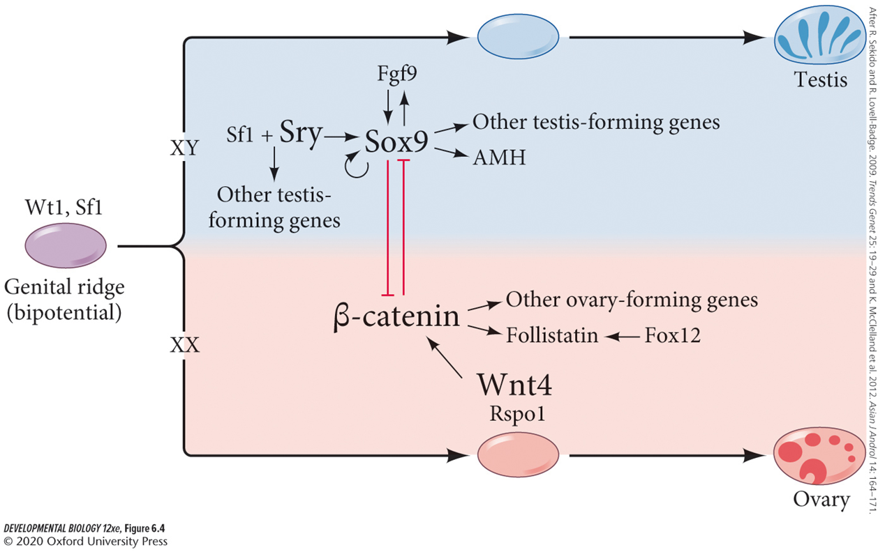
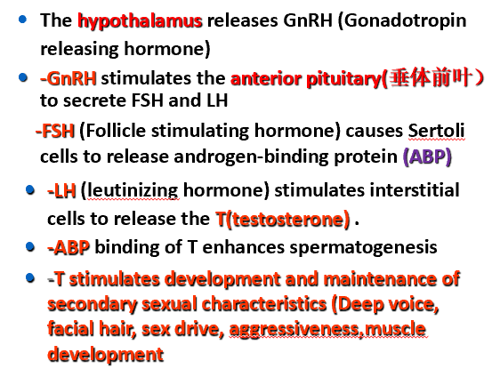

# 发育生物学

## 绪论

### 一、发育的概念

发育（development）是指**多细胞生物**的受精卵通过细胞的增殖、分化，从无到有，从简单到复杂，自我构建和自我组织生命个体结构的过程以及在这一过程中的各种复杂的变化。

胚胎发育就是按照严格的时空时序将这些遗传密码转换为实际的形态、结构和功能的过程，即基因型（genotype）转换为表型(phenotype）的过程。

### 二、发育生物学的发展

#### （一）先成论和后成论

1. 后成论或渐成论（epigenesis）

   认为胚胎是由简单到复杂逐渐形成的。

2. 先成论（preformation)

   认为胚胎预先存在于精子中或卵子中，发育不过是长大而已。

   混血？杂交？

#### （二）比较胚胎学的发现：各种动物的发育有共同性

1. Wolff：《发生论》

2. von baer法则

   （1）在动物胚胎中动物的一般特征比特化特征出现早；

   （2）从一般的特征发育出较特化的特征，最后发育出最特化的特征；

   （3）给定物种的的胚胎并不经历其他低等动物成年期特征的发育阶段，而是逐渐远离低等动物成年期的特征；

   （4）因此，高等动物的早期胚胎并不像低等动物的成体，而只是与其早期胚胎相似。

3. 演化胚胎学

4. 脊索：无脊椎动物到脊椎动物进化的发育证据

5. Homologous 同源和Analogous 类似

6. 畸形学

#### （三）实验胚胎学

1. 决定子假说：合子的细胞核含有大量的特殊的信息物质，决定子。在卵裂的过程中这些决定子被不均匀地分配到子细胞中，导致细胞具有不同的发育命运。**镶嵌型发育**
2. 缺失实验
   - 镶嵌发育？
3. 分离实验
   - 存在调整型发育机制
4. 复杂的联合实验
5. 体外诱导实验
6. 细胞谱系追踪
7. 细胞移植实验

#### （四）细胞生物学，遗传学，分子生物学，显微成像学等学科进步推动现代发育生物学的发展

发育以细胞作为活动的基本单位

发育过程中遗传物质传递的基本细胞学机制

遗传学的发展，让可遗传突变体揭示不同基因在发育中的作用 

### 三、动物发育的基本过程

•**Fertilization** **受精**

•**Cleavage** **卵裂期**

•**Gastrulation** **原肠期**

   **(endoderm, mesoderm, ectoderm)**

•**Organogenesis** **器官发生**

•**Metamorphosis** **变态**

•**Gametogenesis** **配子发生**

•**Regeneration** **再生**

•**Ageing and Senescence** **衰老**

### 四、发育生物学的八个基本问题

•**The question of differentiation**细胞分化

•**The question of morphogenesis**形态发生

•**The question of growth**生长

•**The question of reproduction**生殖

•**The question of evolution**进化

•**The question of environmental integration**适应环境

•**The question of tissue or organ regeneration**再生

•**The question of ageing**衰老

### 五、用于发育生物学研究的主要模式动物

#### （一）模式动物主要特征

1. 适合于生命科学研究并具有代表性

2. 对环境和人类无害，容易在实验室养殖

3. 世代周期短，可产生大量子代，遗传背景清楚，可进行遗传操作

4. 容易进行实验，特别是表型观察

#### （二）模式动物介绍

1. 海胆：用于受精机制研究，早期胚胎发育
2. 线虫：胚胎发育、性别决定、程序性细胞死亡、行为、寿命
3. 果蝇：遗传学、基因表达调控、神经元退化相关疾病、药物成瘾、衰老与长寿、学习与记忆
4. 非洲爪蟾：用于胚胎诱导与细胞相互作用研究
5. 斑马鱼：早期胚胎发育、器官发生、器官再生、疾病模型、药物筛选、毒性检测
6. 小鼠：药物发现、癌症生物学、发育与繁殖、免疫学、代谢、衰老、器官移植

### 六、发育生物学的主要研究思路和方法

#### （一）研究基因功能方法

1. 正向遗传学：遗传突变体筛选和突变基因克隆

   （1）物理或化学诱变剂诱导的遗传突变

   - 化学诱变：ENU（动物）和EMS（植物）

   - 图位法克隆突变基因

     - 遗传图谱

     - 不同类型的遗传标记

     - 基本原理：通过连锁互换，确定遗传距离

     - 找到突变基因：在此区域有几个基因，是否有候选基因，cDNA测序，找到突变

     - 互补实验验证是否是由于此基因突变造成的表型：野生型基因拯救

   （2）DNA随机插入引起的基因突变

   - T-DNA或转座子介导的DNA插入
   - 通过引入RNA剪切的接受位点，将T-DNA引入基因外显子中
   - 克隆插入位点基因的方法
     - Tail PCR
     - Inverted PCR
     - Linker-Mediated PCR

2. 反向遗传：敲除或敲低某个基因的不同方法

   （1）基因敲除基本原理

   （2）siRNA和miRNA特异基因敲低

   （3）反义吗啉代核苷酸基因敲低

   - 可阻止蛋白翻译
   - 可改变mRNA的剪接

   （4）基因编辑技术

   - DSB的修复：同源重组和非同源末端连接
   - 在细胞系中，构建CRISPR/Cas9基因编辑体系，实现高效目标基因编辑

   （5）以核酸酶失活的Cas9为平台的基因表达调控系统

   - CRISPR i/a

   （6）CRISPR-based RNA编辑技术：单一切割结构域

   - C2c2是一个以RNA为指引靶向RNA的单一核酸酶，是细菌针对RNA病毒的免疫系统
   - CRISPR-Cas13 + gRNA
   - dCas13 + gRNA 目标RNA碱基修饰系统

   （7）显性负突变：受体、转录因子

   （8）利用光照调控：基因表达、信号和离子通道

3. 怎样研究胚胎致死基因在后期发育中的作用

   （1）温敏突变体

   （2）有丝分裂重组

   （3）基因条件性敲除

   - Cre/loxP
   - 组织特异性启动子或可诱导型启动子：启动Cre表达
   - 条件性：特定时间、特定细胞

   （4）组织特异性或诱导型启动子

   （5）遗传补偿效应

   - 敲低一个基因会造成明显发育异常（出现表型），完全敲除此基因反而没有表型
   - 相关基因仅仅只在突变体中表达上调，从而弥补脱靶基因功能缺失
   - 分子机制：NMD（降解）……

4. 基因增益:过表达和异位表达研究基因功能

   - 强启动子
   - 双转基因系统可克服转基因致死，以及具有放大等作用
   - 化学诱导体系
   - 异位表达

#### （二）研究基因互作的方法

1. 基因芯片技术

2. 原位杂交检测RNA表达

3. 免疫组化检测蛋白表达及亚细胞定位

4. 染色体免疫共沉淀测序

5. 双突变体、三突变体、多突变体研究基因功能互作

6. 蛋白与蛋白之间互作

   （1）酵母双杂交

   - 构建两个表达载体：
     - DNA结合域+目标基因的融合蛋白
     - 转录激活域+寻找与目标蛋白互作文库
   - 如果两蛋白之间能够形成复合体，则报告基因就能表达

   （2）免疫共沉淀

   - 采用识别目标蛋白特异抗体
   - 检测拉下蛋白：Western或蛋白测序找到或验证与目标蛋白互作的蛋白
   - 无抗体，加标签

   （3）荧光共振能量转换（FRET）

   - 共同表达两融合蛋白:目标蛋白A+CFP与目标蛋白B+YFP
   - 激发

7. 蛋白与DNA之间互作

   - ChIP、酵母单杂交、EMSA
   - 已知启动子，如何寻找调控的转录因子：酵母单杂交
   - 酵母单杂交
     - 构建已知启动子启动报告基因
     - 表达融合蛋白：文库+GAL4转录激活蛋白
   - 电泳位移实验

8. 蛋白与RNA之间互作

   - RNA immunoprecipitation
   - RNA gel shift
   - Yeast three hybrid system
     - 通过构建三个表达载体找到（或证明）与已知长非编码RNA结合蛋白
       1. 融合蛋白：已知DNA 结合域+已知非编码RNA结合蛋白；
       2. 融合非编码RNA：已知非编码RNA+目标非编码RNA；
       3. 融合蛋白文库：蛋白文库+转录激活域
       
       

9. RNA-RNA and RNA-DNA 之间互作

   - Southern
   - Northern
   - FISH
   - FRET

#### （三）通过遗传方法进行细胞谱系追踪

1. 构建两个转基因：
   - 由心肌细胞特异表达的启动子cmlc2（cardiomyocyte light chain 2基因）启动表达可诱导的Cre(CreER); ER为脱皮激素受体，CreER为融合蛋白，该融合蛋白Cre重组酶只有在脱皮激素诱导下才能进核发挥重组作用；
   - 由泛表达启动子β-actin2启动表达：loxP-DsRed-loxP-EGFP报告基因；没有Cre作用下，所有细胞只翻译红色荧光蛋白；当Cre重组酶起作用时，切掉Dsred，细胞及其后代细胞永远只表达绿色荧光蛋白
2. 细胞谱系追踪证明心脏再生来源于心肌细胞增殖

#### （四）单细胞测序

## 第二章 特征的特化：发育模式的机制

### 三胚层动物早期发育基本过程

- 细胞分化
- 细胞定型或命运决定
- 器官发生

### 卵裂的方式

1. 卵裂：受精卵经过多次重复的有丝分裂形成很多细胞的过程
2. 卵裂球或分裂球：卵裂所形成的细胞
3. 卵裂的方式与卵黄的含量和分布有密切的关系

卵裂→囊胚→细胞通过运动分成不同胚层

### 胚层形成与器官发生

- 囊胚的细胞通过细胞迁移，重新排列和再组合，形成双胚层或三个胚层的胚胎，叫做原肠胚（gastula）
- 在这一过程中，囊胚的部分细胞通过不同的方式迁移到囊胚内部，形成原肠。留在外面的的细胞组成的胚层称为外胚层（ectoderm），迁移到内部的细胞组成的胚层内胚层（endoderm）或中内胚层（meso-endoderm）
- 由囊胚形成原肠胚的细胞运动或迁移过程称为原肠形成或原肠作用（gastulation）；也称为形态发生（morphogenesis）

### 原肠期细胞运动方式

内陷、内卷、内迁、分层、外包

### 三胚层形成以及各自细胞分化

在胚层形成的基础上，细胞进一步分化

细胞分化是胚胎不同组织、器官和系统等结构形态发生的基础

### 细胞分化（differentiation）

由同一个受精卵分裂、增殖而来的胚胎细胞经过多个相继的发育阶段（如三胚层动物：囊胚、原肠胚、神经胚等），逐渐出现差异，产生许多形态结构、生理功能和生化特征都不同的细胞类型

需要通过细胞定型（Commitment）的阶段

### 细胞定型（commitment）

指细胞被赋予特殊的“使命”或“命运”，并进入程序性分化的过程。在这一阶段，细胞虽然还没有显示出特定形态的、生理的和生化的特征，但是已经确定了向特定方向分化的程序

包括细胞特化specification和细胞命运决定deternmination

#### （一）分化之前先有细胞命运的特化与定型

 **细胞的特化（specification）**：细胞已经向特定类型细胞转变，但细胞的命运仍可被外界信号逆转。

**细胞命运决定或定型（determination or commitment）**：细胞已经确定了分化方向，并进入了特定类型细胞的分化程序，其发育命运在正常发育过程中已不可逆转。

果蝇的**器官芽或成虫盘**是幼虫中一些还没有分化但已决定了分化方向的细胞团。移植实验。

- 决定状态是非常稳定的；
- 在正常状态下，胚胎细胞的命运被决定以后，  就丧失了发育成其他类型细胞的潜能，成为特定类型的干细胞。

**首先是命运特化，然后是命运决定，最后是细胞分化**

#### （二）特化的三种基本方式

1. 自主型（镶嵌型）特化

   （1）定义：由卵裂球所分得的形态发生决定因子决定 ，称为自主特化。

   （2）特点：

   - 整体胚胎像是自我分化的各部分组装在一起的集合体

   - 分裂球不管在体内，还是分离出来在体外都发育成同种细胞。胚胎将缺失此分裂球的子代细胞
   - 镶嵌发育

   （3）镶嵌型胚胎发育的形态发生决定子与细胞质定域

   - 海鞘胚胎细胞发育命运是由其所含有的细胞质形态决定子决定，而不是由细胞核的来源决定

     - 海鞘类动物受精卵不同的细胞质区域含有特殊的形态发生决定子。卵裂时，这些组分被准确地分布到胚胎的一定部位，通过调控不同基因的表达而决定细胞的分化方向。

     - 呈典型的镶嵌型胚胎发育动物卵子还有栉水母、环节动物，线虫和软体动物等。在这些典型的镶嵌型发育的动物卵子细胞质中。都存在着形态发生决定子。

   - 细胞剔除、分离实验

2. 条件型（调节型）特化

   被囊动物的神经系统是以条件性特化的方式产生的

   （1）定义：胚胎发育过程中，相邻细胞之间通过相互作用，决定其中的一方或双方的分化方向。

   （2）特点：

   - 在胚胎发育的早期，从采用这种方式发育的胚胎上分离出一个卵裂球，则胚胎上的其他相邻的卵裂球可以调整和改变发育命运，填补分离掉的卵裂球所留下的空缺，使其仍然可以发育成一个完整的胚胎
   - 相互作用包括细胞间接触、分泌的信号或其局部环境的物理特性

   （3）调整型胚胎发育的细胞质定域

   - 海胆：动物极和植物极含有不同的形态发生决定子。这种决定子在8细胞时分离

   （4）调整型发育的胚胎中也存在形态发生决定子的细胞质定域

   - 两栖类的卵子在受精后会因细胞质流动而形成一个灰色新月区
   - 灰色新月区含有合子形成完整胚胎所必须的形态发生决定子
   - 镶嵌型发育胚胎和调整型发育胚胎之间的差异只是程度上的不同

   （5）哺乳动物卵裂球命运的决定：细胞所处的位置

   - 哺乳动物的卵是调整型卵子，卵裂期间没有明显对以后的发育分化起决定作用的形态发生决定子的细胞质定域
   - 用传统手段将卵裂球分离培养，证明哺乳动物胚胎2细胞，4细胞及至8细胞的单个卵裂球都具有发育成滋胚层和内细胞团的两种可能性
   - 用二个或多个卵裂球聚合成嵌合体胚胎，发现发育的方向是由细胞所在的位置决定的
   - 卵裂球的发育命运取决于其在胚胎中所处的相对位置

3. 合包体特化

   （1）定义：含有很多核的细胞质称为一个合胞体，在这样一个合胞体中预定细胞命运的特化

   （2）特点：

   - 合胞体胚盘
   - 未来细胞的特征沿胚盘的前 - 后轴方向同时建立在胚胎的合胞体胚盘内部。
   - 合包体特化是通过受精卵中形成素梯度来实现的（细胞质决定因子）
   - 核之间的相互作用及决定因子在量上的差异特化细胞的命运
   - Bicoid（前高），Nanos、Caudal（后高）

   

### 母源基因效应

母体基因控制个体早期胚胎发育并决定了胚胎形体发育的体轴和胚胎的细胞分化大格局

- 母体基因在卵子发生过程中已编码好了早期卵裂及发育的程序。因此，在卵子受精后去除或破坏合子细胞核，无核的受精卵仍能正常发育成囊胚
- 母体基因决定了胚胎形体发育的体轴或胚胎的细胞分化大格局

## 第三章 不同基因的表达：细胞分化的机制

### 一、定型、决定、分化并不是遗传物质的不可逆的改变

蛙肠上皮细胞核移植

克隆羊多莉

可诱导型多能干细胞

时间-空间机制是发育的基本特征

### 二、基因表达的转录调控

不同组蛋白修饰（不同位点甲基化、乙酰基化等）

转录因子，转录激活因子，转录抑制因子等

DNA甲基化与印迹基因

- 启动子区域DNA甲基化抑制基因转录

- DNA甲基化通过改变组蛋白修饰调控基因表达

基因组印迹：在配子发生过程中几乎所有基因组的DNA序列上的修饰(甲基化）都被抹掉。但还有部分基因（哺乳动物中大约有100个此类基因）DNA存在着甲基化，但在不同配子（精子和卵子）中是不同的，有些仅在精子中被甲基化，有些仅在卵子中被甲基化。这些基因在早期胚胎发育中剂量非常重要只有适当剂量，胚胎才能正常发育，多了少了都不能，从而确保子代是通过有性生殖而产生。

### 三、基因表达的转录后调控

1. mRNA不同剪接，转运调控
2. mRNA稳定性，翻译效率调控
3. mRNA修饰（比如A6-甲基化）：稳定性与翻译效率

### 四、基因表达的蛋白翻译后调控

## 第四章 细胞与细胞之间的通讯：形态发生的机制

### 一、形态发生

#### （一）概念

发育不仅仅只是细胞分化，不同细胞不是随机排列在机体内，而是有机的整合成具有三维空间结构特征、特定功能的不同组织和器官。不同组织形式的构建就是形态发生。

#### （二）细胞之间通讯

细胞与细胞之间的互作，都源于细胞膜释放的信号，和细胞膜接收的信号

近分泌相互作用：一个细胞表面的膜蛋白与相邻细胞表面的受体蛋白相互作用；

旁分泌相互作用：一个细胞合成分泌的蛋白可以扩散一段短的距离而诱导相邻细胞的变化；

配体和受体

近分泌又可分为同种结合和杂合结合

#### （三）细胞粘附和分选

不同细胞有选择的亲和性

细胞有能力迁移、分选到正确的胚胎发育位置

这些能力对于形态发生极为重要

**细胞互作热动力学模型**

- 细胞聚集依赖于自由能最低假设
- 细胞粘附力大的细胞倾向于聚集在内部
- 细胞粘附力相似趋向于随机排列

#### （四）钙粘蛋白和细胞粘附性

钙粘蛋白是钙依赖的粘连分子，胞内通过连环素（catenins）连接肌动蛋白（细胞骨架）调节细胞形态和迁移

5种钙粘蛋白介导钙依赖的同型细胞粘附

钙粘蛋白数量决定相同细胞群体细胞迁移和聚集位置

#### （五）细胞外基质：发育信号的一种来源

胶原蛋白，蛋白聚糖，糖蛋白（纤连蛋白），层黏连蛋白

#### （六）整合素：胞外基质的受体

上皮-间充质转化：神经嵴细胞、中胚层细胞

#### （七）细胞信号传导

相邻细胞之间通过相互作用，决定其中的一方或双方的分化方向，是胚胎发育过程中基因选择性表达调节和整体协调控制的主要机制之一

#### （八）诱导与感应能力

在紧邻区域中两种或多种细胞的相互作用称为诱导

每一个诱导过程涉及两个部分的相互作用：

- 第一部分是诱导者(inducer)，即发出信号引起其他组织的细胞改变行为的组织；
- 第二部分是感应者（responder），即被诱导的组织。

被诱导组织对特定的诱导信号进行应答的能力称为感应能力

 感应性并不是一种被动的状态，而是一种主动的状态。在被诱导组织的细胞中存在**感应因子**

初级诱导：中胚层诱导背部外胚层神经发生

次级诱导：如视泡诱导头部表皮细胞晶体板发生

诱导互作两种模式：指导性和允许性

- 指导性相互作用：来自诱导细胞的信号对启动感应细胞中新基因的表达是必须的，没有诱导细胞，感应细胞就不能按特定的途径分化。如视泡对晶状体的诱导即是。
- 允许性相互作用：感应细胞已经特化了，只需要一种环境允许这些特性的出现。如上皮细胞与间充质细胞的相互作用

#### （九）旁分泌因子：诱导分子

对于早期胚胎发育来说，主要是旁分泌信号和近分泌信号

**可扩散的蛋白称为旁分泌因子或生长分化因子**

自分泌调节，即细胞分泌的旁分泌因子在自身的细胞膜上有反应受体

- 成纤维生长因子家族
- Hedgehog家族
- Wnt家族
- TGF-β超级家族

#### （十）成型素梯度

成形素一般指的分泌细胞外的可溶性分子，由于扩散浓度的梯度可诱导临近细胞产生不同的细胞命运；对于合包体发育形式来讲，胞内分子比如转录因子梯度同样被认为是成形素

#### （十一）信号传导级联反应

#### （十二）不同细胞膜受体类型

1. 离子通道偶联受体
2. G蛋白偶联受体
3. 酶偶联受体

#### （十三）受体酪氨酸激酶

酪氨酸蛋白激酶途径

- 受体酪氨酸激酶（RTK）
- 非受体酪氨酸激酶（NRTK）（受体本身没有酪氨酸激酶活性，但接头分子有此酶活性）

#### （十四）旁分泌诱导分子信号传导

1. 成纤维生长因子家族（fibroblast growth factor, FGF）受体酪氨酸激酶

   - 一般机制：FGF配体二聚体通过细胞外基质转运，与FGF受体结合一个受体，受体将形成二聚体，二聚体将休眠酪氨酸激酶激活，自生磷酸化，自生磷酸化将招募接头蛋白，激活小G蛋白Ras，再激活所谓MAP激酶途径，最后磷酸化转录因子，磷酸化的转录因子将转录目标基因。
   - 非受体酪氨酸激酶：JAK-STAT通路，酪蛋白基因激活。FGF信号也可通过磷酸化STAT激活此通路

2. Hedgehog家族 

   （1）分类：

   - **sonic hedgehog(shh)：尤其在神经胚发育阶段对神经管的分化以及对附肢的形成具有关键的调节作用**
   - desert hedgehog(dhh)：Dhh蛋白在精巢的支持细胞中表达，小鼠的dhh无功能纯合突变体会出现精子发生的缺陷
   - indian hedgehog(ihh)：ihh蛋白在消化管和软骨中表达，在出生后的骨发育中有重要作用

   （2）通路：

   - 在其受体Patched蛋白没有被hedgehog结合时，信号传导者蛋白Smoothened被其抑制而无活性，Ci蛋白被固定在感应细胞的微管上而被裂解，被裂解的Ci进入细胞核后成为转录抑制因子。
   - Patched被hedgehog结合后，不再抑制Smoothened蛋白，Ci被从微管上释放而不会被裂解。未被裂解的蛋白进入细胞核后成为同一个基因的激活因子

3. Wingless或Wnt家族

   Wnt家族是一类富含半胱氨酸的糖蛋白家族

   Wnt蛋白也需要加工，棕榈酰化，分泌与Hedgehog类似：自由扩散，外吐，和脂蛋白微粒

   作用途径：

   （1）经典的Wnt途经（canonical Wnt pathway）：依赖于激活β-catenin, β-catenin进核促进下游基因转录；

   （2）非经典Wnt途径：通过激活Rho GTPase，从而改变细胞的形状、极性和运动能力；

   （3）促进钙离子释放：Frizzled受体激活一种磷脂酶C（PLC），释放二脂甘油和3磷酸肌醇（IP3）,IP3使钙离子从细胞内质网中释放出来。游离的钙离子可以激活一些酶、转录因子和翻译因子

4. TGF-β 超级家族

   包括TGF-β家族，Nodal、活化素(activin)家族，骨形态发生蛋白(BMPs)家族，VG1家族以及其他几种蛋白质

   作用机制：

   - TGF-β配体结合到TGF-β受体II上后，TGF-β受体II二聚化就可以和二聚化TGF-β受体I结合。一旦这两个受体紧密接触，受体II便将受体I上的一个丝氨酸或苏氨酸磷酸化而使受体I被活化。被活化的受体I可以使Smad蛋白磷酸化。
- 这些被磷酸化了的Samd蛋白与Smad 4结合而形成能进入细胞核的转录因子复合体。TGF-β家族中的BMP激活Smad 1、5；TGF-β、活化素和Nodal蛋白则使Samd2、3磷酸化。

#### （十五）旁分泌因子的运输

细胞外扩散机制：分泌到细胞外的旁分泌因子，并不能自己自由扩散，往往需要其它蛋白或蛋白聚糖结合保护才能扩散

通过聚焦膜突出作为信号源机制

​    1. 初级纤毛8+0

​    2. 丝状伪足

细胞外囊泡、迁移小体

#### （十六）近分泌信号途径

Notch

Cadherins

Ephrins

## 第五章 干细胞：潜能与干细胞巢

干细胞：具有细胞分裂自我更新能力，并且子代细胞有能力发育和分化成各种不同细胞。

存在不同组织或器官中的多功能干细胞称为组织特异干细胞

### 一、干细胞的自我更新和成熟分化

### 二、分裂或不分裂：干细胞调节机制

干细胞巢

物理机制：巢结构改变，胞外基质，粘附因子，细胞间机械力，细胞密度等能够改变干细胞行为

化学调节：微环境中内分泌，旁分泌，近分泌各类因子

细胞质决定因子，例如：不对称分裂；

转录调控；

表观遗传调控；

### 三、胚胎干细胞(全能干细胞）

内细胞团（ICM）

囊胚期内细胞团建立

滋养外胚层细胞不对称分裂

**Hippo信号通路和ICM发育**

### 四、动物成体干细胞巢

果蝇卵巢干细胞巢持续补充卵母细胞

肠道干细胞及调控因子

- 细胞谱系追踪观察肠道干细胞巢与细胞更新，克隆的形成

成体造血干细胞巢模型

### 五、干细胞应用

再生医学：利用干细胞补充体内细胞死亡

研究人类疾病发生

类器官培养

- 通过体外培养将全能干细胞培养成具有一定的三维结构，含有多种细胞类型，类似与体内某种组织或器官的结构，并具有与体内相似的功能，我们称之为类器官

## 第六章 性别决定与配子发生

### 一、性别决定

**性别由染色体决定，但有些动物类群，其性别由环境决定。**

#### （一）染色体决定性别的类型

1. 大多数哺乳类（XX: 雌性；XY:雄性）
   - 在原生殖细胞进入发育中的生殖腺（此时也称为生殖脊），继续增殖2-3天。此时它们开始决定自生发育方向及发育成卵子或精子
   - 决定于生殖脊是发育成卵巢或精巢
   - Y-染色体上一个单一的基因起着重要的决定作用
2. 鸟类（ZZ:雄性；ZW:雌性）
3. 果蝇（X/常染色体比值：≤0.5 雄性；≥1.0 雌性）

#### （二）初级性别决定和次级性别决定

1. 初级性别决定指的是由胚胎中是否产生卵巢或睾丸决定的性别
   - 哺乳动物初级性别决定取决于染色体：Y-染色体上的睾丸决定因子（TDF）调控生殖脊发育成睾丸而非卵巢
2. 次级性别决定指的是由性激素调控的雌雄表型
   - 次级性别决定是指生殖脊外生殖器官表型：雄性（阴茎，精囊，前列腺），雌性（阴道，子宫颈，子宫，输卵管，乳腺）；通常由生殖脊分泌的激素决定

3. 哺乳类胚胎发育早期具有两套生殖系统，具有向雄性或雌性发育的潜能

#### （三）哺乳动物初级性别决定的机制

1. SRY

   - Y染色体上的性别决定区域
   - 编码人类的主要精巢决定因子
   - 基因位于Y染色体的短臂上
   - RNA剪接？转录因子？

2. SOX9：常染色体上的睾丸决定基因

   - SOX9是常染色体上能诱导精巢形成的基因，也是一个转录因子含有an HMG box
   - 仅在精巢中表达
   - 功能
     - 能结合到自身启动子上而维持自身的转录；
     - 直接和间接阻断β-catenin诱导卵巢发育
     - 结合到许多调控精巢形成基因的调控序列上；
     - 结合到抗Mullerian激素基因(AMH)的启动子区域上，在通向雄性表型途径上提供了关键的连接。
     - 启动调控精巢形成的关键旁分泌因子Fgf9基因的表达，Fgf9又是维持Sox9基因表达所必须的，由此形成了驱动雄性发育途径的正反馈回路。

3. SRY可能的作用机制

   - 将生殖脊上皮细胞转换为雄性特异的支持细胞
   - 与Sox9调控fgf9表达
   - 诱导生殖脊细胞释放趋化因子使中肾细胞迁移到XY性腺
   - 中肾细胞诱导生殖脊上皮细胞成为支持细胞

4. 常染色体上的WNT4基因决定卵巢的发育

   - Sry可能通过抑制Wnt4来形成睾丸
   - WNT4通过促进DAX1表达，让其性腺发育成为卵巢

5. 哺乳动物性腺性别决定起始可能的机制

   

#### （四）哺乳动物次级性别决定

次级性别决定：在旁分泌因子和激素调节下外生殖器官，生殖导管等第二性征的形成

Wnt信号促进男性，与初级性别决定不同

次级性别决定有两个时期：一是在胚胎发生的器官发生期；二是在青春期

雄激素不敏感综合征

哺乳动物X-染色体失活 

#### （五）果蝇的性别决定

没有激素介导产生表型，所以是**通过X染色体上的雌性决定子和常染色体上的雄性决定子的平衡来实现的**

如果二倍体果蝇细胞中只有一条X染色体（1X ：2A），则发育成不育的雄性果蝇。如果二倍体果蝇细胞中有两条X染色体（2X：2A），则发育成雌性果蝇

在果蝇中Y染色体不参与性别的决定。但Y染色体上有能在成体精子形成时表达的基因。

1. **Sxl基因（性致死基因）**

   （1）激活表达

   - 雌性的XX型果蝇中，sxl基因在受精后两小时内即被激活。XY则不

   - X染色体上基因编码的一些“分子蛋白” 激活Sxl基因的雌性特异活化。sisterless-a、sisterless-b

   - “分母蛋白” 是常染色体上基因编码的蛋白质，包括Deadpan和Extramacrocheatae

   - X：A比例是通过X染色体基因编码的激活因子蛋白与常染色体基因编码的抑制因子蛋白竞争sxl基因的早期启动子来测定的

     

   - 晚期启动子激活，雌雄均表达sxl
   - 早期合成的性别致死蛋白来自以第 3 外显子缺失的方式被剪接的 RNA，所以早期的 XX 胚胎具有完整和功能性的性别致死蛋白
   - 在 XY 细胞中，早期启动子没有活性，因此没有早期的性别致死蛋白，产生无功能的性别致死蛋白。
   - 性别致死蛋白是一个剪接因子，能起始一个级联的 RNA 加工事件，最终产生雄性和雌性特异的转
     录因子

   （2）靶点

   - 性别致死基因自身的前体RNA
   - 调控剂量补偿的msl2基因
   - transformer(tra) 基因的前体 RNA（转换者基因）
     - 转换者基因的前体mRNA被Sx1剪接而产生雌性特异的mRNA，在雄性中因无Sx1存在而剪接成无功能的mRNA
     - 雌性特异的 Transformer(Tra) 蛋白与transformer-2(tra2) 基因的产物协同作用，以雌性特异的方式剪接双重性别基因，进而产生雌性表型

2. Doublesex，双重性别基因：性别决定的转换基因
   - 在雄性和雌性中均有活性，但其主要的转录物以性别特异的方式被加工
     - 如果 Tra2 和雌性特异性 Tra 蛋白都表达，雌性特异蛋白，激活雌性特异基因并抑制雄性发育
     - 没有功能性的 Tra 蛋白，雄性特异，编码一个抑制雌性特征和促进雄性特征的转录因子
   - 在XX型果蝇中，雌性Doublesex蛋白（DsxF）与intersex（Ix）基因产物一抑制负责制造雄性必须器官的FGF基因，激活负责制造卵黄蛋白的一些基因，启动精子储存管的生长，以及修饰bric-a-brac（bab）基因的表达而产生雌性特异的色素外观。
   - 雄性Doublesex蛋白（DsxM）可直接作为转录因子指导雄性特异路径的基因表达。这种蛋白质引起生殖盘的雄性区域生长和使雌性生殖盘区域萎谢，激活FGF基因以产生雄性附腺，将某些表皮结构转换成交合器，修饰bric-a-brac基因以产生雄性色素式样 

果蝇特异四种mRNA剪接决定性别（+fruitless基因—求爱方式）

#### （六）环境决定性别

1. 爬行动物中的温度决定性别
   - 大多数蛇和蜥蜴是性染色体决定，但是大多数乌龟和所有鳄鱼是有受精后环境决定
   - 乌龟蛋发育过程中特异时间段时的温度是性别决定因子，小的温度改变会改变性别比例
2. 芳香化酶和雌性激素的生产
   - 爬行类和鸟类的初级性别决定是激素依赖型的。雌激素是卵巢发育必须的
   - 即使是在雄性化温度下，雌激素也可以超越温度的影响诱导卵巢发育
   - 能将睾酮转换成雌激素的芳香化酶在温度依赖型性别决定中起关键作用
   - 芳香化酶是在胚胎的两个主要区域，即性腺和脑中产生。脑中芳香化酶活性与温度和雌性相关

### 二、原始生殖细胞的迁移

在那些生殖细胞在发育早期即与体细胞分开而建立起了生殖细胞系的有机体中（昆虫、蛔虫、脊椎动物中），生殖细胞不是由性腺本身产生的。相反，生殖细胞的前体细胞，称为原生殖细胞（primordial germ cells, PGCs）是在其他地方产生后迁移到发育中的性腺中的。

生殖细胞发生的第一步，包括原生殖细胞的形成和迁移到将形成性腺的生殖嵴中。

生殖细胞的决定方式：

- 在许多动物中（包括蛙类、线虫和飞蝇），原生殖细胞被卵子中的细胞质决定子自动特化；这些细胞质决定子在卵裂时被包裹在不同的细胞中
  - 特殊蛋白质和mRNA。生殖质，具有一定形态结构的特殊细胞质成分，分布在卵或胚胎的一定部位
  - 惰性基因假说：生殖质中的成分抑制转录和翻译，因而阻止细胞分化成任何其他的类型。
- 在其他一些动物，如蝾螈类和哺乳类动物中，生殖细胞通过与相邻细胞的相互作用而特化。

**原始生殖细胞是胚胎早期产生的具有分化为生殖细胞潜能的体细胞**

- 很多物种，PGC迁移到性腺是双性的（及可以发育成精子或卵子），这取决于性腺的环境
- 趋化因子诱导对于PGC迁移是必需的

### 三、减数分裂

视黄酸决定减数分裂和哺乳动物生殖细胞分化

联会复合体形成与解体：SYCP1，分离酶

### 四、哺乳动物的精子发生

#### （一）精子的结构

1. 头部
   - Acrosome顶体:
   - Nucleus核:

2. Midpiece中间部分
   - Centrioles中心体:
   - Mitochondria线粒体:

3. Tail尾部: 
   - flagellum鞭毛
   - Microtubules微管:

#### （二）精子发生

精子发生，指的是由精原细胞经过增殖和减数分裂发育为形态上成熟的精子的过程

支持细胞、精原细胞、间质细胞、成纤维细胞、初级精母细胞、次级精母细胞、精细胞

A型精原细胞通过细胞质桥连接，细胞也可以脱离再次形成干细胞；支持细胞分泌GDNF使干细胞进行有丝分裂；BMP和Wnt信号诱导A型精原细胞分化成精子

B型精原细胞含有高水平Stra8,是最后进行有丝分裂的细胞，在进行最后一次有丝分裂后成为初级精母细胞，走向减数分裂，每个初级精母细胞进行第一次减数分裂产生两个次级精母细胞，每个次级精母细胞完成第二次减数分裂产生两个单倍体细胞（**此单倍体细胞成为精细胞，它们仍然以细胞质桥连接**）

1. 精子发生起始：在青春期，精原细胞合成BMP8b调控精子发生的起始

2. 四大阶段

   （1）二倍体增殖

   - 从精原细胞向精母细胞的转化可能是由支持细胞分泌的胶质细胞系营养因子GDNF的浓度水平调节（高-精原，低-精母）
   - GDNF受促滤泡素FSH调节
   - 细胞质桥保证了精子发育的同步性

   （2）初级精母细胞：初级精母细胞生长（生长期）；细胞体积有所增大，核中进行一系列减数分裂前期的复杂变化

   （3）次级精母细胞：一个初级精母细胞进行减数第一次分裂形成两个次级精母细胞，次级精母细胞完成减数第二次分裂产生四个单倍体精子细胞

   （4）精子变形：完成减数分裂
   
   - 随着精细胞向腔内迁移，它们将失去细胞质桥及与其它细胞联系，分化成精子，这个过程叫精子变形期
   - 过程：
     - 核中染色质上的组蛋白被鱼精蛋白取代，染色质高度浓缩；
     - 高尔基体在核的前端形成顶体泡；
     - 线粒体向核的后端集中形成线粒体环；
     - 核的后端由中心粒形成鞭毛
     - 细胞质抛弃

#### （三）体细胞在配子发生中的作用

1. 支持细胞

   （1）与发育中精子紧密联系：N-钙粘蛋白，缝隙连接，细胞质通道

   （2）营养，支持和保护发育中的细胞

   （3）产生雄激素结合蛋白（ABP）

   （4）将精子转运到内腔：控制精子发生率

   （5）增加雄性激素水平

   （6）分泌精液

   （7）建立血睾屏障

### 五、精子发生的激素调节

下丘脑-垂体-睾丸轴系

**睾酮** **testosterone**

**卵泡刺激素** **(FSH)** **、**

**黄体激素** **(LH)** **、**

**促性腺激素释放素**GnRH

机制：

- 下丘脑分泌促性腺激素释放激素GnRH，刺激垂体分泌FSH和LH
- LH可刺激睾丸中的间质细胞Leydig cell分泌睾酮，调节精子发生
- FSH通过与位于支持细胞表面的受体结合，作用于支持细胞促使其分泌雄激素结合蛋白(androgen binding protein, ABP) 。ABP结合睾丸酮，促进精子发生。作用于精原细胞

FSH在未成熟的睾丸发育中起着关键作用。

睾酮对FSH和LH的释放有反馈调节。

FSH与睾酮对青春期人类精子发生的起始以及在成年期维持正常的精子发生水平起重要作用。

睾丸酮对精子发生的调节是通过支持细胞或管周样细胞间接作用于生精细胞

#### 六、哺乳动物的卵子发生

卵子发生是指从卵原干细胞到形成成熟的卵子的分化过程 

1. 三个基本阶段

   - 增殖期：卵原细胞通过有丝分裂使卵原细胞的数目迅速增殖阶段。
     - 初级、次级
     - 当卵原细胞停止有丝分裂后，细胞核中发生一系列成熟分裂前期的变化，卵原细胞成为初级卵母细胞
   - 生长期：卵母细胞合成和积累大量早期胚胎发育所需要的营养物质和形态发生调控因子等细胞质成分，体积明显增加的时期
     - 小生长期：主要是细胞核中发生一系列减数分裂前期的变化，卵核膨大而特称为生发泡
     - 大生长期：也叫卵黄发生期，卵母细胞积累各种细胞质成分（主要是卵黄），体积明显增大的时期。
       - 在卵黄积累的同时，各种细胞质成分和细胞器不对称地分布
   - 成熟期：初级卵母细胞完成生长以后，在一些外部刺激因子如孕酮的作用下，解除了卵母细胞减数分裂被抑制在前期I的状态，进行减数分裂，发育为能接受精子并能正常发育的成熟卵子的过程。
     - 卵表成熟是指卵表物质分子的排列趋向规则化，皮层颗粒外部迁移到质膜的下面，以确保受精后卵子对精子的应答反应
     - 卵质成熟是指在激素刺激下，卵质中发生一系列变化，出现了包括“促成熟因子”（MPF）以及受精后正常发育所需要的某些因子
     - 卵核成熟是指在促成熟因子的作用下，减数分裂前期I的抑制状态解除，卵母细胞的生发泡破裂，一些与雌雄原核结合相关以及与受精后卵裂相关的因子进入细胞质。但卵核的成熟不以完成减数分裂为先决条件。

   卵黄积累：大部分发生在减数分裂I期，分为卵黄发生前期和卵黄发生期

   - 发生途径：由初级卵母细胞本身合成的途径，称为内源性合成途径；从卵母细胞以外的组织中合成后再进入卵母细胞的途径，称为外源性合成途径

2. 卵子减数分裂的特点

   - **细胞质不平均分配，**两个子细胞中的一个含有几乎所有的细胞质；而另一个则只保留了基本的细胞结构。小的细胞称为极体
   - 持续的时间一般很长
   - 在减数第一次分裂的双线期(减数分裂I前期）和减数第二次分裂的中期发生两次抑制
   - 多数动物的成熟卵子停留在减数第二次分裂中期等待受精；受精后才能完成减数分裂

   在第一次减数分裂前期结束时，细胞质桥消失，初级卵母细胞彼此分开，不再成为合胞体。其外为滤泡细胞所包围，称为初级滤泡。

3. 卵子发生的激素调节

   睾酮 testosterone、卵泡刺激素 (FSH) 、

   黄体激素(LH)、促性腺激素释放素GnRH

   雌激素（Estrogens）、孕酮（progesteron）

激素调节

卵泡形成、卵泡激活和卵泡闭锁

4. 卵母细胞减数分裂抑制和解除以及卵子成熟的调节机制

- 不管是有丝分裂还是减数分裂，进入细胞周期的M期都是由促分裂因子（mitosis-promoting factor，MPF也称为促成熟因子，maturation-promoting factor）调控的。
  - MPF由调节亚基cyclin B 和催化亚基P34组成；
  - cyclin B是一种周期性合成和降解的蛋白，P34是一种周期蛋白依赖型激酶
  
- 在减数分裂的前期I，卵母细胞被一种依赖于cAMP的蛋白激酶A（protein kinase A，PKA）所控制。在cAMP的浓度较高时，PKA被激活。这种处于激活PKA控制之下，cyclin B被分解，p34无催化活性，细胞不能进入M期而使卵母细胞的减数分裂抑制在前期I的双线期。

- 由于缺乏活化的MPF，卵母细胞减数分裂被抑制在双线期。孕酮激活c-mos蛋白而启动一个磷酸化联级反应过程，最终使MPF的P34亚基磷酸化而使MPF活化，驱动继续进行减数分裂。

  

- 第二次分裂又因CSF（cytostatic factor, 含c-mos和cdk2）抑制周期蛋白而被抑制在M期的中期。受精使钙离子释放，激活两种钙调素而使CSF分解，完成减数第二次分裂。

5. 卵母细胞中基因的转录：成长中的卵母细胞在活跃地进行基因转录
6. 灯刷染色体与mRNA合成：卵母细胞中合成的mRNA少部分立即有翻译活性，大部分不为卵母细胞翻译蛋白质，而是以核酸蛋白复合体（RNP）的形式储存在卵母细胞质中，到受精以后才具有翻译活性

7. 卵的极性
   - 卵的各种成分在卵子内不是均匀分布的，而是成梯度和区域性分布的，因而产生了卵子的极性。
   - 通常细胞核位于卵细胞质较多，营养物质较少的一极，这一极称为动物极
   - 其相对的一极营养物质较集中，称为植物极
   - 卵轴
8. 卵质的特点
   - 在质膜下的称为皮层或皮质（cortex），粘性较高，呈凝胶状态。细胞质其余的部分呈液态，称为内质（endoplasm）
   - 皮层中有一种特殊的颗粒，称为皮层颗粒。皮层颗粒在卵子受精中起重要的作用
   - 皮层对卵子的极性和对称性，对建立胚胎结构均具有重要的作用。在受精时皮层也有重要的作用

9. 附属细胞

   - 滤泡细胞：由卵巢的体细胞分化而来，包围在卵母细胞周围，称为滤泡上皮。也称为粒细胞层。

   - 营养细胞：也称为滋养细胞，是昆虫卵巢中特有的；由生殖细胞有丝分裂分化而来，并通过细胞质桥与卵母细胞相通

   - 作用

     

## 第七章 受精

受精是两性性细胞（配子 gamete）融合到一起而创造遗传了父母双亲基因组的新生命个体的过程。

精子的结构

卵细胞的结构

### 受精的主要过程

1. 精卵识别
2. 精子入卵，保证一个精子进入卵细胞
3. 遗传物质的融合
4. 发育的启动

### 一、海胆受精

#### （一）海胆精卵识别

**物种特异性精子吸引**：如何相遇

**物种特异性精子活化**：阻止和其他物种

1. 精子吸引：远距离作用
   - 在许多物种中，精子因**趋化性**而被吸向同种卵子，即精子跟随卵子所分泌的某种化学物质的浓度梯度而向卵子运动。
     - 精子激活肽Resact

2. 海胆受精的物种特异性识别：调节这种识别的海胆顶体蛋白称为**结合素**（bindin） 。卵膜上有结合素受体

   - 海胆物种特异性配子识别是在精子吸引、精子活化和精子附着于卵子表面这三个层次上进行的

3. 海胆的顶体反应

   - 海胆顶体反应是精子质膜与卵子胶膜接触而启动的
   - 胶膜中至少有三种成分在精子质膜顶体处有特异性受体

   - 顶体泡与精子质膜的融合，蛋白水解酶释放
     - 顶体泡的胞吐作用使蛋白水解酶释放，蛋白水解酶在胶膜上产生出一个通向卵子表面的通道
   - 顶体突起的伸出
   - 钙离子与顶体反应
     - 精子表面的精卵结合受体打开卵母细胞表面的钙离子通道，使钙离子大量流入精子头部
     - 精子质膜和顶体外膜的融合导致顶体内容物发生胞吐作用，钙离子介导
     - 顶体丝打开卵黄膜上的通道

#### （二）海胆的体外受精主要事件

**1、精子与胶体层结合；**

**2、顶体反应：精子的顶体通过胞吐作用释放顶体内的酶；**

**3、消化胶体层；**

**4、精子结合到卵黄膜；**

**5、顶体突起：与卵膜融合。**

#### （三）**配子融合与阻止多精受精**

海胆精子进入卵子的过程 ：在精卵接触处，卵子中肌动蛋白聚合伸出微绒毛，包裹精子的头部而形成受精锥。受精锥最终将精子拉入卵子内。

在海胆中，卵子细胞膜的所有区域都可以和精子融合。在哺乳类中，精子与卵子的接触不是在精子的顶端，而是在精子头部的侧面，被称为精子头部赤道区的地方

**海胆有两种机制避免多精受精**

（1）通过卵子细胞膜上膜电位的变化完成的快速反应机制

- 通过卵子质膜上的电位变化实现的
- 精子能与静止电位为-70mv的卵子质膜融合，但不能与静止电位为正的细胞膜融合
- 如果人工保持膜电位的负电性或环境钠离子的供应不足以有效引发膜电位的转换，就会发生多精受精
- **在大多数哺乳动物中可能不存在**

（2）由皮层颗粒胞吐作用引起的慢速反应机制

- 卵子皮层反应
- **卵子的皮层有很多由膜包围的小而圆的细胞器称为皮质颗粒或小泡，它们是在卵子发生过程中由高尔基体形成的。在卵子成熟过层中迁移到卵的四周，位于质膜下面。受精或人工激动一个主要的结果是皮质颗粒与质膜融合，导致皮质颗粒发生胞吐作用，这种现象称为皮质反应。**
- 多种蛋白质：胰酶样蛋白酶、粘多糖、过氧化物酶、透明素
- 游离钙离子启动皮层颗粒反应
  - 一旦受精，卵子内游离钙离子的浓度大大增加。在这种高钙离子的环境里，皮层颗粒膜与细胞质膜融合，释放其内含物
  - 一旦皮层颗粒的融合在精子入卵处开始，皮层颗粒胞吐作用的波就会围绕皮层向卵子的另一面迅速传布

#### （四）海胆受精后发生的事件

早期应答：早期应答发生在精卵接触后的几秒钟之内。包括皮层反应、受精膜形成和一系列代谢反应的激活。

晚期应答：发生在受精后数分钟之内。包括DNA合成和蛋白质合成。

与皮层颗粒反应相关的钙离子浓度和pH值的升高共同作用刺激新的蛋白质和DNA合成

#### （五）遗传物质的融合

雌性原核

雄性原核

- 精子核膜破裂、泡状化，使浓缩的染色质直接与卵子细胞质接触。
- 精子的染色质去致密。当精子与卵子胶膜中的一种糖蛋白接触，这种蛋白质可提高一些依赖于c-AMP的蛋白激酶的活性。这些蛋白激酶使精子特有的精蛋白的一些碱性氨基酸残基磷酸化，改变这些精蛋白与DNA的结合能力，从而被正常染色体组蛋白所替代。
- 核膜重建而形成雄原核

海胆雌雄原核融合事件

- 雄性原核转动180°，这样精子中心粒便处在了雄原核和雌原核之间。
- 然后，精子中心粒作为微管组织中心伸出自己的微管并整合卵子的微管形成一个星状体（aster）
- 这些微管伸展在整个卵子中并与雌原核接触，使雌、雄原核相互靠近。雌雄原核最终融合形成二倍体的合子核

### 二、哺乳动物的体内受精

#### （一）哺乳动物配子的结合和识别

哺乳动物的受精是在输卵管中进行的 。

哺乳动物的精子离开精巢时不具备使卵子受精的能力。

1. **精子在雌性生殖道内获得受精能力的现象称为精子获能**。
   - 精子获能的过程可能分为两步：第一步去掉一些附着在精子表面的胆固醇、氨基多糖。第二步是使精子质膜表面的糖蛋白发生改变，从而为顶体反应做好准备。
   - 精子获能可能与蛋白激酶A（PKA）等以及雌性生殖道内的受精促进肽等有关。
   - 已经获能的精子用精液处理又可去获能，失去受精能力,称为去获能
2. 透明带：透明带主要有三种糖蛋白，ZP1、ZP2、ZP3
   - 精子结合蛋白ZP3：与精子结合和在结合后启动精子的顶体反应；对精子附着于透明带
3. 顶体反应：当ZP3与精子细胞膜上的受体交联后就会诱导顶体反应
   - 激活精子细胞膜上的特异性G蛋白，启动一个开启细胞膜上钙离子信道和引起钙离子介导的顶体泡胞吐作用的联级反应
4. 穿过透明带
   - 通过在透明带上进行顶体反应，小鼠精子能够直接在附着处集中蛋白水解酶并通过消化作用在这一细胞外膜上形成一个通道
   - 在顶体反应过程中，精子前端的细胞膜，即含有ZP3结合位点的区域，会从精子上脱落下来
   - 精子与透明带的第二次结合是由顶体内膜上一些能与ZP2糖蛋白特异性结合的蛋白质来完成。因此顶体完整的精子不能与ZP2结合，而发生了顶体反应的内膜则可以
   - 切开ZP2对于阻止多受精是必需的

#### （二）受精主要事件

1. 精子在生殖道中被激活，精子获能；
2. 精子与透明带结合
3. 顶体反应：精子的顶体通过胞吐作用释放顶体内的酶；
4. 消化透明带；
5. 精子和卵膜融合

#### （三）遗传物质的融合

哺乳动物精子入卵时，卵母细胞的核正被抑制在第二次减数分裂的中期 。分别形成雌、雄原核后再结合。

**雄原核的形成：**精子核膜破裂；卵子细胞质中的谷光苷肽分解鱼精蛋白的二硫键，使精子染色质去致密，组蛋白取代鱼精蛋白；然后核膜重建而形成雄原核。

**雌原核的形成：**

在完成减数分裂后雌核的染色体分开；

每条染色体被膜所包裹，形成染色体小泡；

染色体小泡相互靠近，合并而形成雌原核。

两核相互靠拢移动，开始复制各自DNA

### 三、单性生殖

两性生殖物种必须经过雌雄交配，受精和雌雄原核的融合过程而才能繁殖后代。种群中必须有两种性别的个体

单性生殖主要有：孤雌生殖，雌核发育两种方式

- 孤雌生殖严格地说是指完全无精子参与作用，而仅仅借助于物理或化学因素的刺激而产生全部雌性后裔这样一种生殖方式
- 雌核发育是指单性生殖物种产出的卵子需经与近源两性种类雄性的精子激活后才能开始发育，但受精后不发生雌雄原核的融合，精子染色体被排斥掉而不参与到被激活卵基因组中，故仅由雌核的遗传物质主导发育过程这样一种生殖方式。

## 第八章 胚胎发育：卵裂、原肠运动和体轴形成

### 概述：胚胎发育的基本阶段

| **基本阶段**                    | **结果**               |
| ------------------------------- | ---------------------- |
| **卵裂**  **Cleavage**          | 细胞数增多；形成囊胚   |
| **原肠运动**  **Gastrulation**  | 三胚层分化；  体轴形成 |
| **器官发生**  **Organogenesis** | 形成各器官             |

### 一、卵裂

#### （一）概述

1. 卵裂（Cleavage）：是受精卵经过多次重复的有丝分裂形成很多细胞的过程。

2. 卵裂球（blastomere）：卵裂所形成的细胞。

3. 囊胚（blastocyst，or blastula）：卵裂球包裹着中空的囊形成的胚胎。

#### （二）卵裂的方向

1. 经线裂（meridional cleavage）：分裂沟通过受精卵的卵轴，与卵的赤道面垂直，贯穿受精卵的动物极和植物极。
2. 纬线裂（latitudinal cleavage）：卵裂沟与赤道面平行，而与受精卵的卵轴垂直的卵裂。
3. 切线裂（tangential cleavage）：卵裂沟与卵子的表面平行的卵裂。 

#### （三）卵裂的类型

1. 全裂

   （1）辐射型卵裂：

   - 代表动物：海胆
   - 特点：
     - 卵裂沟有规律地互相垂直，第一、二次为经线裂，第三次为纬线裂
     - 动物极顶面观测，卵裂球围绕着卵轴似辐射状排列
     - 海胆第4次卵裂时：动物半球行经线裂、等裂，植物半球行纬线裂、不等裂而形成4个大卵裂球和4个小卵裂球。

   （2）螺旋型卵裂：

   - 代表动物：腹足类
   - 特点：
     - 第一、二次卵裂与辐射型卵裂相似，都为经线裂
     - 第三次卵裂前，4个分裂球的纺锤体转动45 度角。以后都如此
     - 卵裂球呈螺旋状排列

   （3）两侧对称型卵裂：

   - 代表动物：尾索动物
   - 特点：
     - 全裂；在第二次卵裂后呈现了两侧对称
     - 一侧如另一侧的镜像

   （4）转动型卵裂：

   - 代表动物：哺乳动物

   - 特点：

     - 从第二次分裂开始，其分裂便不规则。两个卵裂球中的一个进行经线裂，另一个进行纬线裂。产生的2对卵裂球一对排列在另一对的垂直面

       

   （5）移位辐射型卵裂：

   - 代表动物：两栖类
   - 特点：
     - 第一、二次为经线裂。第三次为纬线裂，但分裂沟偏向动物极。
     - 第一次卵裂的卵裂沟尚未穿过植物极，第二次卵裂的卵裂沟已经在动物极形成

   - 全裂到不全裂的过渡

   （6）不规则型卵裂：马蛔虫

2. 不全裂

   （1）两侧对称型不全裂：

   - 代表动物：头足类
   - 特点
     - 端黄卵
     - 卵裂也局限于受精卵的动物极
     - 从第三次卵裂开始，卵裂均保持在两侧作规律的对称分裂。卵裂球在动物极成两侧对称型分布
   
   （2）盘状卵裂：
   
   - 代表动物：鱼类、爬行类、鸟类
   - 特点
     - 卵裂局限于受精卵的动物极，富含卵黄的植物极保持不分裂状态
     - 形成盘状的胚盘
   - 鸟类的盘状卵裂：细胞质与细胞核被挤到动物极的顶点区域，称为细胞质盘，也叫潘氏核。受精后发育为胚盘。
   
   （3）表面卵裂：
   
   - 代表动物：昆虫
   - 受精后细胞核先在卵的中央分裂，产生由少量细胞质包裹着的细胞核，称为活质体。多次核分裂后大部分活质体逐渐迁移到卵的周围，并与卵周质结合，形成包围卵黄的合胞体。然后每个活质体被质膜包围形成分独立完整的裂球。少量的活质体仍然留在卵黄中。

#### （四）卵裂的特点

1. 一类有丝分裂：早期卵裂无一般有丝分裂的间期（G1和G2期），只有S期和M期 ，在囊胚中期后才出现G1和G2期

2. 卵裂的速度

3. 卵裂的方式与卵黄的含量和分布有密切的关系

4. 全裂和不全裂，卵裂沟形成

5. 卵裂的特点

   （1）受精卵细胞质中物质的相对空间位置在卵裂前和卵裂后基本一致；胚胎体积极少增加，核质比升高。

   （2）在大多数物种中（哺乳动物是主要的例外），卵裂的速度和卵裂球的排列方式完全由母体储藏在卵子细胞质中的蛋白质和mRNA控制，合子核基因组在囊胚中期后才开始转录，在卵裂期基本不起作用。

   （3）一个物种卵裂的速度虽然与环境温度有关，但主要决定于遗传因素。

#### （五）母源-胚胎转换

1. 意义：随着“母源-胚胎转换”发生，合子基因组开始发挥功能，控制胚胎发育过程；细胞周期中出现G1和G2期；
2. 爪蟾中发生在第13次卵裂，也叫囊胚中期转换；哺乳动物中发生在第一次卵裂。

#### （六）卵裂方式与动物进化的关系

脊索动物的卵裂方式比较明显地反映出进化的过程：

- 原始的半索动物有的是螺旋型卵裂，一般是辐射型卵裂。
- 尾索动物（海鞘类）和头索动物（文昌鱼）为两侧对称型卵裂。
- 鱼类，卵黄逐渐增多并集中，相应地从全裂发展到盘状卵裂。
- 肺鱼到两栖类、爬行类、鸟类和哺乳类，表现为端黄卵的演变过程。肺鱼和两栖类是全裂，但植物极的分裂速度比较慢。爬行类和鸟类是盘状卵裂。
- 最低等的卵胎生哺乳动物（单孔类）仍是盘状卵裂。到高等的胎生哺乳动物，因胚胎的营养物质直接从母体胎盘获得，卵黄大量减少，又恢复全裂，但仍然保留盘状卵裂的痕迹。

### 二、囊胚形成

一般在分裂到形成8—16个分裂球时，细胞之间出现一个不规则的空隙。随着分裂球的增多，空隙逐渐发展成一个圆型的空腔。这种由卵裂球包裹着中空的囊的胚胎称为囊胚。中间的腔称为囊胚腔。

#### （一）囊胚类型

1. 腔囊胚

   （1）腔囊胚：均黄卵或少黄卵经过多次全裂和等裂，形成皮球状的囊胚，囊胚壁由单层细胞构成。

   （2）偏腔囊胚：两栖类等动物的受精卵进行全裂但不是等裂，形成的囊胚由多层细胞组成。植物极的细胞较大，层数更多，因而囊胚腔偏向动物极

   哺乳动物的腔囊胚：

   - 第四次卵裂形成外型像桑葚，中间有一个小腔，特称为桑葚胚
   - 16个细胞中有1—2个细胞位于腔中的动物极端，以后分裂形成一团细胞，称为内细胞团
   - 只有内细胞团可发育为胚胎，包围在外面的细胞为滋养层细胞，将来发育为辅助胚胎发育的胚外构造
   - 一个卵裂球是发育成为内细胞团或是发育成为滋养层细胞，完全取决于紧密化作用后该细胞所处的位置是在外周还是在内部
   - 内细胞团中的每一个分裂球均是尚未分化的细胞，能产生身体中任何的细胞类型。胚胎干细胞

2. 实囊胚：一般为螺旋形卵裂的产物，不含空腔

3. 表面囊胚

   - 昆虫受精卵进行表面卵裂形成的囊胚
   - 囊胚壁由一层细胞组成，中间为卵黄，没有囊胚腔

4. 盘状囊胚：端黄卵的盘状卵裂产生盘状囊胚

   - 鱼类到多细胞阶段，在胚盘的下方与卵黄之间出现一扁腔称为胚盘下腔
   - 在囊胚早期，有部分合胞体细胞铺在卵黄上，称为卵黄多核体
   - 到囊胚晚期，由分裂的边沿细胞核迁移入胚盘下腔，分散扩展成为一层细胞层贴在卵黄上，称为下胚层。腔的上方的细胞层称为上胚层。

   鸟类的盘状囊胚：

   - 胚盘下腔的卵黄上没有一层细胞覆盖，而呈裸露状态。
   - 囊胚中央区域的深层细胞脱落和凋亡，只留下一层细胞，称为明区；周围为暗区；介于明区和暗区之间，由多层细胞组成的区域称为边沿带。
   - **明区发育成胚胎本体，边沿带和暗区发育成胚外结构。**

### 三、原肠运动

囊胚的细胞通过细胞迁移，重新排列和再组合，形成双胚层或三个胚层的胚胎，叫做原肠胚。

由囊胚形成原肠胚的细胞运动或迁移过程称为原肠运动；也叫形态发生。

囊胚的部分细胞通过不同的方式迁移到囊胚内部，形成原肠。留在外面的的细胞组成的胚层称为外胚层，迁移到内部的细胞组成的胚层称为内胚层或中内胚层。

#### （一）原肠胚形成的细胞运动方式

1. 内陷（invagination）：植物极的细胞成片地同时向内陷入，并逐渐扩大而形成内外两层。
2. 内卷（involution）：在腔囊胚或盘状囊胚中，表面的细胞从胚孔或从胚盘的边沿，经过连续的细胞迁移而向内卷入。
3. 内移（ingression）：腔囊胚的部分细胞，从外层经过增殖而迁移到囊胚腔中，逐渐将囊胚腔填满。
4. 分层（delamination）：囊胚表面的一层细胞分裂形成两层。
5. 外包（epiboly）：鸟类、鱼类盘状囊胚动物极表面的细胞沿着胚盘的边沿向植物极延伸包围。
6. 集中和延伸（congregation and extension）：在胚胎细胞内卷的同时，囊胚或原肠胚表面的细胞向胚孔或原条处集中，聚集的细胞再随着胚体而向一定的方向延伸。

连续地运动着；方式也不是单一的，一般是几种不同的运动方式随着时间和空间联合进行。按照规定的模式。

#### （二）三胚层的形成和分化

外表感神腺，内呼消肝胰

#### （三）体轴形成

前后轴（AP）

背腹轴（DV）

左右轴（LR）

#### （四）原口动物和后口动物

## 第九章 螺和线虫的早期胚胎发育

### 一、腹足类的卵裂和原肠运动

#### （一）卵裂

1. 螺旋型卵裂

   - 第三次卵裂时，4个卵裂球的纺锤体转动45 度角，产生大卵裂球和小卵裂球。
   - 以后的每次卵裂都按相同方向，卵裂球呈螺旋状排列。

2. 螺旋方向的决定方式

   - 螺旋方向由胚胎中的*formin* mRNA决定，由母源基因组控制
     - 在formin蛋白作用下，第三次卵裂纺锤体顺时针旋转（右旋）
   - Nodal：左右轴
     - 第三次卵裂完成后，右旋的螺中Nodal在右侧表达
     - Nodal激活下游基因*Pitx1*的转录

3. 腹足类胚胎发育命运图

   

4. Polar lobe和卵裂球D

   - 一部分细胞质，不参与分裂
   - 卵裂球D决定了中内胚层结构分化
   - 第一次卵裂分配到卵裂球CD，第二次卵裂分配到卵裂球D
   - 移除D，1D，2D或3D：缺乏心、小肠等中内胚层结构；移除4D没影响

#### （二）原肠运动

1. 植物极内陷形成原肠；
2. 动物极细胞外包形成胚孔，未来形成口。

### 二、线虫的卵裂和原肠运动

#### （一）受精和卵裂过程

雌雄同体；

靠近远端细胞行有丝分裂，远离远端细胞行减数分裂；

先形成精子，后形成卵子;

转动型卵裂；

P细胞谱系决定了前后轴和生殖细胞

#### （二）发育谱系

#### （三）前后轴形成

受精卵没有极性；

精子中心粒诱导PAR-2和PAR-1在皮质聚集；

PAR-2和PAR-1的作用下，PAR-6、PAR-3和PKC-3解聚；

第一次有丝分裂确定前后轴。

#### （四）背腹轴和左右轴形成

背腹轴：4-细胞期

左右轴：12-细胞期

#### （五）原肠运动

26-细胞

细胞融合

## 第九章 果蝇体轴形成机制

### 一、果蝇的发育

#### （一）果蝇的卵裂

中央黄卵，表面卵裂形成表面囊胚，一次卵裂约10分钟；细胞核分裂而细胞不分裂，形成合胞体

**极细胞（pole cells）：第9次卵裂后约有5个细胞核到达胚胎后极的表面，称为极细胞；将分化为成体的配子。**

#### （二）囊胚中期转换

在第13次卵裂时发生，此时核分裂减慢、胚盘细胞化（cellularization）以及新 RNA 转录增加。

果蝇的早期发育是由卵子发生过程中置于卵中的蛋白质和 mRNA 指导的，这些是母体基因的产物，而不是胚胎自身细胞核的基因；这种在母体中活跃以产生后代早期发育产物的基因被称为母源效应基因。

合子基因转录，母体提供的 mRNA 被降解，发育的控制权交给受精卵自己的基因组

#### （三）果蝇的原肠运动

腹部中线细胞（约1000个）内陷形成腹沟（ventral furrow），发育为中胚层；这个沟最终从表面截断，成为胚胎内的腹管。

腹沟前部和后部分别内陷，形成内胚层；极细胞与内胚层一起内移。

胚胎弯曲形成头沟（cephalic furrow），表面的外胚层细胞和中胚层发生集中和延伸，沿腹侧中线从后侧向前迁移以形成**胚带（germ band）**，这群细胞包含将形成胚胎躯干的所有细胞。 此时，预定形成幼虫最后端的细胞位于预定头部区域的正后方。 

假体腔

#### （四）果蝇的体节形成

体节开始出现，将外胚层和中胚层分开；

胚带向后侧收缩，于是预定后侧体节移至胚胎的后端。

两侧的表皮在背部聚集，称为背部闭合

在成虫中，三个胸节可以通过它们的附属物来区分：T1（前胸）只有腿； T2（中胸）有翅膀和腿； T3（后胸）有平衡棒（不可见）和腿

#### （五）果蝇体轴形成的分子机制

### 二、果蝇形体模式的形成及基因控制

三个遗传类别：母源效应基因，分节基因，同源异型基因

母源效应基因：决定胚胎的前后、背腹轴并诱导合子核基因表达，划分出胚胎形体模式或基因表达模式的总体格局。

分节基因：影响身体分节和各体节极性的基因，进一步将胚胎划分为更细的基因表达区域。包括**缝隙基因、配对法则基因和体节极化基因**。

同源异型基因，决定每一个体节发育的形态特征。

#### （一）果蝇前后轴形成的分子机制

在果蝇中，基因表达决定体轴的发生；母源效应基因的产物及在卵子和早期胚胎中的分布是建立体轴的基础。

3套基因编码的蛋白质浓度梯度与果蝇胚胎的前后轴形成相关。前部组织中心、后部组织中心和端部系统。

1. 前部组织中心-*bicoid*

   （1）*bicoid*基因编码负责果蝇头部结构的形态发生素。

   （2）纯合突变产生有缺陷的蛋白质，导致胚胎发育成的幼虫无头和胸，顶节也被一个反向的尾节所取代。

   （3）双头幼虫也可以通过注射野生型*bicoid* mRNA到正常卵的后端部位产生。

   如何获得*bicoid*突变果蝇？母源效应基因

   *bicoid*基因的mRNA定位于未受精卵的前端；在受精后数分钟内，*bicoid*被翻译成蛋白质并由前向后扩散；Bicoid蛋白是一个转录因子，可以激活*hunchback*基因表达，从而激活与头胸部发育相关基因，抑制腹部发育特异性基因的表达。

2. 后部组织中心-nanos

   （1）*nanos*基因的mRNA由卵巢中的滋养细胞合成并运输到卵子的后端区域的；*nanos* mRNA通过其3’UTR区以及其他蛋白的帮助而结合到卵子后端的细胞骨架上。

   （2）Nanos蛋白通过抑制*hunchback* mRNA表达来发挥作用。

   决定前后轴形成的母源蛋白梯度：*bicoid/hunchback*: 头部和胸部形成；*nanos/caudal*: 腹部结构形成；

3. 端部系统

   （1）决定端部结构的基因系统称为端部系统，包括有9个母体效应基因；这个系统的基因失活可导致胚胎顶节和尾节的缺失

   （2）在端部系统中起关键作用的基因是*torso*；它的mRNA由卵巢细胞合成后储藏在卵母细胞中,受精后才进行翻译，编码一种跨膜的受体酪氨酸激酶。

   （3）当母本是*torso*纯合突变体时，其卵子受精后发育成的胚胎既无顶节（acron）也无尾节（telson）

4. 母源效应基因决定前后轴形成

   （1）**果蝇合胞体前后轴特化是源自细胞质中形态发生素的梯度，即母源效应基因梯度**；这些基因还将激活胚胎基因的转录。

   （2）前部组织中心以*bicoid*为主；后部组织中心以*nanos*为主；端部系统以*torso*和*caudal*为主。

#### （二）果蝇胚胎的背腹模式

1. 决定基因果蝇胚胎背腹轴形成的是*dorsal*基因。
   -  与腹部形成相关
   - 在第14次卵裂时细胞质中的Dorsal蛋白在进入到腹部细胞的核中，作为转录因子通过两种方式诱导最腹侧的细胞转化成中胚层细胞
   - 胚胎背腹侧区域中形成了Dorsal核定位比例的梯度；
   - 作为应答Dorsal蛋白浓度的结果，背腹轴被进一步划分为中胚层、中外胚层、神经外胚层、表皮外胚层和羊浆膜。
2. 果蝇卵母细胞的背腹模式
   - Gurken-Torpedo信号诱导果蝇卵巢中特化出背侧滤泡，从而激活下游一系列基因的活性，决定了胚胎背腹轴的形成
   - *gurken* mRNA分布在卵母细胞核和细胞膜之间的新月区，其蛋白质产物沿卵母细胞的背面形成前后梯度。
   - Gurken仅在卵母细胞中表达，而Torpedo仅在周围的体细胞即滤泡细胞中表达。
   - 源自滤泡细胞而非卵母细胞里Torpedo蛋白调控胚胎正常的背腹模式形成。

### 三、胚胎体节特化与形成

分节基因：这些基因按前后轴将早期胚胎划分为一列重复的体节。分节基因的突变会导致发育成的胚胎缺少某些体节或身体的某些部分。

#### （一）果蝇的体节形成

果蝇共有14个体节；分节基因将胚胎划分为14个副体节；副体节并不会直接成为幼虫和成虫的体节；每一个副体节包含了前一个体节的后半部分和后一个体节的前半部分。

分节基因的类型：缝隙基因；配对法则基因；体节极化基因。按照一定的时空顺序表达

#### （二）缝隙基因

最先表达，受到母源效应基因的调节

将胚胎划分为大的区域。其表达区域较宽，约相当于三个体节的宽度。

相邻区域的缝隙基因蛋白相互作用，激活配对法则基因的转录。这些基因的产物将缝隙基因划分的区域进一步细分为副体节。

#### （三）配对法则基因

配对法则基因（pair-rule gene）的表达特点是每隔一个体节交替表达。果蝇胚盘产生14个体节，所以在7个奇数副体节中表达*fushi* *tarazu*（红色），而在另7个偶数副体节中表达*even-skipped*（黑色）

配对法则基因的表达定位模式为七道条纹

*even-skipped* (*eve*) 基因特定的启动子区决定了条纹状的表达模式。

如果其中一个基因突变而丧失了功能，则所负责的7个体节不能发育，产生的成体胚胎只有7个体节

#### （四）体节极化基因

从缝隙基因到配对法则基因的特异表达最先表达都是在合胞体阶段进行的

胚胎发育进入囊胚期，细胞开始分化，细胞间相互作用就开始了；这些相互作用是通过体节极化基因调节

体节极化基因首先能够强化和启动真正的分节，把体节分成更小的单位；其次通过细胞间的通信，在每一个副体节中确定细胞的命运

体节极化基因*engrailed* (*en*)和*wingless* (*wg*)的表达模型；*en*和*wg*是由配对法则基因启动；*en*在有高浓度Even-skiped或Fushi tarazu (Ftz)蛋白的细胞中表达；*wg*只在*eve*和*ftz*基因都不活跃时转录。

- *engrailed*在每个副体节的前端边界细胞中表达并激活*hedgehog*基因转录。
- Hedgehog蛋白分泌到细胞外，结合到相邻细胞的受体Patched上，激活细胞中下游基因*wingless*的表达。
- Wingless在紧邻Engrailed细胞带的前面一列细胞中表达，分泌到细胞外又反过来维持相邻细胞中engrailed和hedgehog基因的表达。

### 四、同源异形选择者基因

在体节的前后边界建立以后，每个体节的结构特征开始特化，这种特化是由同源异型选择者基因来完成的。决定每一个体节将发育出哪一种特殊类型的细胞和形态。

同源异型复合体：触角足复合体、双胸复合体

同源异型选择者基因的突变缺失能导致惊人的同源异型转换，即正确的结构长在错误的地方

特性

保守性

## 第十章 海胆早期胚胎发育

### 一、海胆的卵裂和囊胚形成

#### （一）海胆的卵裂

蓝色：外胚层；黄色：内胚层；粉色：中胚层

均黄卵，辐射型卵裂

从8细胞到16细胞期，植物极卵裂球进行非对称分裂，形成大卵裂球（macromeres）和小卵裂球（micromeres）

#### （二）海胆的囊胚

海胆的晚期囊胚由一层细胞组成

### 二、海胆的原肠运动

在植物极扁平细胞盘的中央，一簇小卵裂球开始从内表面向囊胚腔中迁移，成为骨形成间充质细胞；当它们迁移到囊胚腔中的预定腹侧区域后，相互融合形成合胞体索，最终发育形成海胆幼虫的骨骼

#### （一）早期阶段

1. 骨形成间充质细胞内陷进入囊胚腔
2. 植物极盘向囊胚腔内弯曲和内陷到占囊胚腔1⁄4到1⁄2的位置处。
3. 内陷的区域称为原肠；原肠在植物极板上的开口称为胚孔

骨形成间充质细胞定位：

- 骨形成间充质细胞在靠近囊胚腔的赤道面定位并构建碳酸钙骨架
- 位置信号是由预定外胚层细胞和基膜提供的

#### （二）晚期阶段

合胞体索将原肠顶端拉向囊胚腔内壁，即原肠伸长

原肠伸长：粗短的肠原基转变成细长的管道

### 三、命运决定和命运图

在海胆60-细胞囊胚期时，细胞命运已经特化；不同发育命运的卵裂球沿着动植物极逐层分布。

#### （一）海胆原肠期的命运图

与小卵裂球相邻的内胚层细胞将变成前肠，在囊胚腔中迁移的距离最远；随后的内胚层细胞将成为中肠。再后面的内胚层细胞将发育为后肠和肛门

#### （二）海胆小卵裂球在命运决定中的作用

小卵裂球诱导预定外胚层细胞的命运决定

## 第十一章 两栖类和鱼类的早期胚胎发育

### 一、两栖类的卵裂和原肠运动

#### （一）蛙卵的受精和皮质转动

蛙卵受精后发生细胞质重组和**皮质转动**，产生灰色新月区

**灰色新月区**：两栖类动物的卵子受精后，皮层细胞质相对内部的卵黄细胞质发生转动，往精子入卵点转动30度，使得在**精子入卵点的对侧**产生了一块新月状的区域；该区域深层细胞含有色素颗粒，呈灰色。

蛙胚的前后、背腹和左右轴在受精后皮质转动时被诱导产生

精子入卵点将发育为胚胎的腹侧；与之180度相对的位置（灰色新月区）将发育为背侧

#### （二）卵裂

中量黄卵，移位辐射型卵裂

第一、二次为经线裂；第三次为纬线裂，分裂沟偏向动物极

#### （三）爪蟾原肠形成的准备

1. 囊胚中期转换：首先是合子基因组的活化，即第12次卵裂时，不同的基因开始在不同的细胞中转录；其次，卵裂球获得了主动运动能力，分裂速度变慢且不同步
1. 激发中期转换的一个事件是，在囊胚晚期某些基因的启动子上发生了去甲基化从而激活转录。

#### （四）原肠运动

1. 胚孔背唇形成
   - 灰色新月区域的边缘带细胞由于内陷而成为瓶状细胞，并在胚胎表面构成狭缝式的唇状结构，称为胚孔背唇
   - 瓶状细胞的形成和胚孔背唇的出现标志原肠形成的开始
   - 背唇将发育为胚胎未来的背侧；随着原肠运动进行，胚孔逐渐从背唇的两侧向腹面发展。逐渐在两侧面形成侧唇和最后在腹面汇合形成腹唇
2. 原肠运动过程
   - 原肠运动开始后，动物半球的细胞向下包，到达胚孔背唇时改变方向，并通过胚孔卷入胚胎的内部，再沿着胚胎的内表面向动物极迁移
   - 不同时期处于胚孔背唇的细胞是不同的
   - 从胚孔背唇卷入的细胞：最初是瓶状细胞，这些细胞内陷后组成原肠的前沿，以后成为前肠的咽板。紧接着卷入的细胞形成索前板细胞，即头部中胚层的前体细胞；随后是脊索中胚层细胞，这些细胞将形成脊索。其他中胚层细胞从侧唇卷入到胚胎内部，分布在脊索中胚层的两边。部分内胚层细胞通过腹唇卷入
   - 原肠晚期，在环形的胚孔中央，大的内胚层细胞仍然暴露在胚胎植物极的表面。这一团仍然留在表面的内胚层细胞特称为卵黄栓（yolk plug）。卵黄栓最终也会被包入到胚胎的内部。这时，内胚层全部进入了胚胎中，外胚层包住整个胚胎的表面，中胚层位于内、外胚层之间
   - 几种细胞运动方式
     - 外包
     - 植物极转动
     - 内陷
     - 内卷和内移
     - 集中延伸
   - 外胚层的径向穿插（radial intercalation）推动了外包的进行

### 二、胚胎诱导

**脊椎动物胚胎形体模式是通过相邻细胞间一系列的相互作用渐进式决定的；而不是像果蝇中那样是完全通过形态发生决定子的细胞质定域决定的。**

胚胎细胞中这种细胞间的相互作用称为**胚胎诱导**。

#### （一）胚胎组织者（Spemann's organizer）

如果将一种深色蝾螈原肠胚的胚孔背唇移植到浅色胚胎腹侧；在宿主原有的神经板相对的腹侧面形成了另一个次级神经板，并能继续发育为次级胚胎

背唇发育成脊索

胚孔背唇是胚胎组织者，可以诱导第二体轴形成

胚孔的背唇具有一种特殊的能力，它不仅能够诱导出神经板，而且还能组织整个胚胎，使宿主的细胞也参与到次级胚胎的形成中

将胚孔背唇称为组织中心或组织者，**组织者的定义是能够诱导外胚层形成神经组织，并能够和其他组织一起调整为中轴器官的胚孔背唇部分**

#### （二）胚胎诱导

在胚胎发育中，一部分细胞对其邻近细胞的形态发生产生影响，并决定其分化方向的作用。

1. 初级胚胎诱导（primary embryonic induction）：指胚孔背唇诱导出神经板和组织整个胚胎的现象。

   - 通过初级诱导奠定了胚体的中轴结构，为开启器官的形成奠定发育的基础。
   - 以后在这个基础上，各器官形成时也同样存在诱导现象，称为**次级诱导和三级诱导**。 

2. 诱导者与反应组织

   - 在胚胎诱导中，产生影响的那部分细胞或组织称为**诱导者**；
   - 接受影响而进行分化的那部分细胞或组织称为反应细胞或**反应组织**；
   - 反应组织必须具有感应能力才能接受诱导者的刺激。

3. **组织者在初级胚胎诱导中的作用**

   - 启动原肠作用
   - 发育成背部中胚层部分，包括索前板和脊索中胚层等
   - 诱导覆盖其上的外胚层发育成神经板，进而形成神经管和中枢神经系统
   - 诱导其周围区域的中胚层细胞背部化（dorsalize），分化成轴旁中胚层。

   **通过初级诱导奠定了胚体的中轴结构**

   不同时期原肠胚的胚孔背唇的诱导性质不同

   - 早期原肠胚胚孔背唇具有诱导头部结构的倾向，称为头部组织者
   - 晚期原肠胚胚孔背唇诱导躯干和尾部结构的形成，称为躯干组织者和躯尾组织者

#### （三）灰色新月区与组织者的关系

灰色新月区是产生胚孔背唇的地方。 

受精卵中的灰色新月区域在在胚胎发育中具有重要的作用，缺少这一部分就不能进行原肠作用

两栖类早期胚胎发育同样有形态发生决定子的作用。

### 三、两栖类动物形体模式建成

#### （一）Nieuwkoop中心与背腹决定

1. Nieuwkoop中心的形成

   - 初级胚胎诱导作用的第一阶段发生在受精时。 由于皮质转动，在精子入卵点的对面产生一个兼具动物极和植物极细胞质的灰色新月区，导致的形态发生因子（背部决定因子）激活
   - Nieuwkoop中心：经过卵裂后，灰色新月区的植物极卵裂球包含激活的形态发生因子，对Spemann组织者具有特殊的诱导能力，将发育成胚胎的背部。

2. 背腹决定

   （1）β-catenin：母源效应基因，在两栖类背腹轴形成中具有关键作用

   - 编码β-catenin的母源效应基因在整个胚胎中表达，但在腹侧通过被GSK-3介导的特异性磷酸化而降解

   （2）Wnt 11通路

   - 背侧细胞中表达蛋白并分泌到细胞外，在背侧细胞中启动经典Wnt信号途径，调控β-catenin入核
   - Disheveled（Dsh）是GSK-3在Wnt途径中的抑制因子。
   - DSH和GBP在胚胎背侧积累，从而结合并抑制GSK3的作用，阻止β-catenin在胚胎背侧的降解。

#### （二） 中胚层形成的诱导

1. 实验：将美西螈的中期囊胚分为动物半球顶部帽状的Ⅰ区、下部的环形的Ⅱ区，植物半球的Ⅲ区。如果将Ⅰ、Ⅱ区分离培养，则只形成未分化的非典型表皮，以后逐渐退化。说明在中期囊胚Ⅱ区尚未获得中胚层的分化能力。培养植物极半球也不能产生中胚层结构。将I区和III区，或II区和III区混合培养时，都会形成中胚层结构。

2. 在囊胚赤道板有一条宽的环状的细胞带，需要受到植物极细胞的诱导而发育为中胚层组织，即中胚层形成的诱导。

   - 植物极的细胞转译这些信使并把制造好的因子分泌到细胞间隙中，从该处向动物极扩散；扩散导致浓度梯度的建立，使胚胎区域化。
     - 中胚层诱导因子：FGF、TGF-β、Wnt

   - 两栖类植物极细胞诱导上方细胞分化为中胚层。卵母细胞的植物极表达的Vg1和VegT蛋白可以激活Nodal信号通路，从而与背部的β-catenin协同调节Xnr基因在内胚层中按背腹极性形成由高到低的梯度。
   - 结相关蛋白Xnr，在植物极内胚层中按背-腹极性呈梯度表达。蛋白低浓度区域成为中胚层的腹部；有一定浓度的区域成为两侧的中胚层；高浓度区域发育成为组织者。
   - 囊胚中部的细胞接受植物极分子的诱导后，表达转录因子*brachyury*等基因作为应答，从而转换成中胚层细胞。

3. 中胚层诱导具有区域特异性

   - 卵裂球实验
   - 植物极背侧的卵裂球（Nieuwkoop中心）诱导动物极细胞形成背中胚层的可能性最高

#### （三）背部化与头尾化诱导

胚胎的背侧和头尾的极性都是由起源于皮层下的信号，即灰色新月区的信号所决定的。一旦胚胎的背部被确定下来，卷入内部的中胚层细胞通过运动开始建立胚胎的前后轴。

1. 组织者的建立

   - 在灰色新月区下面的一小团卵裂球，即Nieuwkoop中心，可以接受母源信息，分泌FGF和TGF-β等诱导信号分子，与β-catenin协同作用并激活其上方细胞团中的转录因子表达，形成Spemann组织者

2. 组织者的转录因子基因激活表达

   - 其中最重要的转录因子是Goosecoid基因编码的蛋白。

3. Goosecoid转录因子在组织者中激活一些可扩散蛋白基因的表达

   - 第一类是骨形态发生蛋白质BMP的抑制因子如Noggin，Chordin，Folistatin以及Xnr3等；
   - 第二类是Wnt蛋白质的抑制因子如Cerberus、Frzb和Dickkopf等

   这些因子以组织者为中心向周围扩散而造成浓度梯度

4. Noggin，Chordin等发出的信号引导预定中胚层的细胞向胚孔运动并使背唇卷入囊胚腔中。

   - 当原肠运动时，卷入的胚孔背唇继续释放BMP和Wnt抑制信号，向上朝神经外胚层，向前朝原肠顶方向传播和向后传播，而形成前浓后稀，背浓腹稀的梯度。不同的浓度梯度导致胚胎背腹和前后的分化。
   - 胚孔背唇最先迁入的部分，即咽内胚层和索前板产生出前端的头部肌肉（背）和心脏（腹）结构并诱导出前脑和中脑。
   - 随后从胚孔背部迁入的背中胚层产生躯干部的肌肉（背）和肾脏（腹）等结构并诱导后脑和脊髓的形成。
   - 从胚孔的两侧和腹部迁入的中胚层产生出后端结构。

5. 机制

   （1）背腹分化：BMP与BMP抑制蛋白相互作用

   - BMP4控制腹部结构的形成
   - Noggin，Chordin和Follistatin都能够阻止BMP4与外胚层以及与组织者周围的中胚层相结合，诱导背部外胚层形成神经组织，使中胚层背部化而不是腹部化
     - Noggin诱导两栖类胚胎发育背侧化
     - Chordin首先在胚孔背唇中表达，然后在脊索中胚层中表达，诱导两栖类胚胎发育背侧化
     - 与Noggin一样，Chordin也直接与BMP4和BMP2结合和阻止其与受体结合

   （2）头尾分化：组织者分泌的Wnt抑制蛋白与Wnt相互作用

   - 组织者的最前端是咽内胚层和索前板，该区域的细胞分泌三种能阻断Wnt信号途径的蛋白质: **Cerberus、Frzb和Dickkopf**，从而诱导头部最前端结构的形成

6. 爪蟾体轴特化的基本模式
   - Wnt 梯度决定了前后极性，BMP 梯度决定背腹极性。
   - 动物发育的一个重要特征

#### （四）神经形成的诱导

从Spemann组织者及随后原肠的顶部发出的信号引起动物极外胚层发育成神经系统

1. 能力的获得
   - 一旦被指定为中胚层，沿赤道的边缘带将放射信号进入动物半球，使动物极细胞获得形成神经外胚层的能力
   - 由于浓度梯度，神经外胚层再分为成表皮区和中心的成神经板区。在表皮区BMP4继续表达，而成神经板区的BMP4表达被抑制
2. 按照双信号模式区域化
   - 垂直信号：指神经形成诱导因子，启动神经发育和诱导有能力的组织形成前脑、中脑，最终导致不可逆转的神经决定
   - 水平信号：转化子，这些信号用已诱导的神经组织作为底物。诱导沿因子水平方向扩散所导致前稀后密的浓度梯度使神经组织区域化，将前端诱导成后脑，后端诱导成脊髓

### 四、斑马鱼的早期胚胎发育

#### （一）卵裂

盘状卵裂

64-细胞的胚盘（blastodisc），在卵黄细胞质的顶端形成

#### （二）斑马鱼囊胚期的细胞命运图

1. 卵黄合胞体层（YSL）

   分布在囊胚边缘的细胞将细胞核释放到卵黄细胞质中形成

2. 表层细胞群（EVL）

   由囊胚最外部的单层细胞组成，最终发育变成表皮

3. 内层细胞

   在表层细胞与卵黄多核体之间的细胞群，可以决定胚胎特性

#### （三）原肠运动

硬骨鱼类原肠胚形成的主要细胞运动方式是外包、内卷、集中和延伸。胚盘向四周扩张，并向植物极下包，逐渐将卵黄完全包在里面。

在卵裂球沿着卵黄囊的表面下包的过程中，前沿形成一个双层的细胞带，称为胚环；表面细胞层称为上胚层，内细胞层称为下胚层

上胚层和下胚层的细胞在胚胎未来的背侧相互穿插，形成一加厚的细胞区域，称为胚盾；胚盾在功能上相当于两栖类的胚孔背唇。

在胚盾处，插入的细胞不断地集中和延伸到动物极，在预定的背侧处形成一长条的细胞索，称为脊索中胚层；紧靠脊索中胚层两侧的是轴旁中胚层细胞

在预定的腹侧，下胚层细胞也随着外包的上胚层细胞一起迁移并集中。

#### （四）斑马鱼的胚胎组织者

胚盾是斑马鱼的胚胎组织者

胚盾移植：双胚轴

在胚盾的另一侧激活细胞核β-catenin转录因子，也会产生两个胚轴并分化出双头斑马鱼

#### （五）斑马鱼的胚层分化

上胚层的预定神经细胞经过集中和延伸，集中分布在背中线，形成神经柱（neural keel）；神经柱中空化，形成神经管；神经管前端膨大形成脑，后部发育为脊髓；其他的上胚层细胞成为表皮外胚层。

上胚层细胞的延伸和内卷诱导出中胚层；脊索中胚层发育形成脊索，两侧的其他中胚层发育成体节和体腔等结构。

内胚层来源于在原肠发生的早期卷入的囊胚细胞，是位于卵黄多核体正上方的下胚层细胞；内胚层细胞在脊索的腹面下方也聚集形成实心的细胞索，随后通过中空化形成管道，发育成消化管。

#### （六）体轴形成机制

1. Wnt
   - 背腹轴的形成在母源β-catenin在预定背部区域的细胞中入核而启动
   - 启动转录抑制因子*boz*基因的表达而抑制与腹部发育相关基因的表达

2. Nodal/BMP
   - 调节背腹轴的形成
   - Nodal信号通路激活Lefty和FGF并调节中内胚层的分化
   - BMP信号通路调节腹侧所有胚层细胞的命运决定

## 第十二章 鸟类和哺乳类的早期胚胎发育

### 羊膜脊椎动物

羊膜卵：胚胎发育过程中胎儿体外包有羊膜，是爬行类、鸟类和哺乳类的主要特征，是脊椎动物进化史上的一个飞跃。

卵黄囊：储存卵黄以保证胚胎发育的营养需求

在原肠期后，胚胎被包在一个具有双层膜的囊中，外层为绒毛膜，内层为羊膜；中间包围着羊膜腔是一个充满羊水的密闭的腔，为胚胎提供了水环境；尿囊储存废物

绒毛膜的血管与卵黄囊交换气体以及营养物质； 在哺乳动物中，绒毛膜血管通过与连接到母亲子宫的胎盘获取营养以及交换气体

### 一、鸟类的发育

#### （一）鸟类卵裂

1. 端黄卵，盘状不完全卵裂
2. 卵裂只在胚盘中进行，前3次卵裂是经线裂，形成单层细胞，以后进行纬线裂，形成的囊胚中央有5-6个细胞层。

#### （二）鸟类囊胚形成

盘状囊胚

胚盘下腔，胚盘下腔的卵黄上没有细胞覆盖，呈裸露状态

胚盘分为中央的明区和周围的暗区，介于明区与暗区之间，由多层细胞组成的区域称为边沿带

- 囊胚中央区域的深层细胞脱落并凋亡，只留下一层细胞，这一区域成为明区，将来发育为胚胎本体
- 暗区发育为胚外结构
- 边沿带中细胞对决定胚胎早期发育命运有非常重要的作用

#### （三）鸟类胚胎的原肠运动

1. 下胚层形成
   - **产卵时，明区的大多数细胞仍然留在表面，组成上胚层**
   - 位于明区后部的上胚层增厚，形成的结构称为Koller’s sickle （KS）
   - PMZ（posterior marginal zone）是位于暗区和KS之间的带状区域
   - 明区的单个细胞迁移到胚盘下腔中形成下胚层岛（Hypoblast Island），每个小岛包含5-20个细胞，在迁移中形成初级下胚层
   - 囊胚后端边沿带的细胞深入到胚盘下腔中，将这些细胞岛连接到一起而形成一完整的细胞层，即次级下胚层
   - **上下胚层在暗区边缘连接一起构成囊胚**。下胚层与上胚层之间的腔称为囊胚腔。下胚层不像鱼类一样铺在卵黄上，之间仍然存在一个胚盘下腔

2. 原条发生
   - 产卵后12-14小时，原条细胞在下胚层和上胚层细胞之间形成第三胚层；15-17小时，原条已成为外胚层的明确区域，细胞迁移经过原条而形成中胚层和内胚层。

   - 原条（primitive streak）：鸟类、爬行类、哺乳类原肠发生的主要结构特征；原条细胞起源于上胚层后端边沿带上的细胞隆起，然后细胞通过互相穿插、集中和延伸而使原条向头端生长；原条最终生长到占整个明区的60-75%. 

     

   - 原沟：原条的中线处下陷而形成，类似两栖类的胚孔，是上胚层细胞向囊胚腔中迁移的入口

   - 原结或亨氏结：原条的前端有一个加厚的细胞区域；在结的中央细胞下陷，形成原窝；**亨氏结的功能相当于两栖类胚孔的背唇和鱼类的胚盾**

   - 原条延伸：随着细胞进入原条，它们经历了从**上皮细胞向间质细胞的转化**和其下方的基膜（lamina）破裂的过程；随着次级下胚层细胞从囊胚后端向前端迁移，原条向着未来的头部生长，长度增加的同时宽度缩小。

3. 中内胚层形成
   - 通过原条前端迁移的细胞进入囊胚腔中后，继续向前迁移，形成前肠，头部中胚层和脊索；在稍后些的地方进入的细胞形成其余的内胚层和中胚层。
   - 与爪蟾的中胚层是以成片的细胞迁移到囊胚腔中不同，**鸟类的中胚层在是以单个细胞为单位内卷到胚胎的内部。**
   - 部分细胞从原条前部区域向两侧迁移，会在中线处汇聚形成脊索和体节
   - 从原条中部和后部向两侧迁移的细胞，将形成居间、侧板和胚外中胚层

4. 鸟类胚胎的命运决定图

   - 原条决定胚胎体轴。它从后端向前端生长，迁移的细胞从背侧进入后向腹侧运动，并划分出胚胎的左右。
   - 最先通过亨氏结进入囊胚腔的细胞向前迁移，停留在内胚层与上胚层之间，形成头部间质中胚层和索前中胚层。随后迁移的细胞将形成脊索中胚层，向前伸展达到预定的中脑之下
   - 通过原条中部两侧广泛移入囊胚腔的细胞，一部分沿着中线插入到下胚层，并替代两侧的下胚层细胞，以后将产生胚胎所有的内胚层器官以及大部分胚外膜；另一部分在内胚层和上胚层之间扩展，形成轴旁中胚层
   - 原条后部将形成侧板和胚外中胚层。
   - 留在外部的上胚层细胞形成背侧结构（如神经板），远离原条的部分将形成表皮。

5. 原条退化
   - 当中胚层仍在继续内卷的同时，原条开始萎缩；**亨氏结从明区的中部向尾部退缩 ，最终退缩到后端位置形成肛门**。
   - 随着亨氏结的退缩，脊索从未来中脑的位置处开始形成；**通过亨氏结内卷的细胞形成脊索前端；从原条内卷的中胚层细胞聚集形成脊索躯干**，并延伸到胚胎的尾部。
   - 亨氏结退缩到后端形成肛门时，所有的中胚层细胞都已进入到了胚胎的内部，**上胚层全部由外胚层细胞组成**。
   - 在头部中胚层和脊索建立后，鸟类和哺乳类的胚胎表现了明显的由前向后的发育成熟梯度，胚胎后端的细胞仍然在进行原肠运动，前端的细胞已经开始器官形成。

6. 下胚层功能
   - 下胚层细胞被限制分布在明区的前端区域，称为生殖新月
     - 不会形成任何的胚胎结构，但含有生殖细胞的前体细胞，它们最终会通过血管迁移到性腺中
   - 下胚层细胞形成胚外膜的一部分，提供指定外胚层细胞迁移的化学信号

#### （四）鸟类胚胎的体轴形成

尽管鸡胚的体轴形成是在原肠运动中完成的，但是胚轴的特化从卵裂期已经开始发生

1. 前后轴：鸡胚前后轴的特化依赖重力。鸡胚在母鸡子宫中旋转，导致卵黄中较轻的部分集中到胚盘的单侧，这里将形成胚胎的后部（PMZ），即原条发生起始的位置

2. 左右轴：左右轴形成是由胚胎左侧特异表达的两种蛋白决定，旁分泌因子Nodal，转录因子Pitx2

3. 脊椎动物左右轴特化：node决定

   （1）原结：在体节形成期，脊索最前端出现了一个小的凹陷，在哺乳动物中称为node。哺乳动物的原结决定左右轴的形成和器官发生

   （2）纤毛参与左右轴的特化：

   - Node表面分布一层具有单根运动纤毛的细胞
   - Node细胞的纤毛集体向左摆动并顺时针旋转，引起了明显的向左的液流，称为Nodal flow
   - 导致细胞信号分子（Nodal，Cerberus等旁分泌因子）的梯度分布，从而引发左右轴的特化。

#### （五）鸟类神经胚形成

神经胚形成的过程与两栖类相似，外胚层在脊索的诱导之下形成神经板，再形成神经沟，最终在背部闭合形成神经管

外胚层：神经管、神经嵴、表皮外胚层

### 二、哺乳类的发育

#### （一）哺乳动物卵裂

均黄卵，转动型卵裂

卵裂速度慢；卵裂球的细胞分裂不同步；母源蛋白发挥作用

#### （二）哺乳动物囊胚形成

哺乳动物卵裂的一个关键特征是致密化，细胞粘连蛋白在卵裂球之间逐渐形成紧密连接

内细胞团（Inner cell mass，ICM）:最早出现于胚胎的囊胚期，又称胚细胞，最后将会发育成为胎儿的部位。

滋养层（trophoblast）:沿透明带内壁扩展和排列，将来发育成胎膜和胎盘等胚外组织。

结构：

- 囊胚腔扩张；
- 滋养层细胞包围在外层；
- 内细胞团聚集在胚胎的一侧

滋养层形成是第一次细胞分化事件。发育完全取决于紧密化作用后该细胞所处的位置是在外周还是在内部

#### （三）哺乳动物胚胎着床

卵子受精发生在输卵管壶腹部；受精几天后，胚胎发育到胚泡期才着床。在输卵管中是靠子宫分泌的子宫乳作为营养。

胚泡着床

- 胚胎固着到母体子宫壁的过程叫着床
- 蜕膜反应：在胚泡着床前，卵巢的黄体细胞活跃地分泌孕酮，促使子宫内膜对胚泡的压刺和化学刺激均高度敏感作好着床前的准备。
- 透明带防止黏着

“孵化、出壳”

- 胰酶样蛋白酶在透明带的纤维基质消化出一个洞，再通过囊胚的膨胀压力，使囊胚从透明带中脱离出来。
- 囊胚与子宫接触，子宫上皮将囊胚“捕获”而着床。

#### （四）哺乳动物胚胎的原肠形成

仍然保留鸟类和爬行类原肠作用的方式；胚轴和器官原基的形成也和鸟类基本相似。

**内细胞团分化为上胚层和下胚层两层；下胚层形成胚外结构；上胚层同样形成原条，中胚层和内胚层由原条处卷入；上胚层还将产生羊膜和尿囊。**

内细胞团分层：

- 下面的一层称为下胚层，有时也称为初级内胚层；上面的一层为上胚层。下胚层和上胚层组成双层的胚盘
- 下胚层从内细胞团分离出一层而衬在囊胚腔内，产生胚外内胚层，进而形成卵黄囊
- 上胚层包含着形成胚胎本体的所有细胞；上胚层的边沿部分向背部扩展，最终在背部愈合而形成包裹和保护胚胎的羊膜囊

原肠发生也是从胚胎的后端开始，形成原结（node）

中胚层和内胚层也是通过原条进行迁移；上胚层中的迁移细胞以细胞为单位进行迁移，从原结卷入的细胞形成脊索。

细胞的迁移与特化是由成纤维生长因子家族（FGFs）来协调的。FGF8通过下调上胚层细胞中的粘附蛋白E-cadherin，调节上皮细胞向间充质细胞分化并向原条中内陷

#### （五）胚胎细胞分化

#### （六）小鼠的体轴形成

小鼠胚胎呈杯状而非盘状

前后轴具有两个信号中心，Node（对应于亨氏节）以及前脏侧内胚层（AVE）

Node主要负责神经诱导和前后轴模式建成；AVE则对原条的定位至关重要。

#### （七）哺乳动物的体轴形成

启动原条发生的信号来自于滋养层来源的胚外外胚层和上胚层之间的相互作用；

胚外外胚层分泌的BMP4作用于临近的上胚层细胞，诱导Wnt3a和Nodal的表达，产生中胚层；AVE 细胞通过分泌拮抗剂Lefty-1，Dickkopf和Cerberus，抑制Wnt3a和Nodal对于胚胎前部的作用

Node形成后会分泌 Chordin，在头突和脊索处会产生Noggin，诱导神经外胚层形成。

FGF和RA梯度调控前后轴的模式建成

- 在哺乳动物胚胎头部没有Nodal信号，同样地BMPs、FGFs 和 Wnts 也受到抑制；相反在后部区域有Nodal、BMP、Wnt、FGF 和RA积累，在前后部形成了浓度梯度。
- 浓度梯度的形成原因包括在胚胎前部分布高浓度的BMP和Wnts拮抗剂，以及Fgf8 mRNA的降解。

前后轴的模式建成的Hox基因假说：

- 脊椎动物的Hox 基因与果蝇的同源异型基因 (Hom-C基因）同源；
- 所有已知的哺乳动物单倍体基因组都包含Hox 复合体的4个拷贝，分别位于四条不同的染色体上；这些基因的顺序与它们的表达模式一致。

#### （八）人类的双胞胎

哺乳动物胚胎的早期细胞可以相互替代和补偿

同卵双生和异卵双生

### 三、胚外结构

在胚胎的外面有一些特化的胚构造外用来保护胚胎，并提供胚胎发育时生理代谢的需要，如吸收营养，交换气体和存放代谢废物等。总称胎膜，是完成胚胎发育的过渡性结构

胚外结构包括羊膜、卵黄膜、绒毛膜、尿囊，以及哺乳动物特有的母子间物质交换器官——胎盘

#### （一）羊膜

卵生动物，羊膜是由胚盘区外围的、环绕胚体四周的一圈隆起即羊膜褶发展而成。

羊膜的内表面是胚外外胚层，在外面附着的是胚外中胚层

#### （二）卵黄囊

卵黄囊的内层是来自于内胚层，外层来自于脏壁中胚层

卵黄囊的功能是通过分泌物的分解消化作用，使卵黄能被胚胎吸收。 

有的物种如啮齿类动物胚胎的卵黄囊膜除了负担物质的交换外，还承担呼吸的功能。

#### （三）尿囊

羊膜类动物胚胎发育的早期阶段，胚胎内部的后肠向腹面突出一个盲囊。

其内层是来源于内胚层，外层来源于脏壁中胚层

尿囊绒毛膜上微血管密布，是胚胎时期的呼吸器官。同时尿囊内集存胚胎输尿管排泄的代谢物如尿酸和尿素等。 

#### （四）绒毛膜

也称浆膜。鸟类来源于羊膜褶的外壁，外层是胚外外胚层，内层是胚外体壁中胚层

绒毛膜组成胚胎的最外层结构；绒毛膜包围在羊膜囊，卵黄囊和尿囊之外。

尿囊绒毛膜是胚胎发育期间主要的气体交换场所。 

 胎生哺乳动物在胚泡着床阶段，其滋养层细胞发展为绒毛膜的外层，内细胞团分化出外、中、内三个胚层后，一部分中胚层细胞从胚胎区域扩散到胚外区域，与滋养层细胞共同组成绒毛膜。

#### （五）胎盘

后兽类（Metatherians）和真兽类（Eutherians）哺乳动物妊娠期间由胚胎的胚膜和母体子宫内膜联合长成的母子间物质交换的过渡性器官。

胎儿在母体子宫中发育是靠胎盘中母体获得营养。胎盘还产生多种维持妊娠的激素，是胚胎发育期间一个重要的内分泌器官。

胎盘屏障：在胎盘上有胎儿与母体两套相对独立的循环系统。正常妊娠期间，母血与子血分开，互不干扰，同时又进行选择性的物质交换。

## 器官发生：胚层特化和器官形成

## 第十八章 外胚层的器官发生

脊椎动物的神经系统和表皮发育

### 一、来源于外胚层的器官

表面外胚层（主要是表皮），神经嵴（周围神经元、色素、面部软骨），神经管（脑和脊髓）。

### 二、中枢神经系统的发生

#### （一）神经外胚层的诱导

组织者诱导外胚层“背部化” 形成神经管；神经外胚层和背部中胚层的诱导依赖BMP信号浓度。

- 外胚层的“默认状态”是变成神经组织
- 胚胎的某些部分分泌BMP，诱导外胚层变成表皮组织或神经嵴
- 组织者通过分泌阻断BMP信号的分子，保护外胚层形成神经组织

（组织者的细胞最终参与形成四种细胞类型： 咽内胚层、头部中胚层（索前板）、背部中胚层（主要是脊索）、胚孔背唇。

咽内胚层和索前板引导组织者的迁移，并诱导前脑和中脑。背部中胚层诱导后脑和躯干。一直保留到原肠胚形成结束的胚背唇最终变成诱导尾部末端的脊索神经铰合点。）

#### （二）神经诱导的前后轴极性

组织者产生的旁分泌子拮抗剂，通过阻断特定的旁分泌因子以区分头部和尾部

前-后轴的特化建立在前低后高的Wnt蛋白梯度的基础上，头部的Wnt 蛋白浓度最低

其他后部化因子的梯度：FGF、RA

#### （三）神经胚形成

神经板：

神经褶：神经板边缘增厚并向上运动而形成神经褶。

神经沟：神经板中间出现U形神经沟，将胚胎未来左右两侧分开

神经管：神经板两侧的神经褶继续向胚胎的中线运动， 最终在外胚层的下方融合形成神经管

神经管形成：神经板细胞在发育过程中沿着其长轴边缘折叠并在中线接合形成管状结构

1. 神经胚形成的两种主要方式

   - 初级神经胚形成：神经板周围的细胞引导神经板细胞增殖，内陷到体内，并与表面的外胚层分离，形成一个中空的管道

   - 次级神经胚形成：神经管起源于间充质细胞聚集成一条实心索，随后形成一些空腔，彼此融合成一个空心管

   - 脊椎动物中，初级神经管形成产生神经管的前部，而神经管的后部是次级神经管形成的产物

2. 初级神经胚形成：

   - 神经板的延伸和折叠-细胞分裂偏向于前后方向；要卷成一个神经管， 预定表皮组织也是必需的。

   - 神经板的弯曲-**内侧铰合点**的细胞牢固地锚定在位于其下方的脊索， 形成一个转折点, 这样就能在背中线的位置形成神经沟。

   - 神经褶的汇聚-两个**背外侧较合点**被表面外胚层诱导并被铀定在其上。

   - 神经管闭合-一对神经褶在背中线处相互黏附，神经和表面外胚层细胞融合；神经褶顶部的细胞进行分层，变成神经嵴细胞。

3. 铰合点的调节

   - 铰合点细胞形状变化：细胞沿顶-基轴方向呈现出一个“楔形”的形态，基部比顶部宽

   - BMP对铰合点形成的调节：BMP抑制内侧铰合点 (MHP) 和背外侧铰合点 (DLHP) 的形成
     
     - Noggin抑制BMP信号，诱导背外侧铰合点形成
       - 小鼠Noggin蛋白缺失导致神经管闭合的严重缺陷
     - Sonic hedgehog (Shh) 在脊索表达，诱导神经板底板细胞形成内侧铰合点；同时阻止铰合点在神经板上过早和异位形成
     
     

4. 神经管闭合的事件

   - 神经管的闭合在整个神经外胚层中并不同时发生。
   - 每个位置的闭合机制可能都不一样：将神经褶用“拉链“拉上或完全依赖于背外侧铰合点。

   - 细胞机制：丝状伪足

5. 神经管闭合缺陷

   - 脊柱裂：神经孔在发育的第27 天左右不能闭合

   - 无脑畸形：前端神经管不能闭合将会使前神经孔保持开放

   - 颅脊柱裂：整个神经管在全部体轴上都没有闭合的状态

   遗传和环境因素

   叶酸

6. 次级神经胚形成

   - 发生在尾芽延伸期胚胎的最后端
   - 外胚层下方间充质细胞致密形成髓索；经历间充质-上皮转换后，中央部分形成空腔；空腔合并形成神经管中央管道

   - 初级和次级神经管形成的另一根本差异：表面外胚层和神经外胚层的联系
     - 初级神经管形成过程中，表面外胚层和神经外胚层在神经管闭合与融合的整个过程中紧密连接
     - 次级神经胚形成过程中，这两种组织基本不关联并且相互独立发育

#### （四）神经管的极性

前后轴

在神经管的后部形成之前， 神经管的最前端就开始经历急剧的变化，前脑形成大脑半球；中脑的神经元参与动机 、运动和抑郁；后脑形成小脑、脑桥和延髓。

当神经管的后端闭合时，次级脑泡已经形成，前脑变成端脑和间脑

### 三、神经嵴的发育

神经嵴（neural crest）的出现是动物进化的关键事件之一，它产生了脊椎动物的颌、面部、颅骨和双侧感觉神经元。

第四胚层

#### （一）衍生细胞

神经嵴通过细胞迁移形成成许多不同的细胞类型。

- 周围神经系统
- 内分泌和副内分泌衍生物
- 色素细胞
- 面部软骨和骨骼
- 结缔组织

#### （二）来源

**神经嵴指神经沟闭合为神经管时，神经褶上的一部分细胞游离于神经管之外，形成的左右两条与神经管平行的细胞索。位于神经管的背外侧。**

神经嵴是一种过渡性结构；成体没有神经嵴，脊椎动物晚期胚胎也没有

神经嵴的细胞在神经管背部经历了上皮到间充质（ EMT ）的转变过程，然后它们沿着前-后轴迁移

#### （三）区域性特化

神经嵴可以分为四个主要的（有重叠的）解剖区域

1. 头/颅神经嵴：软骨、骨骼、颅神经元、神经胶质、色素细胞、面部结缔组织。
2. 心脏神经嵴：色素细胞、神经元、软骨、心脏肌肉结缔组织
3. 躯干神经嵴：色素细胞、交感神经元、神经胶质、肾上腺髓质
4. 迷走和骶部神经嵴：肠神经节

#### （四）诱导和分化

局限性多能干细胞

#### （五）迁移

1. 分层：通过上皮间充质转换 (EMT)，神经嵴细胞失去粘附连接并与上皮分离。
   - BMP由脊索和体节产生的 Noggin 抑制；当Noggin蛋白的表达降低时，BMP蛋白就能发挥作用，和Wnt信号一起激活神经嵴细胞中的EMT过程。

2. 接触抑制
   - 当神经嵴细胞互相接触时，便发生接触抑制并停止运动，转向相反的方向迁移
   - 运动的接触抑制 (contact inhibition of locomotion) ：神经嵴细胞由于被同类神经嵴细胞所推动，从神经管背部的迁移出来

3. 集体迁移：胚胎中的细胞迁移模式之一；细胞之间的运动接触抑制和相互吸引对有效的集体迁移都是必要的。
   - 低水平的N-cadherin介导的细胞黏附
   - 迁移中的神经嵴细胞也分泌一个吸引信号

4. 躯干神经嵴细胞的迁移途径：

   - 腹部途径：脊椎动物中，较早通过生骨节的前部向腹侧迁移，变成感觉和自主神经元、肾上腺髓质、施万细胞和其他胶质细胞。

   - 背外侧途径：这些细胞在表皮和真皮之间移动，通过基板上的小孔进入外胚层在皮肤和毛囊中定居，成为成黑素细胞，即形成黑色素的色素细胞。
     - 在脊椎动物中，除了色素视网膜以外的所有色素细胞都来自神经嵴；色素祖细胞沿背外侧途径被趋化因子和基质糖蛋白引导迁移
     - 不同的突变引起成黑素细胞的可变性迁移

#### （六）颅神经嵴

头部（包括面部和颅骨）是脊椎动物躯体在解剖学上最为复杂的部分，在很大程度上是颅神经嵴细胞的产物。

#### （七）心脏神经嵴

颅神经嵴的尾部区域被称为心脏神经嵴，这些细胞产生主动脉弓动脉的内皮，以及主动脉和肺动脉之间的隔膜。

心脏神经嵴细胞也进入咽弓，形成其他颈部结构的一部分， 如甲状腺、甲状旁腺和胸腺。

#### （八）迷走和骶神经嵴

来自迷走神经和骶骨区域的神经嵴细胞形成肠管的肠神经节并控制肠蠕动。

肠神经嵴细胞进行最长的迁移旅途，生长中的肠

### 四、感觉原基和表皮的发育

基板是外胚层表面增厚区域，形成精细复杂的三维结构

外胚层基板包括颅感觉基板（嗅、听和晶状体基板）和非感觉性皮肤结构的基板（毛发、牙齿、羽毛、乳腺、汗腺）

#### 颅基板形成感觉神经元和颅神经节

神经嵴和颅感觉基板产生与听觉、平衡、嗅觉和味觉相关的感觉神经元。

晶状体基板是唯一不形成神经元的颅感觉基板

#### 泛基板场的诱导和特异性分化

泛基板场 (pan-placodal field, PPF) 受到诱导时离散成各个基板

#### 视觉器官发育的动态： 脊椎动物的眼睛

晶状体基板不形成神经元， 而是形成透明的晶状体以使光线能够入射视网膜

视网膜发育自前脑的一个隆突

晶状体基板细胞和预定视网膜之间的相互作用产生一系列相应的变化而形成了眼

#### 视网膜的起点——眼场的形成

神经管的前部，BMP和Wnt通路受到抑制，导致*Otx2*基因表达，在头部腹侧积累，进一步阻断Noggin对*ET*基因的抑制；

ET诱导转录因子*Rx* (Retinal homeobox)表达，帮助视网膜特化。

在所有动物中，Pax6 蛋白对晶状体和视网膜感光细胞的特化非常重要

索前板的Shh抑制*Pax6*基因在神经管中央的表达，从而分隔出两个眼场。抑制ssh，出现独眼

#### 晶状体-视网膜诱导级联反应

发育中的晶状体基板和来自脑的视泡之间的交互胚胎诱导

#### 晶状体和角膜的分化

#### 视网膜神经分化

视网膜的成神经细胞可能有能力产生所有视网膜细胞类型

#### 表皮及其附属物

哺乳动物皮肤组成：

- 多层的表皮
- 底层真皮，松散排列的成纤维细胞
- 色素细胞，位于基底表皮和毛囊中

表皮的起源：来源于神经管形成后覆盖胚胎的外胚层细胞。BMP诱导表皮形成，同时诱导转录因子阻断神经信号。

表皮的分层和再生信号：表皮干细胞分化受到Notch通路的正向调节

外胚层附属物：外胚层表皮和间充质真皮在特定位置相互诱导而形成，包括毛发、鳞片、鳞甲、牙齿、汗腺、乳腺或羽毛。表皮基板是这些结构的上皮前体。

外胚层附属物干细胞：表皮附属物产生或保留成体干细胞，使得这些结构能够再生

毛囊再生和毛囊干细胞：毛囊的永久性隆突。毛囊干细胞和色素细胞干细胞。

## 第十九章 中胚层的特化和器官发生

### 一、中胚层的特化

中胚层组织在脊椎动物胚胎中的形成不是在神经管形成之后，而是同步发生

#### （一）分化

1. 脊索中胚层，位于胚胎背面中央，形成脊索。脊索是只存在于胚胎时期的临时性组织结构，在成体中只形成了椎间盘。脊索在胚胎发育时有重要功能（1）诱导神经管形成和前后、背腹分化，（2）建立躯体的前后轴。
2. 轴旁中胚层，也称为背部体节中胚层（somitic dorsal mesoderm），位于脊索中胚层的两侧，这一区域的细胞将来形成神经管两侧的体节（somite），由体节产生背部的许多结缔组织、骨、肌肉、软骨和真皮。
3. 居间中胚层，在轴旁中胚层的外侧，形成泌尿系统和生殖系统
4. 侧板中胚层，离脊索最远，形成心脏、血管、血细胞、体腔的体壁和脏壁，以及四肢中除肌肉以外所有的中胚层成分，陆生动物的胚外构造等。
5. 头部间质，在躯干中胚层的前端，形成面部的许多结缔组织和肌肉，以及部分头盖骨。

#### （二）体节

1. 体节是形体模式建成的基本单位。身体模式的分节在所有脊椎动物中都是高度保守的生理特征
2. 体节逐步从轴旁中胚层的尾部末端“出芽”
   - 轴旁中胚层区域开始是均一的，呈现为连续的间充质细胞集落形式，称为前体节中胚层 (PSM)，体节板
   - 经MET，后来逐渐分成不同的区块，即体节
3. 体节的细胞类型
   - 当一个体节从前体节中胚层分离出来时，其所有细胞都有可能成为任何后来由体节衍生出的结构（未分化）
   - 体节内的细胞在体节形成后才开始决定特定的细胞命运
     - 生骨节和生皮肌节
   - 脊椎动物体节细胞在成体的衍生结构
     - 生骨节 (sclerotome) 形成脊椎骨及相关肌腱和肋软骨
     - 生皮肌节 (dermomyotome) 含有产生骨骼肌和背部真皮的祖细胞

### 二、轴旁中胚层——体节及其衍生物

轴旁中胚层位于脊索和神经管附近，它形成脊椎、骨骼肌和皮肤的大部分结缔组织

同源异型基因

#### （一）轴旁中胚层的特化

BMP沿着中-侧轴 (中心到两侧) 的梯度诱导中胚层特化，形成不同的中胚层亚型 (脊索中胚层、轴旁、居间和侧板中胚层）

脊索表达的Noggin可以抑制BMP信号

- 将分泌Noggin的细胞置于未来侧板中胚层区域，将使该中胚层重新特化为形成体节的轴旁中胚层

转录因子对前体节中胚层的早期特化有保守的作用，例如Fox家族、Brachyury (T)、Tbx6和Mesogenin

- *Tbx6*基因的缺失将轴旁中胚层转化为神经管
- 转录因子Mesogenin I 作用于Tbx6上游，对前体节中胚层（ PSM ）的命运行使一种“主调节物”的功能。小鼠*Mesogenin1*基因的功能获得和功能缺失研究证明，它对Tbx6在前体节中胚层细胞的表达既是充分的也是必要的

前后轴：

- 尾部祖细胞区 (caudal progenitor zone)：胚胎后部保留了双潜能干细胞群的一个区域，这些细胞维持了产生跨越中胚层和外胚层谱系的的高度可塑性。
- 在轴旁中胚层发育过程中，拮抗信号沿前后轴图式化（patterning）神经中胚层祖细胞 (NMP, neural mesoderm progenitors) 。
- FGF8和Wnt3a在脊椎动物的尾芽中高度表达，而体节和神经板产生一个前部的视黄酸(RA) 梯度。

体节特化由同源异形基因决定

- 前体节中胚层的不同区域在前-后轴方向特化成不同体节；
- 同源异形基因时空共线性沿躯干表达并决定体节特征。
- Hox基因的时间共线性是Hox基因激活的时间调控机制，使胚胎沿前后轴方向建立了Hox基因表达的空间共线性，即Hox基因表达与其在基因组3'-5'方向的排列相对应。
- Hox基因的这种时间激活被称为Hox时钟。

#### （二）体节发生

当体节最初形成时，它是由上皮细胞接触形成一个以间充质细胞为核心的团块状结构。体节内的细胞向特定细胞命运的定型发生得相对较晚，起始于体节已经形成之后。

随着体节的形成，Mesp 的表达很快就被限制在体节喙部的一半。Mesp 的主要功能是上调体节前部的肝配蛋白Eph。肝配蛋白(Eph)及其受体(Ephrin)信号调节体节边界形成过程中的上皮化。

#### （三）生骨节的发育

一个体节在成熟时被分成两个主要的区室，即生骨节和生皮肌节。

在体节的腹内侧部分， 细胞进行**上皮到间充质转换**，形成生骨节 。

衍生组织

发育调控

椎骨形成

#### 骨的发育

骨骼来自三种不同的谱系：

- 轴旁中胚层（生骨节）产生椎骨和颅面骨
- 侧板中胚层产生四肢骨骼
- 颅神经嵴产生部分颅面骨和软骨

形成方式：

- **膜内骨化**，间充质直接转化为骨骼，主要出现在颅骨发生中
- **软骨内成骨**，间充质细胞分化成软骨，然后再形成骨细胞；这是中轴骨骼和四肢骨骼的发生方式

软骨内成骨

- 软骨内成骨包括间充质细胞聚集形成软骨组织，软骨组织随后被骨替代的过程；这种骨形成方式是脊椎、肋骨和四肢的特征；脊椎和肋骨由体节形成，四肢骨骼由侧板中胚层形成。
- 软骨内骨化可分为五个阶段：**定型、致密、增殖、生长**，以及最后的**软骨细胞死亡和新骨的产生**。
- 骨髓是成体造血干细胞主要来源。

#### （四）腱的形成：生腱节

腱将肌肉连接到骨骼，因此生骨节的最背部将变成体节的第四个区室，生腱节

生骨节表达*Pax1*，生腱节的腱形成细胞表达*Scleraxis*基因

源自生肌节的Fgf8在鸡的生骨节中对*scleraxis*的诱导

#### （五）生皮肌节的发育

位于体节背外侧半部分，维持大部分上皮性结构

三个功能区域：生皮节、生肌节和迁移性的成肌细胞

生皮节中的**近轴肌**是接近神经管的成肌细胞形成的，将形成肋间肌及背部的深层肌；**远轴肌**形成体壁、四肢和舌的肌肉

近轴成肌细胞受来自神经管背部区域的Wnt1l和Wnt3a, 以及来自神经管底板的低水平Shh诱导。远轴成肌细胞来自体节的侧缘，受到Wnt信号和BMP抑制信号诱导。

卫星细胞和肌细胞生长

### 三、居间中胚层——肾的发育

居间中胚层(intermediate mesoderm)形成泌尿生殖系统，由肾、生殖腺，以及与它们相连的导管组成

#### （一）居间中胚层的特化

**与轴旁中胚层的相互作用**是诱导居间中胚层成为肾脏的必要和充分条件

相互作用诱导了一组同源异形域转录因子的表达，包括*Lim1*、*Pax2*和*Pax8*，诱导居间中胚层形成肾

#### （二）肾的发育

在发育的早期，位于前部体节腹侧的居间中胚层产生**原肾管**，进而诱导相邻的间充质细胞形成**原肾**，即初始肾的小管。随着原肾小管的退化， 中肾管的中部诱导相邻的间充质形成一组新的肾小管，这组肾小管组成中肾

在哺乳动物中，前肾和中肾是短暂的结构，不具有过滤活性

中肾对发育过程很重要，它是造血干细胞的主要来源之一；在雄性哺乳动物中，一些中肾小管保留下来变成附睾和输精管。

从中肾管分支而来的输尿管芽诱导哺乳动物最终的肾，即后肾。

哺乳动物肾的发育经历三个主要的时期，前肾，中肾和后肾。前两个时期很短暂，只有第三个时期继续发育为有功能的永久肾。

羊膜动物的后肾，源自居间中胚层中上皮和间充质组分之间的一系列复杂相互作用。

- 输尿管芽从中肾管形成后进入后肾间充质，诱导这些间充质组织在其周围密集， 并分化形成哺乳动物肾的肾单位。
- 随着后肾间充质开始分化，它指令输尿管芽进行分支和生长。这种相互诱导使肾得以形成。

### 四、侧板中胚层——心脏和循环系统

**体壁中胚层** (somatic mesoderm或parietal mesoderm) , 位于外胚层之下，与外胚层共同形成**胚体壁** (somatopleure)；

**脏壁中胚层** (splanchnic mesoderm或visceral mesoderm) 位于内胚层之上，与内胚层共同形成胚脏壁 

这两层之间的空腔变成**体腔**

#### （一）体腔形成

在胚胎发育后期，左右体腔融合，从体壁中胚层延伸出来的组织折叠，将体腔分成一些独立的腔。

在哺乳动物中，中胚层折叠把体腔分成胸膜腔 、围心腔和腹膜腔，分别包裹胸部、心脏和腹部。

#### （二）心脏的发育

心脏是第一个功能性器官

最初的血细胞来源于卵黄囊

哺乳动物胚胎的造血干细胞由卵黄囊的血岛提供

脊椎动物心脏来自脏壁中胚层的两个区域，位于身体两侧，这两个区域与邻近组织相互作用，被特化成心脏发育的命运。

生心中胚层迁移

心区的形成

- **第一心区形成发育过程中心脏的支架，发育为成体的左心室；**

  **第二心区的祖细胞为心管前后添加细胞，构建心房和右心室。**

- 心脏的所有细胞类别，都是来自心区

生心中胚层的特化

- 生心中胚层细胞通过与咽内胚层和脊索的相互作用而特化。
- 心脏前体细胞在BMP（来自侧板中胚层和内胚层）和Wnt 抑制物（来自前部内胚层）相重叠的位置特化。

心脏前体细胞的迁移

- 预定心脏细胞在外胚层和内胚层之间向胚胎中部迁移时，一直与内胚层表面保持紧密接触
- 内胚层特化心脏祖细胞，为它们的迁移提供方向性， 并通过机械作用将两侧心区拉到一起

心脏环化和区室的形成

- 心脏的环化将心管的初始前后极性转变为成体生物中的左－右极性。
- 心脏环化起始于心脏前部对弯曲方向的特化
- 心房和心室的特化发生在心脏环化之前

血管形成和造血

- 在心脏形成的同时，位于卵黄囊旁边的内脏区域的侧板中胚层前体细胞开始形成血管和血细胞
- 血管不是从心脏芽出的， 它们独立形成后不久便与心脏相连接

生长因子和血管发生

造血细胞谱系发生

## 第二十章 内胚层：消化及呼吸管道与器官

### 一、内胚层形态发生

#### 内胚层起源于中内胚层

内胚层细胞发育成何种器官前体细胞，取决于Wnt, FGF4, BMP从前端到后端的信号梯度。

#### 信号介导内胚层来源组细胞的命运

转录因子Sox17对于内胚层细胞特化起着重要的作用，是定型内胚层的标记，受Nodal信号诱导和BMP信号抑制

### 二、消化器官发育

内胚层与脏壁中胚层相互作用产生区域性特化。

不同转录因子的表达，决定不同区域发育成不同的消化器官。

#### （一）肠组织的区域性特化

虽然Sox17调节消化管特化， 但它并没有赋予消化管显著的极性。脏壁中胚层间充质细胞产生的Wnt信号在肠内胚层后部，诱导转录因子Cdx1/2表达，诱导发育成小肠上皮。

肠管的环化由内胚层内的生长配以内胚层与背系膜的连接而共同驱动。

#### （二）附属器官：肝、胰腺和胆囊

前肠后部内胚层有能产生胰腺、肝和胆囊的祖细胞。

脏壁中胚层，特别是血液-血管内皮细胞，诱导内胚层管产生肝原基和胰腺原基。

1. 肝脏发育

   （1）肝憩室和肝芽形成过程

   - 来自于心脏原基的信号诱导前肠后部的内胚层细胞发育成肝母细胞；肝母细胞迁移至中胚层组织横隔间充质中，大量增殖，形成肝憩室；伴随血管发生，肝芽形成；肝脏祖细胞迁移进入肝芽开始造血。

   （2）肝脏发育的信号调控

   - 外胚层和脊索阻断内胚层表达肝脏特异的基因
   - 生心中胚层 (Cardiogenic mesoderm) 依赖Fgf1/2，阻断周围组织所诱导的抑制性因子，从而促进肝脏特异基因的转录
   - 来自于侧板中胚层的Bmp和wnt信号对于肝脏发生也是必需的

   （3）肝细胞的分化：肝细胞、胆管上皮细胞 、窦内皮细胞

2. 胰腺的形成

   胰腺形成与肝脏形成是相反的过程，心脏可以阻止胰腺形成，但脊索可以活跃促进胰腺形成

   （1）来源：一个来自于背部胰芽，一个来自于腹部胰芽；腹部胰芽慢慢迁移至腹部两者融合成完整胰腺

   （2）信号调控

   - 脊索通过Fgf2和Activin，抑制内胚层Shh信号从而促进胰腺发育
   - *Shh*表达在整个肠内胚层，除了将要形成胰腺的区域，不表达*Shh*的内胚层区域可以接受来自于血管内皮信号的信号
   - 背部动脉血管和腹部静脉血管，诱导肠上皮内胚层表达Pdx1和Ptfa1，确定胰腺发育命运

   （3）胰腺细胞：B细胞、A细胞、D细胞、胰岛PP细胞

3. 胆囊的形成

   胆囊祖细胞位于前肠内胚层的最外侧区域，处在第1和第2体节交界处的水平

### 四、呼吸器官发育

**气管的假复层纤毛柱状上皮**

#### （一）肺是消化管的衍生物

前肠分隔形成食管和呼吸憩室

#### （二）呼吸管的发育

气管从食管的分离是内胚层和特定间充质之间相互作用

#### （三）肺的诱导

## 第二十一章 变形

变形：发育的激素反应，两栖类、昆虫和海鞘幼体的变态。

### 一、概述

**直接发育：**直接发育是指幼体和成体形态结构基本相同，仅成熟与不成熟之分，生活习性，生态需求都基本一致。

**间接发育（变形发育**）：变形发育指动物在胚后发育过程中，形态结构和生活习性上所出现的一系列显著变化，幼体与成体差别很大，而且改变的形态又是集中在短时间内完成的，这种胚后发育叫变形发育。

初级幼虫（primary larvae）：与成体的体形具有显著差异，具有完全不同的形态特征

次级幼虫（secondary larvae）：与成体具有相同的体形。

### 二、两栖类的变形

两栖类变形是由甲状腺激素，如甲状腺素 (T4) 和三碘甲状腺原氨酸 (T3) 所引发，通过血液到达全身各处；当幼体的器官响应甲状腺激素后，做出相应的形态变化。

包括生长、凋亡、重建、再规范

激素调控：阈值模型。变形中的不同事件是由不同的甲状腺激素浓度所诱导。活性激素T3

器官特异性

### 三、昆虫的变形

直接发育、渐变态、完全变态

**成虫盘（**imaginal discs）：在早期胚胎建成过程中，幼虫体内会形成几十种尚未分化的细胞团，称为成虫盘；变态期后不同的成虫盘可以逐渐发育为果蝇的腿、翅、触角和躯体的其他部分的结构。

激素调控：保幼激素和蜕皮激素

### 四、海胆羽化幼虫的变态

## 第二十二章 再生

像胚胎一样重建和维护机体

### 一、概述

再生组织的能力因物种而异，水螅和涡虫几乎能完全再生，蜥蜴和鱼类能够替换复杂的组织结构，哺乳动物有限的为生长和维持而增加和更换细胞的能力。

#### 四种不同的再生模式

1. 干细胞介导的再生：涡虫。干细胞允许生物体再生某些已经丢失的器官或组织。
2. 新建再生：蝾螈四肢和斑马鱼鳍。在一些物种中，成体结构可以经历去分化，形成相对未分化的细胞团(胚芽)，然后再分化形成新的结构。
3. 变形再生：水螅。通过现有组织的重组(转分化)进行的，几乎没有新的生长。
4. 补偿性再生：哺乳动物肝脏。分化的细胞分裂，但保持其分化的功能。新的细胞不是来自干细胞，也不是来自成体细胞的去分化。

### 二、水螅的再生

三种干细胞：内、外胚层细胞，间质干细胞。

垂唇是头部组织中心（head organizer），决定躯体细胞向头部发育的命运，从而诱导第二体轴形成。

在垂唇组织中心，经典的Wnt-β-catenin信号通路激活，调节头部发育和再生。

### 三、涡虫的再生

涡虫再生源于其特有的成体多能干细胞（neoblast），形成的再生胚盘

头尾极性：Wnt信号梯度在前后轴分化模式的形成中发挥重要作用

- 涡虫再生时的胚芽后端，Wnt-β-catenin信号通路激活，诱导尾巴同时抑制头部生成
- 前端极性是在胚盘前端抑制Wnt-β-catenin信号，从而产生头部
- 在前后轴极性调控中发挥作用的三个信号梯度：Wnt、Notum和Erk；Wnt抑制其前方头部诱导因子Erk的活性；最前端分布的Notum又是Wnt的抑制剂，也是关键的头部诱导因子

### 四、蝾螈的附肢再生

蝾螈通过新建再生修复切除的附肢

### 五、斑马鱼器官再生机制

多种再生模式；尾鳍的远端再生主要是依赖现有细胞类型的去分化和胚芽远端增生过程中活跃的细胞增殖；心肌再生也是最初依赖新建再生，随后借助补偿性再生。

Wnt/β-catenin 信号的时空调控在斑马尾鳍再生中具有关键作用