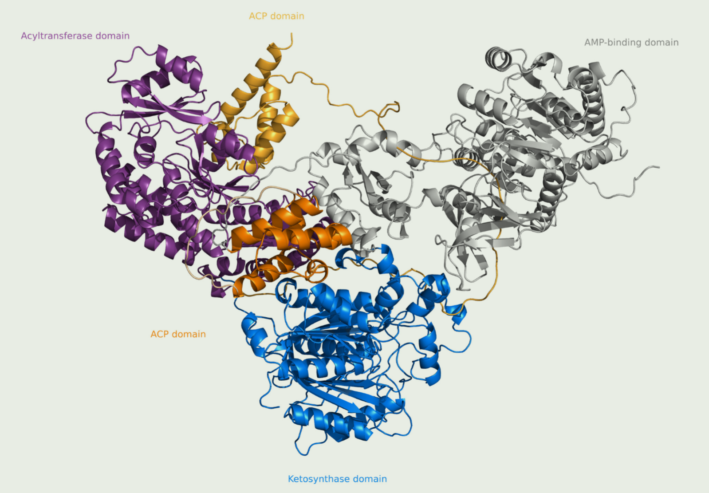

# 文献阅读

## HispS 结构域

Domain Truncation in Hispidin Synthase Orthologs from Non-Bioluminescent Fungi Does Not Lead to Hispidin Biosynthesis

### HispS

通过I型聚酮合酶进行的，聚酮合酶是由具有各种酶活性的多个结构域组成的大酶

来自生物发光分支内物种的 Hispidin 合酶由五个预测结构域组成：**AMP 结合结构域、酰基载体蛋白结构域、酮合成酶（N 端和 C 端结构域）、酰基转移酶和另一个 C 端酰基载体蛋白结构域**。同时，来自相关非生物发光真菌的直系同源酶通常包含两个具有预测酮还原酶和脱水酶活性的附加结构域

结构域的丧失可能是有利于祖先聚酮合酶产生α-吡喃酮的关键进化事件，并且随着荧光素酶基因簇的形成

### 结论

包含酮还原酶和脱水酶结构域的 hsPKS 和缺乏这些结构域的 nnHispS 都能够产生 hispidin 样苯乙烯吡喃酮。因此，严格来说，截断结构域并不是启动荧光素前体在fungi中的生物合成所必需的

本研究中酮还原酶和脱水酶结构域的缺失可能只是扰乱了酶的结构

在这项研究中，我们没有发现证据表明酮还原酶和脱水酶结构域的丧失是导致生物发光真菌中hispidin生物合成的关键进化事件。然而，来自非发光真菌的野生型同源聚酮合成酶可以产生类似hispidn的化合物的证明，又增加了另一个证据，表明祖先真菌物种很好地定位于通过氧化苯乙烯吡啶酮进化发光。因此，如果未来的分子研究集中在下游的生物合成酶——hispidin-3-羟化酶和荧光素酶上，就更有可能对真菌生物发光的进化产生深入的了解。