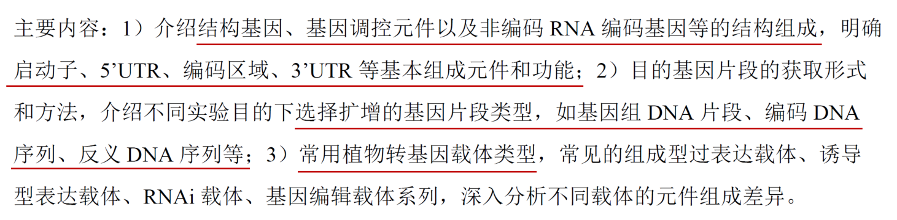

# 植物生物技术

# 组织培养部分

## 绪论

### 一、植物生物技术的定义*

指生物技术在植物（尤其是农作物）上的应用，包括植物组织培养技术、人工种子、细胞工程、基因工程等

利用现代生物学的技术和方法对植物的品质和性状进行改造的一系列遗传操作过程（获得改良的优良种质）

### 二、植物生物技术发展历程

### 三、植物生物技术与农作物育种（技术）

### 四、植物生物技术与国家粮食安全

### 五、植物生物技术与新质生产力

### 六、植物生物技术与农业生产

高彩霞

刘耀光院士

Wx——直链淀粉含量，籼稻高

### 七、未来植物生物技术的重点发展方向

#### （一）精准、简易高效、多样化基因编辑技术（基因组、表观组、转录组）

面临问题：基因型依赖、基因序列依赖

#### （二）BT+IT的智能设计育种技术

#### （三）合成生物学技术将引领未来农业发展

合成食品(如人造蛋白质、淀粉等)、高光效固碳、节肥增效、生物抗逆等

### 八、植物组织培养定义*

从植物体分离出符合需要的外植体，通过无菌操作，在无菌条件下接种在培养基上进行培养以获得完整植株或具有经济价值的其他产品的技术

狭义: 组培指用植物各部分组织(如薄壁组织、叶肉组织、胚乳等)或诱导的愈伤组织进行培养获得再生植株

### 九、植物组织培养发展历程

#### （一）组织培养探索阶段

#### （二）奠基阶段

#### （三）快速发展及应用阶段

### 十、植物组织培养涉及的主要内容

## 第一章 植物组织培养成功的关键因素

外植体、环境条件、培养基

### 一、外植体

#### （一）定义

植物组织培养中作为离体培养材料的原生质体、细胞、器官或组织等

#### （二）类型

1. 细胞层面：悬浮细胞、花粉小孢子细胞、受精卵细胞、原生质体等
2. 组织层面：愈伤组织、茎尖分生组织、茎段薄壁组织等
3. 器官：花药、成熟胚、幼胚、子房、子叶、下胚轴等

#### （三）选择原则

1. 是否会引起不良变异
2. 取材简单容易，如叶片
3. 对一些培养较困难的植物，可以采用子叶、子叶节、下胚轴和幼胚等作为外植体

### 二、培养基

#### （一）定义

供微生物、植物或动物生长和维持的固体或液体养料

#### （二）类型

1. 物理：固体、液体、固液双层培养基、半固体
2. 化学：天然、合成、半合成
3. 功能：生根、分化、愈伤组织诱导、继代等

#### （三）组成及含量

原生质：构成生活细胞的生活物质，细胞中有生命的部分是由原生质构成的，所以原生质是细胞结构和生命活动的物质基础。理论上应包含构成原生质体的全部元素，但现实并不。

1. 植物生长必需元素（16种）：大量和微量

   

2. 大量、微量元素的衡量标准：>或<0.5mM

3. 必需元素的4条衡量标准
   - 元素是植物完成生命周期必不可少的；
   - 元素对植物具有特定作用且不能被其他元素完全替代；
   - 元素对植物细胞组织器官生长发育的影响是直接的；
   - 元素是植物关键成分的组成部分。

#### （四）不同形态N的影响

铵态氮和硝态氮

游离的铵将在细胞中累积并对其造成毒害

较高浓度的硝态氮也不会对植物产生不良影响

#### （五）不同价态Fe

三价铁：当培养基pH>5.2时形成氢氧化铁沉淀

二价铁：培养基pH=5.2左右时植物组织才能吸收。愈伤组织可以分泌螯合剂并与铁结合

植物组织培养基：螯合铁，常见的螯合剂包括EDTA、DTPA、IDHA、EDDHA、HBED等，其中EDTA最为常见。

今后的趋势是使用可快速生物降解的螯合剂（IDHA）

#### （六）碳源

1. 定义：是培养物生长发育所需的碳骨架和能量来源，维持培养基渗透压

2. 分类

   （1）化学分子结构：

   - 单糖：葡萄糖(Glucose)、半乳糖(Galactose)、甘露糖(Mannose)、果糖(Fructose)、山梨糖(Sorbose)
   - 寡糖（2-10个单糖分子）：Sucrose(最常用)、乳糖(Lactose)、麦芽糖(Maltose)
   - 多糖（>10个单糖分子）：可溶性淀粉(Soluble starch)
   - 复合糖：泛指糖蛋白、蛋白聚糖、糖脂等含有糖类的复合生物大分子

   （2）还原性：

   - 还原性糖：葡萄糖、果糖、半乳糖、乳糖、麦芽糖等
   - 非还原性糖：淀粉、纤维素、蔗糖和棉子糖等

还原性糖在高温条件下与氨基酸物质中的氨基发生反应，经一系列复杂过程最终生成棕黑色的大分子有害色素类黑素

#### （七）凝固剂

1. 定义：组织培养过程中用来凝固培养基的物质，其自身一般不具备营养，仅作为固体支持物
2. 选用原则：使用方便，不产生不利影响、不与培养基中其他组分发生反应，具有较好的透明度

3. 常用：琼脂（Agar）、琼脂糖（Agarose）、结冷胶（Gelrite和Phytagel）

#### （八）pH

1. pH> 7.0  or <4.5, 植物细胞将停止生长，适宜5.0-6.0
   - pH值过低将阻碍植物吸收大量元素，而pH过高则阻碍微量元素吸收

2. 灭菌后pH一般会有所下降，通常认为下降0.1-0.3
   - 灭菌时间长与温度高、含糖量高，下降多

蔗糖对培养基pH变化影响小

#### （九）生长调节剂

#### （十）植物组织培养基本培养基

#### （十一）培养基改良

#### （十三）培养基配制

母液配制：元素含量（无机大量元素、无机微量元素、铁盐、除碳源外的有机物），元素组成（相同离子根的盐）

无机盐、有机物、碳源、（凝固剂），调pH，灭菌（不耐高温单独过滤灭菌，后加）

### 三、无菌条件创制

培养基（灭菌时间不够，培养基分装过程）

培养物（受体消毒不彻底）

操作（操作器械、操作台面、操作个人）

#### （一）操作平台

风淋室

超净工作台

#### （二）无菌培养基、操作器械和培养物消毒

1. 高压蒸汽灭菌

   （1）在灭菌充分的条件下, 灭菌温度越低越好, 时间越短越好

   （2）高温高压灭菌对培养基的影响

   - pH值一般下降0.1-0.3
   - 太高温度灭菌时会使糖焦化，可能会产生毒性
   - 灭菌时间太长会使盐沉淀, 同时使琼脂解聚
   - 挥发性物质不能高温灭菌, 否则会被破坏

2. 过滤灭菌
   - 考虑亲水性、溶解、反应

3. 化学表面灭菌
   - 巴氏消毒液（次氯酸盐）
   - 升汞
   - 酒精

## 第二章 愈伤组织诱导培养

### 一、愈伤组织定义

将植物上的某个部分（组织或器官）切下，形成外植体，接种到适宜的培养基上培养，其外植体组织伤口面形成新生的细胞团。

离体培养条件下植物外植体上长出的一团无序生长的细胞

### 二、诱导培养的目的意义

1. 植株大规模再生，遗传转化受体
2. 体细胞无性变异
3. 药物、抗体等产生，次生代谢产物
4. 悬浮细胞系、原生质体培养

### 三、理论依据

1. 植物细胞的全能性：植物的每个细胞在特定条件下都有再生成新个体的潜能
2. 体细胞重编程：分化的体细胞在特定的条件下被逆转后恢复到全能性状态，或者形成胚胎干细胞系，或进一步发育成一个新的个体的过程
   - 方法：核移植、细胞融合、细胞提取物诱导、化学诱导以及分子调控诱导等
3. 全能性实现条件
   - 把具有较强全能性的细胞从植物组织抑制性影响下解脱出来
   - 给予植物细胞一定的刺激
4. 脱分化：一个成熟细胞转变为分生状态的过程；或已分化的细胞，当受到创伤或进行离体培养(也受到创伤)时，已停止分裂的细胞又重新恢复分裂，细胞改变原有的分化状态，失去原有结构和功能，成为具有未分化特性的细胞的过程。
5. 愈伤组织形成的刺激信号：Auxins、Cytokinin

### 四、形成主要过程

1. 起动期
2. 愈伤形成
3. 多能性建成

### 五、类型与形态

1. 非胚性愈伤组织（NEC）：细胞体积较大，不易成团，孔隙多
2. 胚性愈伤组织（EC）：质地较坚实，颜色有乳白色或黄色，表面具球形颗粒，其生长缓慢
   - 致密型EC
   - 易碎型EC

### 六、继代培养

1. 定义：指愈伤组织在培养基上生长一段时间后，营养物枯竭，水分散失，并已经积累了一些代谢产物，此时需要将这些组织转移到新的培养基上
2. 原因
   - 养分消耗
   - pH变化，培养基液化（阳离子，pH）
   - 次生代谢产物
   - 培养基已干燥
   - 空间不足，扩繁……

### 七、悬浮培养

1. 定义：把一些小块生长旺盛的愈伤组织放入液体培养基中，进行振荡培养，从而使愈伤组织块变成良好分散性的细胞和小的细胞聚集体
2. 悬浮细胞系的用途
   - 提供一个相对一致的细胞群体
   - 细胞增殖速度快，适于进行大规模培养,分离原生质体的良好细胞来源
   - 研究次生代谢、酶诱导、基因表达、抗生素的降解的良好实验体系
   - 多数悬浮细胞缺乏叶绿体、色素，有利于分离酶和次生物质

### 八、诱导的影响因素

1. 基因型（外植体）
   - 一般以幼嫩的组织或器官，顶端分生组织为宜
   - 种子是诱导愈伤组织的很好的起始材料;以及在无菌条件下发芽种子产生的根、茎、叶(无菌苗)，较适于诱导愈伤组织。
2. 培养基及激素配比
3. 培养条件：光照、温度、外植体预处理

## 第三章 植物遗传转化技术

### 一、植物遗传转化方法

1. 按遗传特性：
   - 瞬时遗传转化
   - 稳定遗传转化
2. 按转化介质：
   - 生物介质介导
     - **农杆菌介导**：外植体/农杆菌共培养法，活体转化法
     - **病毒介导**
   - 非生物介质介导
     - 化学法介导：PEG、脂质体、纳米颗粒
     - 物理法介导：电穿孔、**基因枪**、显微注射、超声波、碳化硅纤维介导、激光微束诱导

### 二、根癌农杆菌介导的遗传转化

#### （一）载体系统

1. 一元（共整合）载体系统

   - 包含2个独立的质粒：农杆菌质粒、大肠杆菌中间载体
   - 中间载体与Ti质粒通过同源重组使外源基因整合到T-DNA区，共整合质粒在农杆菌中稳定存在

2. 二元载体系统（现常用）
   - 2个独立的质粒：含有T-DNA的中间载体、卸甲Ti质粒
     - 中间载体（微型Ti质粒）：含外源目的基因、25bp的左右边界序列、筛选标记基因等，无Vir
     - 卸甲Ti质粒：无T-DNA、有Vir
   - 当农杆菌侵染受伤的植物时，卸甲Ti质粒上的Vir基因受植物的创伤信号启动，与微型Ti质粒上的左右边界序列发生反式相互作用，将微型Ti质粒的T-DNA切割下来并转移进入植物基因组中

   

3. 三元载体系统
   - 双元载体+制毒辅助载体+复制辅助载体

#### （二）菌株类型

根癌农杆菌、发根农杆菌

农杆菌染色体背景：C58&Ach5

- C58背景的菌株生长速度快、不结球
- Ach5背景的菌株则生长慢、易结球，在转化实验中难以操作，培养后不易洗掉

产生冠瘿碱类型：章鱼碱型(Octopine)、胭脂碱型(Nopaline)、农杆碱型(Succinamopine)

- 菌株侵染力：农杆碱型>胭脂碱型>章鱼碱型

#### （三）基本原理

农杆菌依附于植物表面伤口，植物分泌的小分子化合物诱导VirA和VirG等基因表达Vir产物，继而诱导Ti质粒产生一条新的T-DNA单链分子。单链分子从Ti质粒上脱离并与VirD2共价结合，而后进一步与VirD4、VirB和VirE2等蛋白结合形成T复合物(T-complex)，进入植物细胞核并整合到基因组中。

#### （四）主要操作过程

愈伤组织诱导培养（外植体准备）——外植体/农杆菌共培养——筛选培养——分化培养

#### （五）主要影响因素

1. 基因型：物种、外植体类型、外植体发育时期
   - 基因型依赖性严重，需要创建无基因型依赖的高效遗传转化体系
2. 农杆菌菌株：菌株类型、农杆菌生长阶段、悬浮培养基、侵染液浓度、侵染液中是否添加诱导物
3. 表达载体：载体类型、外源片段大小、筛选标记
4. 侵染过程：外植体是否预处理、侵染方式方法及时长、侵染过程中是否超声或抽真空处理
   - Vir基因活化诱导物：
     - 活化因素：酚类化合物、单糖或糖酸、氨基酸、磷酸饥饿、低pH
     - 最常用的诱导物：乙酰丁香酮(AS)和羟基乙酰丁香酮(OH-AS)，AS效果最佳
     - 添加的方式方法
       - 在制备农杆菌侵染液4-6h前，或者加在侵染液中
       - 在共培养培养基中添加
       - 在侵染液和共培养基中均添加。
5. 共培养过程：共培养基、是否添加诱导物、共培养温度及时长
6. 抑菌筛选过程：抑制农杆菌生长的抗生素、外植体褐化
   - 抗生素：Timentin最有效
   - 外植体褐化及提高转化效率
     - 外植体表面变褐，甚至培养基也变褐的现象。这种现象主要是由于酚类化合物和多酚氧化酶在有氧条件下发生反应，生成褐色的醌类物质，导致外植体和培养基变褐，最终可能导致外植体死亡‌

### 三、基因枪介导的遗传转化

#### （一）基本过程

外植体准备——外植体转化——外植体筛选培养——分化培养

#### （二）影响因素

1. 微粒载体及可裂膜
   - 颗粒大小
   - 可裂膜PSI
2. 渗透处理，转化前后处理适当时间

**多拷贝，基因沉默**

### 四、病毒诱导的植物遗传转化

病毒载体

农杆菌注射接种、抽真空渗透转化、基因枪轰击接种、摩擦接种、喷施接种

VIGS、VIGE、VOX、HIGS

#### 主要影响因素

1. 载体系统类型
   - ssRNA
   - ssDNA
2. 宿主

## 第四章 单倍体细胞培养

### 一、单倍体定义

体细胞染色体组数等于本物种配子染色体组数的个体或细胞，包括一倍单倍体和多倍单倍体

### 二、单倍体培养

#### （一）单倍体培养意义

1. 缩短育种年限，提高选择效率
2. 排除杂种优势对后代选择的干扰
3. 遗传研究的良好实验材料体系（如创造永久作图群体）、高应用价值的材料
4. 突变体筛选
5. 消除致死基因
6. 选育新型自交系
7. 遗传转化的受体材料
8. 克服远缘杂交后代不育

#### （二）如何培养单倍体/双单倍体细胞/植株

1. 种间和属间杂交，结合胚挽救技术获得单倍体
   - 对胚进行早期分离培养成苗的过程
2. 体内孤雌、孤雄生殖。物理照射或化学诱变
3. 双生苗的筛选：多胚种子可产生单倍体-单倍体、二倍体-二倍体和单倍体-二倍体植株
4. 离体孤雄生殖，小孢子/花培
5. ……

#### （三）花粉离体发育途径

#### （四）小孢子/花药培养基本过程

花药分离——花药离体培养——愈伤诱导培养——再分化

#### （五）小孢子/花药分离方法

1. 自然释放法，无菌花药在液体或固体培养基上自然开裂。在油菜和禾本科植物有应用，但效率低。
2. 研磨过滤收集法，无菌研磨器中研磨花蕾或花药，释放花粉/小孢子，过筛并纯化花粉/小孢子 。常用于油菜和茄科作物。
3. 剖裂释放法，借助工具剖裂药壁，使花粉释放出来。在药草中有应用

#### （六）小孢子/花药培养方式

1. 平板培养：将琼脂或明胶等凝胶状固体培养基制成平面状并在此平面上接种花粉或小孢子
2. 液体培养：将花粉或小孢子直接接种于液体培养基中,并不断振荡或搅拌，使其均匀地在液体培养基中生长繁殖的一种培养方法
3. 双层培养：将花粉或小孢子直接接种于固体-液体双层培养基中培养
4. 看护培养：用一块活跃生长的愈伤组织块(花药)来看护单个细胞,并使其生长和增殖的方法。
5. 微室培养法：取一滴载有花粉的液体培养基，滴于盖玻片上，然后翻转盖玻片使液体培养基悬挂在盖玻片下，再置于一凹形载玻片上，最后用石蜡密封盖玻片四周。
6. 条件培养基：将培养过花药的培养基去掉花药并离心收集上清液；或者花药经沸水杀死细胞后碾碎、离心收集上清液；两种上清液(含有促进花粉发育的物质)都可以加入培养基中，用于花粉/小孢子培养

#### （七）单倍体染色体加倍

单倍体植株：矮小，瘦弱，高度不育

双单倍体

加倍方法：自然加倍、人工加倍（化学药剂处理，秋水仙素）

#### （八）双单倍体倍性鉴定

1. 染色体直接计数法：分生组织区压片
2. 间接鉴定法：
   - 细胞形态（叶片保卫细胞大小、单位面积气孔数及保卫细胞中叶绿体的大小和数目）
   - 植株形态
   - 杂交鉴定
   - 流式细胞仪
   - 分子标记鉴定

#### （九）小孢子和花药培养总结

### 三、影响单倍体培养的因素

#### （一）取材

小孢子母细胞（2n）→小孢子（n）→花粉粒

甘蓝型油菜的单倍体培养常采用单核晚期至二核早期

#### （二）预处理

物理：

1. 热激处理
2. γ射线处理
3. 低温处理：水稻花药培养，幼穗在4℃或其他较低的温度下处理一段时间，再进入培养程序，能获得较理想的效果

化学：

1. 秋水仙素处理
2. 营养饥饿/渗透胁迫
3. 重金属胁迫

#### （三）基因型

#### （四）供体植株的生理状态和环境条件

光周期、光照强度、温度等对以后的花粉离体培养有很大影响。一般田间比温室，幼龄比老龄植株易于培养。主茎易于侧(次)分枝

#### （五）培养基

基因型不同，所需培养基种类，蔗糖浓度以及添加激素种类和浓度不同。加入活性炭可提高花粉植株的诱导率

#### （六）培养条件

### 四、单倍体培养过程中存在的问题

**白化苗：质体或核DNA降解**

产生因素：

- 内因：基因型和花粉发育时期的影响最为明显
- 外因：如高温、高浓度2,4-D、延迟再分化培养时间等均可促进白化苗产生

解决办法：

- 适当提高温度，光照强度
- 改变碳源，如用Glucose/Maltose替换，使用生长素(2,4-D/IAA)+细胞分裂素(BA)等
- 花药/花粉来源：尽可能取主分枝上的小花
- 尽早再分化

### 五、单倍体培养在育种中的应用

(双低)油菜品种: 华双3号

水稻品种：中花系列(如中花11号)、龙粳系列等、江两优7901

玉米品种：NK971、MC278、MC703、MC670

## 第五章 植物原生质体培养

### 一、原生质体及原生质体融合定义

原生质体：采用机械或酶解方法去除细胞壁的裸露细胞

原生质体融合：即细胞融合，也叫体细胞杂交，超性杂交或超性融合。是指不同种类的原生质体不经过有性阶段，在一定条件下融合创造杂种的过程。a(+)b

### 二、原生质体培养

#### （一）原生质体培养意义

1. 基础理论研究：
   - 细胞生理与发育
   - 基因表达调控研究：BiFC，基因细胞定位
2. 应用科学研究
   - 种质资源保存
   - 体细胞杂交
   - 筛选无性变异系和突变体
   - 遗传转化
3. 克服有性杂交不亲和及生殖障碍
4. 转移有利的农艺性状，创造新的种质材料
5. 转移胞质基因，体细胞遗传
6. 创造异附加系、代换系等遗传材料
7. 缩短育种年限，提高育种效率

#### （二）如何培养（融合)原生质体

1. 原生质体分离方法

   （1）原则：不受伤害及不损害其再生能力

   （2）分离方法

   - 机械分离法：质壁分离，切割细胞壁
   - 酶法分离：果胶酶、纤维素酶

   （3）酶法影响因素：

   - 外植体：刚展开的幼嫩叶片叶肉细胞、愈伤组织、悬浮细胞
   - 酶制剂：纤维素酶、半纤维素酶、果胶酶和离析酶等，酶解花粉母细胞和四分体小孢子时还要加入蜗牛酶
   - 渗透压：甘露醇是常用的渗透剂(原因：甘露醇的钝性及进入原生质体的速度很慢，保证稳定的渗透压）
   - 酶解条件：温度和pH。
   - 酶解前处理：高渗前处理、激素处理、低温处理

2. 原生质体收集与纯化

   （1）收集：过滤网

   （2）洗涤：将网下物低速离心，去掉上清液，再加无酶液的CPW液（含渗透剂）悬起原生质体，再离心，弃上清，重复几次

   （3）纯化

   - 上浮法：采用比原生质体密度大的高渗溶液使原生质体漂浮在液体表层
     - 避免破损
     - 离心力要求严格
   - 界面法：采用两种密度不同的溶液形成不连续梯度，通过离心使原生质体与破损细胞分别处于不同液相中，从而纯化原生质体
     - 可以收集到大量高纯度原生质体，同时避免收集过程中原生质体的挤压
   - 沉降法：利用比重原理，在具有一定渗透压的溶液中，先进行过滤后低速离心，使纯净完整的原生质体沉积在试管底部
     - 方法简单
     - 原生质体沉积于试管底部，造成彼此挤压而破碎

3. 原生质体活力检测

   （1）直接观察形态或胞质环流

   （2）染色观察：

   - FDA染色：有活力的细胞产生绿色荧光；而无活力的细胞因不能使FDA分解，而无法产生荧光
   - 酚藏花红染色：活性原生质体染色后显微镜下可观察到红色
   - 伊文思蓝染色：死细胞或受损细胞可吸收伊文思兰而染色

4. 原生质体培养

   （1）原生质体计数：血细胞计数板

   （2）培养方法

   - 液体浅层培养
   - 固体培养
   - 固液双层培养

   

   原生质体培养好坏的标准之一：植板率，即形成愈伤组织的原生质体数量占所培养原生质体总数的百分比

5. 原生质体再生

   （1）细胞壁再生

   - 细胞壁检测方法：荧光增白剂，能非特异性结合糖苷键连接多糖，如几丁质、葡聚糖和纤维等，荧光显微镜下发出荧光

   （2）原生质体增殖

   （3）植株再生：原生质体不断分裂，形成多细胞团。当细胞团进一步发育成为肉眼可见的小愈伤组织，及时转移到分化培养基中培养

6. 原生质体融合

   （1）融合方法

   - 自发融合

   - 诱导融合

   （2）融合方式及产物

   - 对称融合：亲本原生质体在融合前未进行处理的一种融合方式
     -  由于它综合双亲的全部性状，在导入有利性状的同时，也不可避免地带入不利性状。
     - 对称杂种，杂种中具有融合双亲全部的核遗传物质

   - 非对称融合：对一方原生质体进行射线照射处理，钝化其细胞核，另一方原生质体不处理或经化学试剂处理，前者通常称为供体，后者则称为受体，也称供-受体融合
     - 供体处理: 造成染色体的断裂和片段化，使供体染色体进入到受体后部分或全部丢失，达到转移部分遗传物质或只转移细胞质
     - 受体处理 : 利用代谢抑制剂处理受体原生质体以抑制其分裂。常用的抑制剂有碘乙酸、碘乙酰胺和罗丹明6-G
     - 非对称杂种，双亲或其中一方的核遗传物质出现了丢失
       - 胞质杂种，融合一方的核物质完全丢失，并且具有双方的细胞质遗传物质
       - 异质杂种，杂种的细胞核来源于一方，而细胞质来自于另一方

   （3）融合产物筛选与鉴定

   - 互补筛选法
   - 物理特性筛选法
   - 形态学鉴定
   - 细胞学鉴定
   - 生物化学鉴定：如同工酶
   - 分子标记鉴定
   - DNA含量分析鉴定：流式细胞仪

7. 体细胞杂种在农作物育种中的重要应用

   - 无籽园艺作物
   - 不对称融合导入部分染色体片段

## 第六章 细胞的分化与再分化

### 一、细胞分化和再分化定义

细胞分化：同一来源的细胞逐渐产生出形态结构、功能特征各不相同的细胞类群的过程，其结果是在空间上细胞产生差异，在时间上同一细胞与其从前的状态有所不同

细胞分化的本质：基因组在时空上的选择性表达

细胞再分化：已经去分化形成的胚性细胞在某些刺激条件下，重新启动开始分化发育的过程

### 二、自然界中植物再生

苗木嫁接、

### 三、植物离体再生

### 四、高等植物的再生途径

组织再生：组织修复

器官发生途径：指培养条件下的组织或细胞团（愈伤组织）分化形成不定芽/根等器官的过程

体细胞胚胎途径：离体培养下没有经过受精过程，但经过了类胚胎发育过程所形成的再生植物

### 五、植物离体培养中植株再生途径

#### （一）器官发生

1. 直接器官发生：已存在器官原基直接发育

   （1）外植体中已存在器官原基，通过组织培养形成相应组织器官并再生植株，如茎尖、根尖分生组织培养

   （2）外植体某些部位的细胞，在重新分裂后直接形成分生细胞团，然后由分生细胞团形成器官原基

2. 间接器官发生：外植体脱分化形成愈伤组织，由愈伤组织诱导产生分生细胞团，再分化成不同的器官原基，进而形成器官 

   （1）三个阶段：愈伤-分生中心-器官原基及器官形成

   （2）三种形式：先芽后根（普遍），先根后芽（双子叶植物普遍，单子叶较少），根芽同时生长（只有维管束相连才能成活）

#### （二）胚胎发生

1. 直接胚胎发生：从培养的器官、组织、细胞或原生质体直接分化形成胚
2. 间接胚胎发生：外植体先愈伤化，再由愈伤组织细胞分化成胚
3. 胚状体：起源于非合子细胞，经过胚胎发生和胚胎发育过程形成
   - 体细胞胚：由普通植物体（孢子体）的各种器官等双倍体的体细胞产生的胚状体
   - 花粉胚：由小孢子或其分裂产物等单倍体细胞产生的胚状体，通常称为花粉胚，可发育成单倍体植株
   - 特点：两极性，即在其发生的最早阶段就具有根端（胚根）和茎端（胚芽）；它与母体植物或外植体的维管组织无解剖结构上的联系
4. 优势
   - 数量多
   - 结构完整
   - 研究胚发育的良好材料体系。人工种子

#### （三）器官发生与胚胎发生差异比较

#### （四）器官发生与胚胎发生分子机理

## 第七章 植物体细胞无性系变异及其应用

### 一、体细胞无性变异系定义

**体细胞无性系变异：泛指在植物细胞、组织或器官离体培养过程中，受到非生物因子诱导，进而导致培养细胞和再生植株发生遗传变异或表观遗传变异**

分类：

- 变异来源
  - 自发型变异
  - 诱导型变异
- 遗传特性
  - 遗传变异：基因重组、基因突变和染色体变异
  - 表观遗传变异：DNA甲基化、组蛋白修饰、染色体重塑、转座子激活和基因沉默等

### 二、体细胞无性变异系的性状表现

农艺性状的变异

代谢物成分及含量变异

DNA水平（染色体数目及结构变异、基因突变等）

### 三、遗传基础

#### （一）细胞遗传学基础

1. 染色体数目变异
2. 染色体结构变异

#### （二）分子遗传学基础

1. 基因突变
2. 基因的扩增、丢失或重排（核基因及细胞器基因）
3. 表观遗传变化
4. 组蛋白及小RNA的变化
5. 转座子激活或失活
6. 基因沉默

### 四、体细胞无性变异系的鉴定

形态特征、同工酶标记、DNA标记

### 五、体细胞无性变异系在遗传改良中的应用

#### （一）优缺点

1. 优点
   - 诱变群体大、变异频率高、变化幅度大、筛选方便
   - 变异遗传稳定、后代稳定，诱变条件可控，不受季节限制，选育周期短，成本低等
   - 可在单细胞上进行，避免出现嵌合体
   - 保持原有优良遗传性状的前提下，仅改变个别农艺性状
   - 与其他物理化学诱变相结合，提高诱变效率
   - 可在培养基中添加特定选择压，获得特定突变体
   - 获得新的细胞质雄性不育系
   - 提供了植物基因变异的快捷途径，拓宽种质资源，加快育种进程
2. 缺点
   - 畸变率高
   - 基因型依赖性
   - 存在不稳定或不遗传的变异

#### （二）研究

1. 育种应用研究

   - 高产优质
   - 抗逆(生物和非生物逆境)
   - 新的雄性不育种质

2. 育种理论研究

   利用变异系研究细胞培养、诱变中的遗传规律，其不受地理、环境、空间等限制

## 组织培养部分总结

1. 培养基的基本组成成分、离体无菌操作
2. 愈伤组织形成过程（脱分化）、愈伤组织类型
3. 单倍体培养途径及其影响关键因素、单倍体加倍方法及检测手段
4. 原生质体分离的影响因素、检测，原生质体融合方法、方式
5. 植物遗传转化的方法
6. 体细胞无性变异系的遗传学原理
7. 植物离体培养中外植体的再生途径

# 基因操作部分

## 基因克隆及载体构建

### 一、植物基因组

#### （一）基因组DNA

1. 组成：核基因组、线粒体基因组和质体基因组
2. 基因组大小：模式植物拟南芥的基因组大小约为150Mb
   - 小到大（举例）：拟南芥、水稻、大豆、玉米、大麦、小麦
3. 基因组大小与个体大小没有必然联系

### 二、基因的结构

#### （一）基因

染色体上一段特定的DNA序列

基因的表达受其启动子、终止子、其它调控序列的控制

#### （二）蛋白编码基因

1. 结构

2. 产物：选择性剪接
   - 不同序列
   - 不同功能
   - 不同定位
   - ……

#### （三）非编码RNA

1. 分类：小非编码RNA、长非编码RNA
2. 来源

#### （四）基因调控序列

1. 近侧启动子：一般是特定转录因子的结合位点，也称为上游启动子元
2. 远处（选择性）启动子：主要是一些额外的可以发挥DNA转录调节能力的元件，但是其对基因表达的影响一般相对较弱
3. 增强子和沉默子
   - 增强子：DNA上一小段可与蛋白质（转录激活因子）结合的区域，与蛋白质结合之后，基因的转录作用将会加强
   - 超级增强子：一类由多个增强子组成的一簇增强子
   - 沉默子：一段能够结合转录抑制因子（阻遏蛋白）的DNA序列，能够抑制DNA的转录过程

#### （五）基因结构查询

拟南芥：TAIR

### 三、目的基因片段的获取

#### （一）选择

1. 基因组DNA（gDNA）序列
   - 特点
     - 外显子、内含子
     - 包含大多数基因原位表达元件，能最好的反映基因内源表达状态、部位等
     - 序列一般较大，构建繁琐
   - 用途
     - 一般为构建同物种转基因植物
2. 编码区DNA（CDS）序列
   - 特点
     - 只包含蛋白质编码序列
     - 一般缺乏内源表达特征、转录后mRNA水平调控元件以及不同的剪切形式等
   - 用途
     - 一般为构建跨物种转基因植物/用途，如水稻基因到拟南芥里验证功能、酵母双杂交以及原核系统蛋白表达
3. 反义DNA（anti-sense）序列
   - 特点
     - 与蛋白质编码序列反向互补的一段DNA序列，通常200-300bp
   - 用途
     - RNAi

#### （二）扩增

1. 聚合酶链式反应（PCR）：一种用于放大扩增特定的DNA片段的分子生物学技术

2. 基本过程

   （1）预变性：模板变性与聚合酶激活

   （2）变性：变性时间过长损害酶活性，过短靶序列变性不彻底，易造成扩增失败

   （3）引物退火：根据引物的Tm值为参考。PCR的特异性

   （4）延伸：一般在72℃进行，根据扩增长度和聚合酶合成速度

   （5）循环数：大多数PCR含25-35循环，过多易产生非特异扩增

   （6）最后延伸：使引物延伸完全，并使单链产物退火成双链

3. PCR产物的检测：琼脂糖凝胶电泳

   - 溴化乙锭（EB）→GelRed
   - 引物二聚体

4. PCR反应的特点

   （1）特异性强

   - 引物与模板DNA特异正确的结合
   - 碱基配对原则
   - DNA聚合酶合成反应的忠实性、耐高温
   - 靶基因的特异性与保守性

   （2）灵敏度高

   （3）纯度要求低

5. PCR结果的影响因素：引物、DNA聚合酶、模版、PCR类型等

   （1）引物设计

   - 设计工具
     - **NCBI Primer-Blast**
     - Primer3 Plus
     - Primer Premier 5
   - 设计原则
     - 15-30nt
     - 引物中的G+C含量应为45%~55%
     - 4种碱基应随机分布，避免单一碱基的连续排列
     - 防止引物内部形成二级结构
     - 两个引物之间不应发生互补，尤其在引物的3'端要避免"引物二聚体"形成
     - 3'端末位碱基尽量不要选用 A/T
     - PCR扩增引物是一对，包括正反向引物

   （2）DNA聚合酶

   - Taq DNA聚合酶：热稳定性，活性温度范围宽，不具有校正功能
     - 菌落PCR；基因型鉴定。定性
   - （超）高保真DNA聚合酶
     - NEB Q5、NEB phusion、Takara PrimeSTAR、KOD、诺唯赞 Phanta flash、诺唯赞Phanta max等
     - 克隆基因

   （3）模板

   - 基因组DNA
     - 粗提DNA：操作简单，纯度低，量适中
     - CTAB：操作稍复杂，纯度适中，量大
     - 试剂盒：操作方便，纯度高，量小成本高
   - 互补DNA，cDNA：以mRNA为模板合成的互补DNA
     - 反转录
     - RT-PCR

   （4）PCR扩增类型

   - 片段长度越大，扩增难度越高
   - 不同类型
     - 巢式PCR
     - Touchdown-PCR
     - ……

### 四、常见植物表达载体

#### （一）T-DNA双元载体

双元的理解

- 整个系统需要两个质粒
- 双元载体上既有T-DNA元件，也有细菌扩繁元件
- 细菌扩繁元件既在大肠杆菌中工作，也能在农杆菌中工作

1. 转基因过表达载体：

   （1）pCAMBIA1300系列载体

   - LB和RB T-DNA repeat： T-DNA边界序列，限定了整合到植物基因组上的序列
   - Ori：复制起点
   - MCS：多克隆位点，载体的构建和改造
   - CaMV 35S promoter：目的基因表达驱动序列
   - NOS terminator：指示转录终止的位置
   - EGFP：标签
   - 抗生素标记：HygR，KanR

   （2）pjlm19系列载体

2. 诱导型转基因载体

   （1）启动子

   - 组成型启动子：在该类启动子控制下，结构基因的表达大体恒定在一定水平上，在不同组织、部位表达水平没有明显差异
   - 诱导型启动子：在某些特定的物理或化学信号的刺激下，该种类型的启动子可以大幅度地提高基因的转录水平

   （2）类型

   - 天然诱导型启动子包括光、温度、激素应答启动子等
     - 光应答启动子中通常存在GT-1-motif，I-box，G-box和AT-rich sequence等顺式作用元件
     - 温度应答启动子中多存在HSE-motif，CCAAT-box，CCGAC-motif等
     - 激素应答启动子中则包含各种激素应答元件
   - 人工构建诱导表达系统

3. CRISPR/Cas9 基因编辑载体

   - Guide RNA表达载体
   - Cas9蛋白表达载体
   - Guide RNA表达载体+Cas9蛋白表达载体

4. RNAi载体

   pFGC5941

## 载体构建及基因检测

### 一、分子克隆（DNA重组技术）的几种方法

#### （一）表达载体构建基本流程

#### （二）酶切连接法

1. 所需工具酶

   （1）限制性核酸内切酶：识别特定的DNA序列（回文序列），可在识别序列内或距识别序列不远的位置处切割双链DNA。识别序列长度通常为4-8bp，粘性末端或平末端

   - 种类：Type Ⅰ-Ⅳ，常用Ⅱ

   - 注意事项

     - 星活性：甘油浓度过高；酶量过多；缓冲液（离子强度、pH）；酶切时间过长；有机溶剂存在；其他二价阳离子（无镁离子）
       - 高保真（HF®）限制性核酸内切酶

     - 不完全酶切：酶量过少，底物过多；pH、温度、孵育时间；酶（辅助因子，识别序列要求，首选位点）；底物（**甲基化**，限制性位点邻近，结构）

   （2）T4 DNA ligase：一种封闭DNA链上切口的酶，借助ATP或NADP水解提供的能量催化DNA链的-PO4与另一DNA链的-OH生成磷酸二酯键

   - 粘性末端、平末端

2. 限制性核酸内切酶的选择

   - Snapgene：目的基因序列上无切点的内切酶

3. 设计引物

   （1）注意事项

   - 正反向酶切位点选择，不要搞反
   - 保护碱基的数量和位置，一般加在酶切位点的5'端，可以直接选择载体酶切位点5'端的3-4个碱基
   - 起始密码子和终止密码子
   - 正义链序列还是反向互补序列
   - 注意目的基因和载体标签的读码框
     - 下游引物酶切位点3'加减碱基

4. 优缺点

   （1）优点：性价比高，载体选择较为灵活

   （2）缺点：

   - 有些载体可能多克隆位点不够多
   - 大片段目的基因的连接效率比较低
   - 载体有一定的自连比例

#### （三）Gateway法

1. 来源：λ噬菌体感染细菌时发生的整合和切除重组反应

   - 由噬菌体(attP)和细菌(attB)的附着位点的重组所促进的。由于attP和attB位点之间的重组，噬菌体整合到细菌基因组的两侧，并产生两个新的重组位点(attL和attR)。在一定条件下，attL和attR位点可以发生重组，导致噬菌体从细菌染色体上的切除以及attP和attB位点的再生。

   

2. 流程

   

   （1）BP反应

   - 发生在插入片段侧翼的attB位点和供体载体的attP位点之间。该反应由BP Clonase酶混合物催化，产生含有attL侧翼位点的目的DNA插入的克隆（入门克隆）。作为反应的副产物，ccdB基因将从供体载体上切除。

   （2）LR反应

   - 发生在生成的入门克隆的attL位点和目的载体的attR位点之间。该反应由LR Clonase酶混合物催化。由此，产生了以attB位点为侧翼的目的DNA的表达克隆。与BP反应一样，含有ccdB基因的DNA片段从目的载体上被切了下来。

   （3）转化和筛选

   - 入门克隆和目的表达克隆携带不同的抗生素抗性标记，便于选择表达克隆
   - 使用对ccdB敏感的大肠杆菌菌株(e.g. DH5α , TOP10 , Mach1)。ccdB基因在重组前存在于供体载体和目的载体中，在BP或LR反应过程中与目的基因发生交换。由于CcdB蛋白抑制CcdB敏感大肠杆菌菌株的生长，因此大多数菌落应含有预期的重组载体。

3. 特点

   - 载体不需要经过限制性酶进行切割，也不需要线性化
   - 1个Entry Clone可以很方便地克隆到
     很多不同类型、不同用途的终载体

4. 问题

   - 只能选择适用于Gateway克隆的终载体
   - 成本太高

#### （四）无缝克隆方法

1. Gibson Assembly：贵

2. 同源重组

   （1）基本过程：载体线性化（酶切、反向PCR）、插入片段获得（同源臂）→重组反应→转化

   

   （2）引物设计

   - 插入片段正向扩增引物
     - 5'--上游载体末端同源序列+酶切位点（可保留或删除）+基因特异性正向扩增引物序列--3'
   - 插入片段反向扩增引物
     - 5'--下游载体末端同源序列+酶切位点（可保留或删除）+基因特异性反向扩增引物序列--3'
   - 基因特异性正/反向扩增引物序列即常规插入片段正反向扩增引物序列，Tm值60~65℃为佳
   - 上/下游载体末端同源序列即线性化载体最末端序列（用于同源重组），GC含量40%-60%为佳

   （3）特点

   - 适用于任何载体
   - 无需考虑插入片段携带的酶切位点
   - 线性化克隆载体和PCR产物可不纯化直接克隆
   - 无连接酶，无自连
   - 克隆大片段DNA过程中有很大优势，多片段同源重组

#### （五）TA克隆方法

1. 原理：将含有3'-A末端的DNA片段与含有3'-T末端的载体通过T-A碱基互补配对，从而将外源DNA片段克隆进载体的方法

2. T载体：克隆载体采用平末端的限制酶切割后，在其片段的3'端上聚合一个T而成

3. 插入片段DNA的获取

   （1）Taq聚合酶会在每个扩增片段的3'端添加一个A碱基，形成3'-A末端的DNA片段

   （2）超/高保真DNA聚合酶：PCR产物为平末端

   - PCR产物用Taq酶处理，加上3'-A末端

   - 拓扑克隆/平末端克隆

     

#### （六）CRISPR/Cas9载体构建

1. 2步法：先构建gRNA表达载体，再克隆到终载体

2. gRNA设计：CRISPR-P

   - U6启动子驱动，gRNA最好以G开头，提高转录能力
   - 一般20bp，不包含PAM序列

3. gRNA载体构建

   （1）载体酶切：BbsI。能识别非回文序列，并在识别序列之外进行切割

   （2）gRNA：寡聚退火法制备具粘性末端的插入DNA序列

   

   

   （3）gRNA表达盒串联：同尾酶切连接

   - 同尾酶：切割不同的DNA片段但产生相同的粘性末端的一类限制性内切酶

   - 酶切口的“焊死”作用

     

### 二、重组DNA的扩繁和植物转化

#### （一）大肠杆菌转化

1. 质粒不相容原理：在没有选择压力的情况下，两种亲缘关系密切的不同质粒，不能够在同一宿主细胞系中稳定共存的现象
   - 具有相同复制起始位点和利用同一复制体系的质粒之间存在互相竞争的现象
2. 转化方法
   - 化学感受态：DH5α、TOP10等常见感受态细胞
   - 电转感受态
3. 筛选：含有特定抗生素的LB平板
4. 鉴定：菌落PCR；测序

#### （二）植物的遗传转化

根癌农杆菌、基因枪法、电激法、PEG转化法、花粉管通道法

1. 基因枪法
   - 依赖高速的金属微粒将外源基因导入活细胞的一种遗传转化技术
   - 优点
     - 不受宿主限制
     - 靶受体类型广泛，具有潜在分化能力的组织或细胞都可
     - 可用于将外源DNA转入线粒体、叶绿体、花粉等
   - 缺点
     - 转化率低
     - 嵌合体较多
     - 重复性差
     - 多拷贝，基因沉默，遗传稳定性差
     - 成本高
2. 花粉管通道法
   - 通过花粉管将外源DNA导入植物受体的技术
   - 操作简单
   - 转化结果具有随机性和不稳定性
3. 根癌农杆菌

### 三、DNA层面阳性转基因植株的分子检测

#### （一）PCR检测

判断有无目的基因片段，无法确定拷贝数

引物设计

1. 特定载体
2. LB和RB之间的任何特异区域
3. 最好设计在一些核心且特异元件上，例如标签蛋白EGFP、抗性基因如HygR等
4. 避免使用引物检测35S启动子

#### （二）Southern blot

基本过程：制备基因组DNA；酶切；电泳；转印；标记探针杂交；观察

#### （三）局限性

主要针对目的基因、报告或标记基因

盲目性

## 基因检测和重组DNA技术的应用案例

### 一、RNA层面阳性植物分子检测

#### （一）RT-PCR

1. 反转录聚合酶链反应，主要用于定性和半定量检测目的基因的表达水平
2. 核心流程：反转录和PCR扩增
   - 将mRNA反转录cDNA，进行一定循环数（~28-30）的PCR扩增
   - 通过产物的多少来反推基因的初始表达水平

#### （二）RT-qPCR

一步法

两步法（常用）

#### （三）RNA原位杂交

1. 用于检测RNA在组织细胞内表达部位和相对丰度的染色技术
2. 操作：利用与特异RNA目标序列互补的标记性探针，与组织细胞内的目标RNA杂交，形成稳定的RNA-RNA杂交双链，进而显色成像以观察目标RNA的表达部位和相对含量
3. 特点
   - 反映RNA的表达丰度
   - 显示RNA在体内的表达时期、部位等信息
   - 操作难度相对较高

#### （四）报告基因指示基因的表达

1. 报告基因：编码可被检测的蛋白质或酶的基因
   - GUS和GFP等可以显色或者激发荧光的因子，经常被用于启动子表达强度、部位和发育时期的检测
2. 原理：利用靶基因启动子来启动报告基因*GUS*或*GFP*的转录，通过检测GUS活性或者观察GFP荧光，来表征启动子的表达部位或者强度等信息

### 二、蛋白层面阳性植物分子检测

#### （一）Western blot

1. 蛋白质免疫印迹，检测目的蛋白表达与否、表达量的高低及大致的分子质量
2. 步骤：
   - 总蛋白提取
   - SDS-PAGE
   - 蛋白质条带印迹：PVDF
   - 抗体孵育，可视化分析
     - 融合标签

#### （二）免疫组化

1. 其核心是免疫染色，也是基于抗体-抗原相互作用的原理检测目的蛋白组织定位的方法
2. 流程：组织固定；包埋和切片；组织处理；抗体孵育和可视化

#### （三）蛋白质定位的动态观察

在活体细胞内观察目的蛋白的定位

荧光蛋白，GFP、YFP、CFP……

### 三、重组DNA技术的应用

#### （一）作物育种历史与发展趋势

#### （二）应用

黄金大米

转基因抗虫棉

转基因/基因编辑番茄

转基因抗虫玉米

……

# 技术应用

## 植物遗传标记与分子标记图谱构建

遗传标记：是指可以稳定遗传的、易于识别的特殊的遗传多态性形式

- 具有多型性
- 易于鉴别
- 与目标基因紧密连锁

### 一、遗传标记类型

#### （一）形态标记

1. 定义：能够明确观测的一类外部特征性状
2. 特点：
   - 简单直观、经济方便、容易观察记录
   - 数量有限，难以构建饱和的遗传图谱
   - 人工培育形态标记材料的周期长
   - 多态性差，易受环境因素的影响
   - 一些形态标记对植株的表型影响太大，与不良性状连锁

#### （二）细胞学标记

1. 定义：通过细胞学技术能观察到的遗传标记，指能明确显示遗传多态性的细胞学特征

2. 染色体结构特征

   - 染色体核型（染色体数目、大小、随体有无、着丝粒位置等）

   - 带型（C、N、G带等）
   - 缺失、重复、易位、倒位等

3. 特点：

   - 显微镜
   - 细胞学标记材料的选育费时费力
   - 某些物种对染色体数目和结构变异反应敏感或适应变异的能力差而难以获得这类标记
   - 一些不涉及染色体数目、结构变异或带型变异的性状则难以用细胞学方法检测

#### （三）生化标记

1. 定义：以基因表达的蛋白质产物为主的一类遗传标记系统。
   - 同工酶：一个以上基因座位编码的酶的不同形式。同工酶通常是共显性的
   - 等位酶：由一个基因座位的不同等位基因编码的酶的不同分子形式
2. 分析方法：从植物组织的蛋白粗提物中通过电泳和组织化学染色法将酶的多种形式转变成肉眼可辩的酶谱带型
3. 特点：
   - 可以直接反映基因表达产物的差异，受环境的影响较小
   - 每一种同工酶需特殊显色方法和技术
   - 标记数量远远不能满足实际的需要
   - 存在组织和器官特异性

#### （四）分子标记

1. 定义：分子水平上可标识的遗传多态性。也称DNA标记，是以DNA多态性为基础的遗传标记。
   - 广义：是指基因组上任何位点上的相对差异（遗传多态性）
   - 狭义：是指可标识核苷酸序列的多态性
2. 优势：分子标记源于基因组DNA的自然变异，数量上几乎不受限制，而且分子标记不受环境与发育阶段的影响
3. 理想特点：
   - 表现稳定
   - 数量多，多态性高
   - 共显性
   - 对农艺性状小
   - 易于检测
4. 分类
   - 显性标记：F1的多态性片断与其亲本之一完全相同。如RAPD、AFLP等
   - 共显性标记：双亲的两个以上分子量不同的多态性片段均在F1中表现。如RFLP、SSR等

#### 理想遗传标记：

- 多态性高
- 共显性
- 对农艺性状小
- 经济方便，易于检测

### 二、分子标记技术

RFLP：限制性片段长度多态

RAPD：随机扩增多态性DNA

AFLP：扩增性片段多态性

SSR：简单序列重复

STS：序列标签位点

SNP：单核苷酸多态性

大多以电泳谱带的形式表现

#### （一）基于分子杂交技术的分子标记

1. 核酸分子杂交：不同来源的单链DNA与单链DNA间，在长于20bp的同源区域内，以氢键连接方式互补配对，形成稳定的双链结构的过程

2. 限制性片段长度多态性（RFLP）

   （1）原理：限制性内切酶切产生大小不等的DNA片段。点突变（新产生和去除酶切位点）和DNA的重织（如插入和缺失造成酶切位点间的长度变化）均会导致限制性等位片段的变化

   （2）过程：酶切+Southern blot

   （3）特点：

   - 遍布于整个基因组，数量多
   - 无表型效应，不受发育阶段器官特异性限制
   - 共显性
   - 结果稳定、可靠
   - DNA需要量大、污染、复杂

#### （二）基于PCR技术的分子标记

1. 随机扩增多态性DNA（RAPD）

   （1）原理：两个不同个体的基因组DNA用同一引物扩增通常得到不同的谱带。某个特异片段存在于其中一个个体，但不存在于另一个个体，说明DNA多态性。

   （2）方法：利用随机引物通过PCR反应非定点扩增DNA片段，凝胶电泳分析

   （2）特点

   - 不需DNA探针，随机引物
   - 简便
   - 显性遗传（极少数共显性）
   - DNA样品需要量少，成本低
   - 重复性差，可靠性低

2. 扩增片段长度多态性（AFLP）

   （1）原理：在基因组DNA酶切片段中，**只有那些与引物3′端互补的片段才能被扩增**，最后通过聚丙烯酰胺凝胶电泳，多态性即以扩增片段长度的不同被检测出来

   （2）方法：基于PCR的RFLP。对限制性酶切片段的选择性扩增

   - 酶切，人工接头，特定引物PCR扩增（3′端含有2～3个选择性碱基）

   （3）特点：

   - DNA用量少，重复性好，可靠性高
   - 对模板DNA纯度和限制酶的质量要求较高
   - 多态性好，信息量大，可产生无限多的标记数并且可以覆盖整个基因组
   - 一般显性遗传，当扩增片段有长度差异时为共显性
   - 缺点是操作技术比较复杂，需要标记引物或采用银染技术，成本较高，不易自动化，存在假阳性

3. 简单重复序列标记（SSR）

   （1）定义：SSR标记是一种以特异引物PCR为基础的分子标记技术，是一类由几个(一般2-4个)核苷酸为重复单位组成的长达几十个核苷酸的串联重复序列，也称微卫星DNA。（CA）n、（AT）n、（GGC）n等

   （2）原理：某一特定的微卫星的侧翼序列通常是保守的单拷贝序列，可以将微卫星侧翼的DNA片段克隆、测序，人工设计引物进行PCR扩增，将单个微卫星位点进行扩增。基于单个微卫星位点重复单元数量的变异，不同个体的扩增产物在长度上的变化就可产生长度的多态性。

   （3）引物设计：构建文库和测序；数据库找寻微卫星系列

   （4）特点：

   - 数量丰富，广泛分布于整个基因组
   - 具有较多的等位性变异
   - 孟德尔方式遗传，呈共显性标记
   - 实验重复性好，结果可靠
   - 需DNA量少
   - 开发标记成本高

   （5）升级版：EST-SSR标记

   - 表达序列标签：通过基因表达产物mRNA反转录为cDNA，可定位到染色体的特定位置或用这种较稳定的cDNA作为探针进行分子杂交
   - EST-SSR：在EST或cDNA中找到的SSR标记，又称cSSR

4. 序列标签位点（STS）

   （1）定义：STS是对以特定引物序列进行PCR特异扩增的一类分子标记的统称

   （2）原理：通过设计特定的引物，使其与基因组DNA序列中特定结合位点结合，从而可用来扩增基因组中特定区域，分析其多态性

   （3）方法：RFLP技术转为基于PCR的方法；用于STS引物设计的主要是RFLP探针

   （4）特点：

   - 标记来源广，数量多
   - 共显性遗传
   - 简便方便
   - 开发成本高
   - 仅检测该引物所分布区域的多态性

5. 酶切扩增多态性序列（CAPs）

   （1）方法：PCR-RFLP。先进行PCR扩增，然后将PCR扩增产物用限制性内切酶酶切，再用琼脂糖凝胶电泳将DNA片段分开，染色观察。

   （2）特点：

   - 引物与限制性组合非常多，简便
   - 共显性
   - 所需DNA量少
   - 结果稳定可靠、操作简便、快捷、自动化程度高

#### （三）基于DNA芯片技术的分子标记

DNA测序为核心的高通量分子标记技术

DNA芯片是通过微阵列技术将高密度DNA片段阵列以一定的排列方式使其附着在玻璃、尼龙等材料上面。

1. 单核苷酸多态性（SNP）

   （1）原理：SNP 是指基因组水平上由单个核苷酸的变异所引起的DNA序列多态性，包括单个碱基的转换和颠换等。

   - 实际转换发生频率更高，主要以C/T转换为主。CpG为突变热点

   （2）方法：利用高通量自动化检测SNP，例如高通量测序技术、基因芯片法等。

   - CAPS和dCAPS方法可以将几乎所有的SNP位点转换成以PCR为基础的分子标记

   （3）特点：

   - 数量多，分布广
   - 遗传稳定性高，共显性标记
   - 易实现高通量自动化检测
   - 每个SNP标记只有2个等位基因，信息量有限，开发成本较高

2. 插入/缺失标记（InDel）

   （1）原理：相对于参考基因组而言，不同个体的基因组同一位点的序列发生不同大小核苷酸片段的插入或缺失，使同源序列比对时产生空位，本质仍属于长度多态性标记。

   （2）方法：基于InDel位点两侧的序列设计特异引物进行PCR扩增，电泳

   （3）特点：基因组内数量多、分布广、变异稳定、容易检测。但只有2个等位基因

### 三、遗传图谱构建

DNA分子标记在植物生物技术中的应用：构建高密度的遗传连锁图、基因定位、遗传多样性和物种亲缘关系

4种图谱：遗传连锁图谱、物理图谱、核苷酸序列图和基因图

遗传连锁作图：采用遗传学分析方法将基因或其它DNA序列标定在染色体上构建连锁图。单位为cM，1%交换率

物理作图：采用分子生物学技术直接将DNA分子标记、基因或克隆标定在基因组实际位置

#### （一）高密度遗传连锁图谱的构建

1. 概念：通过遗传重组分析得到的基因在染色体上线性排列图，基因间的距离通常用遗传重组值来表示

2. 主要环节

   选择适合作图的分子标记→培育作图群体→标记基因型的确定→借助计算机程序建立标记之间的连锁分析

   （1）遗传作图群体

   - 用于遗传作图的分离群体

   - 基本要求
     - 群体要足够大
     - 群体随机分离
     - 双亲间的多态性高
     
   - **分为暂时性分离群体（F2、BC1等自交分离）和永久性分离群体（DH、RIL、NIL等自交不分离）**

     - 重组自交系（RIL）：由F2群体不加选择地连续自交，群体内包含有各种重组的基因型纯合株系

     

     

   - 异花授粉植物的亲本不是纯合的自交系，杂交F1代即作为作图群体，用于连锁图谱构建。

   （2）标记的多态性鉴定与数据处理

   - 基因分型：对双亲及不同个体进行基因型鉴定
     - 共显性标记，F2群体中共有3种带型，即P1型、P2型和杂合型。
     - 赋值：按软件规定赋值
   - 常用软件
     - Mapmaker/EXP
     - MapManager QTX
     - JoinMap
     - QTL IciMapping

   （3）标记连锁群的构建

   - 分子标记遗传作图的原理是基于染色体的交换与重组
   - 两点（多点）测验确定基因或标记间排序
     - 可先进行两点测验，将标记分成不同的连锁群（染色体），然后分别进行多点连锁分析
   - 连锁遗传图谱构建步骤
     - 分群（grouping），就是把具有遗传连锁关系的标记放在一个标记群中
       - 连锁群：存在于同一染色体上的全部标记
     - 标记排序（ordering），通过一定算法确定同一群内的所有标记的相对顺序，目的是寻求图距最短的一个标记顺序
     - 图谱调整（rippling），根据临近标记重组率总和、临近标记图距总和等对图谱调整，得到图距最短的图谱

3. 高密度（饱和）DNA标记连锁图谱

   （1）遗传图谱饱和度：是指单位长度染色体上已定位的标记数，或标记在染色体上的密度。通常用平均间距和最大间距表示。

   - 连锁框架图：标记平均间隔≤20cM；
   - 主基因定位：标记平均间隔10～20cM或更小；
   - QTL定位：标记平均间隔＜10cM；
   - 基因克隆：标记平均间隔＜1cM；

   （2）高密度图谱：分子标记的密度足够大

#### （二）基因定位

基因定位：通过遗传作图的方法，将控制某一表型性状的基因/QTL定位于分子标记连锁图中，确定基因与遗传标记之间的关系

**质量性状基因（主基因）——基因定位**

**数量性状基因（微效基因）——QTL定位**

1. 质量性状基因定位方法

   （1）近等基因系NIL分析法

   - 近等基因系：两个或多个形态上相似，遗传背景相同或相近，仅在个别染色体区段上存在差异的遗传材料
   - 原理：如果一对近等基因系在目标性状上表现差异，那么凡是能在这对近等基因系之间揭示多态性的分子标记就可能位于目标基因的附近。因此利用NIL材料，可以寻找与目标基因紧密连锁的分子标记。
   - 基本步骤：
     - 筛选与目标基因连锁的分子标记：利用分子标记技术分析一对近等基因系，筛选在两者间表现出多态性的引物或探针
     - 进行标记与目的基因连锁的验证：近等基因系间杂交分离群体中的单株筛选，确定每个单株的标记基因型。以及单株目标性状
     - 基因定位：利用软件确定目标性状与标记之间的连锁关系，并计算遗传距离和绘制连锁图

   （2）群体分离分析法BSA

   - 原理：在作图群体中，根据目标性状表型的相对差异，将个体分离成两组，形成2组相对的DNA池。理论上这2个DNA池之间除了在目标基因所在的染色体区域存在差异，其他部分的DNA组成完全相同。
   - 优点：克服了许多作物没有或难以创建相应的NIL的限制；也是快速获得与目标基因连锁的分子标记的有效方法
   - 基本步骤：
     - 根据目标性状表型或基因型的相对差异构建两个近等DNA池或代表群，寻找在两者之间表现多态性的标记
     - 利用分离群体验证候选标记是否与目标基因紧密连锁
     - 根据标记基因型的分离比例和单株目标性状分离比例进行遗传作图

   （3）极端集团-隐性群法

   - 能够同时作目标基因与标记的连锁和定位分析
   - 基本原理：
     - 利用极端集团鉴定目标基因所在染色体区段
     - 用表现型为隐性的极端个体（隐性群）确定基因位点在分子标记连锁图上的正确位置

2. 数量性状基因定位方法QTL定位

   （1）原理：利用分离群体及其分子标记遗传图谱，根据遗传连锁的原理，对分离群体中各株系的标记基因型和性状表型值进行统计分析，检测分子标记与QTL之间的连锁关系，将决定数量性状的多基因定位在遗传图谱中，并估计QTL的遗传效应

   （2）常用群体：**QTL定位群体为分离群体F2、BC1，稳定遗传群体RIL、DH**

   

   

   

   

   （3）方法和软件（不考）

   - 方法：单标记分析法、简单区间作图法、复合区间作图法、完备区间作图法、混合线性模型复合区间作图法
   - 软件：Map Manager、 Mapmaker/QTL、Linkage、WinQTLCart
   - 影响QTL定位灵敏度和精确度的主要因素：控制该性状QTL的遗传性质、环境因素、群体大小和试验误差等

**如何利用SSR构建遗传图谱。设计思路。构建群体。

### 四、全基因组关联分析（GWAS）

对自然群体的个体在全基因组范围内进行遗传变异（标记）多态性进行检测获得基因型，如SNP和InDel等；然后基于基于连锁不平衡的方法进行群体水平的统计学分析，分析目标性状（表型）与分子标记（基因型）的关系，根据统计量或显著性 p 值筛选出最有可能影响该性状的遗传变异（标记），从而挖掘与性状变异相关的基因的方法

## 分子标记辅助育种（MAS）

### 一、分子标记辅助选择的原理

#### （一）基本原理

1. 定义：利用与目标性状紧密连锁的DNA分子标记对目标性状进行间接或辅助选择的现代育种技术。

   - 可以从分子水平上快速准确地分析个体的遗传组成，从而实现对基因型的直接选择，进行分子育种

2. 条件：

   （1）分子标记与目标基因紧密连锁

   （2）标记重复性好

   （3）不同遗传背景和环境中选择有效

3. 主要步骤

   - 选择目标基因/QTL
   - 亲本选配
   - 群体构建
   - 多态性筛选
   - 世代材料筛选

4. 育种应用
   - 分子标记进行种质资源遗传多样性分析
   - 亲本间的亲缘关系分析及预测杂种优势
   - 利用分子标记选择、转移聚合目标基因，改良作物品种
   - 全基因组选择和分子设计育种
5. MAS的准确率：基于检测标记与目标基因的距离来判断
   - 标记与目标基因之间的遗传距离越小，MAS准确率越高

#### （二）分子标记辅助选择的遗传基础

1. 前景选择：标记辅助选择的主要方面是对目标基因的选择。正选择

   - 前景选择的可靠性主要取决于标记与目标基因间连锁的紧密程度

   - 选择的正确率随重组率的增加而迅速下降；重组值越小，其错选率越低

   - **如果要求至少选到一株目标基因型的概率为P，则必须选择具有标记基因型MM的植株至少为：**
     $$
     n=\frac{log(1-P)}{log(1-p)}
     $$

     $$
     p=(1-r)^2
     $$

   - 下图概率代表选择标记基因型MM所得目标性状基因型的概率

     

2. 背景选择：对除了目标基因之外的基因组中其他部分（即遗传背景）的选择。负选择

   - 背景选择的对象几乎包括了整个基因组，全基因组选择
   - 要有覆盖整个基因组的遗传图谱
   - 分离群体中，每条染色体都可能是由双亲染色体重新组装的杂合体

#### （三）分子标记辅助选择应具备的条件

1. 高效的分子标记基因型检测方法：需要进行大规模群体的标记基因型分析
2. 获得与目标基因共分离或紧密连锁的分子标记：一般要求两者间的遗传距离小于5 cM,最好1 cM或更小
3. 对于复杂的数量性状，遗传调控网络更好地发挥MAS的作用

#### （四）分子标记辅助选择的优越性**

1. 克服性状表型或基因型鉴定的困难
2. 可以利用控制单一性状的多个（等位）基因，也可以同时对多个性状进行选择
3. 能在任何时期进行选择，可在早期选择，提高选择强度
4. 性状评价和选择不具有破坏性
5. 可加快育种进程，提高育种效率，减轻连锁累赘程度

质量性状MAS：

- 一般情况下不通过MAS就可以根据表型进行有效选择
- 提高选择效率：
  - 表现型测定难贵；希望早期选择；遗传背景选择；质量--数量性状的选择
- 方法：前景选择和背景选择

数量性状MAS：

- 困难很大：尚无一个数量性状的全部QTL被精细定位出来；同时对许多目标QTL进行选择相当困难；上位性效应
- 方法：利用单个与QTL紧密连锁的分子标记或每个目标QTL两侧与QTL连锁的分子标记进行选择
- 提高准确度的方法
  - QTL的有效分解、准确鉴定和定位。精确的QTL遗传图谱，连锁图饱和度、定位准确度
  - 减少环境因子对QTL的影响
  - 减少基因型对QTL的影响
  - 针对性状的遗传率确定选择世代

#### （五）影响分子标记辅助选择的因素

1. 分子标记与目的基因或QTL之间的连锁程度
   - 标记与基因连锁越紧密，依据标记进行选择的可靠性越高
2. 性状的遗传率
   - 遗传率高的性状，根据表型就可以对其进行选择
   - 此时分子标记提供的信息量越少，MAS效率随性状遗传率增加而显著降低
   - 在群体大小有限的情况下，对低遗传率的性状MAS的相对效率较高，但存在一个最适遗传率0.3-0.4
3. 群体大小
   - 一般MAS群体大小不应小于200个，选择效率随着群体增加而提高
4. 分子标记数目
   - MAS效率随标记数增加先增后减
   - 主要取决于对目标性状有显著效应的标记
     - 主基因——位于主基因两侧的两个分子标记同时选择
     - QTL——在少数QTL可解释大部分变异的情况下，MAS的效率高
5. 世代的影响
   - 背景选择应在育种早期世代进行，随着世代的增加，背景选择效率会逐渐下降

### 二、MAS育种方法

#### （一）MAS回交育种

由**单基因或寡基因等质量性状基因**控制的主要农艺性状，若利用分子标记辅助选择，针对每一回交世代结合分子标记辅助选择，筛选出含目标基因的优异品系，进一步培育成新品种。

#### （二）MAS聚合育种

通过聚合杂交将多个有利目标基因聚集到同一品种材料中，培育成一个具多种有利性状的品种。MAS可利用分子标记跟踪新的有利基因导入，将超过观测阈值外的有利基因高效地累积起来，为培育含有多抗、优质基因的品种提供了重要的途径。

#### （三）MAS选择的限制因素

1. 作物基因作图研究进展缓慢，一些重要性状的分子标记与目标性状间的遗传距离仍较大，不符合MAS的要求。
2. 遗传背景对分子标记的影响，表现不稳定
3. 利用分子标记技术进行MAS的成本较高，不能满足大规模育种选择的需要
4. 生物技术手段与常规育种严重脱节

### 三、MAS的应用

#### （一）基因/QTL转移

1. 基因转移：在育种过程中将有利基因/QTL从供体亲本（地方品种、国外品种、野生种、远源种质）转移到受体品种的遗传背景中，以达到改良个别性状的目的。

2. 方法：多代回交结合前景选择（正选择）和背景选择（负选择）

   - 前景选择：保证从每一回交世代选出的作为下一轮回交亲本的个体都包含目的基因
   - 背景选择：加快遗传背景恢复成轮回亲本基因组的速度，以缩短育种年限。避免或减轻连锁累赘的问题。

   

#### （二）基因/QTL聚合

1. 基因聚合：将分散在几个不同品种的有利基因通过杂交方式聚合到一个基因组中，使某一性状表现更加突出的育种方法。

2. 方法：采用分子标记，可先在不同的亲本中进行基因定位，然后通过杂交或回交将不同的基因转移到一个品种中，通过检测与不同基因连锁标记的基因型，来判断一个体是否含有某一基因，以帮助选择。

3. 例子

   （1）单性状多个基因的聚合：把控制同一性状的多个基因聚合在一起，使某一性状表现更加突出。

   - 把多个水稻抗稻瘟病基因聚合在一起，培育出具有高抗、广谱抗性和持续抗性的水稻新品种

     

   （2）多个性状基因的聚合：把控制不同性状的多个基因聚合在一起，使新品种具有多个优良性状。

   - 水稻抗白叶枯病基因与抗稻瘿蚊基因聚合在一起，培育出既抗白叶枯病、又抗稻瘿蚊的水稻新品种、
   - 通过把红色种皮基因（Rc）与紫色种皮基因（Pb）聚合在一起，育成了双基因聚合系（RcRc/PbPb），表现为古铜色种皮

#### （三）分子设计育种

1. **概念：有目的地将重要农艺性状关键基因的优异等位基因高效聚合，设计并培育出人们所需要的新品种。**
2. 特点：可以同时利用来自不同种质资源的不同基因/QTL的等位基因

**MAS作业**

**文字：MAS原理和方法；应用**

**作图：多基因聚合**。分离群体辅助选择。回交图或杂交聚合

群体构建图

聚合育种

设计育种概念记忆

## 基因编辑技术

### 一、概念与发展

#### （一）概念

基因编辑，是一种新兴的能精确对生物体基因组特定目标基因进行修饰的一种基因工程技术或过程。又称基因组编辑或基因组工程。

#### （二）发展历程

### 二、原理与类别

#### （一）原理

在基因组特定位置产生位点特异性双链断裂（DSB），诱导生物体通过非同源末端链接（NHEJ）或同源重组（HDR）来修复DSB，因为该修复过程容易出错，从而导致靶向突变。

#### （二）类别

可定点创建DSB的四种核酸酶：

- 巨型核酸酶
- 锌指核酸酶（ZFN）
- 转录激活样效应因子核酸酶（TALEN）
- 成簇规律间隔短回文重复（CRISPR/Cas）

1. 巨型核酸酶

   （1）特点

   - 脱氧核糖核酸内切酶
   - 能够识别和切割大的DNA序列（14-40 bp）
   - 分子DNA剪刀，以高度特异性的方式替换、消除或修饰序列
   - I-CreI巨型核酸酶作为最基本的分子骨架，以产生新的巨型核酸酶

   （2）缺点：难以找到天然工具酶，耗费人力物力财力

2. 锌指核酸酶（ZFN）

   （1）特点

   - 由锌指蛋白结构域ZFN和FokI核酸内切酶的切割结构域人工融合而成的核酸酶
   - 多个锌指基序串联识别并结合特定的DNA序列
   - 两个互补的ZFN分子与靶位点特异结合
   - 可应用于多种植物和动物基因组操纵

   （2）缺点：脱靶，单个ZFN分子结合于DNA时发生剪切

3. 转录激活样效应因子核酸酶（TALEN）

   （1）特点

   - 类转录激活因子效应因子TAL和核酸内切酶FokI的剪切区域融合而成
   - 工作原理：识别并将靶向特异性结合DNA位点，在FokI核酸酶作用下完成特定位点剪切，实现特定序列的插入或缺失
   - 人工可识剧特异性DNA序列长度14-20bp

   （2）缺点：脱靶，模块组装过程繁琐。

4. 成簇规律间隔短回文重复（CRISPR/Cas）

   （1）特点

   - 由CRISPR重复间隔序列和与之相连锁的Cas蛋白基因组成
   - 第一类CRISPR/Cas系统（Ⅰ，Ⅲ和Ⅳ型）采用多Cas蛋白复合物进行干扰，第二类系统（Ⅱ型，V型和Ⅵ型）通过与CRISPR RNA（crRNAs）的复合物实现对单效应蛋白的干扰。

   （2）原理：将含有Cas基因和特异性构建的CRISPR质粒导入真核细胞，利用人工设计的gRNA识别目的基因序列，并引导Cas蛋白有效切割DNA双链，形成双链断裂，损伤后修复造成基因编辑。

   （3）缺点：脱靶，靶序列前无PAM序列不能切割等

#### （三）编辑系统

1. 碱辑编辑系统（BE）
   - 诱导特定的碱基发生改变，由Cas蛋白主导，实现嘧啶和嘌呤碱基间位点替换
   - 通常不依赖于HDR或供体DNA，也不涉及DSB的形成，为在目标位点设计核苷酸替换提供了一种高效、简单、通用的策略
   - CBE、ABE
2. 引物编辑系统（PE）
   - DNA碱基颠倒和预定的DNA插入和删除
   - 改造Cas9-逆转录酶融合蛋白和引物向导RNA（pegRNA），实现了多个碱基替换和DNA片段的插入或缺失
   - PE编辑效率远低于BE

QTL编辑

### 三、操作流程

#### 基因编辑育种的一般步骤

1. 根据核酸工具酶和目的基因序列特征，设计并合成靶序列引物
2. 利用酶切连接方法，构建可用于基因编辑的分子载体
3. 将基因编辑分子载体利用RNP递送系统或农杆菌导入植物细胞
4. 经植物组织培养技术，获得基因编辑再生苗
5. 经PCR或分子测序，筛选鉴定阳性的基因编辑植株
6. 根据子代表型获得目标性状的基因编辑新种质。

### 四、育种应用

高油酸大豆

矮杆玉米

抗白粉病高产小麦

基因编辑的定义

四类酶

CRISPR原理

基因编辑育种的一般步骤
