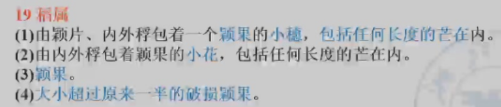
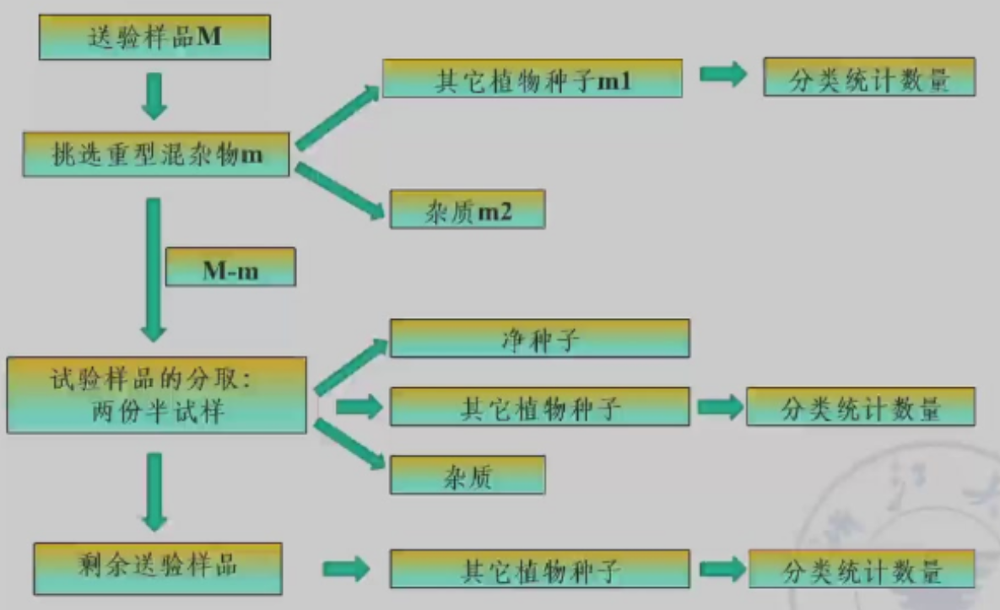

# 种子检验学

## 第一章 绪论

### 一、种子检验的概念和目的

#### （一）概念

1. 种子检验：应用**科学、先进**的方法对种子质量进行**正确的分析测定**，是确保种子质量的重要环节
2. 对象：农业种子，包括植物学上的种子、果实、营养器官。

#### （二）目的

通过对种子的真实性和纯度、净度、发芽率、生活力、活力、种子健康状况、水分含量和千粒重等项目进行检验与测定，选用高质量的种子播种。。

### 二、种子检验的发展史和检验规程

#### （一）种子检验的发展史

1. 国际种子检验发展史
   - 1869年，德国的诺贝建立世界上第一个种子检验站，编写《种子学手册》，成为国际公认的种子科学和种子检验的创始人。
   - 北美官方种子分析者协会（AOSA），欧洲种子检验协会（ESTA）
   - 1924年，国际种子检验协会（International Seed Testing Association，ISTA）成立
   - ……

2. 我国种子检验发展史

#### （二）种子检验规程

1. 国际种子检验规程

   （1）《国际种子检验规程》：唯一国际标准

   （2）国际种子检验证书：通过ISTA授权认可的种子检验室可以签发。橙色国际种子批证书(扦样和检验工作由同一个ISTA认可检验站在该国进行)、绿色国际种子批证书(扦样和检验工作分别由两个在不同国家的ISTA认可检验站进行)和蓝色国际种子样品证书(该ISTA认可检验站只负责进行种子样品的检验工作)。后绿色和橙色合并，只保留橙色和蓝色。

2. 我国种子检验规程

   1983年（1984？）第一次颁布《农作物种子检验规程》（GB 3543—1983）。

   等效采用《1993国际种子检验规程》，编制和颁布了《农作物种子检验规程》（GB/T 3543.1—1995~3543.7—1995）

   （1）种子检验内容：从过程看，分为扦样、检测和结果报告；从测定项目看，有**净度分析、发芽试验、纯度鉴定、水分测定**、生活力测定、种子健康测定、重量测定、种子活力测定等。前四项为我国目前种子质量标准的判定依据。

   （2）种子检验程序：图

   （3）种子检验结果报告

   （4）检验结果报告的内容和要求

### 三、种子质量与种子标准化

#### （一）种子质量的概念

优良品种+优质种子→粮食生产

种子质量(seed quality)是由种子不同特性综合而成的一种概念。种子质量通常包括**品种质量**和**播种质量**两个方面的内容。

品种质量(genetic quality)是指与遗传特性有关的品质，可用**真、纯**两个字概括。

播种质量(sowing quality)是指种子播种后与田间出苗有关的质量，可用**净、壮、饱、健、干、强**概括

在种子质量分级标准中，以品种纯度、种子净度、发芽率和水分4项指标为主，其为必检指标。

#### （二）种子标准化的概念和内容

1. 概念

   就是实行品种标准化和种子质量标准化。

2. 内容

   （1）优良品种标准

   （2）原种和大田用种种子生产技术规程

   （3）种子质量分级标准

   ​    种子质量的优劣直接影响作物产量和产品质量。衡量种子质量优劣的标准。目前，我国将种子分为育种家种子、原种及大田用种三个等级。不同等级的种子对品种纯度、净度、发芽率、水分等质量指标有不同的要求。

   （4）种子检验规程

   （5）种子包装、运输、贮藏标准

#### （三）种子质量分级标准

### 四、检验数据误差与容许误差

扦样，估测

利用样本来推测总体的过程，容许误差

#### （一）检验数据差异的来源与控制

1. 误差来源

   - 扦样引起的差异

   - 种子批质量不同所引起的差异

   - 检测样品大小所引起的差异

     兼顾相对较低的误差和较低的费用

   - 不同种子检验员以及不一致评价引起的差异

   - 试验条件和试验方法引起的误差

2. 误差控制

   前三者由扦样所引起的误差为随机误差，后两者由条件所引起的为系统误差

   系统误差可以控制（凭经验进行修正，容许误差），随机误差不能控制（数理统计模型进行估算）

#### （二）GB/T 3543.1-1995中规定的四种容许误差及其用法

1. 同一检验室同一送验样品重复间的容许误差
2. 从同一种子批扦取的同一或不同送验样品，经同一或另一检验机构检验，比较两次结果是否一致（核对）
3. 从同一种子批中扦取的第二个送验样品，经同一或另一检验机构检验，所得结果与第一次比较（争议）
4. 抽检、统检、仲裁检验、定期检验等与种子质量标准、合同、标签等规定值比较

### 五、种子检验学在现代农业中的作用

### 六、种子检验学与其他学科的关系

## 第二章 种子扦样

### 一、扦样的目的和原则

扦样，通常是利用一种专用的扦样器具，从袋装或散装的种子批取样的工作

#### （一）目的

是从一批大量的种子中，扦取适当数量的有代表性的送验样品供检验之用

#### （二）原则

每个步骤都应把握样品的代表性

1. 种子批的均匀度
   - 只有种子质量均匀的种子批，才有可能扦取代表性样品
   - 对于种子质量不均匀，或存在异质性的种子批应拒绝扦样
   - 怀疑均匀度，可测定其异质性

2. 扦样点的均匀分布
   - 扦样点应均匀分布在种子批的各个部位

3. 各个扦样点扦出种子数量应基本相等
4. 合格扦样员扦样

#### （三）样品的定义和组成

1. 种子批（Seed Lot）

   同一来源、同一品种、同一年度、同一时期收获和质量基本一致，并在规定数量之内的种子

2. 初次样品

   是指对种子批的一次扦取操作中所获得的一部分种子

3. 混合样品

   由种子批内所扦取的全部初次样品合并混合而成的种子

4. 送验样品

   送达种子检验机构的样品

5. 备份样品

   指从相同的混合样品中获得的另外一份样品

6. 试验样品

   指不低于检验规程中所规定重量的供某一检验项目用的样品

7. 次级样品

   指通过分样方法将样品减少而获得的部分种子。相对概念。如送验样品是混合样品的次级样品，试验样品是送验样品的次级样品。

8. 半试样

   指将试验样品分减成一般重量的样品

   

### 二、扦样与分样器具及使用方法

#### （一）扦样器具

1. 袋装种子扦样器

   **单管扦样器**

   **双管扦样器**

   ​	可以水平或垂直使用，但垂直使用时，必须有隔板分成几室

   **带筒式单管扦样器**

   徒手扦样

   倒包扦样

2. 散装种子扦样

   **双管扦样器**

   长柄短筒圆锥形扦样器

   圆锥形扦样器

   气吸式扦样机

3. 种子流种子扦样

#### （二）分样器

要求：分样要均等，各种成分的分配要均匀，分样时种子流畅，并且不躲藏种子，容易清理

1. 圆锥形分样器

2. 横格式分样器

   广泛应用

3. 离心分样器

4. 旋转式分样器

5. 可调式分样器

   可以根据需要调整分样的比例，而不是规定的一分为二

### 三、种子扦样与分样程序

#### （一）扦样前了解种子状况

#### （二）划分种子批

检验规程规定了种子批的最大种子数。如水稻、小麦为25000公斤。

一般理解为种子批一旦通过了正常的清选和加工操作，就认为符合检验规程所规定的“均匀度”要求

种子批的最大粒数限额为1×10^9粒，即10000个单位，每单位为100000粒种子。但是种子批的最大重量（包括各种包衣材料或薄膜）不得超过其规定重量的105%

用单位粒数表示种子批大小时，该种子批的总重量应在检验报告上填报

#### （三）扦取初次样品

1. 袋装种子扦样法

   不是凡是用袋子进行包装的就是袋装种子。质量在15kg-100kg。

   高于则为散装种子。

   （1）计算扦样袋数

​	（2）设置扦样点

​		扦样点应均匀分布于堆垛的上、中、下各个部分。波浪形设点。

​	（3）扦取初次样品

​		棉花种子和花生种子，必须拆开袋口徒手扦样或倒包扦样

2. 小包装种子扦样法

   指在一定量值范围内装在小容器中的定量包装，其质量的量值范围规定等于或小于15kg

   以100kg种子的重量作为扦样的基本单位。将每个单位作为一个容器，再按袋装种子扦样数扦样

   对于具有密封的小包装种子，可直接取一小包装袋作为初次样品

3. 散装种子扦样法

   大于100kg容器的种子批或正在装入容器的种子流

   （1）确定扦样点数

   

   （2）设点
   
   扦样点要均匀分布在散装种子批表面，四角各点要距仓壁50cm。
   （3）按堆高分层
   种子堆高不足两米时，分上、下两层。堆高2-3m时，分上、中、下三层。上层在距顶部以下10-20 cm处，中层在种子堆中心，下层距底部5-10cm处。堆高3m以上再加一层。
   （4）扦取初次样品
   初次样品的数量根据散装种子批的数量而定。
   扦样方法：用散装扦样器，根据扦样点位置，按一定扦样次序扦样，**先扦上层，后扦中层，最后扦下层**，以免搅乱层次而失去代表性。

4. 圆仓（或围囤）开样法
   圆仓或围囤的面积较小，不必分区，只须设扦样点，并按其直径，分别在内、中、外设点。**内点在圆仓中心，中点在圆仓半径的1/2处，外点距圆仓边缘30cm处。**
   扦样时在圆仓的一条直径线上，按上述部位设立内、中、外3个点；再**在此直径垂直的一条线上，按上述部位设2个中点，共设5个点**，圆仓或围囤直径超过7m以上，则再增加2点。其划分层次和扦样方法与散装扦样方法相同。

5. 输送流扦样法

   进仓或出仓。用取样勺从输送流的两侧或中间依次截取。扦样初次样品的数目与散装扦样法相同

6. 包衣种子扦样

   

#### （四）混合样品的制备

从一批种子各个点扦取出来的初次样品充分混合，就组成一个混合样品。

仔细观察

如发现有些样品的品质有显著差异，应把这一部分种子从该批中分出，作为另一批种子，单独扦取混合样品。

如不能将品质有显著差异的种子从该批种子中划分出来的，则应停止扦样或把整批种子经必要处理（如清选、干燥、混合），然后扦样。

#### （五）送验样品的分取

1. 送验样品的最低重量

   通常混合样品与送验样品规定数量相等时，即将混合样品作为送验样品。

   但混合样品数量较多时，可从中分取规定数量的送验样品。

   其样品数量是根据种子大小和作物种类及检验项目而定的。

   根据研究供净度分析的送验样品约为25000粒种子就具有代表性。将此数量折成重量，即为送验样品的最低重量

2. 送验样品的分取

   圆锥分样器、横格分样器、分样板

   徒手减半分取法

​      四分法

#### （六）送验样品的包装和发送

### 四、样品的保存和管理

## 第三章 种子净度分析与其他植物种子数目测定

### 一、净度分析的目的和意义

#### （一）目的

清洁干净程度

测定供检样品不同成分（净种子、其他植物种子和杂质）的重量百分率和样品混合物特性。并据此推测种子批的组成。

#### （二）意义

1. 推断种子批的组成情况，计算种子利用价值
2. 其他植物种子、杂质种类和含量分析为种子加工与贮藏提供依据
3. 从其他植物种子的种类和含量，决定种子批的取舍和危害

### 二、净种子、其他植物种子和杂质区分总则

#### （一）净种子

1. 下列构造**凡能明确地鉴别出它们是属于所分析的种**（已变成菌核、黑穗病孢子团或线虫瘿除外），即使是未成熟的、瘦小的、皱缩的、带病的或发过芽的种子单位都应作为净种子。
   - 完整的种子单位
   - 大于原来大小一半的破损种子单位
     - 种子单位即通常所见的传播单位，不仅包含真种子，也包含附属成分

2. 例外
   - 豆科、十字花科，其种皮完全脱落的种子单位列为杂质
   - 豆科种子单位的分离子叶也列为杂质
   - ……

#### （二）其他植物种子

指净种子以外的其他植物种子

#### （三）杂质

指除净种子和其他植物种子外的种子单位和所有其他物质及构造

菟丝子种子

#### （四）主要作物净种子定义

和书上表格有出入（当芒长超过小花长度，须将芒除去）

### 三、种子净度分析方法

#### （一）重型混杂物检查

凡颗粒与供检种子在**大小或重量上明显不同**且严重影响结果的混杂物，如土块、石块或**小粒种子中混有大粒种子**等称为重型混杂物。

个数少，不易混匀，分样易不匀

拣出（m），分出其他植物种子（m1）和杂质（m2）

#### （二）试验样品的分取和称重

1. 试样质量

   大约2500粒种子（折成重量）即具有代表性。规定最低

2. 试样分取

   采用分样器/分样板/徒手分取规定重量的一份试样，或两份半试样（试样重量的至少一半）进行净度分析。**重复样品需独立取得**。

   第一份试样或半试样分取后，**将所有剩下的送验样品重新混匀再分取第二份试样或半试样**。

3. 试样称重

   接近规定的最低重量

   

#### （三）试验样品的鉴定和分离

净种子定义中所提及的种子单位，**如没有损伤到种皮或果皮，则不管其饱满度如何均作为净种子（或其它植物种子）**。

如种皮或果皮有一裂口时，**必须判断留下部分是否超过原来大小的一半**。超过一半者可归为净种子（或其它植物种子）。

如不能迅速作出这种判断，则将其列为净种子（或其它植物种子），没有必要将每粒种子翻过来观察其下面是否有洞或其它损伤。

#### （四）结果计算和表示

1. 称重计算

   各试样各部分分别称重

   （1）检查分析过程的重量增失

   如果两者之间重量差异超过原试样重的5%，表明可能有差错，必须重新分析

   （2）计算各成分的重量百分率

   试样，一位小数；半试样，两位小数

2. 检查容许误差

   （1）半试样

   平均值查表

   （2）试样

   两份，未超过，取平均；超过，再分析一份，两倍容许误差内，取平均值

3. 数字修约

   各种成分的最后填报结果应保留一位小数，从最大值（通常是净种子部分）增减0.1%。

4. 含有重型混杂物的结果换算

   - 净种子：
     $$
     P_2=P_1×\frac{M-m}{M}
     $$

   - 其他植物种子：
     $$
     OS_2=OS_1×\frac{M-m}{M}+\frac{m_1}{M}×100\%
     $$

   - 杂质：
     $$
     I_2=I_1×\frac{M-m}{M}+\frac{m_2}{M}×100\%
     $$

   - 其中M为送验样品重量，m为重型混杂物的重量……

   - 最后应检查
     $$
     P_2+I_2+OS_2=100\%
     $$

#### （五）结果报告

净度分析的结果应保留一位小数

<0.05%,微量；零，-0.0-

某类杂质或某一种其他植物种子>=1%，注明

核对检查——一对一对

#### （六）包衣种子的净度分析程序

**不脱去包衣材料的种子**

1. 送样和试样质量

2. 试样分取和称重

   区分为净丸化种子（净包膜种子）、未丸化种子（未包膜种子）和杂质、

   **标准**

3. 种真实性的鉴定
4. 结果计算和报告

**脱去包衣材料的种子**

多了脱去包衣的步骤，其他一致

### 四、其他植物种子数目测定

测定样品中其他植物种子的数目或找出指定的其他植物种子

Why？分布不均，有害种子必除

#### （一）测定方法

1. 完全检验

   试样不得小于25000个种子单位的重量或规定重量

   取出试样中**所有的**其他植物种子，并数出每个种的种子数

2. 有限检验

   只限于从整个试验样品中找出送验者指定的其他植物的种子

3. 简化检验

   如果送验者所指定的种难以鉴定时，可采用简化检验。

   简化检验是用规定试验样品重量的五分之一（最少量）对所有其他植物种子进行鉴定。

   简化检验的检验方法同完全检验。

4. 简化有限检验

   从试样少于规定重量的部分样品中检出指定种的测定方法

#### （二）结果计算

发现种子数

折算为样品单位重量（Kg）所含的种子数
$$
其他植物种子含量（粒/kg）=\frac{其他植物种子数}{试验样品重量}×1000
$$

#### （三）核查容许差距

#### （四）结果报告

要考虑实际情况，检测机构核查检测的数据好于公司自己所宣称的数据，不能单单凭公式判断

#### （五）包衣种子其他植物种子数目测定程序

