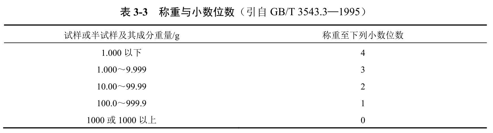

# 种子检验学

## 第一章 绪论

### 一、种子检验的概念和目的

#### （一）概念

1. 种子检验：应用**科学、先进**的方法对种子质量进行**正确的分析测定**，是确保种子质量的重要环节
2. 对象：农业种子，包括植物学上的种子、果实、营养器官。

#### （二）目的

通过对种子的真实性和纯度、净度、发芽率、生活力、活力、种子健康状况、水分含量和千粒重等项目进行检验与测定，选用高质量的种子播种。。

### 二、种子检验的发展史和检验规程

#### （一）种子检验的发展史

1. 国际种子检验发展史
   - 1869年，德国的诺贝建立世界上第一个种子检验站，编写《种子学手册》，成为国际公认的种子科学和种子检验的创始人。
   - 北美官方种子分析者协会（AOSA），欧洲种子检验协会（ESTA）
   - 1924年，国际种子检验协会（International Seed Testing Association，ISTA）成立
   - ……

2. 我国种子检验发展史

#### （二）种子检验规程

1. 国际种子检验规程

   （1）《国际种子检验规程》：唯一国际标准

   （2）国际种子检验证书：通过ISTA授权认可的种子检验室可以签发。橙色国际种子批证书(扦样和检验工作由同一个ISTA认可检验站在该国进行)、绿色国际种子批证书(扦样和检验工作分别由两个在不同国家的ISTA认可检验站进行)和蓝色国际种子样品证书(该ISTA认可检验站只负责进行种子样品的检验工作)。后绿色和橙色合并，只保留**橙色和蓝色**。

2. 我国种子检验规程

   1983年（1984？）第一次颁布《农作物种子检验规程》（GB 3543—1983）。

   等效采用《1993国际种子检验规程》，编制和颁布了《农作物种子检验规程》（GB/T 3543.1—1995~3543.7—1995）

   （1）种子检验内容：从过程看，分为扦样、检测和结果报告；从测定项目看，有**净度分析、发芽试验、纯度鉴定、水分测定**、生活力测定、种子健康测定、重量测定、种子活力测定等。前四项为我国目前种子质量标准的判定依据。

   （2）种子检验程序：图

   （3）种子检验结果报告

   （4）检验结果报告的内容和要求

### 三、种子质量与种子标准化

#### （一）种子质量的概念

优良品种+优质种子→粮食生产

**种子质量(seed quality)**是由种子不同特性综合而成的一种概念。种子质量通常包括**品种质量**和**播种质量**两个方面的内容。

- 品种质量(genetic quality)是指与遗传特性有关的品质，可用**真、纯**两个字概括。
- 播种质量(sowing quality)是指种子播种后与田间出苗有关的质量，可用**净、壮、饱、健、干、强**概括

在**种子质量分级标准**中，以品种纯度、种子净度、发芽率和水分4项指标为主，其为必检指标。

#### （二）种子标准化的概念和内容

1. 概念

   就是实行品种标准化和种子质量标准化。

   - 品种标准化：大田推广的优良品种符合**品种标准**，即保持本品种的优良遗传特征和特性
   - 种子质量标准化：大田所用农作物优良品种的种子质量达到国家规定的**质量标准**

2. 内容

   （1）优良品种标准

   （2）原种和大田用种种子生产技术规程

   （3）种子质量分级标准

   ​    种子质量的优劣直接影响作物产量和产品质量。衡量种子质量优劣的标准。目前，我国将种子分为育种家种子、原种及大田用种三个等级。不同等级的种子对**品种纯度、净度、发芽率、水分**等质量指标有不同的要求。

   （4）种子检验规程

   （5）种子包装、运输、贮藏标准

#### （三）种子质量分级标准

### 四、检验数据误差与容许误差☆

扦样，估测

利用样本来推测总体的过程，容许误差

#### （一）检验数据差异的来源与控制

1. 误差来源

   - 扦样引起的差异

   - 种子批质量不同所引起的差异

   - 检测样品大小所引起的差异

     兼顾相对较低的误差和较低的费用

   - 不同种子检验员以及不一致评价引起的差异

   - 试验条件和试验方法引起的误差

2. 误差控制

   前三者由扦样所引起的误差为**随机误差**，后两者由条件所引起的为**系统误差**

   系统误差可以控制（凭经验进行修正，容许误差），随机误差不能控制（数理统计模型进行估算）

#### （二）GB/T 3543.1-1995中规定的四种容许误差及其用法

1. 同一检验室同一送验样品重复间的容许误差
2. 从同一种子批扦取的同一或不同送验样品，经同一或另一检验机构检验，比较两次结果是否一致（核对）
3. 从同一种子批中扦取的第二个送验样品，经同一或另一检验机构检验，所得结果与第一次比较（争议）
4. 抽检、统检、仲裁检验、定期检验等与种子质量标准、合同、标签等规定值比较

### 五、种子检验学在现代农业中的作用

种子检验与种子质量监督

作用：

- 把关作用
- 预防作用
- 行政监督作用
- 报告作用
- 调解种子纠纷的重要依据
- 提供信息反馈和辅助决策
- 种子企业内部质量控制

### 六、种子检验学与其他学科的关系

## 第二章 种子扦样

### 一、扦样的目的和原则

扦样，通常是利用一种专用的扦样器具，从袋装或散装的种子批取样的工作

#### （一）目的

是从一批大量的种子中，扦取适当数量的**有代表性**的送验样品供检验之用

#### （二）原则

每个步骤都应把握样品的代表性

1. 种子批的均匀度
   - 只有种子质量均匀的种子批，才有可能扦取代表性样品
   - 对于种子质量不均匀，或存在异质性的种子批应拒绝扦样
   - 怀疑均匀度，可测定其异质性

2. 扦样点的均匀分布
   - 扦样点应均匀分布在种子批的各个部位

3. 各个扦样点扦出种子数量应基本相等
4. 合格扦样员扦样

#### （三）样品的定义和组成

1. **种子批（Seed Lot）**

   同一来源、同一品种、同一年度、同一时期收获和质量基本一致，并在规定数量之内的种子

   物理外观一致、具有唯一标识并在规定数量之内的种子

2. 初次样品

   是指对种子批的一次扦取操作中所获得的一部分种子

3. 混合样品

   由种子批内所扦取的全部初次样品合并混合而成的种子

4. 送验样品

   送达种子检验机构的样品

5. 备份样品

   指从相同的混合样品中获得的另外一份样品

6. 试验样品

   指不低于检验规程中所规定重量的供某一检验项目用的样品

7. 次级样品

   指通过分样方法将样品减少而获得的部分种子。相对概念。如送验样品是混合样品的次级样品，试验样品是送验样品的次级样品。

8. 半试样

   指将试验样品分减成一半重量的样品

   

### 二、扦样与分样器具及使用方法

#### （一）扦样器具

1. 袋装种子扦样器

   **单管扦样器**

   **双管扦样器**

   ​	可以水平或垂直使用，但垂直使用时，必须有隔板分成几室

   **带筒式单管扦样器**

   徒手扦样

   倒包扦样

2. 散装种子扦样

   **双管扦样器**

   长柄短筒圆锥形扦样器

   圆锥形扦样器

   气吸式扦样机

3. 种子流种子扦样

#### （二）分样器

要求：分样要均等，各种成分的分配要均匀，分样时种子流畅，并且不躲藏种子，容易清理

1. 圆锥形分样器

2. 横格式分样器

   广泛应用

3. 离心分样器

4. 旋转式分样器

5. 可调式分样器

   可以根据需要调整分样的比例，而不是规定的一分为二

### 三、种子扦样与分样程序

#### （一）扦样前了解种子状况

#### （二）划分种子批

检验规程规定了种子批的最大种子数。如水稻、小麦为25000公斤。

一般理解为种子批一旦通过了正常的清选和加工操作，就认为符合检验规程所规定的“均匀度”要求

种子批的最大粒数限额为1×10^9粒，即10000个单位，每单位为100000粒种子。但是种子批的最大重量（包括各种包衣材料或薄膜）不得超过其规定重量的105%

用单位粒数表示种子批大小时，该种子批的总重量应在检验报告上填报

#### （三）扦取初次样品

1. 袋装种子扦样法

   **不是凡是用袋子进行包装的就是袋装种子。质量在15kg-100kg。**

   高于则为散装种子。

   （1）计算扦样袋数

​	（2）设置扦样点

​		扦样点应均匀分布于堆垛的上、中、下各个部分。波浪形设点。

​	（3）扦取初次样品

​		棉花种子和花生种子，必须拆开袋口徒手扦样或倒包扦样

2. 小包装种子扦样法

   指在一定量值范围内装在小容器中的定量包装，其质量的量值范围规定等于或小于15kg

   以100kg种子的重量作为扦样的基本单位。将每个单位作为一个容器，再按袋装种子扦样数扦样

   对于具有密封的小包装种子，可直接取一小包装袋作为初次样品

3. 散装种子扦样法

   大于100kg容器的种子批或正在装入容器的种子流

   （1）确定扦样点数

   

   （2）设点
   
   扦样点要均匀分布在散装种子批表面，四角各点要距仓壁50cm。
   （3）按堆高分层
   种子堆高不足两米时，分上、下两层。堆高2-3m时，分上、中、下三层。上层在距顶部以下10-20 cm处，中层在种子堆中心，下层距底部5-10cm处。堆高3m以上再加一层。
   （4）扦取初次样品
   初次样品的数量根据散装种子批的数量而定。
   扦样方法：用散装扦样器，根据扦样点位置，按一定扦样次序扦样，**先扦上层，后扦中层，最后扦下层**，以免搅乱层次而失去代表性。

4. 圆仓（或围囤）开样法
   圆仓或围囤的面积较小，不必分区，只须设扦样点，并按其直径，分别在内、中、外设点。**内点在圆仓中心，中点在圆仓半径的1/2处，外点距圆仓边缘30cm处。**
   扦样时在圆仓的一条直径线上，按上述部位设立内、中、外3个点；再**在此直径垂直的一条线上，按上述部位设2个中点，共设5个点**，圆仓或围囤直径超过7m以上，则再增加2点。其划分层次和扦样方法与散装扦样方法相同。

5. 输送流扦样法

   进仓或出仓。用取样勺从输送流的两侧或中间依次截取。扦样初次样品的数目与散装扦样法相同

6. 包衣种子扦样

   

#### （四）混合样品的制备

从一批种子各个点扦取出来的初次样品充分混合，就组成一个混合样品。

仔细观察

如发现有些样品的品质有显著差异，应把这一部分种子从该批中分出，作为另一批种子，单独扦取混合样品。

如不能将品质有显著差异的种子从该批种子中划分出来的，则应停止扦样或把整批种子经必要处理（如清选、干燥、混合），然后扦样。

#### （五）送验样品的分取

1. 送验样品的最低重量

   通常混合样品与送验样品规定数量相等时，即将混合样品作为送验样品。

   但混合样品数量较多时，可从中分取规定数量的送验样品。

   其样品数量是根据种子大小和作物种类及检验项目而定的。

   根据研究供净度分析的送验样品约为**25000粒种子**就具有代表性。将此数量折成重量，即为送验样品的最低重量

2. 送验样品的分取

   圆锥分样器、横格分样器、分样板

   徒手减半分取法

​      四分法

#### （六）送验样品的包装和发送

### 四、样品的保存和管理

## 第三章 种子净度分析与其他植物种子数目测定

### 一、净度分析的目的和意义

#### （一）目的

清洁干净程度

测定供检样品不同成分（净种子、其他植物种子和杂质）的重量百分率和样品混合物特性。并据此推测种子批的组成。

#### （二）意义

1. 推断种子批的组成情况，计算种子利用价值
2. 其他植物种子、杂质种类和含量分析为种子加工与贮藏提供依据
3. 从其他植物种子的种类和含量，决定种子批的取舍和危害

### 二、净种子、其他植物种子和杂质区分总则

#### （一）净种子

1. 下列构造**凡能明确地鉴别出它们是属于所分析的种**（已变成菌核、黑穗病孢子团或线虫瘿除外），即使是未成熟的、瘦小的、皱缩的、带病的或发过芽的种子单位都应作为净种子。
   - 完整的种子单位
   - 大于原来大小一半的破损种子单位
     - 种子单位即通常所见的传播单位，不仅包含真种子，也包含附属成分

2. 例外
   - 豆科、十字花科，其种皮完全脱落的种子单位列为杂质
   - 豆科种子单位的分离子叶也列为杂质
   - ……

#### （二）其他植物种子

指净种子以外的其他植物种子

#### （三）杂质

指除净种子和其他植物种子外的种子单位和所有其他物质及构造

菟丝子种子

#### （四）主要作物净种子定义

和书上表格有出入（当芒长超过小花长度，须将芒除去）

### 三、种子净度分析方法

#### （一）重型混杂物检查

凡颗粒与供检种子在**大小或重量上明显不同**且严重影响结果的混杂物，如土块、石块或**小粒种子中混有大粒种子**等称为重型混杂物。

个数少，不易混匀，分样易不匀

拣出（m），分出其他植物种子（m1）和杂质（m2）

#### （二）试验样品的分取和称重

1. 试样质量

   大约**2500粒种子**（折成重量）即具有代表性。规定最低

2. 试样分取

   采用分样器/分样板/徒手分取规定重量的一份试样，或两份半试样（试样重量的至少一半）进行净度分析。**重复样品需独立取得**。

   第一份试样或半试样分取后，**将所有剩下的送验样品重新混匀再分取第二份试样或半试样**。

3. 试样称重

   接近规定的最低重量

   

#### （三）试验样品的鉴定和分离

净种子定义中所提及的种子单位，**如没有损伤到种皮或果皮，则不管其饱满度如何均作为净种子（或其它植物种子）**。

如种皮或果皮有一裂口时，**必须判断留下部分是否超过原来大小的一半**。超过一半者可归为净种子（或其它植物种子）。

如不能迅速作出这种判断，则将其列为净种子（或其它植物种子），没有必要将每粒种子翻过来观察其下面是否有洞或其它损伤。

#### （四）结果计算和表示

1. 称重计算

   各试样各部分分别称重

   （1）检查分析过程的重量增失

   如果两者之间重量差异超过原试样重的5%，表明可能有差错，必须重新分析

   （2）计算各成分的重量百分率

   试样，一位小数；半试样，两位小数

2. 检查容许误差

   （1）半试样

   平均值查表

   （2）试样

   两份，未超过，取平均；超过，再分析一份，两倍容许误差内，取平均值

3. 数字修约

   各种成分的最后填报结果应保留一位小数，从最大值（通常是净种子部分）增减0.1%。

4. 含有重型混杂物的结果换算

   - 净种子：
     $$
     P_2=P_1×\frac{M-m}{M}
     $$

   - 其他植物种子：
     $$
     OS_2=OS_1×\frac{M-m}{M}+\frac{m_1}{M}×100\%
     $$

   - 杂质：
     $$
     I_2=I_1×\frac{M-m}{M}+\frac{m_2}{M}×100\%
     $$

   - 其中M为送验样品重量，m为重型混杂物的重量……

   - 最后应检查
     $$
     P_2+I_2+OS_2=100\%
     $$

#### （五）结果报告

净度分析的结果应保留一位小数

<0.05%,微量；零，-0.0-

某类杂质或某一种其他植物种子>=1%，注明

核对检查——一对一对

#### （六）包衣种子的净度分析程序

**不脱去包衣材料的种子**

1. 送样和试样质量

2. 试样分取和称重

   区分为净丸化种子（净包膜种子）、未丸化种子（未包膜种子）和杂质、

   **标准**

3. 种真实性的鉴定
4. 结果计算和报告

**脱去包衣材料的种子**

多了脱去包衣的步骤，其他一致

### 四、其他植物种子数目测定

测定样品中其他植物种子的数目或找出指定的其他植物种子

Why？分布不均，有害种子必除

#### （一）测定方法

1. 完全检验

   试样不得小于**25000个种子单位**的重量或规定重量

   取出试样中**所有的**其他植物种子，并数出每个种的种子数

2. 有限检验

   只限于从整个试验样品中找出送验者指定的其他植物的种子

3. 简化检验

   如果送验者所指定的种难以鉴定时，可采用简化检验。

   简化检验是用规定试验样品重量的五分之一（最少量）对所有其他植物种子进行鉴定。

   简化检验的检验方法同完全检验。

4. 简化有限检验

   从试样少于规定重量的部分样品中检出指定种的测定方法

#### （二）结果计算

发现种子数

折算为样品单位重量（Kg）所含的种子数
$$
其他植物种子含量（粒/kg）=\frac{其他植物种子数}{试验样品重量}×1000
$$

#### （三）核查容许差距

#### （四）结果报告

要考虑实际情况，检测机构核查检测的数据好于公司自己所宣称的数据，不能单单凭公式判断

#### （五）包衣种子其他植物种子数目测定程序

## 第四章 种子发芽试验

### 一、发芽试验的目的和意义

#### （一）发芽试验的目的

测定种子的最大发芽潜力，以判断不同种子批的质量及田间播种价值。
$$
种子批种用价值=种子净度×发芽率
$$
净度高，发芽率低，不适种用；发芽率高，净度低，则可清选后种用。

#### （二）发芽力的含义和表示方法

发芽力：种子在适宜条件下发芽并长成正常幼苗的能力，通常用发芽势和发芽率表示。

- 发芽势：在规定时间（初次计数时间）内，长成正常幼苗的种子数占供试种子数的百分率。种子活力。
- 发芽率：末次计数内长成正常幼苗数占供试种子数的百分率。生活力。

#### （三）发芽试验的意义

标准化的发芽试验

准确评价种子批的种用价值，对农业生产和种子经营、质量管理意义重大。

- 种子收购：分级定价
- 种子贮藏：质量变化，安全贮藏
- 种子加工：加工工艺
- 调种：防止盲目调运发芽力低的种子，节约人力财力
- 播种：选发芽力高的种子播种

### 二、发芽试验的设备和用品

#### （一）发芽箱和发芽室

1. 发芽箱：提供种子发芽所需温度、光照、湿度等条件。最主要是温度。
2. 人工气候箱：控温、控湿、控光
3. 发芽室：大型气候箱

#### （二）数种与置床设备

1. 活动数种板
2. 真空数种仪
3. 电子自动数种仪

#### （三）发芽床和发芽容器

1. 发芽床

   - 由介质（水和支撑）及发芽器皿构成
   - 保水、通气、无毒、无病菌、一定强度

2. **发芽床介质和使用方法**

   - 纸：专用发芽纸、滤纸和纸巾
     - 要求：吸水良好、持水力强；无毒质；无病菌；韧性好
     - 纸床使用方法
       - 纸上（TP）：将种子放在一层或多层纸上发芽
       - 纸间（BP）：将种子放在两层纸中间
       - 褶裥纸（PP）：将种子放在类似手风琴的具有褶裥的纸条内，放在盒内或直接放在湿型发芽箱内
   - 砂：应选用无任何化学药物污染的细砂或清水砂。
     - 使用前：洗涤；消毒；过筛，0.05-0.8mm的砂粒，要保水+通气；加水拌匀，合适含水量。
     - 砂床使用方法
       - 砂上（TS）：种子压入砂表层。适用于小、中粒种子
       - 砂中（S）：种子播在一层平整的湿砂上，**加盖松散湿砂**。适用大、中粒种子。
       - 豌豆的TPS：纸上盖砂
       - **当纸床污染，或对携带有病菌的种子样品鉴定困难时，可用砂床替代纸床。**
   - 土壤
     - 除规定必须使用外，当纸床或砂床上的幼苗出现中毒症状时或对幼苗鉴定发生怀疑时，或为了比较或研究目的，可采用土壤床
     - 使用前应高温消毒。适宜水分含量

2. 发芽容器

   培养皿、发芽盘和发芽盒

   要求：必须透明、保湿、无毒；具有空间；氧气供应

   正方形（12×12×5cm），小粒和中粒

   长方形（18×14×9cm），大粒

#### （四）其他用品和化学试剂

1. 破除休眠：硝酸、硝酸钾、赤霉素、过氧化氢
2. 消毒：次氯酸钠

***对于发芽技术规定的解读：***

- 初次计数天数：发芽势统计
- 末次计数天数：发芽多长时间，并不是到露白，要到得到正常幼苗。**因为要看的是能否在田间长出正常幼苗**
- 发芽床和温度：根据条件选择。如白天高温，晚上低温。变温有打破休眠的作用。实验的话恒温，避免引入变量。

### 三、标准发芽试验方法

#### （一）选用发芽床

根据检验规程选用适宜的发芽床

#### （二）数种置床

1. 试样来源和数量

   - 充分混合的净种子，随机数取，一般400粒。
     - 小中粒种子——100粒为一重复
     - 大粒种子——50粒
     - 特大粒种子——25粒
   - 复胚种子单位可视为单粒种子

2. 置床

   均匀，空隙，良好接触水分

3. 贴放标签

   样品编号、品种名称、重复序号、日期。

   发芽纸沾水贴在内侧

   盖好盖子

#### （三）发芽培养和管理检查

1. 发芽培养

   - 温度：选取适宜温度
     - 对于新收获的休眠种子和陈种子，选用变温或较低恒温
   - 光照：大多数最好加光培养
     - 光照抑制霉菌；利于正常幼苗鉴定，区分黄化和白化不正常幼苗
     - 需暗型种子，黑暗条件下培养

2. 检查管理

   保持适宜的发芽条件

   - 湿度、温度
   - 洗涤去霉。超5%更换发芽床
   - 去除腐烂死亡种子，记载

#### （四）试验持续时间

- 试验前或试验间用于破除休眠处理所需时间不作为发芽试验时间的一部分
- 如果样品在规定的试验时间内只有几粒种子开始发芽，则试验时间可延长7d，或延长规定时间的一半
- 根据试验情况，可增加计数的次数，最少两次。
- 如果在规定的试验时间前，样品已达到最高发芽率，则该试验可提前结束。

#### （五）鉴定幼苗和观察计数

1. 按幼苗鉴定标准鉴定。要在主要构造已发育到一定时期进行（子叶伸出，初生叶展开，叶片从胚芽鞘伸出）
2. 发育良好拣出；不正常留到末次计数；腐烂发霉及时除去，并计数
3. 末次计数时，按正常幼苗、不正常幼苗、新鲜不发芽种子、硬实和死种子进行分类计数和记载

#### （六）重新试验

1. 怀疑种子有休眠（即有较多的新鲜不发芽种子）
2. 真菌或细菌蔓延
3. 正确鉴定幼苗数有困难，砂床或土壤床重新试验
4. 试验条件、幼苗鉴定计数有差错
5. 当100粒种子重复间的差距超过最大容许差距
   - 重复间的最大容许差距和试验间的最大容许差距不同
   - 试验间的差距反映两次试验的一致性，应选取有一致性的两次试验取平均值

#### （七）计算与结果报告

须填报正常幼苗、不正常幼苗、硬实、新鲜不发芽种子和死种子的百分率。发芽床、温度、持续时间、促进发芽的处理方法

-0-

**每个重复以100粒计，相邻的副重复合并成100粒的重复**

**修约**

- 保留整数
- 正常幼苗百分率修约至最接近的整数。计算其余成分百分率的整数，并获得其总和。如果总和为100，修约程序到此结束。
  - 如果总和不是100，继续执行下列程序：
    在不正常幼苗、硬实、新鲜不发芽种子和死种子中，首先找出其百分率中小数部分最大值者，修约此数至最大整数，其次计算其余成分百分率的整数获得其总和，如果总和为100，修约程序到此结束，如果不是100，重复此程序
  - 如小数部分相同，优先次序为**不正常幼苗、硬实、新鲜不发芽种子和死种子**。

### 四、幼苗鉴定

#### （一）发芽和幼苗鉴定术语

😔详见书P77

未发芽的种子：规定条件和时间下，仍不能发芽的种子，包括硬实、新鲜不发芽种子、死种子和其他类型种子

扭曲构造

环形构造

50%规则：如果整个子叶组织或初生叶有一半或一半以上的面积具有功能，则这种幼苗可列为正常幼苗。当从**子叶着生点到下胚轴有损伤和腐烂的迹象时**，这时不能采用50%规则。当**初生叶形状正常，只是叶片面积较小时**，也不能应用50%规则。

#### （二）幼苗的出土类型和主要构造

1. 幼苗出土类型：子叶出土型和子叶留土型
2. 幼苗的主要构造：根系，幼苗中轴（上胚轴、下胚轴、顶芽），子叶，胚芽鞘

#### （三）幼苗鉴定总则

1. 正常幼苗的鉴定标准

   （1）完整幼苗

   - 发育良好的根系
   - 发育良好的幼苗中轴
     - 出土下胚轴
     - 留土上胚轴
     - ……
   - 具有特定数目的子叶
   - 具有展开、绿色的初生叶
   - 具有一个顶芽或苗端
   - 禾本科胚芽鞘

   （2）带有轻微缺陷的幼苗

   - 初生根……
   - 下胚轴、上胚轴或中胚轴局部损伤
   - 子叶（采用50%规则）
   - 初生叶
     - 菜豆属的初生叶形状正常，大于正常大小的四分之一

   - 胚芽鞘

   （3）次生感染的幼苗

2. 不正常幼苗的鉴定标准

   （1）受损伤的幼苗

   （2）畸形或不匀称的幼苗

   （3）腐烂的幼苗

### 五、包衣种子发芽试验

不脱去包衣材料的净丸化（净包膜）种子和脱去包衣材料的净种子两种方法

……

### 六、快速发芽试验方法

1. 玉米剥去胚部种皮法
2. 水稻去壳法
3. 禾谷类、豆类高温盖砂法
4. 棉花硫酸脱绒切割法
5. 玉米、棉花毛巾卷发芽法
6. 菠菜剥壳法

## 第五章 种子生活力测定

### 一、种子生活力的概念和测定

#### （一）种子生活力的概念

种子生活力指种子发芽的潜在能力或种胚所具有的生命力

#### （二）种子生活力测定意义

1. 测定休眠种子的生活力
2. 快速预测种子发芽能力

### 二、种子生活力四唑测定

#### （一）发展简史

#### （二）测定原理

在种子组织活细胞内**脱氢酶**的作用下，无色的氯化三苯基四氮唑，接收活种子代谢过程中呼吸链上的氢，在活细胞里变成**还原态的红色**、稳定、不扩散的三苯基甲臜

- 颜色差异：区别健全的、衰弱的和死亡的组织
- 染色的深浅：区别健壮程度，越深生活力越旺盛
- 坏死组织部位与大小：种子有无生活力

局部解剖图形的四唑测定——即根据种子胚和活营养组织局部解剖染色部位及颜色状况，鉴定种子胚的死亡部分，查明种子死亡的原因。

#### （三）化学试剂

1. 四唑

   - TTC，TTB，TZ
   - 易溶于水，具有微毒
   - 遇直射光线会被还原成粉红色。棕色瓶，黑纸包裹。
   - 最好现配现用

2. 磷酸缓冲液

3. 乳酸苯酚透明液

   使小粒豆类和牧草种子的种皮、稃壳或胚乳变为透明，**以便透过这些部分清楚地观察其胚主要构造的染色情况**

#### （四）特点

原理可靠、结果准确、省时快速、**不受休眠限制**、方法简便、成本低廉

应用最广泛

#### （五）测定程序

1. 来源：净种子，发芽末期休眠种子，委托检验的种子样品

2. 预处理

   - 预措：在种子种子预湿前除去种子的外部附属物和在种子非要害部位弄破种皮，但不能损伤胚。绝大部分不需要
   - 预湿：让种子吸湿
     - 缓慢润湿：适用于那些直接浸在水中容易破裂和损伤的种子，以及已经劣变的种子或过分干燥的种子
     - 水中浸渍：种子吸水快、均匀，并可缩殖预湿时间。**适用于种子直接浸入水中不会造成组织破裂损伤，并不会影响鉴定结果的种子种类**
     - 双氧水溶液浸种：加快种子吸胀和促进酶的活化。0.3%过氧化氢溶液

3. 染色前的样品准备

   大多数种子在染色前必须采用适当的方法使胚的主要构造和活的营养组织暴露出来

4. 四唑染色

5. 鉴定前处理

6. 观察鉴定

   一般鉴定原则是，凡是胚的主要构造及有关活营养组织染成有光泽的鲜红色，且组织状态正常的，为有生活力种子

7. 结果表示与报告

   整数。四唑测定有生活力的种子__%

### 三、种子生活力的其他测定方法

#### （一）甲烯蓝法MB

以甲烯兰作受体，使甲烯兰由蓝色的氧化型变为无色的还原型甲烯白，无生活力的种子则无此反应

#### （二）溴麝香草酚蓝法BTB

酸度。酸性呈黄色，碱性呈蓝色，中间经过绿色。活种子周围呈黄色晕圈，而无生活力种子无此反应

#### （三）红墨水染色法

原生质膜选择透性

靛红染色法：靛红染成蓝色为死胚，活种子胚为无色

#### （四）软X射线造影技术

波长较长，穿透力弱

重金属盐

- 死组织-黑暗-透明（底片上）-黑（照片）
- 活组织-透明-黑暗（底片上）-白（照片）

## 第六章 种子活力理论与测定方法

### 一、种子活力的概念及意义

#### （一）种子活力的概念和定义

1. 种子活力是种子质量的重要指标，也是种用价值的主要组成部分，与种子田间出苗密切相关。
2. 相关定义
   - 在一个广泛的环境下，衡量发芽率可接受的种子批的活性和表现的那些种子特性的综合表现
   - 在广泛的田间条件下，决定种子**迅速整齐出苗和长成正常幼苗**潜在能力的总称

#### （二）种子活力与种子生活力、发芽力的关系

1. 相关概念

   - 种子生活力：种子的发芽潜在能力和种胚所具有的生命力，通常指一批种子中**具有生命力种子数百分比**
   - 种子发芽力：种子在适宜条件下发芽并长成正常植株的能力，通常用发芽势和发芽率表示
   - 广义的种子生活力应包括种子发芽力

2. 关系

   

种子活力与种子发芽力（生活力）对种子劣变的敏感性有很大的差异

这一模式图既表明在适宜的环境条件下，种子本身的潜能是主要限制因子，又体现出在逆境胁迫条件下种子的适应程度，从而将活力的概念推进了一步。

#### (三)种子活力的重要意义

1. 提高田间出苗率
2. 抵御不良环境条件
3. 增强对病虫杂草竞争能力
4. 抗寒力强，适于早播
5. 节约播种费用
6. 增加作物产量
7. 提高种子耐藏性

### 二、种子活力测定方法

#### （一）种子活力测定方法概述和分类

1. ISTA
   - 推荐两种：**电导率测定和加速老化试验**
   - 建议七种：
     - 抗冷测定
     - 低温发芽测定
     - 控制劣变测定
     - 复合逆境活力测定
     - 希尔特纳测定
     - 幼苗生长测定
     - 四唑测定
2. 直接法和间接法
   - 直接法：是模拟田间不良条件，观察种子出苗能力或幼苗生长速度和健壮度。
   - 间接法：是测定某些与种子活力有关的生理生化指标，如酶的活性、浸泡液的电导率、种子呼吸强度等。

#### （二）种子活力测定方法的选用

1. 选用原则

   （1）根据当地土壤气候条件选用适宜的方法

   （2）根据作物的特性选用适宜的方法

2. 选用要求

   （1）节约费用

   （2）简单易行

   （3）快速省时

   （4）结果准确

   （5）重演性好

3. 活力测定方法的基本要求

   （1）试样种子：净种子

   （2）方法和试验条件

   （3）对照样品

   （4）结果报告：其他测定栏内，检测方法说明（测定方法，条件包括时间、温度和种子水分等信息）

#### （三）可能列入国标的活力测定方法

1. 伸长胚根计数测定

   （1）适用范围：普通玉米种子的田间出苗测定

   （2）原理：伸长胚根的种子数量多，则表明种子发芽速率快、活力高；反之，则表明种子活力低

   （3）试验温度：（20±1）℃或（13±1）℃。每24h监测一次温度并翻转纸巾卷

   （4）计数时间：取决于试验温度

   （5）判断标准：出现清晰明显的伸长胚根。肉眼2mm以上

   （6）结果计算与表达：容许差距

   （7）结果填报：最接近整数，培养温度和培养时间

试验条件确定：拉大差距，便于分析

2. 加速老化测定

   （1）适用范围：适用于种子的**田间出苗率和贮藏潜力**的测定。适用于大豆种子，也适用于苜蓿、菜豆、玉米等。

   （2）原理：逆境试验，高温、高湿条件下。高活力种子能忍受逆境条件处理，劣变较慢；而低活力种子劣变较快，长成较多的不正常幼苗或者完全死亡。

   （3）大豆种子加速老化试验程序

   - 准备样品：测定水分，10%-14%
   - 检查设备和材料：
     - 老化箱温度：41±0.3℃，至少能保持2d
     - 设备清洁度：15%次氯酸钠溶液消毒烘干备用
   - 加速老化具体操作方法
   - 发芽试验
     - 老化箱取出后，1h内进行发芽试验
   - 结果计算与表示：发芽率
   - 结果填报：与发芽试验的填报结果相似

   （4）说明解释

   - AA测定并不提供一个绝对的活力范围，只是通过一段时间的高温高湿逆境后进行发芽试验的结果。
   - 该结果与老化前同一种子批的发芽试验结果比较，**如果AA结果类同于标准发芽试验结果为高活力，低于标准发芽试验结果为中至低活力。**
   - 可用该结果来排列种子批活力，来判定贮藏潜力或每一种子批的播种潜力。

3. 电导率测定

   （1）适用范围：菜豆、豌豆种子

   （2）原理：高活力种子细胞膜完整性好，浸入水中后渗出的可溶性物质或电解质少，浸泡液的电导率低。电导率与田间出苗率成显著的负相关，借此可用电导率的高低判别种子活力的高低。

   （3）结果填报

   （4）结果说明解释
   
4. 控制劣变测定

   （1）适用范围：芸薹属种子。宜采用未经杀菌处理的种子。

   （2）原理：逆境试验

   - 预先将种子水分提高到规定的统一水平，然后置于高温下，这样保证了所有样品忍受同样程度的劣变处理
   - 高活力种子批能忍受这种逆境条件处理，控制劣变后仍能保持较高发芽率，而低活力种子批劣变较快，发芽率明显降低

   （3）注意事项

   - 测定种子初始水分，将种子水分调至20%
   - 将装有种子的铝箔袋放入45℃水浴中，24h±15min后取出，置流动的冷水中5min。再进行发芽试验

   （4）结果填报

   - “发芽种子总数百分率”和“正常幼苗百分率”
   - 相关信息，种子水分、劣变时间和温度

#### （四）常用活力测定方法

适用于大部分作物的种子

1. 发芽指数（Germination index）测定
   $$
   GI=Σ\frac{G_t}{D_t}
   $$
   Dt为发芽天数；Gt为与Dt相对应的每天发芽种子数

   GI与活力成正相关关系

2. 活力指数（Vigor index）测定
   $$
   VI=GI×S
   $$
   S为一定时期内幼苗长度（cm）或幼苗重量（g）

3. 平均发芽时间（MGT）
   $$
   MGT=\frac{ΣG_t×D_t}{ΣG_t}
   $$

4. 复合逆境测定

   - 将种子进行一种以上的逆境胁迫处理，然后转入适宜条件下进行发芽
   - 将种子在适温20-25℃下浸种48h，然后在2-5℃低温下浸种48h，给以种子氧气不足和低温的逆境
   - 主要用于玉米、小麦种子
   - 记录正常和不正常幼苗、不发芽种子。
     - 正常幼苗分2组：
       高活力（Hv）----幼苗高度大于最高的5株幼苗平均值×0.25
       中活力（Mv）----幼苗高度小于最高的5株幼苗平均值×0.25
     - 种子批活力状况定义为：
       - 80-100%正常幼苗Hv = 高活力种子批
         48-79%正常幼苗Hv = 中等活力种子批
         <48%正常幼苗Hv = 低活力种子批

5. 抗冷测定
   - 适用于春播喜温作物种子，如玉米、棉花、大豆、豌豆等
   - 将种子置于低温和潮湿的土壤中经一定时间处理后移至适宜温度下生长，模拟早春田间逆境条件，观察种子发芽成苗的能力
   - 通常采用土壤卷法和土壤盒法

## 第七章 品种真实性和纯度室内鉴定

遗传品质

### 一、品种纯度室内测定概述

#### （一）品种纯度

品种纯度检验包括**品种真实性和品种纯度**两方面内容

1. 品种真实性：一批种子所属品种、种或属与文件描述是否相符。
2. 品种纯度：品种**个体与个体之间在特征特性方面典型一致的程度**，本品种的种子数（或株、穗数）占**供检验本作物样品数**的百分率

#### （二）方法分类

具有重演性、简单易行、省时快速、成本低廉

1. 形态鉴定

   （1）籽粒形态

   （2）种苗形态

   （3）植株形态

2. 物理化学鉴定

   荧光染色法、苯酚染色法

   区别品种少、难准确，但快速

3. 生理生化鉴定

   （1）生理生化反应

   愈创木酚染色法、光周期反应鉴定法、除草剂敏感性鉴定

   （2）生理生化技术

   电泳法、色谱法、免疫技术

4. 细胞学方法鉴定

   染色体、细胞形态

5. 分子生物学鉴定

   RAPD、SSR、AFLP、RFLP

#### （三）基本程序

送验样品，随机数取检验样品。得到异品种种子或杂株数
$$
样品纯度=\frac{供检样品种子数-异品种种子数}{供检样品种子数}×100\%
$$
有时需要将测定结果与规定值比较：

容许差距公式
$$
T=1.65\sqrt{\frac{p×q}{n}}
$$
p为标准或合同或标签值，q为100-p，n为**试验样品**总数

### 二、形态鉴定

器官或部位的颜色、形状、多少、大小等

#### （一）种子形态测定

1. 要求：籽粒形态性状丰富、粒型较大。借助仪器
2. 依据性状
3. 方法：400粒，4个重复，最终合起来计算。与标椎规定值的差距比较容许差距

#### （二）生长箱测定

用于幼苗和植株形态测定

- 加速生长发育的条件
- 特殊逆境条件，对品种进行逆境反应差异的鉴定

准备对照样品

局限性：质量性状和数量性状。株高、穗数等数量性状的测定只能用于真实性鉴定，不能用于鉴定异型株。

### 三、快速测定

物理法鉴定、化学法鉴定

#### （一）苯酚染色法

已作为ISTA和我国国家标准

一种认为是酶促反应，另一种认为是化学反应。

可以鉴定籼粳稻。籼稻染色深、粳稻不染色或染色浅

#### （二）愈创木酚染色法

专门用于大豆品种鉴别

过氧化物酶活性

#### （三）荧光分析法

紫外光激发，电子跃迁，高能级到低能级，发出荧光

- 种子鉴定：十字花科不同种
- 幼苗鉴定：黑麦草与多花黑麦草；羊茅与紫羊茅

### 四、电泳测定

#### （一）发展和方法

1. 发展

2. 常用方法

   （1）ISTA

   - 小麦和大麦品种醇溶蛋白聚丙烯酰胺凝胶电泳
   - 鉴定豌豆属和黑麦草属SDS-PAGE
   - 超薄层等电聚焦电泳测定杂交玉米

   （2）UPOV

   （3）我国

#### （二）原理

1. 遗传基础
   - 品种鉴定主要以**同工酶和蛋白质**为电泳对象
   - 同工酶是指同一生物体或同一组织中催化相同化学反应，结构不同的一类酶
   - 反映种子形成过程中的遗传差异
   - 以蛋白质为主——同工酶往往具有组织或器官特异性，易随生活力和发育进程的变化而变化
2. 聚丙烯酰胺凝胶电泳原理
   - 蛋白质结构和性质
   - 分子筛效应
   - 电荷效应
   - 相对迁移率

#### （三）一般过程

样品提取、凝胶的制备、加样电泳、染色、谱带分析等

### 五、分子测定技术

#### （一）原理及特点

1. 基于杂交的分子标记
   - **RFLP标记**（限制性片断长度多态性）
     - 基本过程：放射性同位素标记探针，与经酶切消化后的基因组DNA进行Southern杂交
     - 优点：无表型效应，不受环境影响；共显性遗传；非等位互不干扰
   - VNTR标记（重复数可变的串联重复单位）
   - 原位杂交
2. 基于PCR技术的分子标记
   - **RAPD**（随机扩增多态性DNA）
     - 基本过程：随机引物扩增，电泳分离
     - 优点：简便、快速、DNA用量少、成本较低、灵敏度高、无放射性污染
     - 不足：重复性差；显性标记
   - SSLP（简单序列长度多态性）
   - SCAR（特征序列的扩增区域）
   - STS（序列标记位点）
     - 引物的序列是特定的
   - SNP（单核苷酸多态性）
   - **AFLP**（扩增片段长度多态性）
     - 基本过程：酶切DNA片段，用含有选择性碱基的引物对模板DNA进行扩增，只有与引物的选择性碱基相匹配的限制性片段才可被扩增。扩增产物经放射性同位素标记，电泳分离
     - 优点：标记丰富；稳定性、重复性好；共显性表达；灵敏度高，快速高效
3. 基于重复序列的分子标记
   - **SSR**（简单重复序列）微卫星
     - 简单重复序列重复单位数目是高度变异，两端保守，特异性引物扩增
     - 优点：共显性；多态性丰富；数量较为丰富；省时简便，重复性好；难度成本低；引物序列公开发表，易在各实验室广为传播使用
   - ISSR（简单序列重复区间）

SNP：单个碱基的变化，第三代分子技术，可以通过基因测序、毛细管电泳、变性高效液相色谱检测和基因芯片等技术检测

## 第八章 田间检验

### 一、田间检验

#### （一）有关概念

1. 田间检验：在种子生产过程中，在田间对**品种真实性**进行验证 ，对**品种纯度**进行评估，同时对作物的生长状况、异作物、杂草等进行调查，并确定其与特定要求符合性的活动

   实质上是一种过程控制，不是严格意义上的产品检验

2. 品种特征特性：指品种的植物学形态特征和生物学特性

   - 品种特征：某一作物品种在形态性状上区别于其他品种的征象、标识
   - 品种特性：是某一作物品种区别于其他品种的生物学性状，即对作物本身生存和繁殖有利的性状，如生育期、抗病抗旱性

   在田间检验过程中，**应以质量性状为主，结合使用数量性状**

3. 杂株率、散粉株率

4. 淘汰值

   在充分考虑种子生产者利益和较少可能判定失误的基础上，将样区内观察到的杂株与标准规定值进行比较，作出有风险接受或淘汰种子田决定的数值

#### （二）目的和作用

1. 目的
   - 种子田品种特征特性是否名副其实
   - 以及影响收获种子质量的各种情况
   - 进而采取相应的措施，**确保收获时符合规定的要求**
2. 作用
   - 检查制种田的隔离情况
   - 种子生产技术落实情况，特别是去杂、去雄情况
   - 检查田间生长情况，特别是花期相遇情况。花时相遇
   - 检查品种真实性和鉴定品种纯度。报废不合格的种子生产田。
   - 为种子质量认证提供依据

#### （三）原则

1. 田间检验员
2. 建立品种间相互区别的特征特性描述
3. 取样程序和方法
4. 独立评价

#### （四）田间检验员的要求

认真、细致、负责

### 二、种子田生产质量要求

种子田**不存在检疫性病虫害**，是我国有关法规规定的强制性要求

#### （一）前作

1. 没有其他花粉

2. 污染
   - 同种的其他品种污染
   - 其他类似植物种的污染
   - 杂草种子的严重污染

3. 前作档案

   

#### （二）隔离条件

指与周围附近的田块有**足够的距离**，不会对生产的种子构成污染的危害

1. 与同种或相近种的其他品种的花粉的隔离
2. 与同种或相近种的其他品种的防止机械收获混杂的隔离

#### （三）田间杂株率和散粉株率

田间杂株

散粉株：针对杂交种

### 三、田间检验项目与检验时期

#### （一）检验项目

1. 生产常规种的种子田
   - 前作、隔离条件
   - 品种真实性
   - 杂株百分率——异品种
   - 其他植物植株百分率——异作物
   - 种子田的总体状况（倒伏、健康等情况）

2. 生产杂交种的种子田
   - 隔离条件
   - **花粉扩散的适宜条件**
   - **雄性不育程度**
   - **串粉程度**
   - 父母本的真实性、品种纯度
   - 适时先收获父本（或母本）

#### （二）田间检验时期

可以检查多次，至少应在品种特征特性表现最充分、最明显的时期检查一次，以评价品种真实性和品种纯度

### 四、田间检验程序

#### （一）基本情况调查

1. 了解情况
2. 隔离情况的检查
3. 品种真实性检查
   - 核查标签
   - 前茬作物，自生植株
4. 种子生产田的生长状况

   - 倒伏
   - 病虫杂草
#### （二）取样方案确定

同品种、同来源、同级别、栽培管理相同且连片种植的地块划分为一个检验区

   - 样区频率
     - 总样本大小（样区大小和样区频率）：4N原则
     - 如果规定的杂株标准为1/N，**总样本大小**至少应为4N
     - 常规水稻原种田间杂株率不高于0.08%、大田用种不高于**0.1%**；不育系、保持系、恢复系原种杂株率0.01%，大田用种不高0.08%
     
     
     
   - 样区大小
     - 取决于被检作物、田块大小、行播或撒播，自交或异交、以及种子生长的地理位置等因素
     
   - 样区分布
     - 覆盖整个种子田
     - 随机广泛

#### （三）田间检验

缓慢地沿着样区的预定方向前进，通常是边设点边检验。

采用主要性状来评定品种真实性和品种纯度

#### （四）结果计算与表示

1. 品种纯度

   （1）淘汰值

   - 对于品种纯度**高于99.0%**或每公顷**低于1百万株或穗**的种子田，需要采用淘汰值
   - 对于育种家种子、原种是否符合要求，可利用淘汰值确定
   - 如果变异株大于或等于规定的淘汰值，就应淘汰该种子批
   - 群体数估计
     - 行播：P=1000000M/W
     - 撒播：P=20000×N，N每样区内0.5平方米平均值

   （2）杂株（穗）率

   - 对于品种纯度**低于99.0%**或每公顷超过1百万株或穗，没有必要采用淘汰值

   - 本作物的变异株或其他品种
     $$
     杂株率（\%）=\frac{样区内的杂株数}{样区内供检本作物株数}×100
     $$

2. 其他指标
   $$
   异作物（\%）=\frac{异作物株(穗)数}{供检本作物总株(穗)数+异作物株(穗)数}×100
   $$

   $$
   杂草（\%）=\frac{杂草株(穗)数}{供检本作物总株(穗)数+杂草株(穗)数}×100
   $$

   $$
   病(虫)感染（\%）=\frac{感染病(虫)株(穗)数}{供检本作物总株(穗)数}×100
   $$

   **杂交制种田，应计算父母本杂株散粉株及母本散粉株：**
   $$
   母本散粉株（\%）=\frac{母本散粉株数}{供检母本总株数}×100
   $$

   $$
   父(母)本散粉杂株（\%）=\frac{父(母)本散粉杂株数}{供检父(母)本总株数}×100
   $$

#### （五）检验报告

符合要求、整改、淘汰

### 五、小区种植鉴定

#### （一）概述

1. 目的
   - 鉴定种子样品的真实性与品种描述是否相符，与标准样品的植株进行比较，判断品种真实性
   - 鉴定纯度是否符合国家规定标准或种子标签标注值的要求
2. 作用
   - 前控和后控
     - 前控：亲本（生产种子的亲本种子）。
       - 可在种子生产的田间检验期间或之前进行，据此作为淘汰不符合要求的种子田的依据之一
     - 后控：检测生产的种子的质量，收获后的种子
       - 种子质量监督抽查工作鉴定种子样品的品种纯度是否符合种子质量标准要求的主要手段之一
   - 主要作用
     - 田间检验，种子认证
     - 品种特征特性不变否
     - 鉴定品种真实性
     - 长期观察
     - 充分表现，标准化
     - 同一品种不同批次比较
     - 淘汰种子批或种子田
     - 解决纠纷
3. 用途
   - 种子认证：监控品种的真实性和纯度是否符合要求
   - 种子检验：鉴定品种真实性和测定品种纯度，最可靠、准确，但费工费时
4. 鉴定方法
   - 当地同季（大田生产同步）
   - 当地异季（温室大棚）
   - 异地异季
5. 设置对照样品
   - 在鉴定的各个阶段与标准样品进行比较
   - 全面、系统的品种特征特质的现实描述

#### （二）小区鉴定程序

1. 送验样品重量核查

2. 试验地选择

   - 前茬无同类作物和杂草

   - 土壤均匀、肥力一致、良好的田块，适宜的栽培管理

3. 小区设计
   - 同一品种、类似品种的所有样品连同提供对照的标准样品相邻种植，突出差异
   - 在同一品种内，把同一生产单位生产、同期收获的有相同生产历史的相关种子批的样品相邻种植
   - 数量性状统计，随机小区设计
   - 条件允许，可设重复
   - 株数根据目的确定
     - 品种纯度标准为 **X%=（ N － 1）/N×100%**，种植株数4N
   - 足够行株距，正常生长

4. 小区管理

   - 如同大田生产粮食
   - 只要求观察品种的特征特性，不要求高产
   - 小心使用除草剂或生长调节剂

5. 鉴定和记录

   - 整个季节都可
   - 必须鉴定：品种特征特性表现最明显的时期
     - 成熟期（常规种）
     - 花期（杂交种）
     - 食用器官成熟期（蔬菜种）
   - **花期和成熟期相结合，并通常以花期为主**
   - 也包括品种纯度和种传病害的存在情况

6. 结果计算与容许差距

   - 变异株数目

     - 对于品种纯度高于99.0%
     - 规定淘汰值（变异株数或杂株，同时考虑容许差距）
     - 推算：
     - $$
       R=X+1.65\sqrt{X}+0.8+1
       $$
     - R为淘汰值，X为标准所换算成的变异株数。舍去所有小数位数

   - 百分率表示

     - 将所鉴定的本品种、异品种、异作物和杂草等均以**所鉴定植株**的百分率表示

     - 品种纯度结果：

     - $$
       品种纯度（\%）=\frac{本作物的总株数-变异株(非典型株)}{本作物的总株数}×100
       $$

     - ISTA：不多于2000株，整数；多于2000株，一位小数

     - 我国：1位小数

   - 容许差距

     - $$
       T=1.65\sqrt{\frac{p×q}{N}}
       $$

     - p：标准规定纯度值，N种植数

     - 实测品种纯度小于规定，才计算T值

7. 结果填报

   除品种纯度外，可能时还填报所发现的异作物、杂草和其他栽培品种的百分率

**例：**

现有一份玉米种子样品，标签标注：发芽率85%，纯度96.0%，请详细叙述如何完成该样品的小区种植鉴定？

思路：

1. 送验样品重量核查
   玉米种子：≥2KG

2. 试验地选择
   前茬作物不是玉米、土壤均匀、肥力一致、良好，有良好的灌溉条件

3. 小区设计
   4N原则=100，发芽率85%，播种粒数最少118粒（1个重复），点播，合适的株行距，可设重复，种植图制作

4. 小区管理
   水肥管理、除草剂和植物生长调节剂使用（**避免影响植物的特征特性**）

5. 鉴定与记录
   鉴定株数最少4N原则=100株，杂株种类和株数

6. 结果计算与结果判定
   计算品种纯度，若≥96.0%，合格；**若＜96.0%，计算T值（p=96、q=4），判定是否合格**

7. 结果填报

   品种纯度%等

## 第九章 种子水分测定

### 一、种子水分的定义和测定的重要性

#### （一）种子水分

按规定程序把种子样品烘干所失去的重量，用失去重量占供检样品原始重量的百分率表示
$$
种子水分（\%）=\frac{试样烘前重（g）-试样烘后重（g）}{试样烘前重（g）}×100\%
$$

#### （二）重要性

1. 机械收获前测定种子水分，当种子水分降低，硬度增加，对机械抗性提高，确定种子的最佳收获时间，避免伤害种子。
2. 在人工干燥种子前，应先测定种子水分，以确定种子干燥的温度，时间和分次干燥方法。
3. 在加工后也要测定种子水分，检查水分是否达到要求标准。
4. 种子包装和贮藏前也要了解种子水分，确保种子的安全包装和安全贮藏，以及确定保存时间的长短
5. 在贮藏期间和调运前也需测定种子水分，以确保种子贮藏期间的安全和运输途中及目的的种子安全。

### 二、理论基础和要求

#### （一）种子水分和油分的性质以及与水分测定的关系

1. 种子水分

   （1）自由水

   - 自由水很容易受外界环境条件的影响，容易蒸发出去。因此在种子水分测定前，往往**采取一些措施尽量防止这种水分的丧失**
   - 高水分种子的自由水含量更高，更易蒸发，需磨碎的高水分种子应用**高水分预先烘干法**

   （2）束缚水

   - 束缚水与种子内的亲水胶体如淀粉、蛋白质等物质中的化学基团牢固结合
   - 不易受外界环境条件影响
   - 种子烘干时，水分蒸发由快转慢，用烘干法设计水分测定程序时，应通过**适当提高温度（如130℃）或延长烘干时间**才能把束缚水分蒸发出来

   （3）分解水（化合水）

   - 种子有机物分解产生的水分
   - 糖类分解变质
   - 如用较高温度（130℃）烘干时间过长，或过高的温度（超过130℃），有可能使样品烘成焦黄色，使水分测定百分率偏高

2. 油分

   - 含不饱和脂肪酸较高的油料种子，如果种子磨碎，或剪碎，或烘干温度过高，不饱和脂肪酸易氧化，使不饱和键上结合了氧分子，**增加了样品重量，使水分测定结果偏低**，因此，应严格控制烘干温度，并且不应磨碎或剪碎
   - 含有较高的油分，油分沸点较低，尤其是芳香油含量较高的种子，温度过高就易挥发，使样品减重增加，**水分百分率偏高**

3. 测定种子水分必须保证使种子中**自由水和束缚水充分全部除去**，同时要尽最大可能**减少氧化、分解或其他挥发性物质的损失**

#### （二）常用的水分测定方法

- 烘干减重法（包括烘箱法，红外线烘干法等）
- 电子水分仪速测法（包括电阻式，电容式和微波式水分速测仪）
- 一般正式报告需采用烘箱标准法进行种子水分测定

### 三、检验规程规定的种子水分测定方法

恒温烘箱的种子样品烘干减重法：

- 低恒温烘箱法
- 高恒温烘箱法
- 高水分种子二次烘干法

#### (一)水分测定仪器设备

1. 恒温烘箱
   - 各部分温度保持均匀一致
   - 0/50-200℃
   - 稳定
2. 粉碎（磨粉）机
   - 不吸湿
   - 密闭系统
   - 磨碎速度均匀
   - 金属丝筛子
3. 干燥器和干燥剂
   - 变色硅胶
4. 天平
5. 其他用具
   - 样品盒
   - 玻璃瓶、匙子、坩埚钳、手套、标签等

#### （二）预防要求

防止水分丧失

- 容器
- 立即测定
- 迅速

#### （三）测定程序

1. 低恒温烘干法
   - 相对湿度70%以下室内
   - 适用于油分含量较高的种子等
   - 取样磨碎
     - 细磨：至少有50%的磨碎成分通过0.5mm筛孔的金属丝筛，面留在1.0mm筛孔的金属丝筛子上不超过10%
     - 粗磨：至少有50%的磨碎成分通过4.0mm筛孔
     - 磨碎或切成薄片
   - 烘干称重
     - 4.500-5.000g
     - 预热110-115℃
     - 103±2℃，8h
     - 冷却称重
2. 高恒温烘干法
   - 油分含量较低、淀粉含量较高
   - 其程序与低恒温烘干法相同。
   - 预热至140~145℃，
   - 保持130~133℃，样品烘干时间为1h
3. 高水分预先烘干法
   - 需要磨碎的种子，如果禾谷类种子水分超过18%，豆类和油料作物水分超过16%时，必须采用预先烘干法
   - 103±2℃预烘30min，油料70℃1h
   - 磨碎
   - 按低恒温或高恒温烘干法测定

#### （四）结果计算

$$
种子水分（\%）=\frac{M_2-M_3}{M_2-M_1}×100
$$

- 一位小数
- M1：样品盒和盖的重量
- M2：样品盒和盖及样品的烘前重量
- M3：样品盒和盖及样品的烘后重量
- 两次重复不超过0.2%

预先烘干法

- 按上式计算两次结果，下式换算

- $$
  种子水分（\%）=S_1+S_2-\frac{S_1×S_2}{100}
  $$

- 不带%计算

#### （五）结果报告

精确度为0.1%

### 四、电子水分仪速测法

电阻式水分仪、电容式水分仪、微波式水分仪

## 第十章 种子重量测定

### 一、种子千粒重的含义及测定的必要性

#### （一）含义

自然干燥状态的1000粒种子的重量

指国家标准规定水分的1000粒种子的重量，以克为单位

#### （二）必要性

1. 种子活力的重要指标之一。贮藏的营养物质多，健壮，产量高
2. 千粒重是多项品质的综合指标。饱满、充实、均匀、粒大
3. 正确计算种子播种量的必要依据。计算播种量的另两个因素是种子用价和田间栽培密度。

### 二、测定方法

#### （一）试样来源

净度分析后的净种子

#### （二）测定方法

百粒法、千粒法和全量法

1. 百粒法

   8个重复、每个重复100粒。注意小数位数

   有稃壳，变异系数不超过6.0；其他，变异系数不超过4.0

   

2. 千粒法

   两个重复，大粒种子数500粒，中小粒种子数1000粒。

   两份重复的差数与平均数之比**不应超过5%**，若超过应再分析第三份重复，直至达到要求，取差距小的两份计算测定结果。

3. 全量法

   将整个试验样品通过数粒仪，记下计数器上所示的种子数。计数后把试验样品称重(g)
   $$
   实测千粒重(g) =\frac{W}{n}×1000
   $$
   W——净种子总重量；n——净种子总粒数
#### （三）结果表示与报告

换算成1000粒种子的（平均）重量

#### （四）规定水分千粒重的换算

按种子质量标准规定的种子水分，折算成规定水分的千粒重
$$
千粒重(规定水分，g)=\frac{实测千粒重(g)×(1−实测水分(\%))}{1-规定水分(\%)}
$$
小数位数为测定时所用

其他测定项目栏中填报

例：

### 三、电子自动种子数粒仪

### 第十二章 转基因种子特定特性测定

### 一、概述

#### （一）重要性

#### （二）种子批中GMO含量测定目的

1. 检测：确定种子批中是否含有GMOs
2. 鉴定：阳性，是否授权。**如果未经授权，种子批将被拒绝。如果是经授权，则进一步定量分析**
3. 定量：GMO是否超过极限值。当超过极限值时，种子批应标注出含有“％GMO”

### 二、检测方法

#### （一）ISTA

以性能为基础检测方法

#### （二）概述

1. 生物测定

   表现型性状生化检测等

2. 特异蛋白质检测方法

   - ELISA
   - 侧流试纸条测定

3. DNA检测方法

   - 定性PCR测定
   - 定量PCR测定

4. 基因芯片检测法

#### （三）检测技术流程

   

   

