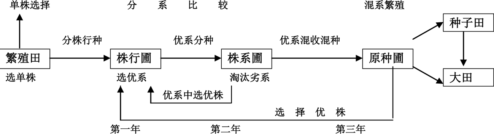
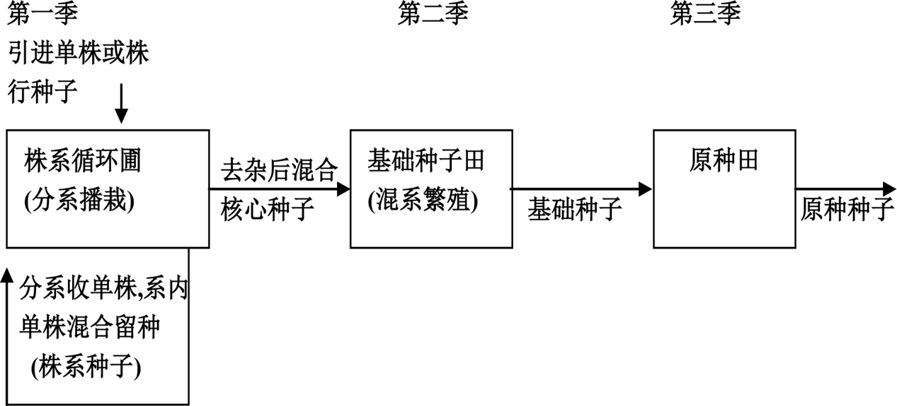
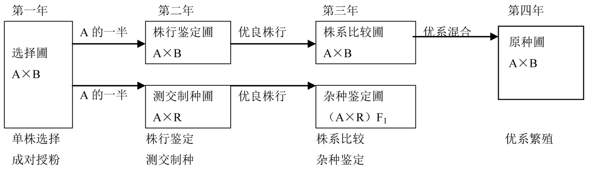
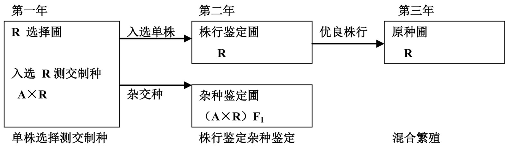
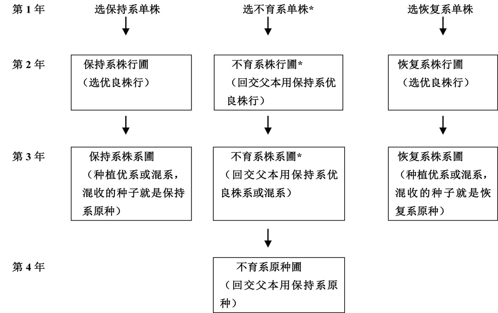
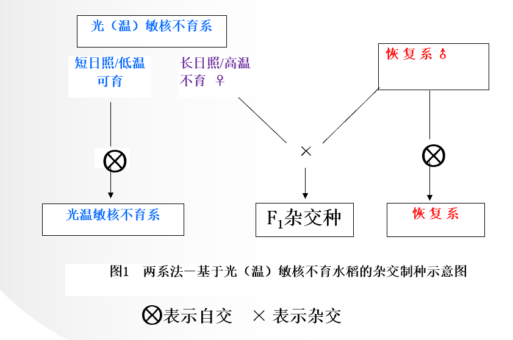
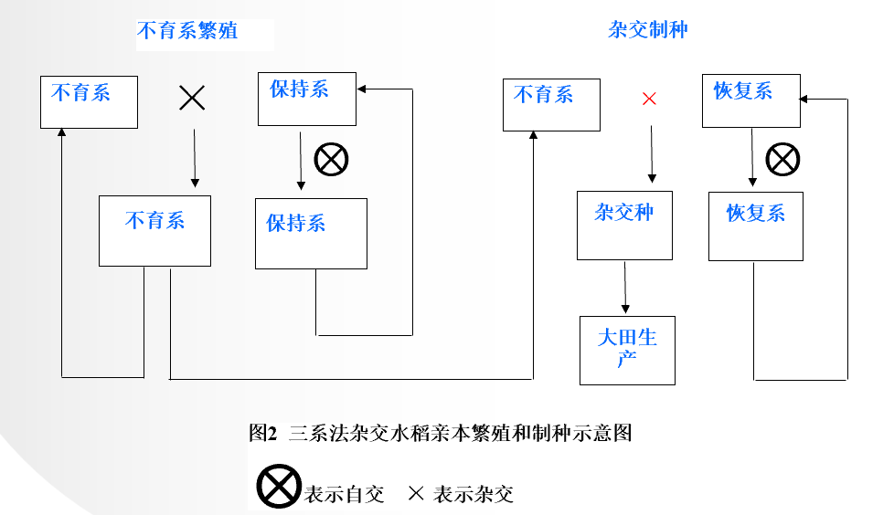

# 种子生产学

农业农村部种业管理司

全国农技推广中心，www.natesc.org.cn

中国南繁网

中国种子协会网

良种→**大田用种**

常规种种源不可控

## 绪论

### 一、种子生产的概念和意义

#### （一）概念

1. 种子生产：按照种子生产原理和技术操作规程繁殖常规种子和杂交种子的过程。（推荐标准，不一定，只要符合4个质量标准）生产出来的种子作为大田生产的播种材料或进一步作为繁殖下一代种子的材料。
2. 基本要求：原有的遗传特性、产量潜力、种子活力

#### （二）意义

为农业生产提供优良品种的优质种子，满足市场的需求。

### 二、种子生产的特点

#### （一）繁殖方式多样性

1. 有性繁殖和无性繁殖

   （1）有性繁殖：自花授粉、常异花授粉、异花授粉（雌雄异株，雌雄同株异花，自交不亲和，雌雄不同期成熟或花柱异型）
   
   （2）无性繁殖

#### （二）自然因素制约性

#### （三）种子生产的时效性

#### （四）种子质量鉴定的困难性

### 三、种子生产应具备的条件

1. 良好的种子生产基地
2. 专业技术人员和检验人员
3. 资金和生产、检验设施
4. 种子生产经营许可证
5. 该作物的品种权或该品种的生产授权

## 第一章 种子生产的基本理论

### 一、作物的繁殖方式

原种和大田用种的生产程序和保纯防杂

人为控制授粉技术

有性繁殖：**由雌雄配子结合，经过受精过程，最后形成种子繁衍后代**

无性繁殖：**不经过两性细胞受精过程的方式繁殖后代**

#### （一）有性繁殖

1. 花器结构对授粉的影响

2. 作物自然异交率的测定

   - 典型的自花授粉作物自然异交率在4%以下
   - 典型的异花授粉作物自然异交率在50%~100%
   - 常异花授粉作物的自然异交率介于二者之间，一般为4%~50%

3. 有性繁殖的主要授粉方式

   杂交小麦？常规种分蘖多，群体产量高。杂种植株大易倒伏。优势不明显

   **（1）自花授粉作物：水稻、大小麦、马铃薯、烟草**

   **（2）异花授粉作物：玉米、白菜型油菜、瓜类**

   **（3）常异花授粉作物：棉花、甘蓝型油菜、芥菜型油菜**

4. 自交不亲和性

   甘蓝、黑麦、白菜型油菜

5. 雄性不育性

   （1）细胞核雄性不育

   核基因控制，多为隐性。

   光温敏核不育（生态型雄性不育）

   （2）细胞质雄性不育

   安全可靠、种源可控

   目前利用采用三系配套的方式配制杂交种的作物有水稻、玉米、高梁、油菜等

   

#### （二）无性繁殖

1. 营养体繁殖
   - 由营养体繁殖的后代称为无性系
2. 无融合生殖
   - 植物性细胞的雌雄配子，不经过正常受精、两性配子的融合过程而形成种子以繁衍后代的方式
   - 无孢子生殖、二倍孢子体生殖、不定胚生殖、孤雌生殖、孤雄生殖

### 二、作物的品种类型

农作物的品种，一般都应满足3个基本要求，特异性、一致性、稳定性（DUS）

- 特异性：**指本品种具有一个或多个不同于其他品种的形态、生理等特性**
- 一致性：**同品种内植株性状整齐一致，能指出品种内植株间一些特异性状的变异**
- 稳定性：**指繁殖或再组成本品种时，品种的特异性和一致性能保持不变。**

新颖性

#### （一）自交系品种

纯系品种，常规品种

生产上种植的大多数水稻、小麦、大麦等自花授粉作物的常规品种就是自交系品种。在异花授粉作物中，如玉米的亲本自交系也属于自交系品种。

#### （二）杂交种品种

杂交种品种是指在严格选择亲本和控制授粉的条件下生产的各类杂交组合的F1植株群体。

#### （三）群体品种

综合品种是由一组有选择的自交系采用人工控制授粉和在隔离区多代随机授粉组成的遗传平衡的群体。

如许多玉米、黑麦等的地方品种。

#### （四）无性系品种

许多薯类作物和果树品种

### 三、纯系学说及其与种子生产的关系

#### （一）概念

在纯系内继续选择是无效

#### （二）指导意义

种子生产的中心任务之一是保纯防杂

### 四、遗传平衡定律及其与种子生产的关系

#### （一）基因频率与基因型频率

**基因频率**是指在某一群体中，某个等位基因占该位点等位基因总数的比率，也称等位基因频率。

**基因型频率**是指在某一群体中，某个特定基因型占该群体所有基因型总数的比率。

#### （二）自交的遗传效应

自交使杂合的基因型逐渐趋向纯合

自交对品种保纯和物种的相对稳定是十分重要的

自交引起杂合基因型的后代发生性状分离

自交引起杂合基因型的后代生活力衰退

#### （三）遗传平衡定律

在一个大的随机交配的群体内，如果没有突变、选择和迁移因素的干扰，则基因频率和基因型频率在世代间保持不变。

#### （四）遗传平衡定律对种子生产的指导意义

在长期自由授粉的条件下，异花授粉作物品种群体的基因型是高度杂合的。符合遗传平衡定律。**异花授粉群体内个体间随机交配繁殖后代，假如没有选择、突变、遗传漂移等影响，其群体内的基因频率和基因型频率在各世代间保持不变，即保持遗传平衡。**但实际上存在选择、突变等因素，对纯度产生影响

### 五、杂种优势利用及其与种子生产的关系

杂种优势是指两个遗传组成不同的亲本杂交产生的杂种第一代，在生长势、生活力、繁殖力、抗逆性，产量和质量上比其双亲优越的现象。

F2的衰退现象

两个亲本的纯合程度越高，性状差异越大，F1表现的优势越大，则F2表现衰退现象越明显。

#### （一）杂种优势的遗传理论

显性假说

超显性假说

#### （二）**异交的遗传效应** 

1. 形成杂合基因型
2. 增强后代的生活力

#### （三）杂种优势在种子生产中的应用

在杂交制种的过程中，要保持和提高亲本种子的纯度，以达到所生产的杂交种子具有较强的杂种优势。

在亲本种子生产过程中，对所有**不符合典型特征**的异株都必须毫不留情地拔除，以保证所生产种子的纯度。

## 第二章 植物品种审定和新品种保护

### 一、品种审定和登记

#### （一）品种审定和登记

1. **对主要农作物实行品种审定制度**：主要农作物（稻、小麦、玉米、棉花、大豆）推广前应当通过国家级或省级审定

   - 应当审定的农作物品种未经审定的，不得发布广告、推广、销售

2. **对部分非主要农作物实行品种登记制度**

   - 列入非主要农作物登记目录的品种在推广前应当登记
   - 应当登记的农作物品种未经登记的，不得发布广告和推广

3. 《审定标准》的主要原则

   - 保障粮食安全：高产稳产
   - 突出绿色发展
   - 符合市场需求

4. 品种审定分类标准

   （1）高产稳产品种

   （2）绿色优质品种

   （3）特殊类型品种

#### （二）品种审定机构

国家农作物品种审定委员会

省级农作物品种审定委员会

#### （三）申请审定的品种应当具备的条件和审定程序

申请-品种比较试验（自行）-区域试验-生产示范试验-品种审定-应用推广

品种试验：

- 区域试验
- 生产试验
- 品种DUS测试

### 二、农作物品种试验

#### （一）区域试验和生产试验

区域试验：品种利用价值、适应范围和推广地区、适宜栽培技术
- 抗逆性鉴定、品质检测

品种生产试验：接近大田生产的条件下，对品种的丰产性、适应性、抗逆性等进一步验证，同时总结配套栽培技术

1. 试验的组织和安排

   （1）试验点设计：代表性

   （2）试验年限：2-3年

   （3）试验组别

   （4）试验的基本要求：代表性、准确性、重复性

   （5）试验的规划

   - 试验点次和重复

   - 试验小区面积

   - 对照品种：已推广的主栽品种

   - 保护行设置：消除边际效应和人畜践踏

2. 试验方案的制定

3. 撰写试验结果总结报告
4. 其他检测内容
   - 区域试验除对品种丰产性、稳产性、适应性、抗逆性等进行鉴定外，须同时进行品质分析、DNA指纹检测、转基因检测等

#### （二）DUS测试

特异性：指一个植物品种有一个以上性状明显区别于已知品种

一致性：是指一个植物品种的特性除可预期的自然变异外，群体内个体间相关的特征或者特性表现一致

稳定性：是指一个植物品种经过反复繁殖后或者在特定繁殖周期结束时，其主要性状保持不变

### 三、植物新品种保护

植物新品种是指经过人工培育的或者对发现的野生植物加以开发，具备新颖性、特异性、一致性和稳定性并有适当命名的植物品种。

**植物新品种权：完成育种的单位或个人对其授权品种享有排他的独占权**

品种权的保护期限，自授权之日起，藤本植物、林木、果树和观赏树木为20年，其他植物为15年。 

### 四、国外农作物品种登记和管理

#### （一）美国的农作物品种登记和管理

新品种发放：品种DUS测定必须，农艺性状和生产率方面与现有品种进行比较，至少在某一方面有独特的优点才能获准发放

品种保护：《植物专利法》、《植物品种保护法》、《一般专利法》

申请保护的植物新品种必须经过DUS测定，具备特异性、一致性、稳定性的，才能被受理

#### （二）欧盟各国的新品种登记和管理

欧盟各国，品种只有国家一级登记（相当于我国的国家级品种审定），获得登记的品种方可进行种子生产、经营、推广

国家级的农业新品种试验有DUS、栽培和利用价值（VCU）测定两种

VCU测定一般进行2～3年，其测试的最重要指标是产量，其次是抗性（抗倒、抗病虫、抗逆等）。此外，还要进行专门的品质测定。

## 第三章 种子生产的基本方法***

### 一、种子级别的划分

#### （一）中国现行的种子级别分类

1. 指标
   - 品种纯度最为重要
   - 净度、发芽率、水分、活力、健康度等
2. **种子质量分级标准**（纯度、净度、发芽率、水分）
   - 育种家种子：育种家育成的遗传性状稳定的品种或亲本的最初一批种子。可用于进一步繁殖原种种子
   - 原种：用育种家种子繁殖的第一代至第三代种子或按原种生产技术规程生产的达到原种质量标准的种子。可用于进一步繁殖大田用种
   - 大田用种（良种）：用原种繁殖的第一代至第三代或杂交种，经确认达到规定质量要求的种子。大田用种是供大面积生产使用的种子

#### （二）其他国家的种子级别分类

1. 日本：育种家种子、原原种、原种和认证种子或市售一般种子（生产用种）
2. 美国：育种家种子、基础种子、登记种子和认证种子

#### （三）国际上有关机构的种子级别分类

AOSCA

OECD

### 二、常规品种的种子生产

常规品种：除了一代杂交品种及其亲本和无性系品种以外的品种。包括自花授粉作物的纯系品种、多系品种，常异花授粉作物的天然授粉品种，异花授粉作物的开放授粉品种。（玉米的自交系品种为纯系，按自花授粉作物生产）

#### （一）常规品种的原种生产

1. 自花授粉和常异花授粉作物常规品种的原种生产

   （1）低温贮藏繁殖法：在育种家的监控下，一次性繁殖够用5-6年的育种家种子贮藏于低温条件下，以后每年从中取出一部分育种家种子进行繁殖，繁殖1代原原种，繁殖2代得原种，繁殖3代得到生产用种，年年重复上述繁殖过程的方法

   （2）**循环选择繁殖**法**（图记忆）：从某一品种的原种群体中或其他繁殖田中选择单株，通过个体选择、分系比较、混系繁殖，生产原种种子。三年三圃制和二年二圃制（省掉株系圃）

   - 三圃制生产原种又称株系选优提纯生产原种，即**单株选择、分系比较、混系繁殖**的方法
     - **选择优良单株。**将生产原种的基本材料种植到选择圃中，选择典型的优良单株，单独采收，且要有一定数量的中选株数
     - **株（穗）行比较。**将入选的单株（穗）种植于株（穗）行圃，进行比较鉴定。根据品种的典型性、抗逆性、整齐度及其他经济性状进行初选；在收获时进行决选。将入选的行分行收获，脱粒考种。
     - **株（穗）系比较试验。**将上年入选的各单系播于株（穗）系圃，每系一区，顺序排列两次重复，对其典型性、丰产性、适应性等作进一步比较。经去杂去劣，选择优良的株系，采用混收。
     - **混系繁殖。**将上年入选的株（穗）系种子混合种于原种圃，扩大繁殖，繁殖田要隔离安全，土壤肥沃，并采用增大繁殖系数的栽培技术措施繁殖原种。生育期间，严格去杂去劣，所获得的种子即为原种，该原种可根据需要继续繁殖一两代，获得原种一代、原种二代，然后繁殖良种。

   （3）株系循环繁殖法：把引进或最初选择的符合品种典型性状的单株或株行种子分系种于株系循环圃。收获时分为两部分：一部分是先分系收获若干单株，系内单株混合留种，称为株系种。另一部分是将各系剩余单株去杂后全部混收留种，称为核心种。株系种次季仍分系种于株系循环圃。收获方法同上一季，以后照此循环。核心种次季种于基础种子田，从基础种子田混收的种子称为基础种子。基础种子次季种于原种田，收获的种子为原种。

   

   （4）自交混繁法：分系自交留种，隔离混系繁殖。

2. 异花授粉作物常规品种的原种生产

   大量选择表型优良的个体，将其种子混合起来在隔离区内种植，让这些单株随机交配，从隔离区收获的种子为基础种子（原原种），然后在隔离条件下种植原原种，任其自由授粉，收获的种子为原种。关键要混粉

#### （二）常规品种大田用种的生产

1. 自花授粉和常异花授粉作物常规品种的大田用种生产
   - 常规品种在获得原种后，用原种种子繁殖1~3代即为大田用种（即生产用种）。
   - 直接繁殖、防杂保纯、提供大田生产用种
2. 异花授粉作物常规品种的大田用种生产
   - 为防止天然异交，采种地最好与一般栽培地区隔开

### 三、杂交种品种的种子生产

在严格选择亲本和控制授粉的条件下生产的各类杂交组合的F1植株群体

包括：

- 杂交种亲本的种子生产
  - 包括原种生产和生产用种生产
  - 为确保杂交种F1的种子纯度，生产上尽可能使用亲本原种进行制种
- 杂交种F1的种子生产，杂交制种
  - 大田用种的生产

#### （一）杂交种品种亲本的原种生产

1. 三系亲本的原种生产

   雄性不育系、保持系和恢复系

   （1）有配合力测定步骤

   - 成对回交测交法

     - 不育系和保持系成对授粉原种生产：单株选择，成对授粉；株行鉴定，测交制种；株系比较，杂种鉴定，优系繁殖生产原种

     

     A：不育系；B：保持系；R：恢复系。

     - 恢复系一选二圃制原种生产：单株选择，测交制种；株行鉴定，杂种鉴定；混合繁殖。 
     
     

   （2）无配合力测定步骤

   - 三系七圃法

     - 三系各成体系分别建立株行圃和株系圃，三系共建6个圃，不育系增设原种圃合成七圃
     - 以保持三系的典型性和纯度为中心，对不育系的单株、株行和株系都进行育性检验，但对三系都不进行配合力测验

     

2. 光温敏核不育两用系的原种生产方法

   （1）必要性和特殊性

   - 不育起点温度存在遗传漂移现象
   - 原种生产必须在可控的光温条件下进行
   - 原种使用代数短，原种生产必须年年进行

   （2）方法与程序

   - 控温鉴定再生留种法
     - 单株选择-高温或长日低温处理-割茬再生留种（核心种子）-原原种-原种-制种
     - 花粉育性：不育度99.5%以上

3. 人工去雄制种亲本原种生产（以玉米为例）

   （1）穗行半分法

   - 第一年：选株自交
   - 第二年：半分穗行比较，每个自交穗种子均分2份，1份保存，另一份种成穗行，鉴定比较，不留种
   - 第三年：混合繁殖，当选预留，生产原种

   （2）测交法

   - 第一年：种植选择圃选株自交并测交
   - 第二年：种植测交种鉴定圃，进行产量比较，鉴定单株配合力
   - 第三年：混合繁殖，生产原种

#### （二）杂交种品种一代杂种种子生产

1. 一代杂种种子生产方法

   （1）人工去雄制种法

   - 用人工去掉母本的雄蕊、雄花或雄株，再任其与父本自然授粉或人工辅助授粉从而配制杂种种子的方法

   - 雌雄同花：番茄、茄子……，去掉雄蕊
   - 雌雄同株异花：玉米、瓜类，摘取雄花
   - 雌雄异株：菠菜，拔去雄株

   （2）化学杀雄制种法

   - 目前应用的杀雄剂有乙烯利、青鲜素、奈乙酸等十多种

   （3）利用雄性不育性制种

   - 光温敏核不育（模式图掌握）

     - 光敏型核雄性不育是对光照长度敏感，在长日照下表现完全雄性不育，在短日照下表现雄性可育

     - 温敏型核雄性不育是对温度敏感，在较高温度下表现完全雄性不育，在较低温度下表现雄性可育

     
     
     

 - 核质互作雄性不育制种（制种安全性高，模式图）
   - 三系两田配套

   （4）利用自交不亲和系制种

   - 由于自交不亲和性是在开花期形成的，提早在蕾期人工授粉可以获得母本自交的种子而繁殖母本
   - 如果父本、母本都是自交不亲和系，则从父本行、母本行收获的种子都是一代杂种种子

   （5）利用雌性系制种法

   - 只生雌花不生雄花。黄瓜
   - 雌雄异株。菠菜

   （6）利用苗期标记性状制种法（人工育苗环节）

   - 苗期隐性性状

2. **一代杂种种子生产共性技术*****

   生产上利用杂种优势必须年年生产F1种子，同时也必须年年繁殖杂种的亲本种子。**包括亲本繁殖和F1制种**

   对于需要人工去雄或化学去雄的作物，亲本繁殖方法同纯系品种种子生产，只是防杂保纯要更加严格；对于利用核质互作雄性不育性的作物，母本繁殖方法同杂种种子生产，只是所用父本为保持系。

   （1）确定制种田和亲本繁殖田面积比例：反推

   - 制种田面积（公顷）=（生产田计划播种面积×每公顷生产田用种量）/（每公顷制种田杂种种子预期产量）
   - 不育系繁殖田面积（公顷）=（制种田面积×每公顷制种田不育系用种量）/（每公顷繁殖田不育系种子预期产量） 
   
   （2）隔离区的设置：**空间隔离、屏障隔离和开花期隔离**（播种间隔：开花期积温条件）
   
   （3）父母本间种行比（制种产量）：父母本相间种植的行数比例。确保花粉供应前提下，增加母本行数。父本分蘖数
   
   （4）调节播期，确保花期相遇（播差：父本和母本播种的时间差距）
   
   - 对于异花授粉作物和常异花授粉作物：
     - 宁可母本等父本，不可父本等母本（花粉寿命短且随开花随飘散）
     - 母本安排在最适宜的播期，然后调节父本的播期（种子产量是由母本产量决定的）
   - 自花授粉作物：
     - 宁可父本等母本，不可母本等父本（母本接受花粉时间短。两头包）
     - 将开花期安排在最适宜的季节（不良天气对异交结实不利）
   - **花期预测：幼穗观察**
   
   （5）除去杂株：以亲本的性状标准去鉴别、拔除杂株，典型性。从种子开始
   
   （6）及时去雄和辅助授粉
   
   （7）父母本分收分藏
   
   - 父本单独种：防混杂，防流失
   
   （8）质量检查：播前，去雄前后，收获后
   
   ### 四、无性系品种种子生产
   
   无性系：从一个单株通过无性繁殖产生的后代群体

   **无性系品种：由一个无性系或几个遗传上近似的无性系经过无性繁殖产生的群体**

   #### （一）无性系品种原种种子生产

   无性系品种原种生产，必须要在脱毒的基础上进行。
   
   1. 原原种重复繁殖法
   2. 循环选择法：单株选择、分系比较、混系繁殖的二年二圃制
   
   #### （二）无性系品种大田用种生产
   
   原种种子在大田里加以繁殖
   
   ### 五、种子快速繁殖
   
   #### （一）利用作物分蘖特性稀播单株插，必要时多次剥蘖移栽
   
   #### （二）利用异地或异季生长环境一年繁殖多代
   
   春播作物冬繁加代
   
   秋播作物夏繁加代
   
   #### （三）切割无性繁殖器官
   
   #### （四）利用组织培养大量无性繁殖
   
   

## 第四章 种子生产基地建设（了解）

   ### 一、原则与条件

#### （一）形式

1. 种子企业自有或国有种子生产基地

2. 农村特约种子生产基地

   （1）区域特约

   （2）联户特约

   （3）专业户特约

3. 自主租赁的种子生产基地

#### （二）布局和建设的原则

1. 在最适宜的生态条件下建立种子生产基地的原则
2. 统筹安排、分级分类建设的原则
3. 质量优先、兼顾效益的原则

#### （三）必备条件

1. 气候条件：光温水风

2. 自然生产条件

   （1）隔离条件

   （2）无霜期

   （3）土地

   （4）病虫害

   （5）交通方便

   （6）基地的农业生产水平高

3. 社会经济条件

   （1）政府、群众

   （2）技术力量

   （3）劳动力

   （4）耕作制度

   （5）农户经济基础

### 二、程序与内容

#### （一）建立种子生产基地的程序

1. 搞好论证
2. 设计规划
3. 组织实施

#### （二）内容

1. 种子生产基地基础设施建设
2. 基地组织管理体系和服务体系建设

### 三、种子生产基地的管理

#### （一）计划管理

#### （二）技术管理

#### （三）质量管理

### 四、种子生产计划的制订

#### （一）内容

包括原原种生产计划、原种（或亲本种子）生产计划和商品种子生产计划。

#### （二）影响因素

1. 品种结构及其表现情况
2. 病虫害及自然灾害发生情况
3. 需求总量
4. 政府的政策导向及发展趋势分析
5. 同类种子企业的种子生产情况及库存情况

#### （三）种子生产计划的制定

1. 品种决策

2. 生产量决策

   （1）商品种子生产量的确定：生产量=计划销售量-上年库存量+风险存量

   （2）原种（亲本种子）生产量的确定：原种生产量=下季商品种子生产面积×单位面积用种量+风险存量

3. 种子生产实施方案的制定

## 第五章 种子生产的质量控制***

### 一、种子质量和标准

#### （一）种子标准化

1. 概念：实行品种标准化和种子质量标准化
   - 品种标准化：大田推广的优良品种符合品种标准
   - 种子质量标准化：大田所用农作物优良品种的种子质量基本达到国家规定的质量标准

2. 内容

   （1）优良品种标准

   （2）种子生产技术规程

   （3）种子质量分级标准

   - 目前我国将种子分为育种家种子、原种及大田用种（良种）三个等级

   （4）种子检验规程

   （5）种子包装、运输、贮藏标准

#### （二）种子质量分级标准

纯度最为重要

净度、发芽率、水分

种子级别只分原种和大田用种两类。

我国只是种子的纯度、净度、水分、发芽率四项指标

杂交种没有原种，仅有大田用种

### 二、种子认证

#### （一）概述

一种控制种子质量的制度，是由第三方认证机构依据种子认证方案通过对品种、亲本种子来源、种子田以及种子生产、加工、标识、封缄、扦样、检验等过程的质量监控，确认并通过颁发认证证书和认证标识来证明某一种子批符合相应的规定要求的活动。

两方面：**遗传质量（真实性和纯度）和物理质量（净度和发芽率等）**

#### （二）国内外种子认证现状

1. 国外种子认证现状：强制性种子认证和自愿性种子认证
2. 国内种子认证现状
   - 认证机构：全国农业技术推广服务中心

#### （三）种子认证方案

1. 种子遗传质量的监控

   （1）品种合格认证

   - 必须是公布目录中的品种
   - 必须经过测试——品种DUS测定和品种VCU测定（利用价值）

   （2）种子来源认可

   - 检查标签

   （3）生产基地认可

   - 前作不存在污染源
   - 隔离条件安全

   （4）田间检验

   （5）清洁不混杂管理

   （6）扦样、标识与封缄

   （7）品种纯度的验证：小区种植鉴定

   - 前控：前控鉴定应在认证种子生产之前或同步进行
   - 后控：检测生产种子的质量，如对收获后的认证种子一代进行鉴定

2. 种子物理质量的监控

   - 100%检验
   - 净度、发芽率、水分、其他作物种子

#### （四）种子认证程序

1. 企业申请认证
2. 质量体系评定
3. 种子遗传质量确认
4. 种子物理质量确认
5. 认证证书发放和认证后管理

### 三、提高种子质量的措施

#### （一）提高种子纯度的措施

品种混杂退化是指新品种在推广过程中，纯度下降、种性变劣的现象。

- 品种混杂：一个品种中混进了其他品种甚至是不同作物的植株或种子，或上一代发生了天然杂交，导致后代群体出现变异类型的现象。

- 品种退化：品种某些经济性状变劣的现象，即品种的生活力降低、抗逆性减退、产量和品质下降。

品种混杂退化后，品种的典型性降低，田间群体表现出株高参差不齐、成熟期早晚不一，抗逆性减退，经济性状或品质性状变劣，杂交种亲本的配合力下降。

1. **品种混杂品种退化的原因**

   （1）机械混杂

   （2）生物学混杂：隔离条件差或去杂去劣不及时、不严格

   （3）不正确的选择

   （4）剩余分离和基因突变

   （5）不良的生态条件与栽培技术

2. **品种防杂保纯的措施**

   （1）严格管理，防止机械混杂

   （2）严格隔离，防止生物学混杂

   （3）定期更新和采用四级种子生产程序

   - 原种“一年生产，多年贮藏，分年使用”的方法
   - **四级种子生产程序：**从育种家种子开始，进行连续3级逐级繁殖，最后生产大田用种的过程，即育种家种子→原原种→原种→大田用种。

   （4）严格执行种子生产技术规程

   （5）改善环境条件与栽培技术

#### （二）提高种子净度的措施

清选和精选

#### （三）降低种子含水量的措施

自然干燥和人工机械干燥

#### （四）保持种子健康度的措施

防止和控制种传病虫害

#### （五）提高种子发芽率和活力的措施

合理调节养分

选择适宜的地理环境和生产季节

及时防治穗部病害

及时收获，快速脱水，分收分藏

合理贮藏保管和包装运输，保持种子活力

## 第六章 水稻种子生产技术

三系、两系框架图、区别

花期调节

### 一、水稻生产概况

两杂：杂交水稻、杂交玉米

### 二、生物学特性

#### （一）分类

籼粳交：偏籼、偏粳

#### （二）主要栽培类型

- 籼稻和粳稻
- 晚稻和早稻
- 水稻和旱稻
- 粘稻和糯稻

#### （三）水稻三性：

- 感温性：高温可使生育期缩短，低温则会延长生育期。籼稻和早稻强
- 感光性：短日照可以缩短生育期，长日照可延长生育期。粳稻和晚稻
- 基本营养生长性

**杂交水稻种子生产中，特别需要考虑双亲“三性”存在的差异情况**

#### （四）水稻生育期

水稻生育期可以分为两个相继发生的生育期，即营养生长期和生殖生长期。

1. 幼苗期和分蘖期
2. 幼穗发育期
3. 开花结实期

抽穗始期（始花期）、抽穗期和齐穗期：全田植株抽穗率10%、50%和80%

#### （五）稻穗的发育与诊断

1. 生殖器官的形成

   （1）枝梗分化期

   （2）小穗分化期

2. 生殖细胞的形成

   （1）减数分裂期

   （2）花粉充实期

   （3）花粉完熟期

3. 幼穗基本营养生长分化进程的诊断

   （1）叶龄指数法：利用当时已伸出叶片的数量除以该品种主茎的总叶数

   （2）叶耳间长法：剑叶叶耳与前一叶叶耳之间的距离。诊断减数分裂过程

   （3）**幼穗长度法**

   （4）距出穗日数

   （5）**目测法**

   一期看不见，二期苞毛现，三期毛丛丛，四期粒粒现，五期颖壳分，六期叶枕平，七期穗色绿，八期穗即现

#### （六）开花习性与种子形成

1. 花器构造与开花习性
2. 传粉与受精
3. 种子的形成

### 三、常规水稻种子生产

主要措施：隔离去杂

#### （一）原种及大田用种繁育田

1. 确定种子田繁殖程序：扩大繁殖
   - 一级种子田制：繁殖由育种单位提供的育种家种子。收获前在种子田选择优良单株，混合脱粒，作为第二年种子田用种，余下的去杂去劣后进行片选，混合收获种子，供第二年大田生产用。
   - 二级种子田制：在一级种子田中株选，混合脱粒，供下年度一级种子田用种，其余的去杂去劣后进行片选，混收的种子供二级种子田用。二级种子田经去杂去劣后片选，混收种子供应大田生产用。
2. 选择良好种子繁育田块
3. 采用优良栽培技术
4. 采取正确选留种技术：在品种表现最明显的抽穗期
5. 确保获得足量优质种子
   - **四清五单**：播种做到“四清”，即品种清、繁种工具清、播种工具清和秧田清；收获时做到“五单”，即单收、单运、单打、单晒和单藏。

原种单本插稀植（去杂），一般不用（省钱）

#### （二）提纯保纯的繁育方法

多采用循环选择繁殖法，包括单株选择、分系比较、混系繁殖三个基本步骤进行提纯

### 四、杂交水稻种子生产

#### （一）杂交稻的繁制种与影响产量的因素

繁种指不育系种子的生产，制种为杂交一代种子的生产

1. 繁制形式

   （1）春繁、春制

   （2）夏繁、夏制（大部分）

   （3）秋繁、秋制

   （4）冬繁、冬制：海南的三亚、陵水一带

2. 影响繁制种产量的因素

   （1）异交特性

   - 柱头大小、柱头外露率、柱头活力等异交特性相对较差
   - 不育系植株也大多表现矮小、包颈严重、开花受天气条件影响大
   - 繁、制种田父母本花时不同步

   （2）异交特性的调节

   - 确保亲本在适宜的气候、生态条件下安全抽穗
   - 确保亲本花期的吻合：需确定好双亲的播差，从幼穗分化期起准确预测花期
   - 创造良好的适宜于异交的空间状态

   （3）亲本栽培

   - 获得更高的母本异交结实率和异交产量
   - 因时因种确定合理的父母本行比和栽插密度，母比父4-6:1
   - 既要保证母本有足够有效穗，同时要争取父本足蘖多穗，增加花粉量、延长花期

#### （二）三系籼型杂交稻的制种技术

1. 季节和地点的选择

   （1）季节选择：在扬花授粉期间田间具备适宜的温度与湿度条件。

   - 开花期日平均温度26～28℃，日最高温度不超过35℃，日最低温度不低于21℃……
   - 制种形式的选择主要是安排最佳的抽穗扬花季节
   - 充分考虑灌浆结实期气候条件对种子质量的影响
   - 季节的确定还要与组合特性相结合

   （2）地点选择：应重点考虑是否具有良好的稻作自然条件和保证种子纯度的隔离条件

2. 花期的相遇标准确定

   - 花期全遇，即父本初花和末花前后均能围住母本花期，使母本盛花期能获得充足的花粉供应，达到母本“头花不空，尾花不丢，盛花期相逢”
   - 母本要集中抽穗，单穴栽插本数较多

3. 父母本播种差期的确定

   - 第一期父本播种到母本播种的相距时间
   - 个别母本生育期更长

   （1）时差推算法（生育期法）

   （2）叶差法：以长生育期亲本的**主茎叶龄**作为另一亲本播种差期的指标。和时差法**互为校正**

   （3）温差法：利用父母本从播种到始穗的有效积温差来确定父母本的播种差期。

   （4）影响播差的其它因素：如种子来源、秧苗素质、秧龄长短等

4. 异交栽培

   - 根据双亲的特点、异交授粉的特性等合理安排母、父本的行比、栽插方式和调控措施。

   （1）异交产量的构成及母本与父本行比的确定

   - 单位面积的异交产量主要决定于母本丛数、每丛穗数、每穗颖花数和结实率等产量因子

   （2）父本的栽插形式和行向

   - 单行、假双行、大双行
   - 行向与风向成45度
   
   （3） **花期预测和调节技术**
   
   - 一般要使双亲花期相遇良好，在幼穗分化前期（1～3期），父本要比母本早一期，在中三期（4～6期），双亲基本处于同一阶段，而后期母本则要略早于父本。
   - 常用剥穗法鉴定发育时期
   - 对发育快的一方在植株根系间追施尿素，减缓其生育进程；对发育偏迟的一方，辅以磷酸二氢钾叶面喷施，促进其生殖生长，特别是要注意烤田，以达到父母本同步发育。
   
   | 调节方法     | 主要措施           | 促控效果                                                     | 备注                       |
   | ------------ | ------------------ | ------------------------------------------------------------ | -------------------------- |
   | 1.水分调节法 | 排水烤田或灌深水   | 母本反应不敏感，拷田可延缓父本发育2～3 d，灌水可促进父本发育2～3 d | 迟熟组合、生育前期效果较好 |
   | 2.肥料调节   | 偏施氮肥或偏施钾肥 | 施氮可延缓始穗4 d左右，施钾促1～2 d                          | 一类禾苗不宜               |
   | 3.激素调节   | 施用“九二〇”       | 促2～3 d                                                     | 幼穗分化6-7期应用          |
   | 4.植株伤害法 | 割叶、踩根、拔苞   | 延迟2～3 d                                                   | 踩根、拔苞要慎用           |
   
   （4）提高异交结实率
   
   - 使用“九二〇”：解除不育系的包颈问题
   - 割叶：减少田间花粉传播的障碍，扩大传粉空间；还可以改善田间的通风透光条件、降湿增温
   - 人工辅助授粉
   
   人工授粉与喷施“九二〇”一样，也是杂交水稻制种中的关键技术之一
   
   （5）严格田间去杂﹑确保种子纯度
   
   - 苗期
   - 孕穗期
   - 始穗期：除杂的关键时期

#### （三）三系粳型杂交稻的制种技术

粳型三系杂交稻具有不育系不包颈或包颈较轻、开花正常、闭颖率低、花时相遇较好等特点，有利于制种产量的提高

#### （四）两系法杂交稻制种

在选用不育系时必须考虑在本地区能否安全制种，即稳定不育期能否在30d以上，而稳定不育期的长短主要取决于该不育系育性转换的临界温度和临界光长。

育性安全转换期（抽穗前25天-10天，三期）一般只能夏制

1. 选用育性稳定的光（温）敏核不育系

   选用在长日照条件下不育的下限温度低、短光照条件下可育的上限温度较高、光敏温度范围较宽的光（温）敏核不育系

   - 光敏型：粳型
   - 温敏型：籼型
   - 互作型：偏光、偏温

2. 选择最佳的安全抽穗扬花期

   （1）安全的育性转换期：保证母本不育

   （2）安全的扬花授粉期：晴朗天气多

   （3）播种期与始穗期的确定

3. 母本靠插不靠发：插足基本苗

4. 强化父本栽培、创建高产群体结构

5. 要适时收割，保证种子质量

#### （五）杂交稻的繁种技术

1. 三系不育系的繁种
   - 不育系和保持系是同核异质的二个品系，总体性状差异不大，有利于播差期的安排
   - 籼型不育系：繁种时不育系一般要早播，在其播后叶龄为1.0叶时再播第一期保持系，1.5～1.8叶时播第2期保持系
   - 粳型三系不育系：播种差期要小，基本上做到第1期保持系与不育系同期播，第2期保持系在不育系有1.0～1.5叶时播种

2. 光（温）敏核不育系的繁种

   - 当日照长度<13.45 h和日平均温度<24℃时，育性转换

   - 冷水串灌，灌溉深度以淹没茎尖生长点为准

#### （六）杂交稻亲本的防杂保纯

1. 杂交亲本退化的表现和原因

   （1）主要表现

   - 不育系：三系不育系表现为不育性降低，两系不育系可能会出现“育性漂移”
   - 保持系和恢复系：保持系的保持能力下降，恢复系的恢复力减退，配合力降低是保持系或恢复系退化的主要表现，同时也会出现农艺和经济性状的分离、抗性衰退等情况。

   （2）引起退化的原因

   - 机械混杂和生物学混杂。自然变异。
   - 育性返祖：不育系是由正常结实的常规稻通过核转换的方法转育而来，这类不育系的个别单株在某个世代的育性自行恢复的现象
     - 在两系核不育系中还表现为育性漂移现象

2. 三系杂交稻提纯复壮及原种生产

   （1）三系杂交水稻亲本原种标准

   （2）三系亲本的提纯复壮与原种生产的程序和方法

   - 分步提纯法：单株选择、成对回交、分系测交、分系鉴定、混系繁殖。
   - 配套提纯法：三系成对回交、测交，以测交F1的产量为主要依据，评选成套三系的最优单系亲本作为原种
   - 简易提纯法：三系七圃法（单株选择、分系比较、混系繁殖，不育系设株行圃、株系圃和原种圃，保持系和恢复系分别设置株行圃和株系圃，一共七圃）

3. 两系法不育系原种生产

   （1）不育系核心种子生产

   - 核心种子是两系法不育系的典型单株，经人工光温处理确认雄性不育性后割茬再生、自交结实的种子
   - 单株选择→人工低温长日处理→花粉育性镜检→割蔸再生→人工短日／低温处理→自交留种（核心种子）

   （2）两系杂交水稻原种生产
   
   - 籼型两系法不育系
   - 粳型两系法不育系：三年三圃法和两年二圃法

## 第七章 玉米种子生产技术

### 一、玉米产业概况

不按籽粒收获，加工前有穗选

### 二、品种类型与分类

#### （一）籽粒类型

硬粒型、马齿型、半马齿型、粉质型、爆裂型、甜质型、糯质型、甜粉型、有稃型

#### （二）栽培类型

早中晚熟

普通玉米、特用玉米

单交种、双交种和三交种。其中玉米单交种优势最强、增产潜力最高，生产上应用最广泛

### 三、生物学特征

#### （一）玉米的一生和生育时期

出苗、拔节、抽雄（雄穗开始露出顶叶叶鞘）、开花（雄穗开始散粉）、吐丝（雌穗花丝开始露出苞叶）、灌浆、成熟收获

散粉期和吐丝期（50%）

#### （二）器官构造

叶片分组：基部叶组（根叶组）、下部叶组（茎叶组）、中部叶组（穗叶组）、上部叶组（粒叶组）

中部叶>上部叶>下部叶，棒三叶对玉米产量影响最大

雌、雄花序分化的对应关系

玉米穗分化与叶龄指数的关系

#### （三）玉米生长发育与环境条件的关系

温度、光照、土壤养分、水分

#### （四）开花习性和种子形成

### 四、种子生产技术

#### （一）产量构成因素

单位面积母本有效穗数、平均穗粒数、平均粒重

1. 穗数：增加种植密度和母本行数；增加单株穗数
2. 平均穗粒数：雌穗小花数、受精率及成粒率有关
3. 粒重：籽粒库容量（籽粒体积）的大小、灌浆速度的快慢和灌浆时间的长短

#### （二）种子高产技术措施

1. 父母本的选择和姊妹系的利用
2. 选地、整地和施用基肥

玉米制种与大田玉米生产种植区别：确定父母本的行比；父本分期播种。 

3. 播种规格

   （1）父母本行比

   （2）确定合理密度：4500株/亩

   （3）调节播期：母本吐丝盛期和父本散粉初期相遇

   （4）提高播种质量

4. 花期预测和调节

   （1）花期预测

   - 叶片检查法：从5叶起，每长出5片叶用红漆标记一次
   - 剥叶检查法
   - 镜检雄幼穗法

   （2）花期不遇的调节措施

   - 苗期：促慢控快，对生长慢的亲本采取早间苗、早施肥、早松土等措施，促其生长；对生长较快的亲本则采取晚间苗、晚施肥、晚松土的控制措施。
   - 中期：水、肥和生长调节剂促偏晚亲本，断根法控偏早的亲本
   - 后期

5. 人工辅助授粉

   一般不需要

6. 田间管理

- 促苗、控杆、攻穗
- 基肥足、苗肥早、穗肥重、粒肥补
- 前轻、中重、后补

7. 南繁加代繁育制种技术及注意事项

   

### 五、种子质量控制

#### （一）亲本的繁殖和保纯

1. 自交系混杂、退化及保纯

   自交系混杂是指自交系中掺杂了不同于本自交系的其他材料，造成自交系纯度降低的现象。退化是指自交系原有的优良种性部分或全部丧失造成种性变劣的现象。

   （1）混杂、退化的原因

   - 机械混杂
   - 生物学混杂
   - 不正确的选择
   - 剩余分离

   （2）自交系保纯的措施

   - 防混杂
   - 自交系生产方法
   - 提纯复壮，防止退化

2. 原种生产

   自交系原种应符合以下三个条件：第一，性状典型一致，纯度不低于99.9％；第二，保持原自交系的配合力；第三，种子质量好。

   - 育种家种子直接繁殖
   - 采用二圃法或三圃法办法，以“选株自交、穗行比较，淘汰劣行，混收优行”的穗行筛选法进行
   - 对于使用多年的自交系宜采用穗行测交提纯法（结合配合力鉴定。同时自交和测交）
   - 产田与其它玉米花粉来源地至少相距500 m以上；去杂要彻底，应在苗期、散粉前和脱粒前至少进行三次去杂

   **四级种子生产程序：**通常采用原种“一年生产，多年贮藏，分年使用”的方法。从育种家种子开始，进行连续3级逐级繁殖，最后生产大田用种的过程，即育种家种子→原原种→原种→大田用种。

3. 制种亲本的生产和繁殖

   - 制种亲本种子包括自交系大田用种、亲本姊妹种和亲本单交种。

#### （二）制种过程中的质量控制

1. 安全隔离：空间隔离和时间隔离

2. 去杂去劣：苗期、拔节期、散粉前和收获前
3. 及时彻底去雄：及时、彻底、干净
4. 提高种子活力，确保种子质量

## 第八章 小麦种子生产技术

常规种（原种、大田用种）

### 一、生产概况

以普通小麦占绝对多数

生产上以冬小麦为主

### 二、生物学特性

低温长日照作物

冬性、半冬性和春性品种

反应迟钝、反应敏感、反应中等（对日照长短的反应）

强筋(硬质)小麦、中筋小麦和弱筋(软质)小麦

自花授粉作物

### 三、常规种子生产技术

常规种为主

#### （一）小麦原种生产技术

1. 利用育种家种子直接生产原种
2. 三圃制生产原种
   - 单株(穗)选择、株(穗)行鉴定、株(穗)系比较和混系繁殖
   - 株(穗)行圃、株(穗)系圃、原种圃
3. 二圃制生产原种
   - 在良种生产田选择典型优良单株，下年种成株行圃进行株行比较试验，将入选的株行混合收获，下年进入原种圃生产原种
4. “四级种子生产程序”
   - “育种家种子→原原种→原种→大田用种”的4级种子生产程序

#### （二）小麦大田用种生产技术

可根据需要建立一级种子田和二级种子田

#### （三）种子生产技术要点

1. 提高播种质量
2. 合理用肥
3. 田间管理

### 四、杂交种子生产技术

#### （一）“两系法”杂交小麦种子生产技术

光温敏雄性不育材料

#### （二）化学杀雄法制种技术

SC2053（ 津奥啉 ）、GENESIS、BAU2、WLS84811、MON21200和HYBREX

## 第九章 大豆种子生产技术

常规种（原种、大田用种）

### 一、大豆生产概况

### 二、生物学特性

自花授粉作物

闭花授粉

结荚习性：无限结荚习性、有限结荚习性、亚有限结荚习性

### 三、大豆种子生产技术

#### （一）大豆原种生产技术

大豆原种包括原种一代和原种二代。原种二代由原种一代直接生产。 

1. 利用育种家种子直接生产原种
2. 三圃制生产原种
   - 单株选择、株行鉴定、株系比较和混系繁殖（原种圃）四个环节，需经过株行圃、株系圃、原种圃三年时间完成
3. 二圃制生产原种
   - 在良种生产田选择典型优良单株，下年种成株行圃进行株行比较试验，将入选的株行混合收获，下年进入原种圃生产原种

#### （二）大豆大田用种生产技术

种子生产应设置等级种子田，采用指定来源的种子播种，限定种源的繁殖世代数

1. 一级种子田
2. 二级种子田

**良种生产防杂保纯方法：**株选法和片选法

- 株选法：亦称混合选择法，即在大豆成熟时，选择生长健壮、结荚多、无病虫和具有本品种典型性状的单株，混合脱粒，供下年种子田用。
- 片选法：亦称去杂去劣法，即于大豆成熟前在田间进行去杂去劣，然后混合收获，其种子留作下年种子田用。

#### （三）大豆种子生产的主要管理措施

1. 田块选择
2. 种子的精选和包衣
3. 适当早播、稀播，保证一次出苗
4. 采用隔离，严格去杂去劣
5. 及时防治病虫草害
6. 适时收获

## 第十章 棉花种子生产技术

常规种为主，杂交种附带

### 一、棉花的生物学特性

#### （一）棉花的分类

大部分陆地棉

绝大部分是转基因抗虫棉或转基因抗虫杂交棉

#### （二）棉花的一生

从播种到收花结束的整个生长周期称为大田生长期，一般为200 d左右。从出苗到吐絮称生育期，一般为130 d左右。

#### （三）花器构造

常异花授粉作物

#### （四）开花习性和种子成熟

种皮颜色：成熟黑色，硬；未成熟黄棕色、黄、白，软

毛籽和光籽

### 二、常规种生产

#### （一）棉花原种生产技术

1. 三圃制生产原种
   - 选单株：典型性、丰产性和品质、病虫害、外源基因
   - 单株选择的时间：结铃盛期；吐絮收花前
   - 收花
   - 室内考种和决选标准
   - 株行圃、株系圃、原种圃
2. 二圃制生产原种
   - 选单株，株行圃，入选株行混合进入原种圃

#### （二）高产栽培技术

1. 种子处理
2. 育苗技术
3. 栽培管理

### 三、杂交种子生产技术

人工去雄法、两系法、三系法、应用指示性状法、化学杀雄法

## 第十一章 油菜种子生产技术

不育系、自交不亲和

### 一、生物学特性

#### （一）分类

甘蓝型油菜为主，常异花授粉

白菜型油菜为异花授粉作物，芥菜型、甘蓝型油菜为常异花授粉作物。

春性、冬性和半冬性

#### （二）开花习性与种子形成

雌蕊在开花前3-5d已先成熟，可以接受花粉

### 二、常规种子生产

#### （一）种子产量形成及其影响因素

1. 产量构成因素

   - 角果总数、每果粒数和粒重
   - 争取有较多的角果数，而不使每角果粒数、粒重下降较多
     - 单位面积总角果数是由株数和每株角果数构成

2. 单产形成过程

   （1）单位面积角果数的形成

   - 提高种植密度，适当增加株数
   - 增加单株角果数

   （2）每角粒数的形成

   （3）粒重的形成

#### （二）品种混杂退化的表现与原因

1. 原因

   （1）授粉混杂：十字花科植物串花授粉杂交，发生生物学混杂，导致油菜种性变劣

   （2）机械混杂

   （3）自生油菜混杂

   （4）本身繁殖退化

2. 防治措施

   （1）苗床与大田的合理选择

   （2）隔离繁殖

   - 原种生产田一般要求隔离距离在800 m以上

   （3）严防机械混杂

   （4）加强提纯复壮，规范原种生产程序
   
   （5）建立完整的繁种和供种体系

#### （三）原种生产

甘蓝型和芥菜型油菜均属于常异花授粉作物，自交亲和性较强，可采用**三圃法和二圃法**生产原种。白菜型油菜是典型的异花授粉作物，自交退化显著，可采用**混合选择法**生产原种。

1. 三圃法或二圃法生产甘蓝型和芥菜型油菜常规品种原种
2. 混合选择法生产白菜型油菜常规品种原种

#### （四）大田用种生产技术要点

1. 建立良种生产基地
2. 安全隔离
3. 严格去杂去劣
4. 种子收获

### 三、杂交油菜种子生产

以甘蓝型油菜品种为主

**三种途径：**

- **利用核质互作雄性不育系，三系配套**
- **利用核不育两用系生产**：分离。不必另设保持系。两用系和恢复系
- **利用自交不亲和系**
  - 剥蕾自交、喷食盐水

分枝？父本要及时割除

油菜夏繁制种技术：冬油菜夏季到春油菜区或高山等种植、繁育称为夏繁

## 第十二章 马铃薯种薯生产技术

### 一、生物学特性

#### （一）马铃薯的分类

栽培的四倍体马铃薯利用块茎作为播种材料。

#### （二）花器结构与开花结实

自花授粉作物

#### （三）马铃薯生长发育对环境条件的要求

### 二、马铃薯种薯脱毒繁殖技术

马铃薯种薯生产的关键技术是防治病毒病

基本程序：

- 利用茎尖分生组织培养生产脱毒试管苗或脱毒试管薯
- 用脱毒试管苗或脱毒试管薯在防虫温室或网室内生产脱毒微型薯（脱毒微型薯是原原种，相当于育种家种子）
- 用脱毒微型薯在原种场生产原种
- 用原种在种薯生产基地生产大田用种

脱毒种薯

- 基础种薯：用于生产合格种薯的原原种和原种
  - 原原种
  - 一级原种
  - 二级原种
- 合格种薯：用于生产商品薯的种薯
  - 一级种薯
  - 二级种薯

#### （一）马铃薯病毒和脱毒原理

茎尖分生组织培养

#### （二）利用茎尖分生组织培养法生产脱毒微型薯的技术

1. **块茎钝化和催芽处理**
2. **茎尖剥离**
3. **分生组织培养**
   - **每一株试管苗均须进行病毒和类病毒的检测，确保用于扩繁的试管苗为无病毒苗**
4. **组培苗切段扩繁**
5. **诱导试管薯**

****流程**

### 三、脱毒马铃薯种薯的良种繁育技术

#### （一）原原种生产

无病毒微型种薯

#### （二）原种生产

原种是用原原种在高山隔离区或具备合格隔离条件的其它地区生产的合格种薯

#### （三）大田用种的生产

#### （四）防止病毒再侵染的措施

1. 及时拔除病株
2. 割秧早收，减轻种薯带毒
3. 因地制宜，避蚜生产种薯
4. 防蚜灭蚜

我国马铃薯种薯生产普遍采用四级生产体系：在防虫温、网室内扦插组培的无病毒试管苗生产微型薯作为原原种（一级），在防虫网室或隔离繁殖田用原原种作种源繁殖一级原种（二级），在隔离繁殖田用一级原种作种源繁殖二级原种（三级），在隔离繁殖田用二级原种作种源繁殖一级良种（四级）。一级良种作为生产用种投放市场。

## 第十三章 茄果类种子生产技术

基本特征特性

去雄

留果节位

整枝方法

### 一、概述

多为自花授粉作物。辣椒、茄子常异花授粉作物

### 二、番茄种子生产技术

#### （一）番茄的分类

番茄常规品种和杂种一代品种并存

#### （二）生物学基础

1. 生长习性：无限生长型和有限生长型（矮封顶型和高封顶型）
2. 分枝习性与整枝要求
   - 较强的分枝性
   - 采用双杆整枝，那么一般应该保留第一花序下面的叶片其叶腋处发出的分枝
   - 将其它侧枝抹去。第一次整枝一般应适当延迟。及时抹去新发生的侧枝。
   - 作为母本，如果是无限生长类型的品种，一般采用单杆整枝，也有采用双杆整枝；如果是有限生长类型的高封顶品种，一般采用双杆整枝；如果是有限生长型的矮封顶品种，一般采用3~5杆整枝
   - 父本提倡整枝。无限生长型品种单杆或双杆整枝，有限生长型则实行多杆整枝（2~5杆）
3. 开花结实习性
   - 雌蕊保持受精能力的时间为4～8 d，开花前2 d即已经具有受精能力；花粉在室温条件下干燥贮藏可保持2～3 d的生命力。

#### （三）常规品种种子生产

1. 制种地区和制种地的选择：隔离，与茄果类蔬菜至少有三年以上的轮作
2. 播种期安排：采种栽培以春夏栽培为主，秋季栽培为辅。多进行育苗后定植栽培的方式
3. 苗期及制种田的管理
4. 种子采收

#### （四）杂交一代制种技术

一般采用人工杂交的方法

1. 父母本的准备
2. 种植规格
3. 杂交授粉时期和方法
   - **父本采集花粉、母本去雄、杂交**

### 三、茄子种子生产技术

#### （一）茄子的类型

圆茄、长茄和卵茄

绝大多数是一代杂种

#### （二）生物学基础

1. 特征特性：
   - 茎分枝习性为假二杈分枝
   - 果实分别称为门茄、对茄、四门斗、八面风、满天星等
2. 开花结实习性
   - 完全花
   - 多数在上午开放

#### （三）常规种种子生产

1. 田块选择：轮作。隔离
2. 安排合理的播种期
3. 繁种田的管理
   - 种果多留在对茄以上部位。小果形及长果形品种应在对茄、四门斗以上部位留种；大果形品种可在门茄、对茄以上部位留种
4. 种果采收和脱粒

#### （四）杂交种种子生产

品种间或自交系间人工去雄配制杂交种

1. 杂交时期
2. 花粉采集：在开花当天授粉受精能力最强，因而最好当天采当天用
3. 母本去雄
4. 杂交授粉
5. 种子采收

### 四、辣椒种子生产技术

目前使用的辣椒品种绝大多数是一代杂种

#### （一）辣椒的类型

果实形状：樱桃椒、圆锥椒、簇生椒、长辣椒、灯笼椒

主要是长辣椒、灯笼椒

按辛辣程度：甜椒型、辛辣型

#### （二）种子生产的生物学基础

1. 特征特性
   - 根系较浅，再生能力弱
2. 开花结实习性
   - 完全花。常异花授粉作物
   - 雌蕊在开花前1d就有受精能力，并一直保持到开花后2d。但以开花当天的受精能力最强
   - 长柱花和中柱花具有相对较高的坐果率

#### （三）常规品种种子生产

1. 繁种地的选择与播种期
2. 定植与田间管理
   - 一般甜椒留种部位以对椒和四门斗为宜
   - 辛辣椒一般应在四门斗以上部位留种果
3. 品种保纯
4. 种子采收

#### （四）杂交种种子生产

1. 亲本栽植
2. 去雄和采粉
3. 杂交授粉
4. 收获

## 第十四章 瓜类种子生产技术

### 一、概述

葫芦科

雌雄同株异花植物

**结果习性**：主蔓结果为主（早熟黄瓜、**西葫芦**）、侧蔓结果为主（**甜瓜、葫芦**）、主蔓和侧蔓都结果（冬瓜、南瓜、西瓜、苦瓜）

### 二、西瓜种子生产技术

#### （一）西瓜及种子生产概况

目前生产上使用的西瓜品种绝大多数是一代杂种

#### （二）西瓜的品种类型

1. 植物学分类：西瓜属，4个种、5个亚种、7个变种
2. 栽培西瓜品种的生态型
3. 其他分类
   - 按熟性分类
   - 按果实大小分类
   - 果实形状、果皮色泽或花纹、瓤色、有无种子

#### （三）西瓜种子生产的生物学基础

1. 花器构造
   - 花单性
   - 部分有雌型两性花
   - 异花授粉作物
2. 开花习性：早上开放
3. 果实膨大及种子成熟
4. **整枝方式**
   - 在采用2～3蔓整枝时，可以保留主蔓，同时在植株基部保留1～2条侧蔓；也可以在主蔓具有4～5片真叶时打顶，保留植株基部的2～3条侧蔓
   - 一株留一果

#### （四）西瓜常规品种及杂交亲本种子生产

1. 繁种地区和繁种地选择
2. 嫁接
3. 合理密植，加强田间管理
4. 人工授粉
5. 种子采收

#### （五）二倍体西瓜杂交种的制种技术

1. 制种地区的选择
   - **三保险：空间隔离—母本去雄套袋—人工授粉**
2. 父母本的准备
3. 母本去雄套袋
   - 理想的坐瓜部位（通常是第2～3朵雌花）
4. 父本花采摘与授粉
5. 种子采收

#### （六）三倍体无籽西瓜的种子生产技术

四倍体西瓜作母本，二倍体普通西瓜作父本进行杂交

1. 四倍体西瓜的人工诱变技术：秋水仙碱处理西瓜种子或刚出土不久的幼苗
2. 选择合适的父母本种植比例
3. 无籽西瓜的采种：种瓜必须充分成熟才能采摘，种子采种时不进行发酵处理

### 三、甜瓜种子生产技术

#### （一）甜瓜类型

薄皮甜瓜和厚皮甜瓜两种生态型

#### （二）甜瓜种子生产的生物学基础

异花授粉植物

两性花、雌花和雄花，以雄花和两性花为常见。习惯称两性花为雌花

坐果的花实际上是两性花，杂交制种上必须注意去雄套袋

双去雄

主蔓上不产生雌花

整枝方式：一般厚皮甜瓜采用单蔓整枝、子蔓坐果或子蔓双蔓整枝、孙蔓坐果的整枝方式。薄皮甜瓜则通常采用子蔓四蔓整枝、孙蔓坐果或孙蔓四蔓整枝、孙孙蔓坐果的整枝方式。

授粉工作必须在上午进行

#### （三）常规种生产

一般在子蔓或孙蔓上留种瓜

1. 原种生产
   - 应有2000 m以上的隔离距离
   - 自交授粉
2. 大田用种生产
   - 应有1000 m以上的隔离距离
3. 种子采收
   - 对于亲本或原种种子繁种，应该在果实食用成熟期采收

#### （四）杂交种制种技术

两性花去雄

1. 坐瓜节位的选择：以子蔓或孙蔓留瓜为主，整枝方式有单蔓和双蔓两种
   - 早熟第9节--第13节留瓜，中晚熟品种在第12节--第16节留瓜
2. 授粉时间
3. 人工授粉
4. 授粉后的田间管理
5. 采收及采后处理

### 四、黄瓜种子生产技术

目前生产上栽培的品种主要是杂交种

#### （一）黄瓜的开花结实习性

雌雄异花作物。一般为单性花，个别有两性花

当天开花的雄花授粉

每天上午雌花初开时受精率最高，下午显著下降。雌花往往在开花前一天就有受精能力

#### （二）黄瓜常规品种的种子生产

隔离距离

早熟：第2朵至第4朵雌花所结之瓜作种

中、晚熟品种选腰瓜作种

#### （三）黄瓜杂交种的制种技术

1. 人工杂交制种法
   - 一是将母本株上的雄花于开放前摘除，利用昆虫自然授粉
   - 另一种是将父本的雄花和母本的雌花在开花前一天下午用线扎住花冠或用细铁丝或薄铝片卡住花冠，次日上午进行人工授粉
2. 化学杀雄自然杂交制种法
   - **目前采用化学去雄的药剂主要是乙烯利**
3. 利用雌性系配制一代杂种
   - 黄瓜的雌性系是指所开花朵全部或绝大多数都是雌花的株系
   - 雌性系种子的繁殖和保纯一般是用人工诱导雌性系产生雄花，通过自交所产生的种子，仍然可保持雌性系的特点

## 第十五章 白菜类种子生产技术

繁殖特点

原种生产和大田用种生产的区别（大株、小株采种）

### 一、概述

芸薹属芸薹种

大白菜亚种、白菜亚种和芜菁亚种

彼此之间可以自然杂交，且杂交结实率达100%

### 二、大白菜种子生产技术

#### （一）大白菜的分类

根据成熟期的迟早，分为早熟品种、中熟品种和晚熟品种

根据其结球性可以分为散叶、半结球、花心和结球等四个变种

结球变种有卵圆型、平头型和直筒型等三个生态型；结球白菜按叶球结构可以分为叶数型、叶重型和中间型等三种。此外，大白菜按照叶色可以分为青帮型、白帮型和青白帮型三类。

#### （二）生物学基础

1. 特征特性
   - 营养生长和生殖生长
   - 低温春化
   - 种子春化型，即在种子萌动以后的各个时期都可通过低温春化阶段
2. 生育期
   - **育种选择或繁殖原种时，为保持品种的优良特性，多采用“大株采种”方式，该方式经历上述各个完整的生育期，为典型的二年生作物**
   - **繁殖生产用种（F1代），多采用“小株采种”方式**
3. 开花结实习性
   - 总状花序，完全花

#### （三）常规种种子生产

**大白菜原种繁殖以秋播“母株采种”为宜，生产用种（F1代）以春播“小株采种”为主**

1. 母株采种：老株采种或大株采种
   - 当年秋季培育母株
   - 翌年春夏生产种子
2. 小株采种：当年早春播种，苗期经历低温通过春化后，不经过结球期和休眠期而直接进入抽薹开花期的制种方式

#### （四）杂种一代制种技术

目前我国栽培的大白菜品种多数为杂交种。

自交不亲和系制种

### 三、白菜种子生产技术

#### （一）白菜的类型

株型矮小，叶片开张不结球，叶面光滑，叶柄明显而无叶翼

#### （二）生物学基础

#### （三）常规品种种子生产

白菜作为采种栽培，主要采用方式有成株采种、半成株采种和小株采种。

#### （四）杂交种种子生产

制种多用小株采种方式，春季大田生产。

名词解释

选择题

填空题

简答题

问答题
