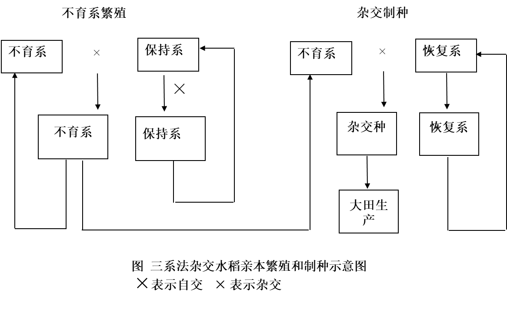

# 种子生产学

农业农村部种业管理司

全国农技推广中心，www.natesc.org.cn

中国南繁网

中国种子协会网

## 绪论

### 一、种子生产的概念和意义

#### （一）概念

1. 种子生产：按照种子生产原理和技术操作规程繁殖常规种子和杂交种子的过程。（推荐标准，不一定，只要符合4个质量标准）生产出来的种子作为大田生产的播种材料或进一步作为繁殖下一代种子的材料。
2. 基本要求：原有的遗传特性、产量潜力、种子活力

#### （二）意义

为农业生产提供优良品种的优质种子，满足市场的需求。

### 二、种子生产的特点

#### （一）繁殖方式多样性

1. 有性繁殖和无性繁殖

   （1）有性繁殖：自花授粉、常异花授粉、异花授粉（雌雄异株，雌雄同株异花，自交不亲和，雌雄不同期成熟或花柱异型）
   
   （2）无性繁殖

#### （二）自然因素制约性

#### （三）种子生产的时效性

#### （四）种子质量鉴定的困难性

### 三、种子生产应具备的条件

1. 良好的种子生产基地
2. 专业技术人员和检验人员
3. 资金和生产、检验设施
4. 种子生产经营许可证
5. 该作物的品种权或该品种的生产授权

## 第一章 种子生产的基本理论

### 一、作物的繁殖方式

原种和大田用种的生产程序和保纯防杂

人为控制授粉技术

有性繁殖：**由雌雄配子结合，经过受精过程，最后形成种子繁衍后代**

无性繁殖：**不经过两性细胞受精过程的方式繁殖后代**

#### （一）有性繁殖

1. 花器结构对授粉的影响

2. 作物自然异交率的测定

3. 有性繁殖的主要授粉方式

   杂交小麦？常规种分蘖多，群体产量高。杂种植株大易倒伏。优势不明显

   （1）自花授粉作物：水稻、大小麦、马铃薯、烟草

   （2）异花授粉作物：玉米、白菜型油菜、瓜类

   （3）常异花授粉作物：棉花、甘蓝型油菜、芥菜型油菜

4. 自交不亲和性

   甘蓝、黑麦、白菜型油菜

5. 雄性不育性

   （1）细胞核雄性不育

   核基因控制，多为隐性。

   光温敏核不育（生态型雄性不育）
   
   （2）细胞质雄性不育
   
   安全可靠、种源可控
   
   

#### （二）无性繁殖

1. 营养体繁殖
   - 由营养体繁殖的后代称为无性系
2. 无融合生殖
   - 植物性细胞的雌雄配子，不经过正常受精、两性配子的融合过程而形成种子以繁衍后代的方式
   - 无孢子生殖、二倍孢子体生殖、不定胚生殖、孤雌生殖、孤雄生殖

### 二、作物的品种类型

特异性、一致性、稳定性（DUS）

新颖性

#### （一）自交系品种

纯系品种，常规品种

生产上种植的大多数水稻、小麦、大麦等自花授粉作物的常规品种就是自交系品种。在异花授粉作物中，如玉米的亲本自交系也属于自交系品种。

#### （二）杂交种品种

#### （三）群体品种

综合品种

如许多玉米、黑麦等的地方品种。

#### （四）无性系品种

许多薯类作物和果树品种

### 三、纯系学说及其与种子生产的关系

#### （一）概念

#### （二）指导意义

保纯防杂

### 四、遗传平衡定律及其与种子生产的关系

#### （一）基因频率与基因型频率

**基因频率**是指在某一群体中，某个等位基因占该位点等位基因总数的比率，也称等位基因频率。

**基因型频率**是指在某一群体中，某个特定基因型占该群体所有基因型总数的比率。

#### （二）自交的遗传效应

自交使杂合的基因型逐渐趋向纯合

自交对品种保纯和物种的相对稳定是十分重要的

自交引起杂合基因型的后代发生性状分离

自交引起杂合基因型的后代生活力衰退

#### （三）遗传平衡定律

在一个大的随机交配的群体内，如果没有突变、选择和迁移因素的干扰，则基因频率和基因型频率在世代间保持不变。

#### （四）遗传平衡定律对种子生产的指导意义

在长期自由授粉的条件下，异花授粉作物品种群体的基因型是高度杂合的。符合遗传平衡定律。**异花授粉群体内个体间随机交配繁殖后代，假如没有选择、突变、遗传漂移等影响，其群体内的基因频率和基因型频率在各世代间保持不变，即保持遗传平衡。**但实际上存在选择、突变等因素，对纯度产生影响

### 五、杂种优势利用及其与种子生产的关系

杂种优势是指两个遗传组成不同的亲本杂交产生的杂种第一代，在生长势、生活力、繁殖力、抗逆性，产量和质量上比其双亲优越的现象。

F2的衰退现象

两个亲本的纯合程度越高，性状差异越大，F1表现的优势越大，则F2表现衰退现象越明显。

#### （一）杂种优势的遗传理论

显性假说

超显性假说

#### （二）**异交的遗传效应** 

1. 形成杂合基因型
2. 增强后代的生活力

#### （三）杂种优势在种子生产中的应用

在杂交制种的过程中，要保持和提高亲本种子的纯度，以达到所生产的杂交种子具有较强的杂种优势。

在亲本种子生产过程中，对所有**不符合典型特征**的异株都必须毫不留情地拔除，以保证所生产种子的纯度。

## 第二章 植物品种审定和新品种保护

### 一、品种审定和登记

#### （一）品种审定和登记

1. 对主要农作物实行品种审定制度：主要农作物（稻、小麦、玉米、棉花、大豆）推广前应当通过国家级或省级审定

   - 应当审定的农作物品种未经审定的，不得发布广告、推广、销售

2. 对部分非主要农作物实行品种登记制度

   - 列入非主要农作物登记目录的品种在推广前应当登记
   - 应当登记的农作物品种未经登记的，不得发布广告和推广

3. 《审定标准》的主要原则

   - 保障粮食安全：高产稳产
   - 突出绿色发展
   - 符合市场需求

4. 品种审定分类标准

   （1）高产稳产品种

   （2）绿色优质品种

   （3）特殊类型品种

#### （二）品种审定机构

国家农作物品种审定委员会

省级农作物品种审定委员会

#### （三）申请审定的品种应当具备的条件和审定程序

申请-品种比较试验（自行）-区域试验-生产示范试验-品种审定-应用推广

### 二、农作物品种试验

#### （一）区域试验和生产试验

区域试验：品种利用价值、适应范围和推广地区、适宜栽培技术
- 抗逆性鉴定、品质检测

品种生产试验：接近大田生产的条件下，对品种的丰产性、适应性、抗逆性等进一步验证，同时总结配套栽培技术

1. 试验的组织和安排

   （1）试验点设计：代表性

   （2）试验年限：2-3年

   （3）试验组别

   （4）试验的基本要求：代表性、准确性、重复性

   （5）试验的规划

   - 试验点次和重复

   - 试验小区面积

   - 对照品种：已推广的主栽品种

   - 保护行设置：消除边际效应和人畜践踏

2. 试验方案的制定

3. 撰写试验结果总结报告
4. 其他检测内容
   - 区域试验除对品种丰产性、稳产性、适应性、抗逆性等进行鉴定外，须同时进行品质分析、DNA指纹检测、转基因检测等

#### （二）DUS测试

特异性：指一个植物品种有一个以上性状明显区别于已知品种

一致性：是指一个植物品种的特性除可预期的自然变异外，群体内个体间相关的特征或者特性表现一致

稳定性：是指一个植物品种经过反复繁殖后或者在特定繁殖周期结束时，其主要性状保持不变

### 三、植物新品种保护

植物新品种是指经过人工培育的或者对发现的野生植物加以开发，具备新颖性、特异性、一致性和稳定性并有适当命名的植物品种。

植物新品种权：完成育种的单位或个人对其授权品种享有排他的独占权

品种权的保护期限，自授权之日起，藤本植物、林木、果树和观赏树木为20年，其他植物为15年。 

### 四、国外农作物品种登记和管理

#### （一）美国的农作物品种登记和管理

新品种发放：品种DUS测定必须，农艺性状和生产率方面与现有品种进行比较，至少在某一方面有独特的优点才能获准发放

品种保护：《植物专利法》、《植物品种保护法》、《一般专利法》

申请保护的植物新品种必须经过DUS测定，具备特异性、一致性、稳定性的，才能被受理

#### （二）欧盟各国的新品种登记和管理

欧盟各国，品种只有国家一级登记（相当于我国的国家级品种审定），获得登记的品种方可进行种子生产、经营、推广

国家级的农业新品种试验有DUS、栽培和利用价值（VCU）测定两种

VCU测定一般进行2～3年，其测试的最重要指标是产量，其次是抗性（抗倒、抗病虫、抗逆等）。此外，还要进行专门的品质测定。

## 第三章 种子生产的基本方法

### 一、种子级别的划分

#### （一）中国现行的种子级别分类

1. 指标
   - 品种纯度
   - 净度、发芽率、水分、活力、健康度等
2. 种子质量分级标准（纯度、净度、发芽率、水分）
   - 育种家种子
   - 原种
   - 大田用种（良种）

#### （二）其他国家的种子级别分类

1. 日本：育种家种子、原原种、原种和认证种子或市售一般种子（生产用种）
2. 美国：育种家种子、基础种子、登记种子和认证种子

#### （三）国际上有关机构的种子级别分类

AOSCA

OECD

### 二、常规品种的种子生产

常规品种：除了一代杂交品种及其亲本和无性系品种以外的品种。包括自花授粉作物的纯系品种、多系品种，常异花授粉作物的天然授粉品种，异花授粉作物的开放授粉品种。（玉米的自交系品种为纯系，按自花授粉作物生产）

#### （一）常规品种的原种生产

1. 自花授粉和常异花授粉作物常规品种的原种生产

   （1）低温贮藏繁殖法：在育种家的监控下，一次性繁殖够用5-6年的育种家种子贮藏于低温条件下，……

   （2）循环选择繁殖法*（图记忆）：从某一品种的原种群体中或其他繁殖田中选择单株，通过个体选择、分系比较、混系繁殖，生产原种种子。三年三圃制和二年二圃制（省掉株系圃）

   （3）株系循环繁殖法：把引进或最初选择的符合品种典型性状的单株或株行种子分系种于株系循环圃。收货时分为两部分：一部分是先分系收获若干单株，系内单株混合留种，称为株系种……

   （4）自交混繁法：分系自交留种，隔离混系繁殖。

2. 异花授粉作物常规品种的原种生产

   大量选择表型优良的个体，将其种子混合起来在隔离区内种植，让这些单株随机交配，从隔离区收获的种子为基础种子（原原种），然后在隔离条件下种植原原种，任其自由授粉，收获的种子为原种。关键要混粉

#### （二）常规品种大田用种的生产

1. 自花授粉和常异花授粉作物常规品种的大田用种生产
   - 直接繁殖、防杂保纯、提供大田生产用种
2. 异花授粉作物常规品种的大田用种生产

### 三、杂交种品种的种子生产

在严格选择亲本和控制授粉的条件下生产的各类杂交组合的F1植株群体

包括：

- 杂交种亲本的种子生产
  - 包括原种生产和生产用种生产
- 杂交种F1的种子生产
  - 大田用种的生产

#### （一）杂交种品种亲本的原种生产

1. 三系亲本的原种生产

   （1）有配合力测定步骤

   成对回交测交法

   - 不育系和保持系成对授粉原种生产：单株选择，成对授粉；株行鉴定，测交制种；株系比较，杂种鉴定，优系繁殖生产原种
   - 恢复系

   （2）无配合力测定步骤

   三系七圃法

2. 光温敏核不育两用系的原种生产方法

   （1）必要性和特殊性

   - 不育起点温度存在遗传漂移现象
   - 原种生产必须在可控的光温条件下进行
   - 原种使用代数短，原种生产必须年年进行

   （2）方法与程序

   单株选择-高温或长日低温处理-再生留种（核心种子）-原原种-原种-制种

   花粉育性：不育度99.5%以上

3. 人工去雄制种亲本原种生产

   （1）穗行半分法

   （2）测交法

#### （二）杂交种品种一代杂种种子生产

1. 一代杂种种子生产方法

   （1）人工去雄制种法

   - 雌雄同花：番茄、茄子……，去掉雄蕊
   - 雌雄同株异花：玉米、瓜类，摘取雄花
   - 雌雄异株：菠菜，拔去雄株

   （2）化学杀雄制种法

   （3）利用雄性不育性制种

   - 光温敏核不育（模式图掌握）
   - 核质互作雄性不育制种（制种安全性高，模式图）

   （4）利用自交不亲和系制种

   （5）利用雌性系制种法

   （6）利用苗期标记性状制种法（人工育苗环节）

2. **一代杂种种子生产共性技术*****

   亲本繁殖和F1制种

   （1）确定制种田和亲本繁殖田面积比例：反推

   （2）隔离区的设置：空间隔离、屏障隔离和开花期隔离（播种间隔：开花期积温条件）

   （3）父母本间种行比（制种产量）：父母本相间种植的行数比例。确保花粉供应，增加母本行数。父本分蘖数

   （4）调节播期，确保花期相遇（播差：父本和母本播种的时间差距）

   - 对于异花授粉作物和常异花授粉作物：
     - 宁可母本等父本，不可父本等母本
     - 母本安排在最适宜的播期，然后调节父本的播期
   - 自花授粉作物：
     - 宁可父本等母本，不可母本等父本（母本接受花粉时间短。两头包）
     - 将开花期安排在最适宜的季节
   - 花期预测：幼穗观察

   （5）除去杂株：以亲本的性状标准去鉴别、拔除杂株，典型性。从种子开始

   （6）及时去雄和辅助授粉

   （7）父母本分收分藏

   - 父本单独种：防混杂，防流失

   （8）质量检查：播前，去雄前后，收获后

   ### 四、无性系品种种子生产

   由一个无性系或几个遗传上近似的无性经过无性繁殖产生的群体

   #### （一）无性系品种原种种子生产

   1. 原原种重复繁殖法
   2. 循环选择法

   #### （二）无性系品种大田用种生产

   

   ### 五、种子快速繁殖

   #### （一）利用作物分蘖特性稀播单株插，必要时多次剥蘖移栽

   #### （二）利用异地或异季生长环境一年繁殖多代

   

## 第四章 种子生产基地建设

   ### 一、原则与条件

#### （一）形式

1. 种子企业自有或国有种子生产基地

2. 农村特约种子生产基地

   （1）区域特约

   （2）联户特约

   （3）专业户特约

3. 自主租赁的种子生产基地

#### （二）布局和建设的原则

1. 在最适宜的生态条件下建立种子生产基地的原则
2. 统筹安排、分级分类建设的原则
3. 质量优先、兼顾效益的原则

#### （三）必备条件

1. 气候条件：光温水风

2. 自然生产条件

   （1）隔离条件

   （2）无霜期

   （3）土地

   （4）病虫害

   （5）交通方便

   （6）基地的农业生产水平高

3. 社会经济条件

   （1）政府、群众

   （2）技术力量

   （3）劳动力

   （4）耕作制度

   （5）农户经济基础

### 二、程序与内容

#### （一）建立种子生产基地的程序

1. 搞好论证
2. 设计规划
3. 组织实施

#### （二）内容

1. 种子生产基地基础设施建设
2. 基地组织管理体系和服务体系建设
3. 种子生产配套服务体系建设

### 三、种子生产基地的管理

#### （一）计划管理

#### （二）技术管理

#### （三）质量管理

### 四、种子生产计划的制订

#### （一）内容

#### （二）影响因素

1. 品种结构及其表现情况
2. 病虫害及自然灾害发生情况
3. 需求总量
4. 政府的政策导向及发展趋势分析
5. 同类种子企业的种子生产情况及库存情况

#### （三）种子生产计划的制定

1. 品种决策

2. 生产量决策

   （1）商品种子生产量的确定：生产量=计划销售量-上年库存量+风险存量

   （2）原种（亲本种子）生产量的确定：原种生产量=下季商品种子生产面积×

3. 种子生产实施方案的制定

## 第五章 种子生产的质量控制

### 一、种子质量和标准

#### （一）种子标准化

1. 概念：实行品种标准化和种子质量标准化
   - 品种标准化：大田推广的优良品种符合品种标准
   - 种子质量标准化：大田所用农作物优良品种的种子质量基本达到国家规定的质量标准

#### （二）种子质量分级标准

纯度

净度、发芽率、水分

杂交种没有原种，仅有大田用种

### 二、种子认证

#### （一）概述

一种控制种子质量的制度，是由第三方认证机构依据种子认证方案通过对品种、亲本种子来源、种子田以及种子生产、加工、标识、封缄、扦样、检验等过程的质量监控，确认并通过颁发认证证书和认证标识来证明某一种子批符合相应的规定要求的活动。

**遗传质量（真实性和纯度）和物理质量（净度和发芽率等）**

#### （二）国内外种子认证现状

1. 国外种子认证现状：强制认证和自愿认证
2. 国内种子认证现状

#### （三）种子认证方案

1. 种子遗传质量的监控

   （1）品种合格认证

   - 必须是公布目录中的品种
   - 必须经过测试——品种DUS测定和品种VCU测定（利用价值）

   （2）种子来源认可

   - 检查标签

   （3）生产基地认可

   - 前作不存在污染源
   - 隔离条件安全

   （4）田间检验

   （5）清洁不混杂管理

   （6）扦样、标识与封缄

   （7）品种纯度的验证

2. 种子物理质量的监控

   - 100%检验
   - 净度、发芽率、水分

#### （四）种子认证程序

1. 企业申请认证
2. 质量体系评定
3. 种子遗传质量确认
4. 种子物理质量确认
5. 认证证书发放和认证后管理

### 三、提高种子质量的措施

#### （一）提高种子纯度的措施

1. 品种混杂品种退化的原因

   （1）机械混杂

   （2）生物学混杂

   （3）不正确的选择

   （4）剩余分离和基因突变

   （5）不良的生态条件与栽培技术

2. 品种防杂保纯的措施

   （3）定期更新和采用四级种子生产程序

   （4）严格执行种子生产技术规程

   （5）改善环境条件与栽培技术

#### （二）提高种子净度的措施

## 第六章 水稻种子生产技术

### 一、水稻生产概况

两杂：杂交水稻、杂交玉米

### 二、生物学特性

籼粳交：偏籼、偏粳

主要栽培类型

- 籼稻和粳稻
- 晚稻和早稻
- 水稻和旱稻
- 粘稻和糯稻

水稻三性：

- 感温性：籼稻和早稻强
- 感光性：粳稻和晚稻
- 基本营养生长性

抽穗始期（始花期）、抽穗期和齐穗期：全田植株抽穗率10%、50%和80%

#### （三）幼穗基本营养生长分化进程的诊断

1. 叶龄指数法

2. 叶耳间长法：诊断减数分裂过程

3. **幼穗长度法**

4. 距出穗日数

5. **目测法**

   一期看不见，二期苞毛现，三期毛丛丛，四期粒粒现，五期颖壳分，六期叶枕平，七期穗色绿，八期穗即现

### 三、常规水稻种子生产

主要措施：隔离去杂

#### （一）原种及大田用种繁育田

原种单本插稀植（去杂），一般不用（省钱）

**四清五单**

#### （二）提纯保纯

### 四、杂交水稻种子生产

#### （一）杂交稻的繁制种与影响产量的因素

繁种指不育系种子的生产，制种为杂交一代种子的生产

1. 繁制形式

   （1）春繁、春制

   （2）夏繁、夏制（大部分）

   （3）秋繁、秋制

   （4）冬繁、冬制：海南的三亚、陵水一带

2. 影响繁制种产量的因素

   （1）异交特性

   - 柱头大小、柱头外露率、柱头活力等异交特性相对较差
   - 不育系植株也大多表现矮小、包颈严重、开花受天气条件影响大
   - 繁、制种田父母本花时不同步

   （2）异交特性的调节

   - 确保亲本在适宜的气候、生态条件下安全抽穗
   - 确保亲本花期的吻合
   - 创造良好的适宜于异交的空间状态

   （3）亲本栽培

   - 获得更高的母本异交结实率和异交产量
   - 因时因种确定合理的父母本行比和栽插密度，母比父4-6:1
   - 既要保证母本有足够有效穗，同时要争取父本足蘖多穗，增加花粉量、延长花期

#### （二）三系籼型杂交稻的制种技术

1. 季节和地点的选择

   （1）季节选择：在扬花授粉期间田间具备适宜的温度与湿度条件。

   - 开花期日平均温度26～28℃，日最高温度不超过35℃，日最低温度不低于21℃
   - 制种形式的选择主要是安排最佳的抽穗扬花季节
   - 充分考虑灌浆结实期气候条件对种子质量的影响
   - 季节的确定还要与组合特性相结合

   （2）地点选择：应重点考虑是否具有良好的稻作自然条件和保证种子纯度的隔离条件

2. 花期的相遇标准确定

   - 花期全遇，即父本初花和末花前后均能围住母本花期，使母本盛花期能获得充足的花粉供应，达到母本“头花不空，尾花不丢，盛花期相逢”
   - 母本要集中抽穗，单穴栽插本数较多

3. 父母本播种差期的确定

   - 第一期父本播种到母本播种的相距时间
   - 个别母本生育期更长

   （1）时差推算法（生育期法）

   （2）叶差法：以长生育期亲本的**主茎叶龄**作为另一亲本播种差期的指标。和时差法**互为校正**

   （3）温差法：利用父母本从播种到始穗的有效积温差来确定父母本的播种差期。

   （4）影响播差的其它因素：如种子来源、秧苗素质、秧龄长短等

4. 异交栽培

   - 根据双亲的特点、异交授粉的特性等合理安排母、父本的行比、栽插方式和调控措施。

   （1）异交产量的构成及母本与父本行比的确定

   （2）父本的栽插形式和行向

   （3） 花期预测和调节技术

   - 一般要使双亲花期相遇良好，在幼穗分化前期（1～3期），父本要比母本早一期，在中三期（4～6期），双亲基本处于同一阶段，而后期母本则要略早于父本。
   - 常用剥穗法鉴定发育时期
   - 对发育快的一方在植株根系间追施尿素，减缓其生育进程；对发育偏迟的一方，辅以磷酸二氢钾叶面喷施，促进其生殖生长，特别是要注意烤田，以达到父母本同步发育。

   | 调节方法     | 主要措施           | 促控效果                                                     | 备注                       |
   | ------------ | ------------------ | ------------------------------------------------------------ | -------------------------- |
   | 1.水分调节法 | 排水烤田或灌深水   | 母本反应不敏感，拷田可延缓父本发育2～3 d，灌水可促进父本发育2～3 d | 迟熟组合、生育前期效果较好 |
   | 2.肥料调节   | 偏施氮肥或偏施钾肥 | 施氮可延缓始穗4 d左右，施钾促1～2 d                          | 一类禾苗不宜               |
   | 3.激素调节   | 施用“九二〇”       | 促2～3 d                                                     | 幼穗分化6-7期应用          |
   | 4.植株伤害法 | 割叶、踩根、拔苞   | 延迟2～3 d                                                   | 踩根、拔苞要慎用           |

   （4）提高异交结实率

   - 使用“九二〇”
   - 割叶
   - 人工辅助授粉

   （5）严格田间去杂﹑确保种子纯度

#### （三）三系粳型杂交稻的制种技术

#### （四）两系法杂交稻制种

在选用不育系时必须考虑在本地区能否安全制种，即稳定不育期能否在30d以上，而稳定不育期的长短主要取决于该不育系育性转换的临界温度和临界光长
