# 种子贮藏加工学

## 绪论

种子的商品特性：季节性……

按种子贮藏特性不同分为正常型种子、顽拗型种子（**不耐低温贮藏、不耐脱水干燥**）、中间型种子

顽拗型种子：茶籽、可可、板栗、橡胶

中间型种子：小果咖啡

### 一、种子加工的含义

从收获到播种前对种子所采取的各种处理，以达到**提高种子质量和商品特性**，保证种子的安全贮藏，促进田间成苗及提高产量的目的。

### 二、种子加工的内容

### 三、种子贮藏的含义

科学依据种子贮藏过程中种子生命活动的规律，采取合理的贮藏设施，人为地控制贮藏条件，将种子质量的变化降低到最低限度。

### 四、种子贮藏研究的内容

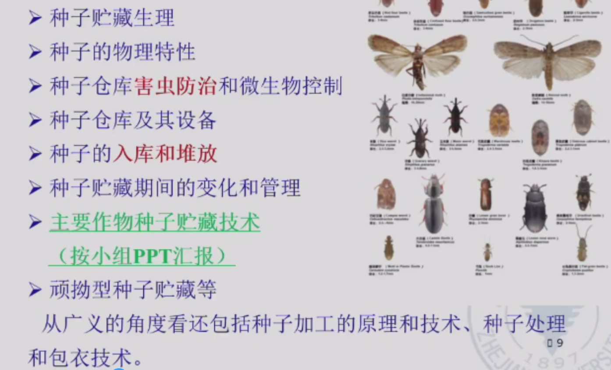

### 五、种子加工在农业生产上的意义

1. 提高农作物单位面积产量最经济、最有效的增产措施
   - 出苗整齐、苗多苗壮、分蘖多、成穗多
2. 可减少播种量，节约粮食
3. 可提供不同级别的商品种子，有效防止种子经营中伪劣种子的流通

### 六、种子贮藏的作用

1. 种子产业化体系的重要环节
2. 为农业生产提供优质良种
3. 为种子经营提供物质保证
4. ……

### 七、种子贮藏加工与其他学科的关系

### 八、我国种子加工与贮藏的历史

**汉朝的《汜胜之书》：**
“麦种候熟可获，择穗大疆者，斩、束、立场中之高燥处，曝使极燥”。——留株后熟，快速降低种子水分
“取干艾杂藏之，麦一石，艾一把，藏以瓦器竹器”。——驱虫防虫
溲种篇：种子裹上粪肥以作种肥。——种子包衣、丸化

**北魏的贾思勰《齐民要术》：**
“窖麦法，必须日曝令干，及热埋之”。——小麦热进仓
“栗，初熟，出壳，即于屋里埋著湿土中。埋必须深，勿令冻澈”。——顽拗型种子

### 九、种子加工与贮藏的发展

## 第一章 种子贮藏原理

### 一、种子呼吸

种子无时无刻不在呼吸，了解种子呼吸及其影响因素，控制呼吸作用，做好种子贮藏工作。

#### （一）概念

1. 呼吸作用：种子内活的组织在酶和氧的参与下将本身的贮藏物质进行一系列的氧化还原反应，最后放出二氧化碳和水，同时释放能量的过程。
2. 呼吸强度：指一定时间内，单位重量种子放出的二氧化碳量或吸收的氧气量。它是表示种子呼吸强弱的指标。
3. 呼吸作用部位：**胚部为主，其次是糊粉层**。果种皮和胚乳经干燥后是死亡的，但果种皮和通气性有关，有影响。

#### （二）性质

1. 有氧呼吸

2. 无氧呼吸

   在缺氧条件下，细胞把种子贮存的某些有机物分解成为不彻底的氧化产物，同时释放能量的过程。

   一般无氧呼吸产生酒精（乙醇），但**马铃薯块茎、甜菜块根、胡萝卜和玉米胚进行无氧呼吸时，则产生乳酸。**

3. 最佳贮藏：种子干燥、果皮紧密、完整饱满；环境干燥低温、密闭缺氧

4. 有氧呼吸和无氧呼吸共存

水分含量低，密闭贮藏；水分含量高，通风贮藏。

水分含量低，密闭贮藏，缺氧，无氧呼吸也非常弱，不影响种子生活力。

#### （三）影响因素

1. 水分
   - 呼吸强度随着种子水分的提高而增强
   - 临界水分（游离水出现时种子的含水量）：**禾本科作物13.5%；油料种子8%-8.5%（60%*13.5%）**
   - 安全贮藏水分：冬春14-15%；夏秋12-13%（禾谷类）
2. 温度
   - 在一定范围内，种子的呼吸作用随温度的升高而加强
   - 0-55℃逐渐增强；超过55℃，急剧下降
3. 通气
   - 通气条件下的呼吸强度均大于密闭贮藏
   - 高水分种子，无氧呼吸，毒害。尤其是呼吸强度大的油料作物种子，注意通风
   - **水分不超过临界水分**，呼吸作用非常微弱，对氧气的消耗很慢，**在密闭条件下贮藏有利于保持种子生活力**
   - 在密闭条件下，种子发芽率随其水分提高而逐渐下降
4. 种子本身状态
   - 成熟度：未成熟＞成熟
   - 完整性：破损＞完整
   - 新陈度：新＞陈
   - 健康状况：感染病虫＞正常
   - 受潮受冻：受潮后再干燥>未受潮；受冻>未受冻
   - 籽粒大小和种胚比率
5. 化学物质：熏蒸剂
6. 仓虫和微生物
   - 热量和水分—呼吸强度增高
   - 种子堆总呼吸（种子、仓虫、微生物）
   - 自动驱除

#### （四）呼吸与种子贮藏的关系

1. 有利方面：促进种子后熟，自然缺氧贮藏
2. 不利方面
   - 消耗大量贮藏干物质
   - 释放热量和水分，易造成种堆发热霉变
   - 缺氧呼吸产生有毒物质
   - 水汽和热量使仓虫和微生物活动加强
   
   **在种子贮藏期间必须尽可能地降低种子的呼吸强度，使种子处在极微弱的生命活动中，有效保持生活力和活力。**

### 二、种子的后熟作用

#### （一）种子的后熟

1. 概念
   - 种子成熟包括形态和生理上的成熟
   - 后熟：形态成熟到生理成熟的过程

2. 休眠和后熟的关系

   - （生理）休眠：有生活力的种子给予适宜条件也不发芽

   - 后熟是休眠的一种状态，或是引起休眠的一种原因
   - 未通过后熟作用：发芽率低，出苗不整齐，影响成苗率

3. 种子后熟期长短
   - 不同作物种子后熟期长短有差异
   - 麦类较长。冬性小麦长于半冬性小麦，春性小麦最短
   - 水稻玉米较短。粳稻有，籼稻基本无，杂交稻易“穗萌”。

4. 促进种子后熟的意义
   - 提高种子质量
   - 提早收获，后作提前播种。留株后熟
   - 判断是否完成：标准发芽试验，发芽力（发芽势和发芽率）

#### （二）后熟与种子贮藏的关系

1. 有利影响

   后熟期种子抗逆力强，对生活力的损害较轻——小麦热进仓

   - 小麦热进仓：利用未通过后熟的小麦种子抗热性较强的特点，采用高温曝晒种子后趁热进仓，高温杀仓虫
     - 适用于新收获小麦，后熟期休眠，耐热性强
     - 不适用于通过后熟期的小麦
     - 不适用于含水量高于13%的种子

2. 不利影响

   （1）引起种子出汗

   - **新入库的农作物种子由于后熟作用尚在进行中，细胞内部的代谢作用仍然比较旺盛，其结果使种子水分逐渐增多，一部分蒸发成为水气，充满种子堆的间隙，一旦达到过饱和状态，水气就凝结成微小水滴，附在种子颗粒表面**

   - 出汗（生理作用，入库前期，全部种子）和结露（物理现象，温差造成，全年，局部）

   （2）造成仓内不稳定：种子堆内湿度增大，液态水吸附，水分再分配，局部种子呼吸作用加强，种子回潮发热，微生物，霉变腐烂。

## 第二章 种子的物理特性

根据单粒种子测定，均值：大小、硬度和透明度

种子群体测定：种子重量（千粒重、百粒重）、容重、相对密度、密度与孔隙度、散落性、导热性及吸附性等

清选分级、干燥、运输、贮藏，指导意义

### 一、种子的容重和相对密度（比重）

#### （一）容重

1. 定义：单位容积内种子的绝对重量，单位为“克/升”

2. 影响因素：颗粒大小、形状、整齐度、内部组织结构、化学成分、混杂物
   - 含水量高，容重小（孔隙)
   - **颗粒细小、不齐、圆滑、充实、水分及油分含量低、淀粉和蛋白含量高、混有沉重杂质，容重大**
   - 与饱满种子不同，瘦小皱瘪的种子，水分高，容重增大

3. 常见作物种子的容重

   

4. 应用：推算一定容量内的种子数量，或一定重量的种子所需的仓容和运输所需车厢数

   计算公式：
   $$
   体积（m^3）=\frac{重量（kg）}{容重（g/L）}
   $$

#### （二）相对密度（比重）

1. 定义：种子绝对重量和绝对体积之比，单位为“克/毫升”

2. 影响因素：种子光滑无附属物、组织结构致密、脂肪含量低的大
   - 大多数种子，成熟越充分，越充实，相对密度越大
   - 油料作物种子，成熟饱满，相对密度小（油脂多）

3. 意义：衡量种子品质，作为种子成熟度的间接指标，劣变程度

4. 应用：长期贮藏下降；利用相对密度清选分级（比重机）；计算种子密度

   计算公式：
   $$
   种子比重=\frac{种子重量（g）}{种子体积（mL）}
   $$

### 二、种子密度和孔隙度

1. 定义

   - 种子密度：一定容量容器中种子实际体积与容器的容积之比，百分率表示
   
   
      - 种子孔隙度：容器内种子间隙的体积与容器的容积之比，百分率表示
   
   
   
      - 两者和为100%
   
2. 影响因素：

   - 种子颗粒大小均匀度

   - 种子形状

   - 种皮松紧程度

   - 是否带稃壳或附属物

   - 化学成分
   - 种子水分
   - 入仓条件及堆积厚度

3. 计算公式：千粒重和千粒实际体积
   $$
   种子密度=\frac{绝对体积×容重}{绝对重量}×100\%
   $$

   $$
   种子密度=\frac{种子容重（kg/100L）}{种子比重}×100\%
   $$

   $$
   种子密度=\frac{种子容重（g/L）}{种子比重×10}×100\%
   $$

   $$
   孔隙度=100\%-密度
   $$

4. 一般带有稃壳和果皮的种子，其密度都比较小，而孔隙度相应比较大。比重大，容重往往相应增大，密度也随之提高

5. 种子孔隙度大小与种子贮藏的关系

   - 空气流通状况：熏蒸，热量水汽散发

   - 用于计算种子堆中氧气的贮存量，密闭状态下绝氧所需时间

   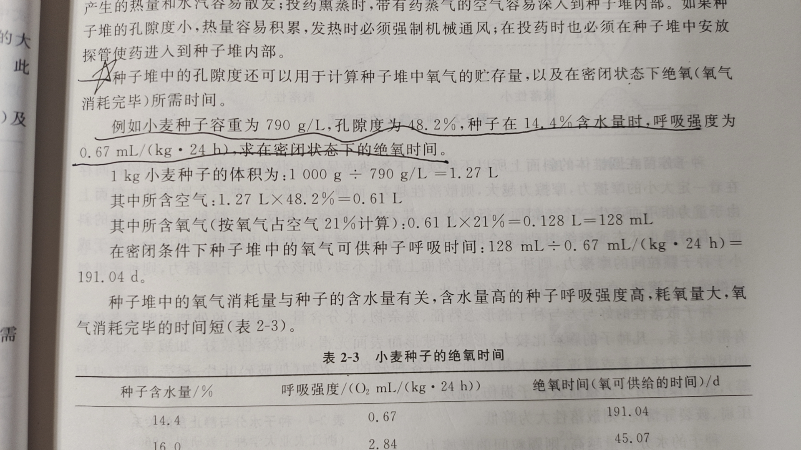

### 三、种子的散落性和自动分级

#### （一）种子的散落性

1. 定义：种子群体具有一定程度的流动性。当种子从高处落下或向低处移动时，形成一股流水状，种子流，种子所具有的这种特性。

2. 衡量指标：

   - 静止角（自然倾斜角）：自然落下，形成圆锥体，斜面与底部直径所成之角。
     - 散落性越差，静止角越大
   - 自流角：平面，斜面，种子在斜面上开始滚动时的角度和绝大多数种子滚落时的角度即为种子的自流角。

3. 影响因素

   - 形状大小

   - 夹杂物

   - 种子水分
     - 种子的水分含量越高，散落性相应减小，静止角越大

   - 收货后的处理方法

   - 贮藏条件

   凡种子颗粒比较大，形状近球形而表面光滑，散落性好。夹杂物、损伤，降低。

4. 与贮藏加工关系

   （1）估测种堆对仓壁的侧压力
   $$
   P=\frac{1}{2}mgh^2tan^2(45°-\frac{α}{2})
   $$
   P：侧压力（N/m）；m：容重；g取9.8；h：种子堆高度；α为种子静止角

   （2）清选、分离（书上都写静止角，自流角更合适）

   - 使用带式输送机输送种子，皮带倾角要小于输送种子的自流角，避免种子反流
   - 使用溜筛和自溜管，筛面倾角和溜管倾角要大于种子自流角才能正常作业。

   （3）贮藏

   - 入库初期，检查散落性变化
   - 有下降，可能回潮、结露、出汗以至发热霉变

#### （二）种子的自动分级

1. 定义：当种子堆在移动时，其中各个组成部分都受到外界环境条件和本身物理特性的综合作用而发生**重新分配**现象，即性质相近似的组成部分，趋向聚集于相同部位，而**失去它们在整个种子堆里原来的均匀性**，在品质上和成分上增加了差异程度
2. 原因：种子堆的各个组成部分间散落性存在差异
   - 严重的自动分级现象往往发生在机械化大型仓库中，种子数量多，移动距离大，落点比较高，散落速度快
3. 预防：进仓前清选，除杂，淘汰不饱满或不完整种子；入库金属锥形器；出库锥形罩
4. 应用：清选工具和方法的原理；提高清选分级工作效率；形成杂质集中分布区

### 四、种子的导热性和比热容（热容量）

#### （一）种子的导热性

导热性：种子堆传递热量的性能或能力

种子具有一定的导热性能。种子堆是热的不良导体

1. 传递方式

   - 直接接触，热传导传热
   - 气体流动，对流传热

2. 导热性差的作用

   - 贮藏期间：保持比较长期的低温状态，对安全贮藏有利
   - 种子温度较高：种子不能迅速冷却，长期处于高温条件下，不利

3. 导热率和导热系数

   （1）导热率：指单位时间内通过单位面积静止种子堆的热量。

   （2）影响因素：各层温差；种子特性；水分高低；堆装所受压力

   （3）导热系数：1m厚的种子堆，当表层和底层的温差相差1℃时，在每小时内通过该种子堆每平方米表层面积的热量，其单位为kJ/(h·m·℃)

4. 与贮藏加工关系

   （1）种子堆冷却或加温时，扩大种堆表面积，使升降温加快

   （2）增加种堆厚度，使越冬后种子升温慢，保持低温，利于安全越夏

   （3）导热性、导温性强的种子干燥快，干燥周期短

   （4）入库种子需充分干燥，减少外界温度的影响

   种子水分越高，热的传导越快

#### （二）热容量

Q=cm△t

1. 估测种子在贮藏期间的放热量

2. 估算人工干燥时所需的燃料量
   - 刚收获种子水分高，热容量大，先预干

### 五、种子的吸附性和吸湿性

#### （一）种子的吸附性

1. 概念
   - 吸附性：种子胶体具有多孔性的毛细管结构，在种子的表面和毛细管的内壁可以吸附其它物质的气体分子
   - 解吸作用：被吸附的气体分子亦可能从种子表面或毛细管内部释放出来而散发到周围空气中去

2. 形式：吸附（表面）、吸收（毛细管内部）、毛细管凝结（饱和，凝结）、化学吸附

3. 影响因素：形态结构，吸附面大小（比表面积，胚大，露出多），气体浓度（一定范围）、化学性质（易凝结，活泼），温度（温度下降有利于吸附）

#### （二）吸湿性

1. 概念：种子对于水汽的吸附和解吸的性能，是吸附性的一种具体表现。
2. 自由水、束缚水、化合水，临界水、安全水分
3. 影响因素：种子的化学组成和细胞结构。亲水胶体
4. 吸附滞后效应
   - 在相同的温度和相对湿度条件下，同一种种子吸湿增加水分和解吸降低水分下的平衡水分不同。
   - **种子吸湿达到平衡的水分始终低于解吸达到平衡的水分**
   - 避免吸湿回潮，吸湿后解吸永远大于吸湿前

#### （三）平衡水分

1. 概念：在固定的温度条件下，在一定的相对湿度中种子吸附水汽分子和解吸水汽分子达到平衡时的种子含水量，称为该条件下该种子的平衡水分。

安全水分：

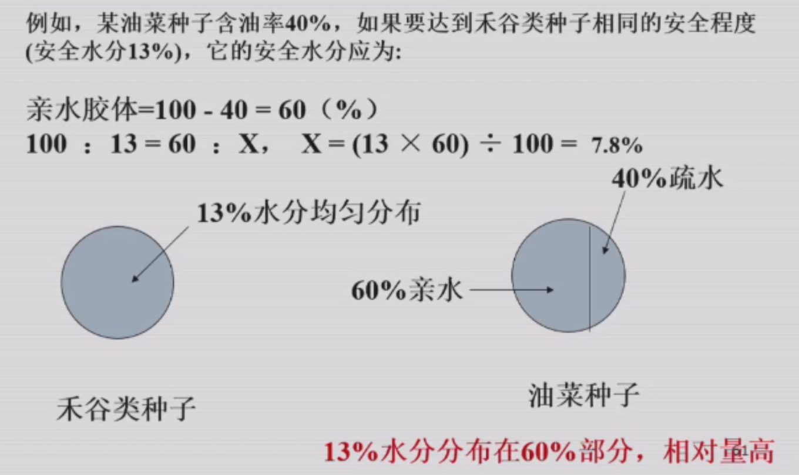

判断解吸还是吸湿。**安全贮藏湿度65%**

## 第三章 种子清选原理和技术

### 一、目的和意义

#### （一）清选和精选

1. 清选：清除混入种子的掺杂物，提高种子的纯净度，并为种子安全干燥、包装和贮藏做好准备。
2. 精选：剔除种子中质量低劣的种子，即不饱满的、虫蛀或劣变的种子。

#### （二）原则

清除杂质，提高种子质量。合适、彻底、有效、经济

### 二、种子尺寸特性分选原理与技术

#### （一）利用种子尺寸特性进行分选

1. 种子的性状和大小

   长度（l）、宽度（b）和厚度（a）

   - l>b>a，为扁长形种子。如水稻、小麦、大麦等种子。
   - 1>b=a，为圆柱形种子。如小豆等种子。
   - l=b> a，为扁圆形种子。如野豌豆等种子。
   - l=b=a，为球形种子。如豌豆种子等。

2. 种子筛的种类和筛孔形状

   （1）种子筛的种类
   - 冲孔筛
     - 镀锌板上冲出
     - **适于清理大型杂质及种粒分级**
     - 具有坚固、耐磨、不变形的特点，但有效筛理面积较小
   - 编织筛
     - 钢丝编织，方、长方、菱形
     - **适于清理细小杂质**
     - 坚固性差，有效筛理面积大
   - 鱼鳞筛
     - 薄镀锌板
     - 联合收割机清种室上筛
     - 可调，使用方便，但净度不高

   （2）筛孔形状
   - 长孔筛
   - 圆孔筛
   - 三角形孔筛
   - 金属丝网筛

3. 不同形状筛孔的分选原理和分选用途
   - 圆孔筛：宽度
   - 长孔筛：厚度。不同饱满度种子。
   - 窝眼筒和窝眼盘：长度
   - 平面筛：使种子与夹杂物在筛面均匀地移动，其中小于筛孔的部分通过筛孔，而大于筛孔的部分则阻留在筛面上，使其沿筛面流出，或借风力将其中轻者吹起，以完成分离
   - 圆筒筛：大于筛孔尺寸的种子，留在圆筒筛内，沿轴内逐渐从出口端排出，而小于筛孔尺寸的种子由筛孔漏出

4. 选用原则
   - 尺寸选择
     - 底筛让小杂质通过。
     - 中筛主要用于除去大杂
     - 上筛主要用于除去特大杂质
   - 筛孔的布置

5. 正确选用筛孔的技术
   - 分布曲线的制作：某一尺寸
   - 复合图的制作

6. 影响筛选质量的主要因素

   - 孔形及尺寸的正确选取
   - 筛子的制造质量
   - 喂料的均匀性
   - 料层的厚度
   - 筛子的尺寸与负荷
   - 筛面的倾角
   - 振动方向角
   - 摩擦角
   - 振幅与频率

#### （二）形状和孔洞

1. 利用种子的特殊形状
   - 三角形-三角形筛
2. 利用种子孔洞
   - 针式滚筒，尖针

### 三、种子力学特性分离原理与技术

#### （一）空气动力学特性和分选方法

1. 空气动力学特性

   - 根据种子和杂物对气流产生的阻力大小进行分选

2. 分选方法

   - 垂直气流分选：轻种子和轻杂物的临界速度小于气流速度，随气流一起做上升运动
   - 平行气流分选：用于清理轻杂物和瘪谷，如常用的木风车
   - 倾斜气流分选：利用种子本身的重力和所受气流压力的大小进行分选
   - 将种子抛扔进行分选：轻种子所受气流阻力大，落在近处；重的种子受气流阻力小，落在远处。

3. 空气筛

   基本清选机。利用种子的空气动力学特性和种子尺寸特性，空气流和筛子组合在一起。

#### （二）比重分选方法

1. 比重分选

   根据种子密度或比重的差异进行分选

2. 种子密度差异进行液体分离

#### （三）表面特性分选方法

1. 种子的表面特性：形状、粗糙程度
2. 分选机具和方法
   - 帆布滚筒
     - 如果需要分选的物质与种子的自流角有显著差异的，分选效果明显
   - 磁性分离机
     - 粗糙种子吸附磁粉

#### （四）种子的弹性特性分选方法

螺旋分选机

### 四、种子光电特性分选原理与技术

#### （一）种子色泽

种子颜色明亮或灰暗的特征

反射光与标准光色比较

#### （二）种子负电性分选方法

种子劣变后，负电性增加

选出高活力种子

### 五、种子清选的主要机械设备和操作技术

#### （一）风筛清选机

种子清选可预清、基本清选和精选。

风筛清选机可用于预清，也可用于基本清选，在基本清选机的基础上，再配以窝眼筒或其他分选原理的部件，就组成了复式清选机（用于精选分级）。

**预清机、基本清选机、复式清选机区别掌握**

|          | 预清机               | 基本清选机           |
| -------- | -------------------- | -------------------- |
| 筛面倾角 | 大，10-15°           | 小，3-7°             |
| 风选部分 | 1个吸风道，1个沉降室 | 2个吸风道，2个沉降室 |
| 筛子配备 | 一般2层，最多3层     | 3层以上，一般3-5层   |

预清作用：

- 除去一些大杂质、芒，使基本清选时能量消耗减少
- 确保种子流通顺畅，提高基本清选效率

#### （二）5XW-3.0窝眼筒清选机

根据长度尺寸做分离长、短杂的清选主机，也可作种子分级机使用

#### （三）5XZ-1.0型重力式清选机

在尺寸、形状和表面特征上与好种子非常接近的不良种子和掺杂物，但存在质量或密度上的差异。

重力式清选机是用于完成长、宽度分选后，**进一步按种子的比重分级**，把其中的病虫害粒、霉变粒或未完全成熟的种子分离开来，并把合格的种子分成两个等级。

#### （四）圆筒筛分级机

圆筒筛分级机是主要的分级设备，主要是适应精量播种机的要求，也是商业的需要。

有时也可作清选机使用。

### 小测

1. 种子后熟是种子休眠的一种状态，或是引起休眠的一种原因。√
2. 禾谷类种子中麦类种子后熟期较长，其中春性小麦后熟期长于冬小麦。×
3. 种子“出汗”是物理现象，一般发生在种子入库前期。×
4. 通过后熟期的种子抗逆力强。×
5. 一般而言，油菜种子的容重比玉米种子小。√
6. 油菜种子成熟度越高，则相对密度越小。√
7. 种子密度和孔隙度之和恒为100%。√
8. 油菜种子密度比水稻种子小。×
9. 油菜种子静止角比水稻种子小。√
10. 相同水分的油菜种子和水稻种子对仓壁的侧压力是不同的，油菜造成的侧压力比水稻小。×
11. 种子的水分含量越高，则颗粒间的摩擦力越大，其散落性也相应变差，静止角增大。√
12. 使用带式输送机输送种子，皮带倾角要小于输送种子的自流角，避免种子反流。√
13. 种子数量多，移动距离短，落点比较低，容易发生自动分级。×
14. 种子水分越高，则热的传导越快。√
15. 胚部较大的种子，其吸附性也较强。√
16. 在气体浓度不变的条件下，温度下降，有利于吸附的进行。√
17. 种子吸湿达到平衡的水分始终低于解吸达到平衡的水分。√
18. 油菜种子的安全贮藏水分比水稻种子低。√

## 第四章 种子干燥原理和方法

### 一、种子干燥目的和意义

#### （一）防虫蛀、防霉变和防冻害

新收获种子含水量高达25%-45%

- 当种子含水量在8%-9%以上时，仓虫开始活动繁殖；
- 12%-14%以上时，真菌开始生长繁殖；
- 18%-20%以上时，种子易发热变质或受冻死亡；
- 40%-60%以上时，种子将发芽。

#### （二）确保安全包装、安全贮藏和安全运输

#### （三）保持包衣和处理种子的活力

包衣和处理后必须及时干燥

#### （四）种子经营

### 二、种子干燥的原理和影响因素

#### （一）干燥原理

1. 干燥原理：种子是活的有机体，也是一团凝胶，对水分具有吸附与解吸的特性。**当外界水汽压小于种子内部水汽压时，种子失水得到干燥。**
2. 种子干燥介质：与种子接触，把热量带给种子，使种子受热，并带走种子中汽化出来的水分
   - 空气
   - 加热空气
   - 煤气
3. 过程：扩散（湿扩散、热扩散）和蒸发
   - 扩散：种内水分沿毛细管扩散到种子表面
   - 蒸发：种子表面水分汽化蒸发到干燥介质中
   - 两步同时发生但速度常有差异：
     - 小粒种子：
       常扩散 >蒸发——外部汽化控制（蒸发控制速度）
     - 大粒种子：
       常蒸发>扩散——内部扩散控制
     - 内部扩散小于外部蒸发
       - 减少外部蒸发速率
       - 缓苏：暂时停止干燥，并将种子堆起来，使种子内部水分逐渐向外扩散，**一段时间后使种子内外水分均匀一致**

#### （二）种子干燥特性曲线和干燥阶段

1. 干燥特性曲线：指在不变的条件下，把种子水分含量、种子表面温度等的变化随时间变化的关系分别用图线来表示

   （1）干燥曲线和温度曲线

   - 干燥曲线：在干燥过程中，种子含水率与干燥时间的关系曲线
   - 温度曲线：种子表面温度与干燥时间的关系曲线

   （2）干燥速度曲线：

   - 种子干燥速度与种子含水率之间的关系曲线
   - 干燥速度指单位时间内种子含水率的变化

   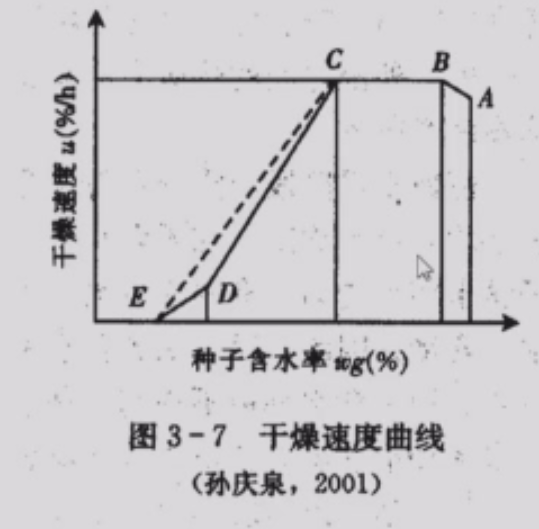

2. 种子干燥阶段：

   （1）预热

   - 温度呈线性上升，而种子含水量没有下降或降低很少。
   - 主要用来提高种子温度，只有部分热量使水分蒸发。

   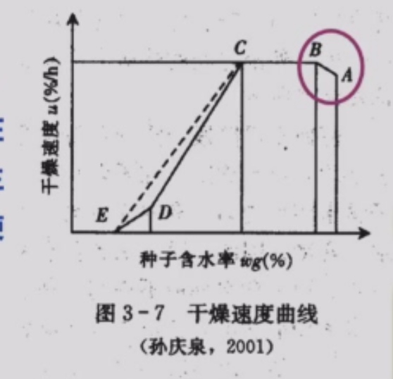

   （2）恒速干燥阶段

   - 从内部扩散到表面的水分大于或等于从表面蒸发的水分
   - 温差为定值，所有传给种子的热量都用于水分的汽化
   - 种子温度保持不变，干燥速度达到了最大值

   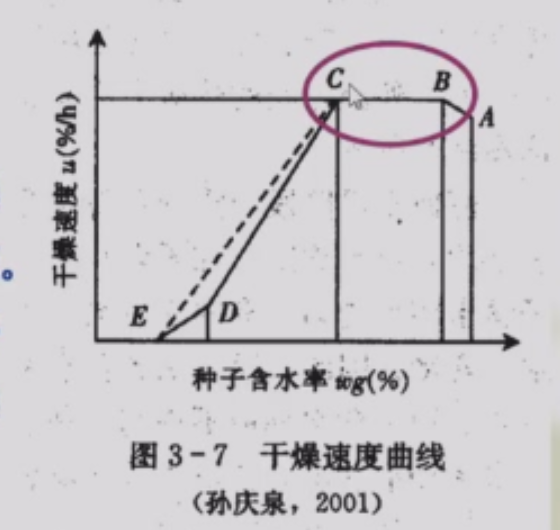

   （3）降速干燥阶段

   - 种子含水量下降，干燥速度下降，种子的温度逐渐上升
   - 到达E点后，种子各部分含水率均达到平衡水分，干燥速度为零，种子的温度被提高到干燥介质的温度

   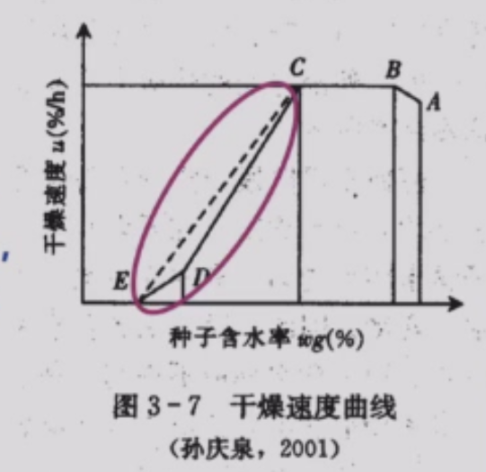

3. 干燥过程中的温度变化

   - 预热阶段，种子温度急剧上升
   - 随后进入恒速干燥阶段，温度略微下降，稳定
   - 降速干燥阶段，种子温度升高，直至和介质的温度相等或接近

4. 种子干燥曲线的应用

   - 提高干燥介质的温度，可减少干燥时间，即高温快速干燥，但过高的温度又对种子造成伤害
   - 要尽量缩短AB段，利用BC段，避免进入CDE段
   - 加热干燥种子时，种子含水量达到入仓标准时必须立即停止干燥，否则会出现过度干燥

#### （三）种子干燥的影响因素

1. 外部因素：干燥介质、温度、湿度、气流速度、与种子的接触情况
2. 内部因素：种子生理状态、种子化学成分、种子大小和结构
   - 刚收获的种子：含水量较高、新陈代谢旺盛
     - 先低温再高温缓慢干燥。高温快速破坏毛细管结构
   - 粉质种子：疏松多毛细管。较高温度干燥
   - 蛋白质种子：紧密。低温慢速干燥
   - 油质种子：水分易散发。高温快速干燥

### 三、种子干燥的方法

#### （一）自然干燥

晒干和晾干

1. 种子脱粒前自然干燥
2. 脱粒后的自然干燥

#### （二）通风干燥

鼓风机

#### （三）加热干燥

热气流。种子干燥的主要方法

1. 种子固定床式
2. 种子移动床式：均匀
3. 种子流化床式：种子颗粒被气流吹起呈悬浮状态
4. 种子循环式

注意：不能直接接触，控制种温，冷却后入仓

低温慢速干燥法和高温快速干燥法

#### （四）红外线辐射干燥

电磁能量

#### （五）干燥剂干燥

变色硅胶、氯化钙、生石灰、氯化锂

**少量种子或种质资源**

#### （六）冷冻干燥

冰点以下，冻结，升华

超干贮藏；降低干燥损伤；增加耐藏性

种质资源保存；大规模种子干燥；蔬菜种子

#### （七）其他干燥方法

微波干燥、传导干燥（接触干燥法）

### 四、种子加热干燥机械

堆放分批式干燥设备和连续流动式干燥设备

#### （一）堆放分批式干燥设备

1. 特点
   - 种子处于静止状态下进行干燥
   - 建造容易、热效率高
   - 干燥成本低、操作简单
   - 比连续流动式干燥设备利用率高
   - 缺点：生产能力较小，劳动强度较大
2. 种类：简易堆放式干燥设备、斜床堆放式干燥设备、多用途堆放式干燥设备

3. 斜床堆放式干燥设备

   普遍采用

#### （二）连续流动式干燥设备

1. 特点

   - 生产能力大
   - 干燥质量比较高
   - 易与其它加工机械配套成线

2. 种类：圆仓式循环干燥机、循向通风干燥机、连续式干燥机、通风带式干燥机

3. 连续式干燥机

   加热气体的流动方向与种子移动方向的配合有多种形式，**彼此以同方向运动的称之为顺流式；彼此以相反方向运动的称之为对流式；二者以互相垂直方向运动的称错流式。**

   - 顺流式：一开始就遇高温，过分失水。热能损失小
   - 对流式：种子受热合理，但热能损失大
   - 错流式：均匀受热。多采用

#### （三）种子加热干燥操作技术

1. 干燥时间：迅速干燥

2. 干燥前准备

3. 干燥的温度：不同作物；含水量高则干燥的温度要低些，含水量低干燥温度高。

   - 刚收获的种子，先低温干燥，后高温干燥
   - 把握温度变化
   - 注意用测定气流通过种层前后的温度来确定种子的干燥程度

4. 种子干燥需要的气流量

   气流量是种子干燥的重要因素

5. 气流相对湿度

   相对湿度越低越好，不超过60%

6. 气流的变换方式

7. 种子干燥层厚度

   一般干燥玉米穗高度不超过3m，玉米粒不超过1.5m，其他谷物种粒不超过1m

8. 水分温度变化

   - 爆腰：表皮干裂
   - 每隔1小时测1次热气流的温度
   - 每隔2小时用水分速测仪测1次种子水分变化情况

9. 出机温度

   不高于环境温度5℃

10. 种子干物质衡算及水分蒸发量计算

$$
绝对干物质=G_1×\frac{100-M_1}{100}=G_2×\frac{100-M_2}{100}
$$

$$
W_失=G_1×\frac{M_1-M_2}{100-M_2}=G_2×\frac{M_1-M_2}{100-M_1}
$$

G1干燥前质量，G2干燥后质量；M1干燥前水分（%），M2干燥后水分（%）

### 思考题

1. 种子传湿力的强弱主要决定因素。
2. 列举种子干燥的方法。
3. 影响种子干燥的因素有哪些？
4. 种子加热干燥机械主要有哪些？
5. 简述冷冻干燥的优缺点。

## 第五章 种子处理和包装

### 一、种子处理的目的和意义

#### （一）历史

#### （二）目的和意义

1. 目的
   - 提高种子活力
   - 刺激种子萌发和促进幼苗生长
   - 防病虫害
   - 防老化劣变
2. 意义
   - 节约用种量和方便播种
   - 增强商品种子的市场竞争力

### 二、普通种子处理技术

物理因素、化学因素

#### （一）物理因素处理

1. 温汤浸种

   - 种子的耐热能力常比病菌的耐热能力强
   - 打破种子休眠，促进种子发芽；灭菌防病，增强种子抗性

2. 低温层积

   - 在低温环境下（通常3-5℃），将种子和沙分层堆积的一种种子处理方法，可以有效打破种子的胚休眠
   - 变温层积处理

3. 射线处理

4. 电场处理

   低频电流和静电

5. 磁场处理

   磁场或磁化水

6. 红外线、紫外线处理

#### （二）化学因素处理

1. 肥料浸拌种

   （1）根瘤菌、固氮菌

   （2）肥料：硫酸铵、过磷酸钙、骨粉

2. 药剂处理

   防治病虫害

   浸种、拌种、闷种、熏蒸、低剂量半杀虫、热化学法、湿拌法等

3. 植物生长调节剂处理

   赤霉素、三十烷醇、920增效剂、多效唑

4. 微量元素处理

### 三、种子引发

#### （一）概念

**控制种子缓慢吸收水分使其停留在吸胀的第二阶段，让种子进行预发芽的生理生化代谢和修复作用，促进细胞膜、细胞器、DNA的修复和酶的活化，处于准备发芽的代谢状态，但防止胚根的伸出**

#### （二）种子引发的机理

DNA和细胞膜修复启动

复制活动增强

表观遗传调控

激素平衡调控

水孔蛋白合成

信号转导激活（钙离子，ROS）

#### （三）效应

1. 提高发芽和出苗的速度和一致性
2. 在低温或高温下加速发芽
3. 提高逆境下的出苗

#### （四）种子引发的方法

1. 渗调引发：以溶质作为引发剂，种子置于溶液湿润的滤纸上或浸于溶液中，通过控制溶液的水势达到引发目的
   - 水引发
   - PEG引发
     - PEG600易被吸收；多用PEG6000
   - 盐引发
     - 渗入组织，影响梯度
     - 破坏
2. 滚筒引发
3. 起泡柱引发
4. 搅拌型生物反应器引发
5. 固体基质引发
6. 水合引发+辅助因子
   - 植物激素引发
   - 营养因子引发
   - 生物引发
   - 纳米材料引发

#### （五）种子引发存在的问题

1. 引发时间过长导致种子萌动
2. 引发效果在种、品种，甚至种子批之间有差异

能否调控种子水分感受器，达到较好的引发效果

### 四、种子包衣原理和技术

#### （一）种子包衣的含义

1. 种子包衣：采用种子加工机械，将**杀虫剂、杀菌剂、微肥、植物生长调节剂、着色剂或填充剂**等非种子材料，连同粘合剂或成膜剂，包裹在种子外面，形成丸化状或膜状，使种子更光滑，并达到防病抗虫、促进成苗和高产等目的
2. 与传统药剂处理相比，特点：成膜特性，种衣剂可制成多功能制剂，水分一般不增加，生产效率商品性好

#### （二）种子包衣的作用

1. 控制病害，促进幼苗生长，增产增收
2. 出苗和成苗
3. 减少环境污染
4. 防止假劣种子流通
5. 利于机械播种和精量播种
6. 提高质量、抗逆能力
7. 防鸟取食
8. 控制杂草生长
9. 提供营养，可早播

#### （三）方法分类

材料不同及形成大小、形状、重量变化

1. 种子包膜技术：将种衣剂包裹在种子外面，形成一层薄膜。适用大粒和中粒种子
2. 种子丸化技术：利用粘着剂，将杀菌剂、杀虫剂、染料、填充剂等非种子物质粘着在种子外面，形成大小形状没有明显差异的球形单粒种子单位
   - 丸化工艺：成核期、丸粒增大期、滚圆期、筛选回锅期、撞光染色期、风干期

### 五、种子包装材料和包装技术

#### （一）意义和要求

1. 意义
   - 有性繁殖作物的籽粒、果实，马铃薯微型脱毒种薯，应当加工、包装后销售
   - 无性繁殖的器官和组织，不宜包装的种子，农民自留种，苗和苗木，可以不经加工、包装进行销售
2. 要求

#### （二）包装材料的种类和特性及选择

1. 种类和性质
   - 麻袋、蛇皮袋：强度好，透湿容易、防湿、防虫和防鼠性能差
   - 纸袋
   - 纸板盒和纸板罐
   - 聚乙烯和聚氯乙烯等多孔型塑料：不能完全防湿
   - 聚乙烯铝箔复合袋：强度适当，透湿率极低，也是最适的防湿袋材料
   - 金属罐：较适合的少量种子包装容器
2. 包装材料和容器的选择
   - 按种子种类、种子特性、种子水分、保存期限、贮藏条件、种子用途和运输距离及地区等因素
3. 防湿容器包装的种子安全含水量
   - 种子含水量降低与25%相对湿度平衡的含水量时，种子寿命可延长，有利于保持种子旺盛的活力
   - 防湿密封包装的种子必须干燥到安全包装的含水量，才能得到保持种子原有活力的效果。否则中毒死亡

#### （三）包装标签

1. 含义：固定在种子包装物表面及内外的特定图案及文字说明
2. 内容：农作物种子标签应当标注作物种类、种子类别、品种名称、产地、种子经营许可证编号、质量指标、检疫证明编号、净含量、生产年月、生产商名称、生产商地址以及联系方式。
3. 其他：
   - 进口种子的标签应当加注进口商名称、种子进出口贸易许可证编号和进口种子审批文号
   - 分装种子应注明分装单位和分装日期
   - 种子中含有杂草种子的，应加注有害杂草的种类和比率
4. 规范化
   - 明确至种，常规种、杂交种
   - 产地：繁育所在
   - 质量指标
   - 编号
   - 生产年月：收获时间
   - ……

#### （四）种子包装办法和包装机械

1. 包装方法
   - 定量包装
   - 定粒包装

种子标签二维码

## 第六章 种子仓库有害生物防治

### 一、种子仓库害虫及防治

#### （一）仓库害虫及其危害性

1. 仓库害虫的取食习性：
   - 初期性：以完整籽粒为食
   - 后期性：以破碎籽粒为食
   - 中间性：既取食完整籽粒，也食用破碎籽粒或腐败物

2. 为害方式：
   - 蛀空式：以胚乳为食
   - 剥皮式：从籽粒外部进行为害，咬胚部，剥食种皮
   - 破坏式：从外部进行为害，表面造成不规则的缺刻

3. 种子数量、种子生活力、营养价值下降，种堆温湿度提高

4. 虫情检查：
   - 直接检查法：过筛法、打药法、诱集法
   - 间接检查法：剖检法、比重法、化学染色法

#### （二）防治

1. 基本原则：安全、经济、有效
2. 方针：预防为主，综合防治
3. 防治方法：农业防治、检疫防治、清洁卫生防治、化学防治、生物防治、物理防治

   - 高低温杀虫法：热昏迷状态、冷昏迷状态。
     - 日光曝晒法
     - 人工干燥法
     - 小麦热进仓
     - 仓外薄摊冷冻
     - 仓内冷冻
   - 磷化铝熏蒸杀虫法：磷化铝、氨基甲酸铵、石蜡。产生磷化氢
     - 准备工作，投放药物，密闭杀虫，通风排毒
     - 注意事项
       - 戴好防毒面具；注意型号保证人员安全；种子含水量过高时进行熏蒸易产生药害
       - 正确选定施药时间；药物不能遇水，也不能投放在潮湿的种子或器材
       - 如果温度较低，则应适当延长密闭时间
       - 硝酸银显色法；药物残渣处理
   - 生物防治：植物提取物

### 二、种子微生物及其控制

包括：细菌、放线菌、真菌（霉菌、酵母菌、病原真菌）

最密切的是霉菌，其次是细菌和放线菌

#### （一）种子微生物区系

1. 田间真菌：湿生性真菌
2. 贮藏真菌：大都是在种子收获后感染和侵害种子的腐生真菌，主要是霉菌
   - 危害最严重且普遍：青霉和曲霉

#### （二）贮藏种子主要的微生物种类

1. 青霉：
   - 导致种子贮藏期间发热
   - 低温下，对种子危害较大
   - 好氧性
2. 曲霉：
   - 广泛存在，导致种子发热霉变
   - 腐生性
   - 毒素
   - 耐低湿
3. 细菌
   - 主要球菌与杆菌
   - 附生细菌，无明显为害
4. 放线菌
   - 土壤，腐生菌
   - 混杂有土粒的种子以及贮藏后期或发过热的种子上数量较多
5. 酵母菌
   - 很少，无重大影响
   - 水分高、霉菌活动，进一步作用

#### （三）微生物对种子生活力的影响

1. 丧失生活力的重要原因，发芽力降低和丧失
2. 原因
   - 毒素
   - 破坏种胚组织
   - 分解种子，有害产物，阻碍正常生理活动
   - 田间感病，为害

#### （四）种子的霉变

1. 初期变质阶段
   - 色泽
   - 异味
   - 潮湿，"出汗"，"返潮"，散落性降低
   - 软化
   - 有发热趋势

2. 中期生霉阶段
   - 微生物大量繁殖
   - 菌落：生毛、点翠（胚部）
   - 霉味，变色，品质变劣，毒素

3. 后期霉烂阶段
   - 严重腐解
   - 霉烂腐败，难闻气味
   - 变形结块，完全失去利用价值
4. 以达到**生霉阶段**作为霉变事故发生的标志

#### （五）影响微生物活动的主要因子

1. 种子水分和空气湿度

   - 干生性
   - 中生性
   - 湿生性

   ※不同类型微生物的生长最低相对湿度界限是比较严格的，而**生长最适相对湿度则很相近都以高湿度为宜**

   ※种子水分降低并保持在**不超过相对湿度65%**的平衡水分条件下，便能抑制种子上几乎是全部微生物的活动

   ※一般情况下，**相对湿度65%的种子平衡水分可以作为长期安全贮藏界限**

2. 温度

   - 低温性
   - 中温性
   - 高温性

   ※在种子微生物区系中，以中温性微生物最多

   ※28-30℃

3. 仓房密闭和通风

   - 好氧（好气性）微生物
   - 厌氧（嫌气性）微生物
   - 兼性厌氧（兼嫌气性）微生物

   ※种子上带有的微生物绝大多数是好气性微生物

   ※低水分种子采用**密闭保管**的方法，可以提高贮藏的稳定性和延长安全贮藏期

   ※**一般性的密闭贮藏对霉菌的生长只能起一定的抑制作用，而不能完全制止霉菌的活动**

4. 日光
   - 直射强烈的日光，红外线和紫外线
   - 日光曝晒，降低水分和防霉
5. 种子状况
   - 新陈度：新种子在贮藏期间对微生物的抵抗力强
   - 生活力：生活力强、活力高的种子对微生物有着较强的抵抗力
   - 成熟度：成熟度差的种子容易生霉
   - 完整性：不完整粒多，胚部受损的种子易生霉
   - 含水量：含水量高种子易发生霉变
   - 净度：净度低，清洁度差，尘杂多，易发生窝状发热

#### （六）种子微生物的控制

1. 提高种子质量
   - 脱粒干燥，清选
   - 五个分开：新陈、干湿、有无虫、不同种类和不同纯净度

2. 干燥防霉：
   - 仓库防潮防湿，通风密闭性
   - 种子充分干燥，安全水分
   - 相对湿度65%以下
   - 干燥密闭
   - 高水分通风降湿
   - 控制温差，防止结露

3. 低温防霉：低温库<10℃
   - 低温贮藏温湿度界限：**保持种子温度在15℃以下，仓库相对湿度在65%以下**
   - 自然低温
   - 机械制冷
4. 化学药剂防霉
   - 磷化铝
   - 植物防霉剂

5. 气调防霉
   - 除氧
   - 充二氧化碳
   - 充氮气

### 三、鼠类及其防治

主要是家栖鼠

建筑防鼠、清洁卫生防治、捕鼠器械防治、化学药剂防治与生物防治等

## 第八章 种子仓库及其管理

### 一、种子仓库及其设备

#### （一）建仓标准

1. 牢固

2. 隔热防潮

3. 密闭与通风性能
4. 具有防虫、防杂、防鼠、防雀的性能
5. 仓库附近应设晒场、保管室和检验室等建筑物

#### （二）仓库的保养

1. 种子入库前全面检查仓库
2. 维修
3. 合理使用

#### （三）仓库类型

房式仓、机械化圆筒仓、低温仓库、土圆仓、简易仓

#### （四）仓库设备

1. 检验设备
2. 装卸、输送设备
3. 机械通风设备
4. 种子加工设备
5. 熏蒸设备与消防设备
6. 其它设备（打包机、封口机、电子秤等）

### 二、种子的入库工作

#### （一）种子入库前的准备

1. 仓库的准备：全面检查，清仓，消毒，仓容计算
2. 种子的准备：
   - 种子的干燥、清选
   - 入库标准：e.g. 水分低于13%
     - 五个分开：新陈、有无虫、不同种类品种、不同含水量、不同纯度净度。提高贮藏稳定性，确保安全贮藏

#### （二）种子的入库堆放

1. 散装堆放

   （1）全仓散堆及单间散堆

   - 仓容利用率高
   - 堆高2-3m，安全线距离库顶大于0.5m
   - 数量大，加强管理

   （2）围包散堆

   - 对仓壁不十分坚固或没有防潮层的仓库，或堆放散落性较大的种子
   - 麻袋，离墙0.5m，围包墙（2m左右）
   - 围包内散放种子
   - 围包内的种子必须低于围包高度，并应注意防止塌包。
   - 堆围包墙时要包包靠紧，**层层骑缝**，使围包连成一体，不易倒塌，同时由下而上逐层缩进3厘米左右

   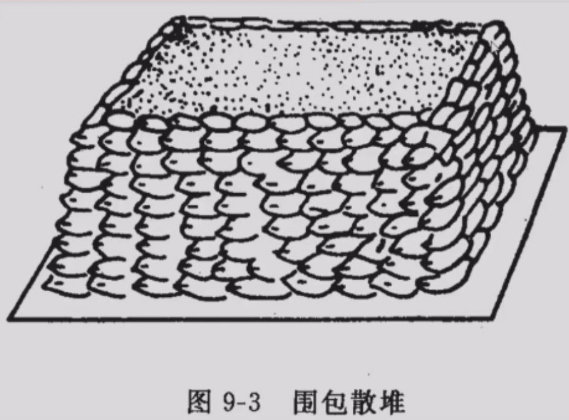

2. 袋装堆放

   - 堆垛的方法应与库房的门窗相平行，这样便于管理，打开门窗时，有利空气流通
   - 堆装时**袋口要朝里**，以免感染虫害和防止**散口倒堆**（失去支撑）
   - 一般包装种子，底部有垫仓板，离地约20厘米，利于通气
   - 骑缝，防塌包
   - 堆垛时应距离墙壁0.5m，垛与垛之间相距1m留作操作道
   - 含水量高，垛宽狭
   - **根据袋子规格灵活变通**

   （1）非字形及半非字形堆垛法

   - 按照非字或半非字排列堆成
   - 非字：第一层中间并列各直放两包，左右两侧各横放三包，形如非字。第二层则用中间两排与两边换位，第三层堆法与第一层相同
   - 半非字减半（五包法），袋是60*90

   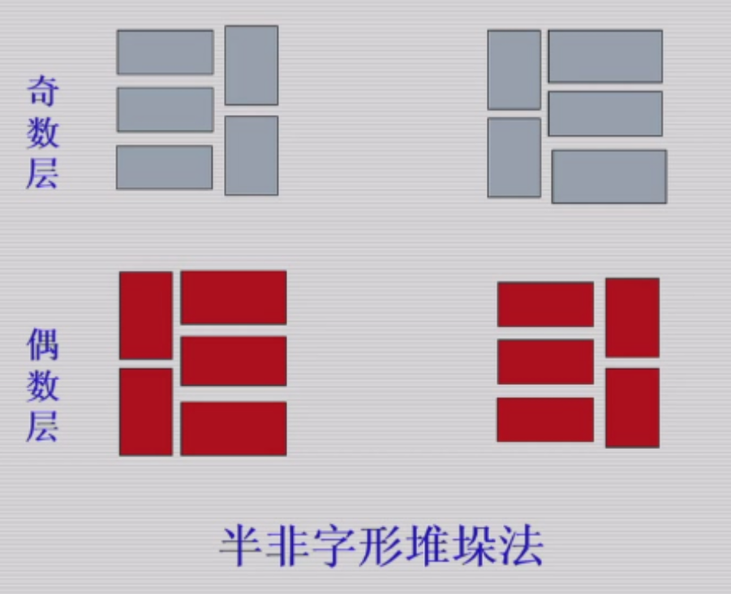

   （2）六包法堆垛

   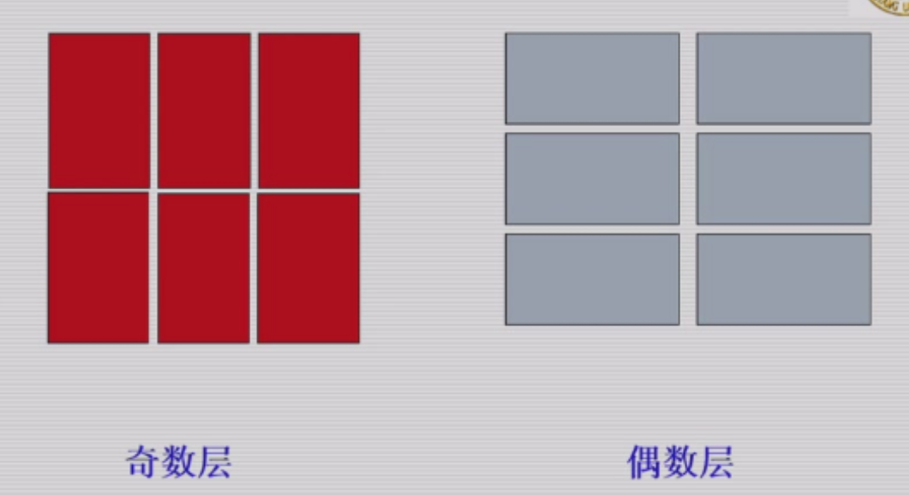

   （3）七包法堆垛

   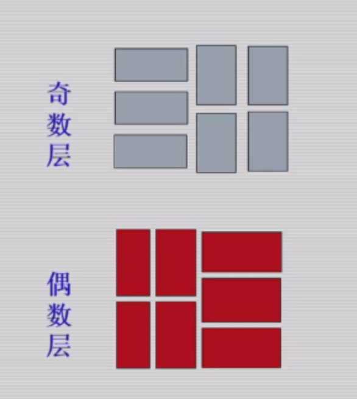

   

### 三、种子贮藏期间的变化和管理

#### （一）种子温度和水分的变化

1. 三温三湿：大气温度湿度，仓内温度湿度和种堆温度湿度（水分）

   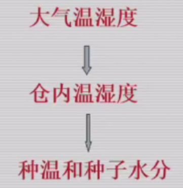

2. 温度的变化：种温升降的速度一般要比气温慢半个月至一个月
   - **小型种子堆、包装堆放、大粒种子及仓房密闭性能差的**，种温随气温变化较快，各层次间的温差幅度也较小，基本上随气温在同一幅度内升降
   - 冬下层温度高，夏上层温度高
3. 水分的变化
   - 受大气RH影响
   - 实践表明：表面层和接触地面的种子易受大气温湿度的影响，水分增多时会发生结露，甚至发芽、发热、霉烂现象。
   - 种子结露现象多发生在每年4月、11月份的前后
4. 种堆内冷热空气对流——水分分层
   - 热空气携带水汽上升，至表面遇冷空气，上层种子吸湿，水分含量增加，产生水分分层
   - 常发生于秋冬
   - 产生结顶
   - 进入秋冬季节，经常翻动种堆的表面层，使种堆内部水分向外散发，可以降低种子的水分，防止结露、结顶
5. 种堆内的水分热扩散
   - 湿热扩散
   - 种堆水分按照热传递的方向而移动的现象，称为水分热扩散现象，也就是**种堆内水汽总是从温暖部位向冷凉部位移动的现象**
   - 因为种温高部位空气中实际含水汽量大，水汽压力大，而低温部位的水汽压力小
   - 局部水分增高常常发生在阴凉的墙边、墙角、种堆的底部等部位

#### （二）种子的结露和预防

种子结露以后，含水量急剧增加，种子生理活动随之增强，导致发芽、发热、虫害、霉变等情况发生

1. 原因和部位

   - **种子结露：空气中的水汽量达到饱和状态后，在种子上凝结成水。**
   - 露点温度（露点）：**开始出现结露的温度。水分含量一定的空气，当它达到饱和状态时（相对湿度100%）所对应的温度。**
   - 物理现象，四季均可发生。只要存在温差，并达到露点。
   - 空气湿度越大，越容易；种子水分越高，结露温差越小
   - **结露部位**：区分原因
     - 表面结露：开春后，外界气温上升，空气比较潮湿，**湿热空气进入仓内首先接触种子堆表面**，引起种子表面层结露
     - 上层结露：秋冬季节转换，气温下降降影响上层种子的温度。而中、下层种子温度仍较高，**热空气上升，遇到上层冷种子，二者造成温差引起上层结露**
     - 地坪结露（下层结露）：经过曝晒的**种子未经冷却**，直接堆放在地坪上，造成地坪湿度增大，引起地坪结露。
     - 垂直结露：发生在靠近内墙壁和柱子周围的种子，成垂直形。传热快慢，温差
     - 种子堆内结露：一般不发生。温度高发热点；不同温度种子堆放一起，温差，夹层结露
     - 冷藏种子结露：经过冷藏的种子温度较低，遇到外界热空气也会发生结露
     - 复盖薄膜结露：应用塑料薄膜进行密封贮藏，在有温差存在易凝结水珠。结露发生在薄膜温度高的一面。

2. 种子结露的预测

   - 预测露点温度就可以预测结露的发生（计算）
     - 应用种堆露点近似值检查表
     
       - 种子水分和种温交叉
       - 种温降至露点
     
       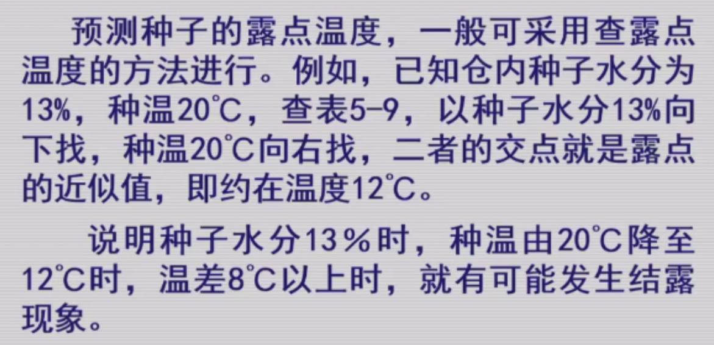
     
     - 应用空气饱和湿度表
     
       - 在一定温度下，空气的饱和湿度是个常数，当空气中实有水汽达到饱和时便能发生结露。
       - 根据温度查饱和水汽量
       - 根据相对湿度，计算实有水汽量
       - 根据表格查实有水汽量为饱和水汽量时的温度
     
       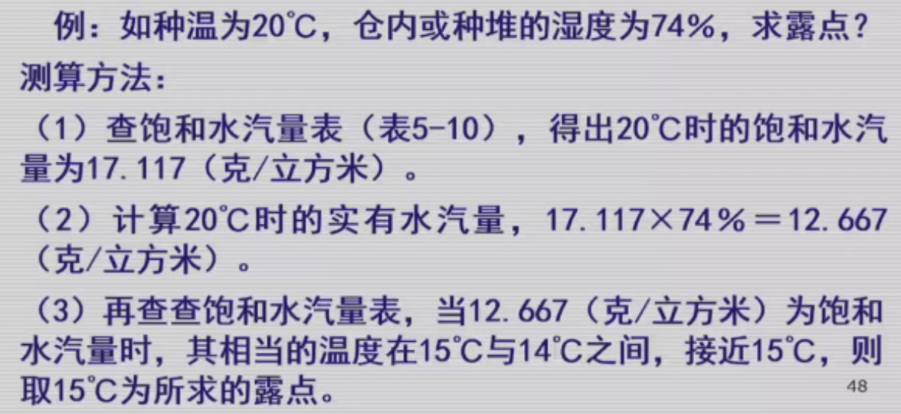

3. 种子结露的预防

   - 保持种子干燥：使结露温差增大
   - 密闭门窗保温：隔绝外界湿热空气
   - 表面覆盖移湿：防表面结露

   - 翻动面层散热：防上层结露
   - 种子冷却入库：防地坪结露
   - 围包柱子
   - 通风降温排湿：防上层结露
   - 仓内空间增温：防上层结露
   - 冷藏种子增温：逐步增温，过渡间

4. 种子结露的处理

   降低种子水分
   
   倒仓曝晒，烘干或机械通风

#### （三）种子发热

1. 判断

   定义：在正常情况下，种温随着气温、仓温的升降而变化。**如果种温不符合这种变化规律，发生异常高温时，这种现象称为发热。**

   - 种温与记录比较
   - 各检查点比较
   - 种温与仓温比较
   - 早年数据

2. 原因：**种子呼吸，微生物，**仓虫，种子堆放不合理、管理不当

3. 发热类型

   （1）上层发热

   - 初春气温逐渐上升，而经过冬季的种子层温度较低，两者相遇，**上表层种子容易造成结露**而引起发热
   - 秋季，对流，上层种子水分增加，发热

   （2）下层发热

   - 种子未冷却，地坪结露；地面渗水
   - 开春，对流，下层种子水分增加，发热

   （3）垂直发热

   - 仓壁、柱子，结露

   （4）局部发热

   - 不固定，一窝一窝
   - 种子品质不一致。仓虫大量繁殖

   （5）整仓发热

   - 以上不及时处理，发展形成。特别是下层发热

   **包装种子的发热发生在每包的中心，如是堆包，则向下向上延伸。**

4. 预防

   （1）严格掌握种子入库质量：清选干燥分级，冷却

   （2）做好清仓消毒，改善仓贮条件

   （3）加强管理，勤于检查

   **采用翻耙、开沟、扒塘等措施排除热量，必要时进行翻仓、摊晾和过风等办法降温散湿**

   发过热种子评估

#### （四）种子贮藏管理制度与方法

1. 管理制度

   **五无种子仓库：无虫、无霉变、无鼠雀、无事故、无混杂**

2. 管理工作
   - 防止混杂
   - 隔热防湿，合理通风
   - 治虫防霉
   - 防鼠雀
   - 防事故
   - 检查工作：查蛾看漏寻鼠雀，测温过筛再记录

3. 合理通风：降低温度和水分，气体对流，温度均衡性，通风散热

   自然通风法和机械通风法

4. 种子的检查
   - 种温
   - 水分：取决于种温
   - 仓库害虫

5. 鼠、雀、霉检查

#### （五）种子耐藏性的预测

种子耐藏性的预测是根据高活力的种子能提高耐藏性这一原理进行的。**一般用加速老化方法**。

### 四、低温低湿种子仓库及其管理

**低温低湿仓库采用机械降温的方法使库内温度保持在15℃以下，相对湿度控制在65%左右**

#### （一）种子低温库的基本要求

1. 隔热保冷
2. 隔湿防潮
3. 结构严密

仓壁：承重墙和隔热层（稻壳、膨胀珍珠岩、空心砖软木和泡沫塑料）

