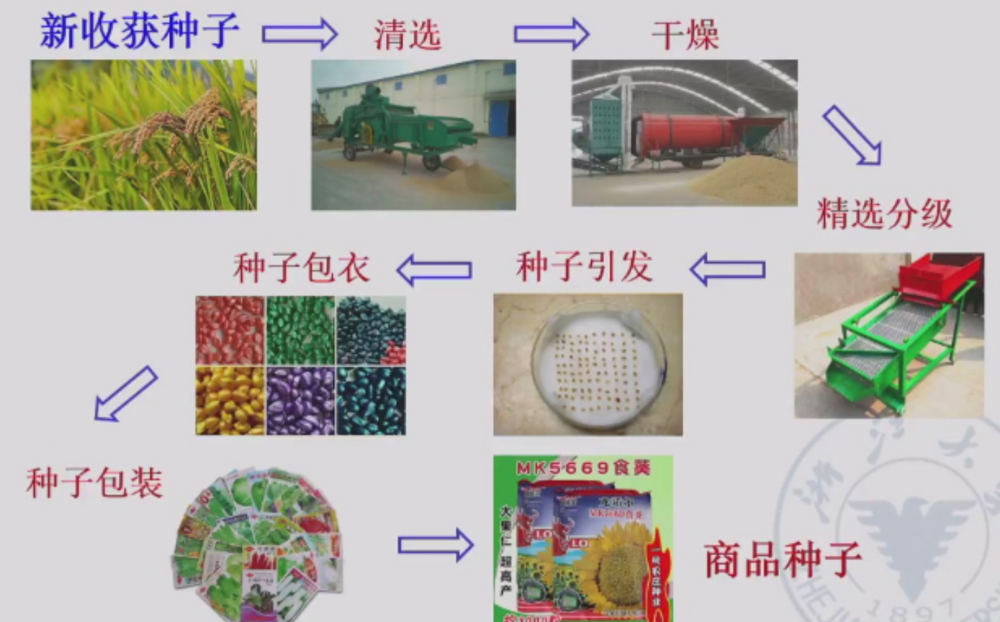
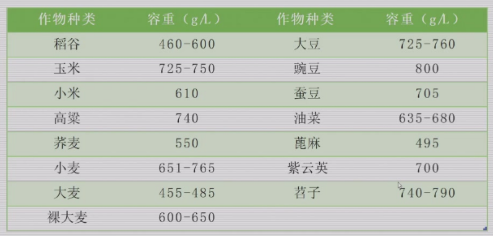

# 种子贮藏加工学

## 绪论

种子的商品特性：季节性……

按种子贮藏特性不同分为正常型种子、顽拗型种子（**不耐低温贮藏、不耐脱水干燥**）、中间型种子

### 一、种子加工的含义

从收获到播种前对种子所采取的各种处理，以达到**提高种子质量和商品特性**，保证种子的安全贮藏，促进田间成苗及提高产量的目的。

### 二、种子加工的内容

### 三、种子贮藏的含义

科学依据种子贮藏过程中种子生命活动的规律，采取合理的贮藏设施，人为地控制贮藏条件，将种子质量的变化降低到最低限度。

### 四、种子贮藏研究的内容

### 五、种子加工在农业生产上的意义

1. 提高农作物单位面积产量最经济、最有效的增产措施
   - 出苗整齐、苗多苗壮、分蘖多、成穗多
2. 可减少播种量，节约粮食
3. 可提供不同级别的商品种子，有效防止种子经营中伪劣种子的流通

### 六、种子贮藏的作用

1. 种子产业化体系的重要环节
2. 为农业生产提供优质良种
3. 为种子经营提供物质保证
4. ……

### 七、种子贮藏加工与其他学科的关系

### 八、我国种子加工与贮藏的历史

**汉朝的《汜胜之书》：**
“麦种候熟可获，择穗大疆者，斩、束、立场中之高燥处，曝使极燥”。——留株后熟，快速降低种子水分
“取干艾杂藏之，麦一石，艾一把，藏以瓦器竹器”。——驱虫防虫
溲种篇：种子裹上粪肥以作种肥。——种子包衣、丸化

**北魏的贾思勰《齐民要术》：**
“窖麦法，必须日曝令干，及热埋之”。——小麦热进仓
“栗，初熟，出壳，即于屋里埋著湿土中。埋必须深，勿令冻澈”。——顽拗型种子

### 九、种子加工与贮藏的发展

## 第一章 种子贮藏原理

### 一、种子呼吸

种子无时无刻不在呼吸，了解种子呼吸及其影响因素，控制呼吸作用，做好种子贮藏工作。

#### （一）概念

1. 呼吸作用：种子内活的组织在酶和氧的参与下将本身的贮藏物质进行一系列的氧化还原反应，最后放出二氧化碳和水，同时释放能量的过程。
2. 呼吸强度：指一定时间内，单位重量种子放出的二氧化碳量或吸收的氧气量。它是表示种子呼吸强弱的指标。
3. 呼吸作用部位：**胚部为主，其次是糊粉层**。果种皮和胚乳经干燥后是死亡的，但果种皮和通气性有关，有影响。

#### （二）性质

1. 有氧呼吸

2. 无氧呼吸

   在缺氧条件下，细胞把种子贮存的某些有机物分解成为不彻底的氧化产物，同时释放能量的过程。

   一般无氧呼吸产生酒精（乙醇），但**马铃薯块茎、甜菜块根、胡萝卜和玉米胚进行无氧呼吸时，则产生乳酸。**

3. 最佳贮藏：种子干燥、果皮紧密、完整饱满；环境干燥低温、密闭缺氧

4. 有氧呼吸和无氧呼吸共存

水分含量低，密闭贮藏；水分含量高，通风贮藏。

水分含量低，密闭贮藏，缺氧，无氧呼吸也非常弱，不影响种子生活力。

#### （三）影响因素

1. 水分
   - 呼吸强度随着种子水分的提高而增强
   - 临界水分（游离水出现时种子的含水量）：**禾本科作物13.5%；油料种子8%-8.5%（60%*13.5%）**
   - 安全贮藏水分：冬春14-15%；夏秋12-13%（禾谷类）
2. 温度
   - 在一定范围内，种子的呼吸作用随温度的升高而加强
   - 0-55℃逐渐增强；超过55℃，急剧下降
3. 通气
   - 通气条件下的呼吸强度均大于密闭贮藏
   - 高水分种子，无氧呼吸，毒害。尤其是呼吸强度大的油料作物种子，注意通风
   - **水分不超过临界水分**，呼吸作用非常微弱，对氧气的消耗很慢，**在密闭条件下贮藏有利于保持种子生活力**
   - 在密闭条件下，种子发芽率随其水分提高而逐渐下降
4. 种子本身状态
   - 成熟度：未成熟＞成熟
   - 完整性：破损＞完整
   - 新陈度：新＞陈
   - 健康状况：感染病虫＞正常
   - 受潮受冻：受潮后再干燥>未受潮；受冻>未受冻
   - 籽粒大小和种胚比率
5. 化学物质：熏蒸剂
6. 仓虫和微生物
   - 热量和水分—呼吸强度增高
   - 种子堆总呼吸（种子、仓虫、微生物）
   - 自动驱除

#### （四）呼吸与种子贮藏的关系

1. 有利方面：促进种子后熟，自然缺氧贮藏
2. 不利方面
   - 消耗大量贮藏干物质
   - 释放热量和水分，易造成种堆发热霉变
   - 缺氧呼吸产生有毒物质
   - 水汽和热量使仓虫和微生物活动加强
   
   **在种子贮藏期间必须尽可能地降低种子的呼吸强度，使种子处在极微弱的生命活动中，有效保持生活力和活力。**

### 二、种子的后熟作用

#### （一）种子的后熟

1. 概念
   - 种子成熟包括形态和生理上的成熟
   - 后熟：形态成熟到生理成熟的过程

2. 休眠和后熟的关系

   - （生理）休眠：有生活力的种子给予适宜条件也不发芽

   - 后熟是休眠的一种状态，或是引起休眠的一种原因
   - 未通过后熟作用：发芽率低，出苗不整齐，影响成苗率

3. 种子后熟期长短
   - 不同作物种子后熟期长短有差异
   - 麦类较长。冬小麦长于半冬性小麦，春性小麦最短
   - 水稻玉米较短。粳稻有，籼稻基本无，杂交稻易“穗萌”。

4. 促进种子后熟的意义
   - 提高种子质量
   - 提早收获，后作提前播种。留株后熟
   - 判断是否完成：标准发芽试验，发芽力（发芽势和发芽率）

#### （二）后熟与种子贮藏的关系

1. 有利影响

   后熟期种子抗逆力强，对生活力的损害较轻——小麦热进仓

   - 小麦热进仓：利用未通过后熟的小麦种子抗热性较强的特点，采用高温曝晒种子后趁热进仓，高温杀仓虫
     - 适用于新收获小麦，后熟期休眠，耐热性强
     - 不适用于通过后熟期的小麦
     - 不适用于含水量高于13%的种子

2. 不利影响

   （1）引起种子出汗

   - **新入库的农作物种子由于后熟作用尚在进行中，细胞内部的代谢作用仍然比较旺盛，其结果使种子水分逐渐增多，一部分蒸发成为水气，充满种子堆的间隙，一旦达到过饱和状态，水气就凝结成微小水滴，附在种子颗粒表面**

   - 出汗（生理作用，入库前期，全部种子）和结露（物理现象，温差造成，全年，局部）

   （2）造成仓内不稳定：种子堆内湿度增大，液态水吸附，水分再分配，局部种子呼吸作用加强，种子回潮发热，微生物，霉变腐烂。

## 第二章 种子的物理特性

根据单粒种子测定，均值：大小、硬度和透明度

种子群体测定：种子重量（千粒重、百粒重）、容重、相对密度、密度与孔隙度、散落性、导热性及吸附性等

清选分级、干燥、运输、贮藏，指导意义

### 一、种子的容重和相对密度（比重）

#### （一）容重

1. 定义：单位容积内种子的绝对重量，单位为“克/升”

2. 影响因素：颗粒大小、形状、整齐度、内部组织结构、化学成分、混杂物
   - 含水量高，容重小（孔隙)
   - **颗粒细小、不齐、圆滑、充实、水分及油分含量低、淀粉和蛋白含量高、混有沉重杂质，容重大**
   - 与饱满种子不同，瘦小皱瘪的种子，水分高，容重增大

3. 常见作物种子的容重

   

4. 应用：推算一定容量内的种子数量，或一定重量的种子所需的仓容和运输所需车厢数

   计算公式：
   $$
   体积（m^3）=\frac{重量（kg）}{容重（g/L）}
   $$

#### （二）相对密度（比重）

1. 定义：种子绝对重量和绝对体积之比，单位为“克/毫升”

2. 影响因素：种子光滑无附属物、组织结构致密、脂肪含量低的大
   - 大多数种子，成熟越充分，越充实，相对密度越大
   - 油料作物种子，成熟饱满，相对密度小（油脂多）

3. 意义：衡量种子品质，作为种子成熟度的间接指标，劣变程度

4. 应用：长期贮藏下降；利用相对密度清选分级（比重机）；计算种子密度

   计算公式：
   $$
   种子比重=\frac{种子重量（g）}{种子体积（mL）}
   $$

### 二、种子密度和孔隙度

1. 定义

   - 种子密度：一定容量容器中种子实际种子与容器的容积之比，百分率表示

   - 种子孔隙度：容器内种子间隙的体积与容器的容积之比，百分率表示

   - 两者和为100%

2. 影响因素：

   - 种子颗粒大小均匀度

   - 种子形状

   - 种皮松紧程度

   - 是否带稃壳或附属物

   - 化学成分
   - 种子水分
   - 入仓条件及堆积厚度

3. 计算公式：千粒重和千粒实际体积
   $$
   种子密度=\frac{绝对体积×容重}{绝对重量}×100\%
   $$

   $$
   种子密度=\frac{种子容重（kg/100L）}{种子比重}×100\%
   $$

   $$
   种子密度=\frac{种子容重（g/L）}{种子比重×10}×100\%
   $$

   $$
   孔隙度=100\%-密度
   $$

4. 一般带有稃壳和果皮的种子，其密度都比较小，而孔隙度相应比较大。比重大，容重往往相应增大，密度也随之提高

5. 种子孔隙度大小与种子贮藏的关系

   - 空气流通状况：熏蒸，热量水汽散发

   - 用于计算种子堆中氧气的贮存量，密闭状态下绝氧所需时间

   

### 三、种子的散落性和自动分级

#### （一）种子的散落性

1. 定义：种子群体具有一定程度的流动性。当种子从高处落下或向低处移动时，形成一股流水状，种子流，种子所具有的这种特性。

2. 衡量指标：

   - 静止角（自然倾斜角）：自然落下，形成圆锥体，斜面与底部直径所成之角。
     - 散落性越差，静止角越大
   - 自流角：平面，斜面，种子在斜面上开始滚动时的角度和绝大多数种子滚落时的角度即为种子的自流角。

3. 影响因素

   - 形状大小

   - 夹杂物

   - 种子水分
     - 种子的水分含量越高，散落性相应减小，静止角越大

   - 收货后的处理方法

   - 贮藏条件

   凡种子颗粒比较大，形状近球形而表面光滑，散落性好。夹杂物、损伤，降低。

4. 与贮藏加工关系

   （1）估测种堆对仓壁的侧压力
   $$
   P=\frac{1}{2}mgh^2tan^2(45°-\frac{α}{2})
   $$
   P：侧压力（N/m）；m：容重；g取9.8；h：种子堆高度；α为种子静止角

   （2）清选、分离（书上都写静止角，自流角更合适）

   - 使用带式输送机输送种子，皮带倾角要小于输送种子的自流角，避免种子反流
   - 使用溜筛和自溜管，筛面倾角和溜管倾角要大于种子自流角才能正常作业。

   （3）贮藏

   - 入库初期，检查散落性变化
   - 有下降，可能回潮、结露、出汗以至发热霉变

#### （二）种子的自动分级

1. 定义：当种子堆在移动时，其中各个组成部分都受到外界环境条件和本身物理特性的综合作用而发生**重新分配**现象，即性质相近似的组成部分，趋向聚集于相同部位，而**失去它们在整个种子堆里原来的均匀性**，在品质上和成分上增加了差异程度
2. 原因：种子堆的各个组成部分间散落性存在差异
   - 严重的自动分级现象往往发生在机械化大型仓库中，种子数量多，移动距离大，落点比较高，散落速度快
3. 预防：进仓前清选，除杂，淘汰不饱满或不完整种子；入库金属锥形器；出库锥形罩
4. 应用：清选工具和方法的原理；提高清选分级工作效率；形成杂质集中分布区

### 四、种子的导热性和比热容（热容量）

#### （一）种子的导热性

导热性：种子堆传递热量的性能或能力

种子具有一定的导热性能。种子堆是热的不良导体

1. 传递方式

   - 直接接触，热传导传热
   - 气体流动，对流传热

2. 导热性差的作用

   - 贮藏期间：保持比较长期的低温状态，对安全贮藏有利
   - 种子温度较高：种子不能迅速冷却，长期处于高温条件下，不利

3. 导热率和导热系数

   （1）导热率：指单位时间内通过单位面积静止种子堆的热量。

   （2）影响因素：各层温差；种子特性；水分高低；堆装所受压力

   （3）导热系数：1m厚的种子堆，当表层和底层的温差相差1℃时，在每小时内通过该种子堆每平方米表层面积的热量，其单位为kJ/(h·m·℃)

4. 与贮藏加工关系

   （1）种子堆冷却或加温时，扩大种堆表面积，使升降温加快

   （2）增加种堆厚度，使越冬后种子升温慢，保持低温，利于安全越夏

   （3）导热性、导温性强的种子干燥快，干燥周期短

   （4）入库种子需充分干燥，减少外界温度的影响

   种子水分越高，热的传导越快

#### （二）热容量

Q=cm△t

1. 估测种子在贮藏期间的放热量

2. 估算人工干燥时所需的燃料量
   - 刚收获种子水分高，热容量大，先预干

### 五、种子的吸附性和吸湿性

#### （一）种子的吸附性

1. 概念
   - 吸附性：种子胶体具有多孔性的毛细管结构，在种子的表面和毛细管的内壁可以吸附其它物质的气体分子
   - 解吸作用：被吸附的气体分子亦可能从种子表面或毛细管内部释放出来而散发到周围空气中去

2. 形式：吸附（表面）、吸收（毛细管内部）、毛细管凝结（饱和，凝结）、化学吸附

3. 影响因素：形态结构，吸附面大小（比表面积，胚大，露出多），气体浓度（一定范围）、化学性质（易凝结，活泼），温度（温度下降有利于吸附）

#### （二）吸湿性

1. 概念：种子对于水汽的吸附和解吸的性能，是吸附性的一种具体表现。
2. 自由水、束缚水、化合水，临界水、安全水分
3. 影响因素：种子的化学组成和细胞结构。亲水胶体
4. 吸附滞后效应
   - 在相同的温度和相对湿度条件下，同一种种子吸湿增加水分和解吸降低水分下的平衡水分不同。
   - **种子吸湿达到平衡的水分始终低于解吸达到平衡的水分**
   - 避免吸湿回潮，吸湿后解吸永远大于吸湿前

#### （三）平衡水分

1. 概念：在固定的温度条件下，在一定的相对湿度中种子吸附水汽分子和解吸水汽分子达到平衡时的种子含水量，称为该条件下该种子的平衡水分。

安全水分：

判断解吸还是吸湿。**安全贮藏湿度65%**

## 第三章 种子清选原理和技术

### 一、目的和意义

#### （一）清选和精选

1. 清选：清除混入种子的掺杂物，提高种子的纯净度，并为种子安全干燥、包装和贮藏做好准备。
2. 精选：剔除种子中质量低劣的种子，即不饱满的、虫蛀或劣变的种子。

#### （二）原则

清除杂质，提高种子质量。合适、彻底、有效、经济

### 二、种子尺寸特性分选原理与技术

#### （一）利用种子尺寸特性进行分选

1. 种子的性状和大小
   
   长度（l）、宽度（b）和厚度（a）
   
   - l>b>a，为扁长形种子。如水稻、小麦、大麦等种子。
   - 1>b=a，为圆柱形种子。如小豆等种子。
   - l=b> a，为扁圆形种子。如野豌豆等种子。
   - l=b=a，为球形种子。如豌豆种子等。
2. 种子筛的种类和筛孔形状
   
   （1）种子筛的种类
   - 冲孔筛
     - 镀锌板上冲出
     - **适于清理大型杂质及种粒分级**
     - 具有坚固、耐磨、不变形的特点，但有效筛理面积较小
   - 编织筛
     - 钢丝编织，方、长方、菱形
     - **适于清理细小杂质**
     - 坚固性差，有效筛理面积大
   - 鱼鳞筛
     - 薄镀锌板
     - 联合收割机清种室上筛
     - 可调，使用方便，但净度不高
   
   （2）筛孔形状
   - 长孔筛
   - 圆孔筛
   - 三角形孔筛
   - 金属丝网筛
3. 不同形状筛孔的分选原理和分选用途
   - 圆孔筛：宽度
   - 长孔筛：厚度
   - 窝眼筒和窝眼盘：长度
   - 平面筛
   - 圆筒筛
4. 选用原则
   - 尺寸选择
     - 底筛
   - 筛孔的布置
5. 正确选用筛孔的技术
   - 分布曲线的制作
   - 复合图的制作
6. 影响筛选质量的主要因素

#### （二）形状和孔洞

### 三、种子力学特性分离原理与技术

#### （一）空气动力学特性和分选方法

1. 空气动力学特性

   - 根据种子和杂物对气流产生的阻力大小进行分选

2. 分选方法

   - 垂直气流分选
   - 平行气流分选

3. 空气筛

   基本清选机

#### （二）比重分选方法

1. 比重分选

   根据种子密度或比重的差异进行分选

2. 种子密度差异进行液体分离

#### （三）表面特性分选方法

1. 种子的表面特性
2. 分选机具和方法

#### （四）种子的弹性特性分选方法

螺旋分离机

### 四、种子光电特性分选原理与技术

#### （一）种子色泽

#### （二）种子负电性分选方法

### 五、种子清选的主要机械设备和操作技术

#### （一）风筛清选机

预清机、基本清选机、复式清选机

区别掌握

#### （二）窝眼筒清选机

长杂、短杂

#### （三）重力式清选机

尺寸、形状和表面特征上与好种子非常接近的不良种子

#### （四）圆筒筛分级机

## 第四章 种子干燥原理和方法

### 一、种子干燥目的和意义

### 二、种子干燥的原理和影响因素

#### （一）干燥原理

1. 干燥原理：种子是活的有机体，也是一团凝胶，对水分具有吸附与解吸的特性。当外界水汽压小于种子内部水汽压时，种子失水得到干燥。
2. 种子干燥介质
3. 过程：扩散（湿扩散、热扩散）和蒸发

#### （二）种子干燥特性曲线和干燥阶段

1. 干燥特性曲线
2. 干燥速度曲线：种子干燥速度与种子含水率之间的关系曲线、
3. 种子干燥阶段：预热，恒速干燥阶段，降速干燥阶段
4. 干燥曲线的应用

#### （三）种子干燥的影响因素

1. 外部因素：干燥介质、温度、湿度、气流速度、与种子的接触情况
2. 内部因素：种子生理状态、种子化学成分、

### 三、种子干燥的方法

#### （一）自然干燥

晒干和晾干

#### （二）通风干燥

#### （三）加热干燥

主要方法

#### （四）红外线辐射干燥

#### （五）干燥剂干燥

少量种子或种质资源

#### （六）冷冻干燥

超干贮藏；降低干燥损伤；增加耐藏性

#### （七）其他干燥方法

### 四、种子加热干燥机械

堆放分批式干燥设备和连续流动式干燥设备

#### （一）堆放分批式干燥设备

斜床堆放式干燥设备

#### （二）连续流动式干燥设备

顺流式、对流式、错流式

#### （三）种子加热干燥操作技术

1. 干燥时间
2. 干燥前准备
3. 干燥的温度：含水量高则干燥的温度要低些，含水量低干燥温度高

种子干物质衡算及水分蒸发量计算
$$
G_1×\frac{100-M_1}{100}=G_2×\frac{100-M_2}{100}
$$

## 第五章 种子处理和包装

### 一、种子处理的目的和意义

#### （一）历史

#### （二）目的和意义

1. 目的
   - 提高种子活力
   - 刺激种子萌发和促进幼苗生长
   - 防病虫害
   - 防老化劣变
2. 意义
   - 节约用种量和方便播种
   - 增强商品种子的市场竞争力

### 二、普通种子处理技术

物理因素、化学因素

#### （一）物理因素处理

1. 温汤浸种
2. 低温层积
3. 射线处理
4. 电插锁

#### （二）化学因素处理

1.  肥料浸拌种
2. 药剂处理
3. 植物生长调节剂处理
4. 微量元素处理

### 三、种子引发

#### （一）概念

控制种子缓慢吸收水分使其停留在吸胀的第二阶段，让种子进行预发芽的生理生化代谢和修复作用，促进细胞膜、细胞器、DNA的修复和酶的活化，处于准备发芽的代谢状态，但防止胚根的伸出

#### （二）种子引发的机理

DNA和细胞膜修复启动

复制活动增强

表观遗传调控

激素平衡调控

水孔蛋白合成

信号转导激活

#### （三）效应

提高发芽和出苗的速度和一致性

提高逆境下的出苗

#### （四）种子引发的方法

1. 渗透引发
   - 水引发
   - PEG引发
     - PEG600易被吸收；多用PEG6000
   - 盐引发
2. 滚筒引发
3. 起泡柱引发
4. 搅拌型生物反应器引发
5. 固体基质引发
6. 水合引发+辅助因子
   - 植物激素引发
   - 营养因子引发
   - 生物引发
   - 纳米材料引发

#### （五）种子引发存在的问题

引发时间过长导致种子萌动

种子水分感受器

### 四、种子包衣原理和技术

#### （一）种子包衣的含义

1. 种子包衣：采用种子加工机械，将非种子材料，包裹在种子外
2. 与传统药剂处理相比，特点：成膜特性，多功能制剂，水分一般不增加

#### （二）种子包衣的作用

1. 控制病害
2. 出苗和成苗
3. 减少环境污染
4. 防止假劣种子流通
5. 利于机械播种和精量播种
6. 提高质量、抗逆能力
7. 防鸟取食
8. 控制杂草生长
9. 提供营养，可早播

#### （三）方法分类

材料不同及形成大小

1. 种子包膜技术：将种衣剂包裹在种子外面，形成一层薄膜。适用大粒和中粒种子
2. 种子丸化技术：球形单粒种子单位
   - 丸化工艺：成核期、丸粒增大期、滚圆期、筛选回锅期、撞光染色期、风干期

### 五、种子包装材料和

#### （一）意义和要求

1. 意义
2. 要求

#### （二）包装材料的种类和特性及选择

1. 种类和性质
   - 麻袋、蛇皮袋
   - 纸袋
   - 纸板盒和1纸板罐
   - 聚乙烯和聚氯乙烯等多孔型塑料
   - 聚乙烯铝箔复合袋
   - 金属罐
2. 包装材料和容器的选择

#### （三）包装标签

#### （四）种子包装办法和包装机械

定量包装、定粒包装

种子标签二维码

## 第六章 种子仓库害虫及防治

### 一、

#### （一）仓库害虫及其危害性

仓库害虫的取食习性：初期性、后期性、中间性

为害方式：蛀空式、剥皮式、破坏式

种子数量、种子生活力、营养价值下降，种堆温湿度提高

虫情检查：直接检查法、间接检查法

#### （二）防治

安全、经济、有效

预防为主，综合防治

防治方法：农业防治、检疫防治、清洁卫生防治、化学防治、生物防治、物理防治

高低温杀虫法：热昏迷状态、冷昏迷状态

磷化铝熏蒸杀虫法：磷化铝、氨基甲酸铵、石蜡。产生磷化氢

### 二、种子微生物及其控制

#### （一）区系

青霉和曲霉

#### （二）贮藏种子主要的微生物种类

青霉：低温下

曲霉：耐低湿

#### （三）对种子活力的影响

#### （四）种子的霉变

初期变质阶段

中期生霉阶段

后期霉烂阶段

#### （五）影响因子

水分

温度

氧气

日光

#### （六）微生物控制

提高种子质量，五个分开

干燥防霉：相对湿度60%以下

低温防霉：低温库<10℃

气调防霉

### 三、鼠类及其防治

## 第八章 种子仓库及其管理

### 一、种子仓库及其设备

#### （一）建仓标准

牢固

隔热防潮

密闭与通风

……

#### （二）仓库的保养

#### （三）仓库类型

房式仓、机械化圆筒仓、低温仓库、土圆仓、简易仓

### 二、种子的入库工作

#### （一）种子入库前的准备

1. 仓库的准备：全面检查，清仓
2. 种子的准备：
   - 种子的干燥、清选
   - 入库标准

#### （二）种子的入库对方

### 三、种子贮藏期间的变化和管理

#### （一）种子温度和水分的变化

三温三湿

种子结露现象多发生在每年4月、11月份的前后

结顶

#### （二）种子的结露和预防

1. 原因和部位

   - 结露：空气中的水汽量达到饱和状态后，
   - 露点温度
   - 种子水分越高，结露温差越小
   - 结露部位：区分原因
     - 表面结露：开春后
     - 上层结露：秋冬季节转换
     - 地坪结露：种子未经冷却
     - 垂直结露
     - 种子堆内结露
     - 冷藏种子结露
     - 复盖

2. 种子结露的预测

   - 预测露点温度就可以预测结露的发生（计算）
     - 应用种堆露点近似值检查表
     - 应用空气饱和湿度表

3. 种子结露的预防

   - 保持种子干燥
   - 密闭门窗保温
   - 表面覆盖移湿

   - 翻动面层散热
   - 种子冷却入库
   - 围包柱子
   - 通风降温排湿
   - 仓内空间增温
   - 冷藏种子增温

4. 种子结露的处理

   降低种子水分

#### （三）种子发热

1. 判断
   - 种温与记录比较
   - 各检查点比较
   - 种温与仓温比较
   - 早年数据
2. 原因：种子呼吸，微生物，仓虫，……
3. 发热类型
   - 上层发热
   - 下层发热
   - 垂直发热
   - 局部发热
   - 整仓发热
4. 预防

#### （四）种子贮藏管理制度与方法

1. 管理制度
2. 管理工作
   - 防止混杂
   - 隔热防湿，合理通风
   - 治虫防霉
   - 防鼠雀
   - 防事故
   - 检查工作
3. 合理通风
4. 种子的检查
   - 种温
   - 水分
   - 仓库害虫

#### （五）种子耐藏性的预测

加速老化方法

### 四、低温低湿种子仓库及其管理

#### （一）种子低温库的基本要求

