# 细胞生物学及实验

## 第一章 概述

### 一、什么是细胞生物学

细胞学到细胞生物学

从描述形态、结构、性状、生活史等到阐明行为、功能、反应

### 二、技术进步促进细胞生物学建立和发展

细胞形态结构观察

细胞及组分分离、分选、分析

细胞培养

细胞生理、生化、分子等功能研究

### 三、细胞生物学研究内容

细胞结构与功能的统一

细胞生命活动基本规律和调控机制

真核细胞细胞间相互作用（社会性）

模式生物

大肠杆菌、酵母、拟南芥

### 四、细胞生物学的发展

#### （一）细胞的发现

#### （二）细胞学说

#### （三）经典细胞学、实验细胞学

#### （四）现代细胞生物学

### 五、怎样研究细胞——细胞生物学技术

#### （一）显微技术

分辨率：0.61λ/(n*sinθ)

#### （二）离心技术

差速离心

密度梯度离心

#### （三）细胞培养技术

无菌操作

原代和继代培养

冻存和复苏技术

#### （四）功能分析技术（分子、细胞、个体水平）

放射自显影、非放射性自显影

蛋白质相互作用：酵母双杂交……

膜片钳

免疫荧光

Gene knock-out

基因敲减knock down

RNA干扰

Gene editing

## 提问

1. 研究内容（三句话）
2. 显微镜分辨率，影响因素

## 第二章 细胞

### 一、什么是细胞

#### 细胞是生命活动的基本单位

生命活动以水环境为基础，主要表现为新陈代谢、自我繁殖

1. 结构的基本单位
2. 功能的基本单位
   - 个体的生、老、病、死
   - 细胞的增殖、分化、衰老、死亡

### 二、细胞的成分

#### （一）原子

生命：H、C、O

地壳：O、Si、

#### （二）细胞的无机成分

1. 水
2. 无机离子

#### （三）有机分子

1. 糖
2. 脂肪酸
3. 氨基酸
4. 核苷酸

### 三、细胞的特点和多样性

#### （一）细胞的基本结构

1. 细胞膜
2. DNA or RNA
3. 核糖体和酶

#### （二）支原体是最小和最简单的细胞

#### （三）细胞的多样性

原核细胞

真核细胞

古细菌、古核细胞

如何区分原核细胞和真核细胞？**是否存在膜的分化**（内吞、内陷、）

膜细胞器起源假说

### 四、原核细胞

#### （一）特征

1. 没有内膜结构
2. 没有细胞核，仅有拟核

#### （二）主要类型

1. 支原体
2. 细菌
3. 蓝细菌

#### （三）古核细胞

1. 古细菌质膜
   – 醚键而非酯键
2. 基因组保守性
   – 更接近真核
3. 核糖体
   – 70S
   – 核糖体蛋白更接近于真核
   – 5S rRNA接近真核

### 五、真核细胞

#### （一）特征

1. 细胞膜的分化：功能区室化
2. 更多的遗传信息和结构

#### （二）亚细胞水平上的三大基本结构系统*

1. 生物膜系统
2. 遗传信息表达系统
3. 细胞骨架系统

#### （三）真核细胞的多样性

1. 藻类
2. 原生生物
3. 真菌
4. 多细胞生物

病毒是最小和最简单的非细胞生物，非生命（不能自我繁殖）

### 提问

1. 如何理解细胞是生命活动基本单位

   生命的基本特征：新陈代谢和自我繁殖。结构的基本单位，功能的基本单位。

2. 三大结构功能体系

   - 生物膜系统
   - 遗传信息表达系统
   - 细胞骨架系统

3. 三个层次

   分子组成→结构特征→生物学功能

## 第三章 生物膜和细胞表面

分子组成→结构特征→生物学功能

1. 细胞膜（也称质膜）、细胞器的膜
2. 共同结构 (脂双分子层) ~5nm thick
3. 结构特征
    流动性、不对称性
4. 最重要的功能特点
    selective permeability (选择通透性)

### 一、生物膜的分子组成

#### （一）生物膜的基本构成

脂类、蛋白质、糖类

#### （二）膜脂

1. 三类脂

   （1）磷脂

   - 基本特点：两性分子，亲水头部，疏水尾部
   - 种类：磷脂酰乙醇氨、磷脂酰胆碱（卵磷脂）、磷脂酰丝氨酸、鞘磷脂

   （2）鞘脂

   （3）胆固醇

   **自组装**：形成脂双分子层的基础。脂质体

#### （三）膜蛋白

1. 三类膜蛋白（结合方式）

   （1）整合蛋白或跨膜蛋白

   - 紧密与脂双分子层结合；只能被去污剂分开
   - 三个功能区：胞浆区、外膜区、跨膜区

   （2）锚定蛋白

   - 共价键与脂类结合

   （3）外周蛋白

   - 非共价键结合脂类或蛋白

#### （四）膜糖

1. ~7% 糖脂
   ~93% 糖蛋白
2. 功能

### 二、生物膜的结构模型及理化特性

#### （一）结构模型

1. 流动镶嵌模型
2. 脂筏模型：胆固醇、鞘磷脂富集区

#### （二）膜的流动性

1. 脂分子的运动

   - 侧向扩散
   - 旋转
   - 摆动
   - 翻转

2. 脂双层的流动性决定于它的成分和温度

   - 温度越高，流动性越强
   - CH链越短，不饱和越高，流动性越强
   - 胆固醇：低温增强流动性，高温维持稳定性

3. 膜蛋白的流动性

   （1）人鼠杂交细胞质膜细胞蛋白的混合

   （2）光脱色荧光恢复技术

   （3）抗体诱导细胞表明蛋白的成斑和成帽

#### （三）膜不对称性

1. 磷脂分子和糖脂分子的不对称性
   - 外单层：磷脂酰胆碱、鞘磷脂
   - 内单层：磷脂酰乙醇胺、磷脂酰丝氨酸，负电
2. 膜蛋白的不对称性

### 三、质膜的常见功能

**膜脂和膜蛋白**

屏障

选择透性

物质转运

信号转导

……

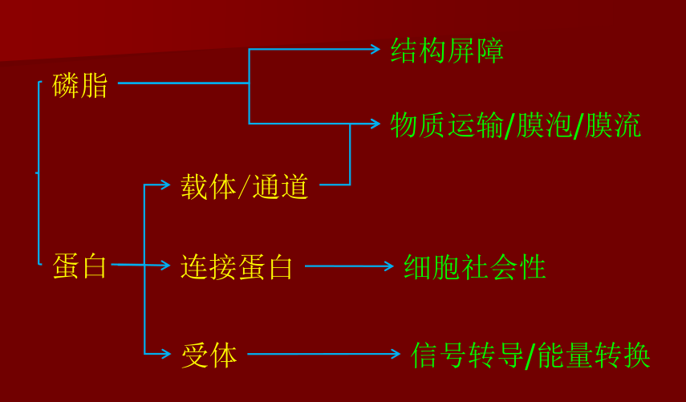

### 四、跨膜运输

#### （一）概述

纯磷脂双分子层对不同细胞的通透性

膜的选择通透性维持一个动态稳定的内环境

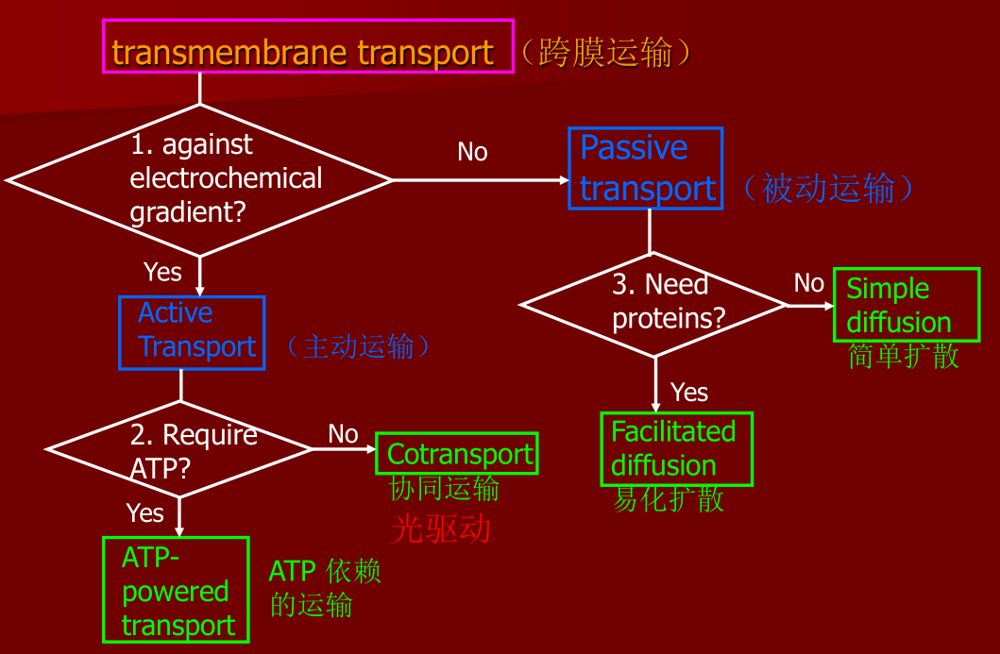

电化学势

#### （二）简单扩散

#### （三）易化扩散

电化学梯度 = 浓度梯度 + 膜电位

载体和通道

1. 通道蛋白：亲水通道、特异性

   类型：非门控通道、门控通道（电压门控通道、配体门控通道、压力门控通道）

2. 载体

#### （四）ATP依赖的转运

1. P类离子泵

   （1）结构

   

   Na+-K+ ATP 酶：构象变化

   分子开关：蛋白质的活性转变与磷酸化等情况相关

2. V类离子泵

3. F类离子泵

4. ABC (ATP-binding cassette)-powered pumps

#### （五）协同运输

同向协同运输、反向协同运输

为协同运输提供能量的两类离子梯度：动物细胞（钠离子），植物、细菌和真菌细胞（氢离子）

#### （六）光驱动运输

多种方式协同

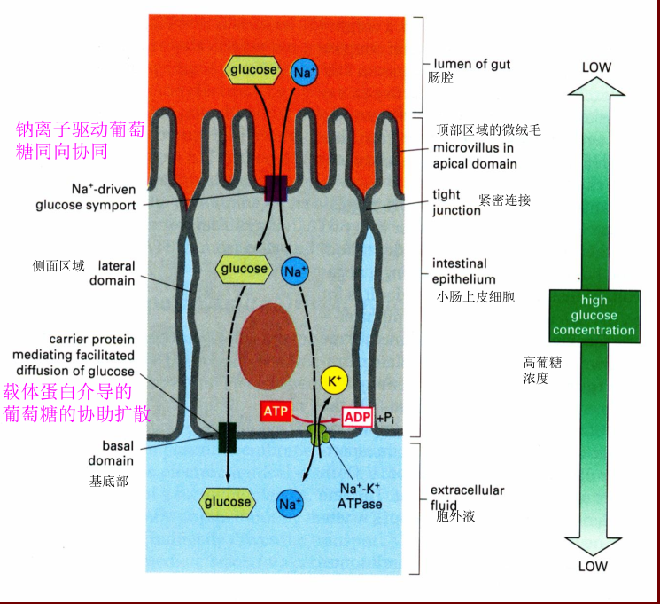

### 五、胞外基质

概念：主要由分泌蛋白和聚糖组成，复杂结构

#### （一）ECM蛋白

1. 胶原：甘氨酸、脯氨酸、羟脯氨酸、羟赖氨酸

   胶原纤维骨架

2. 纤连蛋白

   （1）结合位点：胶原结合区、细胞结合区、肝素结合区

   （2）**RGD识别单位**

3. 层纤连蛋白

   （1）识别位点：整联蛋白、……

4. 弹性蛋白

   - 高度疏水，不糖基化

#### （二）蛋白聚糖

高度亲水

1. 糖胺聚糖（GAG）：透明质酸，软骨素和皮肤素，肝素，角蛋白
2. 蛋白聚糖：Ser、Thr

#### （三）分子结构模型

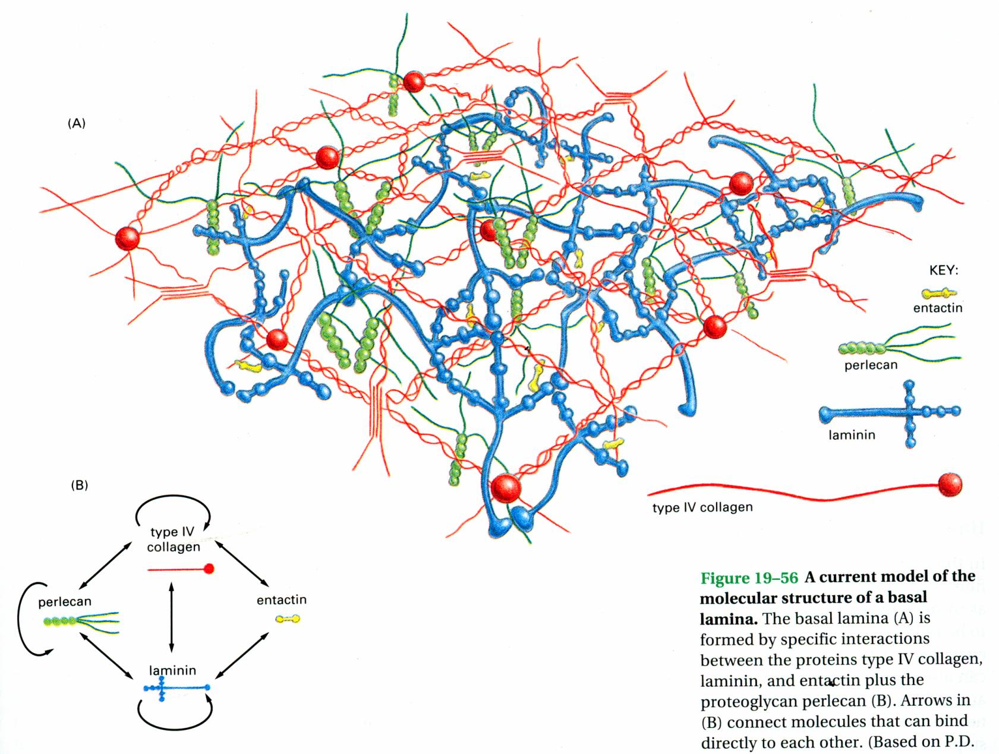

#### （四）胞外基质的功能

1. 水环境
2. 细胞保护
3. 细胞支持、连接

### 六、细胞连接

细胞-细胞连接，细胞-基质连接

功能分类：

- 封闭连接（紧密连接）
- 通讯连接
  - 间隙连接
  - 化学突触
  - 胞间连丝
- 锚定连接

#### （一）紧密连接

1. 特点：无间隙，跨膜蛋白（封闭蛋白）
2. 模型
3. 作用

#### （二）间隙连接

1. 特点：更广泛，通道
2. 模型
   - 连接蛋白
   - 连接子：6个连接蛋白
   - 间隙连接通道：2个连接子
3. 间隙连接的通透性可以调节

#### （三）胞间连丝

仅在植物细胞

内质网

#### （四）锚定连接

广泛分布于动物组织

将一个细胞的细胞骨架连接到另一个细胞或细胞外基质

1. 结构

   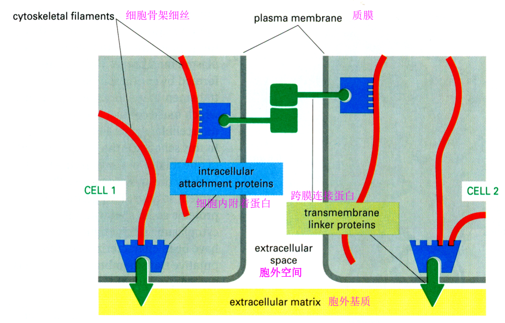

2. 细胞骨架纤维：肌动蛋白（微丝）----黏着，中等纤维----桥粒

3. 胞内附着蛋白

   - actin: α-, β-, γ-连环蛋白, 粘着斑蛋白,α-辅肌动蛋白
   - intermediate filaments: 桥粒斑蛋白,plakoglobin

4. 跨膜连接蛋白(TLP)—(细胞粘连蛋白，CAMs)

   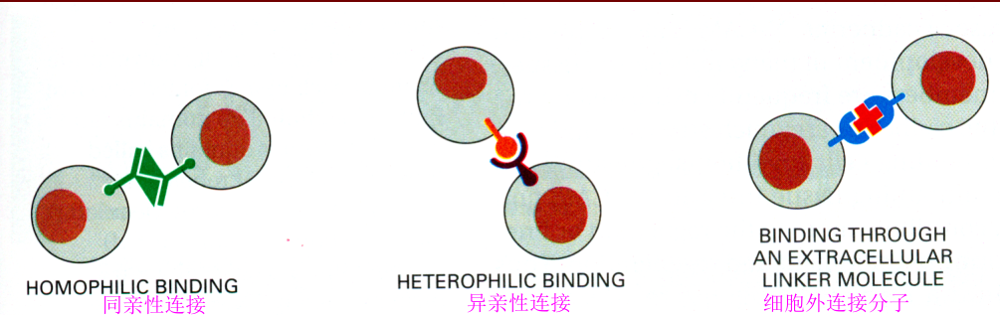

   - 钙黏蛋白
   - 选择素
   - 免疫球蛋白超家族
   - 整联蛋白：**胞外基质受体，识别RGD**

   **锚定连接和连接的分子**

   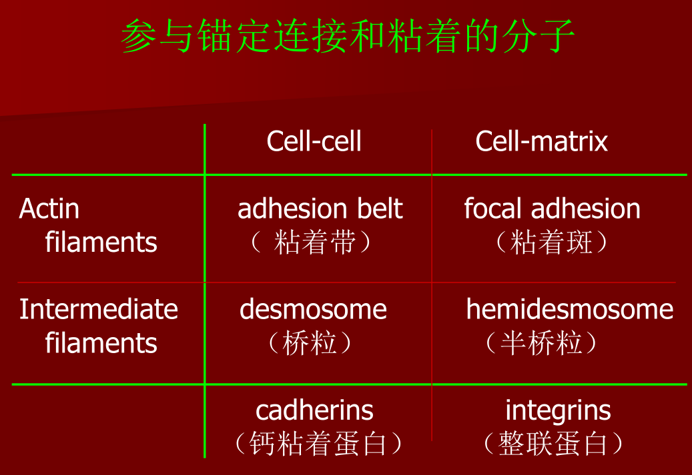

   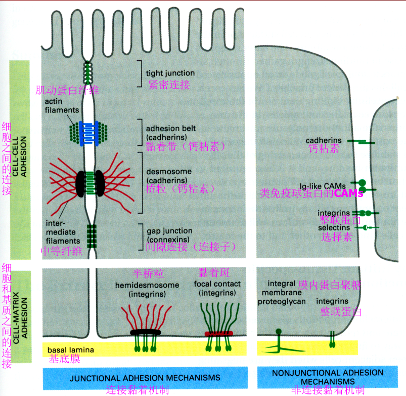

### 提问

1. 判断主动运输和被动运输的标准
2. 运输方式
3. 胞外基质的最主要组成（两类）：分泌蛋白和聚糖
4. 细胞连接分类：紧密连接、通讯连接、锚定连接
5. 参与锚定连接的蛋白：细胞骨架、细胞内附着蛋白、跨膜连接蛋白

## 第四章 细胞质基质和内膜系统

最大的细胞器：细胞核

总表面积最大的细胞器：内质网

数目最多的细胞器：线粒体

膜流

膜细胞器起源假说：内陷、内吞假说

### 蛋白质转运

信号肽、信号补丁

### 一、细胞质基质

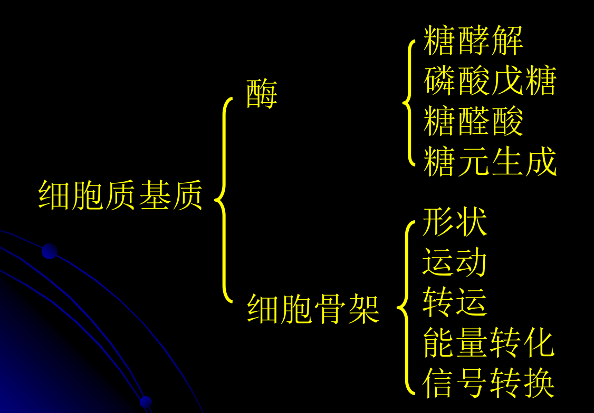

液-液相分离

细胞内的环境：代谢

 蛋白质合成起始于细胞质

### 二、膜细胞器

#### （一）细胞核

最显著的细胞器，核被膜、核仁、染色质

核孔复合体：双向转运的亲水通道

分子伴侣

#### （二）内质网

脂类和蛋白质合成的中心

膜囊和膜泡

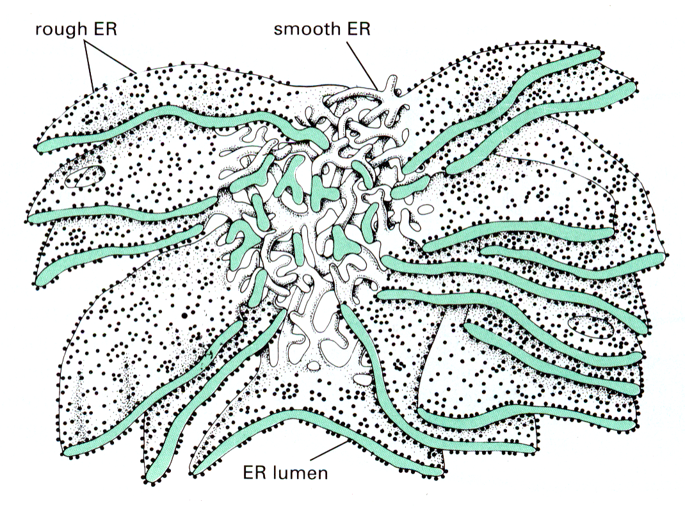

磷脂合成：酰基转移酶、酰基转移酶、胆碱磷酸转移酶

磷脂易位子、磷脂交换蛋白（内质网、线粒体转移）

蛋白质的糖基化：N-连接，Asn-X-[Ser/Thr]

内质网应激：细胞自我保护机制，帮助内质网蛋白折叠和修饰

#### （三）高尔基体

膜囊和膜泡

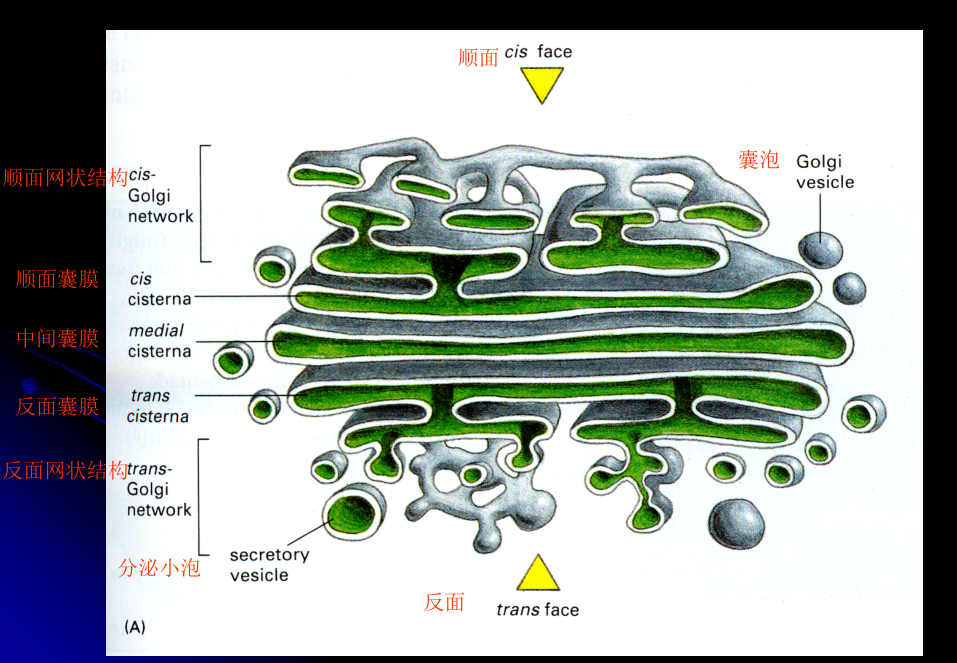

极性

结构组成：顺面（形成面）、中间膜囊、反面（成熟面）

O-连接糖基化

#### （四）溶酶体

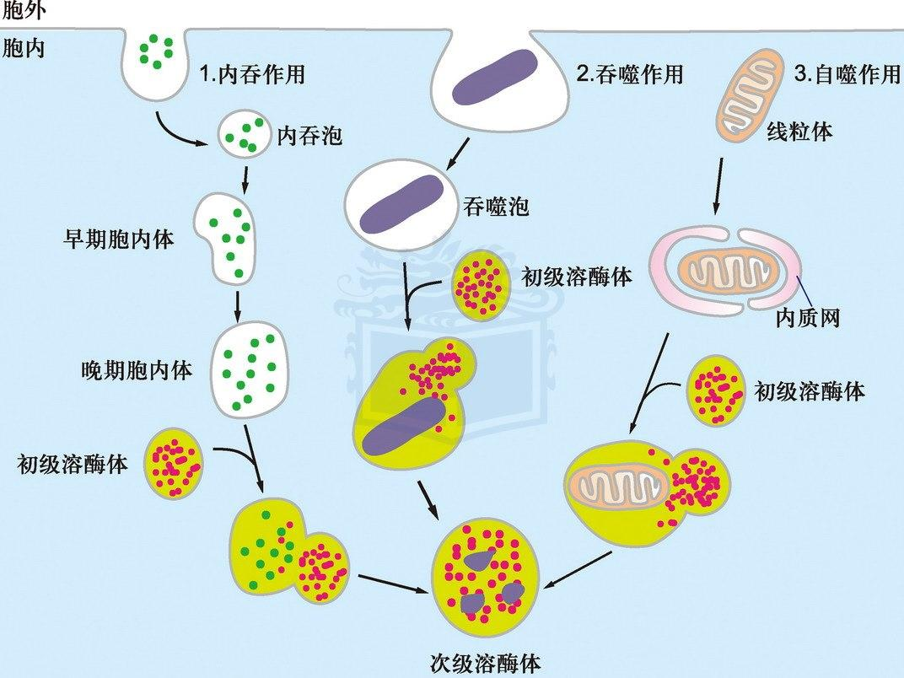

内吞作用

吞噬作用

自噬：维持细胞内稳态

#### （五）过氧物酶体

过氧化物酶

### 三、蛋白质分选与转运

#### （一）信号假说

信号识别颗粒

#### （二）膜泡转运

1. 细胞内膜泡运输特点

   - 膜泡的形成
   - 膜泡的运输
   - 膜泡的融合

2. 转运小泡调节两条途径

   - 分泌
   - 内吞

3. 调节膜泡形成的两种蛋白

   （1）外被体蛋白：COP II 、COP I 

   （2）网格蛋白

4. COP包被转运泡

   - ARF介导的小泡
   - Sar1介导的小泡

5. 网格蛋白包被小泡的形成

   - 网格蛋白
   - 接合素：特殊跨膜蛋白的识别；与网格蛋白连接
   - 发动蛋白

6. 转运泡与膜融合

   - 膜融合蛋白：NSF、SNAPs、SNAREs

   - 膜泡运输

     - 驱动蛋白沿微管运动

       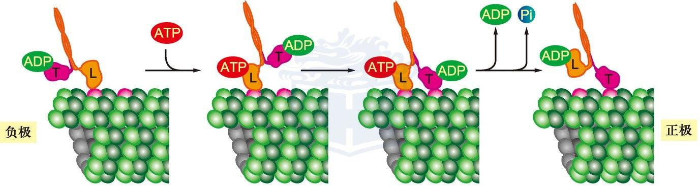

**内膜系统是完整的体系：**

1. **结构相关：直接相连；囊泡**
2. **功能相关：共同参与蛋白质的合成、加工修饰、成熟、分选、功能定位**

### 提问

1. 如何理解内膜系统是一个统一整体？
   - 结构：起源相同；拓扑结构相连，直接、膜泡
   - 功能：蛋白质
2. 膜泡运输的特点

## 第五章 线粒体和叶绿体

氧化磷酸化

光合磷酸化

### 一、线粒体

#### （一）结构

1. 线粒体的形态、大小、分布因细胞的种类、生理状态不同而异

2. 四个独立成分：

   （1）外膜

   （2）内膜

   （3）膜间腔

   （4）基质

3. 生化成分

#### （二）电子传递和氧化磷酸化

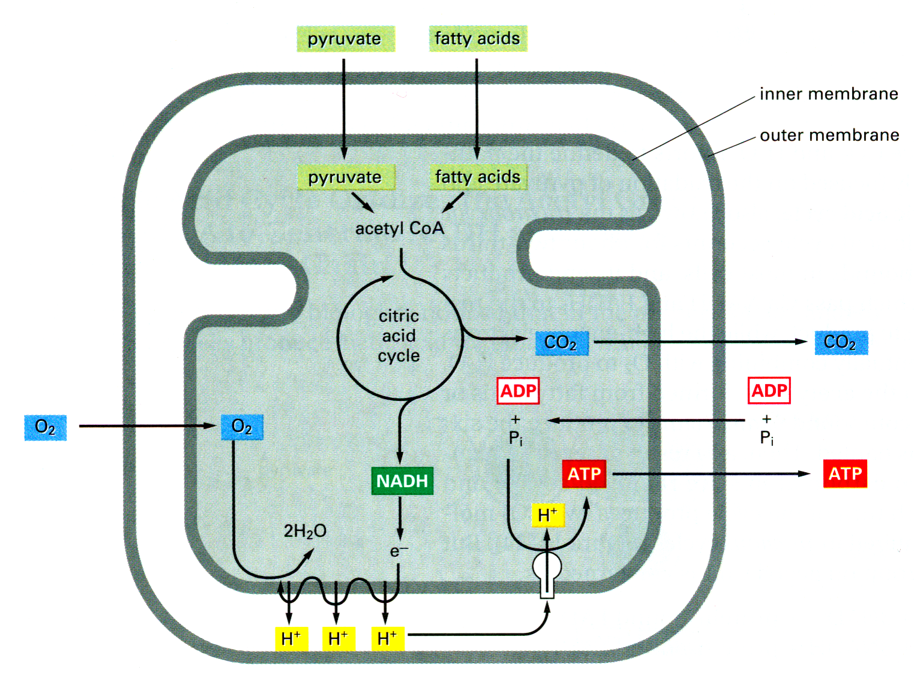

1. 电子传递链的成分

- 复合体Ⅰ：NADH-CoQ氧化还原酶，质子转运
- 复合体Ⅱ：琥珀酸-CoQ氧化还原酶
- 复合体Ⅲ： CoQ-CytC氧化还原酶，质子转运
- 复合体Ⅳ：细胞色素氧化酶，质子转运

2. ATP合酶

   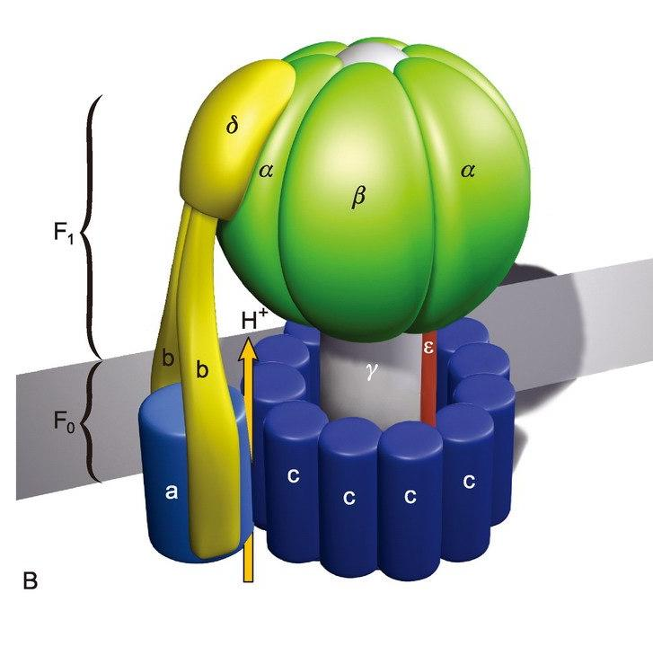

   - 结合变构模型

     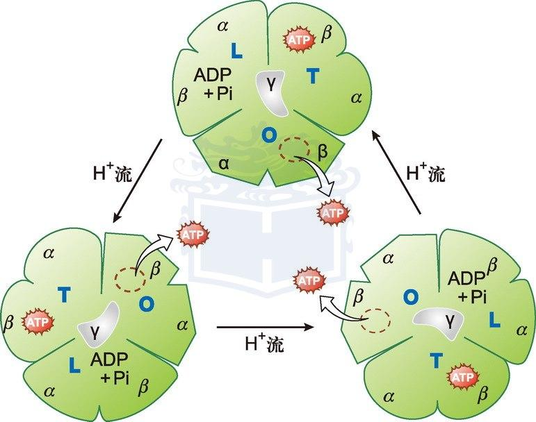

   - 化学渗透假说：内膜的完整性

#### （三）线粒体的功能

1. 产能：能量，氧化磷酸化
2. 活性氧：细胞损伤、衰老
3. 调控细胞凋亡： CytC，内源性途径
4. 信号转导：钙离子平衡

#### （四）半自主性

mtDNA：编码13种多肽

核质互作： 核基因与线粒体基因共同作用调控线粒体功能

哺乳动物线粒体基因的遗传特点：母系遗传、多拷贝、高突变率、同质突变和异质突变

## 第六章 遗传信息表达系统

遗传信息的储存，遗传信息的表达及调控

DNA长度~3m

### 一、染色质与染色体

#### （一）概述

1. 遗传信息的载体，有DNA、组蛋白、非组蛋白和RNA
2. 在细胞不同时期产生染色质和染色体
3. 常染色质和异染色质
4. 活性染色质（常染色质）和非活性染色质（常染色质和异染色质）

#### （二）核小体

#### （三）染色质组装的多级螺旋模型

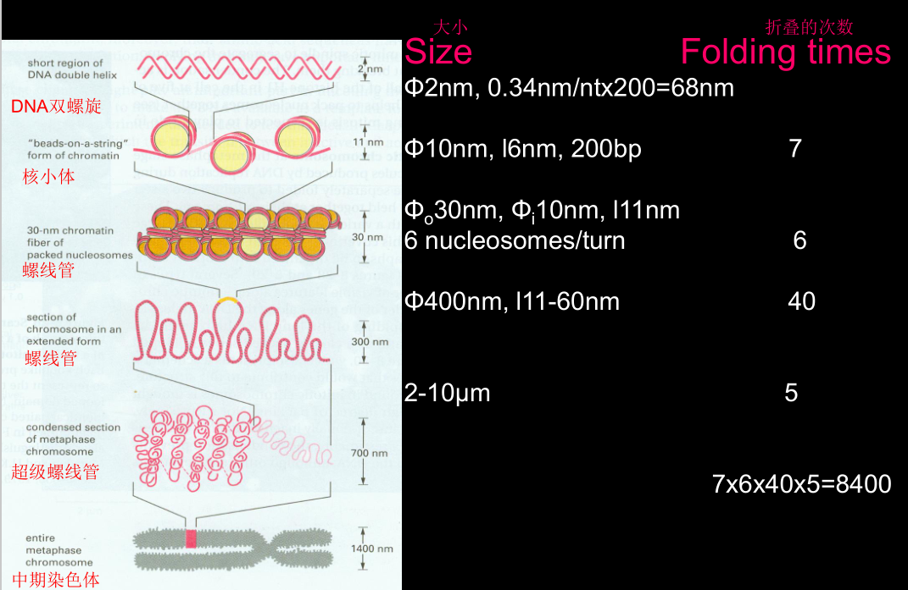

#### （四）染色体

1. 结构：

   （1）着丝粒：主缢痕

   - 着丝点，动粒
     - 内板
     - 中间间隙
     - 外板
   - 中央结构域
   - 配对结构域

   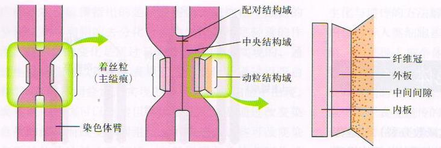

   （2）次缢痕

   （3）核仁组织区

   （4）随体

   （5）端粒

2. 染色体的三个功能区域

   （1）ARS, 自主复制DNA序列

   （2）CEN, 着丝粒DNA序列

   （3）TEL, 端粒DNA序列

#### （五）核型

### 二、遗传信息表达

#### （一）复制

1. 复制叉
2. 表观遗传调控
3. DNA复制：
   - 方向性：5'→3'
   - 引物：RNA
   - 半不连续复制：冈崎片段
   - 末端复制问题：端粒，端粒酶

#### （二）RNA合成和修饰

1. DNA转录

   （1）真核生物三种RNA聚合酶

   （2）内含子和外显子

   - 剪接体
   - RNA剪切过程的共同序列GU/AG
   - 自我剪切
   
   先有鸡还是先有蛋：蛋的本质是遗传物质，鸡——物种形态。蛋白质决定DNA，还是DNA决定蛋白质

### 三、核仁

#### （一）核仁中的三个致密区域

1. 纤维中心：DNA
2. 致密纤维中心：DNA、RNA
3. 颗粒组分：核糖核蛋白体

#### （二）rRNA的合成

基因剂量

高效转录

#### （三）rRNA修饰

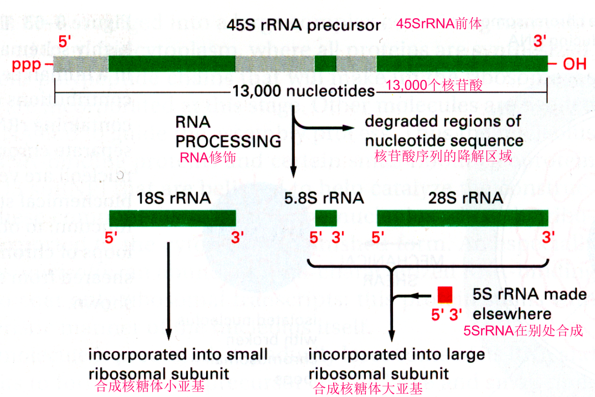

#### （四）核糖体的装配

#### 基因表达的调控

基因剂量

染色质水平

复制

转录

翻译

### 四、核糖体

#### （一）类型

70S核糖体、80S核糖体

#### （二）成分和结构

大小亚基

核糖体RNA和核糖体蛋白

如何设计实验验证核糖体发挥作用的组分？

- 有核糖体、无核糖体、蛋白酶预先处理、RNA酶预先处理4组

#### （三）功能区域

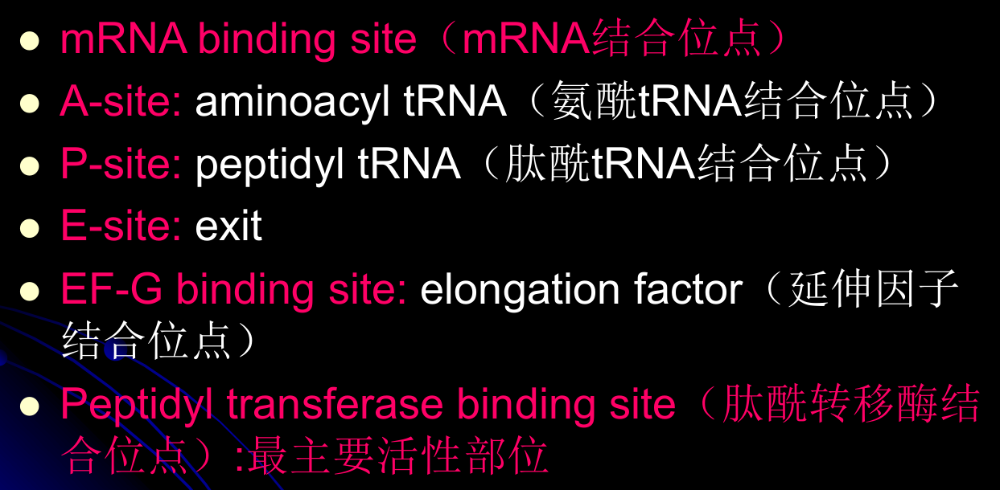

#### （四）蛋白质合成

起始

延伸

终止

多聚核糖体

## 提问

遗传信息的储存：

- 染色质的基本结构单位（如何组装）：核小体，组成
- 如何进一步组装

遗传信息的表达调控

- 复制：方向性、RNA引物、半不连续复制、末端复制问题
- 转录

## 第七章 细胞骨架

### 一、细胞骨架的概念

细胞骨架是延伸到整个真核细胞的蛋白纤维的复杂网络

动态结构

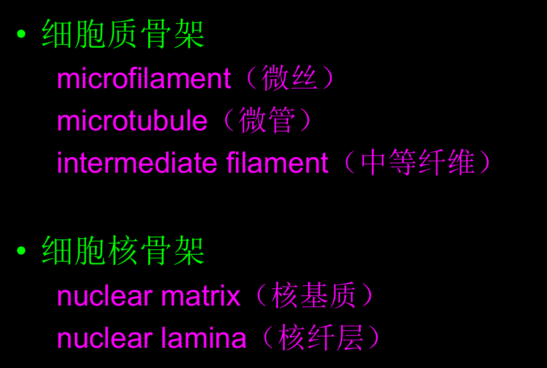

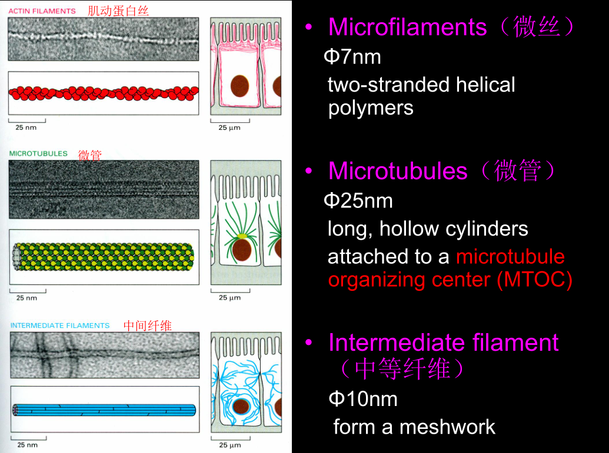

### 二、微丝

#### （一）结构

Actin肌动蛋白分子

聚合解聚

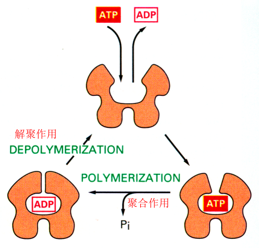

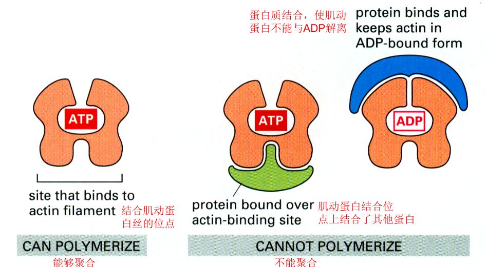

#### （二）微丝结合蛋白MAP

#### （三）肌肉

### 三、微管

#### （一）微管蛋白

### 四、中间纤维

#### （一）细胞质IF

#### （二）核IF

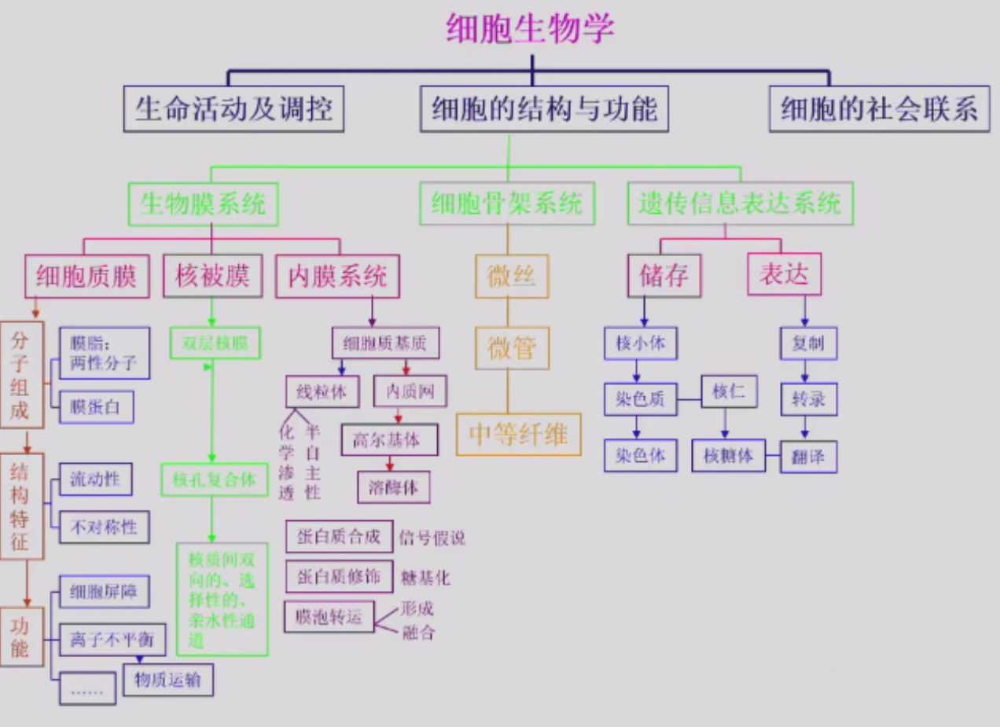

## 第八章 细胞信号转导

细胞新陈代谢包括三方面内容：物质代谢，能量代谢，信息变化和传递

通过信息变化和传递，调节和控制物质代谢和能量代谢

### 一、细胞通信与信号转导

#### （一）细胞间通讯（细胞通信）

1. 方式

   （1）分泌细胞因子、化学信号（胞外化学信号）

   （2）细胞间接触依赖性通信，细胞间直接接触，膜上信号分子（配体）与受体相互作用

   （3）缝隙连接、胞间连丝（通讯连接）

   （4）其他：外泌体、cell-in-cell、代谢感受分子（mTOR 代谢压力；HIF-1α 低氧；AMPK ：ATP能量）

2. 分泌化学信号进行的通讯

   （1）通过信号分子和受体相互作用来完成

   （2）根据发挥作用距离和作用方式：
   - 内分泌信号
   - 旁分泌信号
   - 自分泌信号
   - 化学突触传递的神经信号

3. 接触依赖性通信

   （1）细胞直接接触，无需信号分子的释放

   （2）包括：

   - 细胞-细胞黏着
   - 细胞-基质黏着
   - 等

#### （二）细胞的信号分子与受体

1. 细胞通讯的基本过程

   - 信号传导：强调信号产生与细胞间传递
   - 信号转导：接收信号的转换

2. 细胞的信号分子

   （1）在细胞间或细胞内传递信息的分子，既非营养所需，又非能源物质和结构成分

   （2）特点

   - 不直接介导细胞活性
   - 不具备酶的活性，不参与具体代谢
   - 能与受体相结合，改变受体性质，引发生物学反应

   （3）常见信号分子
   - 激素、神经递质、生长因子、淋巴因子、抗体等（胞外）
   - 环状腺苷酸、Ca2+等（胞内）
   - NO 、CO是气体信号分子，直接进入胞内激活效应酶
   - 物理信号：温度、光、磁等
   - 病原相关分子模式PAMP
     - 病原微生物共有的高度保守的分子结构
     - 脂多糖（LPS）、磷壁酸（LTA）、肽聚糖（PGN）、甘露糖、细菌DNA、螺旋体脂蛋白、病毒单链或双链RNA等
     - 也包括宿主凋亡细胞表面某些共有的分子结构，如磷酯酰丝氨酸（PS），线粒体DNA
     - 被模式识别受体（PRR）识别，产生免疫反应
   - 损伤相关分子模式DAMP

   （4）根据溶解性
   - 亲脂性
     - 甾类激素、甲状腺素、类固醇激素等
     - 通过细胞膜的双层磷脂分子层，进入细胞内，与细胞内受体结合
   - 亲水性
     - 神经递质、生长因子、胰岛素等水溶性激素
     - 与细胞膜上特定的受体相结合，胞内产生第二信使
     - 细胞信息传递和代谢调节的重要方式

   （5）化学信号的分类

   - 气体性信号分子
   - 疏水性信号分子
   - 亲水性信号分子
   - 膜结合信号分子

3. 受体

   （1）一类存在于细胞膜上或细胞内的能够识别信号分子或环境中特定物质，并与之结合，产生特定生理功能的特殊分子【绝大多数为（糖）蛋白，少数为糖脂】

   （2）根据靶细胞上所在位置

   ①细胞内受体
   - 一类激素激活的基因调控蛋白，有多个成员，构成细胞内受体超家族
   - 位于细胞质基质或核基质中，识别结合小的脂溶性信号分子
   - 分类
     - 甾体激素受体
       - 配体：甾体激素
       - 至少3个功能域
         - 保守的C-末端配体结合区
         - 高度保守的中央DNA 结合区
         - N-末端调节区或称转录激活区
     - 视黄类受体
       - 配体：视黄酸（维甲酸）、甲状腺素和维生素D
     - 孤儿受体
       - 配体不明
   - 三个结构域
     - C 端信号分子（激素）结合位点
     - N 端转录激活结构域
     - 中间部分是抑制性蛋白（Hsp90）和DNA结合位点
       - 中间部分特点：富含Cys，两个锌指结构，高度保守
   - 免疫系统受体
   - NO信号
     - 由血管内皮细胞和神经细胞合成
     - L-精氨酸，NOS
     - 与鸟苷酸环化酶结合，促进cGMP合成。cGMP作为第二信使，发挥作用

   ②膜受体（细胞表面受体）
   - 结合在细胞膜上的受体，是一类膜整合蛋白
   - 识别结合亲水性信号分子（分泌型信号分子和膜结合型信号分子）
   - 三个功能区
     - 分辨区：膜外识别和结合信号分子的部位，常有糖的修饰
     - 传导区：将接受的信号转换为蛋白质构像变化
     - 效应区：执行功能的区域，常具有酶的活性，或具有离子通道性质，或与G蛋白偶联而发挥作用
   - 大类
     - 离子通道偶联受体
       - 分布于神经、肌肉等可兴奋细胞
       - 受信号分子调节的离子通道
       - 电压门控、配体门控、压力激活
     - G-蛋白偶联受体
       - 这类受体本身不具备酶或通道性质，通过G蛋白与膜上的其它酶或通道偶联，发挥作用
     - 酶偶联受体/催化受体
       - 受体胞内结构域具有潜在酶活性或受体胞内段与酶相连
     - 其他膜受体：Notch、Wnt、Hedgehog、Hippo、Integrin等，免疫细胞表面模式识别受体（PRR）

4. 受体与信号分子的结合特点

   - 高度特异性
   - 高度亲和力
   - 可逆性：非共价键结合
   - 可饱和性
   - 大的生物学效应：通过第二信使，逐级放大

5. 第二信使与分子开关

   （1）第二信使学说：胞外化学信号（第一信使）不能进入细胞，它作用于细胞表面受体，导致产生胞内信号（第二信使），从而引发靶细胞内一系列生化反应，最后产生一定的生理效应。

   （2）第二信使：胞内产生的非蛋白类小分子，其浓度变化应答胞外信号与细胞表面受体的结合，调节细胞内酶和非酶蛋白质的活性。

   - cAMP、cGMP、Ca2+、二酰甘油和IP3

   （3）分子开关

   - GTP酶分子开关调控蛋白：包括三聚体GTP结合蛋白和单体GTP结合蛋白
     - 两种状态：与GTP结合活化，与GDP结合失活
     - 失活态→活化态：鸟苷酸交换因子（GEF）
     - 活化态→失活态：GTP水解速率，GTP酶促进蛋白（GAP）和G蛋白信号调节子（RGS）促进，鸟苷酸解离抑制物（GDI）抑制
   - 蛋白激酶/蛋白磷酸酶：磷酸化与去磷酸化
     - 动物细胞两类蛋白激酶：酪氨酸激酶、丝/苏氨酸激酶
   - 钙调蛋白CaM
     - 与Ca2+的结合或解离分别处于活化或失活的状态

#### （三）信号转导系统及其特性

1. 信号转导系统的基本组成及信号蛋白的相互作用

   （1）细胞表面受体信号通路

   （2）信号蛋白相互作用

   - 依靠蛋白质模式结合域
   - SH2结构域：特异性结合围绕磷酸酪氨酸残基的氨基酸序列

2. 细胞内信号蛋白复合物的装配

   （1）支架蛋白，预先形成细胞内信号复合物

   （2）激活受体装配，自磷酸化提供锚定位点

   （3）临近质膜形成修饰的肌醇磷酸分子，募集具有PH结构域的信号蛋白

3. 信号转导系统的主要特性

   （1）特异性

   （2）放大效应

   （3）网络化与反馈

   （4）整合作用

### 二、G蛋白偶联受体及其介导的信号转导

GPCR，是细胞表面受体中最大的家族

#### （一）G蛋白偶联受体的结构与作用机制

1. G蛋白（三聚体GTP结合调节蛋白）特点：

   - 异三聚体，由α、β、γ三个亚基组成
   - β、γ亚基以异二聚体形式存在
   - α亚基能与GTP（或GDP）结合，具有GTP酶活性。分子开关
   - β、γ亚基起稳定a亚基作用， γ、α亚基能与膜结合

2. 共同特征

   （1）所有GPCR均具有7次跨膜的α螺旋结构，N端在细胞外侧，C端在细胞胞质侧

   （2）均偶联一个三聚体G蛋白，分子开关

   （3）均具有与质膜结合的效应器蛋白

   - 离子通道蛋白
     - Gβγ激活K+通道效应器
   - 腺苷酸环化酶
     - 激活或抑制，改变cAMP第二信使的浓度
   - 磷脂酶C
     - 产生IP3和二酰甘油DAG

   （4）均具有参与反馈调节或导致受体脱敏的蛋白

#### （二）G蛋白偶联受体所介导的细胞信号通路

三类：激活离子通道；激活或抑制腺苷酸环化酶，以cAMP为第二信使；激活磷脂酶C，以IP3和DAG作为双信使

1. 激活离子通道的GPCR

   （1）心肌细胞，M型乙酰胆碱受体

   - 受体活化，βγ亚基释放，结合K+通道， K+从细胞内扩散出来
   - 许多神经递受体是GPCR

   （2）Gt蛋白偶联的光敏感受体

   - 视紫红质，视杆细胞Gt蛋白偶联的光受体
   - 感光活化，cGMP磷酸二酯酶活化，cGMP水平降低，门控阳离子通道关闭

2. 激活或抑制腺苷酸环化酶的GPCR

   （1）普遍机制：Gα的首要效应酶是腺苷酸环化酶，调节第二信使cAMP的水平，影响下游

   （2）组成

   - 刺激型激素受体或抑制型激素受体：7次跨膜GPCR
   - 刺激型G蛋白或抑制型G蛋白
   - 腺苷酸环化酶

   （3）作用：

   - 刺激型激素与相应受体Rs结合，偶联Gs（具刺激型α亚基，即Gsα），激活腺苷酸环化酶活性，提高靶细胞cAMP水平；
   - 抑制型激素受体相反
   - cAMP浓度调节：腺苷酸环化酶升高，cAMP磷酸二酯酶降低

   （4）信号通路：主要是通过cAMP激活的蛋白激酶A（PKA）所介导

   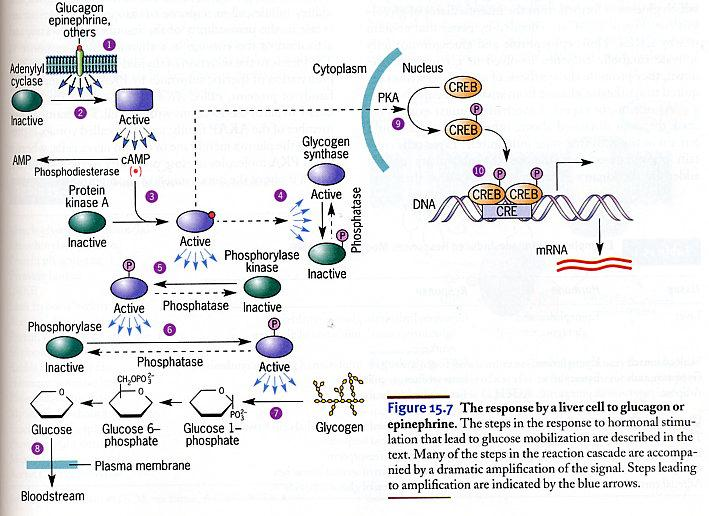

   - cAMP-PKA信号通路对糖原代谢的调节

     - cAMP增加→PKA活化
       - 促进糖原降解：磷酸化糖原磷酸化酶激酶→磷酸化糖原磷酸化酶→刺激糖原降解
       - 抑制糖原合成：磷酸化糖原合酶
       - 抑制磷蛋白磷酸酶：磷酸化激活磷蛋白磷酸酶抑制蛋白→磷酸化磷蛋白磷酸酶，失活
     - cAMP降低→磷蛋白磷酸酶活化
       - 抑制糖原降解：糖原磷酸化酶激酶去磷酸化，糖原磷酸化酶去磷酸化
       - 促进糖原合成：糖原合酶去磷酸化

   - cAMP-PKA信号通路对真核细胞基因表达的调控

     - 反应链：激素→GPCR→G蛋白→腺苷酸环化酶→cAMP→cAMP依赖的PKA→基因调控蛋白（cAMP应答元件结合蛋白，CREB）+CREB结合蛋白（CBP）→基因转录（cAMP应答元件，CRE）

     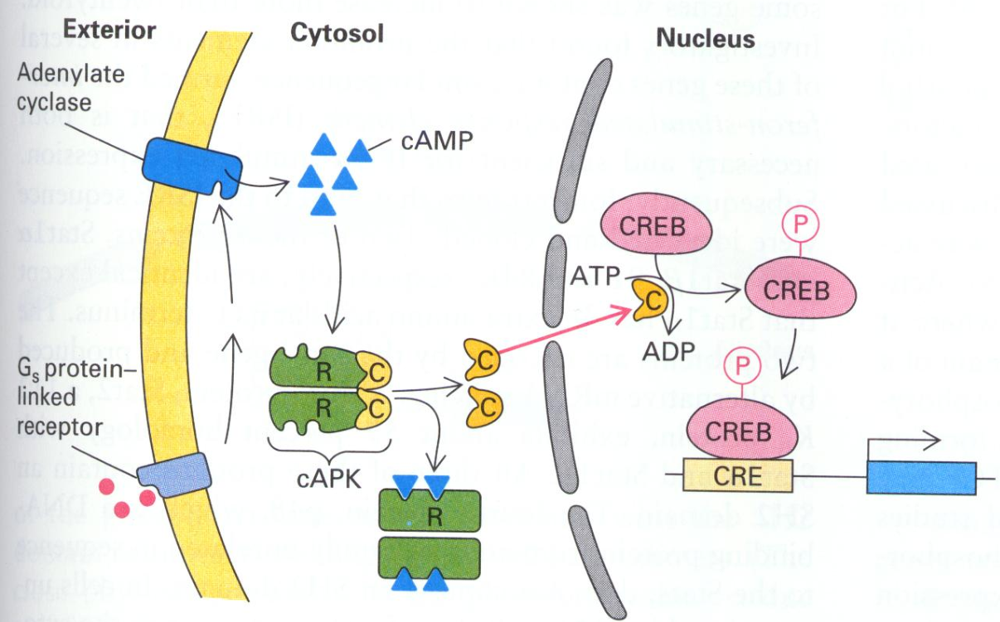

   - 受体功能下调：受体与配体亲和性下降；GTP酶活性，GTP水解；cAMP磷酸二酯酶水解

   （5）两种cAMP信号通路：

   - 激活型通路：激活型受体（Rs）＋活化型G蛋白（Gs）＋腺苷酸环化酶组成
     - 激活PKA
     - 肾上腺素；胰高血糖素；促肾上腺皮质激素
   - 抑制型通路：抑制型受体（Ri）＋抑制型G蛋白（Gi）＋腺苷酸环化酶组成
     - Gi的调节过程与Gs基本类似，但α亚基与腺苷酸环化酶结合后，起抑制作用
     - 此外， Gi 的β、γ亚基能与Gs 的α亚基结合，阻断Gs α亚基对腺苷酸环化酶的激活
     - 前列腺素；腺苷

   （6）作用于G蛋白的毒素

   - 霍乱毒素：具有ADP-核糖转移酶活性，催化ADP结合到Gs α亚基上
     - 丧失GTP酶活性
     - α亚基处于持续活化状态，使腺苷酸环化酶永久活化
   - 百日咳毒素：催化Gi α ADP-核糖基化
     - 阻止GDP释放，非活化
     - cAMP水平增高

3. 激活磷脂酶C和以IP3和DAG作为双信使的GPCR介导的信号通路

   （1）磷脂酰肌醇信号通路，通过磷脂酶C

   （2）双信使的合成：胞外信号分子与GPCR结合，活化G蛋白（Goα或Gqα），激活磷脂酶C。PI→PIP和PIP2，PIP2→IP3和DAG。IP3在细胞质中扩散，DAG在膜上

   （3）双信使系统：两条不同的信号通路。IP3刺激内质网释放钙离子，胞内钙离子浓度升高；DAG激活蛋白激酶C（PKC）

   - IP3-钙离子信号通路
     - IP3门控钙离子通道
       - 钙离子的双向调控：增加通道开启；进一步升高又会导致通道失活→胞质钙离子水平的快速振荡
     - 微区钙信号转导单元：钙火花
     - 通过钙离子应答蛋白间接发挥作用：钙调蛋白CaM

G蛋白传递细胞外信息途径：打开跨膜离子通道，外界离子进入；激活第二
信使，如cAMP、IP3/DAG等。钙离子通常认为是 cAMP、IP3/DAG下游的第三信使。

激动剂、拮抗剂

结构：7次跨膜

第二信使：cAMP、cGMP、IP3（1，4，5—三磷酸肌醇）、DG（二酰基甘油）

作用过程：

- α亚基与GDP结合，呈关闭态
- 当信号分子与受体结合→受体与G蛋白发生作用 →导致β、γ亚基与α亚基分离，α亚基结合的GDP被GTP替代 →G蛋白激活，开启态→活化相关酶，产生效应

调节因子：

- GEF：促进GDP解离，激活G蛋白
- GAP：GTP酶激活蛋白，促进GTP水解，缩短循环周期
- RGS：G蛋白信号调节蛋白，具有GAP调节的功能
- GDI：鸟苷解离抑制蛋白：维持G蛋白非活性状态

功能：

- 直接控制某些离子通道
- 调节PKA，cAMP信号通路
- 调节PKC，磷脂酰肌醇信号通路

G蛋白直接控制离子通道

- 心肌细胞，M型乙酰胆碱受体
- β、γ亚基结合K+通道， K+从细胞内扩散出来
- 降低心跳

1. cAMP 信号通路

- 信号分子→受体→G蛋白→腺苷酸环化酶→ATP→cAMP+PPi
- cAMP作用
  - cAMP→蛋白激酶A→靶酶1→靶酶2 →→生物学效应（细胞质功能，如糖原分解）
  - cAMP→蛋白激酶A→CREB转录因子→基因转录（细胞核功能）
- cAMP降解：cAMP磷酸二酯酶
- PKA：调节亚基和催化亚基

PKA与糖原分解

- 胰高血糖素

  

2. 磷脂酰肌醇信号通路

   - 磷脂酰肌醇信号通路

   - 第二信使：1,4,5—三磷酸肌醇（IP3）和二酰基甘油（DAG）。双信使系统

   - 磷脂酰肌醇PI

     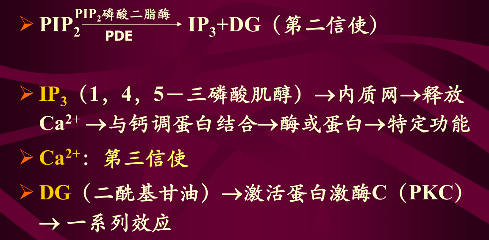

   - PKC

     - 未激活前，存在于细胞质内，呈非活性构象
     -  细胞受到刺激，产生DG，DG和质膜上的磷脂
       酰丝氨酸一起，使PKC结合到膜内表面
     - PKC在DG和Ca2+作用下，转变为活性构象
     - 特征和作用
       - 能被DG激活
       - Ca2+和磷脂酰丝氨酸依赖性
       - 具有Ser和Thr蛋白激酶活性
       - 调节细胞分泌、肌肉收缩、细胞增殖、细胞分化
     - 参与基因转录调节
       - 通过一系列磷酸化级联反应，导致MAP激酶磷酸化，磷酸化Eik-1，Eik-1与SRF共同结合在SRE上
       - PKC活化，导致Iκ-B蛋白磷酸化，使细胞质中的基因调控蛋白NF- κB与其分离，并进入细胞核，与相应基因调控序列结合，促进基因转录

3. 第二信使钙离子的作用

   - Ca2+作为第二或第三信使，许多生命活动受其调节
   - 存在于胞外，ER，Mit，液泡
   - 通过钙调蛋白发挥作用
   - 钙信号研究方法
     - 胞内自由钙离子浓度测定

### 酶偶联受体

#### 酪氨酸蛋白激酶活性受体RTK

EGF、胰岛素样、NGF、PDGF、M-CSF、FGF、VEGF、Eph

1. 特点

   （1）具有酪氨酸蛋白激酶活性，能催化受体自身蛋白质中的酪氨酸残基磷酸化

   （2）磷酸化级联反应

   （3）受体由单条肽链组成，配体结合后，受体二聚化

2. 受体中磷酸化的酪氨酸残基可被细胞中的某些信号蛋白识别和结合

3. 常见信号蛋白

   （1）接头蛋白：如生长因子受体结合蛋白－2，GRB-2

   （2）信号传递相关酶，如蛋白磷酸酯酶（SyP）、非受体酪氨酸蛋白激酶、磷脂酶C-γ, 3-磷脂酰肌醇激酶等

   特点：

   - 含有SH2、SH3、PTB、PDZ、PH、DD等结构域
   - SH2由约100个氨基酸组成，可折叠成球形结构，与磷酸化的酪氨酸区域结合

4. RTK-Ras 信号通路

   - Ras-GDP失活态，Ras-GTP活化态，分子开关（与G蛋白相似，小G蛋白）
   - Ras从失活态活化态，需Ras 激活蛋白（如鸟苷酸释放因子GRF，即SOS）参与
   - 激活的Ras启动三种蛋白激酶的磷酸化级联反应
   - Ras→Raf→Mek→MAPK/Erk

5. PI3K-PKB/Akt 信号通路

   - PI3K既具有Ser/Thr激酶活性，又具有磷脂酰肌醇激酶活性
   - PI3K具有SH2，通过结合磷酸化活化的 RTK，被招募至细胞膜
   - PI3K催化亚基催化PIP（PI-4-P）生成PIP2（PI-3,4-P2）；此外还催化PIP2生成PIP3（PI-3,4,5-P3）
   - 这些磷脂酰肌醇为多种信号转导蛋白和蛋白激酶如 PKB 提供锚定位点（PKB通过其N端 PH 结构域识别）
   - PKB是一种Ser/Thr蛋白激酶，又叫Akt
   - PKB被PDK1和PDK2（通常是mTOR）激活，从膜上解离，在细胞质或入核磷酸化靶蛋白
   - mTOR：哺乳动物雷帕霉素靶蛋白，丝氨酸/苏氨酸蛋白激酶，存在两种复合物形式

#### 丝氨酸/苏氨酸蛋白激酶活性受体

单次跨膜蛋白，以二聚体行使功能

主要配体：TGF-β家族

抑制细胞增殖、刺激胞外基质合成、骨形成、胚胎发育中细胞迁移

TGF-β受体：I、II、III型三种

- I、II型结构相似，是TGF-β信号通路所必需，具有丝氨酸/苏氨酸蛋白激酶活性。
- II型受体直接结合配体，然后与I型受体结合，并使其磷酸化，启动信号传递。
- III型受体起调节作用，增强细胞对TGF-β的敏感性。

1. TGF-β/Smad信号通路

   - TGF-β首先与II型受体结合，形成复合物，随后I型受体激活（其GS区域被II型受体磷酸化）

   - 活化的I型受体与下游底物作用，使信号得以下传

   - Smad家族蛋白在TGF-β信号由细胞表面受体传入细胞核的过程中起到重要作用

     - 膜受体激活型 Smad (R-Smad)，其C端SSXS序列能被I型受体磷酸化
     - 通用型Smad (CO-Smad)，与磷酸化的R-Smad结合形成复合体，进入细胞核，调控基因表达
     - 抑制型 (I-Smad)，竞争性抑制，对Smad介导的信号转导起反馈反调节作用

     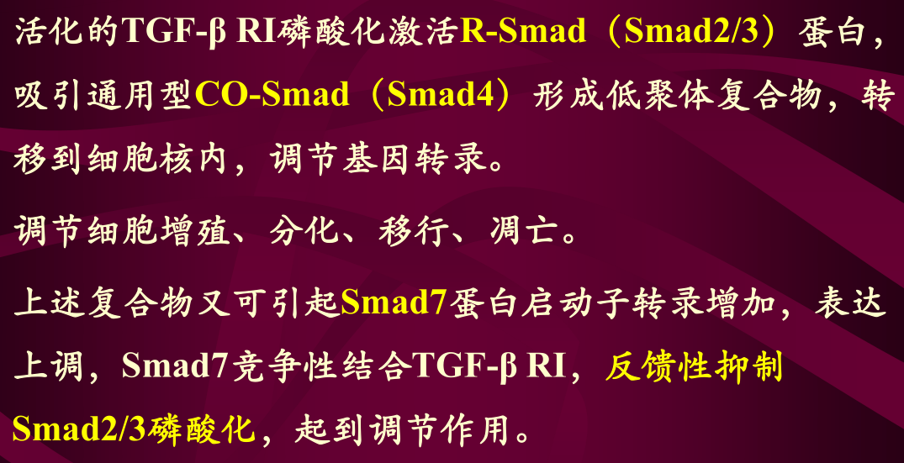

2. 非依赖Smad通路

#### 酪氨酸磷酸脂酶活性受体

SHP

#### 鸟苷酸环化酶活性受体

cGMP→PKG

膜结合型和胞质型GC

心房钠尿肽

#### 酪氨酸蛋白激酶联系的受体

跨膜蛋白，胞内区与细胞中游离的酪氨酸蛋白激酶（非受体酪氨酸蛋白激酶）结合

两大家族：

- 与非受体酪氨酸蛋白激酶中的Src蛋白家族（8种）相联系的受体
- 与非受体酪氨酸蛋白激酶中的Janus激酶家族相联系的受体

1. Janus激酶，JAK-STAT途径

   （1）底物：STAT

   - 具有SH2、SH3结构域
   - 能被Janus激酶磷酸化
   - 形成二聚体，进入细胞核，调节特定基因表达

   （2）功能：大多数调节免疫和造血系统细胞因子的受体

### 与生长发育相关的信号通路

#### Notch通路

三次酶切

####  Wnt通路

Wnt/β-catenin途径

#### Hedgehog通路

#### Hippo-YAP通路

#### Integrin整联蛋白通路

胞外基质信号通路，细胞贴壁生长，形成黏着斑，促进增殖

### 细胞信号转导的基本特征

## 第九章 细胞增殖与调控

细胞两个基本的生命特征：增殖和分化

### 一、细胞增殖

#### 细胞分裂

1. 无丝分裂
2. 有丝分裂
3. 减数分裂

#### （一）有丝分裂

1. 细胞周期

   - 间期：G1期、S期、G2期
   - 分裂期：前期、中期、后期、末期
   - S期长，M期短，G1和G2期变化大

2. 子细胞命运

   - 继续进入细胞周期。周期中细胞
   - 退出细胞周期，进入静止期（G0期）
     - 暂时停止分裂
     - 永久失去分裂能力，终末分化细胞

3. 过程

   （1）G1期：DNA合成前期

   - 上一次分裂结束，下一次分裂开始，DNA合成前的时间间隙
   - 三种趋向
     - 进入S期：细胞继续分裂
     - 进入G0期
     - 进入终止期
   - 限制点或检验点：G1/S转换点（S启动点）
   - 生化事件：细胞增大，rRNA含量↑，DNA合成相关酶含量↑，各种蛋白质合成↑，染色体解螺旋化——为DNA合成作准备

   （2）S期

   - 生化事件
     - DNA复制，含量增加一倍，每个染色体复制成两个染色单体
     - 组蛋白及有关蛋白合成，加倍
     - 复制和合成后的DNA、组蛋白形成核小体（10nm丝，染色体的一级结构）

   （3）G2期

   - 合成染色体凝聚因子（或称有丝分裂因子），促进染色体凝聚，包装
     - 染色体凝聚因子在G2期开始合成，到M期合成达到高峰
     - 早熟染色体凝聚PCC
   - 合成有丝分裂器成份：微管蛋白、ATP合成等

   （4）M期

   - 前期：染色体凝集，成对中心粒出现在细胞两极，核仁、核膜解体、消失
   - 中期：核膜破裂、染色体排在赤道面，纺锤体装配形成，两条姐妹染色单体在纺锤丝牵引下开始分离，向细胞两极移动
     - 两条姐妹染色单体相互连接的部位，称着丝粒
     - 着丝点：着丝粒外蛋白结构
     - 着丝点与着丝粒异染色质DNA组成动粒
   - 后期：姐妹染色单体分开，并向两极移动
     - 黏连蛋白被后期促进复合物APC降解
     - M周期蛋白泛素化降解
   - 末期：染色体到达两极，开始解螺旋化，成丝状染色质，出现核仁，形成核膜，最后出现子核。细胞质分裂

4. 细胞周期运行调控

   （1）细胞促分裂因子MPF

   - M期细胞中存在诱导染色质凝缩的因子
   - 卵细胞成熟促进因子
   - 一种二聚体，含p32和p45两个亚单位，两者结合后，表现出蛋白激酶活性
   - p34cdc2为催化亚基，周期蛋白B为调节亚基

   （2）细胞分裂周期基因 *cdc*和周期蛋白（cyclin）调节细胞周期的运转

   - *cdc*基因：一类与细胞分裂和细胞周期调控有关的基因，产物是蛋白激酶和蛋白磷酸水解酶

   （3）周期蛋白：细胞周期内不同时期表达的一类细胞周期调节蛋白

   - 在G1期表达的，称 G1期周期蛋白
   - 在M期表达的，称 M期周期蛋白
   - 周期蛋白框

   （4）CDK：活性受周期蛋白调节

   - 细胞内还存在对CDK起负调节作用的蛋白质，称CDK抑制因子（p21，p27）CDKI
   - 激酶和磷酸酶调节

   （5）Cyclin蛋白降解

   - SCF和APC

5. 染色体

   中期染色体形态

   - 每条中期染色体由两条平行排列的姐妹染色单体组成
   - 两条姐妹染色单体相互连接的部位，称着丝粒
   - 着丝点：着丝粒外蛋白结构
   - 着丝点与着丝粒异染色质DNA组成动粒
   - 在着丝粒处，由于染色质相对松散、伸展，因此这部分染色体比较细小，形成一个缢痕，称初缢痕。长短臂

#### （二）减数分裂

1. 基本特点

   - 减数分裂是一种特殊的细胞分裂方式，有人认为是一种特殊的有丝分裂
   - 染色体由二倍数（2n）变成单倍数（n）的分裂过程

2. 过程

   - 减数分裂是由两次分裂组成的，分别称为第一次减数分裂和第二次减数分裂
   - 在第一次减数分裂之前也有一个间期，称前减数分裂间期

   （1）前减数分裂间期：包括G1、S、G2

   （2）前期 I

   - 细线期：在间期核内经过复制加倍的染色质开始浓缩为几条细而长的细线
   - 偶线期（合线期，配对期）：同源染色体配对
     - 这种成对存在的染色体在形态和遗传结构上相似，称同源染色体
     - 同源染色体配对，也称联会
     - 一对联会的同源染色体形成的复合体称为二价体或四分体
   - 粗线期
     - 联会后的同源染色体缩短，变粗，开始出现姐妹染色单体
     - 同源染色体的非姐妹染色单体间发生局部交换
   - 双线期
     - 染色体进一步缩短，变粗
     - 联会的同源染色体交换完毕，开始分离，部分联会复合体消失
   - 终变期
     - 染色体进一步螺旋化而缩短加粗，最后包装成典型的染色体
     - 但同源染色体间仍有部分交叉联系
     - 纺锤体开始形成，染色体向赤道面移动
     - 核仁、核膜消失

   （3）中期 I

   - 各对同源染色体排列在赤道面上
   - 在纺锤丝的牵引下，两条同源染色体分开，向两极移动

   （4）后期 I

   - 两条同源染色体分别移至两极，每一极得到n条染色体
   - 染色体数目减半，只有n条，但是姐妹染色单体没有分开

   （5）末期 I

   - 核膜重建，核仁重新形成
   - 胞质分裂
   - 染色体解螺旋，变成细丝状

   （6）减数间期

   - 第一次减数分裂结束后，有两种情况：进入或直接第二次分裂
   - 减数间期，DNA不复制，染色体不加倍

   （7）第二次减数分裂

   - 包括前期 II、中期 II、后期 II、末期 II
   - 与有丝分裂过程基本一致

3. 与有丝分裂的差别

   - 有丝分裂是体细胞的分裂方式，而减数分裂主要发生在形成生殖细胞的过程中
   - 有丝分裂是一次细胞周期的过程，DNA复制一次，细胞分裂一次，染色体由2n→2n，DNA由2C-4C-2C；减数分裂是两次细胞周期，但DNA复制一次，细胞分裂二次，染色体由2n→n，DNA由2C-4C-2C-1C
   - 有丝分裂中，每个染色体独立活动，同源染色体不发生作用；而减数分裂中，同源染色体发生配对、联会、交叉、交换

### 二、细胞分化

#### （一）概念

#### （二）分化的可逆性

逆分化和再分化

#### （三）细胞分化的机制

基因的顺序表达

管家基因和组织特异性基因

1. 转录前水平：染色质和基因结构水平
2. 转录水平：原核生物操纵子学说
   - 真核生物：
     - 表观遗传修饰：组蛋白密码子
     - 顺式作用元件调控
     - 反式作用因子调控
     - 反义RNA的调控
     - 非编码RNA
3. 转录后水平：hnRNA
4. 翻译水平的调控
5. 翻译后水平的调控
   - 磷酸化、去磷酸化……
   - 定位、稳定性、活性

#### （四）影响细胞分化的因素

转录因子表达和组合是主要的直接因素

1. 受精卵细胞质的不均一性
2. 信号分子、微环境和位置信息决定细胞分化命运

### 三、癌细胞和癌基因

#### （一）癌细胞的基本特征

1. 无限分裂：生长失去控制
2. 失去接触抑制
3. 其他：侵袭、转移等

Warburg效应：增殖优先

癌基因：病毒癌基因、细胞癌基因

抑癌基因：Rb、p53

## 细胞衰老与死亡

### 一、细胞衰老

#### （一）衰老机制假说

1. 氧化性损伤假说
2. 端粒与衰老
3. 其他：衰老相关基因，表观遗传调控

#### （二）衰老的特征

### 二、细胞死亡

以往的认识：

坏死、凋亡

意外细胞死亡、调节性细胞死亡

#### （一）多样性

坏死、凋亡、胀亡、类凋亡、焦亡、坏死性凋亡、Entosis、Emperitosis、自噬、铁死亡……

#### （二）细胞凋亡

1. 定义：细胞凋亡（apoptosis）或程序性细胞死亡（programmed cell
   death, PCD）是调控机体发育、维护内环境稳定，由基因控制的
   细胞主动死亡过程。

2. Apoptosis与PCD的差异

   - Apoptosis：形态学概念，有些程序化，有些非程序化。有些程序化，有些非程序化
   - PCD：功能性概念，都是程序化，存在于发育细胞

3. 生物学意义：细胞分裂与细胞凋亡是矛盾的两个方面，通过矛盾双方的相互平衡，维持机体生长、发育以及对外界因素作用的平衡和稳定

   - 发育过程中
   - 组织细胞的自然更新
   - 清除多余的、发育不正常的细胞
   - 清除对机体有害的细胞
   - 清除受损的、有癌前病变或受病毒等感染的细胞

4. 凋亡的形态学特征

   （1）凋亡起始

   - 细胞表面特化结构如微绒毛消失
   - 细胞间的接触消失
   - 细胞膜保持完整，但失去选择透性
   - 线粒体完整，但核糖体从内质网脱离， 内质网腔膨胀，逐步与质膜融合
   - 染色质固缩，形成月芽形，沿核膜分布

   （2）凋亡小体的形成

   - 染色质断裂为大小不等的片段
   - 染色质片段与某些细胞器如线粒体一起聚集，被反折的细胞膜包围
   - 从外观上看，细胞表面产生了许多泡状或芽状突起
   - 泡状或芽状突起逐渐分隔，形成一个个凋亡小体

   （3）凋亡小体的清除

   - 凋亡小体逐渐被邻近的细胞吞噬并消化
   - 一般细胞凋亡过程4～9小时，其中从凋亡开始到凋亡小体的出现仅几分钟

5. 凋亡的生化特征

   （1）DNA片段化

   - 由核酸内切酶将核小体间的连接DNA降解，形成长度为180－200bp整倍数的寡聚核苷酸片段
   - “梯状”条带。而坏死时DNA随机断裂，呈“弥散”状
   - 少数凋亡不出现ladder

   （2）DNA片段化有多种核酸酶的参与

   （3）多种蛋白酶参与凋亡

   （4）Ca2+、ROS、胞浆pH变化等

   （5）大分子的合成（凋亡相关的蛋白质或酶）

   （6）线粒体活性与功能变化

   （7）质膜中膜脂双层不对称性丧失

   - 磷脂酰丝氨酸（PS，通常只存在于质膜内侧）暴露（外化）、神经鞘磷脂（SM）水解，释放神经酰胺（ceramide, CM，启动凋亡的信号分子）。
   - 其中PS外化可用PS特异结合的膜联蛋白V（Annexin-V-FITC）检测

6. 细胞凋亡的诱导因子

   （1）生理性诱导因子

   - 细胞因子或生长因子
   - 激素
   - 神经递质
   - 细胞因子或激素的下降
   - Ca2+
   - 细胞表面蛋白

   （2）损伤相关诱导因子

   - 病原微生物
   - 氧化应激与自由基
   - 环境化合物（环境毒物）
   - 缺血和缺氧
   - 热休克
   - 细胞毒T淋巴细胞（CTL）
   - 癌基因与抑癌基因

   （3）治疗相关诱导因子（肿瘤）

   - 化疗药物
   - 放射线
   - 生物治疗因子
   - 中药制剂

7. 抑制因子

   （1）生理性抑制因子

   （2）病毒基因

   （3）凋亡信号通路化学阻断剂

8. 细胞凋亡的调控基因

   （1）ced基因家族

   - 第一组：3个，ced-3、ced-4、ced-9。其中ced-3、ced-4是决定细胞凋亡所必须的（促进凋亡）， ced-9抑制凋亡
   - 第二组：7个，ced-1、ced-2、ced-5~8、ced-10，与凋亡细胞被吞噬有关
   - 第三组：核酸酶基因nuc-1，与DNA裂解有关
   - 第四组：调节特异类型细胞凋亡，包括ces-1、ces-2、egl-1、her-1

   （2）bcl-2家族

   - Bcl-2是一种原癌基因，是ced-9在哺乳类中的同源物
   - 抑制细胞凋亡

   （3）ICE基因家族

   - 白细胞介素1β转化酶家族
   - 线虫ced-3在哺乳类中的同源物
   - ICE和CED-3的同源物统称 Caspase

   （4）p53基因：促进凋亡

   （5）其它癌基因

9. 细胞凋亡信号转导通路

   Mit、ER、TNF受体家族介导的凋亡信号转导通路

   内源（caspase-9起始）、外源（caspase-8起始）

   （1）TNF受体家族介导凋亡信号转导通路

   - 死亡配体：TNF配体家族。II型跨膜糖蛋白（C端在胞外）
   - 死亡受体：TNF受体超家族。I型膜蛋白。信号肽、富含半胱氨酸的胞外区、跨膜区及胞内区，其中许多受体胞内区含有一个死亡结构域（death domain, DD），与受体下游的受体结合蛋白发生作用而发挥效应
   - 死亡受体结合蛋白：接头分子
     - TRADD：C端有一个死亡结构域结合区
     - FADD：C端有一个死亡结构域结合区，N端有一个死亡效应结构域
     - RIP：C端是死亡结构域，N端与蛋白激酶具有同源性
     - Daxx

   （2）线粒体介导的内源途径

   - 细胞色素C
   - 凋亡复合体，caspase-9

10. 凋亡中的关键因子Caspase蛋白酶家族

   天冬氨酸特异性的半胱氨酸蛋白水解酶

   （1）基本特征

   - 在活性部位含半胱氨酸
   - 在天冬氨酸残基之后切割底物蛋白

   激活的Caspase可作用于自身或其它Caspase酶原，按顺序依次激活，形成信号转导机制的酶级联反应

   （2）底物

   - 炎症因子
   - 死亡底物
     - PARP、actin、核纤层蛋白

#### （二）细胞焦亡

程序性坏死，伴随炎症Caspase1/4/5/11的活化

1. 主要特征
   - 焦亡细胞在形态上同时具有凋亡和坏死特征
   - 焦亡细胞膜完整性丧失后胞内容物释放，水分内流，细胞肿胀继而膜破裂，细胞发生渗透性溶解，诱发炎症反应

切割白介素、GSDME

炎性小体

#### （三）程序性细胞坏死

由信号通路调控的坏死

由RIPK1及其下游RIPK3激酶以及调控因子MLKL介导

病理条件下继发性的死亡

#### （四）自噬与自噬性细胞死亡

细胞内溶酶体降解自身细胞器和其他大分子的过程

自噬开始时细胞质中形成由双层膜包裹的待降解物质的泡状结构，称自
噬泡。大部分为双层膜

随后自噬泡与内涵体融合形成自噬内涵体，然后与溶酶体融合，自噬泡所包裹的待降解物质进入溶酶体，形成自噬溶酶体

在某些条件下，细胞自噬也能导致细胞死亡，并证明自噬的发生受多种基因的严格调控。

自噬与凋亡：自噬是细胞内的一种自食现象，是程序化细胞存活。凋亡是自杀现象，是程序化细胞死亡。二者共用相同的刺激因素和调节蛋白

分类：巨自噬、微自噬、分子伴侣介导的自噬

选择性自噬

自噬的分子调控

微管相关蛋白轻链3（MAP-LC3）：哺乳动物细胞中常见的自噬小体标记蛋白之一。LC3-II/I（膜型/胞浆型）比值的大小评估自噬水平的高低。

自噬流

- LC3转化
- GFP-LC3 单荧光自噬指示体系
- mRFP-GFP-LC3 双荧光自噬指示体系

## 干细胞

### 一、基本概念

在功能上具有自我更新（self-renewal）能力和不同分化潜能的细胞

在特定条件下，分化成一种或多种具有特定功能的成熟细胞类型

### 二、基本类型

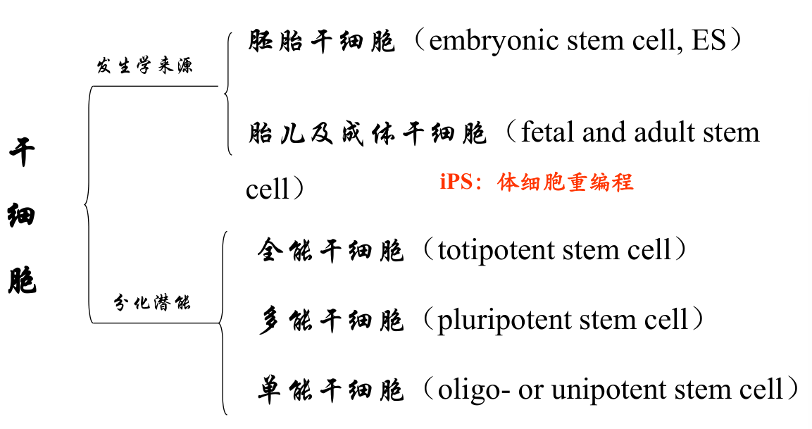

分化潜能

- 全能干细胞：受精卵、8细胞期
- 多能干细胞：ES、iPSC
- 多潜能干细胞：造血干细胞
- 单能干细胞

### 三、基本特性

自我更新

分化潜能

慢周期

不对称分裂

### 四、胚胎干细胞（ES）

来源于早期囊胚内细胞团或原始生殖嵴或畸胎瘤

处于个体发育的顶端，能分化成组成机体的所有类型细胞，即多向分化潜能，或分化的全能性。

ES细胞分离培养：ES细胞在体外特定条件下，能旺盛增殖并保持多能
性，从而形成胚胎干细胞系

- ES细胞：胚胎干细胞，囊胚内细胞团来源
- EG细胞：胚胎生殖细胞，原始生殖嵴来源
- EC细胞：胚胎癌性细胞，畸胎瘤来源

### 五、ES细胞干性维持

调控干性相关的转录因子

### 六、干细胞体外定向分化

### 七、诱导性全能干细胞（iPSC）

iPS是一类由非多能干细胞（如成体体细胞）被诱导后表达特定基因而成的去分化细胞。

体细胞重编程：将已分化的细胞通过体细胞核移植或转录因子诱导等手段，重建其表观遗传标记，恢复胚胎期多能性或全能性状态的过程

Oct3/4, Sox2, c-Myc, Klf4

证明iPS满足多能性的金标准——四倍体补偿

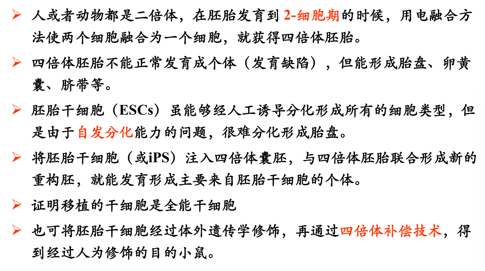

### 八、成体干细胞

存在于成体特定组织，具有自我更新能力和分化潜能的种子细胞

如骨髓来源的造血干细胞（HSCs）和间充质干细胞（MSCs）, 脑来源的神经干细胞（NSCs）等。

### 九、肿瘤干细胞

研究表明，在肿瘤中存在一类与干细胞具有相似生物学活性的细胞群体，称为肿瘤干细胞或肿瘤起始细胞

模式识别受体了解

酪氨酸蛋白激酶、丝氨酸/苏氨酸、非受体酪氨酸受体重点

基因表达调控的基本特征过一遍

癌基因的产物（5种）

（1）作用于表面受体的生长因子（如对应于PDGF-2的c-sis蛋白）。

（2）生长因子受体，如编码CSF-1受体的fms。

（3）将信号从膜受体传入细胞内的转导蛋白，如具有GTP酶活性的ras癌基因家族的产物。

（4）影响DNA转录的细胞核因子（如c-fos，c-myc）。

（5）细胞周期调节物，如细胞周期蛋白和细胞周期蛋白依赖性激酶。

衰老过一下，重点死亡（**凋亡**、焦亡、坏死性凋亡），整体过程。**死亡受体**

自噬研究方法（报告）

填空、名词解释、问答题
